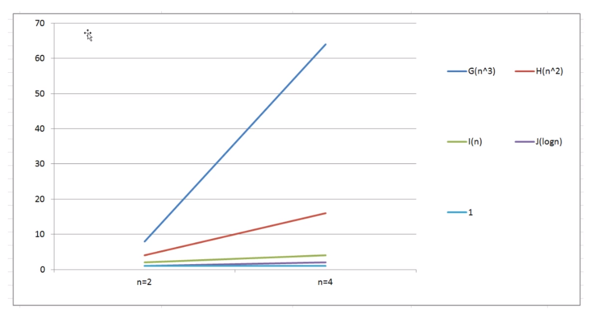
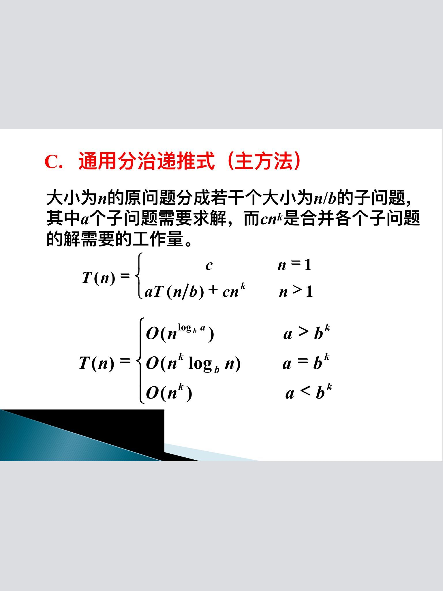

# 1-时间复杂度
@(Knowledge)[Auspice Tian][2021年1月24日21:07:14]

---

[TOC]

---

<div STYLE="page-break-after: always;"></div>


## 1.1 概念
> 算法的渐进时间复杂度，简称时间复杂度
>
> 分为 *事后分析*  和 *事前分析* 两种

事前分析
1. 算法采用的策略和方案
2. 编译产生代码质量
3. 问题的输入规模
4. 机器执行指令的速度

**`将核心操作的次数与输入规模关联`**

### 1.1.1 函数渐进增长
> 给定两个函数 *f(n)* 和 *g(n)*  ，如果存在一个整数 *N* 使得对于所有 *n >N* , *f(n)* 总是比 *g(n)* 大，那么我们称 *f(n)* 的渐进增长快于 *g(n)*



<div STYLE="page-break-after: always;"></div>

**结论**
- 算法函数中的常数可以忽略
- 算法函数中最高次幂的常数因子可以忽略
- 算法函数中最高次幂越小，算法效率越高

### 1.1.2 大O记法
> 语句总的执行次数 *T(n)* 是关于问题规模 n 的函数，进而分析 *T(n)* 随着 n 的变化情况并确定 *T(n)* 的量级。记为 **T(n) = O(f(n))** 
>
> 表示随着问题规模 n 的增大，算法执行时间的增长率和 *f(n)* 的增长率相同
>
> *f(n)* 表示问题规模 n 的某个函数

- 执行次数 <=> 执行时间

**规则**
- 用常数1取代运行时间中的所有常数
- 在修改后的次数中，只保留高阶项
- 如果最高阶项存在且常数因子不为1，则去除常数因子

**1-100求和**
```java
# 累加
public static void main(String[] args){
	int sum = 0;//执行一次
	int n = 100;//执行一次
	for(int i = 0; i <= n;++i){//执行n+1次
		sum += i;//执行n次数
	}	

	System.out.println("sum=",sum);
}
# 执行 2n+3 次
# 大O记法 O(n)
# -------------------------------------------
# 高斯公式
public static void main(String[] args){
	int sum = 0;//执行1次
	int n = 100;//执行1次
	sum = (n+1)n/2;//执行1次
	System.oput.println("sum=",sum);
}
# 执行3次
# 大O记法 O(1)
```

#### 最坏情况
> 查找问题

```java
public int search(int num){
	int[] arr = [11,10,8,9,7,22,23,0];
	
	for(int i = 0;i < arr.length;++i){
		if(num == arr[i])
			return i;
	}

	return -1;
}
```

**最好情况:**
- 查找的第一个数字就是期望数字，*O(1)*

**最坏情况:**
- 查找的最后一个数字，才是期望数字，*O(n)*

**平均情况:**
- 任何数字查找的平均成本为 *O(n)*

### 1.1.3 时间复杂度排序
$$O(1) < O(logn) < O(nlogn) < O(n^2) < O(n^3) < O(2^n) < O(n!) < O(n^n)$$

<div STYLE="page-break-after: always;"></div>

<h2 id="simpleAnalyse">1.2 简单时间复杂度分析</h2>
### 1.2.1 非函数调用
1. 线性阶
> 非嵌套设计线性阶，随输入规模的扩大，呈直线增长

```cpp
int sum = 0;//执行一次
int n = 100;//执行一次
for(int i = 0; i <= n;++i){//执行n+1次
	sum += i;//执行n次数
}
```

2. 平方阶
> 循环嵌套
```cpp
int sum = 0;
int n = 100;
for(int i = 1;i <= n;++i){//执行 n+1 次
	for (j = 1;j <= n;++j){//执行 n*(n+1) 次
		sum += i;//执行 n^2 次
	}
```

3. 立方阶
> 三层嵌套循环

4. 对数阶
```cpp
int i=1,n=100;
while(i < n){
	i = i*2;
}
```
循环次数：
$$ x = log_2n $$
时间复杂度：
$$O(logn)$$

> 对数阶，由于输入规模 n  的增大，不管底数多少，增长率都相同，所以忽略底数

5. 常数阶

### 1.2.3 函数调用
1. 
```java
public static void main(String[] args){
	int n = 100;
	for(int i = 0;i < n;++i){
		show(i);
	}
}

private static void show(int i){
	System.out.println(i);
}
```
> 时间复杂度为 *O(n)*

2. 
```java
public static void main(String[] args){
	int n = 100;
	for(int i = 0;i < n;++i){
		show(i);
	}
}

private static void show(int i){
	for(int j = 0;j < i;++j){		
		System.out.println(i);
	}	
}
```
> 时间复杂度 *O(n^2)*

<div STYLE="page-break-after: always;"></div>

## 1.3 计算方法
**一般法则**
- *for* 循环
	- 一次 *for* 循环至多是该 *for* 循环包含的 **内语句运行时间** 乘 **迭代次数**
- 嵌套的 *for* 循环
	- 从里到外分析循环
- 顺序语句
	- 各语句运行时间求和
- *if/else* 语句
	- 两执行函数中运行时间长的

### 1.3.1 循环主体中的变量参与循环条件的判断
找出主体语句中与 *T(n)* 成正比的循环变量，将之代入条件运算

```cpp
int i = 1;
while(i <= n){
	i = i*2;
}
```
> 执行次数 *t* ，有 $2^t \leq n$ ,得 $T(n) = O(log_2n)$

```cpp
int y = 5;
while((y+1)*(y+1)){
	y = y+1;
}
```
> 执行次数 $t = y-5$ ,有 $y=t+5$,代入得 $t < \sqrt{n}-6$,即 T(n) = O($\sqrt{n}$)

#### 运算时间中的对数
- **如果一个算法用时间O(1)将问题的大小削减为原来的一部分，那么该算法就是O(logN)**
- **如果用常数时间把问题减少一个常数，那么这种算法就是O(N)**

<div STYLE="page-break-after: always;"></div>

##### 折半查找
```cpp
int BinarySearch(const ElementType A[],ElementType X,int N){
	int Low,Mid,High;

	Low = 0,High = N-1;
	while(Low <= High){
		Mid = (Low+High)/2;
		if(A[Mid] < X){
			Low = Mid + 1;
		}else{
			if(A[Mid] > X){
				High = Mid-1;
			}else{
				return Mid; //Found
			}
		}
	}

	return NotFound; //NotFound is defined as -1
}
```
分析：提供了 *O(logN)* 以内的查找操作，但所有其他操作均需要 *O(N)*

##### 欧几里得算法
定理：如果 $M > N$ ,则 $M \mbox{ mod N} < \frac{M}{2}$

```cpp
unsigned int Gcd(unsigned int M,unsigned int N){
	unSigned int Rem;

	while(N > 0){
		Rem = M % N;
		M = N;
		N = Rem;
	}
	
	return M;
}
```

##### 幂运算
```cpp
long int Pow(long int X,unsigned int N){
	if(N == 0)
		return 1;
	if(N == 1)
		return X;
	if(isEven(N))
		return Pow(X*X,N/2);
	else 
		return Pow(X*X,N/2) * X;
}
```

### 1.3.2 循环主体中的变量与循环条件无关
> 采用归纳法或直接累计循环次数

多层循环从内到外分析，忽略单步语句、条件判断语句，只关注主体语句的执行次数

#### 非递归程序
> 直接累计次数即可，参见-[简单的时间复杂度分析](#simpleAnalyse)

#### 递归程序——分治策略
##### 递归程序四条准则
- 基准情形：有结束条件
- 不断推进：每次调用都朝向基准情形推进
- 设计法则：假设所有的递归调用都能进行
- 合成效益法则：避免重复计算

##### “分治”策略
- ”分“：将大问题大致分为两大致相等的子问题，用递归求解
- “治”：将两个子问题的解合并到一起并可能再做些少量的附加工作，得到整个问题的解



##### `eg`
已知 
\begin{cases} 
T(1) = 1 \\
T(N) = 2T(\frac{N}{2}) + O(N)
\end{cases}

<div STYLE="page-break-after: always;"></div>

**1. 等号右边连续代入递归关系**
\begin{align}
T(N) & = 2T(\frac{N}{2})+N \notag \\
	&= 2[2T(\frac{N}{4})+\frac{N}{2}]+N \notag \\
	& =2\{2[2T(\frac{N}{8})+\frac{N}{4}]+\frac{N}{2}\}+N \notag \\
	& = ... \notag \\
	& = 2^kT(\frac{N}{2^k}) + kN \notag
\end{align}

由 $k = logN$ 得
$$T(n) = NT(1)+NlogN = Nlog(N) + N$$

<span id="add">**2. 叠缩求和**</span>
> 用 *N* 去除递归关系中的两边，不断替换

\begin{align}
\frac{T(N)}{N}  &= \frac{T(\frac{N}{2})}{\frac{N}{2}} + 1  \notag \\ \notag \\ 
\frac{T(\frac{N}{2})}{\frac{N}{2}} &= \frac{T(\frac{N}{4})}{\frac{N}{4}} + 1  \notag \\ \notag \\ 
\frac{T(\frac{N}{4})}{\frac{N}{4}} &= \frac{T(\frac{N}{8})}{\frac{N}{8}} + 1  \notag \\ \notag \\ 
\vdots \notag \\ 
\vdots \notag \\ \notag \\ 
\frac{T(2)}{2} &= \frac{T(1)}{1} + 1\notag \\ \notag \\ 
\end{align}

将等号左边的所有相相加等于右边所有项的和，结果为
\begin{align}
\frac{T(N)}{N} &= \frac{T(1)}{1} + logN \notag \\ \notag \\ 
&=Nlog(N) + N \notag
\end{align}

<div STYLE="page-break-after: always;"></div>

## 1.4 常见算法时间复杂度总结
| 描述       | 增长的数量级 | 说明     | 举例           |
| :--------- | :----------- | :------- | -------------- |
| 常数级     | 1            | 普通语句 | 将两个数相加   |
| 对数级     | logN         | 二分策略 | 二分查找       |
| 线性级     | N            | 单层循环 | 找出最大元素   |
| 线性对数级 | NlogN        | 分治思想 | 归并排序       |
| 平方级     | N^2          | 双层循环 | 检查所有元素对 |
| 立方级     | N^3          | 三层循环 | 检查所有三元组 |
| 指数级     | 2^N          | 穷举查找 | 检查所有子集   |

<div STYLE="page-break-after: always;"></div>

## 1.5 最大子序列和问题的解
### 1.5.1 遍历所有子串，对子串的子序列依次求和
```cpp
int MaxSubSequenceSum(const int A[],int N){
	int ThisSum,MaxSum,i,j,k;
	
	MaxSum = 0;
	for(i = 0;i < N;++i){
		for(j = i;j < N;++j){//遍历所有子串
			ThisSum = 0;
			for(k = i;k <= j;++k)//当前子串的所有子序列求和
				ThisSum += A[k];
	
				if(ThisSum > MaxSum){
					MaxSum = ThisSum;
				}		
		}
	}

	return MaxSum;
}
```

\begin{align}
\sum_{i = 0}^{N-1}{\sum_{j = i}^{N-1}{\sum_{k = i}^{j}{1}}} \notag  \\ 
\sum_{k = i}^{j}{1} &= j-i+1 \notag \\ 
\sum_{j = i}^{N-1}{ j-i+1} &= \frac{(N-i+1)(N-i)}{2} \notag \\ \notag \\
\sum_{i = 0}^{N-1}{ \frac{(N-i+1)(N-i)}{2}} & = \sum_{i = 1}^{N}{ \frac{(N-i+1)(N-i)}{2}} \notag \\ \notag \\
&= \frac{1}{2}\sum_{i=1}^{N}i^2-(N+\frac{3}{2})\sum_{i=1}^{N}i + \frac{1}{2}(N^2+3N+2)\sum_{i = 1}^{N}1 \notag \\ \notag \\
&= \frac{N^3+3N^2+2N}{6} \notag
\end{align}

时间复杂度为 $O(N)$

### 1.5.2 记录中间累加量
$$\sum_{k = i}^{j}{A_k} = A_j+\sum_{k = i}^{j-1}{A_k}$$
```cpp
int MaxSubSequenceSum(const int A[],int N){
	int ThisSum,MaxSum,i,j,k;
	
	MaxSum = 0;
	for(i = 0;i < N;++i){
		ThisSum = 0;
		for(j = i;j < N;++j){//遍历所有子串
			ThisSum += A[k];

			if(ThisSum > MaxSum){
				MaxSum = ThisSum;
			}				
	}
	return MaxSum;
}
```
时间复杂度为 $O(N^2)$

### 1.5.3 分治法
> 将序列分成大致相等的两部分。

最大子序列和可能在三处出现：
- 数据的左半部分；
	- 递归求解
- 数据的右半部分；
	- 递归求解
- 中间部分
	- 分别求出前、后部分的最大和，相加中间部分最大和

```cpp
int MaxSubSum(const int A[],int Left,int Right){
	int MaxLeftSum,MaxRightSum;
	int MaxLeftBorderSum,MaxRightBorderSum;
	int LeftBorderSum,RightBorderSum;
	int Center,i;

	if(Left == Right){//只有一个元素
		if(A[Left] > 0)//该元素非负即为最大和
			return A[Left];
		else{
			return 0;
		}
	}
	
	Center = (Left+Right) / 2;
	MaxLeftSum = MaxSubSum(A,Left,Center);
	MaxRightSum = MaxSubSum(A,Center,Right);

	MaxLeftBorderSum = 0,LeftBorderSum = 0;
	for(i = Center;i >= Left;i--){
		LeftBorderSum += A[i];
		if(LeftBorderSum > MaxLeftBorderSum)
			MaxLeftBorderSum = LeftBorderSum;
	}

	MaxRightBorderSum = 0,RightBorderSum = 0;
	for(i = Center;i >= Left;i--){
		RightBorderSum += A[i];
		if(RightBorderSum > MaxRightBorderSum)
			MaxRightBorderSum = RightBorderSum;
	}

	return Max3(MaxLeftSum,MaxRightSum,MaxLeftBorderSum+MaxRightBorderSum);
}

int MaxSubSequenceSum(Const A[],int N){
	return MaxSubSum(A,0,N-1);
}
```
\begin{cases} 
T(1) = 1 \\
T(N) = 2T(N/2) + O(N)
\end{cases}
时间复杂度为 $O(NlogN)$

> [计算过程参上](#add)
>
> 其实 **分治法** 很有特点，一般都是两个 logN 与一个处理函数的代价和

### 1.5.4 最简
```cpp
int MaxSubSequenceSum(const int A[],int N){
	int ThisSum,MaxSum,j;
	
	ThisSum = MaxSum = 0;
		for(j = 0;j < N;++j){
			ThisSum += A[k];

			if(ThisSum > MaxSum){
				MaxSum = ThisSum;
			}else if(ThisSum < 0){
				ThisSum = 0;
			}				
	}
	return MaxSum;
}
```

时间复杂度为 $O(N)$