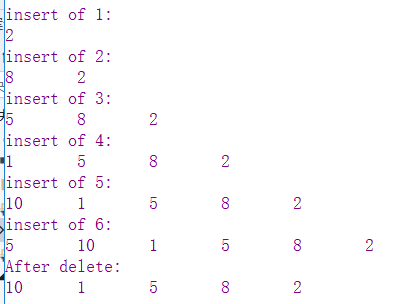

# 2-线性表
@(Knowledge)[Auspice Tian][2021年1月24日21:08:14]

---

[TOC]

---

<div STYLE="page-break-after: always;"></div>

提示：
> 1. 这部分代码要求最优性能（时间、空间）
> 2. 不要求实际可执行性
> 3. 表达清楚算法思想和步骤
> 4. 只能用 *C/C++* 实现

## 2.1 概念
> **线性表**：具有相同数据类型的 *n* （$\ge0$）个 数据元素的有限序列
>
> *n=0* 为 *空表*

表示：
> L = ($a_1,a_2...,a_i,a_{i+1},...,a_n$)

（1）存在唯一的一个被称为“第一个”的数据元素—— $a_1$：表头元素

（2）存在唯一的一个被称为“最后一个”的数据元素——$a_n$：表尾元素

（3）除第一个之外，集合中的每个数据元素只有一个 *直接前驱*

（4）除最后一个外，集合中每个数据元素只有一个 *直接后继*

### 2.1.1 特点
1. 表中元素个数有限
<br/>
2. 表中元素 具有逻辑上的顺序性，表中元素有先后顺序
<br/>
3. 表中元素 都是数据元素
	- 表中元素具有抽象性：只讨论元素间的逻辑关系，不考虑具体表示什么
<br/>
4. 表中元素 数据类型相同
	- **每个元素占用相同大小的存储空间**

> 当数据元素由若干数据项组成：
> - 记录：数据元素
> - 文件：含有大量记录的线性表

### 2.1.2 `线性表是一种逻辑结构`
> 表示元素之间一对一的相邻关系。

两种存储结构
- 顺序存储
- 链式存储

线性表操作的实现
- 存储结构不同，算法实现也不同
- &：C++引用
<div STYLE="page-break-after: always;"></div>

## 2.2 线性表的顺序存储——顺序表
> Loc($a_i$) = Loc($a_0$) + ($i-1$) * sizeof(ElemType)

**位序与下标的区别**
- 位序：1 $\le$ i $\le$ length
- 下标：0 $\le$ i $<$ lengh

**动态分配**
动态分配属于 `顺序存储` 结构，分配 *n* 个空间时仍需要 *n* 个连续存储空间

### 2.2.1 特点
- 随机存取——O(1)
- 存储密度高——只存数据元素
- 存储关系映射逻辑关系
- 插入删除效率低

### 2.2.2 结点定义
```cpp
/* 静态分配 */
# define MaxSize 20
typedef struct {
	ElemType data[MaxSize];
	int length;
}SqList;

/* 动态分配 */
# define InitSize 10
typedef struct {
	ElemType *data;
	int length, MaxSize;
}SqList;
```

<div STYLE="page-break-after: always;"></div>

### 2.2.3 基本操作实现
顺序表一般直接声明数组即可
```cpp
bool ListInsert(SqList &L, int i, ElemType e) {
	//位序不合法：小于1或者大于长度+1
	if (i < 1 || i > L.length + 1)
		return false;
		
	**注意：插入位置元素与之后元素要后移**
	int j;
	for (j = L.length; j >= i; --j) {//第i个(包括)元素后移
		L.data[j] = L.data[j - 1];
	}
	L.data[i - 1] = e;//将第i个元素放入

	L.length++;

	return true;
}

bool ListDelete(SqList &L, int i, ElemType &e) {
	if (i < 1 || i > L.length)
		return false;

	e = L.data[i - 1];//返回待删除元素
	int j;
	for (j = i - 1; j < L.length; ++j)
		L.data[j] = L.data[j + 1];//从第i个元素，将其后继元素前移一位

	L.length--;

	return true;
}
```


<div STYLE="page-break-after: always;"></div>

|    ——————   |  插入 | 删除   |按值查找|
| -------- :| :--------| :------ |
| 操作    |   移动元素 |  移动元素  |遍历|
|期望|$$\sum_{i=1}^n{p_i(n-i+1)}$$|$$\sum_{i=1}^nq_i{(n-i)}$$|$$\sum_{i=1}^n{r_ii} $$|
|平均移动次数|$$\frac{1}{n+1}\sum_{i=1}^n{(n-i+1)} = \frac{n}{2}$$|$$\frac{1}{n}\sum_{i=1}^n{(n-i)} = \frac{n-1}{2}$$|$$\frac{1}{n}\sum_{i=1}^n{i} = \frac{n+1}{2}$$|
|平均时间复杂度| O(n)|O(n)|O(n)|

- 这里假设对每个元素访问的等概率,即期望中的概率为算数平均数

<div STYLE="page-break-after: always;"></div>

### 2.2.4 顺序表应用
`共性：长度已知`
- 遍历起始点
	- 若长度发生变化，从下标0开始遍历
	- 若长度不发生变化，从末尾开始遍历
- **插入**总是发生在顺序表尾
- 顺序表的修改操作，一定会涉及遍历元素
	- 只要是顺序遍历，时间复杂度不会低于O(n)
	- 最短时间遍历一般要用 **折半查找**

#### 类型1：两表合并
##### 顺序表合并O(n)
> **思路**：短表的下标为结果表的下标

```cpp
bool Merge(SqList A, SqList B, SqList &C) {//合并两表
	if (A.length + B.length > C.MaxSize + 1)
		return false;//超长退出
	int i = 0, j = 0, k = 0;
	while (i < A.length && j < B.length) {
		if (A.data[i] <= B.data[j]) {//两两比较，小者插入
			C.data[k++] = A.data[i++];
		}else {
			C.data[k++] = B.data[j++];
		}
	}
	//有一表为遍历完情况
	while (i < A.length) 
		C.data[k++] = A.data[i++];
	while (j < B.length) 
		C.data[k++] = B.data[j++];
	
	C.length = k;

	return true;
}
```

<div STYLE="page-break-after: always;"></div>

#### 类型2：快慢指针
##### 有序顺序表去重O(n)
> **思路**：快慢指针，i为慢指针，表示结果表长度，

```cpp
bool DeleteDuplicate(SqList &L) {//从有序顺序表删除重复值
	if (L.length == 0)
		return false;
	int i, j;//j为工作指针，遍历每个元素
	for (i = 0, j = 1; j < L.length; ++j)
		if (L.data[j] != L.data[i])
			L.data[++i] = L.data[j];
	L.length = i + 1;

	return true;
}
```

##### 删除指定元素O(n)
> **思路1**：快慢指针

```cpp
void DelX1(SqList &L,ElemType x) {//快慢指针，删除L中所有值为x的值，时间复杂度O(n),空间复杂度O(1)
	int k = 0;//慢指针，指示结果数组长度
	int i;//快指针，工作指针

	for (i = 0; i < L.length; ++i) {
		if (L.data[i] != x) {
			L.data[k++] = L.data[i];
		}
	}

	L.length = k;
}
```

##### 删除最小值O(n)
> **思路**：一次遍历，比较值

```cpp
bool DelMin(SqList &L ,ElemType &e) {//删除最小值,并用最后一个元素填充
	if (L.length == 0)
		return false;
	e = L.data[0];

	int pos = 0;
	for (int i = 0; i < L.length; ++i) {
		if (L.data[i] < e) {
			e = L.data[i];
			pos = i;
		}
	}
	//已知元素不重复时，可以这么做
	L.data[pos] = L.data[L.length - 1];
	L.length--;

	return true;
}
```


<div STYLE="page-break-after: always;"></div>

#### 类型3：逐一遍历

##### 无序顺序表去重[待优化]O(n^2)
> **思路**：sum记录表长。逐个遍历，查找结果表中是否存在

- [王道中提示用散列有时间复杂度为O(n)的算法]

```cpp
bool Union(SqList &L) {//无序顺序表去重，时间复杂度O(n^2)
	if (L.length == 0)
		return false;
	int i, j, sum = 1;
	//sum 为结果串的长度，i为结果串下标,j为待和合并串下标

	while (j < L.length) {
		for (i = 0; i < sum; ++i) {//遍历结果串，看是否已存在当前值
			if (L.data[i] == L.data[j])
				break;
		}
		if (i == sum)//如果不存在，则插入
			L.data[sum++] = L.data[j++];
		else//若存在则比较下一个
			j++;
	}
	L.length = sum;
	return true;
}
```

<div STYLE="page-break-after: always;"></div>

#### 类型4： 有序折半遍历
##### 转置——[折半]O(n)
> **思路**：折半，利用首尾索引之间的关系

```cpp
void Reverse(SqList &L) {//转置，空间复杂度为O(1)
	ElemType e;

	for (int i = 0; i < L.length / 2; ++i) {
		e = L.data[i];
		L.data[i] = L.data[L.length - 1 - i];
		L.data[L.length - 1 - i] = e;
	}
}
```
###### 转置Application
> **要求**：L.data[m+n]中存放的元素，前m个与后n个互换，然后m内互换，n内互换
> $a_1,a_2,a_3...a_n,b_1,b_2...b_m$
> --->$b_m,b_{m-1}...b_1,a_n,a_{n-1}...a_1$
> --->$b_1,b_2...b_m,a_1,a_2,a_3...a_n$
```cpp
bool ReverseApply(SqList &L, int left, int right) {
	//转置left->right内元素
	if (left >= right || right >= L.length)
		return false;
	int mid = (left + right) / 2;
	for (int i = 0; i <= mid - left; ++i) {
		ElemType e = L.data[left + i];
		L.data[left + i] = L.data[right - i];
		L.data[right - i] = e;
	}
}
bool Exchange(SqList &L, int m, int n) {
	//L.data[m+n]中存放的元素，前m个与后n个互换，然后m内互换，n内互换
	ReverseApply(L, 0, m - n + 1);
	ReverseApply(L, 0, n - 1);
	ReverseApply(L, n, m + n - 1);
}
```

<div STYLE="page-break-after: always;"></div>

##### 折半查找
> **要求**：有序线性表，查找x,
> - 若有，则与后继交换
> - 若无，则添加使仍为正序

```cpp
void BinarySearch(SqList L, ElemType x) {
	int low, high = L.length - 1,mid;

	while (low <= high) {
		mid = (low + high) / 2;
		if (L.data[mid] == x) {
			break;
		}
		else if (L.data[mid] < x) {
			low = mid + 1;
		}
		else
			high = mid - 1;
	}

	if (L.data[mid] == x && mid != L.length - 1) {//中间插入
		ElemType t = L.data[mid];
		L.data[mid] = L.data[mid + 1];
		L.data[mid + 1] = t;
	}

	if (low > high) {//无，则插入
		int i;
		for (i = n - 1; i > high; i--) {
			L.data[i + 1] = L.data[i];
		}
		L.data[i + 1] = x;
	}
}
```

<div STYLE="page-break-after: always;"></div>

#### 类型5：遍历+个数+索引关系
##### 删除指定元素O(n)
> **思路2**：一次遍历。记录连续为x的个数，将不为x的值插入到表尾

```cpp
void DelX2(SqList&L, ElemType x) {
	int k = 0, i = 0;

	while(i < L.length) {
		if (L.data[i] == x)
			k++;
		else
			L.data[i - k] = L.data[i];

		i++;
	}
	L.length = L.length - k;
}
```

<div STYLE="page-break-after: always;"></div>

## 2.3 线性表的链式存储
> 用一组任意的存储单元存储线性表的数据元素

- 结点：包含数据域和指针域
	- 指针域中存储的信息称作指针或链
- 头指针：指向头结点的位置
- 头结点：链表的第一个节点之前附设一个结点，称为头结点。
	- 若线性表为空表，头结点的指针域指为 *NULL*
	- 数据域不设具体数据信息

引入头结点原因：
- 链表的第一个位置上操作和表在其他位置的操作一致，无需特殊处理
- 空表和非空表统一
	- 无论是否为空，头指针指向都非空

### 2.3.1 特点
- 不要求连续存储空间

**`链表同样可反映数据间的逻辑关系`**
- 逻辑上相邻的元素通过 **指针链接** 标识

### 2.3.2 单链表
优点：
- 不需要大量连续存储空间

缺点：
- 附加指针域，存储密度降低
- 非随机存取

#### 1. 结点定义
```cpp
typedef struct {
	ElemType data;
	struct LNode *next;
}LNode,*LinkList;
```

#### 2. 创建O(n)
1. 带不带头结点在代码实现中，具体表现为对第一个结点的特殊处理
- 若不带头结点，**表名**  即指向第一个数据结点
- 若带头结点，**表名**指向头结点，**表名->next** 指向第一个数据结点；

2. 必须将第一个头结点 *next* 设为NULL，因为一直向后传递，且没有尾指针

3. 每个结点插入时间为 *O(1)* ，插入n个结点时间为 *O(n)*

**`最后一个结点必须指向NULL`**

#####  (1) 头插法
**`实现原地逆置`**

**带头结点**
```cpp
//头插法实现——带头结点
LinkList ListHeadInsert(LinkList &L) {//逆向建立单链表
	LNode *s;
	ElemType x;//结点的数据域
	
	L = (LinkList)malloc(sizeof(LNode));//创建头结点
	if (!L) {
		exit(-1);
	}
	L->next = NULL;//初始为空链表

	scanf_s("%d", &x);//输入结点的值
	while (x != -1) {//输入-1表示结束
		s = (LNode *)malloc(sizeof(LNode));//创建新结点
		if (!s) {
			exit(-1);
		}
		s->data = x;
		s->next = L->next;
		L->next = s;//将结点插入表中，L为头指针
		scanf_s("%d", &x);
	}

	return L;
}
```

**不带头结点**
```cpp
//头插法实现——不带头结点
LinkList ListHeadInsert2(LinkList &L) {//逆向建立单链表
	LNode *s;
	ElemType x;//结点的数据域

	scanf_s("%d", &x);
	s = (LNode *)malloc(sizeof(LNode));
	s->data = x;
	s->next = NULL;//最后一个结点的next必须为NULL
	L = s;
	scanf_s("%d", &x);
	while (x != -1) {//输入-1表示结束
		s = (LNode *)malloc(sizeof(LNode));
		if (!s) {
			exit(-1);
		}
		s->data = x;
		s->next = L;
		L = s;
		scanf_s("%d", &x);
	}

	return L;
}
```

##### (2) 尾插法
1. 设置表尾指向NULL，需要在最后一个结点

```cpp
//尾插法实现
LinkList ListTailInsert(LinkList &L) {//正向建立链表
	L = (LinkList)malloc(sizeof(LinkList));
	if (!L)
		exit(-1);

	LNode *tail,*s;
	tail = L;//tail为表尾指针
	ElemType x;
	scanf_s("%d", &x);
	while (x != -1) {//输入-1表示结束
		s = (LNode *)malloc(sizeof(LNode));
		if (!s)
			exit(-1);
		s->data = x;
		tail->next = s;
		tail = s;//tail指向新的表尾结点
		scanf_s("%d", &x);
	}
	tail->next = NULL;//表尾结点指针置空
	
	return L;
}
```

<div STYLE="page-break-after: always;"></div>

#### 3. 查找O(n)
**按序号查找**
```cpp
//按序号查找
LNode *GetElem(LinkList L, int i) {
	int j = 1;//计数，初始为1
	LNode *p = L->next;//头结点指针赋给p
	if (i == 0)
		return L;//若i等于0，返回头结点
	if (i < 1)
		return NULL;//位序出错处理
	while (p && j < i) {//从第1个结点开始找，查找第i个结点
		p = p->next;
		j++;
	}
	
	return p;
}
```

**按值查找**
```cpp
//按值查找
LNode *LocateElem(LinkList L, ElemType e) {
	LNode *p = L->next;

	while (p != NULL && p->data != e)//从第一个结点开始查找data域为e的结点
		p = p->next;

	return p;//找到后返回该结点指针
}
```

<div STYLE="page-break-after: always;"></div>

#### 4. 插入
**对第 $i$ 个结点前插 <==> 对第 $i-1$ 个结点后插**

**前插思路1：前一个后插**——O(n)
> 只知道插入位序的情况下使用

- 查找位序时间为O(n)
- 插入时间为O(1)
```cpp
//前一个后插
bool InsBefore1(LinkList &L,int i, ElemType e) {//i为插入位置
	if (i < 0 || i > Length(L) + 1)
		return false;

	LNode *s= (LNode *)malloc(sizeof(LNode));
	if (!s)
		exit(-1);
	s->data = e;
	LNode *p = GetElem(L, i - 1);
	
	s->next = p->next;
	p->next = s;

	return true;
}
```

**前插思路2：后插&交换**
> 当已知插入结点p时

- 时间复杂度 *O(1)*
```cpp
//后插后交换
bool InsBefore2(LinkList &L, LNode *p, LNode *s) {//在p之前插入s结点
	s->next = p->next;
	p->next = s;

	ElemType tmp = s->data;
	s->data = p->data;
	p->data = tmp;

	return true;
}
```


<div STYLE="page-break-after: always;"></div>

#### 5. 删除
**已知索引删除**
> 从链表头开始顺序查找到 *p* 的前驱结点，执行删除操作
>
> -  时间复杂度为 *O(n)*

```cpp
//已知索引删除
bool Del1(LinkList &L, int i,ElemType &e) {//删除第i个结点，返回数据e
	if (i < 0 || i > Length(L))
		return false;
	LNode *p = GetElem(L, i - 1);//查找删除位置的前驱结点
	LNode *q = p->next;//q为待删除结点
	e = q->data;
	p->next = q->next;//将q结点从链中断开
	free(q);

	return true;
}

//已知索引删除
bool Del11(LinkList &L, int i, ElemType &e) {
	if (i < 1 || i > Length(L))
		return false;

	int j = 0;
	LNode *s, *p = L;

	while (p && j < i - 1) {//寻找第 i 个结点的前驱结点
		p = p->next;
		j++;
	}

	if (p && p->next) {
		s = p->next;
		p->next = s->next;
		e = s->data;
		free(s);
		return true;
	}
}
```

**已知结点删除**
> 删除结点 *p* 的后继结点实现
- 时间复杂度为 *O(1)*

```cpp
//已知结点删除
bool Del2(LinkList &L, LNode *p) {
	LNode *q = p->next;
	p->data = p->next->data;
	p->next = q->next;
	free(q);

	return true;
}
```


<div STYLE="page-break-after: always;"></div>

#### 6. 求长度O(n)
> 不带头结点和带头结点的单链表在求表长时有所不同
>
> - 对不带头结点的单链表，表为空时，要单独处理

**带头结点**
```cpp
int Length(LinkList L) {
	int n = 0;
	LNode *p = L->next;

	while (p) {
		n++;
		p = p->next;
	}

	return n;
}
```

**不带头结点**
```cpp
int Length2(LinkList L) {//不带头结点
	if (L == NULL) {
		return 0;
	}
	int n = 0;
	LNode *p = L;
	while (p) {
		n++;
		p = p->next;
	}

	return n;
}
```

<div STYLE="page-break-after: always;"></div>

### 2.3.3 双链表
- 优化：**访问前驱结点** —— O(1)
	- O(n) <-- 单链表

#### 1. 结点定义
```cpp
typedef struct DNode{//定义双链表结点类型
	ElemType data;//数据域
	struct DNode *prior,*next;//前驱和后继指针
}DNode,*DLinkList;
```

#### 2. 插入
```cpp
//s为待插入结点，p为其前驱结点
s->next = p->next;
p->next->prior = s;
s->prior = p;
p->next = s;
```

#### 3. 删除
```cpp
//p为前驱，q为待删除结点
p->next = q->next;
q->next->prior = p;
free(q);
```

<div STYLE="page-break-after: always;"></div>

### 2.3.4 循环链表
- 优化：**对表尾操作** —— O(1)
	- O(n) <--单链表
	- **单链表删除最后一个元素** 需要将最后一个元素空指 ——  *O(n)*

#### 1. 循环单链表
- 表尾 *r->next* 指向头指针（判空条件）
- 插入删除操作
	- 表尾 *next->L*

##### 应用
> 若操作多为在表头和表尾 **插入** 时，**设尾指针**
>
> - 头指针对表尾操作为 *O(n)* 

**Note**
- 若对 **表尾删除** 操作，单链表寻找其前驱结点为 *O(n)*
	- 需要采用 **`循环双链表`**

#### 2. 循环双链表
空表条件
- 头结点 *p->pre == p->next = L*

便于进行各种修改操作，但占有较大指针域，存储密度不高 

### 2.3.5 静态链表
> 预先分配连续的内存空间

- 指针 <==> 游标
- *next == -1* 为结束标志

**结点定义**
```cpp
# define MaxSize 50 //静态链表的最大长度
typedef struct{//静态链表结构类型定义
	ElemType data;//存储数据元素
	int next;//下一个元素的数组小标
}SLinkList[MaxSize];
```

<div STYLE="page-break-after: always;"></div>

## 2.4 顺序表与链表比较

<table>
  <tr>
    <th></th>
    <th>存取方式</th>
    <th>逻辑&物理结构</th>
	 <th>查找</th>
	 <th>插&删</th>
	 <th>空间分配</th>
  </tr>
  <tr display="table-cell">
    <td align="center" rowspan="2">顺序表</td>
    <td>顺序存取</td>
    <td rowspan="2">逻辑相邻<br>存储相邻</td>
	<td>无序：O(n)；<br/> 有序：O($log_2n$)</td>
	<td rowspan="2"> O(n) </td>
	 <td>静态分配：<br/>过大：浪费；<br/>过小：内存溢出</td>
  </tr>
  <tr>
    <td>随机存取</td>
    <td>按序号：O(1)</td>
    <td>动态分配：<br/>效率低，需要移动大量元素</td>
  </tr>

 <tr display="table-cell">
    <td align="center" rowspan="2">链表</td>
    <td rowspan="2">顺序存取</td>
    <td rowspan="2">逻辑关系通过<br/>指针表示<br/>存储密度低</td>
	<td rowspan="2">O(n)</td>
	<td rowspan="2"> O(1) </td>
	 <td rowspan="2">按需分配，灵活高效</td>
  </tr>
  <tr>
  </tr>
</table>

## 2.5 存储结构的选择
> 较稳定——顺序存储
>
> 频繁修改——链式存储
> | &nbsp; | 基于存储               | 基于运算             | 基于运算                   |
> | :----- | :--------------------- | :------------------- | :------------------------- |
> | 顺序表 | 适用于有存储密度的要求 | 常用操作为按序号访问 | 不支持指针的语言；易于实现 |
> | 链表   | 适用于难以估计存储规模 | 常用操作为插入删除   | 基于指针                   |

**Note：插入删除**
> 链表按位序查找为 *O(n)* ，但主要进行比较操作；
>
> 顺序表主要操作是移动数据元素；
>
> 虽然时间复杂度同样为 *O(n)* ，但显然比较操作相对优与移动操作