# git&github

@[Auspice Tian][5天两套git视频的笔记啊，一个移动就没了啊啊啊啊啊啊啊啊啊2021年1月29日11:42:39]

[TOC]

## 版本控制工具

###  应具备的功能

-   协同修改
-   数据备份
-   版本管理
    -   SVN增量式：只保存修改部分
    -   git 快照流：每个文件的每次修改都会保存
-   权限控制
-   分支管理——git特有

### 分类

>   集中式版本控制——SVN

-   原始文件与修改都保存在服务器

>   分布式版本控制——git

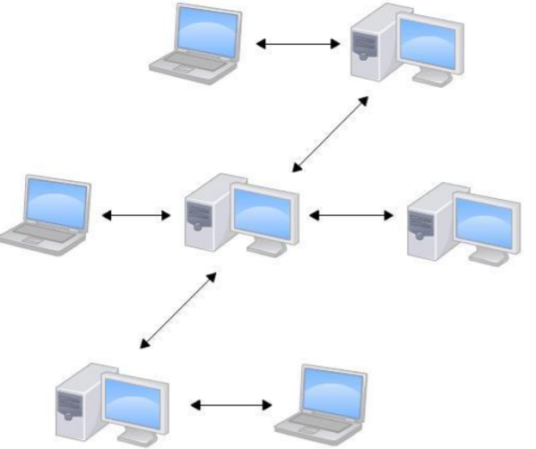

-   原始文件与版本信息在每台主机上都有保存

## git结构

#### git 本地库

#### git 远程库——代码托管中心

>    通过远程库实现团队内协作

>    通过远程库实现跨团队协作

## git命令行操作

>   查看git 版本

git --version

### 本地库操作

#### 初始化与配置

##### 新建仓库

##### 查看配置——git config [--global] --list

##### 删除配置信息——git config [--global] --unset user.email

##### 设置签名

>   为当前本地库配置签名

-   user.name
-   user.email
-   信息保存位置：./git/config

>   系统用户级别

-   --global：为OS本用户的所有本地库设置签名

>   优先级

-   就近原则：项目优先级 > 系统优先级

#### 基本操作

| 未同步的文件所在两区 | 未同步文件的颜色 |
| -------------------- | ---------------- |
| 工作区VS暂存区       | 红色             |
| 暂存区VS本地库       | 绿色             |

-   只有暂存区中有的文件才能提交到本地库

##### 状态查看——git status

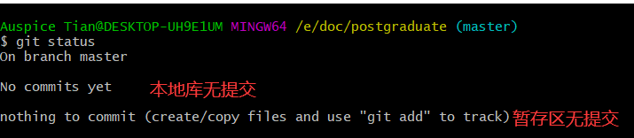

##### 添加到暂存区——git add

>   git add -A <=> git add .

-   将工作区内的所有文件添加到暂存区

##### 添加到本地库——git commit

>    初次提交

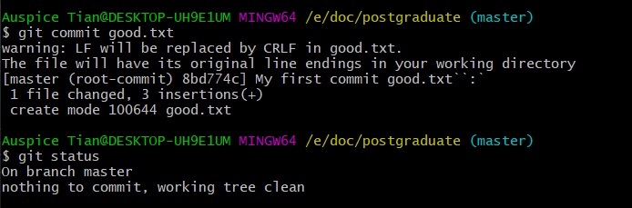

>   修改后提交

-   -a：工作区->暂存区->本地库
    -   跳过git add

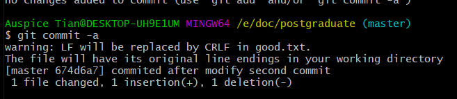

-   -m：命令行加注释提交，不进vim

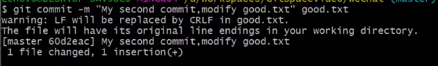

>   修改注释——git commit --amend

将暂存区中的文件重新提交，相当于改注释

##### 从本地库，暂存区移除——git rm

区别工作区删除

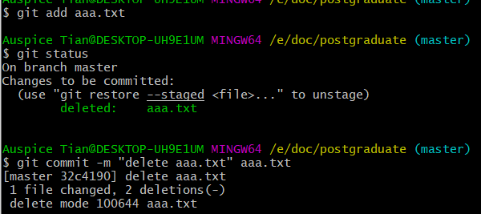

##### 版本前进或后退——git reset

###### --soft

-   只修改本地库

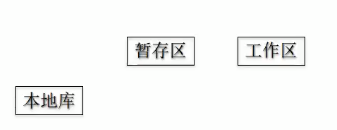

###### --mixed

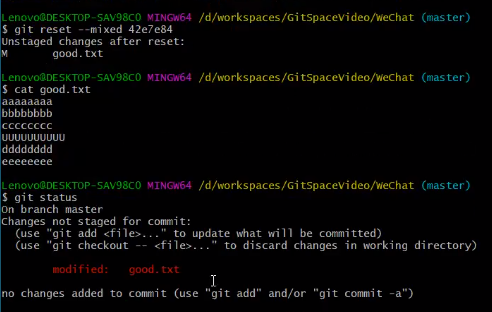

-   本地库移动HEAD指针
-   重置暂存区

###### --hard

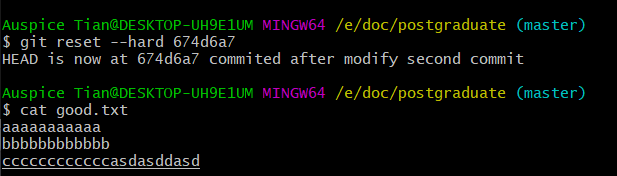

>    索引值

**修改HEAD指针的指向**

以HEAD指针为起点，回退

>   ^

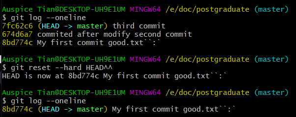

>   ~n

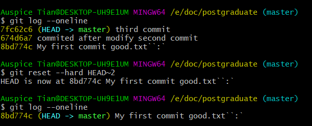

-   以HEAD指针为起点，回退n个版本

##### 查看可追踪的版本记录——git log

多屏显示

​	空格：向下翻页

​	b：向上翻页

​	q：退出

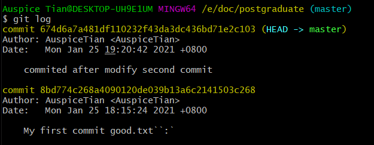

-   只显示到有指针指向的最新版本

>   --prety=oneline：简化查看版本信息

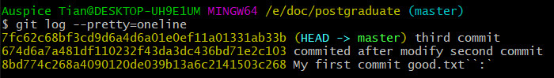

>   --oneline ：简化hash查看版本信息

>   git log --oneline --decorate --graph --all

查看可追踪的所有分支的所有版本信息

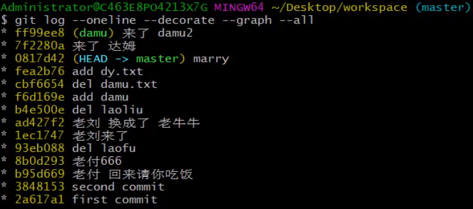

>   git config (--global) alias.[别名] "[命令]"

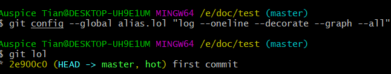

##### 查看所有版本信息——git reflog

##### 比较文件差异——git diff

>   git diff [文件名]

将工作区中的文件与暂存区进行比较

>    git diff [本地库历史版本] [文件名]

将工作区中文件和本地库历史记录比较  

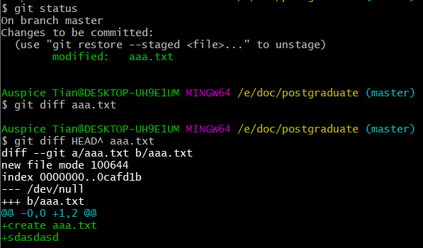

>   git diff

多个文件比较

#### 分支管理

##### 查看分支的最新状态——git branch -v

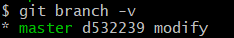

#####  新建分支——git branch [分支名]

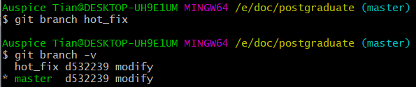

###### 删除分支——git branch [参数] [分支名]

>   -d

删除以提交过的分支

>   -D

强制删除分支

##### 切换分支——git checkout [分支名]

>    -b [分支名]

新建分支并切换到新分支

**移动HEAD指针，指向分支名指向的版本**

>   会将工作区中的内容重置

若 [原分支] 有未提交的文件，则会将未提交文件带回 [新分支]

**checkout** 前，一定要提交 **git status** 确定没有未提交文件

###### 跟踪分支

>    git checkout -b [branch] [remotename]/[branch]

创建新的分支[branch]与远程跟踪分支 [remotename]/[branch] 同步

>   git checkout --track origin/serverfix

创建与远程跟踪分支同名的本地分支

>   git branch -u [branch] origin/serverfix

将本地分支与远程跟踪分支同步

##### 合并分支——git merge [被合并的分支名]

###### 冲突处理

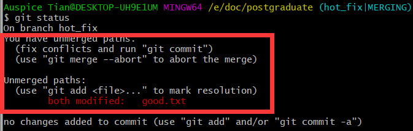

###### git 存储——git stash

>   将未提交的修改保存到栈内，切换分支

>   git stash list:查看存储

>   git stash pop：应用存储，并删除

1.  git stash apply [stash@{2}]
    -   将栈顶的文件引用

2.  git stash drop [stash@{2}]
    -   移除存储

##### 分支工作流

-   master为线上分支
-   develop为本地主分支
-   topic为本地就某一模块的开发的分支
-   develop开发完成后，合并回线上的master分支

### 远程库操作

#### 查看远程库配置——git remote -v

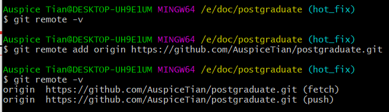

#### 新增远程库——git remote add [远程库别名] [远程库URL]

#### 向远程库推送——git push [远程库名] [远程分支名]

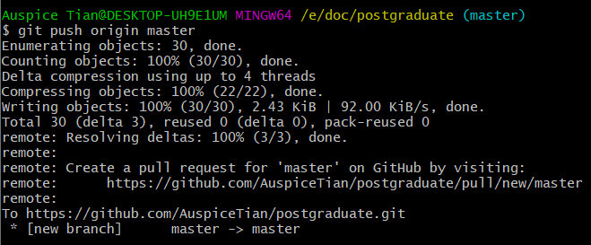

#### 克隆远程库——git clone [远程库]

#### 将远程库同步到本地库——git pull [远程库] [远程分支名]

-   本地分支
-   远程分支
    -   远程库的分支
-   远程跟踪分支
    -   在本地的远程同步分支

##### 1. 从远程库抓取——git fetch [远程库] [远程分支]

##### 2. 合并远程库——git merge [远程跟踪分支]

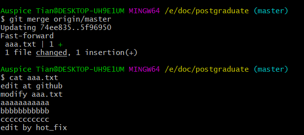

#### 团队外协作

## git实现机制

### 哈希算法&生成 `blob`

-   哈希算法确定、输入数据不变，hash值确定
-   同一哈希算法，得到的加密结果长度固定
-   git 底层采用SHA-1算法

>   git hash-object -w [文件路径]|--stdin

对文件内容进行运算，得到hash值

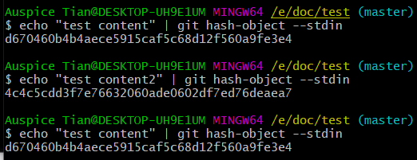

-   -w：将数据对象存入本地库
    -   [文件路径]：将文件路径指定的文件内容转化为 `blob` 写入本地库
    -   --stdin：将标准输入的文件内容进行哈希运算

>   git cat-file

-   -p：将hash值转化为文件内容

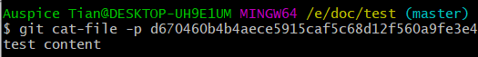

-   -t：输出hash值对应的git对象类型

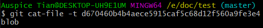

### git版本生成机制

>   SVN版本控制——增量式

>   git 版本控制——快照流

>   快照：同一文件的不同版本

-   有修改文件：生成快照
-   无修改文件：只保留一个链接指向之前存储的文件

#### 对象&底层命令

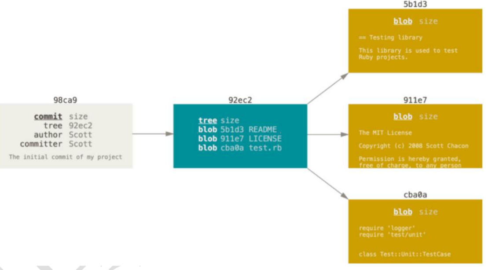

##### 数据对象——`blob`

-   每个文件的每次修改都会生成一个数据对象——`blob`
-   **解决文件内容的存储问题**

##### 目录树对象——`tree`

>    将暂存区中的数据对象以树的形式存储

-   **解决文件内容与文件名的映射关系**

>    **git commit** 时，才将暂存区中的数据对象构建为 `tree`——项目commit时的快照

>   git update-index [参数] [文件模式] [`blob`] [文件名]：将数据对象存入暂存区

-   --add：该文件第一次提交需要带的参数
-   --cacheInfo：将已在本地库的数据对象添加到暂存区
-   [文件模式]
    -   100644，表明这是一个普通文件
    -   100755，表示一个可执行文件
    -   120000，表示一个符号链接  

>   git read-tree [参数]：将 `tree` 读入暂存区

-   --prefix=bak [父`tree` 的hash]
    -   指明父 `tree` 的hash

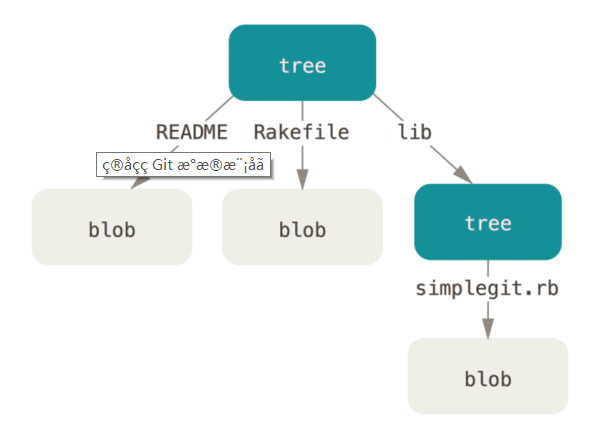

-   lib：保存子`tree` 的目录

>   git write tree

将暂存区中的 `blob` 生成 `tree`

>    git ls-files -s：查看暂存区中内容

##### 提交对象——`commit`

>   git commit-tree [`tree`的hash] -p [父`tree`的hash]

>   提交对象形成版本链

>   git 版本管理实例

#### 高层命令

##### git add

1.  将本文件的`blob`添加到本地库
    -   .git / hash[1,2] / hash [3,40]
    -   git hash-object -w [文件路径] => `blob`
2.  将`blob`存入暂存区

-   git update-index [参数] [文件模式] [`blob`] [文件名]

##### git commit

1.  生成 `tree`
    -   git write tree
2.  生成`commit-tree`，提交到本地库
    -   git commit-tree [`tree`的hash] -p [父`tree`的hash]

### git 分支管理机制

-   HEAD：指向当前活动分支的最新版本

-   [分支名]：指向分支的最新版本

>   HEAD指针带动分支版本移动

>   HEAD指针指向活动分支的最新版本

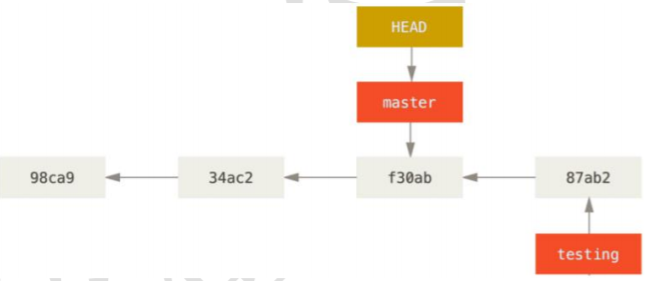

### .git文件结构

>   HEAD

保存当前分支的文件路径

符号引用

>   config

当前项目的配置

>   description

当前本地库的描述信息

>   hooks

钩子：联系高层命令与底层命令的程序

>   index

暂存区

>   info

.gitignore

全局性排除文件

>   log

git 日志

>   object

保存 数据对象、目录树对象、提交对象的hash

>   refs

保存指向数据的提交对象的指针

-   heads：各个分支当前版本对应的提交对象的hash
    -   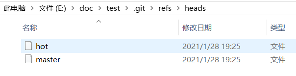
-   remotes：远程库的当前分支最新版本的hash
-   tags：分支的别名