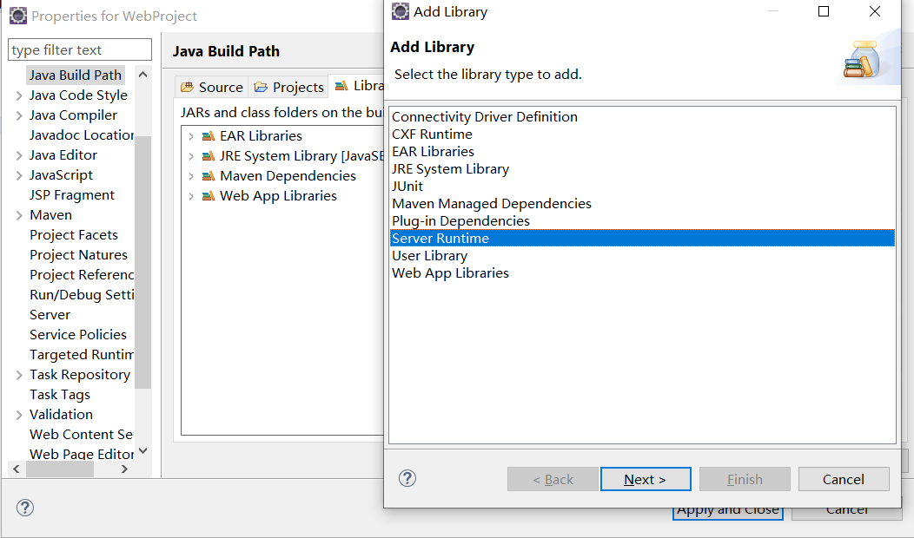

# maven

@(SOA)[Auspice Tian][2021年1月30日20:17:46]

[TOC]

<div style="page-break-after:always"></div>

## 简介

### why

#### 目前的技术


#### 目前存在的问题

1.  一个项目就是一个工程
    -   项目庞大，不适合用package划分模块
    -   一个模块对应一个工程
        -   借助maven拆分成多个工程，利于分工协作
2.  项目中需要的jar包必须手动复制、粘贴 到 WEB-INF/lib
    -   同一jar包重复出现在不同项目工程
        -   jar包仅保存一份
        -   保存在 maven 仓库中，需要时 `引用` 即可
3.  jar包需要找资源
    -    借助maven以一种规范的方式下载jar包，框架或第三方工具的jar包按同一的规范存放在maven的中央仓库
4.  jar包所依赖的其他jar包需要手动加入到项目中

### what

#### 服务于java平台


#### 自动化构建工具

>    Make->Ant->Maven->Gradle

##### 构建

>   以 "java源文件"、“框架配置文件”、“JSP”、“HTML”、“图片”等资源为“原材料”，“生产”一个可以运行的项目的过程

1.  编译
    
-   .java文件 -> 编译 -> Class 字节码文件.class -> 交个JVM去执行
    
2.  搭建

3.  部署

    >    动态web工程-> 编译、部署 -> 编译结果

    -   运行时环境——JRE

        -   一组jar包的引用，不是jar包
        -   不是目录

    -   工程目录VS编译结果

        

        所有的路径或配置文件中配置的类路径等都是以编译结果的目录结构为标准的

##### 构建环节

1.  清理

    将以前编译得到的就得.class字节码文件删除

2.  编译

    将.java源程序变成.class字节码文件

3.  测试

    自动测试，自动调用junit程序

4.  报告

    测试程序 执行的结果

5.  打包

    动态web工程 -> war包

     java工程       -> jar包

6.  安装

    Maven特定概念——将打包得到的文件复制到 “仓库” 中的制定位置

7.  部署

    将动态Web工程生成的war包赋值到Servlet容器的制定目录下，使其可以运行

#### 安装Maven核心程序

1.  配置 JAVA_HOME

    

2.  解压Maven核心程序的压缩包，放在非中文无空格路径下

    

3.  配置Maven的环境变量

    -   MAVEN_HOME

        

    -   path

        

4.  验证

    运行 mvn -v查看Maven的版本

    

#### Maven核心概念

##### **约定的目录结构**

Hello

| ---src

​      | ---main

​            | ---java

​            | ---resources

​      | ---test

​            | ---java

​            | ---resources

| ---pom.xml

-   根目录：工程名
-   src目录：源码
-   pom.xml：Maven工程的核心配置文件
-   main目录：存放主程序
-   test目录：存放测试程序
-   java目录：存放Java源码
-   resources目录：存放框架或其他工具的配置文件

>    要实现自动构建：

-   以配置的方式明确告诉框架
-   遵守框架内部已经存在的约定

>   约定 > 配置 > 编码

##### **POM**

1.  Project Object Model：项目对象模型

2.  pom.xml

    与构建过程相关的一切设置都在这个文件

    相当于 web.xml相对于动态Web工程

##### **坐标**

1.  数学上的坐标

    -   平面上，使用两个向量唯一表示一个点
    -   空间上，使用三个向量唯一表示一个点

2.  Maven的坐标

    三个向量在仓库中唯一定位一个Maven工程

    -   groupId

        -   公司或组织域名倒序+项目名

            ```xml
            <groupid>com.atguigu.maven</groupid>
            ```

    -   artifactId

        -   模块的名称

            ```xml
            <artifactid>Hello</artifactid>
            ```

    -   version

        -   版本

            ```xml
            <version>1.0.0</version>
            ```

3.  Maven工程的坐标与仓库中路径的对应关系

    ```xml
    <groupid>org.springframework</groupid>
    <artifactid>spring-core</artifactid>
    <version>4.0.0.RELEASE</version>
    ```

    org\springframework\spring-core\4.0.0.RELEASE\spring-core-4.0.0.RELEASE

##### **`依赖`**

>    Maven解析依赖信息时，会到本地仓库中找依赖的jar包

-   自己开发的Maven工程，使用Install安装后就可进入仓库

###### 依赖的范围

三个取值

| 被定义为          | compile范围的依赖 | test范围的依赖 | provided范围的依赖     |
| ----------------- | ----------------- | -------------- | ---------------------- |
| 对主程序是否可见  | 是                | 否             | 是                     |
| 对测试是否可见    | 是                | 是             | 是                     |
| 是否参与打包\部署 | 是                | 否             | 否                     |
| 例子              | spring-core       | junit          | Tomcat:servlet-api.jar |

-   compile范围的依赖   VS   test范围的依赖

    

-   compile范围的依赖   VS   provided范围的依赖

    

###### 依赖的传递性

>   非 `compile` 范围的依赖不能传递


>   直接依赖


>   继承依赖


###### 依赖的排除

>   什么时候需要 `排除`

 

```xml
<dependency>
	<exclusions>
    	<exclusion>
        	<groupId></groupId>
            <artifactId></artifactId>
        </exclusion>
    </exclusions>
</dependency>
```


>   查找groupId 和 artifactId


###### 依赖的原则

>   作用：解决模块工程之间的jar包冲突问题

1.  路径长度不同

    

    -   就近原则：路径最短 14

2.  路径长度相同

    

    -   先声明者优先：参照当前项目的dependency标签声明顺序

###### 统一管理依赖的版本

1.  properities标签内使用 `自定义标签` 统一声明版本号
2.  在需要同一版本的位置，使用 `${自定义标签名}` 引用声明

```xml
<project>
	<properities>
        <atguigu.spring.version></atguigu.spring.version>
    	<自定义标签名>4.0.0.RELEASE</自定义标签名>
    </properities>
</project>
```

```xml
<dependencies>
	<dependency>
    	<version>${atguigu.spring.version}</version>
    </dependency>
</dependencies>
```

##### 仓库

1.  分类

    -   本地仓库：部署在当前主机上的仓库，服务于主机上所有Maven工程

    -   远程仓库

        -   私服Nexus——局域网范围

            搭建在局域网环境中，为局域网中所有Maven工程服务

            

        -   中央仓库

            为所有Maven工程服务

        -   中央仓库镜像

            分担中央仓库的流量；提速

2.  仓库中的内容——Maven工程

    -   Maven自身所需的插件
    -   第三方框架或工具的jar包(jdk，开发)
    -   自己开发的Maven工程

##### 生命周期/插件/目标

>   各个构建环节执行的顺序

Maven的核心程序中定义了抽象的生命周期

-   clean Lifecycle——构建之前的清理

    1.  pre-clean：执行一些需要在clean之前完成的工作
    2.  clean：移除所有上一次构建生成的文件
    3.  post-clean：执行一些需要在clean之后立刻完成的工作

-   **Default Lifecycle——构建的核心部分**

    编译、测试、打包、安装、部署

    >    Maven核心程序为了更好的实现自动化构建——
    >   		`不论现在执行生命周期中的哪个阶段，都是从这个生命周期最开始的阶段开始`

-   Site Lifecycle——生成项目报告、站点、发布站点

    1.  pre-site：执行一些需要在生成站点之前完成的工作
    2.  site：生成项目的站点文档
    3.  post-site：执行需要在生成站点文档之后需要做的工作；为部署做准备
    4.  site-deploy：将生成的站点文档部署到特定服务器上

###### 插件和目标

>   目标：生命周期的各个阶段仅定义了要执行什么

>   插件：相似的目标由特定的插件完成

| 生命周期阶段 | 插件目标     | 插件                              |
| ------------ | ------------ | --------------------------------- |
| compile      | compile      | maven-compiler-plugin:3.1:compile |
| test-compile | test-compile | maven-compiler-plugin:3.1:compile |

==命令== 调用 ==插件== 实现 ==插件目标==

##### 继承

>    需求：统一管理各个模块工程中对 `junit[test范围的依赖]` 依赖的版本

>   解决思路：
>
>    将 `junit` 依赖版本统一提取到 “父” 工程中，在子工程中声明依赖时，不指定版本，以父工程中统一设定的为准。

1.  创建一个Maven工程为父工程

    **打包方式：pom**

    

2.  在子工程中声明对父工程的引用

    ```xml
    <!--子工程的pom.xml -->
    <project>
    	<!-- 子工程中声明父工程 -->
    	<parent>
    		<groupId>com.atguigu.maven</groupId>
      		<artifactId>Parent</artifactId>
      		<version>0.0.1-SNAPSHOT</version>
      		
      		<!-- 以当前工程的pom.xml文件为基准的父工程pom.xml的相对路径 -->
      		<relativePath>../Parent/pom.xml</relativePath>
    	</parent>
    </project>
    ```

3.  将子工程的坐标中与父工程中重复内容删除

4.  在父工程中统一junit的依赖

    ```xml
    <!--父工程的pom.xml -->
    <project>
    	<!-- 配置依赖的管理 -->
        <dependencyManagement>
            <dependencies>
                <dependency>
                    <groupId>junit</groupId>
                    <artifactId>junit</artifactId>
                    <version>4.0</version>
                    <scope>test</scope>
                </dependency>
            </dependencies>
        </dependencyManagement>
    </project>
    ```

5.  在子工程中删除 junit 依赖的版本号部分

##### 聚合

>   解决各个模块工程的安装——一键安装各个模块工程

>   配置方式

在一个 “聚合工程” 中配置各个参与聚合的模块

-   聚合工程——Parent

-   ```xml
    <!--Parent的pom.xml -->
    <project>
        <!-- 配置聚合 -->
      	<modules>
            <!--指定各个子工程的相对路径-->
            <module>../HelloFriend</module>
            <module>../Hello</module>
        </modules>
    </project>
    ```

-   使用方式：在聚合工程pom.xml上右键 -> Run as -> Maven Install

-   聚合时，Maven可识别各模块工程之间的依赖关系

<div style="page-break-after:always"></div>

## 常用Maven命令

>   执行与构建过程相关的Maven命令，必须进入pox.xml所在的目录

-   编译、测试、打包、部署

### mvn clean——清理

清理[项目名]\target 文件夹


### mvn compile——编译主程序

>   阶段(不重要)


#### 联网问题

-   Maven的核心程序仅定义了抽象的生命周期，但具体的工作必须由特定插件完成，插件不在Maven的核心程序中

-   当执行的Maven命令需要用到某些插件，Maven核心程序会先到本地仓库中查找

-   本地仓库的默认位置：[当前用户的家目录]\\.m2\repository

    

-   Maven核心程序如果在本地仓库中找不到所需插件，则会连接外网，到中央仓库下载

    

-   若无法连接外网，构建失败

>   解决办法

修改默认本地仓库的位置

-   Maven的解压目录\conf\settings.xml

    

-   找到localRepository标签

    

### mvn test-compile——编译测试程序

>   阶段(不重要)


### mvn test——执行测试

>   阶段(不重要)


>   测试报告


### mvn package——打包

>   阶段(不重要)


>   打包后的结果


### mvn install——将当前Maven工程安装到mvn仓库


### mvn site——生成站点文档

<div style="page-break-after:always"></div>

## 例子

### 1. 熟悉目录结构


```xml
<project xmlns="http://maven.apache.org/POM/4.0.0"
         xmlns:xsi="http://www.w3.org/2001/XMLSchema-instance"
         xsi:schemaLocation="http://maven.apache.org/POM/4.0.0
            http://maven.apache.org/xsd/maven-4.0.0.xsd">
    <modelVersion>4.0.0</modelVersion>
    
    <name>Hello</name>
    <!-- 基本设置 The Basics -->
    <groupId>com.atguigu.maven</groupId>
    <artifactId>Hello</artifactId>
    <version>0.0.1-SNAPSHOT</version>
    
    <dependencies>
        <dependency>
            <groupId>junit</groupId>
            <artifactId>Hello</artifactId>
            <version>4.0</version>
            <scope>test</scope>
        </dependency>
    </dependencies>
</project>
```


```java
package com.atguigu.maven;

public class Hello{
	public String sayHello(String name){
		return "Hello "+name+"!";
	}
}
```


```java
package com.atguigu.maven;

import org.junit.Test;
import static junit.framework.Assert.*;//静态导入

public class HelloTest(){
	@Test
	public void testHello(){
		Hello hello = new Hello();
		String results = hello.satHello("litingwei");
		assertEquals("Hello litingwei!",results);//Assert的一个静态方法
	}
}
```

### 2. 依赖的导入与范围

>   pom.xml

```xml
<?xml version="1.0" ?>
<project xmlns="http://maven.apache.org/POM/4.0.0" xmlns:xsi="http://www.w3.org/2001/XMLSchema-instance" xsi:schemaLocation="http://maven.apache.org/POM/4.0.0 http://maven.apache.org/xsd/maven-4.0.0.xsd">
	<modelVersion>4.0.0</modelVersion>
	<groupId>com.atguigu.maven</groupId>
	<artifactId>HelloFriend</artifactId>
	<version>0.0.1-SNAPSHOT</version>
	<name>HelloFriend</name>
	
	<dependencies>
		<dependency>
			<groupId>junit</groupId>
			<artifactId>junit</artifactId>
			<version>4.0</version>
			<scope>test</scope>
		</dependency>		
		
		<dependency>
			<groupId>com.atguigu.maven</groupId>
			<artifactId>Hello</artifactId>
			<version>0.0.1-SNAPSHOT</version>
			<scope>compile</scope>
		</dependency>
	</dependencies>
</project>
```

>   HelloFriend

```java
package com.atguigu.maven;
import com.atguigu.maven.Hello;

public class HelloFriend{
	public static String sayHelloToFriend(String name){
		Hello hello = new hello();
		String str = hello.sayHello(name)+"I am " + this.getMyName();
		System.out.println(str);
		
		return str;
	}

	public String getMyName(){
		return "John";
	}
}
```

>   HelloFriendTest.java

```java
package com.atguigu.maven;

import static org.junit.Assert.*;
import org.junit.Test;
import com.atguigu.maven.Hello;

public class HelloFriendTest{
	@Test
	public void testHelloFriend(){
		HelloFriend helloFriend = new HelloFriend();
		String results = helloFriend.sayHelloToFriend("litingwei");
		assertEquals("Hello litingwei! I am John",results);
	}
}
```


>   Hello根目录下 执行 mvn install


### 3. 依赖传递

>   pom.xml

```xml
<dependencies>
  	<dependency>
  		<groupId>com.atguigu.maven</groupId>
  		<artifactId>HelloFriend</artifactId>
  		<version>0.0.1-SNAPSHOT</version>
  	</dependency>
  </dependencies>
```


`引用`，仅在Maven仓库中保留一份

>   MakeFriends.java

```java
package com.atguigu.maven;

public class MakeFriends {
	public String makeFriends(String name) {
		HelloFriend friend = new HelloFriend();
		friend.sayHelloToFriend("litingwei");
		String str = "Hey" + friend.getMyName() + " make a friend please.";
		System.out.println(str);
		
		return str;
	}
}
```

>   MakeFriendsTest

```java
package com.atguigu.maven;

import static org.junit.Assert.assertEquals;

import org.junit.Test;

public class MakeFriendsTest {
	@Test
	public void testMakeFriends() {
		MakeFriends makeFriend = new MakeFriends();
		String str = makeFriend.makeFriends("litingwei");
		assertEquals("Hey,John make a friend please.",str);
	}
}
```

## eclipse中Maven

### Maven插件的设置

####  Installations

>    指定Maven核心程序的位置——用自己安装的


#### User Settings

>   指定本地仓库的位置

指定conf/settings.xml位置，进而获取本地仓库的位置


### 基本操作 

#### 创建Maven版Java工程


>    问题：JDK默认1.5

>    解决

1.  maven -> settings.xml

    ==profiles== 标签

2.  

    ```xml
    <profiles>
      <profile>
        <id>development</id>
        <activation>
          <jdk>1.7</jdk>
          <activeByDefault>true</activeByDefault>
        </activation>
        <properties>
          <maven.compiler.source>1.7</maven.compiler.source>
          <maven.compiler.target>1.7</maven.compiler.target>
          <maven.compiler.compilerVersion>1.7</maven.compiler.compilerVersion>
        </properties>
      </profile>
    </profiles>
    ```

    

#### 创建Maven版Web工程

##### 1. 创建

>   打包方式区分 ==java工程== 与 ==Web工程==


##### 2. 使Eclipse识别为Web工程——web.xml

>   web.xml 又称部署描述符


>   去掉Dynamic Web Module -> Apply -> 
>
>   勾选Dynamic Web Module ->Further cofiguration available


##### 3. 导入servlet-api.jar——provided范围的依赖

>   eclipse做法

 


>   Maven做法


```xml
<dependencies>
  	<dependency>
  		<groupId>javax.servlet</groupId>
  		<artifactId>servlet-api</artifactId>
  		<version>2.5</version>
  		<scope>provided</scope>	
  	</dependency>
    <dependency>
    <groupId>javax.servlet.jsp</groupId>
        <artifactId>jsp-api</artifactId>
        <version>2.1.3-b06</version>
        <scope>provided</scope>		
    </dependency>
</dependencies>
```

>   servlet-api.jar为provided范围的依赖


>   依赖默认为compile范围


```xml
<dependency>
    <groupId>log4j</groupId>
    <artifactId>log4j</artifactId>
    <version>1.2.17</version>
</dependency>
```

##### 部署到Tomcat

```xml
<project>
	<!--配置当前工程构建过程中的特殊设置-->
    <build>
    	<finalName>[工程名]</finalName>
        <plugins>
            <!--cargo专门启动Servlet容器-->
        	<plugin>
            	<groutId>org.codehaus.cargo</groutId>
                <artifactId>cargo-maven2-plugin</artifactId>
                <version>1.2.3</version>
                <!--针对插件的配置-->
                <configuration>
                    <!--配置当前系统中容器的位置-->
                    <container>
                    	<containerId>tomcat8x</containerId>
                   		<home>[tomcat Home路径]</home>
                    </container>
                    <configuration>
                        <!--确认配置-->
                    	<type>existing</type>
                        <home>[tomcat Home路径]</home>
                        <properities>
                            <!--若tomcat端口为8080则不用设置-->
                        	<cargo.servlet.port>8090</cargo.servlet.port>
                        </properities>
                    </configuration>
                </configuration>
                <!--配置插件在什么情况下执行-->
                <executions>
                	<exexution>
                    	<id>cargo-run</id>
                        <!--声明周期的阶段-->
                        <phase>install</phase>
                        <goals>
                        	<!--插件的目标-->
                            <goal>run</goal>
                        </goals>
                    </exexution>
                </executions>
            </plugin>
        </plugins>
    </build>
</project>
```


#### 导入Maven工程

>   eclipse工程必须有的配置文件
>
>   -   .settings
>
>   -   .classpath
>   -   .project


建在工作区外的Maven工程 Eclipse无法将其复制到工作区


#### 执行Maven命令


>   Maven build——Maven构建

-   compile
-   test-compile


##### eclipse中执行Maven命令是严格按照Maven规则

>   项目中的依赖必须在Maven中找到


