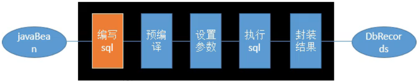
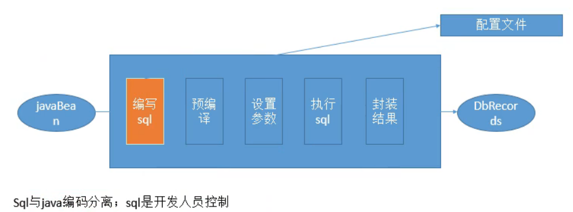
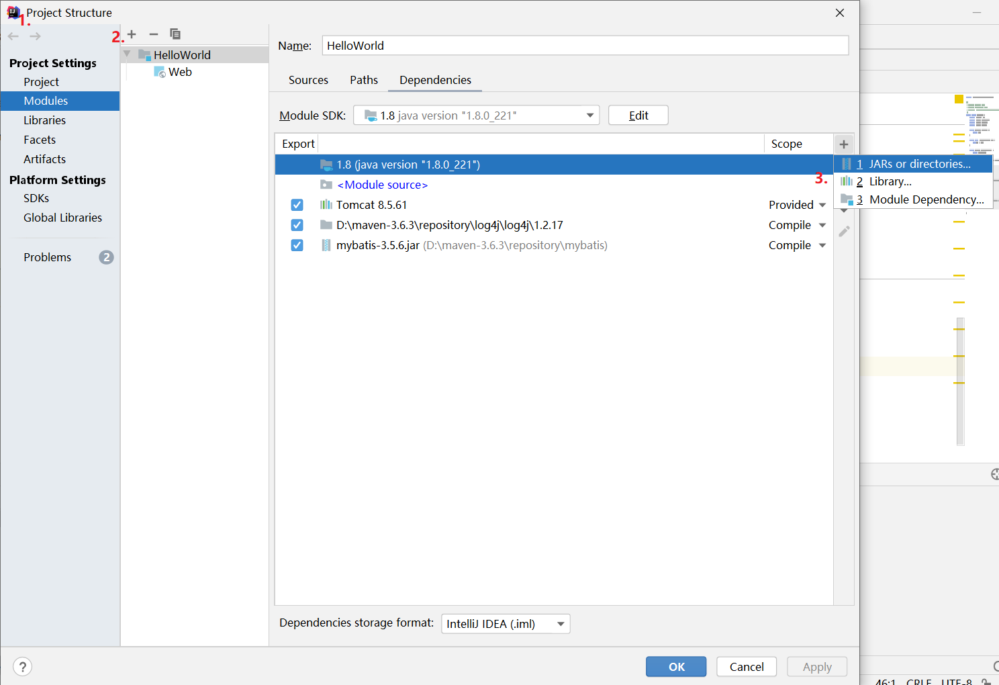
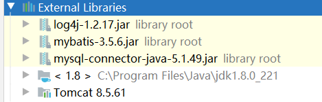

# MyBatis

@(MyBatis)[Auspice Tian]

[TOC]

>   持久化层——数据库交互


<div style="page-break-after:always"></div>

## 简介

### 数据库交互

1.  工具：简化Mysql的执行

    >   全手动

    JDBC -> DbUtils(QueryRunner) -> JDBCTemplate

    ```mermaid
    graph LR
    A[编写sql] -->B[预编译]
        B --> C[设置参数]
        C -->D[执行sql]
        D -->E[封装结果]
    ```

    -   功能简单
    -   硬编码，高耦合：sql语句编写在java代码中

2.  框架：整体解决方案

    >    Hibernate：全自动ORM（Object Relation Mapping）

    

    -   旨在消除sql

    -   缺点：

        无法优化；定制sql麻烦

    >    MyBatis

    


### 官方文档

[地址][https://mybatis.org/mybatis-3/zh/getting-started.html]

### HelloWorld

#### 1. 下载MyBatis插件

[下载链接][https://github.com/mybatis/mybatis-3/releases]

#### 2. 新建项目并引用MyBatis.jar、mysql-connector.jar






Maven方式导入依赖

```xml
<!-- pom.xml -->
<dependency>
    <groupId>org.mybatis</groupId>
    <artifactId>mybatis</artifactId>
    <version>x.x.x</version>
</dependency>
```

#### 3. 配置SqlSessionFactory

>   每个基于 MyBatis 的应用都是以一个 SqlSessionFactory 的实例为核心的
>
>   SqlSessionFactoryBuilder 则可以从 XML 配置文件或一个预先配置的 Configuration 实例来构建出 SqlSessionFactory 实例

##### XML配置SqlSessionFactory

1.  获取数据库连接实例的数据源（DataSource）

2.  决定事务作用域
3.  控制方式的事务管理器（TransactionManager）

```xml
<?xml version="1.0" encoding="UTF-8" ?>
<!DOCTYPE configuration
  PUBLIC "-//mybatis.org//DTD Config 3.0//EN"
  "http://mybatis.org/dtd/mybatis-3-config.dtd">
<configuration>
  <environments default="development">
    <environment id="development">
      <transactionManager type="JDBC"/>
      <dataSource type="POOLED">
        <property name="driver" value="com.mysql.jdbc.driver"/>
        <property name="url" value="jdbc:mysql://localhost:3306/mybatis"/>
        <property name="username" value="root"/>
        <property name="password" value="2017002231"/>
      </dataSource>
    </environment>
  </environments>
</configuration>
```

