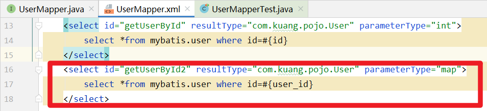
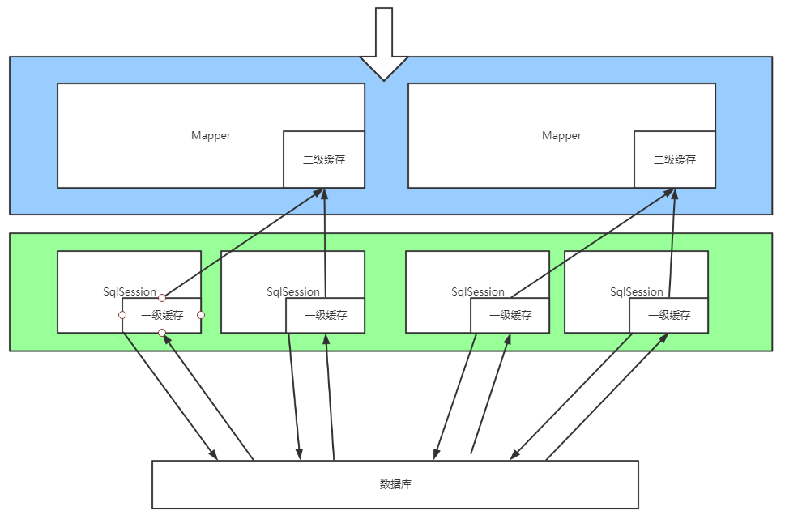
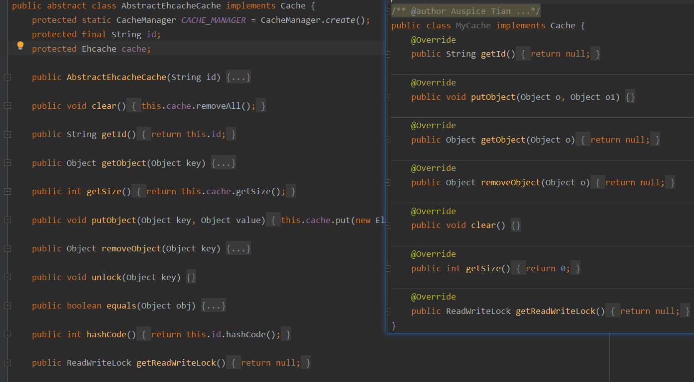
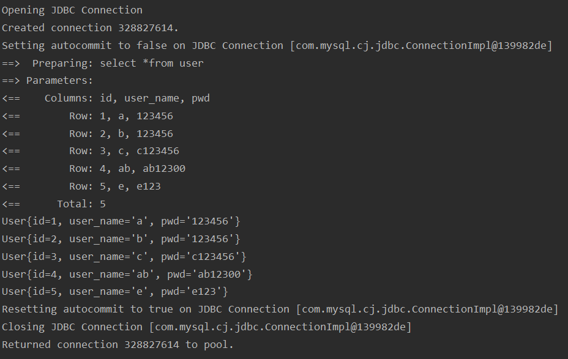

# MyBatis

@(MyBatis)[2021年2月6日10:41:00]

[TOC]

<div style="page-break-after:always"></div>

## 文档

[官方文档][https://mybatis.org/mybatis-3/zh/getting-started.html]

[下载链接][https://github.com/mybatis/mybatis-3/releases]

>   sql相关

-   sql引擎
-   innoDB底层
-   索引
-   索引优化

<div style="page-break-after:always"></div>

## 概述

### JDBC

JDBC驱动程序：JDBC(Java Database Connectivity， Java 数 据 库 连 接)是 一 种可用于执行 SQL 语句的 Java API(Application Programming Interface， 应用程序设计接口)

-   实现了从 Java 程序内调用标准的 SQL 命令对数据库进行查询、插入、删除和更新等操作， 并确保数据事务的正常进行
-   基本层次结构由 Java 程序、JDBC 驱动程序管理器、驱动程序和数据库四部分组成


-   Java 程序依赖于 JDBC API，通过 DriverManager 来获取驱动，并且针对不同的数据库可以使用不同的驱动。

-   这是典型的桥接的设计模式，把抽象 Abstraction 与行为实现Implementation 分离开来，从而可以保持各部分的独立性以及应对他们的功能扩展。

```java
public static void connectionTest(){
    Connection connection = null;
    Statement statement = null;
    ResultSet resultSet = null;
 
    try {
        // 1. 加载并注册 MySQL 的驱动
        Class.forName("com.mysql.cj.jdbc.Driver").newInstance();
 
        // 2. 根据特定的数据库连接URL，返回与此URL的所匹配的数据库驱动对象
        Driver driver = DriverManager.getDriver(URL);
        // 3. 传入参数，比如说用户名和密码
        Properties props = new Properties();
        props.put("user", USER_NAME);
        props.put("password", PASSWORD);
 
        // 4. 使用数据库驱动创建数据库连接 Connection
        connection = driver.connect(URL, props);
 
        // 5. 从数据库连接 connection 中获得 Statement 对象
        statement = connection.createStatement();
        // 6. 执行 sql 语句，返回结果
        resultSet = statement.executeQuery("select * from activity");
        // 7. 处理结果，取出数据
        while(resultSet.next())
        {
            System.out.println(resultSet.getString(2));
        }
 
        .....
    }finally{
        // 8.关闭链接，释放资源  按照JDBC的规范，使用完成后管理链接，
        // 释放资源，释放顺序应该是： ResultSet ->Statement ->Connection
        resultSet.close();
        statement.close();
        connection.close();
    }
}
```


### Why

-   传统的JDBC代码复杂
-   MyBatis是可将数据存入数据库自动化框架
-   **技术没有高低之分**

### What

-   持久层框架

    >    持久层：完成数据持久化工作的代码块，层次间界限分明
    >
    >    持久化：程序的数据在持久状态【数据库jdbc，io文件持久化】和瞬时状态【内存：断电即失】转化的过程

-   定制化SQL

-   避免JDBC代码，手动设置参数和获取结果集

好处：

-   简单：两个jar文件+配置几个sql映射文件
-   灵活：sql写在xml里，统一管理
-   解除sql与程序的耦合：通过提供Mapper层，将业务逻辑与数据访问逻辑分离
-   提供映射标签：JavaBean与数据库ORM字段关系映射
-   提供xml标签，支持编写动态sql

### how

>    通过简单的 XML 或注解来配置和映射原始类型、接口和 Java POJO

#### MyBatis执行流程


#### 获取MyBatis——Maven

```xml
<dependency>
  <groupId>org.mybatis</groupId>
  <artifactId>mybatis</artifactId>
  <version>3.5.6</version>
</dependency>
```

#### SqlSessionFactoryBuilder

>    一旦创建了 SqlSessionFactory，就不再需要它了。
>
>    因此 SqlSessionFactoryBuilder 实例的最佳作用域是方法作用域
>
>    -   作用域：局部变量

#### SqlSessionFactory => 数据库连接池

每个基于 MyBatis 的应用都是以一个 SqlSessionFactory 的实例为核心的

SqlSessionFactory 的实例可以通过 SqlSessionFactoryBuilder 获得

>   构造方法：从xml中配置文件中构建SqlSessionFactory实例

>   SqlSessionFactory 一旦被创建就应该在应用的运行期间一直存在
>
>   -   作用域：应用作用域
>
>   最简单的就是使用单例模式或者静态单例模式。

#### SqlSession => JDBC：Connection对象

 通过SqlSessionFactory获得 SqlSession 的实例。

SqlSession 提供了在数据库执行 SQL 命令所需的所有方法。

>   SqlSession的实例时线程不安全的，不能被共享
>
>   -   每次收到一个数据库访问请求，打开一个SqlSession，返回响应后，立即关闭

#### Mapper => JDBC：Statement

>   ==代理对象==执行具体业务
>
>   将接口与xml进行绑定


<div style="page-break-after:always"></div>

## 第一个MyBatis程序


### 1. 搭建数据库

```mysql
create table user(
	id int(11) not null primary key,
    user_name varchar(30) default null,
    pwd varchar(30) default null
)engine=InnoDB default charset=utf8;

insert into user(id,user_name,pwd) values
(1,'a','123456'),
(2,'b','123456'),
(3,'c','c123456');
```

### 2. 新建项目


### 3. 删除src，使项目成为父工程


### 4. 导入 `maven` 依赖

```xml
<!-- 父工程 -->
<groupId>com.kuang.MyBatis</groupId>
<artifactId>MyBatis</artifactId>
<version>1.0-SNAPSHOT</version>

<!-- 导入依赖 -->
<dependencies>
    <!-- 导入MySql驱动 -->
    <dependency>
        <groupId>mysql</groupId>
        <artifactId>mysql-connector-java</artifactId>
        <version>8.0.16</version>
    </dependency>

    <!-- 导入MyBatis驱动 -->
    <dependency>
        <groupId>org.mybatis</groupId>
        <artifactId>mybatis</artifactId>
        <version>3.5.6</version>
    </dependency>

    <!-- 导入junit依赖 -->
    <dependency>
        <groupId>junit</groupId>
        <artifactId>junit</artifactId>
        <version>4.12</version>
        <scope>test</scope>
    </dependency>
</dependencies>
```

### 5. 新建模块


### 6. 获取数据库连接对象

#### a. 编写核心配置文件——mybatis-config.xml


```xml
<?xml version="1.0" encoding="UTF-8" ?>
<!DOCTYPE configuration
        PUBLIC "-//mybatis.org//DTD Config 3.0//EN"
        "http://mybatis.org/dtd/mybatis-3-config.dtd">
<!-- configuration的核心配置 -->
<configuration>
    <!-- 可配置多套环境，defaulte属性选择当前属性 -->
    <environments default="development">
        <environment id="development">
            <!-- 事务管理器 -->
            <transactionManager type="JDBC"/>
            <dataSource type="POOLED">
                <!-- 配置JDBC驱动 -->
                <property name="driver" value="com.mysql.cj.jdbc.Driver"/>
                <property name="url" value="jdbc:mysql://localhost:3306/mybatis?useSSL=true&amp;useUnicode=true&amp;characterEncoding=utf-8"/>
                <property name="username" value="root"/>
                <property name="password" value="2017002231"/>
            </dataSource>
        </environment>
    </environments>
    
    <!-- 每一个Mapper.xml都需要在MyBatis核心配置文件中注册 -->
    <mappers>
        <mapper resource="com/kuang/dao/UserMapper.xml"/>
    </mappers>
</configuration>
```

-   useSSL：使用安全连接
-   useUnicode：保证中文不乱码
-   characterEncoding：编码格式


#### b. 编写MyBatis工具类

新建dao包，utils包


```java
public class MyBatisUtils {
    private static SqlSessionFactory sqlSessionFactory;
    
    // 1.获取SqlSessionFactory对象
    static{
        try {
            //1. 将资源中的配置文件以留的形式读入
            String resource = "mybatis-config.xml";
            InputStream configuration = Resources.getResourceAsStream(resource);

            //2. 通过工厂类构建器构建SqlSessionFactory类
            sqlSessionFactory = new SqlSessionFactoryBuilder().build(configuration);
        } catch (IOException e) {
            e.printStackTrace();
        }
    }
    
    // 2.获取SqlSession对象
    public static SqlSession getSqlSession(){
        return sqlSessionFactory.openSession();
    }
}
```


### 7. 编写代码


#### 实体类

pojo的作用就是将从数据库获取到的数据封装为一个一个的对象，让java能够更好的进行操作DO VO

```java
package com.kuang.pojo;

public class User {
    private Integer id;
    private String user_name;
    private String pwd;

    public User(){}

    public User(Integer id, String user_name, String pwd) {
        this.id = id;
        this.user_name = user_name;
        this.pwd = pwd;
    }

    public Integer getId() {
        return id;
    }


    public void setId(Integer id) {
        this.id = id;
    }

    public String getUser_name() {
        return user_name;
    }

    public void setUser_name(String user_name) {
        this.user_name = user_name;
    }

    public String getPwd() {
        return pwd;
    }

    public void setPwd(String pwd) {
        this.pwd = pwd;
    }

    @Override
    public String toString() {
        return "User{" +
                "id=" + id +
                ", user_name='" + user_name + '\'' +
                ", pwd='" + pwd + '\'' +
                '}';
    }
}
```

#### Dao接口

```java
public interface UserDao{
    List<User> getUserList();
}
```

#### 接口的实现

>   由 UserDaoImpl 转化为 Mapper 配置文件


```java
<?xml version="1.0" encoding="UTF-8" ?>
<!DOCTYPE mapper
        PUBLIC "-//mybatis.org//DTD Mapper 3.0//EN"
        "http://mybatis.org/dtd/mybatis-3-mapper.dtd">

<!-- 绑定一个对应的Dao/Mapper接口 -->
<mapper namespace="com.kuang.dao.UserDao">
    <!--id:方法名-->
    <select id="getUserList" resultType="com.kuang.pojo.User">
        select *from mybatis.user;
    </select>
</mapper>
```

-   **namespace**：相当于指定要实现的接口
    -   将不同的语句隔离开来，同时也实现了你上面见到的接口绑定
        -   全限定名（比如 “com.mypackage.MyMapper.selectAllThings）将被直接用于查找及使用
        -   短名称（比如 “selectAllThings”）如果全局唯一也可以作为一个单独的引用。 如果不唯一，有两个或两个以上的相同名称（比如 “com.foo.selectAllThings” 和 “com.bar.selectAllThings”），那么使用时就会产生“短名称不唯一”的错误，这种情况下就必须使用全限定名。
-   id：方法名
-   resultType：返回单个
-   resultMap：返回多个

### 8. 测试

>   新建 测试类


>    编写测试代码

```java
package com.kuang.dao;

import com.kuang.pojo.User;
import com.kuang.utils.MyBatisUtils;
import org.apache.ibatis.session.SqlSession;
import org.junit.Test;

import java.util.List;

public class UserDaoTest {
    @Test
    public void test(){
        //1.获取SqlSession对象
        SqlSession sqlSession = MyBatisUtils.getSqlSession();

        //2.执行Sql
        UserMapper userMapper = sqlSession.getMapper(UserMapper.class);
        List<User> userList = userMapper.getUserList();

        /*
        //方式二：强制类型转换，不安全
        List<User> userList = sqlSession.selectOne("com.kuang.UserDao.getUserList");
        */

        for (User user:userList){
            System.out.println(user);
        }

        //关闭sqlSession
        sqlSession.close();
    }
}
```

### 遇到的各种错误

#### org.apache.ibatis.io不存在


#### class not found:ClassTest

>   执行UserDaoTest的test方法之前，要先 mvn test-compile 生成 test classes才和被部署并发现


#### Type interface com.kuang.dao.UserDao is not known to the MapperRegistry

```xml
<!-- 每一个Mapper.xml都需要在MyBatis核心配置文件中注册 -->
<mappers>
    <mapper resource="com/kuang/dao/UserMapper.xml"/>
</mappers>
```

#### Could not find resource com/kuang/dao/UserMapper.xml

Maven约定大于配置，自己写的配置文件默认不会被导出或生效

Maven默认的资源（自己配置的xml）位置在resources目录下，当前项目的xml位于java目录下，所以找不到


```xml
<!-- build中配置resources，防止资源导出失败问题 -->
<build>
    <resources>
        <resource>
            <!-- 使得directory目录下的资源可以被导出 -->
            <directory>src/main/java</directory>
            <!-- 设置可被识别通过的文件类型 -->
            <includes>
                <include>**/*.properities</include>
                <include>**/*.xml</include>
            </includes>
            <filtering>true</filtering>
        </resource>

        <resource>
            <!-- 使得directory目录下的资源可以被导出 -->
            <directory>src/main/resources</directory>
            <!-- 设置可被识别通过的文件类型 -->
            <includes>
                <include>**/*.properities</include>
                <include>**/*.xml</include>
            </includes>
            <filtering>true</filtering>
        </resource>
    </resources>
</build>
```

#### 终于成功


<div style="page-break-after:always"></div>

## 增删改查CRUD

>   **CUD**  需要通过connection对象以Transition（事务）的形式提交

1.  编写接口
2.  （实现接口）编写mapper中对应的sql语句
3.  测试

### 参数传递&Map

#### 单个参数传递方式

-   只有一个 **基本数据类型** ，可省略

-   实体类对象作为参数，sql语句中的参数取对象的属性

-   Map作为参数，sql语句中参数取Map的属性

#### 多个参数的传递

##### 使用Map的情况

>   当字段过多时，考虑使用 **Map**

-   若使用实体类作为参数传递，当字段过多时，一个实体类的每个属性都必须设置值
-   使用Map，可以自定义需要传递的参数

1.  


2.  





##### 使用注解的情况

 

### select

选择，查询语句：

-   id：方法名
-   resultType：Sql语句执行的返回值
-   parameterType：参数类型

>   通过id获取用户

1.  
2.  
3.  

#### 模糊查询


1.  Java代码执行时，传递通配符%%

    

    

2.  在sql语句拼接中使用通配符

    >    存在sql注入的风险

    

    

### insert


>   并没有新增


### 更新


### 删除


### Plugin——通用Mapper 


<div style="page-break-after:always"></div>

## 核心配置——mybatis-config.xml

>   configuration（配置）
>
>   -   [properties（属性）](https://mybatis.org/mybatis-3/zh/configuration.html#properties)
>   -   [settings（设置）](https://mybatis.org/mybatis-3/zh/configuration.html#settings)
>   -   [typeAliases（类型别名）](https://mybatis.org/mybatis-3/zh/configuration.html#typeAliases)
>   -   environments（环境配置）
>       -   environment（环境变量）
>           -   transactionManager（事务管理器）
>           -   dataSource（数据源）
>   -   [mappers（映射器）](https://mybatis.org/mybatis-3/zh/configuration.html#mappers)

#### 属性（properities）

>   通过Properities引用配置文件
>
>   -   **优先使用外部配置文件**

1.  properties文件定义属性的键值对——定义变量

```properties
#db.properties
mysql_driver=com.mysql.cj.jdbc.Driver
#不需要转义&amp;
MyBatis_url=jdbc:mysql://localhost:3306/mybatis?useSSL=true&useUnicode=true&characterEncoding=utf-8
db_username=root
db_pwd=2017002231
```

2.  通过<properties/>声明引用属性

    

    ```xml
    <!-- properties引用属性变量 -->
    <properties resource="db.properties"/>
    ```

3.  使用属性

    

#### 设置Settings

| Setting                  | Description                                                  | Valid Values          | Default |
| :----------------------- | :----------------------------------------------------------- | :-------------------- | :------ |
| cacheEnabled             | 是否缓存Globally enables or disables any caches configured in any mapper under this configuration. | true \| false         | true    |
| lazyLoadingEnabled       | 懒加载，提高开发效率When enabled, all relations will be lazily loaded. This value can be superseded for a specific relation by using the `fetchType` attribute on it. | true \| false         | false   |
| mapUnderscoreToCamelCase | Enables automatic mapping from classic database column names A_COLUMN to camel case classic Java property names aColumn. | true \| false         | false   |
| logImpl                  | MyBatis的日志实现方式Specifies which logging implementation MyBatis should use. | LOG4J\|STDOUT_LOGGING | No Set  |

##### 日志实现——logImpl

-   SLF4J
-   LOG4J | LOG4J2 
-   JDK_LOGGING
-   COMMONS_LOGGING
-   STDOUT_LOGGING
-   NO_LOGGING

###### STDOUT_LOGGING

```xml
<!--设置日志实现方式-->
<settings>
    <setting name="logImpl" value="STDOUT_LOGGING"/>
</settings>
```


-   由日志可见，MyBatis底层是基于JDBC实现的

###### LOG4J

-   控制日志信息输送的目的地是控制台、文件、GUI组件，甚至是套接口服务器、NT的事件记录器、UNIX Syslog守护进程等
-   控制每一条日志的输出格式

1.  导入 `LOG4J` 包

    ```xml
    <dependency>
        <groupId>log4j</groupId>
        <artifactId>log4j</artifactId>
        <version>1.2.17</version>
    </dependency>
    ```

2.  配置log4j.properties资源

    ```properties
    # 将等级为DEBUG的日志信息输出到console和file两个目的地，console和file的定义在下面的代码
    log4j.rootLogger = debug,console,file
    
    # 控制台处处的相关配置
    log4j.appender.console = org.apache.log4j.ConsoleAppender
    log4j.appender.console.Target = System.out
    log4j.appender.console.Threshold=DEBUG
    log4j.appender.console.layout = org.apache.log4j.PatternLayout
    log4j.appender.console.layout.ConversionPattern = [%-5p] %d{yyyy-MM-dd HH:mm:ss,SSS} method:%l%n%m%n
    
    # 文件输出的相关设置
    log4j.appender.file = org.apache.log4j.RollingFileAppender
    log4j.appender.file.File = ./logs/log.log
    log4j.appender.file.MaxFileSize=10mb
    log4j.appender.file.Threshold = DEBUG
    log4j.appender.file.layout = org.apache.log4j.PatternLayout
    log4j.appender.file.layout.ConversionPattern = %-d{yyyy-MM-dd HH:mm:ss}  [ %t:%r ] - [ %p ]  %m%n
    
    # 日志输出级别
    log4j.logger.org.mybatis=DEBUG
    log4j.logger.java.sql=DEBUG
    log4j.logger.java.sql.Statement=DEBUG
    log4j.logger.java.sql.ResultSet=DEBUG
    log4j.logger.java.sql.PreparedStatement=DEBUG
    ```

    

###### 程序中使用log4j

1.  导包

    ```java
    import org.apache.log4j.Logger;
    ```

    

2.  设置变量

    ```java
    static Logger logger = Logger.getLogger(UserMapperTest.class);
    ```

    Logger.getLogger(className):将日志对象与目标对象绑定

3.  使用

    log级别

    -   info([信息])
    -   debug([信息])
    -   error([信息])

    

#### 环境配置 enviroments

MyBatis 可以配置成适应多种环境，**但每个 SqlSessionFactory 实例只能选择一种环境**

>   如果你想连接两个数据库，就需要创建两个 SqlSessionFactory 实例，每个数据库对应一个。

-   默认使用的环境 ID（比如：default="development"）。
-   每个 environment 元素定义的环境 ID（比如：id="development"）。
-   事务管理器的配置（比如：type="JDBC"）。
-   数据源的配置（比如：type="POOLED"）。

##### 事务管理器(transactionManager)

>    两种类型的事务管理器（也就是 type="[JDBC|MANAGED]"）

>    使用 Spring + MyBatis，则没有必要配置事务管理器，因为 Spring 模块会使用自带的管理器来覆盖前面的配置。

##### 数据库(dataSource)

连接数据库：

-   jdbc
-   dbcp
-   c3p0
-   druid

**三种数据源类型**

1.  UNPOOLED——用完即销毁

    -   无连接池，每次请求时打开和关闭连接

    -   浪费资源

2.  POOLED——用完即回收

3.  JNDI

#### 类型别名typeAliases

>   用于减少完全限定名的冗余**给实体类取别名**

##### 配置方式

1.  实体类较少，可逐一指定

    ```xml
    <!-- mybatis-config.xml -->
    <typeAliases>
        <typeAlias type="com.kuang.pojo.User" alias="User"/>
    </typeAliases>
    
    <!-- UserMapper.xml -->
    <mapper namespace="com.kuang.mapper.UserMapper">
        <!--id:方法名-->
        <select id="getUserList" resultType="User">
            select *from mybatis.user;
        </select>
    </mapper>
    ```

2.  You can also specify a package where MyBatis will search for all  beans.包中实体类的别名为 lowercase(类名的首字母)

    ```xml
    <!-- mybatis-config.xml -->
    <typeAliases>
        <package name="com.kuang.pojo" />
    </typeAliases>
    
    <!-- UserMapper.xml -->
    <mapper namespace="com.kuang.mapper.UserMapper">
        <!--id:方法名-->
        <select id="getUserList" resultType="user">
            select *from mybatis.user;
        </select>
    </mapper>
    ```

3.  If the `@Alias` annotation is found its value will be used as an alias.  优先级 ：注解别名>配置别名

    

    

    

##### MyBatis默认配置的别名

| Alias                  | Mapped Type                                                  |
| ---------------------- | ------------------------------------------------------------ |
| _普通数据类型          | 普通数据类型(int,short,long,byte,double,float,boolean)       |
| 小写首字母(数据类型名) | 首字母大写的数据类型(基本数据类型 + Date,Object,Map,HashMap,List,ArrayList,Collection,Iterator) |
| Integer,int            | BigDecimal                                                   |
| decimal,bigdecimal     | Integer                                                      |

#### 插件plugins

-   mybatis-generator-core

-   mybatis-plus

    

-   通用mapper

#### 映射器mapper

>   接口实现（mapper.xml）必须在configuration中注册才可被发现

第一种方式：资源路径【推荐】

```xml
<!-- Using classpath relative resources -->
<mappers>
  <mapper resource="org/mybatis/builder/AuthorMapper.xml"/>
  <mapper resource="org/mybatis/builder/BlogMapper.xml"/>
  <mapper resource="org/mybatis/builder/PostMapper.xml"/>
</mappers>
```

第二种方式：类名

```xml
<!-- Using mapper interface classes -->
<mappers>
  <mapper class="org.mybatis.builder.AuthorMapper"/>
  <mapper class="org.mybatis.builder.BlogMapper"/>
  <mapper class="org.mybatis.builder.PostMapper"/>
</mappers>
```

第三种方式：包内全导入

```xml
<!-- Register all interfaces in a package as mappers -->
<mappers>
  <package name="org.mybatis.builder"/>
</mappers>
```

第二、三种方式的问题

-   接口和Mapper配置文件必须同名
-   接口和Mapper配置资源必须在同一包下

<div style="page-break-after:always"></div>

## Mapper.xml

-   `resultMap` – The most complicated and powerful element that describes how to load your objects from the database result sets.
    -   javaType：class——POJO| ArrayList
    -   ofType：list 或 set 中的POJO
-   `insert` – A mapped INSERT statement.
-   `update` – A mapped UPDATE statement.
-   `delete` – A mapped DELETE statement.
-   `select` – A mapped SELECT statement.

### 解决属性名和字段名不一致问题——resultMap

#### 简单的例子

```java
public class User {
    private Integer id;
    private String user_name;
    private String password;
}
```


>   解决思路：**起别名**

```sql
select *from user where id=#{id}

select
	id as id,
    user_name as user_name,
    pwd as password
from user where id=#{id};
```

>   MyBatis方案：ResultMap——结果映射


-   **只需要将有差异的属性与字段映射即可**

#### 复杂SQL查询

##### 实体间的复杂关系&环境搭建

**关联association**：多对一

**集合collection**：一对多


```mysql
create table teacher(
	id int(10) not null,
    user_name varchar(30) default null,
    primary key(id)
)engine=InnoDB default charset=utf8;

insert into teacher(id,user_name) values(1,'秦老师');
insert into teacher(id,user_name) values(2,'江老师');

create table student(
	id int(10) not null,
    user_name varchar(30) default null,
    tid int(10) default null,
    primary key (id),
    key fktid(tid),
    constraint fktid foreign key (tid) references teacher(id)
)engine=InnoDB default charset=utf8;

insert into student(id,user_name,tid) values(1,"小明",1);
insert into student(id,user_name,tid) values(2,"小红",2);
insert into student(id,user_name,tid) values(3,"小张",1);
insert into student(id,user_name,tid) values(4,"小李",1);
insert into student(id,user_name,tid) values(5,"小王",2);
```

1.  导入lombok
2.  新建实体类
3.  建立Mapper接口
4.  建立Mapper.xml资源
5.  在核心配置文件中绑定注册Mapper
6.  测试查询成功

##### Association*对一

###### 联表查询

```mysql
select s.id as sid,s.user_name as sname,t.id as tid,t.user_name as tname
from student as s,teacher as t
where s.tid=t.id
```


1.  接口

    ```java
    List<Student> getStudent2();
    ```

2.  接口实现

    ```xml
    <!--BFS：联表查询，处理结果-->
    <select id="getStudent2" resultMap="StudentTeacher2">
        select s.id as sid,s.user_name as sname,t.id as tid,t.user_name as tname
        from student as s,teacher as t
        where s.tid=t.id
    </select>
    
    <resultMap id="StudentTeacher2" type="student">
        <result property="id" column="sid"/>
        <result property="user_name" column="sname"/>
        <association property="teacher" javaType="teacher">
            <result property="id" column="tid"/>
            <result property="user_name" column="tname"/>
        </association>
    </resultMap>
    ```

    

3.  测试

    

######  嵌套查询

```mysql
select *
from student as s
where s.tid 
in (select t.id from teacher as t);
```


1.  定义接口

    ```java
    //查询学生对应的老师信息
    List<Student> getStudent();
    ```

2.  实现接口

    ```xml
    <!--思路：DFS 查询嵌套，
    	1. 查询所有学生信息
        2. 根据查出来学生的tid，查找对应的teacher
    -->
    <select id="getStudent" resultMap="StudentTeacher">
        select *from mybatis.student;
    </select>
    
    <resultMap id="StudentTeacher" type="student">
        <!--
    		简单属性用 <result property="" column=""/>映射即可
     	-->
    
        <!--复杂属性
            *对一————关联association
    		*对多————集合collection
         -->
        <association property="teacher" column="tid" javaType="teacher" select="getTeacher"/>
    </resultMap>
    
    <select id="getTeacher" resultType="teacher">
        select *from mybatis.teacher where id=#{tid};
    </select>
    ```

3.  

##### Collection*对多

```java
@Data
public class Student {
    private Integer id;
    private String user_name;
    private Integer tid;
}

@Data
public class Teacher {
    private Integer id;
    private String user_name;

    //一个老师拥有多个学生
    private List<Student> students;
}
```

>   实现根据teacher.id查找该老师对应的所有学生


###### 联表查询

```mysql
select t.id tid,t.user_name tname, s.id sid,s.user_name sname
from teacher t,student s
where t.id=s.tid and t.id=1;
```


1.  定义接口

    ```java
    //获取某个老师下所有的学生信息
    Teacher getTeacherById(@Param("tid") Integer id);
    ```

2.  实现接口

    ```xml
    <select id="getTeacherById" resultMap="StudentTeacher">
        select t.id tid,t.user_name tname, s.id sid,s.user_name sname
        from teacher t,student s
        where t.id=s.tid and t.id=#{tid};
    </select>
    <resultMap id="StudentTeacher" type="Teacher">
        <result property="id" column="tid"/>
        <result property="user_name" column="tname"/>
        <!-- 集合中的泛型用ofType指定 -->
        <collection property="students" ofType="student">
            <result property="id" column="sid"/>
            <result property="user_name" column="sname"/>
            <result property="tid" column="tid"/>
        </collection>
    </resultMap>
    ```

3.  测试

    

###### 嵌套查询

```mysql
select tid,(select user_name from teacher where id=1) tname,id sid,user_name sname
from student s
where tid=1;
```


1.  定义接口

    ```java
    Teacher getTeacherById2(@Param("tid") Integer id);
    ```

2.  实现接口

    ```xml
    <select id="getTeacherById2" resultMap="StudentTeacher2">
        select *from mybatis.teacher where id=#{tid}
    </select>
    <resultMap id="StudentTeacher2" type="teacher">
        <collection property="students" column="id" javaType="ArrayList" ofType="student" select="GetStudentByTid" />
    </resultMap>
    <select id="GetStudentByTid" resultType="student">
        select *
        from mybatis.student
        where tid=#{tid};
    </select>
    ```

3.  测试

    

### 动态sql

==根据不同的条件生成不同的sql语句==

#### 搭建环境

```sql
create table blog(
	id varchar(50) not null comment '博客id',
    title varchar(100) not null comment '博客标题',
    author varchar(30) not null comment '博客作者',
    create_time datetime not null comment '创建时间',
    views int(30) not null comment '浏览量'
)engine=InnoDB default charset=utf8;
```

```java
@Data
public class Blog {
    private String id;
    private String title;
    private String author;
    private Date createTime;
    private Integer views;
}
```

```java
@SuppressWarnings("all")//抑制所有警告
public class TestBlog {
    @Test
    public void test(){
        SqlSession sqlSession = MyBatisUtils.getSqlSession();

        BlogMapper mapper = sqlSession.getMapper(BlogMapper.class);

        Blog blog = new Blog();
        blog.setId(IDUtil.getId());
        blog.setAuthor("kuang");
        blog.setTitle("MyBatis如此简单!");
        blog.setCreateTime(new Date());
        blog.setViews(9999);
        mapper.insert(blog);

        blog.setId(IDUtil.getId());
        blog.setTitle("Java如此简单!");
        blog.setViews(9999);
        mapper.insert(blog);

        blog.setId(IDUtil.getId());
        blog.setTitle("Spring如此简单!");
        mapper.insert(blog);

        blog.setId(IDUtil.getId());
        blog.setTitle("微服务如此简单!");
        mapper.insert(blog);

        sqlSession.close();
    }
}
```

#### 查询

##### IF


1.  接口

    ```java
    //查询blog信息
        List<Blog> queryBlogIF(Map map);
    ```

2.  接口实现

    ```xml
    <select id="queryBlogIF" resultType="blog" parameterType="map">
        select *from mybatis.blog where 1=1
        <if test="title!= null">
            and titie=#{title}
        </if>
        <if test="author!= null">
            and author = #{author}
        </if>
    </select>
    ```

3.  测试

    

    

###### where优化

```xml
<select id="queryBlogIF" resultType="blog" parameterType="map">
    select *from mybatis.blog
    <where>
        <if test="title!= null">
            title=#{title}
        </if>
        <if test="author!= null">
            and author = #{author}
        </if>
    </where>
</select>
```

-   The *where* element knows to only insert "WHERE" if there is any content returned by the containing tags. (满足条件插入)
-   Furthermore, if that content begins with "AND" or "OR", it knows to strip it off.（保证第一个 *where*前没有逻辑判断）

##### choose-when-otherwise&where

==switch-case-default | if-else if - else==

1.  定义接口

    ```java
    List<Blog> queryBlogIF1(Map map);
    ```

2.  实现接口

    ```xml
    <select id="queryBlogIF1" parameterType="map" resultType="blog">
    	select *from mybatis.blog
        <where>
        	<choose>
                <when test="id!=null">
                    id=#{id}
                </when>
            	<when test="title != null">
                	title=#{title}
                </when>
                <when test="author != null">
                	author=#{author}
                </when>
                <otherwise>
                	views>1000
                </otherwise>
            </choose>
    	</where>
    </select>
    ```

3.  测试

    

    

    

#### 更新

##### set

-   The *set* element can be used to dynamically include columns to update, and leave out others.(选目标字段，删除无关字符)
    -   the *set* element will dynamically prepend the SET keyword,（前置） 
    -   and also eliminate any extraneous commas that might trail the value assignments after the conditions are applied.（删逗号）

1.  定义接口

    ```java
    //更新信息
    int updateBlog(Map map);
    ```

2.  实现接口

    ```xml
    <update id="updateBlog" parameterType="map">
        update mybatis.blog
        <set>
            <if test="title!=null">title=#{title},</if>
            <if test="author!=null">author=#{author},</if>
            <if test="views!=null">views=#{views},</if>
            create_time =#{createTime}
        </set>
        where id=#{id}
    </update>
    ```

3.  测试

    

    

##### trim

==替换==

>    前缀后缀都是 prefix，XXOverrides决定替换的位置

```xml
<select id="queryBlogIFByTrim" resultType="blog" parameterType="map">
    select *from mybatis.blog
    <trim prefix="where" prefixOverrides="and |or ">
        <if test="title!= null">
            title=#{title}
        </if>
        <if test="author!= null">
            and author = #{author}
        </if>
    </trim>
</select>
```

-   The *prefixOverrides* attribute takes a pipe delimited list of text to override, where whitespace is relevant.前缀Overrides 属性采用管道分隔文本列表来重写，其中空白是相关的。（最好写上，替换后可能会出问题）
    -   The result is the removal of anything specified in the *prefixOverrides* attribute
    -   and the insertion of anything in the *prefix* attribute

```xml
<trim prefix="SET" suffixOverrides=",">
  ...
</trim>
```

#### sql片段

>   公共部分抽取出来，方便复用

-   <sql id=""></sql>：抽取
-   <include refid="" />引用

```xml
<sql id="if-title-author">
    <if test="title!= null">
        title=#{title}
    </if>
    <if test="author!= null">
        and author = #{author}
    </if>
</sql>

<select id="queryBlogIFByTrim" resultType="blog" parameterType="map">
    select *from mybatis.blog
    <trim prefix="where" prefixOverrides="and |or ">
        <include refid="if-title-author" />
    </trim>
</select>
```

-   基于单表查询
-   不要存在 <where> 标签

#### foreach

```xml
select *from user where 1=1 and 

(id=1 or id=2 or id=3);

<foreach item="item" collection="ids" open="(" separator=" or " close=")">
    #{item}
</foreach>
```

-   open：开始符
-   separator：分隔符
-   close：结束符
-   item：项
-   colloetion：遍历集合

1.  定义接口

    ```java
    List<Blog> queryBlogIn(Map map);
    ```

2.  实现接口

    ```xml
    <select id="queryBlogIn" parameterType="map" resultType="blog">
        select *from mybatis.blog
        <where>
            <foreach collection="ids" item="id" open="(" separator="or" close=")">
                id=#{id}
            </foreach>
        </where>
    </select>
    ```

3.  测试

    

<div style="page-break-after:always"></div>

### 分页

####  limit实现分页

##### sql语句

```mysql
select *from [table_name] limit [offset],[limit];

# [offset]缺省，默认从0开始，到[end]
select *from [table_name] limit [end];
```

##### MyBatis方式

1.  接口

    ```java
    //分页查询用户信息
    List<User> getUserWithLimit(Map<String,Integer> map);
    ```

2.  接口配置

    ```xml
    <select id="getUserWithLimit" resultMap="UserMap" resultType="user" parameterType="map">
        select *from mybatis.user limit #{offset},#{limit};
    </select>
    ```

3.  测试

    ```java
    @Test
    public void testGetUserWithLimit(){
        SqlSession sqlSession = MyBatisUtils.getSqlSession();
        UserMapper mapper = sqlSession.getMapper(UserMapper.class);
    	
        Map<String, Integer> map = new HashMap<String, Integer>();
        map.put("offset",1);
        map.put("limit",2);
        List<User> userList = mapper.getUserWithLimit(map);
    
        for (User user : userList) {
            System.out.println(user);
        }
    
        sqlSession.close();
    }
    ```

#### RowBounds实现分页[不建议使用]

>   不在sql进行分页，通过sqlSession对象实现分页——RowBounds

1.  接口

    ```java
    List<User> getUserWithLimit2();
    ```

2.  配置Mapper

    ```java
    <select id="getUserWithLimit2" resultMap="UserMap" resultType="user">
        select *from mybatis.user;
    </select>
    ```

3.  测试

    ```java
    @Test
    public void testGetUserWithLimit2(){
        SqlSession sqlSession = MyBatisUtils.getSqlSession();
        UserMapper mapper = sqlSession.getMapper(UserMapper.class);
    
        RowBounds rowbounds = new RowBounds(1,2);
        List<User> userList = sqlSession.selectList("com.kuang.mapper.UserMapper.getUserWithLimit2",null,rowbounds);
    
        for (User user : userList) {
            System.out.println(user);
        }
    
        sqlSession.close();
    }
    ```

#### 插件——pageHelper


### 缓存

#### 简介

>   问题：连接数据库消耗资源
>
>   解决：一次查询，保存到高速存储——> 内存

缓存：

-   放在内存中的临时数据
-   将==经常查询且不常改变==的数据存放在缓存，直接从服务器内存取比从服务器磁盘IO速度快，提高查询效率，解决高并发系统的性能问题

使用缓存，减少与数据库交互次数，减少系统开销，提高系统效率


#### MyBatis缓存

系统默认定义两级缓存：一级缓存和二级缓存

-   一级缓存：SqlSession级，本地缓存
-   二级缓存：手动开启和配置，namespace级缓存
-   MyBatis自定义缓存接口Cache，通过实现接口自定义二级缓存

##### 一级缓存——Map

>   一级缓存默认开启，在一次SESSION期间有效

1.  开启日志

2.  测试一个Session中查询两次相同记录

    ```java
    @Test
    public void test(){
        SqlSession sqlSession = MyBatisUtils.getSqlSession();
        UserMapper mapper = sqlSession.getMapper(UserMapper.class);
    
        User user1 = mapper.getUserById(1);
        System.out.println(user1);
    
        System.out.println("====================");
        User user2 = mapper.getUserById(1);
        System.out.println(user2);
    
        System.out.println(user1==user2);
    
        sqlSession.close();
    }
    ```

3.  查看日志输出

    两次查找一次查表

    

    两次结果引用同一对象

###### 缓存失效

-   R不同的东西

-   CUD必定刷新缓存

    

-   不同的Mapper

-   手动清理缓存

    

##### 二级缓存

>   工作机制：
>
>   -   一个Session期间的数据会被放到一级缓存
>   -   当前Session关闭或提交，对应的一级缓存中的数据被保存到二级缓存中
>   -   新的Session查询信息，从二级缓存中获取内容
>   -   不同的mapper查出的数据会放到自己对应的缓存中

1.  开启缓存mybatis-config.xml

    ```xml
    <!--开启二级缓存-->
    <setting name="cacheEnabled" value="true"/>
    ```

2.  配置mapper.xml

    ```xml
    <!--在当前mapper中使用二级缓存-->
    <cache
      eviction="FIFO"
      flushInterval="60000"
      size="512"
      readOnly="true"/>
    ```

    -   mapper.xml中的所有 select 语句的结果将会被缓存。
    -   mapper.xml中的所有 insert、update 和 delete 语句会刷新缓存。
    -   eviction：替换策略
        -   `LRU`：默认
        -   `FIFO` 
    -   flushInterval：刷新间隔
        -   以毫秒为单位
        -   不设置，也就是没有刷新间隔，缓存仅仅会在调用语句时刷新
    -   size：引用数目
        -   默认值是 1024
    -   readOnly：只读
        -   只读的缓存会给所有调用者返回缓存对象的相同实例。 因此这些对象不能被修改
        -   可读写的缓存会（通过序列化）返回缓存对象的拷贝。 速度上会慢一些，但是更安全，因此默认值是 false

3.  测试

    

4.  问题

    -   将实体类序列化，否则保错

        ```
        java.io.NotSerializableException: com.kuang.pojo.User
        ```

        ```java
        package com.kuang.pojo;
        
        import lombok.AllArgsConstructor;
        import lombok.Data;
        import lombok.NoArgsConstructor;
        
        import java.io.Serializable;
        
        @Data
        @AllArgsConstructor
        @NoArgsConstructor
        public class User implements Serializable {
            private Integer id;
            private String user_name;
            private String pwd;
        }
        ```

##### 缓存原理



>   查找顺序:
>
>   1.  二级缓存
>   2.  一级缓存
>   3.  数据库

```java
@Test
public void test(){
    SqlSession sqlSession1 = MyBatisUtils.getSqlSession();

    User user1 = sqlSession1.getMapper(UserMapper.class).getUserById(1);
    System.out.println(user1);
    sqlSession1.close();

    SqlSession sqlSession2 = MyBatisUtils.getSqlSession();
    User user2 = sqlSession2.getMapper(UserMapper.class).getUserById(1);
    System.out.println(user2);
    sqlSession2.close();

    System.out.println(user1==user2);

    SqlSession sqlSession3 = MyBatisUtils.getSqlSession();
    User user3 = sqlSession3.getMapper(UserMapper.class).getUserById(2);
    System.out.println(user3);
    sqlSession3.close();
}
```


-   由Cache Hit Ratio的计算，可知cache机制是先查二级缓存，再数据库

#### 自定义缓存——Ehcache

>   开源Java分布式缓存

```xml
<dependency>
    <groupId>org.mybatis.caches</groupId>
    <artifactId>mybatis-ehcache</artifactId>
    <version>1.1.0</version>
</dependency>
```

```xml
<!--mapper.xml-->
<cache type="com.domain.something.MyCustomCache"/>
```

```java
public interface Cache {
  String getId();
  int getSize();
  void putObject(Object key, Object value);
  Object getObject(Object key);
  boolean hasKey(Object key);
  Object removeObject(Object key);
  void clear();
}
```



<div style="page-break-after:always"></div>

## 注解开发

### 面向接口编程

>    目的：==解耦==

#### 接口的理解

-   ==定义== 与 ==实现== 分离
-   接口反映系统设计人员对系统的抽象理解
-   接口分类：
    -   一个个体的抽象——抽象体（abstract class）
    -   一个个体的某一方面的抽象——抽象面(Interface)
-   接口设计更多体现对系统整体的架构

### 使用注解开发

>   本质：反射机制
>
>   底层：动态代理

==Java Annotations are both limited and messier for more complicated statements.==

1.  注解在接口上实现

    ```java
    public interface UserMapper {
        @Select("select *from user")
        List<User> getUsers();
    }
    ```

2.  绑定接口

    ```xml
    <!--mybatis-config.xml-->
    <!-- 绑定接口 -->
    <mappers>
        <mapper class="com.kuang.mapper.UserMapper"/>
    </mappers>
    ```

3.  测试

    ```java
    @Test
    public void test(){
        SqlSession sqlSession = MyBatisUtils.getSqlSession();
    
        UserMapper mapper = sqlSession.getMapper(UserMapper.class);
        List<User> users = mapper.getUsers();
        for (User user : users) {
            System.out.println(user);
        }
    
        sqlSession.close();
    }
    ```

    

#### 参数

当有多个参数，`基本数据类型或String`的参数前加注解 `@param`关联参数

引用类型不需要加

sql中使用的是@Param()中设定的属性名


##### #{} 与 ${} 的区别

-   \#{}是预编译处理，${}是字符串替换
-   Mybatis 在处理#{}时，会将 sql 中的#{}替换为?号，调用 PreparedStatement 的 set 方法来赋值；
-   Mybatis 在处理${}时，就是把他替换成变量的值
-   使用#{}可以有效的防止 SQL 注入，提高系统安全性

#### 自动提交事务

```java
public class MyBatisUtils{
    public static SqlSession getSqlSession(){
        return sqlSessionFactory.openSession(true);
    }
}
```

#### CRUD

##### Create

```java
//UserMapper.java
public interface UserMapper{
    @Insert("insert into user(id,user_name,pwd) values(#{id},#{user_name},#{pwd})")
int insertUser(User user);
}
```


##### Update

```java
//UserMapper.java
public interface UserMapper{
    @Update("update user set user_name=#{user_name},pwd=#{pwd} where id=#{id}")
    int updateUser(User user);
}
```


#### POJO方法的简化——Lombok

1.  IDEA中安装插件

2.  项目中导入依赖

    ```java
    <dependency>
        <groupId>org.projectlombok</groupId>
        <artifactId>lombok</artifactId>
        <version>1.18.12</version>
        <scope>provided</scope>
    </dependency>
    ```

    

3.  使用注解简化

    ```java
    @Getter and @Setter
    @ToString
    @EqualsAndHashCode
    @AllArgsConstructor, @RequiredArgsConstructor and @NoArgsConstructor
    @Log, @Log4j, @Log4j2, @Slf4j, @XSlf4j, @CommonsLog, @JBossLog, @Flogger, @CustomLog
    @Data
    ```

    -   @Data,@AllArgsConstructor,@NoArgsConstructor

        

        

<div style="page-break-after:always"></div>


