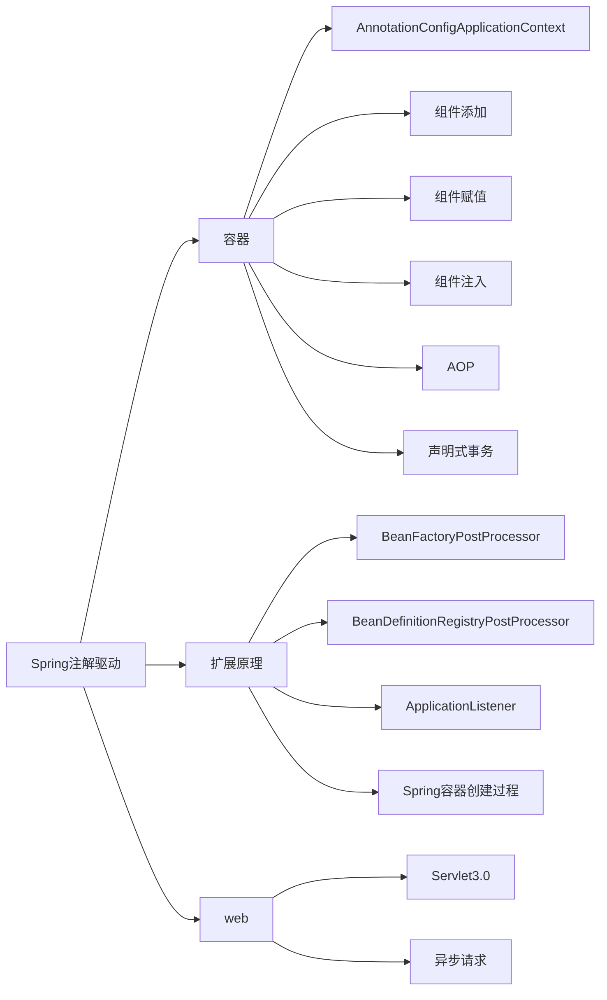
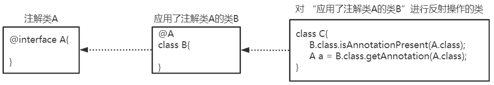
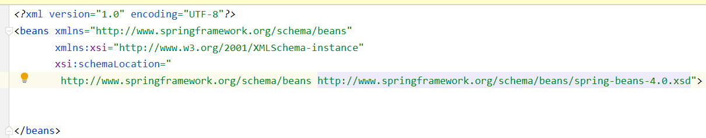

# Spring AnnotationDriver

@(Spring)[AuspiceTian]


[TOC]

<div style="page-break-after:always" />



<div style="page-break-after:always" />



## @Configuration

>    @Configuation等价于<Beans></Beans>
>
>    @Bean等价于<Bean></Bean>
>
>    @ComponentScan等价于<context:component-scan base-package=”com.dxz.demo”/>

@Configuration标注在类上，相当于把该类作为spring的xml配置文件中的`<beans>`，作用为：配置spring容器(应用上下文)

```java
/*JavaConfig Class*/
@Configuration
public class TestConfiguration {
    public TestConfiguration() {
        System.out.println("TestConfiguration容器启动初始化。。。");
    }
}
```

其中，TestConfiguration相当于



```java
// @Configuration注解的spring容器加载方式，用AnnotationConfigApplicationContext替换ClassPathXmlApplicationContext
ApplicationContext context = new AnnotationConfigApplicationContext(TestConfiguration.class);
```


可以看到通过反射，启动了TestConfiguration容器

###  AnnotationConfigApplicationContext 注册 AppContext 类的两种方法

#### 1. 将JavaConfig传递给 `AnnotationConfigApplicationContext` 构造函数

```java
 ApplicationContext context = new AnnotationConfigApplicationContext(TestConfiguration.class);
```

#### 2. `AnnotationConfigApplicationContext` 的`register` 方法传入配置类

```java
public static void main(String[] args) {
  ApplicationContext ctx = new AnnotationConfigApplicationContext();
  ctx.register(AppContext.class)
}
```

### @Bean("BeanName")

>   @Bean标注在方法上(返回某个实例的方法)，等价于spring的xml配置文件中的`<bean>`，作用为：注册bean对象

```java
/*Bean类*/

public class TestBean {
    private String username;
    private String url;
    private String password;

    public void sayHello() {
        System.out.println("TestBean sayHello...");
    }

    public String toString() {
        return "username:" + this.username + ",url:" + this.url + ",password:" + this.password;
    }

    public void start() {
        System.out.println("TestBean 初始化。。。");
    }

    public void cleanUp() {
        System.out.println("TestBean 销毁。。。");
    }
}
```

```java
/*JavaConfig Class*/
@Configuration
public class TestConfiguration {
    public TestConfiguration() {
        System.out.println("TestConfiguration容器启动初始化。。。");
    }

    // @Bean注解注册bean,同时可以指定初始化和销毁方法
    // @Bean(name="testBean",initMethod="start",destroyMethod="cleanUp")
    // Spring万物皆是Bean，不new为原则 ==> @Component配合@ComponentScan实现注入
    @Bean
    @Scope("prototype")
    public TestBean testBean() {
        return new TestBean();
    }
}
```

```java
ApplicationContext context = new AnnotationConfigApplicationContext(TestConfiguration.class);

TestBean tb = context.getBean("testBean",TestBean.class);
tb.sayHello();
```


-   @Bean注解在返回实例的方法上，如果未通过@Bean指定bean的名称，则默认与标注的方法名相同； 
-   @Bean注解默认作用域为单例singleton作用域，可通过@Scope(“prototype”)设置为原型作用域； 
-   可以使用@Component、@Controller、@Service、@Ripository等注解注册bean
    -   需要配置@ComponentScan注解进行自动扫描。

##### @Bean下管理bean的生命周期

>   即 `initMethod` 和`destroyMethod`，这些属性可用于定义生命周期方法。在实例化 bean 或即将销毁它时，容器便可调用生命周期方法。
>
>   
>
>   生命周期方法也称为回调方法，因为它由容器调用。


### @Component+@ComponentScan自动装配

```java
//将该类作为组件注册到Spring容器中
package com.kuang.demo.configuration;
@Component
public class TestBean {

    private String username;
    private String url;
    private String password;

    public void sayHello() {
        System.out.println("TestBean sayHello...");
    }

    public String toString() {
        return "username:" + this.username + ",url:" + this.url + ",password:" + this.password;
    }

    public void start() {
        System.out.println("TestBean 初始化。。。");
    }

    public void cleanUp() {
        System.out.println("TestBean 销毁。。。");
    }
}
```

```java
/*JavaConfig Class*/
@Configuration
//添加自动扫描注解，basePackages为TestBean包路径
@ComponentScan(basePackages = "com.kuang.demo.configuration")
public class TestConfiguration {
    public TestConfiguration() {
        System.out.println("TestConfiguration容器启动初始化。。。");
    }

    /*
    // @Bean注解注册bean,同时可以指定初始化和销毁方法
    // @Bean(name="testNean",initMethod="start",destroyMethod="cleanUp")
    @Bean
    @Scope("prototype")
    public TestBean testBean() {
        return new TestBean();
    }
    */
}
```

### web.xml中配置AnnotationConfigApplicationContext

过去通常需要在 Web 部署描述符文件 web.xml 中指定外部 XML 上下文文件的路径

```xml
<web-app>
    <servlet>
        <servlet-name>sampleServlet</servlet-name>
        <servlet-class>
            org.springframework.web.servlet.DispatcherServlet
        </servlet-class>
    </servlet>
    
    <context-param>
        <param-name>contextConfigLocation</param-name>
        <param-value>classPath:applicationContext.xml</param-value>
    </context-param>
    <listener>
        <listener-class>
            org.springframework.web.context.ContextLoaderListener
        </listener-class>
    </listener>

...
</web-app>
```

现在，将 web.xml 中的上述代码更改为使用 AnnotationConfigApplicationContext 类

```xml
<web-app>
    <servlet>
        <servlet-name>sampleServlet</servlet-name>
        <servlet-class>
            org.springframework.web.servlet.DispatcherServlet
        </servlet-class>
        <init-param>
            <param-name>contextClass</param-name>
            <param-value>
                org.springframework.web.context.
                support.AnnotationConfigWebApplicationContext
            </param-value>
        </init-param>
    </servlet>
    
    <context-param>
        <param-name>contextClass</param-name>
        <param-value>
            org.springframework.web.context.
            support.AnnotationConfigWebApplicationContext
        </param-value>
    </context-param>
    <context-param>
        <param-name>contextConfigLocation</param-name>
        <param-value>
            demo.AppContext
        </param-value>
    </context-param>
    
    <listener>
        <listener-class>
            org.springframework.web.context.ContextLoaderListener
        </listener-class>
    </listener>
    
...
</web-app>
```

以上修改后的 `web.xml` 现在定义了 `AnnotationConfigWebApplicationContext` 上下文类，并将其作为上下文参数和 servlet 元素的一部分。上下文配置位置现在指向 `AppContext` 配置类。

### @Configuration组合多个配置

#### 1. 引入spring的xml配置文件

```java
@Configuration
@ImportResource("classpath:applicationContext-configuration.xml")
public class WebConfig {
}
```

#### 2. 在@configuration中引入其它注解配置

```java
@Configuration
@Import(TestConfiguration.class)
public class WebConfig {
}
```

#### 3. @configuration嵌套

**嵌套的Configuration必须是静态类**

```java
@Configuration
@ComponentScan(basePackages = "com.dxz.demo.configuration3")
public class TestConfiguration {
    public TestConfiguration() {
        System.out.println("TestConfiguration容器启动初始化。。。");
    }

    @Configuration
    static class DatabaseConfig {
        @Bean
        DataSource dataSource() {
            return new DataSource();
        }
    }
}
```

```java
 // @Configuration注解的spring容器加载方式，用AnnotationConfigApplicationContext替换ClassPathXmlApplicationContexts
ApplicationContext context = new AnnotationConfigApplicationContext(TestConfiguration.class);

//bean
TestBean tb = (TestBean) context.getBean("testBean");
tb.sayHello();

DataSource ds = (DataSource) context.getBean("dataSource");
System.out.println(ds);
```

## @Enable***


