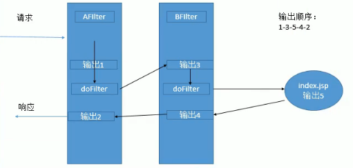
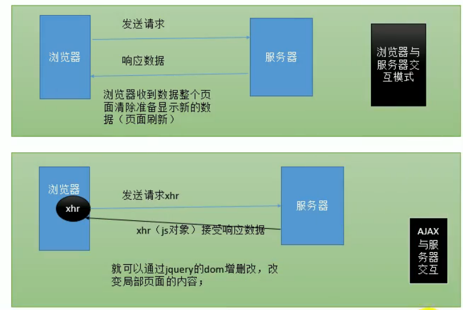

# Spring

@(Spring)[Auspice Tian]

[TOC]

<div style="page-break-after:always"></div>

## JaveWeb

### 三大组件

JavaWeb的三大组件，都需要web.xml进行注册（特殊：Listener活化、钝化、绑定、解绑用JavaBean实现）

1.  Servlet：处理请求

2.  Filter：过滤拦截请求

    -   使用步骤：实现Filter接口 -> 去Web.xml进行配置 

    -   实现

        ```java
        doFilter(){ 
            //放行请求
            chain.doFilter(req,res);
        }
        ```

    -   配置

        ```xml
        <filter>
            <filter-name></filter-name>
            <filter-class></filter-class>
        </filter>
        
        <filter-mapping>
        	<filter-name></filter-name>
            <url-pattern></url-pattern>
        </filter-mapping>
        
        <!--
        url-pattern的三种方式
        1. 精确匹配-直接拦截指定路径（/pics/hh.jsp）
        2. 路径匹配-拦截路径下所有请求（/pics/*）
        3. 后缀匹配-拦截所有该后缀的请求（*.jsp）
        -->
        ```

    -   多个Filter的访问顺序

        

3.  Listener：监听器

    -   监听对象

        ServeletRequest(2),HttpSession(4),ServletContext(2)

        2：生命监听器，属性变化监听器

        HttpSession：活化钝化监听器、解绑绑定监听器

    -   掌握：ServletContext（生命周期监听器）

        监听服务器的启动、停止——ServletContext对象的创建与销毁

         	一个Web项目对应一个ServletContext，代表当前项目的信息

        ​	可以作为最大的域对象，项目运行期间共享数据

    -   使用：实现对应的监听器接口 -> 配置 web.xml

        JavaBean要实现的接口：HttpSessionActivitionListener,HttpSessionBindingListener

### Json

>   JSON：JavaScript Object Notation
>
>   ​	轻量级数据交换格式——与XML相比

```json
<!--js对象-->
var 变量名 = {key:value,key:value}

基本数据类型，数组，对象
var student = {lastName:"张三",age:18}

<!--转换方法-->
JSON = JSON.stringify(var)
var = JSON.parse(JSON)
```

### AJAX

>   AJAX：Asynchronous JavaScript And XML 异步JavaScript和XML
>
>   ​	页面不刷新获取服务器相应的数据

XmlHttpRequest对象

1.  XmlHttpRequest发起请求

2.  服务器收到请求，调用相应的Servlet进行处理，生成相应的响应信息
3.  XmlHttpRequest接收数据



```javascript
<!-- JS原生AJAX -->
var xhr = new XMLHttpRequest();//创建xhr对象
xhr.open("GET","路径","true");//建立连接
xhr.send();通过地道传输数据

//监听xhr的状态
xhr.onReadyStateChange = function(){
    if(xhr.readyState == 4 && xhr.status == 200){
        document.getElementById("").innerHTML = xhr.responseText;
    }
}
```

```javascript
$('#uid').click(function(){
    <!-- jquery封装AJAX -->
    $.get(url, [data], [callback], [type])
    //[type]一般不写
    $.get("${ctp}/getInfo",{待发送的数据对象},function([存储回调数据的变量]){})

    //参数用法是一样的，一个发的是POST请求，一个是GET请求
    $.post(url, [data], [callback], [type])
    若[type]为“json”，则jquery会自动转化为JSON对象

    $.ajax()
    var options = {
        url:"路径",
        type:"GET"/"POST",//请求方式
        data:{}，//发送的数据
        success:function(data){},
		dataType:"json",//指定返回数据的类型
        error:function(a,b){}//指定响应失败的处理函数
    };

    $.ajax(options);

    //禁用默认行为
    return false;
})
```

<div style="page-break-after:always"></div>

## Spring简介

