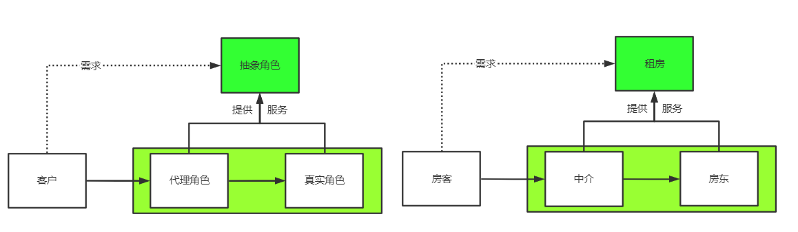
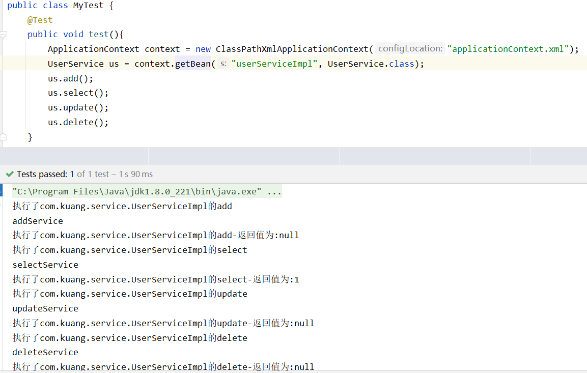

# Spring

@(Spring)[Auspice Tian]

[TOC]

<div style="page-break-after:always" />

## Spring简介

>   轻量级控制反转(IOC)和面向切面编程(AOP)的容器框架

-   2002，interface21 Spring框架雏形
-   Spring理念：整合现有的框架
-   SSH：Struct2 + Spring + Hibernate
-   SSM：SpringMVC + Spring + MyBatis

### 官网

(文档地址)[https://docs.spring.io/spring-framework/docs/current/reference/html/index.html]

(各版本文档)[https://docs.spring.io/spring-framework/docs/]

(下载地址)[https://repo.spring.io/release/org/springframework/spring/]

```xml
<dependency>
    <groupId>org.springframework</groupId>
    <artifactId>spring-webmvc</artifactId>
    <version>5.3.3</version>
</dependency>
<dependency>
    <groupId>org.springframework</groupId>
    <artifactId>spring-jdbc</artifactId>
    <version>5.3.3</version>
</dependency>
```

### 优点

-   开源的框架
-   轻量级的、非入侵式的框架
-   控制反转(IOC)、面向切面编程(AOP)
-   支持事务处理
-   对框架整合的支持

弊端：发展太久，配置十分繁琐

-   配置地狱

### 组成


### 拓展

-   Spring Boot:快速开发脚手架
    -   快速开发单个微服务
    -   约定大于配置
-   Spring Cloud：协调
    -   基于Spring Boot实现
    -   微服务的整合

<div style="page-break-after:always" />

## The IoC Container

### IoC推导

**原先**

1.  UserDao接口

    ```java
    public interface UserDao {
        public void getUser();
    }
    ```

2.  UserDaoImpl实现类

    ```java
    //UserDaoImpl.class
    public class UserDaoImpl implements UserDao{
        public void getUser(){
            System.out.println("获取用户数据");
        }
    }
    
    //UserDaoMysqlImpl
    public class UserDaoMysqlImpl implements UserDao{
        public void getUser(){
            System.out.println("MySql获取用户数据");
        }
    }
    
    //UserDaoOracleImpl
    public class UserDaoOracleImpl implements UserDao{
        public void getUser(){
            System.out.println("Oracle实现获取用户数据");
        }
    }
    ```

3.  UserService业务接口

    ```java
    public interface UserService {
        public void getUser();
    }
    ```

4.  ==UserServicelmpl业务实现类==

    ```java
    public class UserServiceImpl implements UserService{
        private UserDao userDao = new UserDaoMysqlImpl();
    						//  = new UserDaoOracleImpl();
       						//  = new UserDaoImpl();
        public void getUser(){
            userDao.getUser();
        }
    }
    ```

5.  MyTest

    ```java
    public class MyTest {
        public static void main(String[] args) {
            //用户实际调用的是业务层
            UserService userService = new UserServiceImpl();
            userService.getUser();
        }
    }
    ```

    

**IOC雏形**

1.  UserDao接口

    ```java
    public interface UserDao {
        public void getUser();
    }
    ```

2.  UserDaoImpl实现类

    ```java
    //UserDaoImpl.class
    public class UserDaoImpl implements UserDao{
        public void getUser(){
            System.out.println("获取用户数据");
        }
    }
    
    //UserDaoMysqlImpl
    public class UserDaoMysqlImpl implements UserDao{
        public void getUser(){
            System.out.println("MySql获取用户数据");
        }
    }
    
    //UserDaoOracleImpl
    public class UserDaoOracleImpl implements UserDao{
        public void getUser(){
            System.out.println("Oracle实现获取用户数据");
        }
    }
    ```

3.  UserService业务接口

    ```java
    public interface UserService {
        public void getUser();
    }
    ```

4.  ==UserServicelmpl业务实现类==

    ```java
    public class UserServiceImpl implements UserService{
        private UserDao userDao;
    
        public void setUserDao(UserDao userDao){
            this.userDao = userDao;
        }
    
        public void getUser(){
            userDao.getUser();
        }
    }
    ```

5.  MyTest

    ```java
    public class MyTest {
        public static void main(String[] args) {
            //用户实际调用的是业务层
            UserService userService = new UserServiceImpl();
    
            ((UserServiceImpl)userService).setUserDao(new UserDaoOracleImpl());
            userService.getUser();
        }
    }
    ```

    

#### **控制反转的关键**

```java
public void setUserDao(UserDao userDao){
    this.userDao = userDao;
}
```

>   之前，程序主动创建对象，控制权在程序
>
>   使用set注入，程序变成了被动接收对象

-   程序员不用再去管理对象的创建

-   系统的耦合性降低，更加专注在业务实现上，这是IOC的原型

### IoC本质

**IOC是一种设计思想，DI（依赖注入）是实现IOC的一种方法，在Spring中实现IoC的是IoC容器**

>    ==控制反转：获得对象的方式反转==
>
>   -   程序由主动创建对象变为被动接收对象
>
>   
>
>   ==依赖注入==
>
>   -   利用set方法进行注入

### IoC是Spring框架的核心

>   控制反转是一种通过描述（XML或注解）及第三方去生产或获取特定对象的方式。

-   可使用XML配置

    采用XML方式配置Bean，Bean的定义与实现分离

-   使用注解配置

    采用注解方式将Bean的定义和实现合为一体

    Bean的定义信息直接以注解的形式定义在实现类中，从而达到零配置目的

**`IoC容器即对象由Spring来创建，管理，装配`**

-   不再需要改动程序，要实现不同的操作，只需在xml配置文件中进行修改

#### 相关jar包

The`org.springframework.beans`and`org.springframework.context`packages are the basis for Spring Framework’s IoC container.

```xml
<dependency>
    <groupId>org.springframework</groupId>
    <artifactId>spring-beans</artifactId>
    <version>5.2.0.RELEASE</version>
</dependency>
<dependency>
    <groupId>org.springframework</groupId>
    <artifactId>spring-context</artifactId>
    <version>5.2.0.RELEASE</version>
</dependency>
```

#### xml方式

##### beans.xml

```xml
<?xml version="1.0" encoding="UTF-8"?>
<beans xmlns="http://www.springframework.org/schema/beans"
    xmlns:xsi="http://www.w3.org/2001/XMLSchema-instance"
    xsi:schemaLocation="http://www.springframework.org/schema/beans
        https://www.springframework.org/schema/beans/spring-beans.xsd">
    
	<bean id="userServiceImpl" class="com.kuang.service.UserServiceImpl">
        <property name="userDao" ref="userDaoMysqlImpl"/>
    </bean>
    
</beans>
```

##### 获取IoC容器(Spring的Context对象)中类资源

The [`BeanFactory`](https://docs.spring.io/spring-framework/docs/5.3.3/javadoc-api/org/springframework/beans/factory/BeanFactory.html) interface provides an advanced configuration mechanism capable of managing any type of object. [`ApplicationContext`](https://docs.spring.io/spring-framework/docs/5.3.3/javadoc-api/org/springframework/context/ApplicationContext.html) is a sub-interface of `BeanFactory`.

```jade
ApplicationContext applicationContext = new ClassPathXmlApplicationContext("");
```

The `ApplicationContext` is the interface for an advanced factory capable of maintaining a registry of different beans and their dependencies. By using the method `T getBean(String name, Class<T> requiredType)`, you can retrieve instances of your beans.

##### test

```java
@Test
public void test(){
    ApplicationContext applicationContext = new ClassPathXmlApplicationContext("beans.xml");

    UserService userService = (UserServiceImpl) applicationContext.getBean("userServiceImpl");
    userService.getUser();
}
```

### Spring配置

#### 别名——alias

```xml
<bean id="hello" class="com.kuang.pojo.Hello">
    <constructor-arg name="str" value="Spring"/>
</bean>

<alias name="hello" alias="h"/>
```


#### import

>   将多个配置文件导入到一个

```xml
<!--applicationContext.xml-->
<import resource="beans1.xml">
<import resource="beans2.xml">
<import resource="beans3.xml">
```

#### bean

```xml
<bean id="hello" class="com.kuang.pojo.Hello" name="hello2,u2">
    <constructor-arg name="str" value="Spring"/>
</bean>
```

-   The `id` attribute is a string that identifies the individual bean definition.

-   The `class` attribute defines the type of the bean and uses the fully qualified classname.`全限定名`:包名+类型
-    If you want to introduce other `aliases` for the bean, you can also specify them in the `name` attribute, separated by a comma (`,`), semicolon (`;`), or white space ` `
-   <bean>中配置的是交给IoC容器管理的类资源
    -   The `property name` element refers to the name of the JavaBean property
    -   and the `ref` element refers to the name of another bean definition. 

### ==依赖注入DI==

-   依赖：bean对象的创建依赖于IoC容器
-   注入：bean对象中的所有属性，由容器来注入

####  1. IoC创建对象方式——构造器注入

>   在配置文件加载时，容器中管理的对象就已被初始化

##### 默认使用无参构造器创建对象

##### 使用有参构造器构造对象

1.  下标赋值-index

    ```xml
    <bean id="hello" class="com.kuang.pojo.Hello">
        <constructor-arg index="0" value="Spring"/>
    </bean>
    ```

2.  参数类型匹配-type

    ```xml
    <bean id="hello" class="com.kuang.pojo.Hello">
        <constructor-arg type="java.lang.String" value="Spring"/>
    </bean>
    ```

3.  ==直接通过参数名设置-name==

    ```xml
    <bean id="hello" class="com.kuang.pojo.Hello">
        <constructor-arg name="str" value="Spring"/>
    </bean>
    ```

#### 2.`set方式注入`

```java
public class Student {
    private String name;//基本数据类型 DI
    private Address address;//引用数据类型 DI
    private String[] books;//数组 DI
    private List<String> hobbys;//List DI
    private Map<String,String> card;// Map DI
    private Set<String> games;//Set DI
    private String wife;//null DI
    private Properties info;//properties DI
}
```

##### 基本数据类型

```xml
<bean id="student" class="com.kuang.pojo.Student">
    <property name="name" value="Auspice Tian"/>
</bean>
```

##### bean

```xml
<bean id="beijing" class="com.kuang.pojo.Address">
    <property name="address" value="北京"/>
</bean>

<bean id="student" class="com.kuang.pojo.Student">
	<property name="address" value="beijing"/>
</bean>
```

##### array

```xml
<property name="books">
    <array>
        <value>红楼梦</value>
        <value>西游记</value>
        <value>水浒传</value>
        <value>三国演义</value>
    </array>
</property>
```

##### list

```xml
<property name="hobbys">
    <list>
        <value>ggg</value>
        <value>ppp</value>
        <value>zzz</value>
    </list>
</property>
```

##### map

```xml
<property name="card">
    <map>
        <entry key="身份证" value="123456789111111"/>
        <entry key="学生证" value="123456489789789"/>
    </map>
</property>
```

##### set

```xml
<property name="games">
    <set>
        <value>LOL</value>
        <value>COC</value>
        <value>BOB</value>
    </set>
</property>
```

##### null

```xml
<property name="wife">
    <null></null>
</property>
```

##### property

```xml
<property name="info">
    <props>
        <prop key="driver">driver</prop>
        <prop key="url">url</prop>
        <prop key="username">root</prop>
        <prop key="password">2017002231</prop>
    </props>
</property>
```


#### 第三方注入

>   可直接注入基本数据类型和bean

##### p-namespace(set注入)

导入约束：_xmlns:p="http://www.springframework.org/schema/p"_

```xml
<beans xmlns="http://www.springframework.org/schema/beans"
    xmlns:xsi="http://www.w3.org/2001/XMLSchema-instance"
    xmlns:p="http://www.springframework.org/schema/p"
    xsi:schemaLocation="http://www.springframework.org/schema/beans
        https://www.springframework.org/schema/beans/spring-beans.xsd">
	<bean name="john-modern" class="com.example.Person"
        p:name="John Doe"
        p:spouse-ref="jane"/>

    <bean name="jane" class="com.example.Person">
        <property name="name" value="Jane Doe"/>
    </bean>
    
    <!--等价于
	<bean name="john-classic" class="com.example.Person">
        <property name="name" value="John Doe"/>
        <property name="spouse" ref="jane"/>
    </bean>
	-->
</beans>
```

##### c-namespace(constructor注入)

导入约束：_xmlns:c="http://www.springframework.org/schema/c"_

```xml
<beans xmlns="http://www.springframework.org/schema/beans"
    xmlns:xsi="http://www.w3.org/2001/XMLSchema-instance"
    xmlns:c="http://www.springframework.org/schema/c"
    xsi:schemaLocation="http://www.springframework.org/schema/beans
        https://www.springframework.org/schema/beans/spring-beans.xsd">

    <bean id="beanTwo" class="x.y.ThingTwo"/>
    <bean id="beanThree" class="x.y.ThingThree"/>

    <!-- traditional declaration with optional argument names -->
    <bean id="beanOne" class="x.y.ThingOne">
        <constructor-arg name="thingTwo" ref="beanTwo"/>
        <constructor-arg name="thingThree" ref="beanThree"/>
        <constructor-arg name="email" value="something@somewhere.com"/>
    </bean>

    <!-- c-namespace declaration with argument names -->
    <bean id="beanOne" class="x.y.ThingOne" 
          c:thingTwo-ref="beanTwo"
          c:thingThree-ref="beanThree"
          c:email="something@somewhere.com"/>

</beans>
```

### Bean Scopes(作用域)

```xml
<bean id="student" class="com.kuang.pojo.Student" scope="singleton | prototype">
```

| Scope                                                        | Description                                                  |
| :----------------------------------------------------------- | :----------------------------------------------------------- |
| [singleton](https://docs.spring.io/spring-framework/docs/current/reference/html/core.html#beans-factory-scopes-singleton) | (`Default`) Scopes a single bean definition to a single object instance for each Spring IoC container.全局唯一 |
| [prototype](https://docs.spring.io/spring-framework/docs/current/reference/html/core.html#beans-factory-scopes-prototype) | Scopes a single bean definition to any number of object instances. |
| [request](https://docs.spring.io/spring-framework/docs/current/reference/html/core.html#beans-factory-scopes-request) | Scopes a single bean definition to the lifecycle of a single HTTP request. That is, each HTTP request has its own instance of a bean created off the back of a single bean definition. Only valid in the context of a web-aware Spring `ApplicationContext`. |
| [session](https://docs.spring.io/spring-framework/docs/current/reference/html/core.html#beans-factory-scopes-session) | Scopes a single bean definition to the lifecycle of an HTTP `Session`. Only valid in the context of a web-aware Spring `ApplicationContext`. |
| [application](https://docs.spring.io/spring-framework/docs/current/reference/html/core.html#beans-factory-scopes-application) | Scopes a single bean definition to the lifecycle of a `ServletContext`. Only valid in the context of a web-aware Spring `ApplicationContext`. |
| [websocket](https://docs.spring.io/spring-framework/docs/current/reference/html/web.html#websocket-stomp-websocket-scope) | Scopes a single bean definition to the lifecycle of a `WebSocket`. Only valid in the context of a web-aware Spring `ApplicationContext`. |

#### Singleton(单例模式)-单线程


-   全局唯一，共享同一对象

#### prototype(原型模式)-多线程


>   每次getBean()都会得到新的对象

### ==Bean==的自动装配

>   Spring会在上下文中自动寻找，自动装配属性

#### 在xml中显式配置

```xml
<bean id="cat" class="com.kuang.pojo.Cat" />
<bean id="dog" class="com.kuang.pojo.Dog" />

<bean id="person" class="com.kuang.pojo.Person">
    <property name="cat" ref="cat"/>
    <property name="dog" ref="dog"/>
    <property name="name" value="Auspice Tian"/>
</bean>
```

#### 隐式自动装配Bean

##### ByName自动装配

**setter的形参名与容器中的bean.id相同**

**bean的id唯一**

-   java.lang.NullPointerException

```xml
<bean id="person" class="com.kuang.pojo.Person" autowire="byName" />
```

##### ByType自动装配

**属性类型与bean类型相同**

**与属性类型相同的Bean唯一**

-   expected single matching bean but found 2: cat1,cat2

```xml
<bean id="person" class="com.kuang.pojo.Person" autowire="byType" />
```

#### 使用注解自动装配【重点】

>   Spring 2.5开始支持，JDK1.5支持注解

1.  导入约束

    _xmlns:context="http://www.springframework.org/schema/context"_

    _xsi:schemaLocation="http://www.springframework.org/schema/beans https://www.springframework.org/schema/beans/spring-beans.xsd http://www.springframework.org/schema/context https://www.springframework.org/schema/context/spring-context.xsd"_

2.  配置注解的支持==\<context:annotation-config/>==

    ```xml
    <?xml version="1.0" encoding="UTF-8"?>
    <beans xmlns="http://www.springframework.org/schema/beans"       xmlns:xsi="http://www.w3.org/2001/XMLSchema-instance"
    xmlns:context="http://www.springframework.org/schema/context"       xsi:schemaLocation="http://www.springframework.org/schema/beans https://www.springframework.org/schema/beans/spring-beans.xsd     http://www.springframework.org/schema/context
    https://www.springframework.org/schema/context/spring-context.xsd">
    
        <context:annotation-config/>
    </beans>
    ```

**@AutoWired**

>   在 ==bean属性==或==setters==上注解
>
>   相当于byType

-   @Qualifier(value="cat1111")
    -   通过bean.id指定容器中装配的Bean
    -   当IoC Container环境复杂，搭配使用
-   @Nullable：表示这个注解修饰的内容允许为Null
    -   METHOD、PARAMETER、FIELD
-   @AutoWired(required=false)：表示该注解修饰的内容可以为空
    -   CONSTRUCTOR、METHOD、PARAMETER、FIELD、ANNOTATION_TYPE

**@Resource**

>   当 ByName失效，通过ByType找到唯一的类型匹配的Bean

-   @Resource(name="指定bean.id")

#### ==在java中显式配置——零配置xml==

JavaConfig是Spring的子项目，Spring4后，称为核心功能


```java
//com.config.AppConfig.java

@Configuration
//相当于<beans> 由IoC容器托管，被@Component注解
@Import(AppConfig2.class)//导入其他配置文件
@ComponentScan("com.kuang")//指定扫描的包，使包下注解生效
public class AppConfig {
    @Bean
    /* 注册一个Bean 相当于<bean>
    * 返回值类型相当于 bean.class
    * 函数名相当于bean.id
    * */
    public User user(){
        return new User(); //返回要注入到容器中的对象
    }
}
```


### 使用Spring注解开发

>   在Spring4之后，使用注解开发，必须保证==aop包==导入
>
>   使用注解需要导入context约束，增加context配置

指定要扫描的包，该包下的注解会生效==\<context:component-scan base-package="com.kuang.pojo"/>==

```xml
<?xml version="1.0" encoding="UTF-8"?>
<beans xmlns="http://www.springframework.org/schema/beans"       
       xmlns:xsi="http://www.w3.org/2001/XMLSchema-instance"
       xmlns:context="http://www.springframework.org/schema/context"       
       xsi:schemaLocation="http://www.springframework.org/schema/beans 
       https://www.springframework.org/schema/beans/spring-beans.xsd     
       http://www.springframework.org/schema/context
        https://www.springframework.org/schema/context/spring-context.xsd">

    <context:component-scan base-package="com.kuang.pojo"/>
    <context:annotation-config/>
</beans>
```

#### @Component——bean

>   组件，放在类上，说明这个类被Spring管理，就是Bean

```java
/*
* @Component 相当于<bean id="user" class="com.kuang.pojo.User"/>
* */
@Component
public class User {
    private String name = "Auspice Tian";
    
    /* setters and getters */
}
```

##### 衍生注解

在Web开发中，会按照MVC分层，与@Component等价

-   Dao
    -   @Repository
-   Service
    -   @Service
-   Controller
    -   @Controller

#### @Value("")——属性

>   通过注解注入，在属性与属性的setters()上注入等价

```java
@Component
public class User {
    @Value("Auspice Tian")
    private String name;
    
    @Value("Auspice Tian")
    public void setName(String name) {
        this.name = name;
    }
}
```

####  自动装配

**@AutoWired**

>   在 ==属性==或==setters==上注解
>
>   相当于byType

-   @Qualifier(value="cat1111")
    -   通过bean.id指定容器中装配的Bean
    -   当IoC Container环境复杂，搭配使用
-   @Nullable：表示这个注解修饰的内容允许为Null
    -   METHOD、PARAMETER、FIELD
-   @AutoWired(required=false)：表示该注解修饰的内容可以为空
    -   CONSTRUCTOR、METHOD、PARAMETER、FIELD、ANNOTATION_TYPE

#### 作用域

@Scope("")

-   singleton
-   prototype

#### XML用于管理Bean,Annotation用于管理属性注入

<div style="page-break-after:always" />

## AOP

### ==代理模式==

>    代理模式是Spring AOP的底层【Spring AOP】【Spring MVC】

-   抽象角色：接口或抽象类表示
-   真实角色：被代理角色
-   代理角色：代理真实角色
-   客户：访问代理对象

#### 静态代理(静态生成代理类)



1.  抽象角色

    ```java
    /* 抽象角色 */
    public interface Rent {
        public void rent();
    }
    ```

2.  真实角色

    ```java
    /* 真实角色 */
    public class Host implements Rent{
        public void rent(){
            System.out.println("房东出租房子");
        }
    }
    ```

3.  代理角色

    ```java
    /* 代理角色 */
    public class Agent implements Rent{
        Host host;
    
        public Agent(Host host) {
            this.host = host;
        }
    
        public void rent(){
            visit();
            host.rent();
            assign();
            fare();
        }
    
        public void visit(){
            System.out.println("预约看房");
        }
    
        public void assign(){
            System.out.println("签合同");
        }
    
        public void fare(){
            System.out.println("收中介费");
        }
    }
    ```

4.  客户访问代理角色

    ```java
    /* 客户 */
    public class Client {
        public static void main(String[] args) {
            Host host = new Host();
            Agent agent = new Agent(host);
    
            agent.rent();
        }
    }
    ```

1.  抽象角色

```java
/*用户服务：抽象角色*/
public interface UserDao {
    public void add();
    public void delete();
    public void update();
    public void query();
}
```

2.  真实角色

    ```java
    /*实现用户服务功能：真实角色*/
    public class UserDaoImpl implements UserDao {
    
        @Override
        public void add() {
            System.out.println("实现新增用户");
        }
    
        @Override
        public void delete() {
            System.out.println("实现删除用户");
        }
    
        @Override
        public void update() {
            System.out.println("实现更新用户");
        }
    
        @Override
        public void query() {
            System.out.println("实现查询用户");
        }
    }
    ```

3.  代理

    ```java
    public class Proxy implements UserDao{
        UserDaoImpl user;
    
        public void setUser(UserDaoImpl user) {
            this.user = user;
        }
    
        @Override
        public void add() {
            log("add");
            user.add();
        }
    
        @Override
        public void delete() {
            log("delete");
            user.delete();
        }
    
        @Override
        public void update() {
            log("update");
            user.update();
        }
    
        @Override
        public void query() {
            log("query");
            user.query();
        }
    
        public void log(String msg){
            System.out.println("[DEBUG]实现"+msg+"日志功能!");
        }
    }
    ```

4.  客户

    ```java
    /*使用用户功能：客户*/
    public class Client {
        public static void main(String[] args) {
            UserDaoImpl user = new UserDaoImpl();
            Proxy proxy = new Proxy();
    
            proxy.setUser(user);
            proxy.add();
            proxy.query();
            proxy.update();
            proxy.delete();
        }
    }
    ```


优点：

-   真实角色操作更为简单，不用关注公共业务
-   公共业务交给代理角色，实现业务分工
-   公共业务发生扩展，方便集中管理

缺点:

-   每个真实角色都会产生一个代理角色，代码量增多 --> ==动态代理==

#### 动态代理(动态生成代理类)

>   实现机制：反射

-   动态代理的代理类利用反射动态生成
-   **代理的是接口**

##### 分类

-   基于接口的动态代理——JDK动态代理
-   基于类的动态代理——cglib
-   java字节码——Javasist

##### 代理类与调用处理接口

>    **java.lang.reflect.Proxy**

```java
public static Object newProxyInstance(ClassLoader loader,
                                      @NotNull Class<?>[] interfaces,
                                      @NotNull reflect.InvocationHandler h)

//params
loader 		– the class loader to define the proxy class
interfaces 	– the list of interfaces for the proxy class to implement
h 			– the invocation handler to dispatch method invocations to
//return
a proxy instance with the specified invocation handler of a proxy class that is defined by the specified class loader and that implements the specified interfaces
```

-   Proxy提供了生成动态代理类的静态方法

>   **Interface  InvocationHandler**  

When a method（抽象角色-->接口） is invoked on a proxy instance, the method invocation is encoded and dispatched to the invoke method of its invocation handler.

每个被代理实例都有一个关联的调用处理程序

1.  抽象角色

    ```java
    public interface Rent {
        public void rent();
    }
    ```

2.  真实角色

    ```java
    public class Host implements Rent{
        public void rent(){
            System.out.println("房东要出租房屋!");
        }
    }
    ```

3.  ==调用处理程序动态生成代理角色、绑定真实角色==

    ```java
    //代理处理程序：自动生成代理类
    public class ProxyInvocationHandler implements InvocationHandler {
        //需要被代理的抽象角色-->接口
        Rent rent;
    
        //通过DI注入抽象角色
        public void setRent(Rent rent) {
            this.rent = rent;
        }
    
        //生成代理角色
        public Object getProxy(){
            
            return Proxy.newProxyInstance(
                //抽象角色的类加载器
                rent.getClass().getClassLoader(),
                //抽象角色的接口
                rent.getClass().getInterfaces(),  
                //该抽象角色的代理处理程序
                this);                                          
        }
    
        //处理代理类实例；返回结果
        @Override
        public Object invoke(Object proxy, Method method, Object[] args) throws Throwable {
            visit();
            Object result = method.invoke(rent,args);
            assign();
            fare();
            
            return result;
        }
        
        /*公共业务*/
        public void visit(){
            System.out.println("看房");
        }
        public void assign(){
            System.out.println("签合同");
        }
        public void fare(){
            System.out.println("中介费");
        }
    }
    ```

4.  客户

    ```java
    public class Client {
        public static void main(String[] args) {
            //真实角色
            Host host = new Host();
    
            //通过InvocationHandler处理要被调用的抽象角色
            ProxyInvocationHandler pih = new ProxyInvocationHandler();
            //调用处理程序与真实角色的绑定
            pih.setRent(host);
    
            //生成代理角色
            Rent proxy = (Rent)pih.getProxy();
            proxy.rent();
        }
    }
    ```


1.  抽象角色-->接口

    ```java
    public interface UserDao {
        public void add();
        public void delete();
        public void update();
        public void query();
    }
    ```

2.  真实角色-->被代理类

    ```java
    public class UserDaoImpl implements UserDao{
        @Override
        public void add() {
            System.out.println("add");
        }
    
        @Override
        public void delete() {
            System.out.println("delete");
        }
    
        @Override
        public void update() {
            System.out.println("update");
        }
    
        @Override
        public void query() {
            System.out.println("query");
        }
    }
    ```

3.  ==调用处理程序-->动态生成代理类的程序==

    ```java
    public class ProxyInvocationHandler implements InvocationHandler {
        //被调用的接口——>抽象角色
        private Object target;
    
        public void setTarget(Object target) {
            this.target = target;
        }
    
        //生成代理
        public Object getProxy(){
            return Proxy.newProxyInstance(
                target.getClass().getClassLoader(),
                target.getClass().getInterfaces(),
                this);
        }
    
        @Override
        public Object invoke(Object proxy, Method method, Object[] args) throws Throwable {
            log(target.getClass().getName());
            Object result = method.invoke(this.target,args);
    
            return result;
        }
    
        /*公共业务*/
        public void log(String msg){
            System.out.println("[DEBUG]调用了"+msg+"方法");
        }
    }
    ```

4.  客户

    ```java
    public class Client {
        public static void main(String[] args) {
            //定义调用处理程序
            ProxyInvocationHandler pih = new ProxyInvocationHandler();
            //调用处理程序与真实角色绑定
            pih.setTarget(new UserDaoImpl());
    
            //获取代理角色，,代理的是接口
            UserDao proxy = (UserDao) pih.getProxy();
            proxy.add();
            proxy.query();
            proxy.update();
            proxy.delete();
        }
    }
    ```


==好处==

-   一个动态代理类代理的是一个接口，对应的是一类业务
-   一个动态代理类可以代理多个类，只要是实现同一接口即可

### AOP简介

(Aspect Oriented Programming):面向切面编程

通过预编译方式和运行期动态代理实现程序功能的统一维护的技术

>    `不影响原先功能的前提下，动态增强`


#### Spring AOP

==提供声明式事务；允许用户自定义切面==

-   横切关注点：跨越应用程序多个模块的方法或功能(公共业务)，与业务逻辑无关，但需要关注的部分。如：日志，安全，缓存，事务
-   切面(aspect)：横切关注点被模块化的对象-->类
-   通知(advisor)：切面必须完成的工作-->类中的方法
-   目标(impl)：被通知对象-->真实角色
-   代理(Proxy)：      -->代理角色
-   切入点(pointcut)：切面指定地点-->方法插入位置
-   连接点(JointPoint)：切入点对应的执行点


### Maven导入aop依赖

```xml
<dependency>
    <groupId>org.aspectj</groupId>
    <artifactId>aspectjweaver</artifactId>
    <version>1.9.4</version>
</dependency>
```

### 方法一：实现Spring定义的切入点通知

| 通知类型     | 连接点             | 需实现的接口                                    |
| ------------ | ------------------ | ----------------------------------------------- |
| 前置通知     | 方法前             | org.springframework.aop.MethodBeforeAdvice;     |
| 后置通知     | 方法后             | org.springframework.aop.AfterReturningAdvice    |
| 环绕通知     | 方法前后           | org.aopalliance.intercept.MethodInterceptor     |
| 异常抛出通知 | 方法抛出异常时     | org.springframework.aop.ThrowsAdvice            |
| 引介通知     | 类中新增方法或属性 | org.springframework.aop.IntroductionInterceptor |

#### 定义接口-->抽象角色

```java
public interface UserService {
    public void add();
    public void delete();
    public int select();
    public void update();
}
```

#### 接口实现-->真实角色

```java
public class UserServiceImpl implements UserService{
    @Override
    public void add() {
        System.out.println("addService");
    }

    @Override
    public void delete() {
        System.out.println("deleteService");
    }

    @Override
    public int select() {
        System.out.println("selectService");

        return 1;
    }

    @Override
    public void update() {
        System.out.println("updateService");
    }
}
```

#### ==实现通知接口-->代理中的公共业务==

```java
/*代理要做的公共业务 通知 Log.java
* implements 通过Advice定义切入点pointcut
* */
public class Log implements MethodBeforeAdvice {
    /*
    * method：要执行的目标对象的方法
    * objects：参数
    * o：目标对象 target-->接口
    * */
    @Override
    public void before(Method method, Object[] objects, Object o) throws Throwable {
        System.out.println("执行了"+o.getClass().getName()+"的"+method.getName());
    }
}
```

```java
/*代理对象的一个公共业务-->通知 AfterLog.java
 * implements 通过Advice定义切入点pointcut
* */
public class AfterLog implements AfterReturningAdvice {

    @Override
    /*
    * o:返回值
    * method:要执行的目标对象的方法
    * objects:args
    * o1:目标对象 target-->接口
    * */
    public void afterReturning(Object o, Method method, Object[] objects, Object o1) throws Throwable {
        System.out.println("执行了"+o1.getClass().getName()+"的"+method.getName()+"-返回值为:"+o);
    }
}
```

#### IoC配置——applicationContext.xml

```xml
<?xml version="1.0" encoding="UTF-8"?>
<beans xmlns="http://www.springframework.org/schema/beans"
       xmlns:xsi="http://www.w3.org/2001/XMLSchema-instance"
       xmlns:aop="http://www.springframework.org/schema/aop"
       xsi:schemaLocation="http://www.springframework.org/schema/beans
        https://www.springframework.org/schema/beans/spring-beans.xsd
        http://www.springframework.org/schema/aop
        https://www.springframework.org/schema/aop/spring-aop.xsd">

    <!--注册bean-->
    <bean id="userServiceImpl" class="com.kuang.service.UserServiceImpl"/>
    <bean id="log" class="com.kuang.log.Log"/>
    <bean id="afterlog" class="com.kuang.log.AfterLog"/>

    <!--配置aop-->
    <aop:config>
        <!--定义切入点
            expression(要执行的位置)
        -->
        <aop:pointcut id="pc_userService" expression="execution(* com.kuang.service.UserServiceImpl.*(..))" />

        <!--配置通知-->
        <aop:advisor advice-ref="log" pointcut="execution(* com.kuang.service.UserServiceImpl.*(..))"/>
        <aop:advisor advice-ref="afterlog" pointcut-ref="pc_userService"/>
    </aop:config>
</beans>
```

##### aop:expression

 格式 

>   execution( modifiers-pattern? 
>
>   ​				ret-type-pattern declaring-type-pattern?
>
>   ​				name-pattern(param-pattern) throws-pattern?)

-   ret-type-pattern、name-pattern、param-pattern是必须的
-   ret-type-pattern：该方法的返回类型必须是什么才能使连接点匹配
-   param-pattern：
    -   ()匹配不带参数的方法
    -   (..)匹配任意数量（零个或多个）的参数
    -   (*)模式与采用任何类型的一个参数的方法匹配
    -   (*,String)与采用两个参数的方法匹配。第一个可以是任何类型，而第二个必须是字符串

#### Test



###  方法二：自定义通知接口

#### 自定义切面

```java
public class DiyAspect {
    public void before(){
        System.out.println("=========实现前置通知==========");
    }

    public void after(){
        System.out.println("==========实现后置通知==========");
    }
}
```

#### 定义切入点&切面绑定

```xml
<!--方式二：配置aop-->
<bean id="diy" class="com.kuang.advisor.DiyAspect" />
<aop:config>
    <aop:pointcut id="pc_userService" expression="execution(* com.kuang.service.UserServiceImpl.*(..))" />

    <aop:aspect ref="diy">
        <aop:before method="before" pointcut-ref="pc_userService"/>
        <aop:after method="after" pointcut-ref="pc_userService"/>
    </aop:aspect>
</aop:config>
```

#### Test


### 方法三：注解实现AOP

#### 自定义切面

```java
@Aspect
public class AnnotationAspect {
    @Before("execution(* com.kuang.service.UserServiceImpl.*(..))")
    public void before(){
        System.out.println("======方法执行前====");
    }
    
    @After("execution(* com.kuang.service.UserServiceImpl.*(..))")
    public void after(){
        System.out.println("======方法执行后====");
    }
	
    @Around("execution(* com.kuang.service.UserServiceImpl.*(..))")
    //
    public void around(ProceedingJoinPoint jp) throws Throwable {
        System.out.println("环绕前");
        jp.proceed();
        System.out.println("环绕后");
    }
}
```

#### 开启注解支持==\<aop:aspectj-autoproxy/>==


#### 切面注册到IoC容器

```xml
<bean id="diyaspect" class="com.kuang.Aspect.AnnotationAspect" />
<!--开启注解aop-->
<aop:aspectj-autoproxy/>
```

#### Test


<div style="page-break-after:always" />

## 整合MyBatis

### 方式一

#### 导包


```xml
<dependencies>
    <dependency>
        <groupId>junit</groupId>
        <artifactId>junit</artifactId>
        <version>4.13</version>
        <scope>test</scope>
    </dependency>
    <!--mybatis-->
    <dependency>
        <groupId>org.mybatis</groupId>
        <artifactId>mybatis</artifactId>
        <version>3.5.6</version>
    </dependency>
    <dependency>
        <groupId>mysql</groupId>
        <artifactId>mysql-connector-java</artifactId>
        <version>8.0.16</version>
    </dependency>
    <!--spring IoC-->
    <dependency>
        <groupId>org.springframework</groupId>
        <artifactId>spring-webmvc</artifactId>
        <version>5.3.3</version>
    </dependency>
    <!--Spring JDBC,版本不一致会包driverClassName相关的错-->
    <dependency>
        <groupId>org.springframework</groupId>
        <artifactId>spring-jdbc</artifactId>
        <version>5.3.3</version>
    </dependency>
    <!--Spring AOP-->
    <dependency>
        <groupId>org.aspectj</groupId>
        <artifactId>aspectjweaver</artifactId>
        <version>1.9.4</version>
    </dependency>
    <!--Spring整合Mybatis-->
    <dependency>
        <groupId>org.mybatis</groupId>
        <artifactId>mybatis-spring</artifactId>
        <version>2.0.6</version>
    </dependency>

    <dependency>
        <groupId>org.projectlombok</groupId>
        <artifactId>lombok</artifactId>
        <version>1.18.16</version>
    </dependency>
</dependencies>

<build>
    <resources>
        <resource>
            <!-- 使得directory目录下的资源可以被导出 -->
            <directory>src/main/java</directory>
            <!-- 设置可被识别通过的文件类型 -->
            <includes>
                <include>**/*.properties</include>
                <include>**/*.xml</include>
            </includes>
            <filtering>true</filtering>
        </resource>

        <resource>
            <!-- 使得directory目录下的资源可以被导出 -->
            <directory>src/main/resources</directory>
            <!-- 设置可被识别通过的文件类型 -->
            <includes>
                <include>**/*.properties</include>
                <include>**/*.xml</include>
            </includes>
            <filtering>true</filtering>
        </resource>
    </resources>
</build>
```

#### pojo


#### 配置mybatis-config.xml

```xml
<?xml version="1.0" encoding="UTF-8" ?>
<!DOCTYPE configuration
        PUBLIC "-//mybatis.org//DTD Config 3.0//EN"
        "http://mybatis.org/dtd/mybatis-3-config.dtd">
<configuration>
    <typeAliases>
        <package name=""/>
    </typeAliases>
    
    <settings>
        <setting name="" value=""/>
    </settings>
</configuration>
```

#### mapper.java


#### mapper.xml

```xml
<?xml version="1.0" encoding="UTF-8" ?>
<!DOCTYPE mapper
        PUBLIC "-//mybatis.org//DTD Config 3.0//EN"
        "http://mybatis.org/dtd/mybatis-3-mapper.dtd">
<mapper namespace="com.kuang.mapper.UserMapper">
    <select id="getUsers" resultType="user">
        select *from mybatis.user;
    </select>
</mapper>
```

#### ==Spring整合Mybatis== spring-mybatis.xml

```xml
<?xml version="1.0" encoding="UTF-8"?>
<beans xmlns="http://www.springframework.org/schema/beans"
       xmlns:xsi="http://www.w3.org/2001/XMLSchema-instance"
       xmlns:aop="http://www.springframework.org/schema/aop"
       xsi:schemaLocation="http://www.springframework.org/schema/beans
        https://www.springframework.org/schema/beans/spring-beans.xsd
        http://www.springframework.org/schema/aop
        https://www.springframework.org/schema/aop/spring-aop.xsd">

    <!--配置数据源 使用Spring的数据源替换mybatis的数据源-->
    <bean id="dataSource" class="org.springframework.jdbc.datasource.DriverManagerDataSource">
        <property name="driverClassName" value="com.mysql.cj.jdbc.Driver"/>
        <property name="url" value="jdbc:mysql://localhost:3306/mybatis?useSSL=true&amp;useUnicode=true&amp;characterEncoding=utf-8&amp;serverTimezone=UTC"/>
        <property name="username" value="root"/>
        <property name="password" value="2017002231"/>
    </bean>

    <!--配置SqlSessionFactory-->
    <bean id="sqlSessionFactory" class="org.mybatis.spring.SqlSessionFactoryBean">
        <property name="dataSource" ref="dataSource"/>
        <!--绑定,mybatis配置文件-->
        <property name="configLocation" value="classpath:mybatis-config.xml"/>
        <property name="mapperLocations" value="classpath:com/kuang/mapper/*.xml"/>
    </bean>

    <!--配置SqlSession  只能使用构造器注入-->
    <bean id="sqlSession" class="org.mybatis.spring.SqlSessionTemplate">
        <constructor-arg name="sqlSessionFactory" ref="sqlSessionFactory"/>
    </bean>
</beans>
```

>   +从properties文件导入

```properties
#db.properties
mysql_driver=com.mysql.cj.jdbc.Driver
mysql_url=jdbc:mysql://localhost:3306/mybatis?useSSL=true&useUnicode=true&characterEncoding=utf-8&serverTimezone=UTC
root=root
root_pwd=2017002231
```

```xml
<beans      xmlns:context="http://www.springframework.org/schema/context"
xsi:schemaLocation="http://www.springframework.org/schema/context
                    https://www.springframework.org/schema/context/spring-context.xsd">

<context:property-placeholder location="classpath:db.properties"/>
```

#### ==mapperImpl==

```java
public class UserMapperImpl implements UserMapper{
    private SqlSessionTemplate sqlSession;

    public void setSqlSession(SqlSessionTemplate sqlSession) {
        this.sqlSession = sqlSession;
    }

    @Override
    public List<User> getUsers() {
        UserMapper userMapper = sqlSession.getMapper(UserMapper.class);

        return userMapper.getUsers();
    }
}
```

#### spring-mapper.xml——mapper层bean注入Spring

```xml
<?xml version="1.0" encoding="UTF-8"?>
<beans xmlns="http://www.springframework.org/schema/beans"
       xmlns:xsi="http://www.w3.org/2001/XMLSchema-instance"
       xmlns:aop="http://www.springframework.org/schema/aop"
       xsi:schemaLocation="http://www.springframework.org/schema/beans
        https://www.springframework.org/schema/beans/spring-beans.xsd
        http://www.springframework.org/schema/aop
        https://www.springframework.org/schema/aop/spring-aop.xsd">

    <import resource="spring-mybatis.xml"/>

    <bean id="userMapper" class="com.kuang.mapper.UserMapperImpl">
        <property name="sqlSession" ref="sqlSession"/>
    </bean>
</beans>
```

#### applicationContext.xml——Bean整合

```xml
<?xml version="1.0" encoding="UTF-8"?>
<beans xmlns="http://www.springframework.org/schema/beans"
       xmlns:xsi="http://www.w3.org/2001/XMLSchema-instance"
       xmlns:aop="http://www.springframework.org/schema/aop"
       xsi:schemaLocation="http://www.springframework.org/schema/beans
        https://www.springframework.org/schema/beans/spring-beans.xsd
        http://www.springframework.org/schema/aop
        https://www.springframework.org/schema/aop/spring-aop.xsd">

    <import resource="spring-mapper.xml"/>

</beans>
```

#### 测试

```java
ApplicationContext context = new ClassPathXmlApplicationContext("applicationContext.xml");

UserMapper userMapper = context.getBean("userMapper", UserMapper.class);

List<User> users = userMapper.getUsers();
for (User user : users) {
    System.out.println(user);
}
```

### 方式二

#### 导包


```xml
<dependencies>
    <dependency>
        <groupId>junit</groupId>
        <artifactId>junit</artifactId>
        <version>4.13</version>
        <scope>test</scope>
    </dependency>
    <!--mybatis-->
    <dependency>
        <groupId>org.mybatis</groupId>
        <artifactId>mybatis</artifactId>
        <version>3.5.6</version>
    </dependency>
    <dependency>
        <groupId>mysql</groupId>
        <artifactId>mysql-connector-java</artifactId>
        <version>8.0.16</version>
    </dependency>
    <!--spring IoC-->
    <dependency>
        <groupId>org.springframework</groupId>
        <artifactId>spring-webmvc</artifactId>
        <version>5.3.3</version>
    </dependency>
    <!--Spring JDBC,版本不一致会包driverClassName相关的错-->
    <dependency>
        <groupId>org.springframework</groupId>
        <artifactId>spring-jdbc</artifactId>
        <version>5.3.3</version>
    </dependency>
    <!--Spring AOP-->
    <dependency>
        <groupId>org.aspectj</groupId>
        <artifactId>aspectjweaver</artifactId>
        <version>1.9.4</version>
    </dependency>
    <!--Spring整合Mybatis-->
    <dependency>
        <groupId>org.mybatis</groupId>
        <artifactId>mybatis-spring</artifactId>
        <version>2.0.6</version>
    </dependency>

    <dependency>
        <groupId>org.projectlombok</groupId>
        <artifactId>lombok</artifactId>
        <version>1.18.16</version>
    </dependency>
</dependencies>

<build>
    <resources>
        <resource>
            <!-- 使得directory目录下的资源可以被导出 -->
            <directory>src/main/java</directory>
            <!-- 设置可被识别通过的文件类型 -->
            <includes>
                <include>**/*.properties</include>
                <include>**/*.xml</include>
            </includes>
            <filtering>true</filtering>
        </resource>

        <resource>
            <!-- 使得directory目录下的资源可以被导出 -->
            <directory>src/main/resources</directory>
            <!-- 设置可被识别通过的文件类型 -->
            <includes>
                <include>**/*.properties</include>
                <include>**/*.xml</include>
            </includes>
            <filtering>true</filtering>
        </resource>
    </resources>
</build>
```

#### 配置mybatis-config.xml

```java
<?xml version="1.0" encoding="UTF-8" ?>
<!DOCTYPE configuration
        PUBLIC "-//mybatis.org//DTD Config 3.0//EN"
        "http://mybatis.org/dtd/mybatis-3-config.dtd">
<configuration>
    <typeAliases>
        <package name=""/>
    </typeAliases>
    
    <settings>
        <setting name="" value=""/>
    </settings>
</configuration>
```

#### pojo


#### db.properties-->spring-mybatis.xml

```properties
mysqlDriver=com.mysql.cj.jdbc.Driver
mysqlUrl=jdbc:mysql://localhost:3306/mybatis?useSSL=true&useUnicode=true&characterEncoding=utf-8&serverTimezone=UTC
root=root
rootPassword=2017002231
```

```xml
<?xml version="1.0" encoding="UTF-8"?>
<beans xmlns="http://www.springframework.org/schema/beans"
       xmlns:xsi="http://www.w3.org/2001/XMLSchema-instance"
       xmlns:aop="http://www.springframework.org/schema/aop"
       xmlns:context="http://www.springframework.org/schema/context"
       xsi:schemaLocation="http://www.springframework.org/schema/beans
        https://www.springframework.org/schema/beans/spring-beans.xsd
        http://www.springframework.org/schema/aop
        https://www.springframework.org/schema/aop/spring-aop.xsd
        http://www.springframework.org/schema/context 
        https://www.springframework.org/schema/context/spring-context.xsd">
    
    <context:property-placeholder location="db.properties"/>
    
    <!--配置数据源 使用Spring的数据源替换mybatis的数据源-->
    <bean id="dataSource" class="org.springframework.jdbc.datasource.DriverManagerDataSource">
        <property name="driverClassName" value="${mysqlDriver}"/>
        <property name="url" value="${mysqlUrl}"/>
        <property name="username" value="${root}"/>
        <property name="password" value="${rootPassword}"/>
    </bean>
    
    <bean id="sqlSessionFactory" class="org.mybatis.spring.SqlSessionFactoryBean">
        <property name="dataSource" ref="dataSource"/>
        <property name="configLocation" value="classpath:mybatis-config.xml"/>
        <property name="mapperLocations" value="classpath:com/kuang/mapper/*.xml"/>
    </bean>
</beans>
```

#### mapper.java


#### mapper.xml

```xml
<?xml version="1.0" encoding="UTF-8" ?>
<!DOCTYPE mapper
        PUBLIC "-//mybatis.org//DTD Config 3.0//EN"
        "http://mybatis.org/dtd/mybatis-3-mapper.dtd">
<mapper namespace="">
    <select id="getUsers" resultType="user">
        select * from mybatis.user;
    </select>
</mapper>
```

#### ==mapperImpl.java==

```java
public class UserMapperImpl extends SqlSessionDaoSupport implements UserMapper {
    @Override
    public List<User> getUsers(){
        return getSqlSession().getMapper(UserMapper.class).getUsers();
    }
}
```

#### mapperImpl注册到Spring——springMapper.xml

```xml
<?xml version="1.0" encoding="UTF-8"?>
<beans xmlns="http://www.springframework.org/schema/beans"
       xmlns:xsi="http://www.w3.org/2001/XMLSchema-instance"
       xmlns:aop="http://www.springframework.org/schema/aop"
       xsi:schemaLocation="http://www.springframework.org/schema/beans
        https://www.springframework.org/schema/beans/spring-beans.xsd
        http://www.springframework.org/schema/aop
        https://www.springframework.org/schema/aop/spring-aop.xsd">

    <import resource="spring-mybatis.xml" />
    
    <bean id="userMapper" class="com.kuang.mapper.UserMapperImpl">
        <property name="sqlSessionFactory" ref="sqlSessionFactory"/>
    </bean>
</beans>
```

#### 整合Beans——applicationContext.xml

```xml
<?xml version="1.0" encoding="UTF-8"?>
<beans xmlns="http://www.springframework.org/schema/beans"
       xmlns:xsi="http://www.w3.org/2001/XMLSchema-instance"
       xsi:schemaLocation="http://www.springframework.org/schema/beans
        https://www.springframework.org/schema/beans/spring-beans.xsd">

    <import resource="spring-mapper.xml"/>
    
</beans>
```

#### 测试


<div style="page-break-after:always" />

## 声明式事务

### 事务

-   原子性
-   数据一致性、完整性问题

>   ACID:
>
>   原子性（Atom）
>
>   一致性(Consistent)
>
>   隔离性(Isolation)：多个事务并发执行，防止数据损坏
>
>   持久性(durablity)：事务一旦提交，无论系统发生什么问题，结果都不会被影响

```xml
<!--userMapper.xml-->
<mapper namespace="com.kuang.mapper.UserMapper">
    <select id="getUsers" resultType="user">
        select * from mybatis.user;
    </select>

    <insert id="addUser" parameterType="user">
        insert into user (id,user_name,pwd) values (#{id},#{user_name},#{pwd});
    </insert>
	<!--有错-->
    <delete id="deleteUser">
        deletes from user where id = #{id};
    </delete>
</mapper>
```

```java
public void op(){
    User user = new User(10,"transaction","123123");

    addUser(user);
    deleteUser(10);
}
```

-   虽然op执行失败，但addUser成功

### 声明式事务——AOP

```xml
<bean id="transaction" class="org.springframework.jdbc.datasource.DataSourceTransactionManager">
    <property name="dataSource" ref="dataSource"/>
</bean>

<!--为哪些方法配置事务通知-->
<tx:advice id="txAdvice" transaction-manager="transaction">
    <tx:attributes>
        <tx:method name="*" propagation="REQUIRED"/>
    </tx:attributes>
</tx:advice>

<aop:config>
    <aop:pointcut id="pc_tx" expression="execution(* com.kuang.mapper.*.*(..))"/>
    <aop:advisor advice-ref="txAdvice" pointcut-ref="pc_tx"/>
</aop:config>
```


