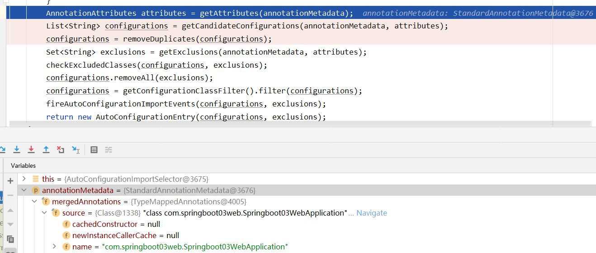
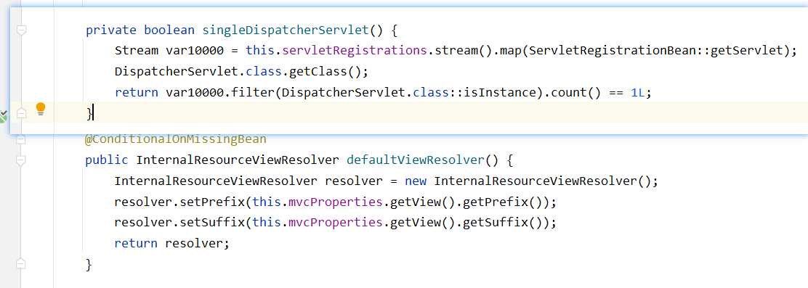
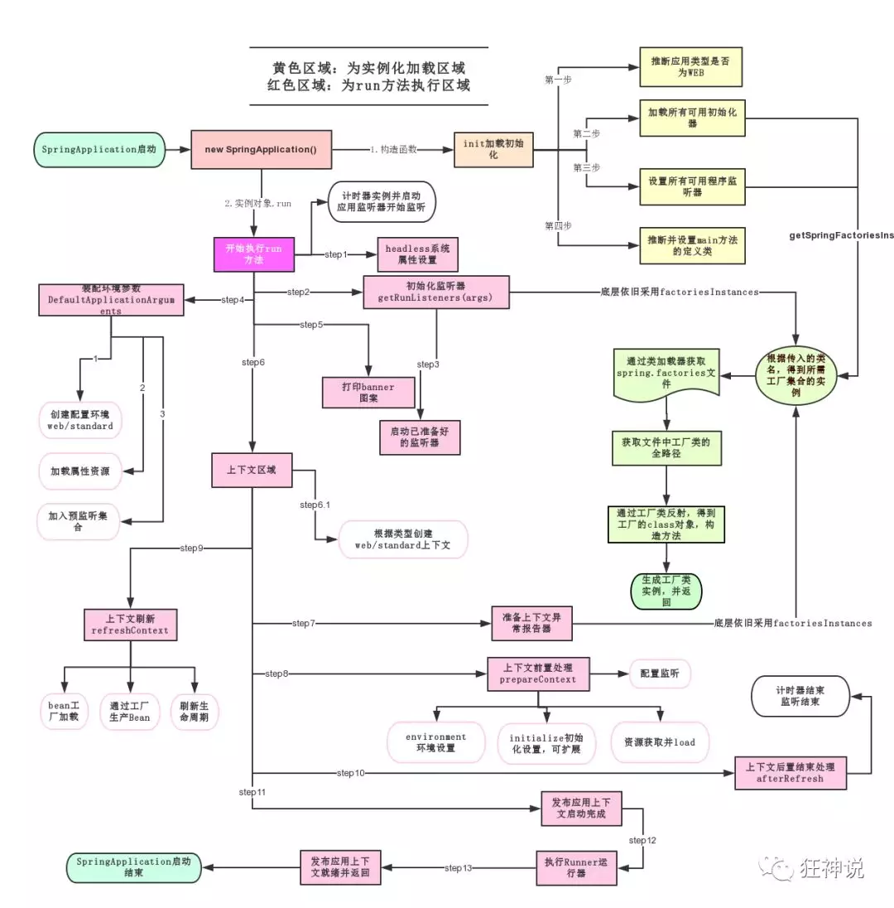
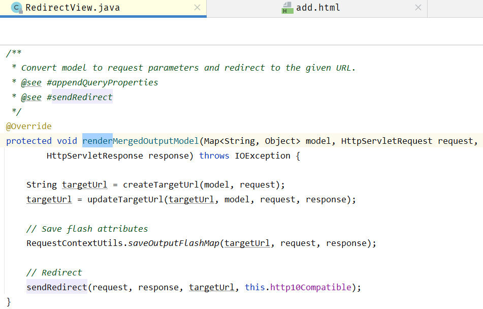
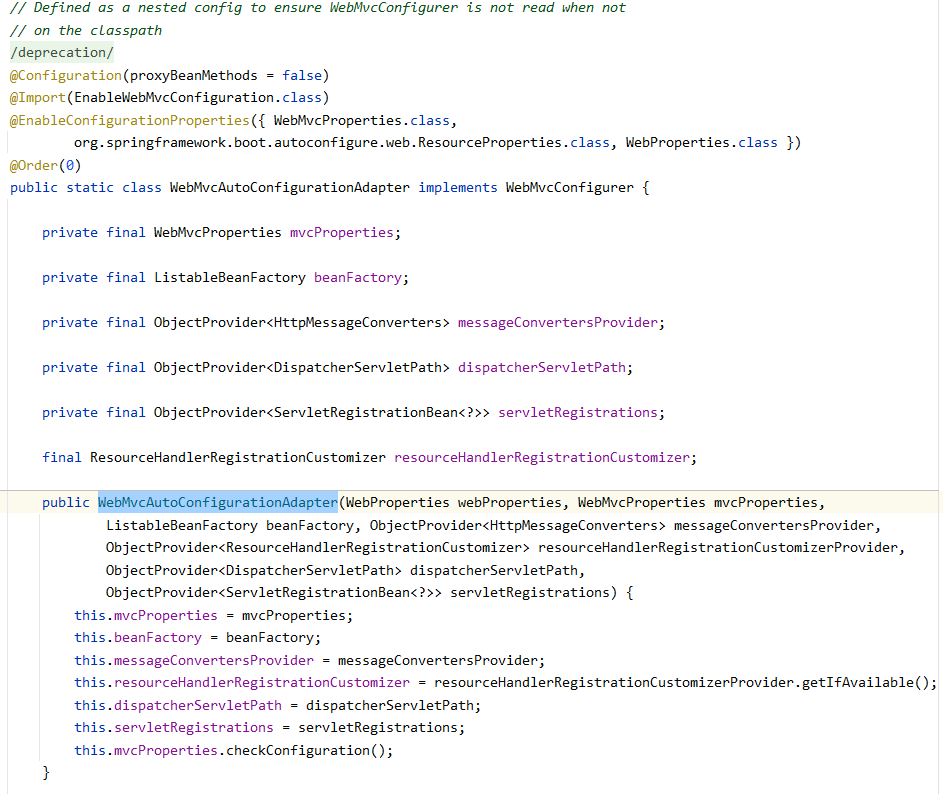
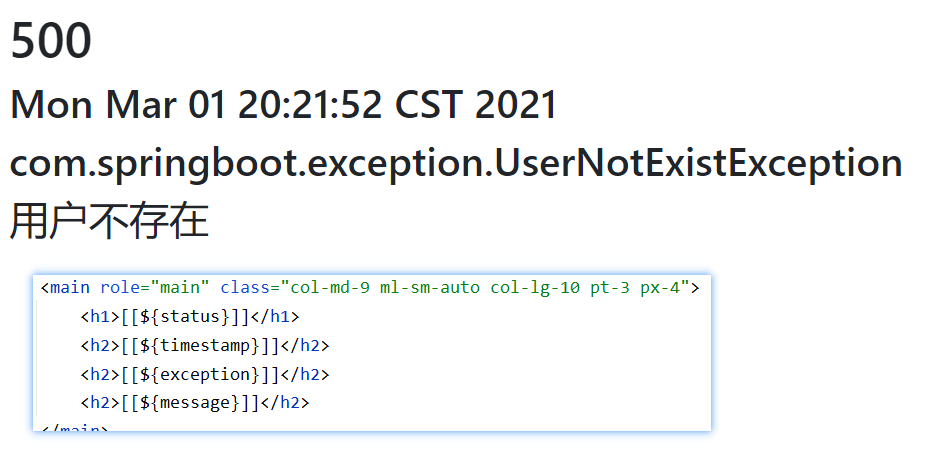
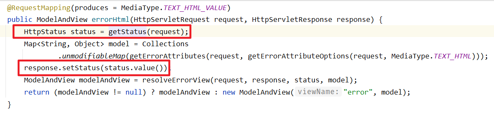
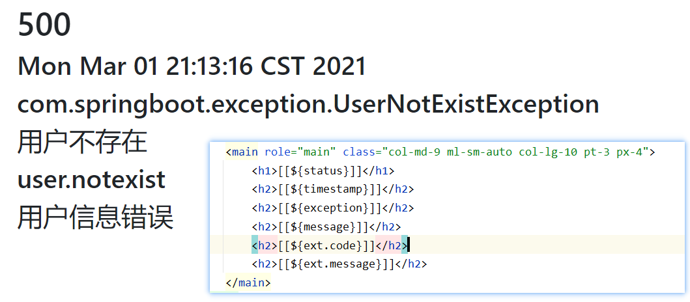
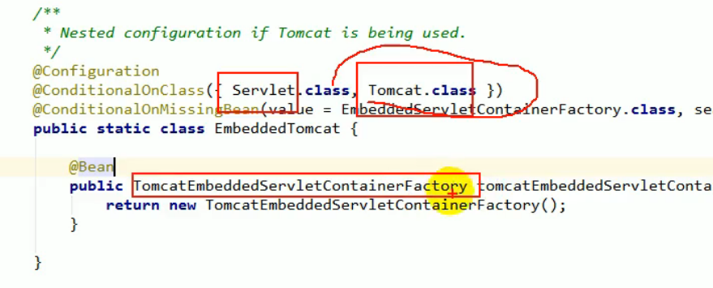
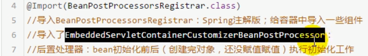

# SpringBoot


@(Spring)[2021年2月22日08:13:53]

[TOC]

<div style="page-break-after:always" />


>   SpringBoot是企业级开发的整体整合解决方案，特别用于快速构建微服务应用，旨在用最简单的方式让开发人员适应各种开发场景 
>
>   本视频着重介绍SpringBoot的使用和内部原理；
>
>   内容包含微服务概念、配置文件、日志框架的使用、web开发、Thymeleaf模板引擎、Docker容器技术教程由springboot核心技术+整合篇组成

<div style="page-break-after:always" />

## 简介

war:tomcat运行

Spring再简化：SpringBoot-jar:内嵌Tomcat；微服务架构

服务越来越多==>Spring Cloud

>    **约定大于配置**
>
>   -   Maven：整合了所有jar包
>   -   Spring,SpringMVC
>   -   Spring Boot：整合了所有框架
>   -   docker

优点：

-   快速创建独立运行的Spring项目以及主流框架集成
-   使用嵌入式Servlet容器，应用无需打成war包
-   starters自动依赖与版本控制
-   大量的自动配置，简化开发，也可修改默认值
-   无需配置XML，无代码生成，开箱即用
-   准生产环境的运行时应用监控
-   与云计算天然继承

### 微服务

>   一种架构风格,通过http的方式进行互通
>
>   -   MVC架构
>       -   service \==> 模块化 \==> 微服务
>       -   controller ==> 提供接口 ==> 服务网格
>   -   微服务架构

#### 组件化与模块化

中心思想：分而治之

##### 组件化

组件化就是基于可重用的目的，将一个大的软件系统按照分离关注点的形式，拆分成多个独立的组件，主要目的就是**减少耦合**。

-   一个独立的组件可以是一个软件包、web服务、web资源或者是封装了一些函数的模块。这样，独立出来的组件可以单独维护和升级而不会影响到其他的组件。

##### 模块化

模块化的目的在于将一个程序按照其功能做拆分，分成相互独立的模块，以便于每个模块只包含与其功能相关的内容，模块之间通过接口调用。将一个大的系统模块化之后，每个模块都可以被**高度复用**。

##### 区别

-   模块化的目的是为了`重用`，模块化后可以方便重复使用和插拨到不同的平台，不同的业务逻辑过程中

-   组件化的目的是为了`解耦`，把系统拆分成多个组件，分离组件边界和责任，便于独立升级和维护

### 架构演变


#### 1. 单体应用架构

所有应用中的所有应用服务都封装在一个应用中（同一war包内）


-   易于开发测试；部署方便；负载均衡，复制即可
-   所有改动都必须重启服务

#### 2. 微服务架构

[原文地址](https://martinfowler.com/articles/microservices.html)


-   一个应用应该是一个小型服务
-   每个功能元素都是一个可独立替换和独立升级的软件单元。将每个功能元素独立出来，独立出来的元素动态组合，需要的功能元素才拿去组合。
-   服务之间通过http方式进行交互
-   微服务架构是对功能元素进行复制，并没有对整个应用进行复制

##### 对比单体应用

| 单体应用                               | 微服务                                                       |
| -------------------------------------- | ------------------------------------------------------------ |
| 一个单体应用程序将所有功能放单一进程内 | 一个微服务架构的程序把每个功能元素放进一个独立的服务中，一个服务占用一个进程 |
| 通过在多个服务器上复制这个单体进行扩展 | 通过跨服务器分发这些服务进行扩展，只在有需要时在进行扩展     |

#### 个人理解

单体架构的应用，对于某一功能的开发，完全是面向当前场景。更换一个应用场景，即使是同样的步骤，也可能需要重新开发。

微服务的每个服务节点类似于对某一功能的封装，将所有应用场景都充分考虑，通过场景变量加以区分。当需要某个服务时，只需要配置相应的启动器(即设置场景变量值，导入对应的配置类)，将服务中的适配接口导入程序


比如：

### 如何构建微服务

-   通过SpringBoot快速构建一个个功能独立的微服务应用单元
-   大新分布式网络服务的调用，由SpringCloud完成，实现分布式
-   在分布式中间，进行流式数据计算，批处理，spring cloud data flow

#### 启动器

```xml
<!--启动器-->
<dependency>
    <groupId>org.springframework.boot</groupId>
    <artifactId>spring-boot-starter</artifactId>
</dependency>
```

>   启动器： Springboot的启动场景，需要什么功能，找对应的启动器即可
>
>   [启动器](https://github.com/spring-projects/spring-boot/tree/2.2.x/spring-boot-project/spring-boot-starters)

>    eg:`spring-boot-starter-web`：会自动导入web环境相关的所有依赖


### Hello程序

#### 0. 环境

##### 修改主类位置


==>重启idea后解决

##### Maven

```xml
<profiles>
    <profile>
        <id>development</id>
        <activation>
            <jdk>1.8</jdk>
            <activeByDefault>true</activeByDefault>
        </activation>
        <properties>
            <maven.compiler.source>1.8</maven.compiler.source>
            <maven.compiler.target>1.8</maven.compiler.target>
            <maven.compiler.compilerVersion>1.8</maven.compiler.compilerVersion>
        </properties>
    </profile>
</profiles>
```


#### 1. 新建Project

```xml
<dependencies>
    <!--启动器-->
    <dependency>
        <groupId>org.springframework.boot</groupId>
        <artifactId>spring-boot-starter</artifactId>
    </dependency>
    <dependency>
        <groupId>org.springframework.boot</groupId>
        <artifactId>spring-boot-starter-web</artifactId>
    </dependency>
    <!--junit-->
    <dependency>
        <groupId>org.springframework.boot</groupId>
        <artifactId>spring-boot-starter-test</artifactId>
        <scope>test</scope>
    </dependency>
</dependencies>

<!--maven项目-->
<build>
    <plugins>
        <plugin>
            <groupId>org.springframework.boot</groupId>
            <artifactId>spring-boot-maven-plugin</artifactId>
        </plugin>
    </plugins>
</build>
```

-   <parent>:继承 `spring-boot-starter-parent` 的依赖管理，控制版本与打包等内容

    -    即继承spring-boot-dependencies：所有依赖版本控制

        

    -   引入SpringBoot依赖时，不需要指定版本，因为有版本仓库

-   项目元数据信息：创建时的Project Metadata部分，包括groupid,artifactedId,version,name,description等

-   dependencies：项目具体依赖
    -    `spring-boot-starter-web` 用于实现HTTP接口
         -    SpringMVC
         -    RESTful
         -    Tomcat作为默认的嵌入式容器
    -    `spring-boot-starter-test`用于编写单元测试的依赖包
    
-   build:项目构建配置
    
    -   `spring-boot-maven-plugin`:配合 `Spring-boot-starter-parent`将SpringBoot应用打包成JAR直接运行

#### 2.标注主程序类

```java
@SpringBootApplication
public class HelloWorldApplication(){
     public static void main(String[] args){
         //Spring应用启动
         SpringgApplication.run(HelloWorldApplicatio,args)
     }
}
```

-   @SpringBootApplication，说明这个类是SpringBoot的主配置类

#### 3. 导入web依赖

 ```xml
<dependency>
    <groupId>org.springframework.boot</groupId>
    <artifactId>spring-boot-starter-web</artifactId>
</dependency>
 ```

```java
@Controller
@RequestMapping("/hello")
public class HelloController {

    @RequestMapping("/hello")
    @ResponseBody
    public String test(){
        return "Hello";
    }
}
```

#### 4. 改端口号

application.properties

```properties
#更改端口号
server.port=8081
```

#### 5.部署

将应用打包成可执行的jar包

```xml
<build>
    <plugins>
        <plugin>
            <groupId>org.springframework.boot</groupId>
            <artifactId>spring-boot-maven-plugin</artifactId>
        </plugin>
    </plugins>
</build>
```


<div style="page-break-after:always" />

## 什么会被自动装配	

```java
import org.springframework.boot.SpringApplication;
import org.springframework.boot.autoconfigure.SpringBootApplication;

@SpringBootApplication
public class Springboot01Application {

    public static void main(String[] args) {
        SpringApplication.run(Springboot01Application.class, args);
    }
}
```

### 自动装配示例

>    需求：
>
>    定义一个Annotation，让使用了这个Annotaion的应用程序自动化地注入一些类或者做一些底层的事情。


在应用程序的入口加上@EnableMyConfig注解。这样的话，MyConfig就被注入进来了

SpringBoot也就是用这个完成的。只不过它用了更加高级点的ImportSelector。

### ==@SpringBootApplication==

>    将这个类标注为Springboot主配置类；启动类下的所有资源并导入


**也就是说这些自动装配的实现其实是导入了一些支持自动装配的Bean**

#### ImportSelector在SpringBoot中的使用

@EnableAutoConfiguration注解中使用了AutoConfigurationImportSelector（自动配置类的导入选择器），用于配置导入哪些自动配置类。

##### 第1层. selectImports


-   AnnotationMetadata 为标注了 `@SpringbootApplication` 的配置类

    

##### 第2层. getAutoConfigurationEntry


##### 第3层. getCandidateConfigurations


getCandidateConfigurations方法将获取到的所有配置类的全限定名，保存到 `List<String> configurations `中


##### 第4层.  SpringFactoriesLoader

`SpringFactoriesLoader.loadFactoryNames()` 会根据FACTORIES_RESOURCE_LOCATION这个静态变量从所有的jar包中读取 `springboot-autoconfigure/META-INF/spring.factories` 文件信息。将内容封装为 `propreties` 类型的对象

从properties中获取EnableAutoConfiguration.class类对应的值，将这些组件添加到容器中；并将全限定名以字符串数组的形式返回。


#### 自动装配核心配置——XXXAutoConfiguration


>   eg:
>
>   
>
>   
>
>   


getCandidateConfigurations 方法中的 getSpringFactoriesLoaderFactoryClass 方法返回的是`EnableAutoConfiguration.class`，所以会过滤出key为org.springframework.boot.autoconfigure.EnableAutoConfiguration的值。

下面这段配置代码就是autoconfigure这个jar包里的spring.factories文件的一部分内容(有个key为org.springframework.boot.autoconfigure.EnableAutoConfiguration，所以会得到这些AutoConfiguration)：

```properties
# Auto Configure
org.springframework.boot.autoconfigure.EnableAutoConfiguration=\
org.springframework.boot.autoconfigure.admin.SpringApplicationAdminJmxAutoConfiguration,\
org.springframework.boot.autoconfigure.aop.AopAutoConfiguration,\
org.springframework.boot.autoconfigure.amqp.RabbitAutoConfiguration,\
org.springframework.boot.autoconfigure.MessageSourceAutoConfiguration,\
```

当然了，这些AutoConfiguration不是所有都会加载的，会根据AutoConfiguration上的

`@ConditionalOnClass` 经过exclude和filter等操作，最终确定要装配的类。

#### @ConditionalOnXXX

| @Conditional扩展注解            | 作用（判断是否满足当前指定条件） |
| ------------------------------- | -------------------------------- |
| @ConditionalOnJava              | 系统的java版本是否符合要求       |
| @ConditionalOnBean              | 容器中是否存在指定Bean           |
| @ConditionalOnMissingBean       | 容器中不存在指定Bean             |
| @ConditionalOnExpression        | 满足SpEL表达式指定               |
| @ConditionalOnClass             | 系统中有指定的类                 |
| @ConditionalOnMissingClass      | 系统中没有指定的类               |
| @ConditionalOnSingleCandidate   | 容器中只有一个指定的Bean         |
| @ContidionalOnProperty          | 系统中指定的属性是否有指定的值   |
| @ContidionalOnResource          | 类路径下是否存在指定资源文件     |
| @ContidionalOnWebApplication    | 当前是web环境                    |
| @ContidionalOnNotWebApplication | 当前不是Web环境                  |
| @ConditionalOnJndi              | JNDI存在指定项                   |

#### 总结

-   自动装配利用了 `SpringFactoriesLoader` 来加载 `META-INF/spring.factoires` 文件里所有配置的 `EnableAutoConfgruation` 
-   在若干 `@ConditionalOnXXX` 的约束下，经过exclude和filter等操作，确定要装配的类是否生效
-   所有需要导入的组件，以类名的方式返回，这些组件在 `starter` 作用下，自动装配到相应的场景 

### SpringApplication.run(Springboot01Application.class, args);

将SpringBoot启动

-   ==推断应用类型是普通项目还是web项目==
-   查找并加载所有可用的初始化器，设置到initializers属性中
-   找出所有的而应用程序监听器，设置到listeners属性中
-   ==推断并设置main方法的定义类，找出运行的主类==



<div style="page-break-after:always" />

## Config

### yaml

#### yaml基本语法

>   以数据为中心
>
>   ==空格控制层级==
>
>   属性和值，大小写敏感
>
>   ""：不转义，输出特殊字符表示的内容
>
>   -   name: "hello \n !" ==>hello [换行] !
>
>   '':转义，将特殊字符以字符串形式输出
>
>   -   name: 'hello \n !' ==> hello \n !

```xml
<server>
    <port>8080</port>
</server>
```

```properties
student.name=qinjiang
student.age=3
```

```yaml
server:
	port: 8080
#对象
student:
	name: qinjiang
	age: 3

#行内写法
student: {name: qinjiang,age: 3}

#数组
pets:
	- cat
	- dog
	- pig
pets: [cats,dogs,pig]
```

### 配置文件占位符

`properties`文件和`yaml`文件都适用

>   $ 查找的是当前yaml中及其支持的变量

#### 随机数${random.XXXX}

-   ${random.int}
-   ${random.uuid}

#### 获取之前的值，指定默认值

-   ${[A]:[B]}==>存在用A，不存在用B

```yaml
person:
  name: tian${random.uuid}
  age: ${random.int}
  happy: true
  date: 2020/02/23
  maps: {k1: v1,k2: v2}
  lists: [code,music]
  hello: todo
  dog:
    name: ${person.hello:hello}_旺财
    age: 3
```


### 注入，给实体类赋值

之前

```java
@Data
@NoArgsConstructor
@AllArgsConstructor
@Repository
public class Dog {
    @Value("旺财")
    private String name;
    @Value("3")
    private int age;
}

@SpringBootTest
class Springboot02YamlApplicationTests {
    @Autowired
    private Dog dog;
    @Test
    void contextLoads() {
        System.out.println(dog);
    }

}
```

相关依赖

```xml
<dependency>
    <groupId>org.springframework.boot</groupId>
    <artifactId>spring-boot-configuration-processor</artifactId>
    <optional>true</optional>
</dependency>
```

```yml
person:
  name: tian
  age: 3
  happy: true
  date: 2020/02/23
  maps: {k1: v1,k2: v2}
  lists: [code,music]
  dog:
    name: 旺财
    age: 3
```

##### @ConfigurationProperties

`@ConfigurationProperties(prefix=)`将本类的属性与配置文件中的相关配置绑定

-   prefix(""):指定配置文件中哪个变量进行映射
-   只有在 IoC容器中的组件才能使用这个注解  

```java
@Data
@AllArgsConstructor
@NoArgsConstructor
@Repository
@ConfigurationProperties(prefix = "person")
public class Person {
    private String name;
    private Integer age;
    private Boolean happy;
    private Date date;
    private Map<String,Object> maps;
    private List<Object> lists;
    private Dog dog;
}
```


##### @PropertySource

`@PropertySource("classpath:myconfig.xml")`加载指定的配置文件

```java
@Data
@AllArgsConstructor
@NoArgsConstructor
@Repository
//@ConfigurationProperties(prefix = "person")
@PropertySource(value = "classpath:myconfig.properties")
public class Person {
    /*
    * <bean class="Person">
    * 	<property name="lastName" 
    *		value="字面量|
    				${key}:从环境变量中获取键值|
    				#{SpEL}":表达式></property>
    * </bean>
    */
    @Value("${name}")
    private String name;
    @Value("#{11*2}")
    private Integer age;
    @Value("true")
    private Boolean happy;
    private Date date;
    private Map<String,Object> maps;
    private List<Object> lists;
    private Dog dog;
}
```

#### @ConfigurationProperties&@Value

|                    | @ConfigurationProperties       | @Value     |                      |
| ------------------ | ------------------------------ | ---------- | -------------------- |
| 功能               | 从全局配置文件中，批量注入属性 | 一个个指定 |                      |
| 松散绑定(松散语法) | 支持                           | 不支持     | last-name==>lastName |
| SpEL               | 不支持                         | 支持       | #{11*2}              |
| JSR303数据校验     | 支持                           | 不支持     | @Validated           |
| 复杂类型封装       | 支持                           | 不支持     | ${maps.key}          |

##### 松散绑定

yml中横线命名	==>	java中驼峰命名

last-name				==>	lastName

##### JSR303校验

`@Validated`==>开启数据验证

```java
@NotNull(message="名字不能为空")
private String userName;
@Max(value=120,message="年龄最大不能查过120")
private int age;
@Email(message="邮箱格式错误")
private String email;

空检查
@Null       验证对象是否为null
@NotNull    验证对象是否不为null, 无法查检长度为0的字符串
@NotBlank   检查约束字符串是不是Null还有被Trim的长度是否大于0,只对字符串,且会去掉前后空格.
@NotEmpty   检查约束元素是否为NULL或者是EMPTY.
    
Booelan检查
@AssertTrue     验证 Boolean 对象是否为 true  
@AssertFalse    验证 Boolean 对象是否为 false  
    
长度检查
@Size(min=, max=) 验证对象（Array,Collection,Map,String）长度是否在给定的范围之内  
@Length(min=, max=) string is between min and max included.

日期检查
@Past       验证 Date 和 Calendar 对象是否在当前时间之前  
@Future     验证 Date 和 Calendar 对象是否在当前时间之后  
@Pattern    验证 String 对象是否符合正则表达式的规则


```

#### 结论

-   在某个业务中，只需要配置某个属性的值==>@Value
-   专门编写了一个JavaBean来和配置文件映射==>@ConfigurationProperties

### 全局配置文件

配置文件名是固定的

-   application.properties
    -   语法：key=value
-   application.yml
    -   语法：key: value

>   可以修改SpringBoot自动配置的默认值

#### 全局配置文件的加载位置

##### 项目内

-   ./
-   ./config

-   classpath:/
-   classpath:/config


命令行修改配置文件加载位置

springjava -jar [打包后包名] --spring.config.location=F:/application.properties

###### 优先级

1.  项目路径/config/application.yml
2.  项目路径/application.yml
3.  资源路径/config/application.yml
4.  资源路径/applicatin.yml

##### 外部配置加载顺序


#### 原则

-   **互补配置**
-   **高优先级覆盖低优先级**

### 其他配置文件的加载

#### @PropertySource(value={"",""})

==>读取指定的配置文件

#### @ImportResource(location={"",""})

==>在一个配置类上标注，导入Spring配置文件，让其生效

#### SpringBoot推荐使用配置类编写配置

以前

```xml
<?xml version="1.0" encoding="UTF-8" ?>
<beans xmlns="http://www.springframework.org/schema/beans"
       xmlns:xsi="http://www.w3.org/2001/XMLSchema-instance"
       xsi:schemaLocation="http://www.springframework.org/schema/beans
       http://www.springframework.org/schema/beans/spring-beans-3.0.xsd">
    
</beans>
```

**配置类**

```java
/*
*@Configuration指明当前类是一个配置类，替代Spring-application.xml文件
*相当于<beans></beans>
*/
@Configuration
public class MyAppConfig(){
    /*
    * @Bean将方法的返回值添加到容器中；容器中组件的返回值默认的Id就是方法名
    */
    @Bean
    public HelloService helloService(){
        return new HelloService();
    }
}
```

### 多环境切换——Profile

`profiles` 是Spring对不同环境提供不同配置功能的支持，可以通过激活不同的环境版本，实现快速切换环境；

我们在主配置文件编写的时候，文件名可以是 `application-{profiles}.properties/yml` , 用来指定多个环境版本；	

但是Springboot并不会直接启动这些配置文件，它**默认使用application.properties主配置文件**；

#### 激活方式

##### 配置文件

```properties
spring.profiles.active=dev
```

##### 命令行

java -jar [打包后包名] --spring.profiles.active=dev


##### jvm参数

-Dspring.profiles.active=dev

#### yaml多文档块


### ==application.yml能配置什么\==>自动装配全过程==

#### 1. 什么会被自动装配

-   `@SpringBootConfiguration` ==>声明SpringBoot主配置类也是一个组件，由Spring容器管理

-   `@ComponentScan` ==>指明要扫描的位置

-   `@EnableAutoConfiguration`==>开启自动配置功能
    
    -   `@AutoConfigurationPackage` ==>导入自动注册包，用于将 `@ComponentScan` 扫描的组件注册到Spring容器中
    
    -   `@Import({AutoConfigurationImportSelector})`==>XXXAutoConfiguration的导入选择器
    
        用于将 springboot-autoconfigure/META-INF/spring.factories 中的 `XXXAutoConfiguration` 封装为Properties对象，从properties中获取到EnableAutoConfiguration.class类对应的值，把他们加载到容器中

#### 2.XXXAutoConfiguration

在application.yaml中能配置的属性，,这些属性的默认值在 `XXXProperties`中 ：

-   一定会存在对应的 `XXXAutoConfiguration`类，由@EnableAutoContiguration 将这些配置类封装为 Properties 类加载到运行主类中

#### 3. 每一个XXXAutoConfiguration进行自动配置功能

```java
@Configuration(proxyBeanMethods = false)
//标注为配置类

@EnableConfigurationProperties(ServerProperties.class)
//启用指定类的CongigurationProperties功能，并把这个配置类加入到IoC容器中

@ConditionalOnWebApplication(type = ConditionalOnWebApplication.Type.SERVLET)
//如果是web应用，当前配置类生效

@ConditionalOnClass(CharacterEncodingFilter.class)
//判断当前项目有没有这个类；SpringMVC中乱码过滤器

@ConditionalOnProperty(prefix = "server.servlet.encoding", value = "enabled", matchIfMissing = true)
//配置文件中是否存在某个配置，即使配置文件中没有配置，也是生效的

public class HttpEncodingAutoConfiguration {
    private final Encoding properties;//properties与SpringBoot的配置文件映射
    
    //在只有有参构造器的情况下，参数的值(ServerProperties properties)从容器中取
	public HttpEncodingAutoConfiguration(ServerProperties properties) {
		this.properties = properties.getServlet().getEncoding();
	}

	@Bean	//给容器中添加一个组件，这个组件的某些值需从properties中获取
	@ConditionalOnMissingBean //IoC容器中没有这个Bean才new
	public CharacterEncodingFilter characterEncodingFilter() {
		CharacterEncodingFilter filter = new OrderedCharacterEncodingFilter();
		filter.setEncoding(this.properties.getCharset().name());
		filter.setForceRequestEncoding(this.properties.shouldForce(Encoding.Type.REQUEST));
		filter.setForceResponseEncoding(this.properties.shouldForce(Encoding.Type.RESPONSE));
		return filter;
	}
```

-   根据 `@ConditionalOnXXX` 判断当前 `XXXAutoConfiguration` 是否生效
-   一旦 `XXXAutoconfiguration` 生效，这个配置类就会给容器中添加各种组件 (由`@Bean`标注) ；
-   这些组件的属性是从对应的XXXProperties类中获取
-   XXXAutoconfiguration的每一个属性都是和配置文件绑定，并可通过配置文件修改

#### 4. 配置文件中能配置的属性都在XXXProperties中封装

```java
@ConfigurationProperties(prefix = "server", ignoreUnknownFields = true)
//从配置文件中获取指定属性的值和bean属性进行绑定
public class ServerProperties {
```


在 `application.yaml` 中修改的是这些配置类的属性值


#### XXXCustomizer为自定义配置类


#### 检测自动配置类是否生效

```yml
debug: true
```

生效的


没生效的：


排除的和不满足条件的：


### 总结

1.  SpringBoot启动会加载大量的自动配置类
2.  若应用场景所需的环境没有对应的自动配置类，再尝试手动配置
3.  只要自动配置类中的组件满足要求，则无需手动配置
4.  给容器中自动配置类添加组件时，会从Properties中获取某些属性，只需要在 `application.yml`中指定这些属性值即可

XXXAutoContiguration:自动配置类==>将组件添加到容器中

XXXProperties：封装配置文件中相关属性


<div style="page-break-after:always" />

## 日志

| 日志门面(日志抽象层)                                         | 日志实现                                                     |
| ------------------------------------------------------------ | ------------------------------------------------------------ |
| ~~JCL(Apache2014停更)~~，~~jboss-logging(不好用)~~，SLF4J(Simple Logging Facade for java) | Log4j,Logback(同一人)<br />log4j2,~~JUL(java.util.logging)~~ |

springboot:SLF4J+Logback

### 使用

SLF4J的jar和Logback的实现jar

```java
import org.slf4j.Logger;
import org.slf4j.LoggerFactory;

public class HelloWorld {
  public static void main(String[] args) {
    Logger logger = LoggerFactory.getLogger(HelloWorld.class);
    logger.info("Hello World");
  }
}
```

[SLF4J文档](http://www.slf4j.org/manual.html)

SLF4J可以由Log4j,logback实现，也可以通过适配层，将其他实现框架转化为SLF4J框架。即一个应用内的所有日志都是用SLF4J框架


#### 其他框架的统一转换为SLF4J

不同层使用不同的日志框架，通过适配层统一转化为SLF4J框架


1.  将系统中其他日志框架先排除出去
2.  用中间包替换原有日志框架
3.  导入SLF4J的其他实现

框架每一个日志的实现实框架都有自己的配置文件，使用SLF4J后，配置文件为实现日志实现框架的配置文件

### SpringBoot日志关系

```xml
<dependency>
    <groupId>org.springframework.boot</groupId>
    <artifactId>spring-boot-starter-logging</artifactId>
    <version>2.4.3</version>
    <scope>compile</scope>
</dependency>
```


1.  SpringBoot底层也是使用SLF4J+logback进行日志记录
2.  SpringBoot通过中间替换包把其他日志替换成了SLF4J


3.  使用其他框架，一定要把这个框架默认的日志依赖移除

```xml
<dependency>
    <groupId>org.apache.activemq</groupId>
    <artifactId>activemq-spring</artifactId>
    <version>${activemq.version}</version>
    <exclusions>
        <exclusion>
            <groupId>commons-logging</groupId>
            <artifactId>commons-logging</artifactId>
        </exclusion>
    </exclusions>
</dependency>
```

### SpringBoot默认配置


#### 0.配置原理


获得配置文件中的属性值


#### 1. 导包

```java
import org.slf4j.Logger;
import org.slf4j.LoggerFactory;
```

```java
Logger logger = LoggerFactory.getLogger(getClass());
```

#### 2. 日志级别

>   调整需要输出的日志级别

trace < debug < info < warn < error


```yaml
logging:
  level:
    com.springboot: trace
```


#### 3. 指定日志信息的输出格式


#### 4. 日志输出路径

##### 1.在当前路径下输出

```yaml
logging:
 file:
  name: springboot.log
```


##### 2. 指定输出到某一目录下的文件

```yaml
logging:
  file:
    name: F:/springboot.log
```

##### 3. 本项目下的目录，默认的文件名为spring.log

```yaml
logging:
  file:
    path: log/sringboot-04
```

### SpringBoot指定配置

每一个日志的实现实框架都有自己的配置文件，使用SLF4J后，配置文件为实现日志实现框架的配置文件

将 `[实现框架名].xml`放在在类路径下，即替换

| Logging System          | Customization                                                |
| :---------------------- | :----------------------------------------------------------- |
| Logback                 | `logback-spring.xml`, `logback-spring.groovy`, `logback.xml`, or `logback.groovy` |
| Log4j2                  | `log4j2-spring.xml` or `log4j2.xml`                          |
| JDK (Java Util Logging) | `logging.properties`                                         |

logback.xml:直接就被日志框架识别

logback-spring.xml:由spring识别，可以使用 `profile`

```xml
<!--可以根据环境调整输出-->
<springProfile name="dev">
    
</springProfile>
<springProfile name="!dev">
    
</springProfile>
```

### 切换日志框架

根据SLF4J的日志适配图，进行相关切换


<div style="page-break-after:always" />

## web

-   导入静态资源
-   首页
-   jsp，模板引擎Thymeleaf
-   装配扩展SpringMVC
-   CRUD
-   Inteceptor
-   国家化

**使用SpringBoot:**

-   创建SpringBoot应用，选中模块
-   SpringBoot默认将这些场景配置好，只需要在配置文件中指定少量配置即可
-   自己编写业务代码

**自动配置原理：**

-   这个场景SpringBoot帮我们配置了什么？能不能修改！

```java
XXXAutoconfiguration
XXXProperties
```

[bootstrap](https://getbootstrap.com/)

### 导入静态资源 


```java
@Override
protected void addResourceHandlers(ResourceHandlerRegistry registry) {
    super.addResourceHandlers(registry);
	//判断是否开启自动配置资源路径
    if (!this.resourceProperties.isAddMappings()) {
        logger.debug("Default resource handling disabled");
        return;
    }
    
    ServletContext servletContext = getServletContext();
    
    //所有 /webjars 的静态资源请求，都被映射到 classpath:/META-INF/resources/webjars/下
    addResourceHandler(registry, "/webjars/**", "classpath:/META-INF/resources/webjars/");
    
    //
    addResourceHandler(registry, this.mvcProperties.getStaticPathPattern(), (registration) -> {
        registration.addResourceLocations(this.resourceProperties.getStaticLocations());
        if (servletContext != null) {
            registration.addResourceLocations(new ServletContextResource(servletContext, SERVLET_LOCATION));
        }
    });
}
```

#### 1. webjars

[webjars](https://www.webjars.org/):以jar包的方式导入静态资源

所有 `/webjars` 的静态资源请求，都被映射到 `classpath:/META-INF/resources/webjars/`下


```xml
<dependency>
    <groupId>org.webjars</groupId>
    <artifactId>jquery</artifactId>
    <version>3.5.1</version>
</dependency>
```


#### 2. 静态资源的默认查找位置


#### 总结

-   wabjars	：一般不用
-   rescources :上传的文件
-   static        ：静态资源，图片
-   public       :公共资源

==> localhost:8080/webjars/**

**优先级**

rescources>static>public


### 首页

#### 位置

>   首页 从静态资源路径 `CLASSPATH_RESOURCE_LOCATIONS` +index.gtml中查找


在Templates目录下的所有页面只能通过Controller跳转，相当于 WEB-INF

需要`TemplateEngine`模板引擎支持

### 模板引擎——ThymeLeaf

>   为了使用户界面与业务数据（内容）分离而产生的，它可以生成特定格式的文档，用于网站的模板引擎就会生成一个标准的HTML文档。
>
>   模板引擎的实现方式有很多，最简单的是“置换型”模板引擎，这类模板引擎只是将指定模板内容（字符串）中的特定标记（子字符串）替换一下便生成了最终需要的业务数据（比如网页）。

类比：JSP


[github](https://github.com/thymeleaf/thymeleaf)

[Thymeleaf官网](https://www.thymeleaf.org/)

#### 启动器

spring-boot-starter-thymeleaf

```xml
<dependency>
    <groupId>org.thymeleaf</groupId>
    <artifactId>thymeleaf-spring5</artifactId>
</dependency>
<dependency>
    <groupId>org.thymeleaf.extras</groupId>
    <artifactId>thymeleaf-extras-java8time</artifactId>
</dependency>
```


#### 默认位置


**页面默认位置为classpath:/templates/**

#### 导入thymeleaf约束

```html
<html xmlns:th="http://www.thymeleaf.org">
</html>
```

#### 基本语法

**所有的html元素都可被 thymeleaf替换接管， th:元素名**

##### 属性优先级

| JSP                           | Feature                              | Attributes                                           |
| :---------------------------- | :----------------------------------- | :--------------------------------------------------- |
| `jsp:include`                 | Fragment inclusion                   | `th:insert` `th:replace`                             |
| `c:forEach`                   | Fragment iteration                   | `th:each`                                            |
| 流程控制                      | Conditional evaluation               | `th:if` `th:unless` `th:switch` `th:case`            |
| 声明变量 `c:set`              | Local variable definition            | `th:object` `th:with`                                |
| 属性修改，支持 prepend,append | General attribute modification       | `th:attr` `th:attrprepend` `th:attrappend`           |
| 修改指定属性默认值            | Specific attribute modification      | `th:value` `th:href` `th:src` `...`                  |
| 修改标签体内容                | Text (tag body modification)是否转义 | `th:text`转义特殊字符<br /> `th:utext`不转义特殊字符 |
| 声明片段                      | Fragment specification               | `th:fragment`                                        |
|                               | Fragment removal                     | `th:remove`                                          |


##### 表达式

###### Simple expressions:

1.  Variable Expressions: `${...}`：获取变量值

    -   ```java
        /* 
         * Access to properties using the point (.). Equivalent to calling property getters.
         */
        ${person.father.name}
        
        /*
         * Access to properties can also be made by using brackets ([]) and writing 
         * the name of the property as a variable or between single quotes.
         */
        ${person['father']['name']}
        
        /*
         * If the object is a map, both dot and bracket syntax will be equivalent to 
         * executing a call on its get(...) method.
         */
        ${countriesByCode.ES}
        ${personsByName['Stephen Zucchini'].age}
        
        /*
         * Indexed access to arrays or collections is also performed with brackets, 
         * writing the index without quotes.
         */
        ${personsArray[0].name}
        
        /*
         * Methods can be called, even with arguments.
         */
        ${person.createCompleteName()}
        ${person.createCompleteNameWithSeparator('-')}
        ```

    -   内置的基本对象

        ```html
        #ctx: the context object.
        #vars: the context variables.
        #locale: the context locale.
        
        <!--(only in Web Contexts)-->
        #request:  the HttpServletRequest object.
        #response: the HttpServletResponse object.
        #session: the HttpSession object.
        #servletContext: the ServletContext object.
        ```

    -   内置的工具对象

        ```html
        #execInfo: information about the template being processed.
        
        #messages: methods for obtaining externalized messages inside variables expressions, in the same way as they would be obtained using #{…} syntax.
        
        #uris: methods for escaping parts of URLs/URIs
        
        #conversions: methods for executing the configured conversion service (if any).
        
        #dates: methods for java.util.Date objects: formatting, component extraction, etc.
        
        #calendars: analogous to #dates, but for java.util.Calendar objects.
        
        #numbers: methods for formatting numeric objects.
        #strings: methods for String objects: contains, startsWith, prepending/appending, etc.
        
        #objects: methods for objects in general.
        
        #bools: methods for boolean evaluation.
        
        #arrays: methods for arrays.
        
        #lists: methods for lists.
        
        #sets: methods for sets.
        
        #maps: methods for maps.
        
        #aggregates: methods for creating aggregates on arrays or collections.
        
        #ids: methods for dealing with id attributes that might be repeated (for example, as a result of an iteration).
        ```

2.  Selection Variable Expressions: `*{...}`:配合th:object使用

    

3.  Message Expressions: `#{...}`获取国际化内容

4.  Link URL Expressions: `@{...}`:定义URL
    
-   @{/order/process(execId=${execId},execType='FAST')}
    
5.  Fragment Expressions: `~{...}`

###### Literals 字面量

-   Text literals: `'one text'`, `'Another one!'`,…
-   Number literals: `0`, `34`, `3.0`, `12.3`,…
-   Boolean literals: `true`, `false`
-   Null literal: `null`
-   Literal tokens: `one`, `sometext`, `main`,…

###### Text operations:文本拼接

-   String concatenation: `+`
-   Literal substitutions: `|The name is ${name}|`

###### Arithmetic operations:数学运算

-   Binary operators: `+`, `-`, `*`, `/`, `%`
-   Minus sign (unary operator): `-`

###### Boolean operations:布尔运算

-   Binary operators: `and`, `or`
-   Boolean negation (unary operator): `!`, `not`

###### Comparisons and equality:比较运算

-   Comparators: `>`, `<`, `>=`, `<=` (`gt`, `lt`, `ge`, `le`)
-   Equality operators: `==`, `!=` (`eq`, `ne`)

###### Conditional operators:条件运算

-   If-then: `(if) ? (then)`
-   If-then-else: `(if) ? (then) : (else)`
-   Default: `(value) ?: (defaultvalue)`

###### Special tokens:

-   No-Operation: `_`

All these features can be combined and nested:

```HTML
'User is of type ' + (${user.isAdmin()} ? 'Administrator' : (${user.type} ?: 'Unknown'))
```


#### Thymeleaf请求转发实现机制


##### redirect

==>底层也是response.sendredirect 实现页面重定向


渲染页面，并将model中属性转为request参数，并重定向到目标页面



##### request


```java
/**
 * Render the internal resource given the specified model.
 * This includes setting the model as request attributes.
 */
@Override
protected void renderMergedOutputModel(
    Map<String, Object> model, HttpServletRequest request, HttpServletResponse response) throws Exception {

    // Expose the model object as request attributes.
    exposeModelAsRequestAttributes(model, request);

    // Expose helpers as request attributes, if any.
    exposeHelpers(request);

    // Determine the path for the request dispatcher.
    String dispatcherPath = prepareForRendering(request, response);

    // Obtain a RequestDispatcher for the target resource (typically a JSP).
    RequestDispatcher rd = getRequestDispatcher(request, dispatcherPath);
    if (rd == null) {
        throw new ServletException("Could not get RequestDispatcher for [" + getUrl() +
                                   "]: Check that the corresponding file exists within your web application archive!");
    }

    // If already included or response already committed, perform include, else forward.
    if (useInclude(request, response)) {
        response.setContentType(getContentType());
        if (logger.isDebugEnabled()) {
            logger.debug("Including [" + getUrl() + "]");
        }
        rd.include(request, response);
    }

    else {
        // Note: The forwarded resource is supposed to determine the content type itself.
        if (logger.isDebugEnabled()) {
            logger.debug("Forwarding to [" + getUrl() + "]");
        }
        rd.forward(request, response);
    }
}
```

### MVC

[官方文档](https://docs.spring.io/spring-boot/docs/2.4.3/reference/html/spring-boot-features.html#boot-features-developing-web-applications)

#### SpringBoot Web MVC Framework

#####  1. Inclusion of `ContentNegotiatingViewResolver` and `BeanNameViewResolver` beans.

-   自动配置了视图解析器：根据方法返回值得到视图对象，视图对象决定页面如何渲染

-   ContentNegotiatingViewResolver：用于组合所有视图解析器

    

    

    -   将所有的viewResolvers装配到servletcontext中

    **可以自己给容器中添加一个ViewResolver;自动将其组合进IoC容器**

##### 2. Support for serving static resources, including support for WebJars .

静态资源路径，支持webjars

##### 3. Static `index.html` support.

静态首页访问

##### 4. Automatic registration of `Converter`, `GenericConverter`, and `Formatter` beans.

`converter(转换器)`:前端提交的数据自动封装为相应的POJO

`Formatter(格式化器)`:字符串==>Date类型

-   


**自己添加的 formatter，只需要注册到容器中即可**

##### 5. Support for `HttpMessageConverters` .

>    SpringMVC用来转换Http请求和响应
>
>   ​       POJO-User==>JSON



只有一个有参构造器，其参数都是从容器中获取

**自己添加的 HttpMessageConverters，只需要注册到容器中即可**

```java
import org.springframework.boot.autoconfigure.http.HttpMessageConverters;
import org.springframework.context.annotation.*;
import org.springframework.http.converter.*;

@Configuration(proxyBeanMethods = false)
public class MyConfiguration {

    @Bean
    public HttpMessageConverters customConverters() {
        HttpMessageConverter<?> additional = ...
        HttpMessageConverter<?> another = ...
        return new HttpMessageConverters(additional, another);
    }

}
```

##### 6. Automatic registration of `MessageCodesResolver` .

消息编码解析器；定义错误代码生成规则


##### 7. Automatic use of a `ConfigurableWebBindingInitializer` bean.


从容器中获取一个组件


初始化WebDataBinder

请求数据====JavaBean

#### 扩展MVC功能

If you want to keep those Spring Boot MVC customizations and make more [MVC customizations](https://docs.spring.io/spring/docs/5.3.4/reference/html/web.html#mvc) (interceptors, formatters, view controllers, and other features), you can add your own `@Configuration` class of interface `WebMvcConfigurer` but **without** `@EnableWebMvc`.


##### 实现页面跳转+拦截器

```java
@Controller
public class ToPageController {

    @RequestMapping("/hello")
    public String toHello(){
        return "hello";
    }
}
```

```xml
<!--拦截器配置-->
<mvc:interceptors>
    <mvc:interceptor>
        <!--拦截这个请求下的所有请求-->
        <mvc:mapping path="/**"/>
        <!--配置拦截器-->
        <bean class="com.kuang.config.MyInterceptor"/>
    </mvc:interceptor>
</mvc:interceptors>
```

```java
public class MyInteceptor implements HandlerInterceptor{
    @Override
    public boolean preHandle(HttpServletRequest request, HttpServletResponse response, Object handler) throws Exception {
        System.out.println("====方法执行前!====");

        /*
            * return true;放行
            * */
        return true;
    }

    @Override
    public void postHandle(HttpServletRequest request, HttpServletResponse response, Object handler, ModelAndView modelAndView) throws Exception {
        System.out.println("====方法完成后!====");
    }

    @Override
    public void afterCompletion(HttpServletRequest request, HttpServletResponse response, Object handler, Exception ex) throws Exception {
        System.out.println("====清理====");
    }
}
```

扩展SpringMVC,==互补配置==

```java
@Configuration
public class MyConfig implements WebMvcConfigurer {

    /*
    * WebMvcConfigurer 用于扩展MVC
    * */
    @Override
    public void addViewControllers(ViewControllerRegistry registry) {
        registry.addViewController("/hello").setViewName("hello");
    }

    @Override
    public void addInterceptors(InterceptorRegistry registry) {
        registry.addInterceptor(new MyInteceptor());
    }
}

class MyInteceptor implements HandlerInterceptor{
    @Override
    public boolean preHandle(HttpServletRequest request, HttpServletResponse response, Object handler) throws Exception {
        System.out.println("====方法执行前!====");

        /*
         * return true;放行
         * */
        return true;
    }

    @Override
    public void postHandle(HttpServletRequest request, HttpServletResponse response, Object handler, ModelAndView modelAndView) throws Exception {
        System.out.println("====方法完成后!====");
    }

    @Override
    public void afterCompletion(HttpServletRequest request, HttpServletResponse response, Object handler, Exception ex) throws Exception {
        System.out.println("====清理====");
    }
}
```

##### 配置原则

-   SpringBoot自动配置组件，先看用户是否自己配置，若用户自定义用户配置，则用用户的；若没有则使用自动配置的；

-   对于同时可存在多个的组件(ViewResolver)，则组合使用。

    

#### 自动配置生效原理


1.  WebMvcAutoConfiguration是SpringMVC的自动配置类

2.  @Import(EnableWebMvcConfiguration.class)

    

    

    

    -   `addWebMvcConfigurers` 将所有实现了WebMvcConfigurer的configuration一起调用

    可见SpringBoot实现的自动配置会与自定义的自动配置一起调用形成==互补配置==

### 第一个MVC项目

#### 1. 环境搭建

##### POJO

```java
@Data
@AllArgsConstructor
@NoArgsConstructor
@Repository
public class Department {
    private Integer id;
    private String departmentName;
}

@Data
@NoArgsConstructor
@Repository
public class Employee {
    private Integer id;
    private String lastName;
    private String email;
    private Integer gender;
    private Department department;
    private Date date;

    public Employee(Integer id, String lastName, String email, Integer gender, Department department) {
        this.id = id;
        this.lastName = lastName;
        this.email = email;
        this.gender = gender;
        this.department = department;
        this.date = new Date();
    }
}
```

##### Dao

```java
public class DepartmentDao {
    private static Map<Integer, Department> departments;

    static {
        departments.put(101,new Department(101,"教学部"));
        departments.put(102,new Department(102,"市场部"));
        departments.put(103,new Department(103,"教研部"));
        departments.put(104,new Department(104,"运营部"));
        departments.put(105,new Department(105,"后勤部"));
    }

    public Collection<Department> getDepartments(){
        return departments.values();
    }

    public Department getDepartmentById(Integer id){
        return departments.get(id);
    }
}
```

```java
@Repository
public class EmployeeDao {
    private static Map<Integer,Employee> employees = null;

    static {
        employees = new HashMap<Integer, Employee>();

        employees.put(1001,new Employee(1001,"A","A123@email.com",
                1,new Department(101,"教学部")));
        employees.put(1002,new Employee(1002,"B","B123@email.com",
                0,new Department(102,"市场部")));
        employees.put(1003,new Employee(1003,"C","C123@email.com",
                1,new Department(103,"教研部")));
        employees.put(1004,new Employee(1004,"D","D123@email.com",
                0,new Department(104,"运营部")));
        employees.put(1005,new Employee(1005,"E","E123@email.com",
                1,new Department(105,"后勤部")));
    }

    private static Integer initId = 1006;

    //新增
    public void save(Employee employee){
        if(employee.getId()==null){//实现自增
            employee.setId(initId++);
        }

        employees.put(employee.getId(),employee);
    }

    //查找全部
    public Collection<Employee> getEmployees(){
        return employees.values();
    }

    //通过id查找
    public Employee getEmployeeById(Integer id){
        return employees.get(id);
    }

    //通过id删除
    public void delete(Integer id){
        employees.remove(id);
    }
}
```

#### 2. 首页配置

所有的静态资源都要使用 `Thymeleaf` 接管

##### Thymeleaf依赖

```xml
<dependency>
    <groupId>org.thymeleaf</groupId>
    <artifactId>thymeleaf-spring5</artifactId>
</dependency>
<dependency>
    <groupId>org.thymeleaf.extras</groupId>
    <artifactId>thymeleaf-extras-java8time</artifactId>
</dependency>
```

##### Thymeleaf约束

```html
xmlns:th="http://www.thymeleaf.org"
```

##### 关闭模板引擎的缓存

```yaml
spring:
  thymeleaf:
    cache: false
```

##### 设置首页

1.  不推荐

    ```java
    @Bean
    public WebMvcConfigurerAdapter webMvcConfigurerAdapter(){
        WebMvcConfigurerAdapter adapter = new WebMvcConfigurerAdapter() {
            @Override
            public void addViewControllers(ViewControllerRegistry registry) {
                registry.addViewController("/").setViewName("index");
                registry.addViewController("/index.html").setViewName("index");
            }
        };
    
        return adapter;
    }
    ```

2.  


2.  【推荐使用】

```java
@Configuration
public class MyMvcConfig implements WebMvcConfigurer {
    @Override
    public void addViewControllers(ViewControllerRegistry registry) {
        registry.addViewController("/").setViewName("index");
        registry.addViewController("/index.html").setViewName("index");
    }
}
```

##### 设置路径前缀

```yaml
server:
  servlet:
    context-path: /t
```

##### 将静态资源交给Thymeleaf统一管理


#### 3. 国际化

**之前**

1.  编写国际化配置文件
2.  使用ResourceBUndleMessageSource管理国际化资源
3.  在页面使用fmt:message取出国际化内容

**SpringBoot原理**

国际化Locale(区域信息对象)

LocaleResolver(获取区域信息对象)


-   给容器中添加LocaleResolver组件

```java
/**
 * {@link LocaleResolver} implementation that simply uses the primary locale specified in the "accept-language" header of the HTTP request (that is the locale sent by the client browser, normally that of the client's OS).
 */
public class AcceptHeaderLocaleResolver implements LocaleResolver {
    /*如果没有指定locale，则用浏览器默认的语言*/
	@Override
	public Locale resolveLocale(HttpServletRequest request) {
		Locale defaultLocale = getDefaultLocale();
		if (defaultLocale != null && request.getHeader("Accept-Language") == null) {
			return defaultLocale;
		}
		Locale requestLocale = request.getLocale();
		List<Locale> supportedLocales = getSupportedLocales();
		if (supportedLocales.isEmpty() || supportedLocales.contains(requestLocale)) {
			return requestLocale;
		}
		Locale supportedLocale = findSupportedLocale(request, supportedLocales);
		if (supportedLocale != null) {
			return supportedLocale;
		}
		return (defaultLocale != null ? defaultLocale : requestLocale);
	}
}
```

```java
@ConfigurationProperties("spring.web")
public class WebProperties {

	/**
	 * Locale to use. By default, this locale is overridden by the "Accept-Language"
	 * header.
	 */
	private Locale locale;

	/**
	 * Define how the locale should be resolved.
	 */
	private LocaleResolver localeResolver = LocaleResolver.ACCEPT_HEADER;
    
    public enum LocaleResolver {

		/**
		 * Always use the configured locale.
		 */
		FIXED,

		/**
		 * Use the "Accept-Language" header or the configured locale if the header is not
		 * set.
		 */
		ACCEPT_HEADER
	}
}
```

默认的就是根据请求头带来的区域信息获取Locale进行国际化


>    自定义组件只需要实现 `LocaleResolver` 接口即可

**步骤**

##### 1. 编写到国际化配置文件中，抽取页面需要显示的国际化消息


##### 2. SpringBoot自动配置好了管理国际化的组件

```java
@Conditional(ResourceBundleCondition.class)
//String basename = context.getEnvironment().getProperty("spring.messages.basename", "messages");
//自定义的配置文件可以放在类路径下叫messages.properties
//若不指定，则从类路径下根路径寻找
//ConditionOutcome outcome = cache.get(basename);
public class MessageSourceAutoConfiguration {
    @Bean
    @ConfigurationProperties(prefix = "spring.messages")
    public MessageSourceProperties messageSourceProperties() {
        return new MessageSourceProperties();
    }
    
    @Bean
    public MessageSource messageSource(MessageSourceProperties properties) {
        ResourceBundleMessageSource messageSource = new ResourceBundleMessageSource();
        if (StringUtils.hasText(properties.getBasename())) {
            //设置国际化资源文件的基础名（去掉语言国家代码）
            messageSource.setBasenames(StringUtils
                                       .commaDelimitedListToStringArray(StringUtils.trimAllWhitespace(properties.getBasename())));
        }
        if (properties.getEncoding() != null) {
            messageSource.setDefaultEncoding(properties.getEncoding().name());
        }
        messageSource.setFallbackToSystemLocale(properties.isFallbackToSystemLocale());
        Duration cacheDuration = properties.getCacheDuration();
        if (cacheDuration != null) {
            messageSource.setCacheMillis(cacheDuration.toMillis());
        }
        messageSource.setAlwaysUseMessageFormat(properties.isAlwaysUseMessageFormat());
        messageSource.setUseCodeAsDefaultMessage(properties.isUseCodeAsDefaultMessage());
        return messageSource;
    }
}
```

##### 3. 修改配置文件路径

```yaml
spring:
  messages:
    basename: i18n.login
```

##### 4. 修改国际化的属性


##### 5. 自定义国际化组件

```java
import org.springframework.web.servlet.LocaleResolver;
import org.thymeleaf.util.StringUtils;

import javax.servlet.http.HttpServletRequest;
import javax.servlet.http.HttpServletResponse;
import java.util.Locale;

/**
 * @author Auspice Tian
 * @time 2021-02-27 9:56
 * @current springboot-03-web-com.springboot.component
 */
public class MyLocaleResolver implements LocaleResolver {

    @Override
    public Locale resolveLocale(HttpServletRequest request) {
        //强制使用系统的区域信息   浏览器改语言失效
        String language = request.getParameter("l");
        System.out.println(language);

        Locale locale = Locale.getDefault();

        //如果链接携带了国际化参数
        if(!StringUtils.isEmpty(language)){
            String[] split = language.split("_");
            locale = new Locale(split[0],split[1]);
        }

        return locale;
    }

    @Override
    public void setLocale(HttpServletRequest request, HttpServletResponse response, Locale locale) {

    }
}
```

```java
@Configuration
public class MyConfig implements WebMvcConfigurer {
	@Bean
    public LocaleResolver localeResolver(){

        return new MyLocaleResolver();
    }
}
```

#### 4. 登录+拦截器

##### 登录

1.  前端表单传入数据，LoginController处理，验证正确，则返回后台页面(dashboard)；验证错误，携带信息返回登录页面
2.  开发期间，使用模板引擎的注意点
    -   禁用Thymeleaf缓存
    -   页面修改完后，重新编译
3.  登录失败后，显示错误提示信息
    -   Thymeleaf属性优先级
    -   th:if语法

实现：

```html
<form class="form-signin" th:action="@{/user/login}" method="post">
			
			<h1 class="h3 mb-3 font-weight-normal" th:text="#{login.tip}">Please sign in</h1>
			<p style="color: red;" th:text="${msg}" th:if="${not #strings.isEmpty(msg)}"></p>
			<label class="sr-only">Username</label>
			<input type="text" name="username" class="form-control" th:placeholder="#{login.username}" required="" autofocus="">
			<label class="sr-only">Password</label>
			<input type="password" name="password" class="form-control" th:placeholder="#{login.password}" required="">
</form>
```

```java
@Controller
public class LoginController {

    @PostMapping("/user/login")
    public String login(@RequestParam("username") String username,
                        @RequestParam("password") String password,
                        Map<String ,Object> map
                        ){

        if(!StringUtils.isEmpty(username) && password.equals("1")){
            //若用户名不空，且密码等于1，登录成功
            return "dashboard";
        }else{
            map.put("msg","用户密码错误!");
            return "index";
        }
    }
}
```

==>考虑到刷新页面 `重新提交表单`问题


使用 return "redirect:/dashboard.html"

##### 防止表单重复提交——重定向

```java
@Controller
public class LoginController {

    @PostMapping("/user/login")
    public String login(@RequestParam("username") String username,
                        @RequestParam("password") String password,
                        Map<String ,Object> map
                        ){

        if(!StringUtils.isEmpty(username) && password.equals("1")){
            //若用户名不空，且密码等于1，登录成功
            return "redirect:/dashboard";
        }else{
            map.put("msg","用户密码错误!");
            return "index";
        }
    }
}
```

==>新问题：直接输入地址，会跳转到目标页面

==>解决：使用拦截器，拦截非法请求

##### 拦截器进行登录检查

1.  将登录状态加入到session中

2.  拦截的情况：
    
-   没有登录==>session中，user为null
    
3.  放行的情况：

    -   用户已经登录

4.  注册拦截器`WebMvcConfigurerAdapter.addInterceptor`

    -   使用拦截器的请求 `~.addPathPatterns()`

        所有请求

    -   不使用拦截器的请求`~.excludePathPatterns()`

        首页、登录提交表单

实现：

```java
@Controller
public class LoginController {

    @PostMapping("/user/login")
    public String login(@RequestParam("username") String username,
                        @RequestParam("password") String password,
                        Map<String ,Object> map,
                        HttpSession session
                        ){

        if(!StringUtils.isEmpty(username) && password.equals("1")){
            //若用户名不空，且密码等于1，登录成功
            session.setAttribute("loginUser",username);
            return "redirect:/dashboard";
        }else{
            map.put("msg","用户密码错误!");
            return "index";
        }
    }
}	
```

```java
public class MyInterceptor implements HandlerInterceptor {
    @Override
    public boolean preHandle(HttpServletRequest request,
                             HttpServletResponse response,
                             Object handler) throws Exception {
        Object loginUser = request.getSession().getAttribute("loginUser");

        if(loginUser == null){
            //未登录，拦截
            request.setAttribute("msg","未登录，没有权限!");
            request.getRequestDispatcher("/").forward(request,response);
            return false;
        }else{
            //已登录，放行
            return true;
        }

    }
}
```

```java
 @Override
public void addInterceptors(InterceptorRegistry registry) {

    //SpringBoot已经做好了静态资源映射
    registry.addInterceptor(new MyInterceptor())
        .addPathPatterns("/**")
        .excludePathPatterns("/","index.html","/user/login");
}
```

#### 5. CRUD

要求

1.  restfulCRUD:CRUD满足Rest风格

    URI:资源名称/资源表示 

    HTTP请求方式区分对资源的CRUD操作

    |      | 普通CRUD(URI区分资源操作) | RestfulCRUD()        |
    | ---- | ------------------------- | -------------------- |
    | 查询 | getEmp                    | emp————Get方式       |
    | 添加 | addEmp?XXX                | emp————POST方式      |
    | 修改 | updateEmp?XXX             | emp/{id}——PUT方式    |
    | 删除 | deleteEmp?id=             | emp/{id}——DELETE方式 |

2.  实验的请求架构

    |                                    | 请求URI  | 请求方式 |
    | ---------------------------------- | -------- | -------- |
    | 查询所有员工                       | emps     | GET      |
    | 查询某个员工                       | emp/{id} | GET      |
    | 跳转添加页面                       | emp      | GET      |
    | 添加员工                           | emp      | POST     |
    | 跳转修改页面(查出员工进行信息回显) | emp/{id} | GET      |
    | 修改员工                           | emp      | PUT      |
    | 删除员工                           | emp/{id} | GET      |

##### R——列表页面

1.  前端点击 员工信息 ==> 发送emps请求

    

2.  EmpController处理，

    ```java
    @Controller
    public class EmployeeController {
    
        @Autowired
        EmployeeDao employeeDao;
    
        @RequestMapping("/emps")
        public String emps(Model model){
    
            Collection<Employee> employees = employeeDao.getEmployees();
    
            //将信息放在请求域中返回
            model.addAttribute("emps",employees);
    
            //thymeleaf默认拼串
            //classpath:/templates/xxx.html
            return "emp/list";
        }
    }
    ```

3.  公共元素抽取

    1.  公共片段抽取 th:fragment

        ```html
        <div th:fragment="copy">
        
        </div>
        ```

    2.  引入公共片段

        ```html
        <div th:insert="~{footer::copy}"></div>
        
        ~{templatename::selector} 模板名::选择器
        ~{templatename::fragmentname} 模板名::片段名
        ```

    三种引入功能片段的th属性

    th:insert  将公共片段整个插入到声明引入的元素中

    th:replace 将声明引入的元素替换为公共片段

    th:include 将被引入的片段的内容包含进声明引入的元素

    ```html
    <footer th:fragment="copy">
      &copy; 2011 The Good Thymes Virtual Grocery
    </footer>
    
    <!---->
    <div th:insert="footer :: copy"></div>
    
    <div th:replace="footer :: copy"></div>
    
    <div th:include="footer :: copy"></div>
    
    
    <!---->
    <div>
        <footer>
            &copy; 2011 The Good Thymes Virtual Grocery
        </footer>
    </div>
    
    <footer>
        &copy; 2011 The Good Thymes Virtual Grocery
    </footer>
    
    <div>
        &copy; 2011 The Good Thymes Virtual Grocery
    </div>
    ```

4.  导航栏+侧边栏

    

    

###### 链接高亮——页面块参数

1.  抽取公共块到一个文件下


###### Thymeleaf遍历取出数据+数据格式调整+列表界面

```html
<h2>
    <button class="btn btn-sm btn-success">员工添加</button>
</h2>
<div class="table-responsive">
    <table class="table table-striped table-sm">
        <thead>
            <tr>
                <th>id</th>
                <th>LashName</th>
                <th>Email</th>
                <th>Gender</th>
                <th>DepartmentName</th>
                <th>Birth</th>
                <th>操作</th>
            </tr>
        </thead>
        <tbody>
            <tr th:each="emp:${emps}">
                <td th:text="${emp.id}"></td>
                <td th:text="${emp.lastName}"></td>
                <td th:text="${emp.email}"></td>
                <td th:text="${emp.gender}==0?'女':'男'"></td>
                <td th:text="${emp.department.departmentName}"></td>
                <td th:text="${#dates.format(emp.birth,'yyyy-MM-dd HH:mm:ss')}"></td>
                <td>
                    <button class="btn btn-sm btn-primary">编辑</button>
                    <button class="btn btn-sm btn-danger">删除</button>
                </td>
            </tr>
        </tbody>
    </table>
```

##### C——新增

###### 跳转到新增页面+表单


```html
<main role="main" class="col-md-9 ml-sm-auto col-lg-10 pt-3 px-4">
    <h2>
        编辑员工信息
    </h2>
    <form method="post" th:action="@{/emps/add}">
        <div class="form-group">
            <label>LastName</label>
            <input name="lastName" type="text" class="form-control" placeholder="auspicetian" required/>
        </div>
        <div class="form-group">
            <label>Email</label>
            <input name="email" type="text" class="form-control" placeholder="auspicetian@email.com" required/>
        </div>
        <div class="form-group">
            <label>Gender</label><br/>
            <div class="form-check form-check-inline">
                <input class="form-check-input" type="radio" name="gender" checked th:value="1">
                <label class="form-check-label">男</label>
            </div>
            <div class="form-check form-check-inline">
                <input class="form-check-input" type="radio" name="gender" th:value="0">
                <label class="form-check-label">女</label>
            </div>
        </div>
        <div class="form-group">
            <label>Department</label>
            <select class="form-control" name="department.id">
                <option th:each="depart:${departments}" th:value="${depart.id}" th:text="${depart.departmentName}"></option>
            </select>
        </div>
        <div class="form-group">
            <label>Birth</label>
            <input name="birth" type="text" class="form-control" placeholder="2021-02-28" required/>
        </div>
        <button type="submit" class="btn btn-primary">添加</button>
    </form>
</main>
```

###### 新增行为

```java
@RequestMapping("/emps/toAdd")
public String toAdd(Model model){
    //跳转添加页面
    //返回部门信息
    Collection<Department> departments = departmentDao.getDepartments();

    model.addAttribute("departments",departments);

    return "emp/add";
}

@PostMapping("/emps/add")
public String add(Employee employee){
    System.out.println("Employee"+employee);

    //转发到指定请求，直接返回会由Thymeleaf进行拼串
    //redirect:重定向到一个地址  /代表当前项目
    //forward:转发到一个地址
    return "redirect:/emps";
}
```

###### 添加数据+日期类型格式转换

```java
@RequestMapping("/emps/toAdd")
public String toAdd(Model model){
    //跳转添加页面
    //返回部门信息
    Collection<Department> departments = departmentDao.getDepartments();

    model.addAttribute("departments",departments);

    return "emp/add";
}

@PostMapping("/emps/add")
//SpringMVC自动将请求参数可前端参数的属性进行一一绑定
//前提：javaBean属性和前端的name属性名一致
public String add(Employee employee){
    System.out.println("Employee"+employee);

    //转发到指定请求，直接返回会由Thymeleaf进行拼串
    //redirect:重定向到一个地址  /代表当前项目
    //forward:转发到一个地址
    employeeDao.save(employee);

    return "redirect:/emps";
}
```

提交的数据格式不对 ：生日:日期;

日期格式化；SpringMVC将页面提交的值需要转换为指定类型

类型转换，格式化

默认日期是按照 `2021/02/28` 方式


```yaml
spring:
 mvc:
    format:
      date: yyyy-MM-dd
```

##### UD要天坑——开启`HiddenHttpMethodFilter`

对于POST请求，接收 `_method`参数，判断URI类型


springBoot装配SpringMVC时，默认关闭请求过滤器，所以需要在配置文件中开启

虽然请求方式仍为POST，但会转发为PUT请求方式

##### U——修改+Thymeleaf条件判断

1.  参数跳转

```html
<td>
    <a class="btn btn-sm btn-primary" th:href="@{'/emps/update/'+${emp.id}}">编辑</a>
    <a class="btn btn-sm btn-danger">删除</a>
</td>
```

2.  到修改页面，信息回显

    ```java
    @RequestMapping("/emps/update/{id}")
    public String toupdate(@PathVariable("id")Integer id,Model model){
    
        Collection<Department> departments = departmentDao.getDepartments();
        model.addAttribute("departments",departments);
    
        Employee employee = employeeDao.getEmployeeById(id);
        model.addAttribute("emp",employee);
    
        //回到新增页面。复用
        return "emp/add";
    }
    ```

    ```html
    <div class="form-group">
        <label>LastName</label>
        <input name="lastName" type="text" class="form-control" th:value="${emp!=null}?${emp.lastName}:''" placeholder="auspicetian" required/>
    </div>
    <div class="form-group">
        <label>Email</label>
        <input name="email" type="text" class="form-control" placeholder="auspicetian@email.com" th:value="${emp!=null}?${emp.email}:''" required/>
    </div>
    <div class="form-group">
        <label>Gender</label><br/>
        <div class="form-check form-check-inline">
            <input class="form-check-input" type="radio" name="gender" checked th:value="1" th:checked="${emp!=null}?${emp.gender}==1">
            <label class="form-check-label">男</label>
        </div>
        <div class="form-check form-check-inline">
            <input class="form-check-input" type="radio" name="gender" th:value="0" th:checked="${emp!=null}?${emp.gender}==0">
            <label class="form-check-label">女</label>
        </div>
    </div>
    <div class="form-group">
        <label>Department</label>
        <select class="form-control" name="department.id">
            <option th:selected="${emp!=null}?${depart.id==emp.id}" th:each="depart:${departments}" th:value="${depart.id}" th:text="${depart.departmentName}"></option>
        </select>
    </div>
    <div class="form-group">
        <label>Birth</label>
        <input th:value="${emp!=null}?${#dates.format(emp.birth,'yyyy-MM-dd HH-mm-ss')}" name="birth" type="text" class="form-control" placeholder="2021-02-28" required/>
    </div>
    <button type="submit" class="btn btn-primary" th:text="${emp!=null}?'修改':'添加'"></button>
    ```

3.  修改请求方式

    之前的 `PutMapping`

    ```html
    <!--发送put请求修改员工数据
    1. SpringMVC中配置HiddenHttpMethodFilter(SpringBoot自动配置)
    2. 页面创建一个post表单
    3. 创建一个input项，name="_method"，值就是指定的请求方式
    -->
    ```

    ```html
    <form method="post" th:action="@{/emps/au}">
        <!--发送put请求修改员工数据
    1. SpringMVC中配置HiddenHttpMethodFilter(SpringBoot自动配置)
    2. 页面创建一个post表单
    3. 创建一个input项，name="_method"，值就是指定的请求方式
    -->
        <input type="hidden" name="_method" value="put" th:if="${emp!=null}" />
    ```

    ```java
    @PutMapping("/emps/au")
    public String update(Employee employee){
        System.out.println("修改的员工数据"+employee);
        employeeDao.save(employee);
        return "redirect:/emps";
    }
    ```

4.  参数为 `id`，避免重复添加


##### D——Thymeleaf自定义属性值


```java
@DeleteMapping("/emps/delete/{id}")
public String delete(@PathVariable("id") Integer id){

    employeeDao.delete(id);
    return "redirect:/emps";
}
```

==>问题：每一个表项都会创建一个表单

###### Thymeleaf自定义属性值

```html

```


```javascript
<script type="text/javascript">
    $(".delBtn").click(function(){
    $('#delForm').attr("action",$(this).attr("delUri")).submit()
});
</script>
```

```java
@DeleteMapping("/emps/delete/{id}")
public String delete(@PathVariable("id") Integer id){

    employeeDao.delete(id);
    return "redirect:/emps";
}
```

<div style="page-break-after:always" />

## 错误处理机制

1.  返回一个默认错误页面


2.  其他客户端，默认响应一个JSON数据


### 处理机制

>    参照`ErrorMvcAutoConfiguration`

#### 步骤:

一旦系统出现4XX或者5XX，`ErrorPageCustomizer` 就会生效（定制错误的响应规则）； 发送`/error`请求，由 `BasicErrorController` 处理 /error 请求；响应处理中携带的信息由`DefaultErrorAttriute`指定

返回结果==>

-   响应页面:去哪个页面由`DefaultErrorViewResolver`解析得到，将错误信息(status,model)发送给所有的ErrorViewResolver,得到ModelAndView

    -   若有 ErrorViewResolver ，使用自定义的
    -   若没有ErrorViewResolver,则时候用 `DefaultErrorViewResolver`

    

-   响应JSON数据

#### 涉及到的组件

1.  ErrorPageCustomizer

    系统出现错误以后，来到 `/error请求` 进行处理

2.  BasicErrorController

    

    -   浏览器发来的请求用 `errorHtml()` 方法处理,产生html类型的数据
    -   其他客户端发来的数据用 `ResponseEntity()`,产生JSON类型的数据

3.  DefaultErroViewResolver

    

4.  DefaultErrorAttributes

    

    由errorAattributes指定返回给页面的错误信息

### 如何定制错误页面？

#### ==1. 有模板引擎==

-   将错误页面命名为 `错误状态.html`，放在模板引擎文件文件夹下的error文件夹下
-   发生哪个错误状态码，跳转到哪个页面 `error/状态码`

可以使用4XX,和5XX作为错误页面的文件名用于匹配这种类型的所有错误 

**优先寻找精确的状态码.html**


页面能获取的信息

-   timestamp
-   status
-   error错误提示
-   exception：异常对象
-   message：异常消息
-   errors:JSR303数据校验错误

##### Thymeleaf开启接收异常信息

```yaml
server:
    error:
      include-exception: true
      include-message: always
```



#### 2. 模板引擎找不到错误页面

静态资源文件夹下

#### 3. 以上都没有

SpringBoot默认的错误提示页面


默认空白页内容：


### 如何定制错误的JSON数据?

#### 1. @ExceptionHandler(XXX.class)

自定义异常

```java
public class UserNotExistException extends Exception{

    public UserNotExistException() {
       super("用户不存在");
    }
}
```

异常处理器

```java
@ControllerAdvice
public class MyExceptionHandler {

    @ResponseBody
    @ExceptionHandler(UserNotExistException.class)
    public Map<String,Object> handleException(Exception e){
        Map<String,Object> map = new HashMap<>();

        map.put("code","user.notexist");
        map.put("message",e.getMessage());

        return map;
    }
}
```

异常验证

```java
@Controller
public class ExceptionController {
	//浏览器客户端都是JSON数据
    @ResponseBody
    @RequestMapping("/exception")
    public String exception(@RequestParam("u") String u) throws UserNotExistException {
        if(u.equals("u")){
            throw new UserNotExistException();
        }

        return "hello";
    }
}
```


问题：没有自适应效果

-   浏览器，客户端的返回都是JSON

==>如何变成错误请求自适应响应

#### 2. 转发到 /error 请求


由 `BasicErrorController`处理


响应的的是默认空白页面，想要的是跳转到自定义的错误页面


原因==>状态码，2开头表示请求成功，之前的错误视图都是4开头

响应页面设置状态码==>从HttpRequest中获取状态码




==>传入自己的错误状态码

```java
@ExceptionHandler(UserNotExistException.class)
public String handleException(Exception e, HttpServletRequest request){
    Map<String,Object> map = new HashMap<>();
    /*必须传入 错误代码status  否则不会进入自定义错误页面
        * Integer statusCode = (Integer) request.getAttribute(RequestDispatcher.ERROR_STATUS_CODE);
        * */
    request.setAttribute("javax.servlet.error.status_code",500);
    map.put("code","user.notexist");
    map.put("message",e.getMessage());


    return "forward:/error";
}
```

问题：没有将定制属性携带出去

#### ==3. 携带自定义属性实现自适应响应处理==

##### 原理


出现错误后，请求转发的方式转发到 /error，会被BasicErrorController处理，响应出去可以获取的数据都是通过 `getErrorAttributes()`方式添加到返回信息中，而getErrorAttributes()是类`AbstractErrorController`中的方法(implements ErrorController)

所以将自定义属性添加到返回信息中，有两种思路

-   完全编写一个ErrorController的实现类【或者编写AbstractErrorController】,放在容器中
-   返回的数据，都是通过getErrorAttributes获取。容器中`DefaultErrorAttributes`进行数据处理


##### 实现

```java
@ExceptionHandler(UserNotExistException.class)
public String handleException(Exception e, HttpServletRequest request){
    Map<String,Object> map = new HashMap<>();
    /*必须传入 错误代码status  否则不会进入自定义错误页面
        * Integer statusCode = (Integer) request.getAttribute(RequestDispatcher.ERROR_STATUS_CODE);
        * */
    request.setAttribute("javax.servlet.error.status_code",500);

    //将要携带的信息传入request
    map.put("code","user.notexist");
    map.put("message","用户信息错误");
    request.setAttribute("ext",map);

    return "forward:/error";
}
```


```java
@Component
public class MyErrorAttribute extends DefaultErrorAttributes {

   @Override
    public Map<String, Object> getErrorAttributes(WebRequest webRequest, ErrorAttributeOptions options) {
        Map<String,Object> map = super.getErrorAttributes(webRequest, options);

        map.put("author","tian");

        //异常携带的信息
        Map<String,Object> ext = (Map<String, Object>) webRequest.getAttribute("ext", 0);
        map.put("ext",ext);

        return map;
    }
}
```



<div style="page-break-after:always" />

## Servlet容器

SpringBoot默认是用嵌入式Servlet容器（Tomcat）


SpringBoot默认是将应用打包为jar包，启动嵌入式的Servlet容器，进而启动SpringBoot的web应用。

### 1. 如何定制和修改Servet容器的相关配置

1.  修改和 `server` 有关的配置

```yaml
#通用的Servlet容器配置
server.xxx
server:
  servlet:
    context-path: /web
    port: 8081

#Tomcat的设置
server.tomcat.xxx
server:
 tomcat:
  uri-path: UTF-8
```

2.  编写一个EmbeddedServletContainerCustomizer:嵌入式Servlet容器的定制器；用于修改Servlet默认配置

    ```java
    @Configuration
    public class MyServerConfig {
        @Bean
        public WebServerFactoryCustomizer webServerFactoryCustomizer(){
            return new WebServerFactoryCustomizer<ConfigurableWebServerFactory>() {
                @Override
                public void customize(ConfigurableWebServerFactory factory) {
                    factory.setPort(8081);
                }
            };
        }
    }
    ```

### 2. 注册三大组件——Servlet、Filter、Listener

#### ServletRegistrationBean


```java
public class MyServlet extends HttpServlet {
    //自定义Servlet实现
    @Override
    protected void doGet(HttpServletRequest req, HttpServletResponse resp) throws ServletException, IOException {
        this.doPost(req, resp);
    }

    @Override
    protected void doPost(HttpServletRequest req, HttpServletResponse resp) throws ServletException, IOException {
        resp.getWriter().write("Hello SpringBoot Servlet!");
    }
}
```

```java
@Configuration
public class MyServerConfig {
    
    //每个Servlet作为一个组件，注入容器
    @Bean
    public ServletRegistrationBean myservlet(){
        //新建一个Servlet类及Servlet映射
        ServletRegistrationBean servletRegistrationBean 
            = new ServletRegistrationBean(new MyServlet(),"/servlet");
        //servlet配置
        servletRegistrationBean.setLoadOnStartup(1);
        
        return servletRegistrationBean;
    }
}
```

##### DispatcherServlet的注册

SpringBoot绑我们自动注册SpringMVC时，自动注册SpringMVC的前端控制器DispatcherServlet


默认拦截: /所有请求，包括静态资源

可以通过server.servletPath来修改SpringMVC前端控制器默认拦截的请求路径

#### FilterRegistrationBean

```java
public class MyFilter implements Filter {
    @Override
    public void init(FilterConfig filterConfig) throws ServletException {

    }

    @Override
    public void doFilter(ServletRequest servletRequest, ServletResponse servletResponse, FilterChain filterChain) throws IOException, ServletException {
        System.out.println("MyFilter process...");
        filterChain.doFilter(servletRequest,servletResponse);
    }

    @Override
    public void destroy() {

    }
}
```

```java
@Configuration
public class MyServerConfig {
    //每个Servlet作为一个组件，注入容器
    @Bean
    public FilterRegistrationBean myFilter(){
        FilterRegistrationBean filterRegistrationBean = new FilterRegistrationBean();
        filterRegistrationBean.setFilter(new MyFilter());
        //设置过滤路径
        filterRegistrationBean.setUrlPatterns(Arrays.asList("/servlet"));

        return filterRegistrationBean;
    }
}
```

#### Listener

```java
public class MyListener implements ServletContextListener {
    @Override
    public void contextInitialized(ServletContextEvent sce) {
        System.out.println("contextInitialized。。。。。web应用启动");
    }

    @Override
    public void contextDestroyed(ServletContextEvent sce) {
        System.out.println("contextDestroyed.....web应用销毁");
    }
}
```

```java
@Configuration
public class MyServerConfig {
	@Bean
    public ServletListenerRegistrationBean myListener(){
        ServletListenerRegistrationBean servletListenerRegistrationBean = new ServletListenerRegistrationBean();

        servletListenerRegistrationBean.setListener(new MyListener());
        return servletListenerRegistrationBean;
    }
}
```

### 3. 切换嵌入式Servlet容器

-   jetty
    -   长连接应用——聊天

-   Undertow(不支持JSP)
    -   高性能非阻塞，并发性性能好


嵌入式工厂：创建嵌入式容器


选中需要排除的容器 `shift+delete`，引入其他Servlet容器

```xml
<dependency>
    <groupId>org.springframework.boot</groupId>
    <artifactId>spring-boot-starter-web</artifactId>
    <!--移除tomcat-->
    <exclusions>
        <exclusion>
            <artifactId>spring-boot-starter-tomcat</artifactId>
            <groupId>org.springframework.boot</groupId>
        </exclusion>
    </exclusions>
</dependency>
<!--引入jetty容器-->
<dependency>
    <groupId>org.springframework.boot</groupId>
    <artifactId>spring-boot-starter-jetty</artifactId>
</dependency>
```


### 4. 嵌入式Servlet容器自动配置原理

步骤：

1.  SpringBoot根据依赖的导入情况，给容器中添加相应的 `XXXServletWebServerFactory`

2.  只要是ServletWebServerFactory创建组件，就会触发后置处理器 `WebServerFactoryCustomizerBeanPostProcessor`

    只要是嵌入式的Servlet容器工厂，后置处理器就工作

3.  后置处理器是从容器中获取所有的`WebServerFactoryCustomizer`，调用定制器的定制方法给工厂添加配置

#### 自动配置原理

##### ServletWebServerFactoryAutoConfiguration——Servlet容器自动配置类

```java
@ConditionalOnClass(ServletRequest.class)
@ConditionalOnWebApplication(type = Type.SERVLET)//如果是Web应用，则生效
@EnableConfigurationProperties(ServerProperties.class)
//允许通过ServerProperties修改属性的值
//可以在 application配置文件中修改
@Import({ ServletWebServerFactoryAutoConfiguration.BeanPostProcessorsRegistrar.class,
		ServletWebServerFactoryConfiguration.EmbeddedTomcat.class,
		ServletWebServerFactoryConfiguration.EmbeddedJetty.class,
		ServletWebServerFactoryConfiguration.EmbeddedUndertow.class })
public class ServletWebServerFactoryAutoConfiguration {
```

##### ServletWebServerFactory

```java
//判断当前是否引入了Tomcat依赖；
@ConditionalOnClass({Servlet.class, Tomcat.class, UpgradeProtocol.class})

/**
 *判断当前容器没有用户自己定义ServletWebServerFactory：嵌入式的web服务器工厂；
 *作用：创建嵌入式的web服务器
 */
@ConditionalOnMissingBean(
    value = {ServletWebServerFactory.class},
    search = SearchStrategy.CURRENT
)

public static class EmbeddedTomcat {
    TomcatServletWebServerFactory factory = new TomcatServletWebServerFactory();
    
    return factory;//返回TomcatServletWebServerFactory
}
```

>   ServletWebServerFactory 作用是返回ServletWebSercer

```java
@FunctionalInterface
public interface ServletWebServerFactory {

	/**
	 * Gets a new fully configured but paused {@link WebServer} instance. 
	 * @param initializers {@link ServletContextInitializer}s that should be applied as the server starts
	 * @return a fully configured and started {@link WebServer}
	 */
    
     //工厂类的作用是获取Servlet容器
	WebServer getWebServer(ServletContextInitializer... initializers);
}
```


可见 `xxxServletWebServerFactory` 主要作用是返回一个 `WebServer`

>    换言之，只要实现了 `ServletWebServerFactory` 的类都可以作为 servlet 容器的工厂类


SpringBoot已经帮我们实现了三个Servlet容器工厂

>   实现了 `WebServer` 的类可以作为Servlet容器


SpringBoot已经实现的Servlet容器

##### eg：EmbeddedTomcatWebServerFactory

```java
@Override
public WebServer getWebServer(ServletContextInitializer... initializers) {
    if (this.disableMBeanRegistry) {
        Registry.disableRegistry();
    }
    //创建Tomcat
    Tomcat tomcat = new Tomcat();
    
    //Tomcat的基本配置
    File baseDir = (this.baseDirectory != null) ? this.baseDirectory : createTempDir("tomcat");
    tomcat.setBaseDir(baseDir.getAbsolutePath());
    Connector connector = new Connector(this.protocol);
    connector.setThrowOnFailure(true);
    tomcat.getService().addConnector(connector);
    customizeConnector(connector);
    tomcat.setConnector(connector);
    tomcat.getHost().setAutoDeploy(false);
    configureEngine(tomcat.getEngine());
    for (Connector additionalConnector : this.additionalTomcatConnectors) {
        tomcat.getService().addConnector(additionalConnector);
    }
    prepareContext(tomcat.getHost(), initializers);
    
    //将配置好的Tomcat传递出去，返回一个EmbeddedsServletContainer，启动Tomcat服务器
    return getTomcatWebServer(tomcat);
}

protected TomcatWebServer getTomcatWebServer(Tomcat tomcat) {
    return new TomcatWebServer(tomcat, getPort() >= 0, getShutdown());
}

public class TomcatWebServer implements WebServer {
    	public TomcatWebServer(Tomcat tomcat, 
                               boolean autoStart, Shutdown shutdown) {
    Assert.notNull(tomcat, "Tomcat Server must not be null");
    this.tomcat = tomcat;
    this.autoStart = autoStart;
    this.gracefulShutdown = (shutdown == Shutdown.GRACEFUL) ? new GracefulShutdown(tomcat) : null;
    initialize();
}
```

#### 配置修改原理

在自动装配Servlet容器时，还注册了一个组件 `BeanPostProcessorsRegistrar`

`BeanPostProcessorsRegistrar`：后置处理器注册器(也是给容器注入一些组件)

```java
public static class BeanPostProcessorsRegistrar implements ImportBeanDefinitionRegistrar, BeanFactoryAware {
    
    private ConfigurableListableBeanFactory beanFactory;

    @Override
    public void registerBeanDefinitions(AnnotationMetadata importingClassMetadata,
	BeanDefinitionRegistry registry) {
        if (this.beanFactory == null) {
            return;
        }
        
    //向容器中注入两个组件 
    registerSyntheticBeanIfMissing(registry,
   	"webServerFactoryCustomizerBeanPostProcessor",                                WebServerFactoryCustomizerBeanPostProcessor.class,                          WebServerFactoryCustomizerBeanPostProcessor::new);
        
    registerSyntheticBeanIfMissing(registry,
	"errorPageRegistrarBeanPostProcessor",                                   	 ErrorPageRegistrarBeanPostProcessor.class,                                   ErrorPageRegistrarBeanPostProcessor::new);
    }
}
```

`webServerFactoryCustomizerBeanPostProcessor`:

```java
public class WebServerFactoryCustomizerBeanPostProcessor {
    
	//在Bean初始化之前
    public Object postProcessBeforeInitialization(Object bean, String beanName) throws BeansException {
        //判断添加的Bean是不是WebServerFactory类型的
        if (bean instanceof WebServerFactory) {
            this.postProcessBeforeInitialization((WebServerFactory)bean);
        }

        return bean;
    }

    private void postProcessBeforeInitialization(WebServerFactory webServerFactory) {
    //获取所有的定制器，调用每一个定制器的customize方法来给Servlet容器进行属性赋值；
    ((Callbacks)LambdaSafe.callbacks(
        WebServerFactoryCustomizer.class,this.getCustomizers(), 
        webServerFactory,
        new Object[0]).withLogger(
        	WebServerFactoryCustomizerBeanPostProcessor.class)).invoke((customizer) -> {
            customizer.customize(webServerFactory);
        });
    }
```

而 appplication.yaml中的配置由注解注入


#### 2.xx以下

##### EmbeddedServletContainerAutoConfiguration


1.  EmbeddedServletContainerFactory(嵌入式Servlet容器工厂)

    

    

2.  EmbeddedServletContainer(嵌入式Servlet容器)

    

    移除Tomcat依赖，导入Jetty依赖




3.  以嵌入式Tomcat容器工厂为例


4.  对嵌入式容器配置的修改

    -   修改 serverProperties属性

    -   EmbeddedServletContainerCustomizer:定制器帮我们修改了Servlet容器的一些配置(端口号)

        怎么修改

        

        


5.  容器中导入了EmbeddedServletContainerCustomizerBeanPostProcessor


application.yaml中的属性怎么配置上的


### 5. 嵌入式Servlet容器启动原理

>   嵌入式容器工厂什么时候创建Servlet容器
>
>   什么时候获取嵌入是Servlet容器，并启动Servlet容器

1.  SpringBoot应用启动运行run方法

    

    

    

2.  创建IoC容器对象，并初始化容器(包括创建容器中的每一个组件)

    如果是web应用，创建**AnnotationConfigEmbeddedWebApplicationContext**，否则创建默认的IoC容器**AnnotationConfigApplicationContext**

    

    

3.  refresh(context)，刷新刚才创建好的ioc容器

    

4.  onRefresh(),web的IoC容器重写了onRefresh()方法

5.  webIoC容器会创建嵌入式Servlet容器 **createEmbeddedServletContainer()**

6.  获取嵌入式 Servlet 容器工厂

    EmbeddedServletContainerFactory containerFactory = getEmbeddedServletContainerFactory();

    从IoC容器中获取 **EmbeddedServletContainerFactory** 组件

    **TomcatEmbeddedServletContainerFactory** 创建对象，后置处理器获取所有定制器，先处理定制ServletContainerFactory的相关配置

7.  使用容器工厂获取嵌入式Servlet容器

    this.embeddedServletContainer = containerFactory.getEmbeddedServletContainer(getSelfInitializer());

8.  嵌入式Servlet容器创建对象并启动servlet容器

**先启动Servlet容器，再将IoC容器中剩下没有创建出来的对象获取出来**

**IoC容器启动，创建Servlet容器**

### 6. 切换外部Servlet容器

>   嵌入式Servlet容器:应用打包方式jar

缺点：

- 默认不支持JSP
- 优化定制复杂
    - 使用定制器EmbeddedServletContainerCustomizer
    - ServerProperties
    - 自己编写嵌入式ServletContainerFactory

>   外置Servlet容器：应用打包方式war

#### 外部Servlet容器启动SpringBoot应用原理

>   -   jar:执行SpringBoot主类的main方法，启动IoC容器，创建嵌入式的servlet容器
>
>   -   war:启动服务器，服务器启动SpringBoot应用[`SpringBootServletInitializer`]，启动IoC容器 

Servlet3规则:Shared Lobraries/runntimes pluggability

1.  服务器启动时(web应用启动)会创建当前web应用里面每一个jar包里的ServletContainerInitializer实例
2.  ServletContainerInitializer实现类的全类名放在jar包的 META/INF/services文件夹下，有一个名为 javax.servlet.ServletContainerInitializer的文件
3.  还可以使用 @HandlesTypes，在应用启动的时候加载我们需要的类

>    流程

1.  启动外部Tomcat，根据Servlet3.0标准：服务器启动时(web应用启动)会创建当前web应用里面每一个jar包里的ServletContainerInitializer实例

2.  ServletContainerInitializer实现类的全类名放在 org\springframework\spring-web\5.3.4\spring-web-5.3.4.jar\META-INF\services\javax.servlet.ServletContainerInitializer

    

    3.  ServletContainerInitializer扫描由@HandlesTypes标注的类，存到 onStartup方法中的Set<Class<?>>,并为这些WebApplicationInitializer类型的类创建实例

        

    4.  每一个WebApplicationInitializer都调用自己的onStartUp:

        

    5.  相当于我们创建的ServletInitializer（继承了SpringBootServletInitializer的类）会被创建对象，并执行onStartUp方法

        

        会调用createRootApplicationContext方法，创建应用容器

    6.  createRootApplicationContext

        ```java
        protected WebApplicationContext createRootApplicationContext(ServletContext servletContext) {
            //创建SpringApplicationBuilder
            SpringApplicationBuilder builder = createSpringApplicationBuilder();
            builder.main(getClass());
            ApplicationContext parent = getExistingRootWebApplicationContext(servletContext);
            if (parent != null) {
                this.logger.info("Root context already created (using as parent).");
                servletContext.setAttribute(WebApplicationContext.ROOT_WEB_APPLICATION_CONTEXT_ATTRIBUTE, null);
                builder.initializers(new ParentContextApplicationContextInitializer(parent));
            }
            builder.initializers(new ServletContextApplicationContextInitializer(servletContext));
            builder.contextFactory((webApplicationType) -> new AnnotationConfigServletWebServerApplicationContext());
            
            //调用configure方法，子类重写了这个方法，将SpringBoot主程序传进来
            builder = configure(builder);
            builder.listeners(new WebEnvironmentPropertySourceInitializer(servletContext));
            
            //创建一个Spring应用
            SpringApplication application = builder.build();
            if (application.getAllSources().isEmpty()
                && MergedAnnotations.from(getClass(), SearchStrategy.TYPE_HIERARCHY).isPresent(Configuration.class)) {
                application.addPrimarySources(Collections.singleton(getClass()));
            }
            Assert.state(!application.getAllSources().isEmpty(),
                         "No SpringApplication sources have been defined. Either override the "
                         + "configure method or add an @Configuration annotation");
            // Ensure error pages are registered
            if (this.registerErrorPageFilter) {
                application.addPrimarySources(Collections.singleton(ErrorPageFilterConfiguration.class));
            }
            application.setRegisterShutdownHook(false);
            
            //启动Spring应用
            return run(application);
        }
        ```

        

    7.  加载@SpringBootApplication主类，启动IoC容器


#### 操作

1.  必须创建一个 war 项目

    

2.  将嵌入式的Tomcat指定为provided

    ```xml
    <dependency>
        <groupId>org.springframework.boot</groupId>
        <artifactId>spring-boot-starter-tomcat</artifactId>
        <scope>provided</scope>
    </dependency>
    ```

3.  将当前项目改造为一个web项目

    

    

4.  必须编写一个SpringBootServletInitializer的子类，并调用configure方法

    ```java
    public class ServletInitializer extends SpringBootServletInitializer {
    
        @Override
        protected SpringApplicationBuilder configure(SpringApplicationBuilder application) {
            //传入SpringBoot应用的主程序
            return application.sources(Springboot03WarwebApplication.class);
        }
    }
    ```

5.  启用服务器即可

    配置Tomcat

    

可以指定前后缀

```properties
spring.mvc.view.prefix=/WEB-INF/jsp/
spring.mvc.view.suffix=.jsp
```

<div style="page-break-after:always" />

## 数据访问

-   JDBC
-   MyBatis
-   Spring Data JPA

SpringBoot数据访问都是基于Spring Data


### JDBC

#### 环境搭建

1.  新建项目

    

2.  导入依赖

    ```xml
    <dependency>
        <groupId>org.springframework.boot</groupId>
        <artifactId>spring-boot-starter-data-jdbc</artifactId>
    </dependency>
    <dependency>
        <groupId>mysql</groupId>
        <artifactId>mysql-connector-java</artifactId>
        <scope>runtime</scope>
    </dependency>
    ```

3.  配置数据源

    ```yaml
    spring:
      datasource:
        username: root
        password: Aa12345+
        driver-class-name: com.mysql.cj.jdbc.Driver
        url: jdbc:mysql://8.140.130.91:3306/jdbc?characterEncoding=utf8&useSSL=false&serverTimezone=UTC
    ```

4.  测试连接

    ```java
    @Autowired
    DataSource dataSource;
    
    @Test
    void contextLoads() throws SQLException {
        //com.zaxxer.hikari.HikariDataSource
        System.out.println(dataSource.getClass());
    
        Connection connection = dataSource.getConnection();
        System.out.println(connection);
    
        connection.close();
    }
    ```

默认使用 `com.zaxxer.hikari.HikariDataSource` 作为数据源

数据源的相关配置在 `DataSourceProperties`

#### 原理

##### 数据源配置原理

1.  参考 `DataSourceConfiguration` ,根据配置创建数据源，默认使用 `Hikari` 连接池，可以使用 `spring.datasource.type` 指定默认数据源类型

    ```java
    支持的数据源类型
    oracle.ucp.jdbc.PoolDataSource
    org.apache.commons.dbcp2.BasicDataSource
    com.zaxxer.hikari.HikariDataSource
    org.apache.tomcat.jdbc.pool.DataSource
    ```

2.  自定义数据源类型

    ```java
    /**
     * Generic DataSource configuration.
     */
    @Configuration(proxyBeanMethods = false)
    @ConditionalOnMissingBean(DataSource.class)
    @ConditionalOnProperty(name = "spring.datasource.type")
    static class Generic {
    
        @Bean
        DataSource dataSource(DataSourceProperties properties) {
            //使用DataSourceBuilder创建数据源，利用反射创建响应type的数据源，并且绑定相关属性
            return properties.initializeDataSourceBuilder().build();
        }
    }
    ```

##### sql语句执行原理

在 `DataSourceInitializationConfiguration` 中注册了 `DataSourceInitializerPostProcessor`

```java
	DataSourceInitializationConfiguration
=>	DataSourceInitializerPostProcessor
=>	DataSourceInitializerInvoker
=>	DataSourceInitializer
```

所以SpringBoot在创建连接池后还会运行预定义的SQL脚本文件


-   如果用户指定脚本路径，则直接去找用户的脚本

-   如果没有在配置文件中配置脚本的具体位置，就会在classpath下找`schema-all.sql`和`schema.sql` ，platform获取的是all，platform可以在配置文件中修改 

**默认只需要将待执行的sql脚本命名为 schema-\*.sql、data-\*.sql**

可以使用

```yaml
spring:
  datasource:
    schema:
      - classpath:department.sql
```

指定脚本名

##### 执行sql语句

程序启动后发现表并没有被创建，DEBUG查看以下，发现在运行之前会有一个判断


在配置文件中改为 true

```yaml
spring:
  datasource:
    initialization-mode: always
```


#### 操作数据库

自动配置了 `JDBCTemplate` 操作数据库

```java
@Controller
public class MyController {

    @Autowired
    JdbcTemplate jdbcTemplate;

    @ResponseBody
    @GetMapping("/query1")
    public Map<String,Object> query1(){
        List<Map<String,Object>> list = jdbcTemplate.queryForList("select * from department");

        return list.get(0);
    }
}
```


#### Durid


