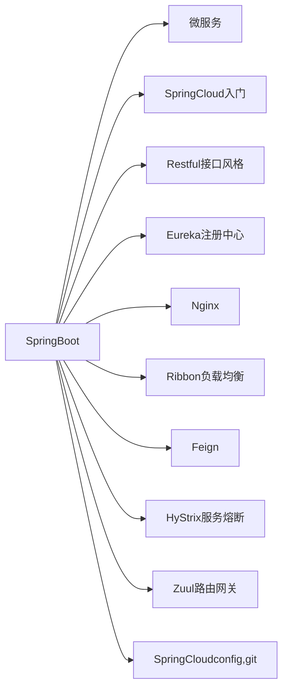

# Spring Cloud

@(Spring)[AuspiceTian]

[TOC]

## 简介

```mermaid
graph LR
B[SpringBoot]-->微服务
B-->SpringCloud入门
B-->Restful接口风格
B-->Eureka注册中心
B-->Nginx
B-->Ribbon负载均衡
B-->Feign
B-->HyStrix服务熔断
B-->Zuul路由网关
B-->D["SpringCloudconfig,git"]
```

