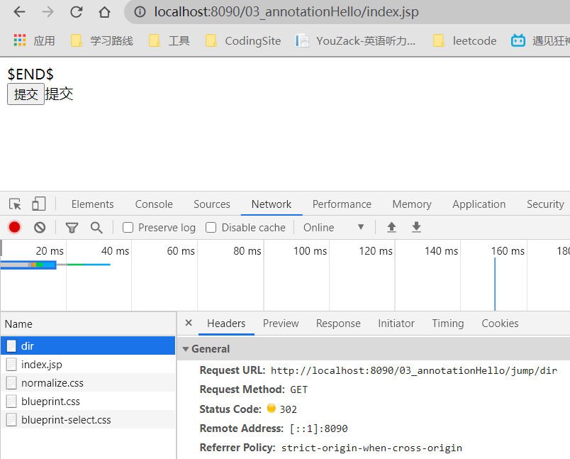

# SpringMVC

@(Spring)[Auspice Tian]

[TOC]

<div style="page-break-after:always" />

## JaveWeb

### 三大组件

JavaWeb的三大组件，都需要web.xml进行注册（特殊：Listener活化、钝化、绑定、解绑用JavaBean实现）

1.  Servlet：处理请求

2.  Filter：过滤拦截请求

    -   使用步骤：实现Filter接口 -> 去Web.xml进行配置 

    -   实现

        ```java
        doFilter(){ 
            
            //放行请求
            chain.doFilter(req,res);
        }
        ```

    -   配置

        ```xml
        <filter>
            <filter-name></filter-name>
            <filter-class></filter-class>
        </filter>
        
        <filter-mapping>
        	<filter-name></filter-name>
            <url-pattern></url-pattern>
        </filter-mapping>
        
        <!--
        url-pattern的三种方式
        1. 精确匹配-直接拦截指定路径（/pics/hh.jsp）
        2. 路径匹配-拦截路径下所有请求（/pics/*）
        3. 后缀匹配-拦截所有该后缀的请求（*.jsp）
        -->
        ```

    -   多个Filter的访问顺序

        

3.  Listener：监听器

    -   监听对象

        ServeletRequest(2),HttpSession(4),ServletContext(2)

        2：生命监听器，属性变化监听器

        HttpSession：活化钝化监听器、解绑绑定监听器

    -   掌握：ServletContext（生命周期监听器）

        监听服务器的启动、停止——ServletContext对象的创建与销毁

         	一个Web项目对应一个ServletContext，代表当前项目的信息

        ​	可以作为最大的域对象，项目运行期间共享数据

    -   使用：实现对应的监听器接口 -> 配置 web.xml

        JavaBean要实现的接口：HttpSessionActivitionListener,HttpSessionBindingListener

### MVC

#### model ——dao,service

数据层，数据Dao Value Object

-   保存数据状态

-   pojo:User
    -   vo:UserVo
    -   dto:

服务层,行为Service

-   业务逻辑

#### view——jsp

显示页面

#### controller——servlet

接受请求，委托模型层处理，完毕后返回给视图，由视图展示

-   取得表单数据
-   调用业务逻辑
-   转向指定的页面


1.  用户发请求
2.  Servlet接受请求数据，并调用对应的业务逻辑方法
3.  业务处理完毕，返回更新后的数据给Servlet
4.  servlet转向JSP，由JSP来渲染页面
5.  响应给前端更新后的页面

演进式开发

-   Alibaba PHP-->个人网站
-   用户量大-->Java
-   去IOE -->Mysql-->AliSql,AliRedis
-   All in one --> 微服务 

### Servlet

#### 依赖

```xml
<dependency>
    <groupId>junit</groupId>
    <artifactId>junit</artifactId>
    <version>4.13</version>
    <scope>test</scope>
</dependency>
<dependency>
    <groupId>org.springframework</groupId>
    <artifactId>spring-webmvc</artifactId>
    <version>5.3.3</version>
</dependency>
<dependency>
    <groupId>javax.servlet</groupId>
    <artifactId>servlet-api</artifactId>
    <version>2.5</version>
</dependency>
<dependency>
    <groupId>javax.servlet.jsp</groupId>
    <artifactId>jsp-api</artifactId>
    <version>2.1.3-b06</version>
</dependency>
<dependency>
    <groupId>javax.servlet</groupId>
    <artifactId>jstl</artifactId>
    <version>1.2</version>
</dependency>
```

#### 标记为web项目


#### 代码

```java
//Hello.java
public class Hello extends HttpServlet {
    @Override
    protected void doGet(HttpServletRequest req, HttpServletResponse resp) throws ServletException, IOException {
        String method = req.getParameter("method");
        if(method.equals("add")){
            req.setAttribute("msg","执行了add方法");
        }
        if(method.equals("delete")){
            req.setAttribute("msg","执行了delete方法");
        }

        req.getRequestDispatcher("/WEB-INF/jsp/result.jsp").forward(req,resp);
    }

    @Override
    protected void doPost(HttpServletRequest req, HttpServletResponse resp) throws ServletException, IOException {
        doGet(req, resp);
    }
}
```

```xml
<!--web.xml-->
<?xml version="1.0" encoding="UTF-8"?>
<web-app xmlns="http://xmlns.jcp.org/xml/ns/javaee"
         xmlns:xsi="http://www.w3.org/2001/XMLSchema-instance"
         xsi:schemaLocation="http://xmlns.jcp.org/xml/ns/javaee http://xmlns.jcp.org/xml/ns/javaee/web-app_4_0.xsd"
         version="4.0">
    <servlet>
        <servlet-name>hello</servlet-name>
        <servlet-class>com.kuang.servlet.Hello</servlet-class>
    </servlet>
    <servlet-mapping>
        <servlet-name>hello</servlet-name>
        <url-pattern>/hello</url-pattern>
    </servlet-mapping>
<!--    <welcome-file-list>
        <welcome-file>index.jsp</welcome-file>
    </welcome-file-list>-->
<!--

    <session-config>
        <session-timeout>15</session-timeout>单位为minute
    </session-config>-->
</web-app>
```

```jsp
<!--index.jsp-->
<%@ page contentType="text/html;charset=UTF-8" language="java" %>
<html>
<head>
  <title>Title</title>
</head>
<body>
<form action="${pageContext.request.contextPath}/hello" method="post">
  <input type="text" name="method" value="add"></input>
  <input type="submit" />
</form>
</body>
</html>
```

```jsp
<!--result.jsp-->
<%@ page contentType="text/html;charset=UTF-8" language="java" %>
<html>
<head>
    <title>Title</title>
</head>
<body>
${msg}
</body>
</html>
```

MVC框架做的事：

-   将url映射到java类或java类的方法						——servlet
-   封装用户提交的数据                                      ——DAO
-   处理请求--调用相关的业务处理--封装响应数据——Service
-   将相应的数据进行渲染，jsp/hetml等表示层数据——View

<div style="page-break-after:always" />

## SpringMVC简介

(文档)[https://docs.spring.io/spring-framework/docs/current/reference/html/web.html]

-   轻量级
-   基于请求响应的MVC框架
-   约定大于配置
-   功能强大：RESTful，数据验证，格式化，本地化，主体

**Typical context hierarchy in Spring Web MVC**


**Single root context in Spring Web MVC**


### ==SpringMVC原理==


>   Spring的web框架围绕DispatcherServlet设计，DispatcherServlet将请求分发到不同的处理器

**以请求为驱动，围绕一个中心Servlet（DispatcherServlet）分派请求及提供其他功能，DispatcherServlet继承自HttpServlet基类**


1.  DsipatcherServlet表示前置控制器，是整个SpringMVC的控制中心。用户发出请求，DispatcherServet接受请求并拦截通知

    -   url:http://localhost:8090/SpringMVC/hello
    -   http://localhost:8090——服务器域名
    -   SpringMVC		     ——部署在服务器上的web站点
    -   hello                      ——表示控制器

    位于服务器http://localhost:8090上的SpringMVC站点的hello控制器

2.  HandlerMapping 为处理器映射器

    DispatcherServlet调用HandlerMapping,根据url找对应的Handler

3.  HandlerExecution表示具体的Handler,作用是根据url查找Controller: /hello

4.  

5.  HandlerAdapter表示处理器适配器，其按照特定的规则去执行Handler，适配Controller

6.  Handler让具体的Controller执行。

7.  Controller将具体的执行信息返回给HandlerAdapter,如ModelAndView

    -   调用业务层
    -   封装对象，放在ModelAndView中的Model
        -   mv.addObject(attributeName:"",attributeValue"");
    -   封装要跳转的视图，放在ModelAndView中的View
        -   mv.setViewName(viewName:"");

8.  HandlerAdapter将ModelAndView传递给DispatcherServlet。

9.  DispatcherServlet调用视图解析器(ViewResolver)来解析HandlerAdapter传递的逻辑视图名。

    ```xml
    <!--视图解析器:DispatcherServlet给他的ModelAndView-->
    <bean class="org.springframework.web.servlet.view.InternalResourceViewResolver" id="InternalResourceViewResolver">
        <!--前缀-->
        <property name="prefix" value="/WEB-INF/jsp/"/>
        <!--后缀-->
        <property name="suffix" value=".jsp"/>
    </bean>
    ```

10.  视图解析器将解析真实视图名传给DispatcherServlet。

11.  DispatcherServlet根据视图解析器解析的视图结果，调用具体的视图。

12.  最终视图呈现给用户。

### HelloSpringMVC

#### 1. 新建项目，添加web支持，确保打包导入所依赖的lib文件


服务器端程序只有识别到war类型的压缩包才能部署

#### 2. 导出rescoures下的xml文件

```xml
<!-- build中配置resources，防止资源导出失败问题 -->
<build>
    <resources>
        <resource>
            <!-- 使得directory目录下的资源可以被导出 -->
            <directory>src/main/java</directory>
            <!-- 设置可被识别通过的文件类型 -->
            <includes>
                <include>**/*.properties</include>
                <include>**/*.xml</include>
            </includes>
            <filtering>true</filtering>
        </resource>

        <resource>
            <!-- 使得directory目录下的资源可以被导出 -->
            <directory>src/main/resources</directory>
            <!-- 设置可被识别通过的文件类型 -->
            <includes>
                <include>**/*.propertes</include>
                <include>**/*.xml</include>
            </includes>
            <filtering>true</filtering>
        </resource>
    </resources>
</build>
```

#### 3. 将项目标记为Web项目


#### 4. 配置web.xml

```xml
<!--SpringMVC核心 dispatcherServlet-->
<servlet>
    <servlet-name>dispatcherServlet</servlet-name>
    <servlet-class>org.springframework.web.servlet.DispatcherServlet</servlet-class>
    <!--DispatcherServlet要绑定Spring配置文件-->
    <init-param>
        <param-name>contextConfigLocation</param-name>
        <param-value>classpath:springmvc-servlet.xml</param-value>
    </init-param>

    <!--服务器部署程序时，项目启动即启动该servlet-->
    <load-on-startup>1</load-on-startup>
</servlet>

<!--
    在Spring中，
    / ：只匹配所有的请求，不会去匹配jsp页面
    /*：匹配所有的请求，包括jsp页面
    -->
<servlet-mapping>
    <servlet-name>dispatcherServlet</servlet-name>
    <url-pattern>/</url-pattern>
</servlet-mapping>

<!--解决中文乱码问题-->
<filter>
    <filter-name>encoding</filter-name>
    <filter-class>org.springframework.web.filter.CharacterEncodingFilter</filter-class>
    <init-param>
        <param-name>encoding</param-name>
        <param-value>utf-8</param-value>
    </init-param>
</filter>
<filter-mapping>
    <filter-name>encoding</filter-name>
    <url-pattern>/*</url-pattern>
</filter-mapping>
```

#### xml配置版

##### 1. SpringMVC的配置文件:resources-->springmvc-servlet.xml : [servletname]-servlet.xml

```xml
<?xml version="1.0" encoding="UTF-8"?>
<beans xmlns="http://www.springframework.org/schema/beans"
       xmlns:xsi="http://www.w3.org/2001/XMLSchema-instance"
       xsi:schemaLocation="http://www.springframework.org/schema/beans
       http://www.springframework.org/schema/beans/spring-beans.xsd">

    <!--配置SpringMVC的三大核心组件-->
    
    <!--添加 处理器映射器HandlerMapping-->
    <bean class="org.springframework.web.servlet.handler.BeanNameUrlHandlerMapping"/>

    <!--添加 处理器适配器 HandlerAdapter-->
    <bean class="org.springframework.web.servlet.mvc.SimpleControllerHandlerAdapter"/>

    <!--添加 视图解析器 ViewResolver-->
    <bean class="org.springframework.web.servlet.view.InternalResourceViewResolver" id="InternalResourceViewResolver">
        <!--前缀-->
        <property name="prefix" value="/WEB-INF/jsp/"/>
        <!--后缀-->
        <property name="suffix" value=".jsp"/>
    </bean>
</beans>
```

##### 2. 编写操作业务Controller

```java
package com.kuang.controller;

import org.springframework.web.servlet.ModelAndView;
import org.springframework.web.servlet.mvc.Controller;

import javax.servlet.http.HttpServletRequest;
import javax.servlet.http.HttpServletResponse;

public class HelloController implements Controller {
    public ModelAndView handleRequest(HttpServletRequest request, HttpServletResponse response) throws Exception {
        //ModelAndView 模型和视图
        ModelAndView mv = new ModelAndView();
        //封装对象，放在ModelAndView中。Model
        mv.addObject("msg","HelloSpringMVC!");
        //封装要跳转的视图，放在ModelAndView中
        mv.setViewName("hello"); //: /WEB-INF/jsp/hello.jsp
        return mv;
    }
}
```

##### 3. springmvc-servlet.xml

```xml
<!--Handler-->
<bean id="/hello" class="com.kuang.controller.HelloController"/>
```

#### xml配置版弊端

-   每写一个Controller都要将对应的Bean添加到配置文件中
-   **一个控制器中只有一个方法**

#### 注解版

##### 1.配置控制器和处理器的自动装配

```xml
<!--spring-mvc.xml-->
<?xml version="1.0" encoding="UTF-8"?>
<beans xmlns="http://www.springframework.org/schema/beans"
       xmlns:xsi="http://www.w3.org/2001/XMLSchema-instance"
       xmlns:context="http://www.springframework.org/schema/context"
       xmlns:mvc="http://www.springframework.org/schema/mvc"
       xsi:schemaLocation="http://www.springframework.org/schema/beans
       http://www.springframework.org/schema/beans/spring-beans.xsd http://www.springframework.org/schema/context https://www.springframework.org/schema/context/spring-context.xsd http://www.springframework.org/schema/mvc https://www.springframework.org/schema/mvc/spring-mvc.xsd">

   <!--自动扫包，使包下的controller交给IoC容器-->
    <context:component-scan base-package="com.kuang.controller"/>
    <!--静态资源过滤-->
    <mvc:default-servlet-handler/>
    <!--
        annotation-driven 自动完成这两个实例的注入
        DefaultAnnotationHandlerMapping ：类级别的注解 处理器映射器
        AnnotationMethodHandlerAdapter  ：方法级别的注解 处理器适配器
    -->
    <mvc:annotation-driven/>

    <!--视图解析器  ：模板引擎 Thymtleaf Freemaker-->
    <bean class="org.springframework.web.servlet.view.InternalResourceViewResolver">
        <property name="prefix" value="/WEB-INF/jsp/"/>
        <property name="suffix" value=".jsp"/>
    </bean>
</beans>
```

##### 2. 统一配置控制器

```java
package com.kuang.controller;

import org.springframework.stereotype.Controller;
import org.springframework.ui.Model;
import org.springframework.web.bind.annotation.RequestMapping;

@Controller
public class FrontController {
    /*
    * @RequestMapping   ——incoming Request 请求名
    * param             ——model
    * return            ——view
    * */
    @RequestMapping("/hello1")
    public String hello1(Model model){
        model.addAttribute("msg","Hello SpringMVC annotation!");

        return "hello1";//被视图解析器处理
    }

    @RequestMapping("/hello2")
    public String hello2(Model model){
        model.addAttribute("msg","Hello SpringMVC annotation!");

        return "hello2";//被视图解析器处理
    }
}
```

>   @Component
>
>   @Service
>
>   @Controller
>
>   @Repository

###### @RequestMapping

-   用于映射url到控制器类或一个特定的处理程序方法
-   用于类上，表示类中所有响应的请求都是以该地址作为父路径


<div style="page-break-after:always" />

## ==RestFul风格——参数传递==

>   Restful是一个资源定位及资源操作的风格
>
>   -   **安全**
>   -   简洁
>   -   有层次
>   -   更易于实现缓存机制

### 功能

-   资源操作：使用POST，DELETE,PUT,GET不同方法对资源进行操作

### 对比

**传统传参**：通过**链接**实现不同请求

localhost:8090/method?flag=  &

**restful风格**：通过 **不同的请求方式** 实现不同请求

localhost:8090/method/1/2/3/4


### Restful传递参数

SpringMVC中使用注解@PathVariable注解，让方法参数的值绑定到一个URI模板变量上

```java
/*
 * @RequestMapping("method/{}/{}")
 * restful风格的参数名必须和参数列表的参数同名才可绑定
 * */
@RequestMapping("add/{a}/{b}")
public String deliverParam(@PathVariable int a,@PathVariable int b, Model model){
    model.addAttribute("result",a+b);

    return "result";
}
```

### 通过不同的请求方式传参

>   @[请求方式]Mapping("[restful]") 
>
>   <==> @RequestMapping(value="[restful]",method=RequestMethod.[请求方式])

```java
@RequestMapping(value = "add/{a}/{b}",method = RequestMethod.GET)
public String deliverParam(@PathVariable int a,@PathVariable int b, Model model){
    model.addAttribute("result","通过GET add:result="+(a+b));

    return "result";
}

@PostMapping("add/{a}/{b}")
public String deleverParam(@PathVariable int a,@PathVariable int b,Model model){
    model.addAttribute("result","通过post方式 add:result="+(a+b));

    return "result";
}
```


<div style="page-break-after:always" />

## 接收请求参数

### 域名称和处理方法的参数名一致

>   提交数据：localhost:8090/hello?name=kuangshen

>   处理方法

```java
@RequestMapping("/hello")
public String hello(String name){
    System.out.println(name);
    return "hello";
}
```

### 域名称与处理方法的参数名不一致

>   提交数据：localhost:8090/hello?username=kuangshen

>   处理方法 @RequestParam("[域名称]")
>
>   -   **前端的属性名都要加上@RequestParam**

```java
@RequestMapping("/hello")
public String hello(@RequestParam("username") String name){
    System.out.println(name);
    return "hello";
}
```

### 提交的是对象

要求提交的表单域和对象的属性名一致

>   假设传递的是一个对象，逐一匹配对象中的字段名

1.  实体类

```java
public class User{
    private int id;
    private String name;
    private int age;
}
```

2.  提交数据

    >    localhost:8090/hello?id=1&age=15&name=kuangshen

3.  处理方法

    ```java
    @RequestMapping("/user")
    public String hello(User user){
        System.out.println(user);
        return "hello";
    }
    ```

<div style="page-break-after:always" />

## 数据回显

### ModelAndView

```java
public class ControllerTest1 implements Controller{
    public ModelAndView handlerRequest(HttpServletRequest req,HttpServletResponse res){
        ModelAndView mv = new ModelAndView();
        mv.addObject("msg","ControllerTest1");
        mv.setViewName("test");
        
        return mv;
    }
}
```

### ModelMap

```java
@PostMapping("add/{a}/{b}")
public String deleverParam(@PathVariable int a,@PathVariable int b,ModelMap modelMap){
    modelMap.addAttribute("result","通过post方式 add:result="+(a+b));

    return "result";
}
```

### Model

```java
@PostMapping("add/{a}/{b}")
public String deleverParam(@PathVariable int a,@PathVariable int b,Model model){
    model.addAttribute("result","通过post方式 add:result="+(a+b));

    return "result";
}
```

### 对比

>   **Model**：只适用于存储数据，简化了对于Model 对象的操作和理解
>
>   **ModelMap**：继承了LinkedMap，除了实现自身的一些方法，同时继承LinkedMap
>
>   **ModelAndView**：可以在存储数据的同时，进行设置返回的逻辑视图，进行控制展示层的跳转

<div style="page-break-after:always" />

## 结果跳转方式

设置ModelAndView对象，根据view的名称和视图解析器跳到指定的页面

页面：{视图解析器前缀} + viewName + {视图解析器后缀}

### 原生ServletAPI

1.  HttpServletResponse进行输出

    ```java
    @RequestMapping("/jump")
    public void test2(HttpServletRequest request, HttpServletResponse response) throws IOException {
        response.getWriter().println("print");
    }
    ```

    

2.  HttpServletResponse进行重定向

    ```java
    @RequestMapping("/jump/dir")
    public void test1(HttpServletRequest request, HttpServletResponse response) throws IOException {
    
        response.sendRedirect("/03_annotationHello/index.jsp");
    }
    ```

    

3.  HttpServletResponse实现转发

    ```java
    @RequestMapping("/jump/req")
    public void test(HttpServletRequest request, HttpServletResponse response) throws ServletException, IOException {
    
        request.getRequestDispatcher("/WEB-INF/jsp/form.jsp").forward(request,response);
    }
    ```

    

### SpringMVC不配置视图解析器

1.  重定向

    ```java
    @RequestMapping("/mvcjump/res")
    public String test2(Model model){
        model.addAttribute("msg","MVC Jump,sendRedirect");
    
        return "redirect:/index.jsp";
    }
    ```

    

2.  请求转发

```java
@RequestMapping("/mvcjump/req")
public String test1(Model model){
    model.addAttribute("msg","MVC Jump,request dispatcher");
    return "forward:/WEB-INF/jsp/form.jsp";
}
```


### SpringMVC配置视图解析器后的重定向

```java
@RequestMapping("/viewresolver/res")
public String test2(Model model){
    model.addAttribute("msg","MVC Jump,sendRedirect");

    return "redirect:/index.jsp";
}
```

<div style="page-break-after:always" />

<div style="page-break-after:always" />

## 乱码问题

>   form表单传递的编码是 **ISO8859**，一旦传递就会出现乱码

### 过滤器

```java
@Override
public void doFilter(ServletRequest request, ServletResponse response, FilterChain chain) throws IOException, ServletException {
    request.setCharacterEncoding("utf-8");
    response.setCharacterEncoding("utf-8");

    chain.doFilter(request, response);
}
```

```xml
<!--web.xml-->
<filter>
    <filter-name>encoding</filter-name>
    <filter-class>com.kuang.filter.EncodingFilter</filter-class>
</filter>
<filter-mapping>
    <filter-name>encoding</filter-name>
    <url-pattern>/</url-pattern>
</filter-mapping>
```

### SringMVC实现的过滤器

```xml
<!--web.xml-->
<filter>
    <filter-name>encoding</filter-name>
    <filter-class>org.springframework.web.filter.CharacterEncodingFilter</filter-class>
    <init-param>
        <param-name>encoding</param-name>
        <param-value>utf-8</param-value>
    </init-param>
</filter>
<filter-mapping>
    <filter-name>encoding</filter-name>
    <url-pattern>/*</url-pattern>
</filter-mapping>
```

<div style="page-break-after:always" />

## Java生成JSON数据

### Json

>   JSON：JavaScript Object Notation  纯文本类型
>
>   ​	轻量级数据交换格式——与XML相比
>
>   -   完全独立于编程语言的文本格式来存储和表示数据
>   -   简洁清晰的层次结构
>   -   易于人阅读和编写，同时也易于及其解析和生成，提升网络传输效率

```json
<!--js对象-->
var 变量名 = {key:value,key:value}

基本数据类型，数组，对象
var student = {lastName:"张三",age:18}

<!--转换方法-->
JSON = JSON.stringify(var)
var = JSON.parse(JSON)
```

前后端分离：

后端部署后端：提供接口，提供数据

​				JSON

前端独立部署：渲染后端的数据

-   解析工具
    -   jackjson
    -   fastjson

本质上就是一个字符串

```java
@RequestMapping("/j1")
@ResponseBody       //不会走视图解析器，直接返回一个JSON字符串
public String test(Model model){

    User user = new User("啊1",12,"男");

    return user.toString();
}
```

### 使控制器转化为接口，直接返回JSON

```java
//@Controller
@RestController
public class Json {
    @RequestMapping(value = "/j1")
    //@ResponseBody       //不会走视图解析器，直接返回一个JSON字符串
}
```

### Jackson

#### 导入Maven依赖

```xml
<dependency>
    <groupId>com.fasterxml.jackson.core</groupId>
    <artifactId>jackson-databind</artifactId>
    <version>2.9.8</version>
</dependency>
```


```java
public String writeValueAsString(Object value)
throws com.fasterxml.jackson.core.JsonProcessingException
```

```java
@RequestMapping("/j1")
@ResponseBody       //不会走视图解析器，直接返回一个JSON字符串
public String test(Model model) throws JsonProcessingException {
    //Jackson ObjectMapper
    ObjectMapper objectMapper = new ObjectMapper();

    User user = new User("啊1",12,"男");
    User user1 = new User("啊2",12,"男");
    User user2 = new User("啊3",12,"男");

    List<User> list = new ArrayList<>();
    list.add(user);
    list.add(user1);
    list.add(user2);
    String str = objectMapper.writeValueAsString(list);

    return str;
}
```


#### 解决中文乱码

>   设置响应体内容的类型


```java
@RequestMapping(value = "/j1",produces = "application/json;charset=utf-8")
```


##### 直接使用Jackson封装的转换器

```xml
<mvc:annotation-driven>
    <mvc:message-converters register-defaults="true">
        <bean class="org.springframework.http.converter.StringHttpMessageConverter">
            <constructor-arg value="UTF-8"/>
        </bean>
        <bean class="org.springframework.http.converter.json.MappingJackson2HttpMessageConverter">
            <property name="objectMapper">
                <bean class="org.springframework.http.converter.json.Jackson2ObjectMapperFactoryBean">
                    <property name="failOnEmptyBeans" value="false"/>
                </bean>
            </property>
        </bean>
    </mvc:message-converters>
</mvc:annotation-driven>
```

#### 封装工具类

```java
@RequestMapping("/j2")
public String test2() throws JsonProcessingException {
    ObjectMapper objectMapper = new ObjectMapper();

    SimpleDateFormat sdf = new SimpleDateFormat("yyyy-MM-dd HH:mm:ss");//自定义日期格式

    //ObjectMapper 解析后的默认时间格式为：TimeStamp
    return objectMapper.writeValueAsString(sdf.format(new Date()));
}
```


```java
@RequestMapping("/j2")
public String test2() throws JsonProcessingException {
    ObjectMapper objectMapper = new ObjectMapper();

    objectMapper.configure(SerializationFeature.WRITE_DATES_AS_TIMESTAMPS,false);
    //SimpleDateFormat sdf = new SimpleDateFormat("yyyy-MM-dd HH:mm:ss");//自定义日期格式

    //ObjectMapper 解析后的默认时间格式为：TimeStamp
    return objectMapper.writeValueAsString(new Date());
}
```


#### JSONUtils

```java
public class JSONUtils {
    public static String getJson(Object object){
        return getJson(object,"yyyy-MM-dd HH:mm:ss");
    }

    public static String getJson(Object object,String dateFormat){
        ObjectMapper objectMapper = new ObjectMapper();
        objectMapper.configure(SerializationFeature.WRITE_DATES_AS_TIMESTAMPS,false);

        SimpleDateFormat sdf = new SimpleDateFormat(dateFormat);
        objectMapper.setDateFormat(sdf);

        try {
            return objectMapper.writeValueAsString(object);
        } catch (JsonProcessingException e) {
            e.printStackTrace();
        }

        return null;
    }
}
```

### FastJson

阿里开发的专用于java开发的包，方便的实现json与JavaBean对象的相互转换，实现js对象与json的转换

#### Maven依赖

```xml
<dependency>
    <groupId>com.alibaba</groupId>
    <artifactId>fastjson</artifactId>
    <version>1.2.60</version>
</dependency>
```

-   JSONObject代表json对象
    -   JSONObject实现了Map接口
    -   通过各种形式的get()方法可以获取json对象中的额数据，也可利用size(),isEmpty()等方法获取"键":"值"对的个数和判断是否为空，其本质是实现Map接口并调用接口中的方法完成
-   JSONArrary代表json对象数组
    -   内部是有List接口中的方法来完成操作的
-   JSON代表JSONObject和JSONArray的转化
    -   主要实现json对象，json对象数组，javabean对象，json字符串之间的相互转化

#### 方法

-   JSON.toJSONString()：java对象转JSON字符串
-   JSON.toJSON()：java对象转js对象
-   JSON.parseObject(str,User.class)：JSON字符串转java对象
-   JSON.toJavaObject(jsObject,User.class)：JS对象转Java对象

<div style="page-break-after:always" />

## ==SSM整合==

### JRE环境

问题：

java.sql.SQLException: No suitable driver

解决：

将mysql-connector-java-8.0.16.jar，放到 JAVA_HOME目录下的jre\lib\ext目录下

### 数据库环境

```mysql
CREATE DATABASE `ssmbuild`;
USE `ssmbuild`;
DROP TABLE IF EXISTS `books`;
CREATE TABLE `books` (
`bookID` INT(10) NOT NULL AUTO_INCREMENT COMMENT '书id',
`bookName` VARCHAR(100) NOT NULL COMMENT '书名',
`bookCounts` INT(11) NOT NULL COMMENT '数量',
`detail` VARCHAR(200) NOT NULL COMMENT '描述',
KEY `bookID` (`bookID`)
) ENGINE=INNODB DEFAULT CHARSET=utf8
INSERT  INTO `books`(`bookID`,`bookName`,`bookCounts`,`detail`)VALUES 
(1,'Java',1,'从入门到放弃'),
(2,'MySQL',10,'从删库到跑路'),
(3,'Linux',5,'从进门到进牢');
```

### Maven项目创建

#### 1. 导入依赖

```xml
<!--1. 导入依赖-->
<dependencies>
	<!--
	1. junit
    2. 数据库驱动,数据库连接池c3p0 dbcp,
    3. servlet,jsp
    3. spring,spring-mybatis,mybatis,
	-->
    <!--Junit-->
    <dependency>
        <groupId>junit</groupId>
        <artifactId>junit</artifactId>
        <version>4.13</version>
    </dependency>
    <!--数据库驱动-->
    <dependency>
        <groupId>mysql</groupId>
        <artifactId>mysql-connector-java</artifactId>
        <version>8.0.16</version>
    </dependency>
    <!-- 数据库连接池 -->
    <dependency>
        <groupId>com.mchange</groupId>
        <artifactId>c3p0</artifactId>
        <version>0.9.5.5</version>
    </dependency>
    <!--Servlet - JSP -->
    <dependency>
        <groupId>javax.servlet</groupId>
        <artifactId>servlet-api</artifactId>
        <version>2.5</version>
    </dependency>
    <dependency>
        <groupId>javax.servlet.jsp</groupId>
        <artifactId>jsp-api</artifactId>
        <version>2.1.3-b06</version>
    </dependency>
    <dependency>
        <groupId>javax.servlet</groupId>
        <artifactId>jstl</artifactId>
        <version>1.2</version>
    </dependency>
    <!--Mybatis-->
    <dependency>
        <groupId>org.mybatis</groupId>
        <artifactId>mybatis</artifactId>
        <version>3.5.6</version>
    </dependency>
    <dependency>
        <groupId>org.mybatis</groupId>
        <artifactId>mybatis-spring</artifactId>
        <version>2.0.6</version>
    </dependency>
    <!--Spring-->
    <dependency>
        <groupId>org.springframework</groupId>
        <artifactId>spring-webmvc</artifactId>
        <version>5.3.3</version>
    </dependency>
    <dependency>
        <groupId>org.springframework</groupId>
        <artifactId>spring-jdbc</artifactId>
        <version>5.3.3</version>
    </dependency>
</dependencies>
```

#### 2. 静态资源配置

```xml
<!--2. 静态资源配置问题-->
<build>
   <resources>
       <resource>
           <directory>src/main/java</directory>
           <includes>
               <include>**/*.properties</include>
               <include>**/*.xml</include>
           </includes>
           <filtering>false</filtering>
       </resource>
       <resource>
           <directory>src/main/resources</directory>
           <includes>
               <include>**/*.properties</include>
               <include>**/*.xml</include>
           </includes>
           <filtering>false</filtering>
       </resource>
   </resources>
</build>
```

#### 3. 连接数据库


#### 4. 项目结构

##### 1. pojo

```java
@Data
@AllArgsConstructor
@NoArgsConstructor
public class Books {
    private int bookID;
    private String bookName;
    private int bookCounts;
    private String detail;
}
```

##### 2. mapper

```java
public interface BooksMapper {
    //增加一本书
    int addBook(Books books);
    //删除一本书
    int deleteBooksById(@Param("bookId") int id);
    //更新书信息
    int updateBook(Books books);
    //查找一本书
    Books selectBookById(@Param("bookId") int id);
    //查找全部书
    List<Books> selectAllBooks();
}
```

```xml
<mapper namespace="com.kuang.mapper.BooksMapper">
    <insert id="addBook" parameterType="books">
        insert into mybatis.ssmBuild
        (bookName,bookCounts,detail) values (#{bookName},#{bookCounts},#{detail});
    </insert>
    <delete id="deleteBooksById">
        delete from mybatis.ssmBuild where bookID=#{bookId};
    </delete>
    <update id="updateBook" parameterType="books">
        update mybatis.ssmBuild
        set bookName=#{bookName},bookCounts=#{bookCounts},detail=#{detail}
        where bookID=#{bookID};
    </update>
    <select id="selectBookById">
        select * from mybatis.ssmBuild where bookID=#{bookId};
    </select>
    <select id="selectAllBooks" resultType="books">
        select * from mybatis.ssmBuild;
    </select>
</mapper>
```

##### 3. Service层调用mapper层

```java
/*BooksService.java*/
public interface BooksService {
    //增加一本书
    int addBook(Books books);
    //删除一本书
    int deleteBooksById(int id);
    //更新书信息
    int updateBook(Books books);
    //查找一本书
    Books selectBookById(int id);
    //查找全部书
    List<Books> selectAllBooks();
}
```

```java
/*BooksServiceImpl.java*/
public class BooksServiceImpl implements BooksService{
    //service层调用dao层
    private BooksMapper booksMapper;

    public void setBooksMapper(BooksMapper booksMapper) {
        this.booksMapper = booksMapper;
    }

    @Override
    public int addBook(Books books) {
        return booksMapper.addBook(books);
    }

    @Override
    public int deleteBooksById(int id) {
        return booksMapper.deleteBooksById(id);
    }

    @Override
    public int updateBook(Books books) {
        return booksMapper.updateBook(books);
    }

    @Override
    public Books selectBookById(int id) {
        return booksMapper.selectBookById(id);
    }

    @Override
    public List<Books> selectAllBooks() {
        return booksMapper.selectAllBooks();
    }
}
```

-   controller

```properties
#db.properties
mysqlDriver=com.mysql.cj.jdbc.Driver
mysqlUrl=jdbc:mysql://localhost:3306/mybatis?useSSL=true&useUnicode=true&characterEncoding=utf-8&serverTimezone=UTC
root=root
rootPassword=2017002231
```

```xml
<!--mybatis-config.xml
	将项目标记为mybatis项目
-->
<?xml version="1.0" encoding="UTF-8" ?>
<!DOCTYPE configuration
        PUBLIC "-//mybatis.org//DTD Config 3.0//EN"
        "http://mybatis.org/dtd/mybatis-3-config.dtd">
<configuration>
    <typeAliases>
        <package name="com.kuang.pojo"/>
    </typeAliases>

    <!--<settings>
        <setting name="" value=""/>
    </settings>-->
</configuration>
```

```xml
<!--applicationContext.xml
	标记为Spring项目
-->
<?xml version="1.0" encoding="UTF-8"?>
<beans xmlns="http://www.springframework.org/schema/beans"
       xmlns:xsi="http://www.w3.org/2001/XMLSchema-instance"
       xsi:schemaLocation="http://www.springframework.org/schema/beans
       http://www.springframework.org/schema/beans/spring-beans.xsd">

    <import resource="spring-mapper.xml"/>
    <import resource="spring-service.xml"/>
    <import resource="spring-mvc.xml"/>
</beans>
```

### Spring整合Mybatis

**保证所有的spring配置文件属于同一Applicationcontext下**，属于同一context下的资源可以被直接识别


#### spring-mapper.xml

```xml
<?xml version="1.0" encoding="UTF-8"?>
<beans xmlns="http://www.springframework.org/schema/beans"
       xmlns:xsi="http://www.w3.org/2001/XMLSchema-instance"
       xmlns:context="http://www.springframework.org/schema/context"
       xsi:schemaLocation="http://www.springframework.org/schema/beans
       http://www.springframework.org/schema/beans/spring-beans.xsd
       http://www.springframework.org/schema/context
       http://www.springframework.org/schema/context/spring-context.xsd">

    <!--1.导入数据库连接配置-->
    <context:property-placeholder location="db.properties"/>

    <!--2. 配置数据库连接池
        dbcp:半自化操作，不能自动连接
        c3p0:自动化操作，(自动化加载配置文件，并可以自动设置到对象中)
        druid,hikari
    -->
    <bean id="dataSource" class="com.mchange.v2.c3p0.ComboPooledDataSource">
        <property name="dataSourceName" value="${mysqlDriver}"/>
        <property name="jdbcUrl" value="${mysqlUrl}"/>
        <property name="user" value="${root}"/>
        <property name="password" value="${rootPassword}"/>

        <!--c3p0连接池私有属性-->
        <property name="maxPoolSize" value="30"/>
        <property name="minPoolSize" value="10"/>
        <!--关闭自动提交-->
        <property name="autoCommitOnClose" value="false"/>
        <!--获取连接超时时间 单位:ms-->
        <property name="checkoutTimeout" value="10000"/>
        <!--当获取连接失败重试次数-->
        <property name="acquireRetryAttempts" value="2"/>
    </bean>

    <!--3. sqlSessionFactory-->
    <bean id="sqlSessionFactory" class="org.mybatis.spring.SqlSessionFactoryBean">
        <property name="dataSource" ref="dataSource"/>
        <!--绑定mybatis-config配置文件-->
        <property name="configLocation" value="classpath:mybatis-config.xml"/>
    </bean>

    <!--4. 配置mapper接口扫描包,动态实现Mapper接口可以注入到IoC容器中-->
    <bean class="org.mybatis.spring.mapper.MapperScannerConfigurer">
        <!--注入SqlSessionFactory-->
        <property name="sqlSessionFactoryBeanName" value="sqlSessionFactory"/>
        <!--指定要扫描的mapper包-->
        <property name="basePackage" value="com.kuang.mapper"/>
    </bean>
</beans>
```

##### 1. 关联数据库配置文件

```xml
<!--1.导入数据库连接配置-->
<context:property-placeholder location="db.properties"/>
```

##### 2. 连接池

```xml
<!--2. 配置数据库连接池
        dbcp:半自化操作，不能自动连接
        c3p0:自动化操作，(自动化加载配置文件，并可以自动设置到对象中)
        druid,hikari
    -->
<!--
    <bean class="org.springframework.jdbc.datasource.DriverManagerDataSource">
       <property name="driverClassName" value="${mysqlDriver}"/>
        <property name="url" value="${mysqlUrl}"/>
        <property name="username" value="${root}"/>
        <property name="password" value="${rootPassword}"/>
    </bean>
-->
<bean id="datasource" class="com.mchange.v2.c3p0.ComboPooledDataSource">
    <property name="dataSourceName" value="${mysqlDriver}"/>
    <property name="jdbcUrl" value="${mysqlUrl}"/>
    <property name="user" value="${root}"/>
    <property name="password" value="${rootPassword}"/>

    <!--c3p0连接池私有属性-->
    <property name="maxPoolSize" value="30"/>
    <property name="minPoolSize" value="10"/>
    <!--连接后不自动commit-->
    <property name="autoCommitOnClose" value="false"/>
    <!--获取连接超时时间-->
    <property name="checkoutTimeout" value="10000"/>
    <!--当获取连接失败重试次数-->
    <property name="acquireRetryAttempts" value="2"/>
</bean>
```

##### 3. SqlSessionFactory(数据源+关联MyBatsi配置文件)

```xml
<!--3. sqlSessionFactory-->
<!--
    <bean id="sqlSessionFactory" class="org.mybatis.spring.SqlSessionFactoryBean">
        <property name="dataSource" ref="dataSource"/>
        &lt;!&ndash;绑定,mybatis配置文件&ndash;&gt;
        <property name="configLocation" value="classpath:mybatis-config.xml"/>
        <property name="mapperLocations" value="classpath:com/kuang/mapper/*.xml"/>
    </bean>

    <bean id="sqlSession" class="org.mybatis.spring.SqlSessionTemplate">
        <constructor-arg name="sqlSessionFactory" ref="sqlSessionFactory"/>
    </bean>
-->
<bean id="sqlSessionFactory" class="org.mybatis.spring.SqlSessionFactoryBean">
    <property name="dataSource" ref="datasource"/>
    <!--绑定mybatis-config配置文件-->
    <property name="configLocation" value="classpath:mybatis-config.xml"/>
</bean>
```

##### 4. 将Mapper层注入IoC容器

```xml
<!--4. 配置mapper接口扫描包,动态实现Mapper接口注入到IoC容器中-->
<bean class="org.mybatis.spring.mapper.MapperScannerConfigurer">
    <!--注入SqlSessionFactory-->
    <property name="sqlSessionFactoryBeanName" value="sqlSessionFactory"/>
    <!--指定要扫描的mapper包-->
    <property name="basePackage" value="com.kuang.mapper"/>
</bean>
```

#### spring-service.xml

```xml
<?xml version="1.0" encoding="UTF-8"?>
<beans xmlns="http://www.springframework.org/schema/beans"
       xmlns:xsi="http://www.w3.org/2001/XMLSchema-instance"
       xmlns:context="http://www.springframework.org/schema/context"
       xsi:schemaLocation="http://www.springframework.org/schema/beans
       http://www.springframework.org/schema/beans/spring-beans.xsd
       http://www.springframework.org/schema/context
       http://www.springframework.org/schema/context/spring-context.xsd">

    <!--1.扫描service包下的类-->
    <context:component-scan base-package="com.kuang.service"/>
    <!--2.将所有的业务类，注入到IoC容器，通过配置或注解实现-->
    <bean id="booksServiceImpl" class="com.kuang.service.BooksServiceImpl">
        <property name="booksMapper" ref="booksMapper"/>
    </bean>
    <!--3.声明式事务配置-->
    <bean class="org.springframework.jdbc.datasource.DataSourceTransactionManager" id="transactionManager">
        <!--注入数据源-->
        <property name="dataSource" ref="dataSource"/>
    </bean>

    <!--4.aop事务支持-->
    <tx:advice id="txAdvice" transaction-manager="transactionManager">
        <tx:attributes>
            <tx:method name="*"/>
        </tx:attributes>
    </tx:advice>
    <aop:config>
        <aop:pointcut id="pc_tx" expression="execution(* com.kuang.service.*.*(..))"/>
        <aop:advisor advice-ref="txAdvice" pointcut-ref="pc_tx"/>
    </aop:config>
    <!--
    注解配置事务
    <tx:annotation-driven transaction-manager="transactionManager"/>
    -->
</beans>
```

##### 1. 扫描service下的包

```xml
<context:component-scan base-package="com.kuang.service"/>
```

##### 2. 将业务类注入到IoC容器

```xml
<bean id="booksServiceImpl" class="com.kuang.service.BooksServiceImpl">
    <property name="booksMapper" ref="booksMapper"/>
</bean>
```

**自动装配booksMapper**


##### 3. 声明式事务配置

```xml
<!--3.声明式事务配置-->
<bean class="org.springframework.jdbc.datasource.DataSourceTransactionManager" id="transactionManager">
    <!--注入数据源-->
    <property name="dataSource" ref="datasource"/>
</bean>

<!--4.aop事务支持-->
<tx:advice id="txAdvice" transaction-manager="transactionManager">
    <tx:attributes>
        <tx:method name="*"/>
    </tx:attributes>
</tx:advice>
<aop:config>
    <aop:pointcut id="pc_tx" expression="execution(* com.kuang.service.*.*(..))"/>
    <aop:advisor advice-ref="txAdvice" pointcut-ref="pc_tx"/>
</aop:config>
<!--
注解配置事务
<tx:annotation-driven transaction-manager="transactionManager"/>
-->
```

### SpringMVC

#### 1. 标记为web项目——web.xml

```xml
<?xml version="1.0" encoding="UTF-8"?>
<web-app xmlns="http://xmlns.jcp.org/xml/ns/javaee"
         xmlns:xsi="http://www.w3.org/2001/XMLSchema-instance"
         xsi:schemaLocation="http://xmlns.jcp.org/xml/ns/javaee http://xmlns.jcp.org/xml/ns/javaee/web-app_4_0.xsd"
         version="4.0">
    <!--1.dispatcherServlet-->
    <servlet>
        <servlet-name>dispatcherServlet</servlet-name>
        <servlet-class>org.springframework.web.servlet.DispatcherServlet</servlet-class>
        <init-param>
            <param-name>contextConfigLocation</param-name>
            <param-value>classpath:spring-mvc.xml</param-value>
        </init-param>
        <load-on-startup>1</load-on-startup>
    </servlet>
    <servlet-mapping>
        <servlet-name>dispatcherServlet</servlet-name>
        <url-pattern>/</url-pattern>
    </servlet-mapping>
    
    <!--2. 乱码过滤-->
    <filter>
        <filter-name>encoding</filter-name>
        <filter-class>org.springframework.web.filter.CharacterEncodingFilter</filter-class>
        <init-param>
            <param-name>encoding</param-name>
            <param-value>utf-8</param-value>
        </init-param>
    </filter>
    <filter-mapping>
        <filter-name>encoding</filter-name>
        <url-pattern>/*</url-pattern>
    </filter-mapping>

    <!--3. session-->
    <session-config>
        <session-timeout>15</session-timeout>
    </session-config>
</web-app>
```

##### 1. dispatcherServlet

##### 2. 乱码过滤

##### 3. session超时

#### 2. spring-mvc配置

```xml
<?xml version="1.0" encoding="UTF-8"?>
<beans xmlns="http://www.springframework.org/schema/beans"
       xmlns:xsi="http://www.w3.org/2001/XMLSchema-instance"
       xmlns:mvc="http://www.springframework.org/schema/mvc"
       xmlns:context="http://www.springframework.org/schema/context"
       xsi:schemaLocation="http://www.springframework.org/schema/beans
       http://www.springframework.org/schema/beans/spring-beans.xsd
       http://www.springframework.org/schema/mvc
       http://www.springframework.org/schema/mvc/spring-mvc.xsd
       http://www.springframework.org/schema/context
       http://www.springframework.org/schema/context/spring-context.xsd">
    <mvc:default-servlet-handler />
    <mvc:annotation-driven />
    <context:component-scan base-package="com.kuang.controller"/>
    <bean class="org.springframework.web.servlet.view.InternalResourceViewResolver">
        <property name="suffix" value=".jsp"/>
        <property name="prefix" value="/WEB-INF/jsp/"/>
    </bean>
</beans>
```

##### 1. 默认的HandlerAdapter,HandlerMapping

##### 2. 配置注解驱动

##### 3. 扫描包：Controller

##### 4. 视图解析器

### CRUD

```java
/*BooksController.java*/
@Controller
@RequestMapping("/book")
public class BooksController {
    @Autowired
    @Qualifier("booksServiceImpl")
    private BooksService booksService;

    @RequestMapping("/allBook")
    public String list(Model model){
        List<Books> list = booksService.selectAllBooks();
        model.addAttribute("list",list);

        return "allBook";
    }

    @RequestMapping("/toAddBook")
    public String toAddBook(){
        return "addBook";
    }

    @RequestMapping("/addBook")
    public String addBook(Books book){
        System.out.println(book);
        booksService.addBook(book);
        return "redirect:/book/allBook";
    }
}
```

```jsp
<%@ page contentType="text/html;charset=UTF-8" language="java" %>
<html>
<head>
    <title>Title</title>
</head>
<body>
    <c:forEach items="${list}" var="it">
        <div>${it.bookID}|《${it.bookName}》</div>
        <div>${it.bookCounts}</div>
        <div>${it.detail}</div>
        <div>
            <a href="${pageContext.request.contextPath}/book/toUpdateBook?id=${it.bookID}">修改</a>
            &nbsp; | &nbsp;
            <a href="${pageContext.request.contextPath}/book/deleteBook/${it.bookID}">删除</a>
        </div>
        <div>——————————————————————————————————————————</div>
    </c:forEach>
</body>
</html>

<%@ page contentType="text/html;charset=UTF-8" language="java" %>
<html>
<head>
    <title>Title</title>
</head>
<body>
<form action="${pageContext.request.contextPath}/book/addBook" method="post">
    <div>
        <label for="bkName">书名</label>
        <input name="bookName" type="text" id="bkName"/>
    </div>
    <div>
        <label for="cnt">数量</label>
        <input name="bookCounts" type="text" id="cnt"/>
    </div>
    <div>
        <label for="detail">描述</label>
        <input name="detail" type="text" id="detail"/>
    </div>
    <input type="submit" />
</form>
</body>
</html>
```

```java
/*BooksController.java*/
@RequestMapping("/toUpdateBook")
public String toupdateBook(int id,Model model){
    Books book = booksService.selectBookById(id);
    model.addAttribute("book",book);

    return "updateBook";
}

@RequestMapping("/updateBook")
public String updateBook(Books book){
    booksService.updateBook(book);

    return "redirect:/book/allBook";
}

@RequestMapping("/deleteBook/{id}")
public String deleteBook(@PathVariable int id){
    booksService.deleteBooksById(id);
    return "redirect:/book/allBook";
}
```

```jsp
<!--updateBook.jsp-->
<%@ page contentType="text/html;charset=UTF-8" language="java" %>
<html>
<head>
    <title>修改书籍信息</title>
</head>
<body>
<form method="post" action="${pageContext.request.contextPath}/book/updateBook">
    <input hidden name="bookID" value="${book.bookID}" />
    <input name="bookName" value="${book.bookName}" />
    <input name="bookCounts" value="${book.bookCounts}" />
    <input name="detail" value="${book.detail}" />
    <input type="submit" value="修改"/>
</form>
</body>
</html>
```

### 事务配置

```java
//BooksServiceImpl.java
@Override
/* Transaction Test
     * 新增后删除
     * */
public int op() {
    Books newBook = new Books("Transaction Test",100,"TransactionTest");
    booksMapper.addBook(newBook);
    booksMapper.errorDeleteBook(14);

    return 0;
}
```

```xml
<!--人为制造错误
	BooksMapper.xml
-->
<delete id="errorDeleteBook">
    deletes from ssmBuild.books
    where bookID=#{bookId};
</delete>
```

#### 错误的运行结果


#### 事务织入——一般为service层配

```xml
<dependency>
    <groupId>org.aspectj</groupId>
    <artifactId>aspectjweaver</artifactId>
    <version>1.9.4</version>
</dependency>
```

##### 哪一层需要事务支持，切入到那一层上

```xml
<tx:advice id="txAdvice" transaction-manager="transactionManager">
    <tx:attributes>
        <tx:method name="*" propagation="REQUIRED"/>
    </tx:attributes>
</tx:advice>
<aop:config>
    <aop:pointcut id="pc_tx" expression="execution(* com.kuang.service.*.*(..))"/>
    <aop:advisor advice-ref="txAdvice" pointcut-ref="pc_tx"/>
</aop:config>
```

#### 注解配置声明式事务

```xml
<tx:annotation-driven transaction-manager="c3transactionManager"/>
```

##### 哪一个方法涉及事务，注解到那个方法上

```java
@Transactional(readOnly=false, propagation=Propagation.REQUIRED)
```

<div style="page-break-after:always" />

## AJAX

>   AJAX：Asynchronous JavaScript And XML 异步JavaScript和XML
>
>   ​	页面不刷新获取服务器相应的数据

### XmlHttpRequest对象

1.  XmlHttpRequest发起请求

2.  服务器收到请求，调用相应的Servlet进行处理，生成相应的响应信息
3.  XmlHttpRequest接收数据


```javascript
<!-- JS原生AJAX -->
var xhr = new XMLHttpRequest();//创建xhr对象
xhr.open("GET","路径","true");//建立连接
xhr.send();通过地道传输数据

//监听xhr的状态
xhr.onReadyStateChange = function(){
    if(xhr.readyState == 4 && xhr.status == 200){
        document.getElementById("").innerHTML = xhr.responseText;
    }
}
```

### Jquery Ajax

```javascript
$('#uid').click(function(){
    <!-- jquery封装AJAX -->
    $.get(url, [data], [callback], [type])
    //[type]一般不写
    $.get("${ctp}/getInfo",{待发送的数据对象},function([存储回调数据的变量]){})

    //参数用法是一样的，一个发的是POST请求，一个是GET请求
    $.post(url, [data], [callback], [type])
    若[type]为“json”，则jquery会自动转化为JSON对象

    $.ajax({
        url:"路径",
        type:"GET"/"POST",//请求方式
        data:{}，//发送的数据
        success:function(data){},
		dataType:"json",//指定返回数据的类型
        error:function(a,b){}//指定响应失败的处理函数
    });

    //禁用默认行为
    return false;
})
```

### 参数——基本数据类型

```java
//API
@RestController
public class AjaxController {
    @RequestMapping("/ajax1")
    public String ajax1(String name){
        System.out.println("userName=>"+name);
        if("AuspiceTian".equals(name)){
            return "true";
        }else{
            return "false";
        }
    }
}
```

```jsp
<%@ page contentType="text/html;charset=UTF-8" language="java" %>
<html>
  <head>
    <title>$Title$</title>
    <script src="${pageContext.request.contextPath}/js/jquery-3.5.1.js"></script>

    <script type="text/javascript">
      function go (){
        $.ajax({
          url:"${pageContext.request.contextPath}/ajax1",
          data:{"name":$("#username").val()},
          success(data){
            alert(data);
          }
        })
      }
    </script>
  </head>
  <body>
    <input id="username" type="test" onblur="go()"/>
  </body>
</html>
```


HTML+css+js

-   函数：闭包
-   Dom
    -   id,name,tag
    -   create,remove
-   Bom
    -   window
    -   document

ES6:import、require

### 参数——POJO

```java
@RequestMapping("/ajax2")
public List<Pojo> ajax2(){
    List<Pojo> list = new ArrayList<Pojo>();
    list.add(new Pojo("狂神说Java",1,"男"));
    list.add(new Pojo("狂神说前端",1,"女"));
    list.add(new Pojo("狂神说Spring",1,"男"));

    return list;
}
```

```jsp
<%@ page contentType="text/html;charset=UTF-8" language="java" %>
<html>
  <head>
    <title>$Title$</title>
    <script src="${pageContext.request.contextPath}/js/jquery-3.5.1.js"></script>

    <script type="text/javascript">
        function loadData(){
            $.ajax({
                url: "${pageContext.request.contextPath}/ajax2",
                success(data){
                    var html = "";
                    for(let i = 0;i < data.length;++i){
                        html += "<tr>"+
                                "<td>"+data[i].name+"</td>"+
                                "<td>"+data[i].age+"</td>"+
                                "<td>"+data[i].sex+"</td>"+
                            "</tr>";
                    }

                    $("#content").html(html)
                }
            })
        }
    </script>
  </head>
  <body>
      <div>
        <input type="button" onclick="loadData()" value="获取数据" />
      </div>
      <table>
        <tr>
          <td>名称</td>
          <td>年龄</td>
          <td>性别</td>
        </tr>
          <tbody id="content"></tbody>
      </table>
  </body>
</html>
```


## 拦截器

过滤器

-   servlet规范中的一部分，任何java web工程都适用
-   在url-pattern中配置了/*后，可以对所有要访问的资源进行拦截

拦截器

-   SpringMVC框架，只有使用了SpringMVC框架的工程才能使用
-   拦截器只会拦截访问控制器的方法，如果访问的是jsp/html/css/image/js则不会进行拦截

-   自带静态资源过滤

**拦截器是AOP思想的具体应用**==环绕(AroundAdvice)+方法执行后(AfterAdvice)==


>   只要实现了HandlerInterceptor即为拦截器

```xml
<!--拦截器配置-->
<mvc:interceptors>
    <mvc:interceptor>
        <!--拦截这个请求下的所有请求-->
        <mvc:mapping path="/**"/>
        <!--配置拦截器-->
        <bean class="com.kuang.config.MyInterceptor"/>
    </mvc:interceptor>
</mvc:interceptors>
```

```java
public class MyInterceptor implements HandlerInterceptor {
    /*
    * return true:执行下一个拦截器，放行
    * return false:拦截请求，返回首页
    * */
    @Override
    public boolean preHandle(HttpServletRequest request, HttpServletResponse response, Object handler) throws Exception {
        System.out.println("============所有页面的拦截器==========");
        response.sendRedirect(request.getContextPath()+"/index.jsp");
        return false;
    }
    /*
    * 主要用作日志功能
    * */
    @Override
    public void postHandle(HttpServletRequest request, HttpServletResponse response, Object handler, ModelAndView modelAndView) throws Exception {
        System.out.println("==============日志功能============");
    }

    @Override
    public void afterCompletion(HttpServletRequest request, HttpServletResponse response, Object handler, Exception ex) throws Exception {
        System.out.println("================清理日志=============");
    }
}
```

## 文件上传和下载

前端表单要求：

-   **method设置为POST**，
-   **enctype设置为multipart/form-data**。

只有在这样的情况下，浏览器才会把用户选择的文件以二进制数据发送给服务器；

```jsp
<form action="${pageContext.request.contextPath}/upload" enctype="multipart/form-data" method="post">
 <input type="file" name="file"/>
 <input type="submit" value="upload">
</form>
```

### 导入依赖

```xml
<!--文件上传-->
<dependency>
   <groupId>commons-fileupload</groupId>
   <artifactId>commons-fileupload</artifactId>
   <version>1.3.3</version>
</dependency>
<!--servlet-api导入高版本的-->
<dependency>
   <groupId>javax.servlet</groupId>
   <artifactId>javax.servlet-api</artifactId>
   <version>4.0.1</version>
</dependency>
```

### 文件上传

#### 1. 配置bean：multipartResolver

**注意！！！这个bena的id必须为：multipartResolver ， 否则上传文件会报400的错误！**

```xml
<!--文件上传配置-->
<bean id="multipartResolver" class="org.springframework.web.multipart.commons.CommonsMultipartResolver">
   <!-- 请求的编码格式，必须和jSP的pageEncoding属性一致，以便正确读取表单的内容，默认为ISO-8859-1 -->
   <property name="defaultEncoding" value="utf-8"/>
   <!-- 上传文件大小上限，单位为字节（10485760=10M） -->
   <property name="maxUploadSize" value="10485760"/>
   <property name="maxInMemorySize" value="40960"/>
</bean>
```

CommonsMultipartFile 的 常用方法：

-   **String getOriginalFilename()：获取上传文件的原名**
-   **InputStream getInputStream()：获取文件流**
-   **void transferTo(File dest)：将上传文件保存到一个目录文件中**

#### 2. Controller

##### 1. 上传实现

```java
package com.chen.controller;
import org.springframework.stereotype.Controller;
import org.springframework.web.bind.annotation.RequestMapping;
import org.springframework.web.bind.annotation.RequestParam;
import org.springframework.web.multipart.commons.CommonsMultipartFile;
import javax.servlet.http.HttpServletRequest;
import java.io.*;
@Controller
public class FileController {
   //@RequestParam("file") 将name=file控件得到的文件封装成CommonsMultipartFile 对象
   //批量上传CommonsMultipartFile则为数组即可
   @RequestMapping("/upload")
   public String fileUpload(@RequestParam("file") CommonsMultipartFile file ,HttpServletRequest request) throws IOException {
       //获取文件名 : file.getOriginalFilename();
       String uploadFileName = file.getOriginalFilename();
       
       //如果文件名为空，直接回到首页！
       if ("".equals(uploadFileName)){
           return "redirect:/index.jsp";
      }
       System.out.println("上传文件名 : "+uploadFileName);
       
       //上传路径保存设置
       String path = request.getServletContext().getRealPath("/upload");
       //如果路径不存在，创建一个
       File realPath = new File(path);
       if (!realPath.exists()){
           realPath.mkdir();
      }
       System.out.println("上传文件保存地址："+realPath);
       
       InputStream is = file.getInputStream(); //文件输入流
       OutputStream os = new FileOutputStream(new File(realPath,uploadFileName));//文件输出流
       //读取写出
       int len=0;
       byte[] buffer = new byte[1024];
       while ((len=is.read(buffer))!=-1){
           os.write(buffer,0,len);
           os.flush();
      }
       os.close();
       is.close();
       return "redirect:/index.jsp";
  }
}
```

##### 2. 采用file.Transto 来保存上传的文件

```java
/*
* 采用file.Transto 来保存上传的文件
*/
@RequestMapping("/upload2")
public String  fileUpload2(@RequestParam("file") CommonsMultipartFile file,HttpServletRequest request) throws IOException {
   //上传路径保存设置
   String path = request.getServletContext().getRealPath("/upload");
   File realPath = new File(path);
   if (!realPath.exists()){
       realPath.mkdir();
  }
   //上传文件地址
   System.out.println("上传文件保存地址："+realPath);
   //通过CommonsMultipartFile的方法直接写文件（注意这个时候）
   file.transferTo(new File(realPath +"/"+ file.getOriginalFilename()));
   return "redirect:/index.jsp";
}
```

### 文件下载

**文件下载步骤：**

1、设置 response 响应头

2、读取文件 — InputStream

3、写出文件 — OutputStream

4、执行操作

5、关闭流 （先开后关）

```java
@RequestMapping(value="/download")
public String downloads(HttpServletResponse response ,HttpServletRequest request)throws Exception{
   //要下载的图片地址
   String  path = request.getServletContext().getRealPath("/upload");
   String  fileName = "基础语法.jpg";
   //1、设置response 响应头
   response.reset(); //设置页面不缓存,清空buffer
   response.setCharacterEncoding("UTF-8"); //字符编码
   response.setContentType("multipart/form-data"); //二进制传输数据
   //设置响应头
   response.setHeader("Content-Disposition",
           "attachment;fileName="+URLEncoder.encode(fileName, "UTF-8"));
   File file = new File(path,fileName);
   //2、 读取文件--输入流
   InputStream input=new FileInputStream(file);
   //3、 写出文件--输出流
   OutputStream out = response.getOutputStream();
   byte[] buff =new byte[1024];
   int index=0;
   //4、执行 写出操作
   while((index= input.read(buff))!= -1){
       out.write(buff, 0, index);
       out.flush();
  }
   out.close();
   input.close();
   return null;
}
```

```jsp
<a href="${pageContext.request.contextPath}/download">点击下载</a>
```

