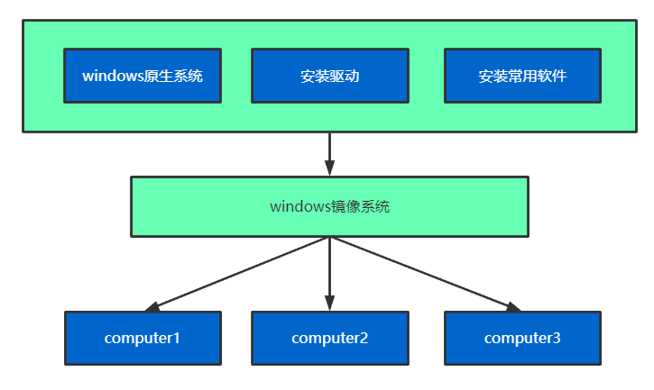
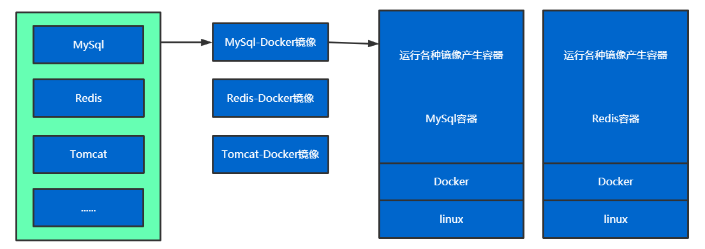
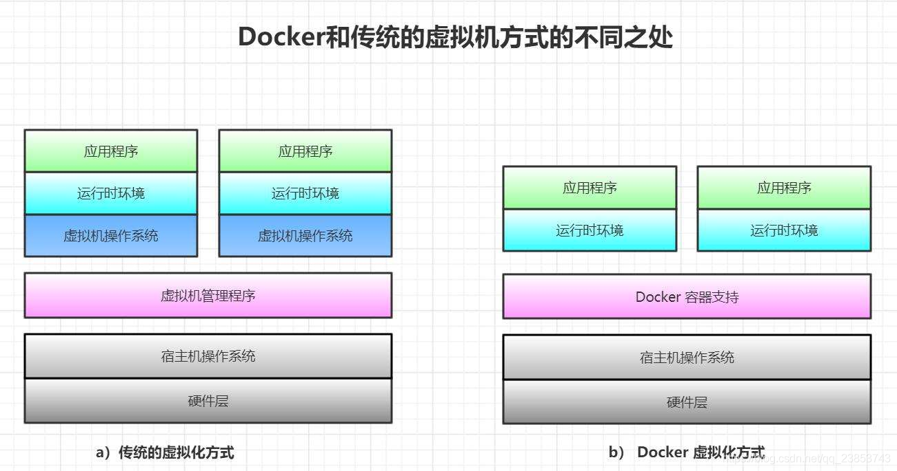
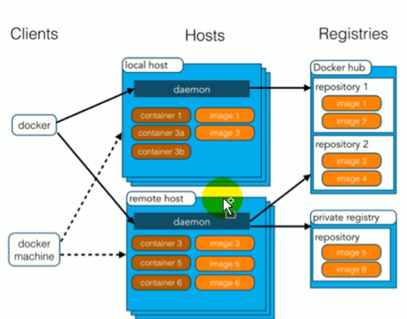
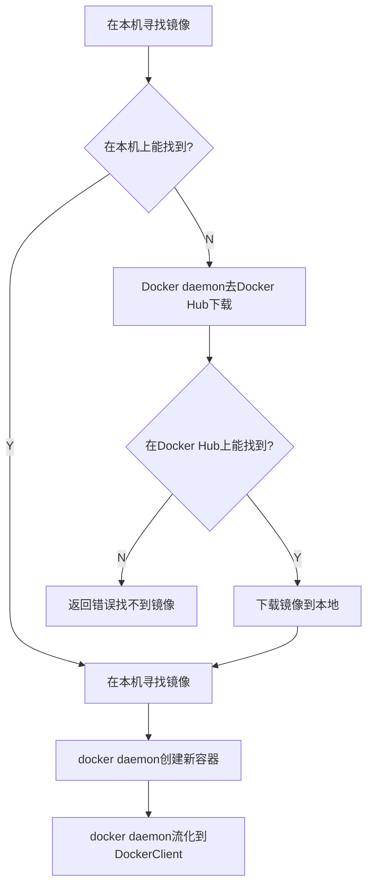
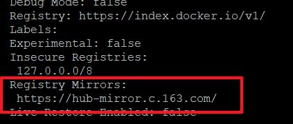
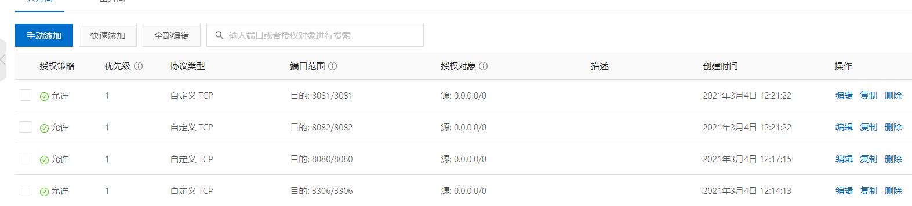
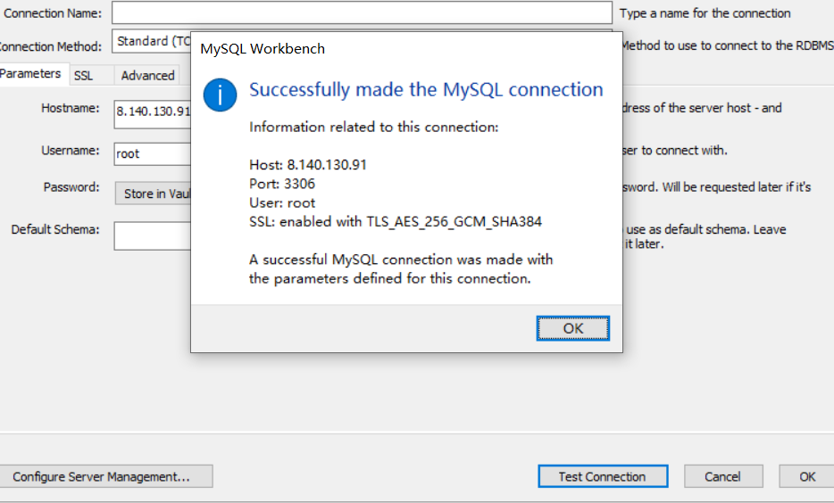

# Docker

@(Container)[2021年3月1日12:48:05]

[TOC]

<div style="page-break-after:always" />

## 简介





**Docker是开源的应用容器引擎**；基于GO语言

**运行中的镜像称为容器**

### Docker思想

**容器是将操作系统层虚拟化，虚拟机则是虚拟化硬件**

容器更多的用于表示 软件的一个标准化单元。由于容器的标准化，因此它可以无视基础设施（Infrastructure）的差异，部署到任何一个地方。另外，Docker也为容器提供更强的业界的隔离兼容



#### Docker和虚拟机技术的区别

>   虚拟机是虚拟化操作系统所需要的一系列硬件，然后运行一个完整的操作系统，在这个操作系统上安装软件和应用
>
>   
>
>   容器直接运行在宿主机的操作系统上，容器没有自己内核及虚拟化一系列硬件
>
>   每个容器间相互隔离，每个容器内都有自己独有的文件系统和运行环境，和其他容器互不影响

#### Docker应用场景

>   Docker让开发者打包其应用及依赖包到一个轻量级，可移植的容器中，然后发布到任何流行的linux机器上，从而实现虚拟化
>
>   Docker支持将软件编译成一个镜像，然后在镜像中对各种软件做好配置，将镜像发布出去，其他使用者可以直接使用这个容器。

1.  Web应用的自动化打包和发布
2.  自动化测试和持续集成，发布
3.  在服务型环境中部署和调整数据库或其他的后台应用
4.  从头编译或扩展现有的平台来搭建自己的PaaS环境

### 核心概念



-   docker主机(Host)		安装了Docker程序的机器(Docker直接安装在操作系统之上)

-   docker客户端(Client) 连接docker主机进行操作
-   docker(Registry) 	   用于保存各种打包好的软件镜像

-   docker镜像(Images)   软件打包好的镜像；放在docker仓库中

-   docker容器(Controller):镜像启动后的实例称为一个容器

**容器是独立运行的一个或一组应用**(环境)

### 使用Docker步骤:

1.  安装Docker
2.  去Docker仓库找到这个软件对应的镜像
3.  使用Docker运行这个镜像，这个镜像会生成一个Docker容器
4.  对容器的启动停止，就是对软件的启动停止

<div style="page-break-after:always" />

## 安装Docker

### 1. 查看Centos版本，Docker要求CentOS系统的内核版本高于3.10

```
[root@iZ2zeg4pktzjhp9h7wt6doZ /]# uname -r
4.18.0-147.5.1.el8_1.x86_64

[root@iZ2zeg4pktzjhp9h7wt6doZ /]#  cat /etc/os-release
VERSION_ID="8"
PLATFORM_ID="platform:el8"
PRETTY_NAME="CentOS Linux 8 (Core)"
ANSI_COLOR="0;31"
CPE_NAME="cpe:/o:centos:centos:8"
HOME_URL="https://www.centos.org/"
BUG_REPORT_URL="https://bugs.centos.org/"

CENTOS_MANTISBT_PROJECT="CentOS-8"
CENTOS_MANTISBT_PROJECT_VERSION="8"
REDHAT_SUPPORT_PRODUCT="centos"
NAME="CentOS Linux"
VERSION="8 (Core)"
ID="centos"
ID_LIKE="rhel fedora"
VERSION_ID="8"
PLATFORM_ID="platform:el8"
PRETTY_NAME="CentOS Linux 8 (Core)"
ANSI_COLOR="0;31"
CPE_NAME="cpe:/o:centos:centos:8"
HOME_URL="https://www.centos.org/"
BUG_REPORT_URL="https://bugs.centos.org/"

CENTOS_MANTISBT_PROJECT="CentOS-8"
CENTOS_MANTISBT_PROJECT_VERSION="8"
REDHAT_SUPPORT_PRODUCT="centos"
REDHAT_SUPPORT_PRODUCT_VERSION="8"
```

### 2. 升级软件包及内核

```
yum update
```

### 3. 安装依赖软件包

```
yum install -y yum-utils
```

### 4. 卸载旧版本

```
yum remove docker \
    docker-client \
    docker-client-latest \
    docker-common \
    docker-latest \
    docker-latest-logrotate \
    docker-logrotate \
    docker-engine
```

### 5. 设置yum镜像仓库

**默认国外可能比较慢：**

```
sudo yum-config-manager \
    --add-repo \
    https://download.docker.com/linux/centos/docker-ce.repo 
```

**可以使用阿里云镜像安装：**

```
yum-config-manager \
--add-repo \
http://mirrors.aliyun.com/docker-ce/linux/centos/docker-ce.repo

Adding repo from: http://mirrors.aliyun.com/docker-ce/linux/centos/docker-ce.repo
```

### 6. 安装docker ce

```
yum install docker-ce docker-ce-cli containerd.io
```

### 7. 启动docker

```
systemctl start docker
```

### 8. 测试运行流程

```
docker run hello-world
```



结果：

```
[root@iZ2zeg4pktzjhp9h7wt6doZ /]# docker run hello-world
Unable to find image 'hello-world:latest' locally
latest: Pulling from library/hello-world
0e03bdcc26d7: Pull complete
Digest: sha256:7e02330c713f93b1d3e4c5003350d0dbe215ca269dd1d84a4abc577908344b30
Status: Downloaded newer image for hello-world:latest

Hello from Docker!
This message shows that your installation appears to be working correctly.

To generate this message, Docker took the following steps:
 1. The Docker client contacted the Docker daemon.
 2. The Docker daemon pulled the "hello-world" image from the Docker Hub.
    (amd64)
 3. The Docker daemon created a new container from that image which runs the
    executable that produces the output you are currently reading.
 4. The Docker daemon streamed that output to the Docker client, which sent it
    to your terminal.

To try something more ambitious, you can run an Ubuntu container with:
 $ docker run -it ubuntu bash

Share images, automate workflows, and more with a free Docker ID:
 https://hub.docker.com/

For more examples and ideas, visit:
 https://docs.docker.com/get-started/
```

### 9. 将docker服务设为开机启动

```shell
systemctl enable docker
```

结果：

```shell
systemctl enable docker

Created symlink /etc/systemd/system/multi-user.target.wants/docker.service → /usr/lib/systemd/system/docker.service.
```

### 10 卸载Docker Engine，CLI和Containerd软件包

```shell
yum remove docker-ce docker-ce-cli containerd.io
```

### 11. 删除Docker默认工作目录

```shell
rm -rf /var/lib/docker
```

### 12. 配置docker镜像加速

国内从 DockerHub 拉取镜像非常慢，此时可以配置镜像加速器。

-   网易：https://hub-mirror.c.163.com/
-   阿里云：https://<你的ID>.mirror.aliyuncs.com
-   七牛云加速器：https://reg-mirror.qiniu.com

#### 阿里云

```shell
mkdir -p /etc/docker

tee /etc/docker/daemon.json <<-'EOF'
{
  "registry-mirrors": ["https://XXXXX.mirror.aliyuncs.com"]
}
EOF

systemctl daemon-reload
systemctl restart docker
```

#### 网易云

```
mkdir -p /etc/docker

tee /etc/docker/daemon.json <<-'EOF'
{
  "registry-mirrors": ["https://hub-mirror.c.163.com/"]
}
EOF

systemctl daemon-reload
systemctl restart docker
```

### 13. 检测是否配置成功

```
docker info
```



<div style="page-break-after:always" />

## 常用操作

### 1. 镜像操作

| 操作 | 命令                                             | 说明                             |
| ---- | ------------------------------------------------ | -------------------------------- |
| 检索 | docker search 关键字<br />如:docker search redis | 去docker hub上检索镜像的详细信息 |
| 拉取 | docker pull 镜像名:tag                           | tag表示版本，默认为latest        |
| 列表 | docker images                                    | 查看所有本地镜像                 |
| 删除 | docker rmi image-id                              | 删除指定的本地镜像               |

[Docker Hub](https://hub.docker.com/search?q=&type=image)

### 2. 容器操作

| 操作     | 命令                                                         | 说明                                                         |
| -------- | ------------------------------------------------------------ | ------------------------------------------------------------ |
| 运行     | docker run -name container-name -d image-name -p host-port:container-port | -name：自定义容器名<br />-d：后台运行<br />image-name：指定镜像模板<br />-p：端口映射 主机端口:容器内端口 |
| 列表     | docker ps                                                    | 查看运行中容器<br />-a：查看所有容器                         |
| 停止     | docker stop container-name/container-id                      | 停止当前运行的容器                                           |
| 启动     | docker start container-name/container-id                     | 启动容器                                                     |
| 删除     | docker rm container-id                                       | 删除指定容器                                                 |
| 容器日志 | docker logs container-id/docker-name                         |                                                              |

```shell
1.  搜索镜像 
docker search tomcat
2.  拉取镜像 
docker pull tomcat
3.  根据镜像启动容器 
docker run --name mytomcat -d tomcat:latest
4.  查看运行中的容器 
docker ps
5.  停止运行中的容器 
docker stop [id]
6.  查看所有的容器(包括已退出)
7.  启动容器 
docker start [id]
8.  删除容器——一定要停止状态 
docker rm [id]
9.  启动一个做了端口映射的tomcat 
docker run -d -p 8088:8080 主机端口:容器内部端口
10. 查看docker 日志
docker logs mytomcat
```

#### TomcatESC公网访问

##### 1. 配置安全组——开放端口



##### 2. 进入容器的文件夹

##### 3. 将webapps.dist修改为webapps

```shell
[root@iZ2zeg4pktzjhp9h7wt6doZ /]# docker exec -it tomcat80 bash
root@45b32efc5bbb:/usr/local/tomcat# ls
BUILDING.txt  CONTRIBUTING.md  LICENSE  NOTICE  README.md  RELEASE-NOTES  RUNNING.txt  bin  conf  lib  logs  native-jni-lib  temp  webapps  webapps.dist  work
root@45b32efc5bbb:/usr/local/tomcat# rm -r webapps
root@45b32efc5bbb:/usr/local/tomcat# mv webapps.dist webapps
```

#### docker——mysql

错误启动

```shell
docker run --name mysql01 -d mysql

#出错
[root@iZ2zeg4pktzjhp9h7wt6doZ ~]# docker ps -a
CONTAINER ID   IMAGE           COMMAND                  CREATED          STATUS                      PORTS                    NAMES
661a9a06a0de   mysql           "docker-entrypoint.s…"   54 seconds ago   Exited (1) 52 seconds ago                            mysql01
bfebea41f6c2   tomcat:latest   "catalina.sh run"        5 hours ago      Up 5 hours                  0.0.0.0:8081->8080/tcp   tomcat81
fde73047e23f   tomcat:latest   "catalina.sh run"        5 hours ago      Up 5 hours                  0.0.0.0:8082->8080/tcp   tomcat82
45b32efc5bbb   tomcat:latest   "catalina.sh run"        6 hours ago      Up 6 hours                  0.0.0.0:8080->8080/tcp   tomcat80
dfc9e2f59780   hello-world     "/hello"                 7 hours ago      Exited (0) 7 hours ago                               intelligent_tharp

#日志
[root@iZ2zeg4pktzjhp9h7wt6doZ ~]# docker logs mysql01
2021-03-04 09:39:47+00:00 [Note] [Entrypoint]: Entrypoint script for MySQL Server 8.0.23-1debian10 started.
2021-03-04 09:39:48+00:00 [Note] [Entrypoint]: Switching to dedicated user 'mysql'
2021-03-04 09:39:48+00:00 [Note] [Entrypoint]: Entrypoint script for MySQL Server 8.0.23-1debian10 started.
2021-03-04 09:39:48+00:00 [ERROR] [Entrypoint]: Database is uninitialized and password option is not specified
        You need to specify one of MYSQL_ROOT_PASSWORD, MYSQL_ALLOW_EMPTY_PASSWORD and MYSQL_RANDOM_ROOT_PASSWORD
//没有指定MySql密码

#正确的命令
//指定密码 + 端口映射
docker run --name mysql01 -p 3306:3306 -e MYSQL_ROOT_PASSWORD=Aa12345+ -d mysql
```



##### mysql配置文件

```shell
docker run --name myMysqlName -v /config/mysql:/etc/mysql/conf.d -e MYSQL_ROOT_PASSWORD=my-secret-pw -d mysql:tag

把主机的/config/mysql文件夹挂在到mysql docker容器的 /etc/mysql/config.d文件夹里
修改mysql配置文件只需要把mysql配置文件放入

#不使用配置文件，在命令中直接指定参数
docker run --name myMysqlName -e MYSQL_ROOT_PASSWORD=my-secret-pw -d mysql:tag --character-set-server=utf8mb4 --collation-server=utf8mb4_unicode_ci
--指定参数
```


