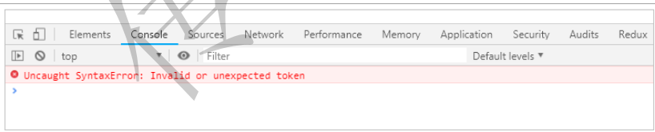
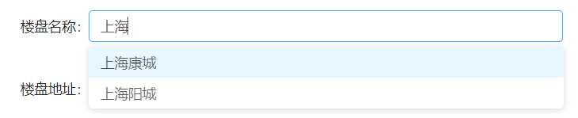

# ReactJS

## ES6新特性

ES6，是ECMAScript 6的简称,JavaScript 的下一代标准，2015 年发布。目标是使JavaScript可用于编写复杂的大型应用程序，称为企业级开发语言。

### ECMAScript

前端的发展历程

>   Web1.0

最初的网页以HTML为主，是纯静态的网页。网页是只读的，信息流只能从服务的到客户端单向流通。**开发人员也只关心页面的样式和内容**即可。

>   Web2.0

-   1995年，网景工程师Brendan Eich 花了10天时间设计了JavaScript语言。

-   1996年，微软发布了JScript，其实是JavaScript的逆向工程实现。

-   1997年，为了统一各种不同script脚本语言，ECMA（欧洲计算机制造商协会）以JavaScript为基础，制定了ECMAscript 标准规范。

    JavaScript和JScript都是 ECMAScript 的标准实现者，随后各大浏览器厂商纷纷实现了ECMAScript 标准。

所以，**ECMAScript是浏览器脚本语言的规范**，而各种我们熟知的js语言，如**JavaScript则是规范的具体实现**

#### ECMAScript的发展历程

-   1998年6月，ECMAScript 2.0 发布

-   1999年12月，ECMAScript 3.0 发布。这时，ECMAScript 规范本身也相对比较完善和稳定了，但是接下来的事情，就比较悲剧了。

-   2007年10月，ECMAScript 4.0 草案发布。

    这次的新规范，历时颇久，规范的新内容也有了很多争议。在制定ES4的时候，是分成了两个工作组同时工作的。  

    -   一边是以 Adobe, Mozilla, Opera 和 Google为主的 ECMAScript 4 工作组
    -   一边是以 Microsoft 和 Yahoo 为主的 ECMAScript 3.1 工作组

    ECMAScript 4 的很多主张比较激进，改动较大。而 ECMAScript 3.1 则主张小幅更新。最终经过 TC39 的会议，决定将一部分不那么激进的改动保留发布为 ECMAScript 3.1，而ES4的内容，则延续到了后来的ECMAScript5和6版本中

-   2009年12月，ECMAScript 5 发布。

-   2011年6月，ECMAScript 5.1 发布。

-   2015年6月，ECMAScript 6，也就是 ECMAScript 2015 发布了。 并且从 ECMAScript 6 开始，开始采用年号来做版本。即 ECMAScript 2015，就是ECMAScript6。  

-   2016年 6月，小幅修订的《ECMAScript 2016标准》 (简称 ES2016)如期发布， 这个版本可以看作是 ES6.1版，因为两者的差异非常小(只新增了数组实例的 includes 方法 和指数运算符)，基本上可以认为是同 一个标准

-   2017 年 6 月发布了ES2017 标准 

因此， ES6 既是一个历史名词，也是一个泛指，含义是 5.1 版本以后的 JavaScript 的下一代 标准，涵盖了 ES2015、ES2016、 ES2017 等，而 ES2015 则是正式名称，特指当年发布的正式版本的语言标准

### let 和 const 命令

>   var

之前，我们写js定义变量的时候，只有一个关键字： `var`
var 有一个问题，就是定义的变量有时会莫名奇妙的成为全局变量  

例如这样的一段代码：

```js
for(var i = 0; i < 5; i++){
	console.log(i);
}
console.log("循环外：" + i)
```

运行结果:


可以看出，在循环外部也可以获取到变量i的值，显然变量i的作用域范围太大了，在做复杂页面时，会带来很大的问题。

>   let

`let` 所声明的变量，只在 let 命令所在的代码块内有效

```js
for(let i = 0; i < 5; i++){
	console.log(i);
}
console.log("循环外：" + i)
```

结果:


这样就把变量的作用域控制在了循环内部

>   const

`const` 声明的变量是常量，不能被修改，类似与java中的 `final` 关键字

```js
const a = 1;
console.log("a = ", a);
//给a重新赋值
a = 2;
console.log("a = ", a);
```


可以看到，变量a的值是不能修改的。  

### 字符串扩展

-   `include()`:返回 boolean，表示是否找到参数字符串

-   `startWith()`：返回 boolean,表示参数字符串是否在原字符串的头部
-   `endWith()`:返回 boolean,表示参数字符串是否在原字符串的尾部

```js
let str = "hello heima";
console.log(str, " 中是否包含了heima => ", str.includes("heima"));
console.log(str, " 中是否包含了baima => ", str.includes("baima"));
console.log(str, " 中是否以h开头 => ", str.startsWith("h"));
console.log(str, " 中是否以a开头 => ", str.startsWith("a"));
console.log(str, " 中是否以a结束 => ", str.endsWith("a"));
console.log(str, " 中是否以h结束 => ", str.endsWith("h"));
```


>   字符串模板

ES6中提供了 ` 来作为字符串模板标记 

```js
let str = `
hello
itheima
itcast
`;
console.log(str);
```


在两个`之间的部分都会被作为字符串的值，可以任意换行  

### ==解构表达式==

什么是解构？

>   ES6中允许按照一定模式从数组和对象中提取值，然后对变量进行赋值，这被称为解构 (Destructuring)  

#### 数组结构

```js
let arr = [1,2,3]
```

之前，我想获取其中的值，只能通过下标

```js
let arr = [1,2,3]
const [x,y,z] = arr;// x，y，z将与arr中的每个位置对应来取值
// 然后打印
console.log(x,y,z);

const [a] = arr; //只匹配1个参数
console.log(a)
```

结果：


#### 对象解构

例如有个Person对象

```js
const person = {
    name: "jack",
    age: 21,
    language: ['java','js','css']
}
```

我们可以这么做:

```js
//解构表达式获取值
const {name,age,language} = person;

//打印
console.log(name)
console.log(age)
console.log(language)
```

结果：


如果想要用其他变量接收，需要额外指定别名：


-   `{name:n}`:name是person中的属性名，冒号后面的n是解构要赋值给的变量。

### 函数优化

#### 函数参数默认值

```js
//ES6以前无法给一个函数参数设置默认值，只能采用变通写法
function add(a,b){
    //判断b是否为空，为空就赋默认值1
    b = b || 1;
    
    return a+b;
}

console.log(add(10));
```

ES6

```js
function add(a,b=1){
    return a+b;
}

//传一个参数
console.log(add(10))
```

#### 箭头函数

一个参数时：

```js
var print = function(obj){
    console.log(obj)
}

//简写为：
var print2 = obj ==> console.log(obj)
```

多个参数：

```js
//两个参数情况:
var sum = function(a,b){
    return a+b;
}

//简写为：
var sum2 = (a,b) ==> a+b;
```

没有参数：

```js
// 没有参数时，需要通过()进行占位，代表参数部分
let sayHello = () => console.log("hello!");
sayHello();
```

代码不止一行，可以用 `{}` 括起来

```js
var sum3 = (a,b) => {
return a + b;
} 

// 多行，没有返回值
let sayHello = () => {
    console.log("hello!");
    console.log("world!");
}

sayHello();
```

#### 对象的函数属性简写

比如一个Person对象，里面有eat方法：

```js
let person = {
    name: "jack",
    // 以前：
    eat: function (food) {
    	console.log(this.name + "在吃" + food);
	},
    // 箭头函数版：
    eat2: food => console.log(person.name + "在吃" + food),
    // 这里拿不到this
    // 简写版：
    eat3(food){
    	console.log(this.name + "在吃" + food);
    }
}
```

#### 箭头函数结合解构表达式

比如有一个函数

```js
const person = {
    name: "jack",
    age: 21,
    language: ['java','js','css']
}

function hello(person){
    console.log("hello," + person.name)
}
```

箭头函数和解构表达式

```js
var hi = ({name}) => console.log("hello"+name);

hi(person)
```

### ==map和reduce==

ES6中，数组新增了map和reduce方法

#### map

`map()`：接受一个函数，将原数据中的所有元素用这个函数处理后放入新数组返回

```js
let arr = ['1','20','-5','3'];
console.log(arr)

let newArr = arr.map(s => parseInt(s));

console.log(newArr)
```


#### reduce

`reduce()`：接收一个函数(必须)和一个初始值(可选)，该函数接收两个参数：

-   第一个参数为上一次 reduce() 处理的结果
-   第二个参数是数组中要处理的下一个元素

`reduce()`会从左到右依此把数组中的元素用reduce处理，并把处理的结果作为下次reduce的第一个参数。如果是第一次，会把前两个元素作为计算参数，或者把用户指定的参数值作为起始参数

```js
const arr = [1,20,-5,3]
```

没有初始值:


指定初始值：


### ==扩展运算符==

(spread)是三个点(...)，将一个数组转为用逗号分隔的参数序列

```js
console.log (...[1, 2, 3]); //1 2 3
console.log(1, ...[2, 3, 4], 5); // 1 2 3 4 5

function add(x, y) {
	return x + y;
} 
var numbers = [1, 2];
console.log(add(...numbers)); // 3

//数组合并
let arr = [...[1,2,3]...[4,5,6]];
console.log(arr);//[1,2,3,4,5,6]

//与解构表达式结合
const [first,...,rest] = [1,2,3,4,5];
console.log(first,rest)//1 [2,3,4,5]

//将字符串转成数组
console.log([...'hello'])//["h","e","l","l","o"]
```

### ==Promise==

所谓Promise，简单说就是一个容器，里面保存着某个未来才会结束的事件（**通常是一个异步操作**）的结果。从语法上说，Promise 是一个对象，从它可以获取异步操作的消息。Promise 提供统一的 API，各种异步操作都可以用同样的方法进行处理  

我们可以通过Promise的构造函数来创建Promise对象，并在内部封装一个异步执行的结果 

如果我们想要等待异步执行完成，做一些事情，我们可以通过promise的then方法来实现 

如果想要处理promise异步执行失败的事件，还可以跟上catch：  

```js
const promise = new Promise(function(resolve, reject) {
    // ... 执行异步操作
    if (/* 异步操作成功 */){
    	resolve(value);// 调用resolve，代表Promise将返回成功的结果
    } else {
    	reject(error);// 调用reject，代表Promise会返回失败结果
    }
});

promise.then(function(value){
	// 异步执行成功后的回调
}).catch(function(error){
	// 异步执行失败后的回调
})
```


### set 和 map


### Class的基本语法

JS传统方法是通过构造函数定义并生成新对象。ES6中引入class，通过`class`关键字自定义类

```js
class User{
	constructor(name, age = 20){ // 构造方法
		this.name = name; // 添加属性并且赋值
		this.age = age;
	} 
    sayHello(){ // 定义方法
		return "hello";
	}
    
    static isAdult(age){ //静态方法
        if(age >= 18){
            return "成年人";
        } 
        return "未成年人";
	}
}

let user = new User("张三");

// 测试
console.log(user); // User {name: "张三", age: 20}
console.log(user.sayHello()); // hello
console.log(User.isAdult(20)); // 成年人
```

类的继承：

```js
class User{
	constructor(name, age = 20){ // 构造方法
		this.name = name; // 添加属性并且赋值
		this.age = age;
	} 
    sayHello(){ // 定义方法
		return "hello";
	}
    
    static isAdult(age){ //静态方法
        if(age >= 18){
            return "成年人";
        } 
        return "未成年人";
	}
}

class zhangsan extends User{
	constructor(){
        super("张三",30);
        //如果父类中构造方法有参数，那么子类必须通过super调用父类的构造方法
    	this.address = "上海"；//设置子类中的属性，位置必须位于super之下
    }
}

// 测试
let zs = new ZhangSan();
console.log(zs.name, zs.address);//张三上海
console.log(zs.sayHello());//hello
console.log(ZhangSan.isAdult(20));//成年人
```

### ==Generator函数==

Generator 函数是 ES6 提供的 一种 **异步** 编程解决方案 。

两个特征：

-   function命令与函数名之间有一个 `*`
-   函数体内部使用 `yield` 语句定义不同的内部状态

```js
function* hello () {
    yield "hello";
    yield "world";
    return "done";
} 

let h = hello();

console.log(h.next()); //{value: "hello", done: false}
console.log(h.next()); //{value: "world", done: false}
console.log(h.next()); //{value: "done", done: true}
console.log(h.next()); //{value: undefined, done: true}
```

可以看到，通过hello()返回的h对象，每调用一次next()方法返回一个对象，该对象包含了value值和done状态。直到遇到return关键字或者函数执行完毕，这个时候返回的状态为ture，表示已经执行结束了 .

#### for...of 循环

通过for...of可以循环遍历Generator函数返回的迭代器  

```js
function* hello () {
    yield "hello";
    yield "world";
    return "done";
} 

let h = hello();
for (let obj of h) {
	console.log(obj);
}

// 输出：
hello
world
```

### ==修饰器==

修饰器(Decorator)是一个函数， 用来修改类的行为。 ES2017 引入了这项功能， 目前 Babel 转码器己经支持

```js
@T //通过@符号进行引用该方法，类似java中的注解
class User {
    constructor(name, age = 20){
    this.name = name;
    this.age = age;
    }
} 

function T(target) { //定义一个普通的方法
    console.log(target); //target对象为修饰的目标对象，这里是User对象
    target.country = "中国"; //为User类添加一个静态属性country
}

console.log(User.country); //打印出country属性值
```

运行报错：



原因是，在ES6中，并没有支持该用法，在ES2017中才有，所以我们不能直接运行了，需要进行编码后再运行。
转码的意思是：将ES6或ES2017转为ES5执行。类似这样：  

```js
//转码前
input.map(item =>item + 1);

//转码后
input.map(function (item) {
return item + 1;
})
```

### 转码器

-   Babel (babeljs.io)是一个广为使用的 ES6 转码器，可以将 ES6 代码转为 ES5 代码，从而在浏览器或其他环境执行  
-   Google 公司的 Traceur 转码器 Cgithub.com/google/traceur-compiler)， 也可 以将 ES6 代码转为ES5的代码

### UmiJS

[官网](https://umijs.org/zh-CN)

**零配置前端构建工具**

特点：

-   插件化
    -   umi的整个生命周期都是插件化的，甚至其内部实现就是由大量插件组成，比如pwa,按需加载，一键切换preact一键兼容ie9等
-   开箱即用
    -   只需安装umi依赖
-   约定式路由
    -   类 next.js 的约定式路由，无需再维护一份冗余的路由配置，支持权限，动态路由，嵌套路由等

#### ==安装部署==

```properties
#首先，需要安装Node.js
#在资料中，找到node-v8.12.0-x64.msi，一路下一步安装
#安装完成后，通过node -v 命令查看其版本号
>node -v
v8.12.0

#接下来，开始安装yarn，其中tyarn使用的是npm.taobao.org的源，速度要快一些
#可以把yarn看做了优化了的npm
#-g 是指全局安装
npm i yarn tyarn -g
#进行测试，如果能够正常输出版本信息则说明安装成功了
tyarn -v 

#如果安装失败，是由于将yarn添加到环境变量中导致

#下面开始安装umi
tyarn global add umi
umi #进行测试
```

#### 快速入门

```js
#通过初始化命令将生成package.json文件，它是 NodeJS 约定的用来存放项目的信息和配置等信息的文件。
tyarn init -y

#通过umi命令创建index.js文件
#可以看到在pages下创建好了index.js和index.css文件
umi g page index 

#将下面内存拷贝到index.js文件中进行测试
@T //通过@符号进行引用该方法，类似java中的注解
class User {
    constructor(name, age = 20){
        this.name = name;
        this.age = age;
	}
}

function T(target) { //定义一个普通的方法
	console.log(target); //target对象为修饰的目标对象，这里是User对象
	target.country = "中国"; //为User类添加一个静态属性country
} 
console.log(User.country); //打印出country属性值

#通过命令行启动umi的后台服务,用于本地开发
umi dev
#通过浏览器进行访问：http://localhost:8000/，查看效果
#值得注意的是，这里访问的是umi的后台服务，不是idea提供服务
```


### 模块化

将代码进行拆分，方便重复利用。类似java中的导包：要使用一个包，必须先导包

模块： `export` 和 `import`

-   `export` ：用于规定模块的对外接口
-   `import`：用于导入其他模块提供的功能

#### export

```js
class Util {
	static sum = (a, b) => a + b;
} 

//导出该类
export default Util;
```

#### import

使用 `export` 定义了模块的对外接口后，其他js文件就可以通过 `import` 命令来加载这个模块

```js
//Index.js
//导入Util类
import Util from './Util'

//使用Util中的sum方法
console.log(Util.sum(1, 2));
```

<div style="page-break-after:always" />

## ReactJS

### 前端开发四个阶段

>   1.  静态页面阶段

在第一个阶段中前端页面都是静态的，所有前端代码和前端数据都是后端生成的，前端纯粹只是增加一些特殊效果。

后端MVC模式

-   Model(模型层)：提供/保持数据
-   Controller(控制层)：数据处理，实现业务逻辑
-   View（视图层）：展示数据，提供用户界面

此时的前端只是后端MVC中的V

>   2.  ajax阶段

2004年AJAX诞生，改变了前端开发。Gmail和Google地图这样革命性产品出现，使前端的作用不再是展示页面，还可以管理数据并与用户互动

>   3.  前端MVC阶段

把MVC模式照搬到了前端，只有 M(读写数据)和V(展示数据)，没有C(处理数据)

有些框架提出 MVVM模式，用View Model代替Controller。Model拿到数据后，View Model将数据处理成视图层(View)需要的格式

>   4.  SPA阶段

前端可以做到读写数据，切换视图，用户交互。网页其实是一个应用程序，而不是信息的纯展示。这种单张网页的应用程序称为SPA

2010年后，前端工程师从开发页面(切模板)，逐渐变成了开发“前端应用”，跑在浏览器里面的应用


目前，流行的前端框架 `Vue`,`React`都属于SPA开发框架

### ReactJS简介


[官网](https://reactjs.org/)

>   **用于构建用户界面的JavaScript框架**，由Facebook开发
>
>   ReactJS把复杂的页面，拆分成一个个的组件，将这些组件拼装起来，就会呈现一个页面

ReactJS可用于MVC、MVVM等架构

#### React框架分类

-   Flux
    -   利用一个单向的数据流补充了React的组合视图组件，更像一种模式而非框架
-   Redux
    -   JS状态容器，提供可预测的状态管理，Redux使**组件状态共享**变得简单
-   Ant Design of React
    -   阿里开源的基于React的企业级后台产品，继承了多种React框架
    -   Ant Design提供了丰富的组件，包括：按钮、表单、表格、布局、分页、树组件、日历等

### Helloworld

#### 1. 新建static web项目


#### ==2. 初始化项目,添加umi依赖==

```shell
tyarn init -y
```


```shell
tyarn add umi --dev
```


#### 3. 编写HelloWorld程序

##### 1. ==在工程的根目录下新建`config/config.js`==

在UmiJS的约定中，config/config.js将作为UmiJS的全局配置文件


在Umi中，约定的目录结构如下:


在config.js文件中输入，以便后面使用：

```js
//导出一个对象，暂时设置为空对象，后面再填充内容
export default{};
```

##### 2. 创建HelloWorld.js页面文件

在Umi中，约定存放页面代码的文件夹在 `src/pages` ，可以通过 `singular:false`来设置单数的命名方式


在HelloWorld.js中输入如下内容：

```js
export default () => {
	return <div>hello world</div>;
}
```

##### 3. ==构建和部署==

我们写的js，必须通过umi先转码后才能正常执行。

```shell
umi build
```


可见打包成功

##### 4. 启动服务，查看页面效果

```shell
# 启动服务
umi dev
```

可以看到，通过 `/HelloWorld` 即可访问到刚写的HelloWorld.js文件

在umi中，可以使用约定式的路由，将在pages下的JS文件都会按照文件名映射到一个路由


##### ==5. 添加 `umi-plugin-react` 插件==

>   umi-plugin-react插件是umi官方基于react封装的插件 

[链接](https://umijs.org/zh-CN/docs/upgrade-to-umi-3)

```shell
#添加插件
tyarn add @umijs/preset-react --dev
```


在config.js中引入该插件

```js
export default{
    dva: {},
    antd: {}
};
```

### 1. JSX语法

>   JSX语法就是，可以在js文件中插入html片段，是React自创的一种语法 
>
>   JSX语法会被Babel等转码工具进行转码，得到正常的js代码再执行

**注意**

1.  所有的html标签必须是闭合的  

2.  在JSX语法中，只能有一个根标签，不能有多个

    ```jsx
    const div1 = <div><div>hello</div> <div>world</div></div>//正确
    const div2 = <div>hello</div> <div>world</div> //错误
    ```

3.  在JSX语法中，如果想要在html标签中插入js脚本，需要通过 `{}` 插入js脚本

    ```jsx
    export default()=>{
        const fun = () =>"黑马程序"
    
        return (
            <div><div>{fun()}</div> <div>hello world</div></div>
        );
    }
    ```

### 2. 组件

#### 自定义组件

```jsx
import React from "react";
//1. 导入React

class HelloWorld extends React.Component{
//2. 继承React.Component
    render(){//3. 重写render()方法，用于渲染页面
        return <div>Hello World</div>
    }
}

//4. 导出该类
export default HelloWorld;
```

#### 导入自定义组件

```jsx
import React from "react";
import HelloWorld from "./HelloWorld";

class Show extends React.Component{
    render() {
        return (
            <div>
                <HelloWorld></HelloWorld>
            </div>
        );
    }
}

export default Show;
```

#### 组件参数

```jsx
import React from "react";
//1. 导入React

class HelloWorld extends React.Component{
//2. 继承React.Component
    render(){//3. 重写render()方法，用于渲染页面
        return (
            <div>
                <div>Hello World</div>
                <div>lastName={this.props.lastName}</div>
                <div>{this.props.children}</div>
            </div>
        );
    }
}

//4. 导出该类
export default HelloWorld;
```

```jsx
import React from "react";
import HelloWorld from "./HelloWorld";

class Show extends React.Component{
    render() {
        return (
            <div>
                <HelloWorld lastName={"Auspice"}>Tian</HelloWorld>
            </div>
        );
    }
}

export default Show;
```


-   属性名：属性传递通过 `this.prop.[]`
-   内容传递：内容传递通过 `this.props.children`

#### 组件的状态

每一个 **页面组件** 都有一个状态，其保存在 `this.state` 中，当状态值发生变化时，React框架会自动调用 `render()` 方法，重新渲染画面

**注意**

-   this.state值的设置要在构造参数中完成，不能直接对 `this.state` 修改
-   要修改this.state的值，需要调用 `this.setState()` 完成

案例：用过点击按钮，不断更新this.state，从而反映到页面

```jsx
import React from "react";

class Test extends React.Component{
    constructor(props) {//构造函数中必须有props参数
        super(props);//调用父类构造方法
        this.state = {//初始化state
            dataList:[1,2,3],
            maxItem:3
        }
    }

    render() {
        return (
            <div>
                <ul>
                    {//遍历值
                        this.state.dataList.map((value, index) => {
                            return <li key={index}>{value}</li>
                        })
                    }
                </ul>
                <button onClick={()=>{//为按钮添加点击事件
                    let maxItem = this.state.maxItem+1;
                    let newArr = [...this.state.dataList,maxItem]
                    this.setState({
                        dataList:newArr,
                        maxItem:maxItem
                    })

                }}>加一</button>
            </div>
        );
    }
}

export default Test;
```


#### 生命周期

组件运行过程中，存在不同的阶段。React为这些阶段提供了钩子方法(生命周期方法lifestyle methods)，允许开发者自定义每个阶段自动执行的函数。


```jsx
import React from 'react'; //第一步，导入React
class LifeCycle extends React.Component {
	constructor(props) {
    super(props);
    //构造方法
    console.log("constructor()");
	} 
    
    componentDidMount() {
        //组件挂载后调用
        console.log("componentDidMount()");
	} 
    
    componentWillUnmount() {
        //在组件从 DOM 中移除之前立刻被调用。
        console.log("componentWillUnmount()");
    } 
    
    componentDidUpdate() {
        //在组件完成更新后立即调用。在初始化时不会被调用。
        console.log("componentDidUpdate()");
    } 
    shouldComponentUpdate(nextProps, nextState){
        // 每当this.props或this.state有变化，在render方法执行之前，就会调用这个方法。
        // 该方法返回一个布尔值，表示是否应该继续执行render方法，即如果返回false，UI 就不会更新，默认返回true。
        // 组件挂载时，render方法的第一次执行，不会调用这个方法。
    	console.log("shouldComponentUpdate()");
    }
    
    render() {
        return (
        <div>
        <h1>React Life Cycle!</h1>
        </div>
        );
	}
} 

export default LifeCycle;
```


### 3. Model

**分层**


服务端系统：

-   Controller负责与用户直接打交道，渲染页面、提供接口等，侧重于展示型逻辑
-   Service负责处理业务逻辑，供Controller层调用
-   DataAccess 层负责与数据源对接，进行纯粹的数据读写，供Service层调用

前端代码结构：

-   Page负责与用户直接打交道：侧重于展示型交互逻辑
    -   渲染页面
    -   接受用户的操作输入
-   Model负责处理业务逻辑，为Page做数据、状态的读写、变换、暂存等
-   Service负责与HTTP接口对接，进行纯粹的数据读写

#### ==使用dva进行数据分层管理==

[dva官网](https://dvajs.com/)

[umi-dva插件](https://umijs.org/zh-CN/plugins/plugin-dva)

>   **@Connect(mapModelToProps,mapDispatcherToProps)**
>
>   ==将model层中数据及函数绑定到page层==

1.  mapModelToProps：
    -   将page层和model层进行连接
    -   返回model中的数据
    -   将返回的数据绑定到this.props中
2.  mapDispatcherToProps
    -   将定义的函数绑定到this.props中
    -   调用model层(reducers)中定义的函数

##### 1. ==引入dva框架==

umi对dva进行了整合，在 **config.js** 中进行配置：

```js
export default {
    dva: {
        immer: true,
        hmr: false,
    },
};
```

##### 2. ==创建model文件==

umi中，约定 `src/models` 文件夹中定义model


```js
export default {
    namespace:'TestData',
    state:{
        dataList:[1,2,3],
        maxItem:3
    }
}
```

##### 3. ==将model层数据导入page层==

```jsx
import React from "react";
import {connect} from "umi";

const namespace = "TestData";

// connect第一个回调函数，作用：将page层和model层进行链接，返回model中的数据
//并将返回到数据绑定到 this.props
@connect((dvaState)=>{
    return {
        dataList:dvaState[namespace].dataList,
        maxItem: dvaState[namespace].maxItem
    }
})
class Test extends React.Component{
    render() {
        return (
            <div>
                <ul>
                    {//遍历值
                        this.props.dataList.map((value, index) => {
                            return <li key={index}>{value}</li>
                        })
                    }
                </ul>
            </div>
            
            ...
            );
    }
}

export default Test;
```

**流程**

1.  umi框架启动，会自动读取**models**目录下文件
2.  @Connect修饰符的第一个参数，接受一个方法，该方法必须返回 `{}(对象)`，将接收到model数据
3.  全局model中，通过 `namespace` 进行区分，所以通过 `state[namespace]` 进行数据获取
4.  返回的数据会被封装到 `this.props` 中，所以通过 `this.props.data` 获取到model中的数据

##### 4. ==更新model中定义的数据==

```js
export default {
    namespace:'TestData',
    state:{
        dataList:[1,2,3],
        maxItem:3
    },
    reducers:{//定义一些函数
        addNewData:function (state){//state为修改前state
            let maxItem = state.maxItem+1;
            let newArr = [...state.dataList,maxItem]
            return {//通过return返回更新后的数据
                dataList:newArr,
                maxItem:maxItem
            }
        }
    }
}
```

```jsx
import React from "react";
import {connect} from "umi";

const namespace = "TestData";

@connect(
    (dvaState)=>{
        return {
            dataList:dvaState[namespace].dataList,
            maxItem: dvaState[namespace].maxItem
        }
    },
    (dvaDispatch)=>{
        //dvaDispatch : 可以调用model层定义的函数
        return{
            add:function(){
                dvaDispatch({
                //通过dvaDispatcher调用model层定义的函数
                //@param : type——指定函数名 
                    //namespace/函数名
                    type:namespace+"/addNewData"
                })
            }
        }
    }
)
class Test extends React.Component{

    render() {
        return (
            <div>
                <ul>{//遍历值
                     this.props.dataList.map((value, index) => {
                         return <li key={index}>{value}</li>
                     })
                }
                </ul>
                <button onClick={()=>{
                    this.props.add();
                }}>加一</button>
            </div>
        );
    }
}

export default Test;
```

**流程**

1.  page层绑定的事件触发 `dvaDispatcher()` 方法执行
2.  调用 `model` 层 `reducers` 中的方法
3.  返回更新后的 `state`
4.  触发 ui更新，调用 `render` 方法

#### ==Model中异步请求数据==

##### 1. 请求工具类

`src/utils` 目录下创建 `request.js` ，用于异步请求数据

```js
function checkStatus(response) {
    if (response.status >= 200 && response.status < 300) {
        return response;
    }

    const error = new Error(response.statusText);
    error.response = response;
    throw error;
}

/**
* Requests a URL, returning a promise.
* @param {string} url The URL we want to request
* @param {object} [options] The options we want to pass to "fetch"
* @return {object} An object containing either "data" or "err"
*/
export default async function request(url, options) {
    const response = await fetch(url, options);
    checkStatus(response);
    return await response.json();
}
```

##### 2. model层中调用异步请求

```js
import request from '../utils/request';

export default {
    namespace:'TestData',
    state:{
        dataList:[],
        maxItem:0
    },
    reducers:{//定义一些函数
        addNewData:function (state,result){
            //state为修改前state,result就是拿到的结果数据
            if(result.data){
            //如果data存在，说明是初始化数据，直接返回
                return result.data;
            }

            let maxItem = state.maxItem+1;
            let newArr = [...state.dataList,maxItem]
            return {//通过return返回更新后的数据
                dataList:newArr,
                maxItem:maxItem
            }
        }
    },
    effects: { //新增effects配置，用于异步加载数据
        *initData(params, sagaEffects) { 
            //*表示 定义异步方法
            const {call, put} = sagaEffects; 
            //获取到call、put方法
            const url = "/ds/list"; // 定义请求的url
            let data = yield call(request, url); //执行请求
            yield put({ // 调用reducers中的方法
                type : "addNewData", //指定方法名
                data : data //传递ajax回来的数据
            });
        }
    }
}
```

##### 3. 修改页面逻辑

```jsx
import React from "react";
import {connect} from "umi";

const namespace = "TestData";

@connect(
    (dvaState)=>{
        return {
            dataList:dvaState[namespace].dataList,
            maxItem: dvaState[namespace].maxItem
        }
    },
    (dvaDispatch)=>{
        return{
            add:function(){
                dvaDispatch({
                    type:namespace+"/addNewData"
                })
            },
            initData:()=>{
                dvaDispatch({
                    type:namespace+"/initData"
                })
            }
        }
    }
)
class Test extends React.Component{
    componentDidMount() {//组件加载完后进行初始化操作
        this.props.initData();
    }

    render() {
        return (
            <div>
                <ul>
                    {//遍历值
                        this.props.dataList.map((value, index) => {
                            return <li key={index}>{value}</li>
                        })
                    }
                </ul>
                <button onClick={()=>{
                    this.props.add();
                }}>加一</button>
            </div>
        );
    }
}

export default Test;
```

测试:


原因：

返回的数据不是json格式，解析出错

##### 4. moke数据

>   Mock 数据是前端开发过程中必不可少的一环，是分离前后端开发的关键链路。通过预先跟服务器端约定好的接口，模拟请求数据甚至逻辑，能够让前端开发独立自主，不会被服务端的开发所阻塞。

umi中支持对请求的模拟

在项目根目录下创建 `mock` 目录，创建 `MockTestData.js` 文件


```js
export default {
    'GET /ds/test': function (req, res) { //模拟请求返回数据
        res.json({//返回
            dataList: [1, 2, 3, 4],
            maxItem: 4
        });
    }
}
```

```js
import request from '../utils/request';

export default {
    namespace:'TestData',
    state:{
        dataList:[],
        maxItem:0
    },
    reducers:{
        addNewData:function (state,result){
            if(result.data){//判断result中的data是否存在，如果存在，说明是初始化数据，直接返回
                /*
                mock: 若响应中的字段名与page层的属性不一致，需要做映射
                return {
                    dataList:result.data.data,
                    maxItem:result.data.maxNum
                }
                */
                return result.data;
            }

            let maxItem = state.maxItem+1;
            let newArr = [...state.dataList,maxItem]
            return {
                dataList:newArr,
                maxItem:maxItem
            }
        }
    },
    effects: { 
        *initData(params, sagaEffects) { 
            const {call, put} = sagaEffects;
            const url = "/ds/test"; 

            let data = yield call(request, url); 
            yield put({ 
                type : "addNewData", 
                data : data 
            });
        }
    }
}
```

#### umi - model 注册

##### model示例

```js
export default {
  namespace: '', // 表示在全局 state 上的 key
  state: {}, // 状态数据
  reducers: {}, // 管理同步方法，必须是纯函数
  effects: {}, // 管理异步操作，采用了 generator 的相关概念
  subscriptions: {}, // 订阅数据源
};
```

##### umi model注册

>   umi中，按照约定的目录 `src/models` 文件夹中被注册为model

model 分两类，一是全局 model，二是页面 model。全局 model 存于 `/src/models/` 目录，所有页面都可引用；页面 model 不能被其他页面所引用。

-   `src/models/**/*.js` 为 global model
-   `src/pages/**/models/**/*.js` 为 page model
-   global model 全量载入，page model 在 production 时按需载入，在 development 时全量载入
-   page model 为 page js 所在路径下 `models/**/*.js` 的文件
-   page model 会向上查找，比如 page js 为 `pages/a/b.js`，他的 page model 为 `pages/a/b/models/**/*.js` + `pages/a/models/**/*.js`，依次类推
-   约定 model.js 为单文件 model，解决只有一个 model 时不需要建 models 目录的问题，有 model.js 则不去找 `models/**/*.js`

<div style="page-break-after:always" />

## AntDesign

### 简介

Ant Design是阿里蚂蚁金服 **基于React开发的UI组件** ，主要用于中后台系统的使用

[官网](https://ant.design/components/overview-cn/)

**特性**

-   🌈 提炼自企业级中后台产品的交互语言和视觉风格。
-   📦 开箱即用的高质量 React 组件。
-   🛡 使用 TypeScript 开发，提供完整的类型定义文件。
-   ⚙️ 全链路开发和设计工具体系。
-   🌍 数十个国际化语言支持。
-   🎨 深入每个细节的主题定制能力。

### ==配置开启antd==

```js
export default {
    dva: {
        immer: true,
        hmr: false,
    },
    antd: {
		
    }
};
```

### Tabs

```js
import React from "react";
import { Tabs } from 'antd';

const { TabPane } = Tabs;

function callback(key) {
    console.log(key);
}

class TabsTest extends React.Component{
    render() {
        return (
            <Tabs defaultActiveKey="1" onChange={callback}>
                <TabPane tab="Tab 1" key="1">
                    Content of Tab Pane 1
                </TabPane>
                <TabPane tab="Tab 2" key="2">
                    Content of Tab Pane 2
                </TabPane>
                <TabPane tab="Tab 3" key="3">
                    Content of Tab Pane 3
                </TabPane>
            </Tabs>
        )
    }
}

export default TabsTest;
```

### 布局

-   Layout:	布局容器，其下可嵌套 `Header` `Sider` `Content` `Footer` 或 `Layout` 本身，可以放在任何父容器中。
-   Header:   顶部布局，自带默认样式，其下可嵌套任何元素，只能放在 `Layout` 中
-   Sider   :   侧边栏，自带默认样式及基本功能，其下可嵌套任何元素，只能放在 `Layout` 中
-   Content:   内容部分，自带默认样式，其下可嵌套任何元素，只能放在 `Layout`中
-   Footer ：  底部布局，自带默认样式，其下可嵌套任何元素，只能放在 `Layout` 中  

#### 搭建整体框架+子页面使用布局

在 **src目录** 下创建layouts目录，并且在 **layouts目录** 下创建 **index.js** 文件  


默认的全局路径由 **/umi/core/routes.ts ** 配置

```js
import React from 'react'
import { Layout } from 'antd';

const { Header, Footer, Sider, Content } = Layout;

class BasicLayout extends React.Component{
    render(){
        return (
            <Layout>
                <Sider>Sider</Sider>
                <Layout>
                    <Header>Header</Header>
                    <Content>{this.props.children}</Content>
                    <Footer>Footer</Footer>
                </Layout>
            </Layout>
        );
    }
}

export default BasicLayout;
```


#### 自定义配置布局路由

>   若进行路由配置，表明通过 **手动配置** 的方式进行访问页面，不采用umi默认的路由方式
>
>   -   `routes` 以 **src/pages** 为根目录
>   -   采用手动配置则所有的页面路由均需要手动配置

**config.js**

```js
export default {
    dva: {
        immer: true,
        hmr: false,
    },
    antd: {

    },
    routes: [{
        path: '/',
        component: '../../BasicLayout.js', //配置布局路由
        routes:[
            {
                path: '/test',
                component:'./test'
            },
            {
                path: './tabstest',
                component:'./tabstest'
            }
        ]
    }]
};
```


#### 页面美化

```js
import React from 'react'
import { Layout } from 'antd';

const { Header, Footer, Sider, Content } = Layout;

class BasicLayout extends React.Component{
    render(){
        return (
            <Layout>
                <Sider width={256} style={{ minHeight: '100vh', color: 'white' }}>
                    Sider
                </Sider>
                <Layout>
                    <Header style={{ background: '#fff', textAlign: 'center', padding: 0 }}>Header</Header>
                    <Content style={{ margin: '24px 16px 0' }}>
                        <div style={{ padding: 24, background: '#fff', minHeight: 360 }}>
                            {this.props.children}
                        </div>
                    </Content>
                    <Footer style={{ textAlign: 'center' }}>后台系统 ©2018 Created by 黑马程序员</Footer>
                </Layout>
            </Layout>
        );
    }
}

export default BasicLayout;
```

### 导航菜单

#### 安装图标组件包

```shell
npm install --save @ant-design/icons
```

```jsx
import React from 'react'
import { Layout, Menu} from 'antd';
import {PieChartOutlined, DesktopOutlined, InboxOutlined, AppstoreOutlined, MailOutlined} from '@ant-design/icons'

const { Header, Footer, Sider, Content } = Layout;
const SubMenu = Menu.SubMenu;

class BasicLayout extends React.Component{
    constructor(props){
        super(props);
        this.state = {
            collapsed: false,
        }
    }
    render(){
        return (
            <Layout>
                <Sider width={256} style={{ minHeight: '100vh', color: 'white' }}>
                    <div style={{ height: '32px', background: 'rgba(255,255,255,.2)', margin: '16px'}}/>
                    <Menu
                        defaultSelectedKeys={['2']}
                        defaultOpenKeys={['sub1']}
                        mode="inline"
                        theme="dark"
                        inlineCollapsed={this.state.collapsed}
                    >
                        <Menu.Item key="1">
                            <PieChartOutlined />
                            <span>Option 1</span>
                        </Menu.Item>
                        <Menu.Item key="2">
                            <DesktopOutlined />
                            <span>Option 2</span>
                        </Menu.Item>
                        <Menu.Item key="3">
                            <InboxOutlined />
                            <span>Option 3</span>
                            传智播客
                        </Menu.Item>
                        <SubMenu key="sub1" title={<span><MailOutlined /><span>Navigation One</span></span>}>
                            <Menu.Item key="5">Option 5</Menu.Item>
                            <Menu.Item key="6">Option 6</Menu.Item>
                            <Menu.Item key="7">Option 7</Menu.Item>
                            <Menu.Item key="8">Option 8</Menu.Item>
                        </SubMenu>
                        <SubMenu key="sub2" title={<span><AppstoreOutlined /><span>Navigation Two</span></span>}>
                            <Menu.Item key="9">Option 9</Menu.Item>
                            <Menu.Item key="10">Option 10</Menu.Item>
                            <SubMenu key="sub3" title="Submenu">
                                <Menu.Item key="11">Option 11</Menu.Item>
                                <Menu.Item key="12">Option 12</Menu.Item>
                            </SubMenu>
                        </SubMenu>
                    </Menu>
                </Sider>

                <Layout>
                    <Header style={{ background: '#fff', textAlign: 'center', padding: 0 }}>Header</Header>
                    <Content style={{ margin: '24px 16px 0' }}>
                        <div style={{ padding: 24, background: '#fff', minHeight: 360 }}>
                            {this.props.children}
                        </div>
                    </Content>
                    <Footer style={{ textAlign: 'center' }}>后台系统 ©2018 Created by 黑马程序员</Footer>
                </Layout>
            </Layout>
        );
    }
}

export default BasicLayout;
```

#### 导航添加链接

 在 **src/pages/user** 下创建 **UserAdd.js** 和 **UserList.js** 文件，用于模拟实现新增用户和查询用户列表功能


```jsx
import React from 'react';

//UserAdd.js
class UserAdd extends React.Component{
    render() {
        return (
            <div>新增用户</div>
        )
    }
}

export default UserAdd;

import React from 'react';

* ./utils in ./node_modules/jest-config/build/ts3.4/index.d.ts
UserList.js
class UserList extends React.Component{
    render() {
        return (
            <div>用户列表</div>
        )
    }
}

export default UserList;
```

**若是手动配置路由，则需要修改路由配置**

```js
export default {
    dva: {
        immer: true,
        hmr: false,
    },
    antd: {

    },
    routes: [{
        path: '/',
        component: '../../BasicLayout.js', //配置布局路由
        routes:[
            {
                path: '/test',
                component:'./test'
            },
            {
                path: '/tabstest',
                component:'./tabstest'
            },
            {
                path: '/user',
                routes: [
                    {
                        path: '/user/add',
                        component: './user/UserAdd'
                    },
                    {
                        path: '/user/list',
                        component: './user/UserList'
                    }
                ]
            }
        ]
    }]
};
```

**注意**

>   使用了umi的link标签，目的是出现记录点击的菜单 

```jsx
import React from 'react'
import { Layout, Menu} from 'antd';
import {UserOutlined} from '@ant-design/icons';
import {Link} from 'umi';

const { Header, Footer, Sider, Content } = Layout;
const SubMenu = Menu.SubMenu;

class BasicLayout extends React.Component{
    constructor(props){
        super(props);
        this.state = {
            collapsed: false,
        }
    }
    render(){
        return (
            <Layout>
                <Sider width={256} style={{ minHeight: '100vh', color: 'white' }}>
                    <div style={{ height: '32px', background: 'rgba(255,255,255,.2)', margin: '16px'}}/>
                    <Menu
                        defaultSelectedKeys={['2']}
                        defaultOpenKeys={['sub1']}
                        mode="inline"
                        theme="dark"
                        inlineCollapsed={this.state.collapsed}
                    >
                        <SubMenu key="sub1" title={<span><UserOutlined /><span>用户管理</span></span>}>
                            <Menu.Item key="1"><Link to={"/user/add"}>新增用户</Link></Menu.Item>
                            <Menu.Item key="2"><Link to={"/user/list"}>用户列表</Link></Menu.Item>
                        </SubMenu>
                    </Menu>
                </Sider>

                <Layout>
                    <Header style={{ background: '#fff', textAlign: 'center', padding: 0 }}>Header</Header>
                    <Content style={{ margin: '24px 16px 0' }}>
                        <div style={{ padding: 24, background: '#fff', minHeight: 360 }}>
                            {this.props.children}
                        </div>
                    </Content>
                    <Footer style={{ textAlign: 'center' }}>后台系统 ©2018 Created by 黑马程序员</Footer>
                </Layout>
            </Layout>
        );
    }
}

export default BasicLayout;
```


### 表格

[表格文档](https://ant.design/components/table-cn/)

#### 基本用法

```jsx
import React from 'react'
import {Table, Divider, Tag, Pagination } from 'antd';

const {Column} = Table;

const data = [
    {
        key: '1',
        name: '张三',
        age: 32,
        address: '上海市',
        tags: ['程序员', '帅气'],
    }, {
        key: '2',
        name: '李四',
        age: 42,
        address: '北京市',
        tags: ['屌丝'],
    }, {
        key: '3',
        name: '王五',
        age: 32,
        address: '杭州市',
        tags: ['高富帅', '富二代'],
    }];

class UserList extends React.Component {
    render() {
        return (
            <div>
                <Table dataSource={data} pagination= {{position:"bottom",total:500,pageSize:10, defaultCurrent:3}}>
                    <Column title="姓名" dataIndex="name" key="name" />
                    <Column title="年龄" dataIndex="age" key="age" />
                    <Column title="地址" dataIndex="address" key="address" />
                    <Column title="标签" dataIndex="tags" key="tags"
                        render={tags => (
                            <span>{tags.map(tag => <Tag color="blue" key= {tag}>{tag}</Tag>)} </span>
                        )}
                    />
                    <Column  title="操作" key="action"
                        render={(text, record) => (
                            <span>
                                <a href="javascript:;">编辑</a>
                                <Divider type="vertical"/>
                                <a href="javascript:;">删除</a>
                            </span>
                        )}
                    />
                </Table>
            </div>
        );
    }
}

export default UserList;
```


#### 数据分离到model

##### 1. 新建model层

```js
import request from "../utils/request";

export default {
    namespace: 'userList',
    state: {
        list: []
    },
    reducers: {
        queryList(state, result) {
            let data = [...result.data];
            return { //更新状态值
                list: data
            }
        }
    },
    effects: {
        *initData(params, sagaEffects) {
            const {call, put} = sagaEffects;
            const url = "/ds/user/list";
            let data = yield call(request, url);
            yield put({
                type : "queryList",
                data : data
            });
        }
    }
}
```

##### 2. mock数据

```js
export default {
    'GET /ds/user/list': function (req, res) {
        res.json([{
            key: '1',
            name: '张三1',
            age: 32,
            address: '上海市',
            tags: ['程序员', '帅气'],
        }, {
            key: '2',
            name: '李四',
            age: 42,
            address: '北京市',
            tags: ['屌丝'],
        }, {
            key: '3',
            name: '王五',
            age: 32,
            address: '杭州市',
            tags: ['高富帅', '富二代'],
        }]);
    }
}
```

##### 3. 修改UserList.jsx逻辑

```jsx
import request from "../utils/request";

export default {
    namespace: 'userList',
    state: {
        list: []
    },
    reducers: {
        queryList(state, result) {
            let data = [...result.data];
            return { //更新状态值
                list: data
            }
        }
    },
    effects: {
        *initData(params, sagaEffects) {
            const {call, put} = sagaEffects;
            const url = "/ds/user/list";
            let data = yield call(request, url);
            yield put({
                type : "queryList",
                data : data
            });
        }
    }
}
```


##### 4. 新增请求

```jsx
import React from 'react'
import {Table, Divider, Tag, Pagination } from 'antd';
import {connect} from 'dva';

const {Column} = Table;
const namespace = 'userList'

@connect(
    (state)=>{
        return {
            data: state[namespace].list
        }
    },
    (dispatch=>{
        return{
            initData: ()=>{
                dispatch({
                    type: namespace+'/initData'
                })
            }
        }
    })
)
class UserList extends React.Component {

    componentDidMount() {
        this.props.initData();
    }

    render() {
        return (
            <div>
                <Table dataSource={this.props.data} pagination= {{position:"bottom",total:500,pageSize:10, defaultCurrent:3}}>
                    <Column title="姓名" dataIndex="name" key="name" />
                    <Column title="年龄" dataIndex="age" key="age" />
                    <Column title="地址" dataIndex="address" key="address" />
                    <Column title="标签" dataIndex="tags" key="tags"
                        render={tags => (
                            <span>{tags.map(tag => <Tag color="blue" key= {tag}>{tag}</Tag>)} </span>
                        )}
                    />
                    <Column  title="操作" key="action"
                        render={(text, record) => (
                            <span>
                                <a href="javascript:;">编辑</a>
                                <Divider type="vertical"/>
                                <a href="javascript:;">删除</a>
                            </span>
                        )}
                    />
                </Table>
            </div>
        );
    }
}

export default UserList;
```


<div style="page-break-after:always" />

## Ant Design Pro

### 简介


[源码地址](https://github.com/ant-design/ant-design-pro)

Ant Design Pro 是基于 Ant Design 和 umi 的封装的一整套企业级中后台前端/设计解决方案，致力于在设计规范和基础组件的基础上，继续向上构建，提炼出典型模板/业务组件/配套设计资源，进一步提升企业级中后台产品设计研发过程中的『用户』和『设计者』的体验。

### ==部署和安装==

#### 1. 下载源码&解压


**AntDesign Pro目录**

```
├── config 			#umi 配置，包含路由，构建等配置
├── mock 			#本地模拟数据
├── public
│ └── favicon.png 	# Favicon
├── src
│ ├── assets 		# 本地静态资源
│ ├── components 	# 业务通用组件
│ ├── e2e 			# 集成测试用例
│ ├── layouts 		# 通用布局
│ ├── models 		# 全局 dva model
│ ├── pages 		# 业务页面入口和常用模板
│ ├── services 		# 后台接口服务
│ ├── utils 		# 工具库
│ ├── locales 		# 国际化资源
│ ├── global.less 	# 全局样式
│ └── global.js 	# 全局 JS
├── tests 			# 测试工具
├── README.md
└──package.json
```

#### 2. 导入


#### 3. 初始化及启动

```shell
tyarn install #安装相关依赖
tyarn start #启动服务
```

### 菜单和路由

在 pro 中，菜单和路由，在 `config/router.config.js` 中进行管理


可见， pro 提供两套路由，分别是 `/user` 和 `/app` 


由路由配置可见，登录成功后，会跳转到 `/dashboard`


#### **菜单是由路由的配置生成的**

>   验证

```js
// new
{
    path: '/new',
        name: 'new',
            icon: 'user',
                routes: [
                    {
                        path: '/new/analysis',
                        name: 'analysis',
                        component: './Dashboard/Analysis',
                    },
                    {
                        path: '/new/monitor',
                        name: 'monitor',
                        component: './Dashboard/Monitor',
                    },
                    {
                        path: '/new/workplace',
                        name: 'workplace',
                        component: './Dashboard/Workplace',
                    },
                ],
},
```


#### 在国际化文件中配置文字


```js
'menu.new': 'New Dashboard',
    'menu.new.analysis': 'New 分析页',
    'menu.new.monitor': 'New 监控页',
    'menu.new.workplace': 'New 工作台',
```


### 新增页面

在 `src/pages` 中，以功能为单元创建目录

```jsx
import React from "react";

// eslint-disable-next-line react/prefer-stateless-function
class NewAnalysis extends React.Component{
  render() {
    return(
      <div>New Analysis</div>
    )
  }
}

export default NewAnalysis;
```

修改路由配置

```js
// new
      {
        path: '/new',
        name: 'new',
        icon: 'user',
        routes: [
          {
            path: '/new/analysis',
            name: 'analysis',
            component: './New/NewAnalysis',
          },
          {
            path: '/new/monitor',
            name: 'monitor',
            component: './Dashboard/Monitor',
          },
          {
            path: '/new/workplace',
            name: 'workplace',
            component: './Dashboard/Workplace',
          },
        ],
      },
```


### Pro中model执行流程


#### 路由即菜单


-   在TableList.js中，组件加载完成后进行加载数据 
-   在 `StandardTable` 中，使用Table组件生成表格，其中数据源是 `data` 
-   TableList.js中，data数据从 `构造方法` 中获取到  
-   this.props中的 `rule` 数据，是通过 `@connect` 修饰器获取  
-   数据从 `models/rule.js` 中获取
-   `queryRule` 是在 `/services/api` 中进行了定义 
-   数据的mock是在 `mock/rule.js` 中完成  


<div style="page-break-after:always" />

## 后台的前端搭建

### 创建工程

### 导入依赖

```shell
tyarn install #安装相关依赖
tyarn start #启动服务
```

#### 修改logo和footer信息


可见，布局是由layout常量定义

##### logo

可见，左侧的菜单是自定义组件

```jsx
{isTop && !isMobile ? null : (
    <SiderMenu
        logo={logo}
        Authorized={Authorized}
        theme={navTheme}
        onCollapse={this.handleMenuCollapse}
        menuData={menuData}
        isMobile={isMobile}
        {...this.props}
        />
)}

//导入
import SiderMenu from '@/components/SiderMenu';
```

打开/components/SideMenu文件

```jsx
return (
      <Sider
        trigger={null}
        collapsible
        collapsed={collapsed}
        breakpoint="lg"
        onCollapse={onCollapse}
        width={256}
        theme={theme}
        className={siderClassName}
      >
        <div className={styles.logo} id="logo">
          <Link to="/">
          	//设置logo的位置
          	<h1>好客租房 · 后台</h1>
          </Link>
        </div>
        <BaseMenu
          {...this.props}
          mode="inline"
          handleOpenChange={this.handleOpenChange}
          onOpenChange={this.handleOpenChange}
          style={{ padding: '16px 0', width: '100%', overflowX: 'hidden' }}
          {...defaultProps}
        />
      </Sider>
    );
```

##### footer

在Footer.js文件中修改版权信息

```jsx
import React, { Fragment } from 'react';
import { Layout, Icon } from 'antd';
import GlobalFooter from '@/components/GlobalFooter';

const { Footer } = Layout;
const FooterView = () => (
  <Footer style={{ padding: 0 }}>
    <GlobalFooter
      copyright={
        <Fragment>
          Copyright <Icon type="copyright" /> 2021 Auspice Tian
        </Fragment>
      }
    />
  </Footer>
);
export default FooterView;
```

### 左侧菜单

**路由即菜单**

修改默认页 `router.config.js`


修改locale `locales=>zh-CN=>settings.js`


**只有在路由中的命名空间才会被注册** **命名空间名唯一**

### 新增房源

#### 房源表单字段

##### 楼盘数据（estate）

| 字段            |   类型   |   备注   |
| :-------------- | :------: | :------: |
| id              |   Long   |  楼盘id  |
| name            |  String  | 楼盘名称 |
| province        |  String  |  所在省  |
| city            |  String  |  所在市  |
| area            |  String  |  所在区  |
| address         |  String  | 具体地址 |
| year            |  String  | 建筑年代 |
| type            |  String  | 建筑类型 |
| propertyCost    |  String  |  物业费  |
| propertyCompany |  String  | 物业公司 |
| developers      |  String  |  开发商  |
| created         | datetime | 创建时间 |
| updated         | datetime | 更新时间 |

##### 房源数据（houseResources）

| 字段             | 类型     | 备注                                                         |
| ---------------- | -------- | ------------------------------------------------------------ |
| id               | Long     | 房源id                                                       |
| title            | String   | 房源标题，如：南北通透，两室朝南，主卧带阳台                 |
| estateId         | Long     | 楼盘id                                                       |
| buildingNum      | String   | 楼号（栋）                                                   |
| buildingUnit     | String   | 单元号                                                       |
| buildingFloorNum | String   | 门牌号                                                       |
| rent             | int      | 租金                                                         |
| rentMethod       | int      | 租赁方式，1-整租，2-合租                                     |
| paymentMethod    | int      | 支付方式，1-付一押一，2-付三押一，3-付六押一，4-年付押一，5-其它 |
| houseType        | String   | 户型，如：2室1厅1卫                                          |
| coveredArea      | String   | 建筑面积                                                     |
| useArea          | String   | 使用面积                                                     |
| floor            | String   | 楼层，如：8/26                                               |
| orientation      | int      | 朝向：东、南、西、北                                         |
| decoration       | String   | 装修，1-精装，2-简装，3-毛坯                                 |
| facilities       | String   | 配套设施， 如：1,2,3                                         |
| pic              | String   | 图片，最多5张                                                |
| desc             | String   | 房源描述，如：出小区门，门口有时代联华超市，餐饮有川菜馆，淮南牛肉汤，黄焖鸡沙县小吃等；可到达亲水湾城市生活广场，里面有儿童乐园，台球室和康桥健身等休闲娱乐；生活广场往北沿御水路往北步行一公里就是御桥路，旁边就是御桥地铁站，地铁站商场... |
| contact          | String   | 联系人                                                       |
| mobile           | String   | 手机号                                                       |
| time             | int      | 看房时间，1-上午，2-中午，3-下午，4-晚上，5-全天             |
| propertyCost     | String   | 物业费                                                       |
| created          | datetime | 创建时间                                                     |
| updated          | datetime | 更新时间                                                     |

#### antd表单组件

[官网链接](https://ant.design/components/form-cn/#%E4%BD%95%E6%97%B6%E4%BD%BF%E7%94%A8)

高性能表单控件，自带数据域管理。包含`数据录入`、`校验` 以及对应 `样式` 与 `API` 。

[API](https://ant.design/components/form-cn/#API)

被设置了 `name` 属性的 `Form.Item` 包装的控件，表单控件会自动添加 `value`（或 `valuePropName` 指定的其他属性） `onChange`（或 `trigger` 指定的其他属性），数据同步将被 Form 接管，这会导致以下结果：

1.  你**不再需要也不应该**用 `onChange` 来做数据收集同步（你可以使用 Form 的 `onValuesChange`），但还是可以继续监听 `onChange` 事件。
2.  你不能用控件的 `value` 或 `defaultValue` 等属性来设置表单域的值，默认值可以用 Form 里的 `initialValues` 来设置。注意 `initialValues` 不能被 `setState` 动态更新，你需要用 `setFieldsValue` 来更新。
3.  你不应该用 `setState`，可以使用 `form.setFieldsValue` 来动态改变表单值。

在 rules的参数中，可以增加校验规则

```
{
	initialValue:'1',
	rules:[{ 
		required: true, 
		message:"此项为必填项" 
	}]
}
```

#### 表单提交

表单的提交通过submit按钮完成，通过onSubmit方法进行拦截处理  

```jsx
<FormItem {...submitFormLayout} style={{ marginTop: 32 }}>
    <Button type="primary" htmlType="submit" loading={submitting}>
        <FormattedMessage id="form.submit" />
    </Button>
    <Button style={{ marginLeft: 8 }}>
        <FormattedMessage id="form.save" />
    </Button>
</FormItem>
```

```jsx
<Form onSubmit={this.handleSubmit} hideRequiredMark style={{ marginTop: 8 }}>
```

```js
handleSubmit = e => {
    const { dispatch, form } = this.props;
    e.preventDefault();
    console.log(this.state.fileList);
    form.validateFieldsAndScroll((err, values) => {
        
        if (!err) {
            //对设施进行处理
            //1,2,3,4
            //水,电,煤气/天然气,暖气
            if(values.facilities){
                values.facilities = values.facilities.join(",");
            }
            // 3/20
            // 第三层、总共20层
            if(values.floor_1 && values.floor_2){
                values.floor = values.floor_1 + "/" + values.floor_2;
            }
		
            //3室1厅2卫1厨有阳台
            values.houseType = values.houseType_1 + "室" + values.houseType_2 + "厅"
                + values.houseType_3 + "卫" + values.houseType_4 + "厨"
                + values.houseType_2 + "阳台";
            delete values.floor_1;
            delete values.floor_2;
            delete values.houseType_1;
            delete values.houseType_2;
            delete values.houseType_3;
            delete values.houseType_4;
            delete values.houseType_5;

            dispatch({
                type: 'form/submitRegularForm',
                payload: values,
            });
        }
    });
};
```


#### 自动完成

[文档](https://ant.design/components/auto-complete-cn/)

**效果**




**实现**

```jsx
<AutoComplete
    style={{ width: '100%' }}
    dataSource={this.state.estateDataSource}
    placeholder="搜索楼盘"
    onSelect={(value, option)=>{
        let v = estateMap.get(value);
        this.setState({
            estateAddress: v.substring(v.indexOf('|')+1),
            estateId : v.substring(0,v.indexOf('|'))
        });
    }}
    onSearch={this.handleSearch}
    filterOption={(inputValue, option) => option.props.children.toUpperCase().indexOf(inputValue.toUpperCase()) !== -1}
    />

const estateMap = new Map([
  ['中远两湾城','1001|上海市,上海市,普陀区,远景路97弄'],
  ['上海康城','1002|上海市,上海市,闵行区,莘松路958弄'],
  ['保利西子湾','1003|上海市,上海市,松江区,广富林路1188弄'],
  ['万科城市花园','1004|上海市,上海市,闵行区,七莘路3333弄2区-15区'],
  ['上海阳城','1005|上海市,上海市,闵行区,罗锦路888弄']
]);

// 通过onSearch进行动态设置数据源，这里使用的数据是静态数据
handleSearch = (value)=>{
	let arr = new Array();
	if(value.length > 0 ){
		estateMap.forEach((v, k) => {
			if(k.startsWith(value)){
                arr.push(k);
            }
        });
	}
    this.setState({
        estateDataSource: arr
    });
} ;

// 通过onSelect设置，选择中楼盘数据后，在楼盘地址中填写地址数据
onSelect={(value, option)=>{
	let v = estateMap.get(value);
	this.setState({
        estateAddress: v.substring(v.indexOf('|')+1),
        estateId : v.substring(0,v.indexOf('|'))
	});
}}
```

### 上传图片

图片上传通过自定义组件 `PicturesWall` 完成，在PictureWall中，通过 antd 的 `Upload` 组件实现

**如何解决子组件的值传递到父组件**


-   bind方法可以将子组件(PicturesWall)中的this指向父组件(HousingAdd)的this
    -   在子组件中调用父组件的方法相当于在父组件的上下文中调用该方法，所以该函数的参数在父组件的上下文中也可以获取到
-   父组件通过属性的方式进行引用子组件  ，在子组件中，通过 `this.props` 获取传入的函数，进行调用，即可将数据传递到父组件中

#### this——函数执行时上下文

>    this 的值是在执行的时候才能确认，定义的时候不能确认！

**this 是执行上下文环境的一部分**，而执行上下文需要在代码执行之前确定，而不是定义的时候

```js
var obj = {
    getThis: function() {
        console.log(this);
    }
};

obj.getThis();

var getThisCopy = obj.getThis;

getThisCopy();
```


#### bind

绑定函数，使其无论怎么样调用都用相同的上下文环境

fun.bind(thisArgument, argument1, argument2, ...)

-   thisArgument：在 fun 函数运行时的 this 值，如果绑定函数时使用 new 运算符构造的，则该值将被忽略。

```js
var obj = {
    num: 100,
    numFun: function() {
        console.log(this.num);
    }
};

var numFunCopy = obj.numFun;

numFunCopy();
```


在 `Window` 上下文中，没有 num 值，num的值是在 `obj` 中定义的

所以引入 `bind()` 解决 this 不能够指向原来的问题

```js
var obj = {
    num: 100,
    numFun: function(){
        console.log(this.num);
    }

}

var numFunCopy = obj.numFun;

obj.numFun();

numFunCopy.bind(obj)();
```


​	