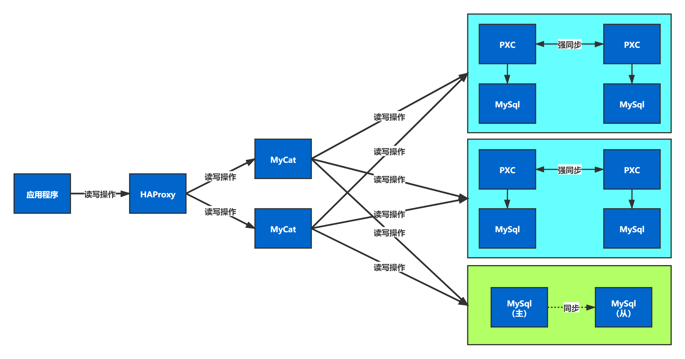

# 部署

## 部署架构


### 部署计划

在实际项目中，在部署上线前对服务进行盘点，然后根据用户数和并发数，对需要的服务器进行统计，然后采购服务器，最后实施部署。

两台服务器：腾讯云（1核2G 50G）：82.157.25.57，阿里云（2核4G 40G）8.140.130.91

```shell
# 查看cpu状态
top
#查看CPU
1

# 查看内存
free -m

# 查看磁盘容量
df -h
```

jdk1.8.0_151

## Mysql



### 规划

| 服务         | 角色    | 端口                | 服务器       | 容器名       |
| ------------ | ------- | ------------------- | ------------ | ------------ |
| MySQL-node01 | pxc     | 13306               | 8.140.130.91 | pxc_node1    |
| MySQL-node02 | pxc     | 13307               | 8.140.130.91 | pxc_node2    |
| MySQL-node03 | pxc     | 13308               | 8.140.130.91 | pxc_node3    |
| MySQL-node04 | pxc     | 13309               | 8.140.130.91 | pxc_node4    |
| MySQL-node05 | master  | 13310               | 82.157.25.57 | ms_node1     |
| MySQL-node06 | slave   | 13311               | 82.157.25.57 | ms_node2     |
| MyCat-node01 | mycat   | 11986，18068，19068 | 82.157.25.57 | mycat_node01 |
| MyCat-node02 | mycat   | 11987，18069，19069 | 8.140.130.91 | mycat_node02 |
| HAProxy      | haproxy | 4001，4002          | 82.157.25.57 | haproxy      |

### 部署PXC集群——阿里云

```shell
#创建数据卷（存储路径：/var/lib/docker/volumes）
docker volume create haoke-v1
docker volume create haoke-v2
docker volume create haoke-v3
docker volume create haoke-v4

#拉取镜像
docker pull percona/percona-xtradb-cluster:5.7
docker tag percona/percona-xtradb-cluster:5.7 pxc

#创建网络
docker network create --subnet=172.30.0.0/24 pxc-network
# 查看网络信息
docker network ls
```

```shell
#集群1，第一节点
docker create -p 13306:3306 -v haoke-v1:/var/lib/mysql -e MYSQL_ROOT_PASSWORD=root -e CLUSTER_NAME=pxc --name=pxc_node1 --net=pxc-network --ip=172.30.0.2 pxc
#第二节点（增加了CLUSTER_JOIN参数）
docker create -p 13307:3306 -v haoke-v2:/var/lib/mysql -e MYSQL_ROOT_PASSWORD=root -e CLUSTER_NAME=pxc --name=pxc_node2 -e CLUSTER_JOIN=pxc_node1 --net=pxc-network --ip=172.30.0.3 pxc

#集群2
#第一节点
docker create -p 13308:3306 -v haoke-v3:/var/lib/mysql -e MYSQL_ROOT_PASSWORD=root -e CLUSTER_NAME=pxc --name=pxc_node3 --net=pxc-network --ip=172.30.0.4 pxc
#第二节点（增加了CLUSTER_JOIN参数）
docker create -p 13309:3306 -v haoke-v4:/var/lib/mysql -e MYSQL_ROOT_PASSWORD=root -e CLUSTER_NAME=pxc --name=pxc_node4 -e CLUSTER_JOIN=pxc_node3 --net=pxc-network --ip=172.30.0.5 pxc

# 查看集群节点
show status like 'wsrep_cluster%';
```


#### 宕机重启配置

```
[ERROR] WSREP: It may not be safe to bootstrap the cluster from this node. It was not the last one to leave the cluster and may not contain all the updates. To force cluster bootstrap with this node, edit the grastate.dat file manually and set safe_to_bootstrap to 1 .
```

手动编辑grastate.dat文件，并将safe_to_bootstrap参数设置为1

```
# GALERA saved state
version: 2.1
uuid:    a4a9e18a-b7e4-11eb-98b8-0b4f06fa70b2
seqno:   -1
safe_to_bootstrap: 0
```

### 部署MS集群——腾讯云

#### master

```shell
#创建数据卷（存储路径：/var/lib/docker/volumes）
docker volume create haoke-v5
docker volume create haoke-v6

#master
mkdir /data/mysql/haoke-master01/conf -p
cd /data/mysql/haoke-master01/conf
vim my.cnf

#输入如下内容
[mysqld]
log-bin=mysql-bin #开启二进制日志
server-id=1 #服务id，不可重复
sql_mode='STRICT_TRANS_TABLES,NO_ZERO_IN_DATE,NO_ZERO_DATE,ERROR_FOR_DIVISION_BY_ZERO,NO_AUTO_CREATE_USER,NO_ENGINE_SUBSTITUTION'
binlog_format=MIXED

#创建容器
docker create --name ms_node1 -v haoke-v5:/var/lib/mysql -v /data/mysql/haoke/master01/conf:/etc/my.cnf.d -p 13310:3306 -e MYSQL_ROOT_PASSWORD=root percona:5.7.23

#启动
docker start ms_node1 && docker logs -f ms_node1
#创建同步账户以及授权
create user 'haoke'@'%' identified by 'haoke';
grant replication slave on *.* to 'haoke'@'%';
flush privileges;
#查看master状态
show master status;
```


#### slave

```shell
#slave
mkdir /data/mysql/haoke-slave01/conf -p
cd /data/mysql/haoke-slave01/conf
vim my.cnf

#输入如下内容
---
[mysqld]
server-id=2 #服务id，不可重复
sql_mode='STRICT_TRANS_TABLES,NO_ZERO_IN_DATE,NO_ZERO_DATE,ERROR_FOR_DIVISION_BY_ZERO,NO_AUTO_CREATE_USER,NO_ENGINE_SUBSTITUTION'
---

#创建容器
docker create --name ms_node2 -v haoke-v6:/var/lib/mysql -v /data/mysql/haoke-slave01/conf:/etc/my.cnf.d -p 13311:3306 -e MYSQL_ROOT_PASSWORD=root percona:5.7.23

#启动
docker start ms_node2 && docker logs -f ms_node2

#设置master相关信息
---
CHANGE MASTER TO
    master_host='82.157.25.57',
    master_user='haoke',
    master_password='haoke',
    master_port=13310,
    master_log_file='mysql-bin.000001',
    master_log_pos=154;
---

#启动同步
start slave;

#查看master状态
show slave status;
```


### 部署MyCat

[Mycat-server-1.6.7.6-release-20210303094759](http://dl.mycat.org.cn/1.6.7.6/20210303094759/)

解压

#### mycat01——腾讯云

##### server.xml

```xml
<?xml version="1.0" encoding="UTF-8"?>
<!DOCTYPE mycat:server SYSTEM "server.dtd">
<mycat:server xmlns:mycat="http://io.mycat/">
    <system>
        <property name="nonePasswordLogin">0</property>
        <property name="useHandshakeV10">1</property>
        <property name="useSqlStat">0</property>
        <property name="useGlobleTableCheck">0</property>
        <property name="sequnceHandlerType">2</property>
        <property name="subqueryRelationshipCheck">false</property>
        <property name="processorBufferPoolType">0</property>
        <property name="handleDistributedTransactions">0</property>
        <property name="useOffHeapForMerge">1</property>
        <property name="memoryPageSize">64k</property>
        <property name="spillsFileBufferSize">1k</property>
        <property name="useStreamOutput">0</property>
        <property name="systemReserveMemorySize">384m</property>
        <property name="useZKSwitch">false</property>
        <!--设置服务端口以及管理端口-->
        <property name="serverPort">18068</property>
        <property name="managerPort">19068</property>
    </system>
    <!--这里是设置 Mycat 用户mycat 和虚拟逻辑库-->
    <user name="mycat" defaultAccount="true">
        <property name="password">mycat</property>
        <property name="schemas">haoke</property>
    </user>
</mycat:server>
```

##### schema.xml

```xml
<?xml version="1.0"?>
<!DOCTYPE mycat:schema SYSTEM "schema.dtd">
<mycat:schema xmlns:mycat="http://io.mycat/">
    <!--配置数据表-->
    <schema name="haoke" checkSQLschema="false" sqlMaxLimit="100">
        <table name="tb_house_resources" dataNode="dn1,dn2" rule="mod-long" />
        <table name="tb_ad" dataNode="dn3"/>
    </schema>
    <!--配置分片关系-->
    <dataNode name="dn1" dataHost="cluster1" database="haoke" />
    <dataNode name="dn2" dataHost="cluster2" database="haoke" />
    <dataNode name="dn3" dataHost="cluster3" database="haoke" />
    <!--配置连接信息-->
    <dataHost name="cluster1" maxCon="1000" minCon="10" balance="2"
              writeType="1" dbType="mysql" dbDriver="native" switchType="1"
              slaveThreshold="100">
        <heartbeat>select user()</heartbeat>
        <writeHost host="W1" url="8.140.130.91:13306" user="root"
                   password="root">
            <readHost host="W1R1" url="8.140.130.91:13307" user="root"
                      password="root" />
        </writeHost>
    </dataHost>
    <dataHost name="cluster2" maxCon="1000" minCon="10" balance="2"
              writeType="1" dbType="mysql" dbDriver="native" switchType="1"
              slaveThreshold="100">
        <heartbeat>select user()</heartbeat>
        <writeHost host="W2" url="8.140.130.91:13308" user="root"
                   password="root">
            <readHost host="W2R1" url="8.140.130.91:13309" user="root"
                      password="root" />
        </writeHost>
    </dataHost>
    <dataHost name="cluster3" maxCon="1000" minCon="10" balance="3"
              writeType="1" dbType="mysql" dbDriver="native" switchType="1"
              slaveThreshold="100">
        <heartbeat>select user()</heartbeat>
        <writeHost host="W3" url="82.157.25.57:13310" user="root"
                   password="root">
            <readHost host="W3R1" url="82.157.25.57:13311" user="root"
                      password="root" />
        </writeHost>
    </dataHost>
</mycat:schema>
```

##### rule.xml

```xml
<function name="mod-long" class="io.mycat.route.function.PartitionByMod">
	<property name="count">2</property>
</function>
```

##### wrapper.conf  

```shell
#设置jmx端口
wrapper.java.additional.6=-Dcom.sun.management.jmxremote.port=11986
```

##### 启动测试

```shell
cd bin

./mycat console
./startup_nowrap.sh && tail -f ../logs/mycat.log
```

```mysql
CREATE TABLE `tb_ad` (
    `id` bigint(20) NOT NULL AUTO_INCREMENT,
    `type` int(10) DEFAULT NULL COMMENT '广告类型',
    `title` varchar(100) DEFAULT NULL COMMENT '描述',
    `url` varchar(200) DEFAULT NULL COMMENT '图片URL地址',
    `created` datetime DEFAULT NULL,
    `updated` datetime DEFAULT NULL,
    PRIMARY KEY (`id`)
) ENGINE=InnoDB AUTO_INCREMENT=5 DEFAULT CHARSET=utf8 COMMENT='广告表';

CREATE TABLE `tb_house_resources` (
    `id` bigint(20) NOT NULL AUTO_INCREMENT,
    `title` varchar(100) DEFAULT NULL COMMENT '房源标题',
    `estate_id` varchar(255) DEFAULT NULL COMMENT '楼盘id',
    `building_num` varchar(5) DEFAULT NULL COMMENT '楼号（栋）',
    `building_unit` varchar(5) DEFAULT NULL COMMENT '单元号',
    `building_floor_num` varchar(5) DEFAULT NULL COMMENT '门牌号',
    `rent` int(10) DEFAULT NULL COMMENT '租金',
    `rent_method` tinyint(1) DEFAULT NULL COMMENT '租赁方式，1-整租，2-合租',
    `payment_method` tinyint(1) DEFAULT NULL COMMENT '支付方式，1-付一押一，2-付三押一，3-付六押一，4-年付押一，5-其它',
    `house_type` varchar(255) DEFAULT NULL COMMENT '户型，如：2室1厅1卫',
    `covered_area` varchar(10) DEFAULT NULL COMMENT '建筑面积',
    `use_area` varchar(10) DEFAULT NULL COMMENT '使用面积',
    `floor` varchar(10) DEFAULT NULL COMMENT '楼层，如：8/26',
    `orientation` varchar(2) DEFAULT NULL COMMENT '朝向：东、南、西、北',
    `decoration` tinyint(1) DEFAULT NULL COMMENT '装修，1-精装，2-简装，3-毛坯',
    `facilities` varchar(50) DEFAULT NULL COMMENT '配套设施， 如：1,2,3',
    `pic` varchar(1000) DEFAULT NULL COMMENT '图片，最多5张',
    `house_desc` varchar(200) DEFAULT NULL COMMENT '描述',
    `contact` varchar(10) DEFAULT NULL COMMENT '联系人',
    `mobile` varchar(11) DEFAULT NULL COMMENT '手机号',
    `time` tinyint(1) DEFAULT NULL COMMENT '看房时间，1-上午，2-中午，3-下午，4-晚上，5-全天',
    `property_cost` varchar(10) DEFAULT NULL COMMENT '物业费',
    `created` datetime DEFAULT NULL,
    `updated` datetime DEFAULT NULL,
    PRIMARY KEY (`id`)
) ENGINE=InnoDB AUTO_INCREMENT=10 DEFAULT CHARSET=utf8 COMMENT='房源表';
```

#### mycat02——阿里云

##### server.xml

```xml
<?xml version="1.0" encoding="UTF-8"?>
<!DOCTYPE mycat:server SYSTEM "server.dtd">
<mycat:server xmlns:mycat="http://io.mycat/">
    <system>
        <property name="nonePasswordLogin">0</property>
        <property name="useHandshakeV10">1</property>
        <property name="useSqlStat">0</property>
        <property name="useGlobleTableCheck">0</property>
        <property name="sequnceHandlerType">2</property>
        <property name="subqueryRelationshipCheck">false</property>
        <property name="processorBufferPoolType">0</property>
        <property name="handleDistributedTransactions">0</property>
        <property name="useOffHeapForMerge">1</property>
        <property name="memoryPageSize">64k</property>
        <property name="spillsFileBufferSize">1k</property>
        <property name="useStreamOutput">0</property>
        <property name="systemReserveMemorySize">384m</property>
        <property name="useZKSwitch">false</property>
        <!--设置服务端口以及管理端口-->
        <property name="serverPort">18069</property>
        <property name="managerPort">19069</property>
    </system>
    <!--这里是设置 Mycat 用户mycat 和虚拟逻辑库-->
    <user name="mycat" defaultAccount="true">
        <property name="password">mycat</property>
        <property name="schemas">haoke</property>
    </user>
</mycat:server>
```

##### schema.xml

```xml
<?xml version="1.0"?>
<!DOCTYPE mycat:schema SYSTEM "schema.dtd">
<mycat:schema xmlns:mycat="http://io.mycat/">
    <!--配置数据表-->
    <schema name="haoke" checkSQLschema="false" sqlMaxLimit="100">
        <table name="tb_house_resources" dataNode="dn1,dn2" rule="mod-long" />
        <table name="tb_ad" dataNode="dn3"/>
    </schema>
    <!--配置分片关系-->
    <dataNode name="dn1" dataHost="cluster1" database="haoke" />
    <dataNode name="dn2" dataHost="cluster2" database="haoke" />
    <dataNode name="dn3" dataHost="cluster3" database="haoke" />
    <!--配置连接信息-->
    <dataHost name="cluster1" maxCon="1000" minCon="10" balance="2"
              writeType="1" dbType="mysql" dbDriver="native" switchType="1"
              slaveThreshold="100">
        <heartbeat>select user()</heartbeat>
        <writeHost host="W1" url="8.140.130.91:13306" user="root"
                   password="root">
            <readHost host="W1R1" url="8.140.130.91:13307" user="root"
                      password="root" />
        </writeHost>
    </dataHost>
    <dataHost name="cluster2" maxCon="1000" minCon="10" balance="2"
              writeType="1" dbType="mysql" dbDriver="native" switchType="1"
              slaveThreshold="100">
        <heartbeat>select user()</heartbeat>
        <writeHost host="W2" url="8.140.130.91:13308" user="root"
                   password="root">
            <readHost host="W2R1" url="8.140.130.91:13309" user="root"
                      password="root" />
        </writeHost>
    </dataHost>
    <dataHost name="cluster3" maxCon="1000" minCon="10" balance="3"
              writeType="1" dbType="mysql" dbDriver="native" switchType="1"
              slaveThreshold="100">
        <heartbeat>select user()</heartbeat>
        <writeHost host="W3" url="82.157.25.57:13310" user="root"
                   password="root">
            <readHost host="W3R1" url="82.157.25.57:13311" user="root"
                      password="root" />
        </writeHost>
    </dataHost>
</mycat:schema>
```

##### rule.xml

```xml
<function name="mod-long" class="io.mycat.route.function.PartitionByMod">
	<property name="count">2</property>
</function>
```

##### wrapper.conf

```shell
vim wrapper.conf

#设置jmx端口
wrapper.java.additional.6=-Dcom.sun.management.jmxremote.port=11987
```

##### 启动

```shell
cd bin

./mycat console
./startup_nowrap.sh && tail -f ../logs/mycat.log
```

#### 创建表及测试

```mysql
INSERT INTO `tb_ad` (`id`, `type`, `title`, `url`, `created`, `updated`) 
VALUES ('1','1', 'UniCity万科天空之城', 'https://haoke-1257323542.cos.ap-beijing.myqcloud.com/ad-swipes/5.jpg', '2021-05-17 11:28:49','2021-05-17 11:28:51');

INSERT INTO `tb_ad` (`id`, `type`, `title`, `url`, `created`, `updated`) 
VALUES ('2','1', '天和尚海庭前', 'https://haoke-1257323542.cos.ap-beijing.myqcloud.com/ad-swipes/2.jpg', '2021-05-17 11:29:27','2021-05-17 11:29:29');

INSERT INTO `tb_ad` (`id`, `type`, `title`, `url`, `created`, `updated`) 
VALUES ('3','1', '[奉贤 南桥] 光语著', 'https://haoke-1257323542.cos.ap-beijing.myqcloud.com/ad-swipes/3.jpg', '2021-05-17 11:30:04','2021-05-17 11:30:06');

INSERT INTO `tb_ad` (`id`, `type`, `title`, `url`, `created`, `updated`) 
VALUES ('4','1', '[上海周边 嘉兴] 融创海逸长洲', 'https://haoke-1257323542.cos.ap-beijing.myqcloud.com/ad-swipes/4.jpg', '2021-05-17 11:30:49','2021-05-17 11:30:53');
```


### 创建HAProxy

```shell
docker pull haproxy:1.9.3

#创建目录，用于存放配置文件
mkdir /haoke/haproxy -p

#创建容器
docker create --name haproxy --net host -v /root/haoke/haproxy:/usr/local/etc/haproxy haproxy:1.9.3
```

```shell
#创建文件
vim /haoke/haproxy/haproxy.cfg

#输入如下内容
global
    log 127.0.0.1 local2
    maxconn 4000
    daemon
    
defaults
	mode	http
	log 	global
	option	 httplog
	option 	dontlognull
	option 	http-server-close
	option 	forwardfor except 127.0.0.0/8
	option 	redispatch
	retries 	3
	timeout 	http-request 10s
	timeout 	queue 1m
	timeout 	connect 10s
	timeout 	client 1m
	timeout 	server 1m
	timeout 	http-keep-alive 10s
	timeout 	check 10s
	maxconn 	3000
	
listen admin_stats
	bind 	0.0.0.0:4001
	mode 	http
	stats	 uri /dbs
	stats	 realm Global\ statistics
	stats	 auth admin:admin
	
listen proxy-mysql
	bind 0.0.0.0:4002
	mode tcp
	balance roundrobin
	option tcplog
	#代理mycat服务
		server mycat_1 82.157.25.57:18068 check port 18068 maxconn 2000
		server mycat_2 8.140.130.91:18069 check port 18069 maxconn 2000
```

```shell
#启动容器
docker restart haproxy && docker logs -f haproxy
```

### 测试

```mysql
INSERT INTO `TB_HOUSE_RESOURCES` (`id`, `title`, `estate_id`, `building_num`,`building_unit`, `building_floor_num`, `rent`, `rent_method`, `payment_method`,`house_type`, `covered_area`, `use_area`, `floor`, `orientation`, `decoration`,`facilities`, `pic`, `house_desc`, `contact`, `mobile`, `time`, `property_cost`,`created`, `updated`) 
VALUES ('1', '东方曼哈顿 3室2厅 16000元', '1005', '2', '1', '1','1111', '1', '1', '1室1厅1卫1厨1阳台', '2', '2', '1/2', '南', '1', '1,2,3,8,9', NULL, '这个经纪人很懒，没写核心卖点', '张三', '11111111111', '1', '11', '2018-11-16 01:16:00','2018-11-16 01:16:00');

INSERT INTO `TB_HOUSE_RESOURCES` (`id`, `title`, `estate_id`, `building_num`,`building_unit`, `building_floor_num`, `rent`, `rent_method`, `payment_method`,`house_type`, `covered_area`, `use_area`, `floor`, `orientation`, `decoration`,`facilities`, `pic`, `house_desc`, `contact`, `mobile`, `time`, `property_cost`,`created`, `updated`) 
VALUES ('2', '康城 3室2厅1卫', '1002', '1', '2', '3', '2000', '1','2', '3室2厅1卫1厨2阳台', '100', '80', '2/20', '南', '1', '1,2,3,7,6', NULL, '拎包入住','张三', '18888888888', '5', '1.5', '2018-11-16 01:34:02', '2018-11-16 01:34:02');
=====
INSERT INTO `TB_HOUSE_RESOURCES` (`id`, `title`, `estate_id`, `building_num`,`building_unit`, `building_floor_num`, `rent`, `rent_method`, `payment_method`,`house_type`, `covered_area`, `use_area`, `floor`, `orientation`, `decoration`,`facilities`, `pic`, `house_desc`, `contact`, `mobile`, `time`, `property_cost`,`created`, `updated`) 
VALUES ('3', '2', '1002', '2', '2', '2', '2', '1', '1', '1室1厅1卫1厨1阳台', '22', '11', '1/5', '南', '1', '1,2,3', NULL, '11', '22', '33', '1', '3','2018-11-16 21:15:29', '2018-11-16 21:15:29');

INSERT INTO `TB_HOUSE_RESOURCES` (`id`, `title`, `estate_id`, `building_num`,`building_unit`, `building_floor_num`, `rent`, `rent_method`,`payment_method`,`house_type`, `covered_area`, `use_area`, `floor`, `orientation`, `decoration`,`facilities`, `pic`, `house_desc`, `contact`, `mobile`, `time`, `property_cost`,`created`, `updated`) 
VALUES ('4', '11', '1002', '1', '1', '1', '1', '1', '1', '1室1厅1卫1厨1阳台', '11', '1', '1/1', '南', '1', '1,2,3', NULL, '11', '1', '1', '1', '1','2018-11-16 21:16:50', '2018-11-16 21:16:50');

INSERT INTO `TB_HOUSE_RESOURCES` (`id`, `title`, `estate_id`, `building_num`,`building_unit`, `building_floor_num`, `rent`, `rent_method`, `payment_method`,`house_type`, `covered_area`, `use_area`, `floor`, `orientation`, `decoration`,`facilities`, `pic`, `house_desc`, `contact`, `mobile`, `time`, `property_cost`,`created`, `updated`)
VALUES ('5', '最新修改房源5', '1002', '1', '1', '1', '3000', '1','1', '1室1厅1卫1厨1阳台', '80', '1', '1/1', '南', '1', '1,2,3', 'http://itcast-haoke.osscn-qingdao.aliyuncs.com/images/2018/12/04/15439353467987363.jpg,http://itcasthaoke.oss-cn-qingdao.aliyuncs.com/images/2018/12/04/15439354795233043.jpg', '11', '1','1', '1', '1', '2018-11-16 21:17:02', '2018-12-04 23:05:19');

INSERT INTO `TB_HOUSE_RESOURCES` (`id`, `title`, `estate_id`, `building_num`,`building_unit`, `building_floor_num`, `rent`, `rent_method`, `payment_method`,`house_type`, `covered_area`, `use_area`, `floor`, `orientation`, `decoration`,`facilities`, `pic`, `house_desc`, `contact`, `mobile`, `time`, `property_cost`,`created`, `updated`) 
VALUES ('6', '房源标题', '1002', '1', '1', '11', '1', '1', '1', '1室1厅1卫1厨1阳台', '11', '1', '1/1', '南', '1', '1,2,3', 'http://itcast-haoke.oss-cnqingdao.aliyuncs.com/images/2018/11/16/15423743004743329.jpg,http://itcast-haoke.osscn-qingdao.aliyuncs.com/images/2018/11/16/15423743049233737.jpg', '11', '2', '2', '1','1', '2018-11-16 21:18:41', '2018-11-16 21:18:41');

INSERT INTO `TB_HOUSE_RESOURCES` (`id`, `title`, `estate_id`, `building_num`,`building_unit`, `building_floor_num`, `rent`, `rent_method`,`payment_method`,`house_type`, `covered_area`, `use_area`, `floor`, `orientation`, `decoration`,`facilities`, `pic`, `house_desc`, `contact`, `mobile`, `time`, `property_cost`,`created`, `updated`) 
VALUES ('7', '房源标题', '1002', '1', '1', '11', '1', '1', '1', '1室1厅1卫1厨1阳台', '11', '1', '1/1', '南', '1', '1,2,3', 'http://itcast-haoke.oss-cnqingdao.aliyuncs.com/images/2018/11/16/15423743004743329.jpg,http://itcast-haoke.osscn-qingdao.aliyuncs.com/images/2018/11/16/15423743049233737.jpg', '11', '2', '2', '1','1', '2018-11-16 21:18:41', '2018-11-16 21:18:41');

INSERT INTO `TB_HOUSE_RESOURCES` (`id`, `title`, `estate_id`, `building_num`,`building_unit`, `building_floor_num`, `rent`, `rent_method`, `payment_method`,`house_type`, `covered_area`, `use_area`, `floor`, `orientation`, `decoration`,`facilities`, `pic`, `house_desc`, `contact`, `mobile`, `time`, `property_cost`,`created`, `updated`)
VALUES ('8', '3333', '1002', '1', '1', '1', '1', '1', '1', '1室1厅1卫1厨1阳台', '1', '1', '1/1', '南', '1', '1,2,3', 'http://itcast-haoke.oss-cnqingdao.aliyuncs.com/images/2018/11/17/15423896060254118.jpg,http://itcast-haoke.osscn-qingdao.aliyuncs.com/images/2018/11/17/15423896084306516.jpg', '1', '1', '1', '1','1', '2018-11-17 01:33:35', '2018-12-06 10:22:20');

INSERT INTO `TB_HOUSE_RESOURCES` (`id`, `title`, `estate_id`, `building_num`,`building_unit`, `building_floor_num`, `rent`, `rent_method`, `payment_method`,`house_type`, `covered_area`, `use_area`, `floor`, `orientation`, `decoration`,`facilities`, `pic`, `house_desc`, `contact`, `mobile`, `time`, `property_cost`,`created`, `updated`) 
VALUES ('9', '康城 精品房源2', '1002', '1', '2', '3', '1000', '1','1', '1室1厅1卫1厨1阳台', '50', '40', '3/20', '南', '1', '1,2,3', 'http://itcasthaoke.oss-cnqingdao.aliyuncs.com/images/2018/11/30/15435106627858721.jpg,http://itcast-haoke.osscn-qingdao.aliyuncs.com/images/2018/11/30/15435107119124432.jpg', '精品房源', '李四','18888888888', '1', '1', '2018-11-21 18:31:35', '2018-11-30 00:58:46');
```

## Redis集群

redis采用2主2从的架构

### 规划

| 服务         | 端口 | 服务器       | 容器名       |
| ------------ | ---- | ------------ | ------------ |
| Redis-node01 | 6379 | 8.140.130.91 | redis-node01 |
| Redis-node02 | 6380 | 8.140.130.91 | redis-node02 |
| Redis-node03 | 6381 | 8.140.130.91 | redis-node03 |
| Redis-node04 | 6382 | 82.157.25.57 | redis-node04 |
| Redis-node05 | 6383 | 82.157.25.57 | redis-node05 |
| Redis-node06 | 6384 | 82.157.25.57 | redis-node06 |

### 阿里云

```shell
docker volume create redis-node01
docker volume create redis-node02
docker volume create redis-node03

#创建容器
docker create --name redis-node01 --net host -v redis-node01:/data redis:5.0.2 --cluster-enabled yes --cluster-config-file nodes-node-01.conf --port 6379 --cluster-announce-ip 8.140.130.91 --cluster-announce-bus-port 16379

docker create --name redis-node02 --net host -v redis-node02:/data redis:5.0.2 --cluster-enabled yes --cluster-config-file nodes-node-02.conf --port 6380 --cluster-announce-ip 8.140.130.91 --cluster-announce-bus-port 16380

docker create --name redis-node03 --net host -v redis-node03:/data redis:5.0.2 --cluster-enabled yes --cluster-config-file nodes-node-03.conf --port 6381 --cluster-announce-ip 8.140.130.91 --cluster-announce-bus-port 16381

# 启动容器
docker start redis-node01 redis-node02
```

### 腾讯云

```shell
docker volume create redis-node04
docker volume create redis-node05
docker volume create redis-node06

#创建容器
docker create --name redis-node04 --net host -v redis-node04:/data redis:5.0.2 --cluster-enabled yes --cluster-config-file nodes-node-04.conf --port 6382 --cluster-announce-bus-port 16382 --cluster-announce-ip 82.157.25.57

docker create --name redis-node05 --net host -v redis-node05:/data redis:5.0.2 --cluster-enabled yes --cluster-config-file nodes-node-03.conf --port 6383 --cluster-announce-bus-port 16383 --cluster-announce-ip 82.157.25.57

docker create --name redis-node06 --net host -v redis-node06:/data redis:5.0.2 --cluster-enabled yes --cluster-config-file nodes-node-03.conf --port 6384 --cluster-announce-bus-port 16384 --cluster-announce-ip 82.157.25.57

# 启动容器
docker start redis-node05 redis-node06
```

### 测试

```shell
#进入redis-node01容器进行操作
docker exec -it redis-node01 /bin/bash

redis-cli --cluster create 8.140.130.91:6379 8.140.130.91:6380 8.140.130.91:6381 82.157.25.57:6382 82.157.25.57:6383 82.157.25.57:6384 --cluster-replicas 1
```


```shell
# 测试
redis-cli -c

# 是否能ping通
ping

# 查看集群节点信息
CLUSTER NODES
```


>   redis 3.x先主后从
>   redis 5.x 随机选主从


## 部署ElastisSearch集群

Elasticsearch集群部署3个节点的集群

### 规划

| 服务      | 端口       | 服务器       | 容器名    |
| --------- | ---------- | ------------ | --------- |
| es-node01 | 9200，9300 | 8.140.130.91 | es-node01 |
| es-node02 | 9201，9301 | 8.130.140.91 | es-node02 |
| es-node03 | 9202，9302 | 82.157.25.57 | es-node03 |

### 部署

#### 阿里云

```shell
# node01/ elasticsearch.yml
---
cluster.name: es-haoke-cluster

node.name: node01
node.master: true
node.data: true

network.host: 0.0.0.0
network.publish_host: 8.140.130.91
http.host: 0.0.0.0
http.port: 9200
transport.tcp.port: 9300
discovery.zen.ping.unicast.hosts: ["8.140.130.91:9300","8.140.130.91:9301","82.157.25.57:9302"]
discovery.zen.minimum_master_nodes: 2
http.cors.enabled: true
http.cors.allow-origin: "*"
---

# jvm.options
---
-Xms512m
-Xmx512m
---

mkdir /data/es-cluster-data/node01/data
chmod 777 /data/es-cluster-data/node01/data

docker create --name es-node01 --net host -v /data/es-cluster-data/node01/elasticsearch.yml:/usr/share/elasticsearch/config/elasticsearch.yml -v /data/es-cluster-data/node01/jvm.options:/usr/share/elasticsearch/config/jvm.options -v /data/es-cluster-data/node01/data:/usr/share/elasticsearch/data -v /data/es-cluster-data/ik:/usr/share/elasticsearch/plugins/ik elasticsearch:6.5.4


# node02/ elasticsearch.yml
---
cluster.name: es-haoke-cluster

node.name: node02
node.master: true
node.data: true

network.host: 0.0.0.0
network.publish_host: 8.140.130.91
http.host: 0.0.0.0

http.port: 9201
transport.tcp.port: 9301
discovery.zen.ping.unicast.hosts: ["8.140.130.91:9300","8.140.130.91:9301","82.157.25.57:9302"]
discovery.zen.minimum_master_nodes: 2
http.cors.enabled: true
http.cors.allow-origin: "*"
---

# jvm.options
---
-Xms512m
-Xmx512m
---

docker create --name es-node02 --net host -v /data/es-cluster-data/node02/elasticsearch.yml:/usr/share/elasticsearch/config/elasticsearch.yml -v /data/es-cluster-data/node02/jvm.options:/usr/share/elasticsearch/config/jvm.options -v /data/es-cluster-data/node02/data:/usr/share/elasticsearch/data -v /data/es-cluster-data/ik:/usr/share/elasticsearch/plugins/ik elasticsearch:6.5.4


#启动
docker start es-node01 && docker logs -f es-node01
docker start es-node02 && docker logs -f es-node02
```

#### 腾讯云


```shell
# node03/ elasticsearch.yml
---
cluster.name: es-haoke-cluster

node.name: node03
node.master: true
node.data: true

# 当前系统的内网ip
network.host: 172.21.0.7

# 当前系统的公网ip
#设置结点之间交互的ip地址
network.publish_host: 82.157.25.57

#设置可以访问的ip,默认为0.0.0.0，这里全部设置通过
network.bind_host: 0.0.0.0
# 该主机的所有网卡可被访问
http.host: 0.0.0.0

#对外服务的http端口，默认为9200
http.port: 9202
#节点之间交互的tcp端口
transport.tcp.port: 9302

# 集群单播发现
discovery.zen.ping.unicast.hosts: ["8.140.130.91:9300","8.140.130.91:9301","82.157.25.57:9302"]
discovery.zen.minimum_master_nodes: 2

http.cors.enabled: true
http.cors.allow-origin: "*"
---

# jvm.options
---
-Xms512m
-Xmx512m
---

docker create --name es-node03 --net host -v /data/es-cluster-data/node03/elasticsearch.yml:/usr/share/elasticsearch/config/elasticsearch.yml -v /data/es-cluster-data/node03/jvm.options:/usr/share/elasticsearch/config/jvm.options -v /data/es-cluster-data/node03/data:/usr/share/elasticsearch/data -v /data/es-cluster-data/ik:/usr/share/elasticsearch/plugins/ik elasticsearch:6.5.4

#启动
docker start es-node03 && docker logs -f es-node03
```


### 创建索引测试

```json
PUT http://8.140.130.91:9200/haoke/

{
    "settings": {
        "index": {
            "number_of_shards": 6,
            "number_of_replicas": 1
        }
    },
    "mappings": {
        "house": {
            "dynamic": false,
            "properties": {
                "title": {
                    "type": "text",
                    "analyzer": "ik_max_word"
                },
                "pic": {
                    "type": "keyword",
                    "index": false
                },
                "orientation": {
                    "type": "keyword",
                    "index": false
                },
                "houseType": {
                    "type": "keyword",
                    "index": false
                },
                "rentMethod": {
                    "type": "keyword",
                    "index": false
                },
                "time": {
                    "type": "keyword",
                    "index": false
                },
                "rent": {
                    "type": "keyword",
                    "index": false
                },
                "floor": {
                    "type": "keyword",
                    "index": false
                }
            }
        }
    }
}
```


##  Logstash同步mysql中数据到ES

### docker-logstash

```shell
# 拉取镜像
docker pull logstash:6.5.4

# 创建目录
mkdir /data/logstash/data && chmod 777 /data/logstash/data
# 将原始配置文件复制到 logstash 数据目录下

# 配置文件目录
mkdir /data/logstash/conf.d && chmod 777 /data/logstash/conf.d
```

```yml
# 配置logstash.yml
path.config: /usr/share/logstash/conf.d/*.conf
path.logs: /var/log/logstash
```

```shell
# 创建容器
docker run -it -d --name logstash -p 5044:5044 -v /data/logstash/logstash.yml:/usr/share/logstash/config/logstash.yml -v /data/logstash/conf.d/:/usr/share/logstash/conf.d/ logstash:6.5.4

# 启动容器
docker run -it -d logstash && docker logs -f logstash
```

### 安装logstash-input-jdbc

```shell
# 进入容器中
docker exec -it logstash bash

# 进入bin目录下，可以看到logstash-plugin文件夹，安装插件
```


```shell
logstash-plugin install logstash-input-jdbc
```

'

### 配置文件jdbc.conf

http://blog.sqber.com/articles/logstash-mysql-to-stdout.html

```shell
input {
    jdbc {
      jdbc_driver_library => "./my/mysql-connector-java-8.0.25.jar"
      jdbc_driver_class => "com.mysql.cj.jdbc.Driver"
      jdbc_connection_string => "jdbc:mysql://82.157.25.57:4002/haoke?useUnicode=true&characterEncoding=utf8&serverTimezone=UTC"
      jdbc_user => "mycat"
      jdbc_password => "mycat"
      schedule => "* * * * *"
      statement_filepath => "./my/jdbc.sql"
      tracking_column => updated
      record_last_run => true
      clean_run => false
    }
}
filter {
    json {
        source => "message"
        remove_field => ["message"]
    }
    ruby { 
        code => "event.set('timestamp', event.get('@timestamp').time.localtime + 8*60*60)" 
    }
    ruby {
        code => "event.set('@timestamp',event.get('timestamp'))"
    }
    mutate {
        remove_field => ["timestamp"]
    }
}
output{
    elasticsearch {
        hosts => ["8.140.130.91:9200","8.140.130.91:9201","82.157.25.57:9202"]
        index => "test"
        document_id => "%{id}"
        document_type => "house"
    }
    stdout {
        codec => json_lines
    }
}
```

### 配置jdbc.sql

```mysql
select id,title,pic,orientation,house_type,rent_method, time,rent,updated, floor from  users where updated>=  :sql_last_value
```

```shell
./logstash -f /data/logstash/jdbc.conf
```


ES尽量使用单独的机器，如果要安装在一台机器上，那就看一下logstash的使用量，一般给个4G就够用了，然后给kibana留个1~2G，剩下的内存除以2，配置给ES就可以了，一般的机器都是最大32G，那个魔法值是对所有机器的。像你这里说的64G ，分给logstash4G、kibana2G，然后剩下58G，除以2，分配给ES 28G比较合理。

##  搭建zk集群

### 规划

| 服务 | 端口             | 服务器       | 容器名 |
| ---- | ---------------- | ------------ | ------ |
| zk01 | 2181，2888，3888 | 8.140.130.91 | zk01   |
| zk02 | 2181，2888，3888 | 82.157.25.57 | zk02   |

### 部署

```shell
#拉取zk镜像
docker pull zookeeper:3.4

#创建容器
docker create --name zk01 --net host -e ZOO_MY_ID=1 -e ZOO_SERVERS="server.1=0.0.0.0:2888:3888 server.2=82.157.25.57:2888:3888" zookeeper:3.4

docker create --name zk02 --net host -e ZOO_MY_ID=2 -e ZOO_SERVERS="server.1=8.140.130.91:2888:3888 server.2=0.0.0.0:2888:3888" zookeeper:3.4

#启动容器
docker start zk01 && docker logs -f zk01
docker start zk02 && docker logs -f zk02
```

>   问题：Cannot open channel to 1 at election address /8.140.130.91:3888

将本机ip改为0.0.0.0

## 搭建RocketMQ集群  

2主2从

### 规划

| 服务              | 端口  | 服务器       | 容器名            |
| ----------------- | ----- | ------------ | ----------------- |
| rmqserver01       | 9876  | 192.168.1.7  | rmqserver01       |
| rmqserver02       | 9877  | 192.168.1.7  | rmqserver02       |
| rmqbroker01       | 10911 | 192.168.1.19 | rmqbroker01       |
| rmqbroker02       | 10811 | 192.168.1.19 | rmqbroker02       |
| rmqbroker01-slave | 10711 | 192.168.1.18 | rmqbroker01-slave |
| rmqbroker02-slave | 10611 | 192.168.1.18 | rmqbroker02-slave |
| rocketmq-console  | 8082  | 192.168.1.7  | rocketmq-console  |