# 后台系统

[TOC]

<div style="page-break-after:always" />

## 后台系统架构

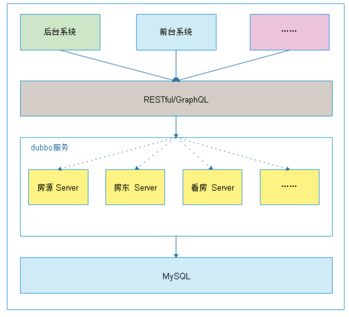

>   后台系统采用的是前后端分离开发模式，前端使用AntDesign Pro系统作为模板进行改造，后端采用的是SpringBoot+SpringMVC+Dubbo+Mybatis 的架构进行开发

<div style="page-break-after:always" />

## Dubbo

高性能RPC框架，[官网](https://dubbo.apache.org/zh/)

>   Dubbo 是一个分布式服务框架，致力于提供**高性能和透明化的RPC远程服务调用方案**，是阿里巴巴SOA服务化治理方案的核心框架  
>
>   最大的特点是按照分层的方式来 **架构** ，使用这种方式可以使各个层之间解耦合（或者最大限度地松耦合）  
>
>   从 **服务模型** 的角度来看，Dubbo采用的是一种非常简单的模型，要么是提供方提供服务，要么是消费方消费服务，所以基于这一点可以抽象出服务提供方（Provider）和服务消费方（Consumer）两个角色  

RPC(Remote Procedure Call Protocal)——远程过程调用协议

-   通过网络从远程计算机程序请求服务，

-   采用 **客户机/服务器** 模式。

    -   客户机：请求程序
    -   服务器：服务提供程序

    1.  客户机调用进程发送一个有参数的调用信息到服务进程，然后等待应答信息

    2.  服务端，进程保持睡眠状态直到调用信息到达为止。当一个调用信息到达，服务器获得进程参数，计算结果，发送答复信息，等待下一个调用信息

    3.  客户端调用进程接收答复信息，获得进程结果，调用执行继续进行

### 框架说明

[文档地址](https://dubbo.apache.org/zh/docs/v2.7/user/preface/)

#### 背景——网站应用的演进


>   单一应用架构

当网站流量很小，只需 ==一个应用将所有功能部署在一起== ，减少部署节点和成本。此时，*用于简化CRUD的数据访问框架(ORM)是关键*

>   垂直应用架构

当 ==访问量逐渐增大== ，单一应用通过增加机器带来的加速度越来越小，==提高效率的方法之一是将应用拆成互不相干的几个应用==。此时，*用于加速前端页面开发的 Web框架(MVC)是关键*

>   分布式服务架构

当垂直应用越来越多，==应用之间交互不可避免==，将==核心业务抽取出来作为独立的服务，逐渐形成稳定的服务中心==，使前端应用能更快速的响应多变的市场需求。此时 *用于提高业务复用及整合的分布式服务框架(RPC)是关键*

>   流动计算框架

当服务越来越多，==容量的评估、小服务资源的浪费等问题逐渐显现==。此时，需增加一个==调度中心基于访问中心压力，实时管理集群容量==，提高集群利用率。此时*用于提高机器利用率的资源调度和治理中心(SOA) 是关键*

#### Dubbo解决的需求


在大规模服务化之前，应用可能只是通过 RMI 或 Hessian 等工具，简单的暴露和引用远程服务，通过配置服务的URL地址进行调用，通过 F5 等硬件进行负载均衡。

==当服务越来越多时，服务 URL 配置管理变得非常困难，F5 硬件负载均衡器的单点压力也越来越大。==此时需要一个 `服务注册中心` ，*动态地注册和发现服务*，使服务的位置透明。并通过在消费方获取服务提供方地址列表，实现软负载均衡和 Failover，降低对 F5 硬件负载均衡器的依赖，也能减少部分成本。

当进一步发展，==服务间依赖关系变得错踪复杂，甚至分不清哪个应用要在哪个应用之前启动==，架构师都不能完整的描述应用的架构关系。 这时，需要 `治理中心` 自动画出*应用间的依赖关系图*，以帮助架构师理清关系。

接着，==服务的调用量越来越大，服务的容量问题就暴露出来==，这个服务需要多少机器支撑？什么时候该加机器？ 为了解决这些问题，第一步，`监控中心` 要将服务现在每天的调用量，响应时间，都 *统计* 出来，*作为容量规划的参考指标*。其次 ，`调度中心` 要可以*动态调整权重*，在线上，将某台机器的权重一直加大，并在加大的过程中记录响应时间的变化，直到响应时间到达阈值，记录此时的访问量，再以此访问量乘以机器数反推总容量。

#### Dubbo架构


| 节点        | 角色说明                               |
| ----------- | -------------------------------------- |
| `Provider`  | 暴露服务的服务提供方                   |
| `Consumer`  | 调用远程服务的服务消费方               |
| `Registry`  | 服务注册与发现的注册中心               |
| `Monitor`   | 统计服务的调用次数和调用时间的监控中心 |
| `Container` | 服务运行容器                           |

0.  服务容器负责启动，加载，运行服务提供者
1.  服务提供者在启动时，向注册中心注册自己提供的服务
2.  服务消费者在启动时，向注册中心订阅自己所需的服务
3.  注册中心返回服务提供者地址列表给消费者，如果有变更，注册中心将基于长连接推送变更数据给消费者。
4.  服务消费者，从提供者地址列表中，基于软负载均衡算法，选一台提供者进行调用，如果调用失败，再选另一台调用。
5.  服务消费者和提供者，在内存中累计调用次数和调用时间，定时每分钟发送一次统计数据到监控中心。

### 注册中心

[注册中心文档](https://dubbo.apache.org/zh/docs/v2.7/user/references/registry/)


#### 流程说明

-   服务提供者启动时：向 `/dubbo/packageName/providers` 目录下写入自己的URL地址
-   服务消费者启动时：订阅 `/dubbo/packageName/providers` 目录下的提供者的URL地址，并向 `/dubbo/packageName/consumers` 目录下写入自己的URL地址
-   监控中心启动时：订阅 `/dubbo/packageName` 目录下的所有提供者和消费者URL地址

#### 功能

-   当 `注册中心` 重启时，能自动恢复注册数据，以及订阅请求
-   当提供者出现断电等异常停机时，注册中心能自动删除提供者信息
-   当会话过期时，能自动恢复注册数据，以及订阅请求
-   当设置 `<dubbo:registry check="false" />` 时，记录失败注册和订阅请求，后台定时重试
-   可通过 `<dubbo:registry username="admin" password="1234" />` 设置 zookeeper 登录信息
-   可通过 `<dubbo:registry group="dubbo" />` 设置 zookeeper 的根节点，不配置将使用默认的根节点
-   支持 `*` 号通配符 `<dubbo:reference group="*" version="*" />`，可订阅服务的所有分组和所有版本的提供者

#### docker——Zookeeper

```shell
#拉取zk镜像
docker pull zookeeper:3.5

#创建并启动容器
docker run -d --name zk -p 2181:2181 zookeeper:3.5
```

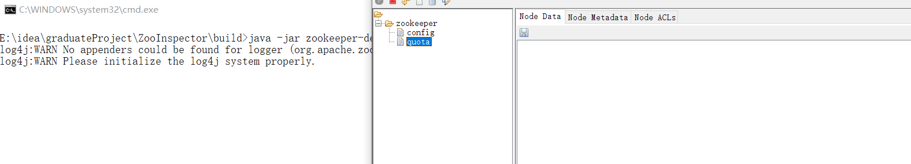

### 服务提供方

#### 1. 创建Maven工程

**父工程**

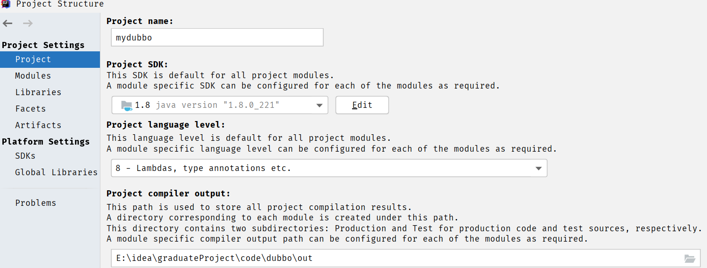

**服务提供方子模块**

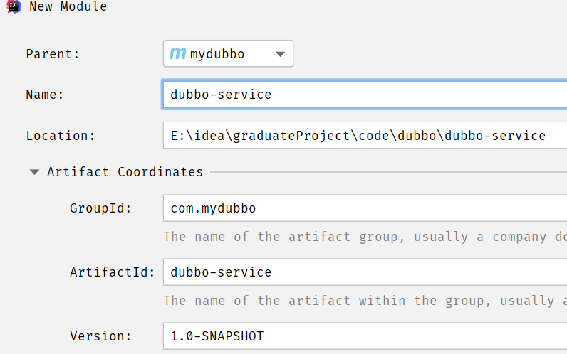

#### 2. 导入依赖

**父工程的配置**

```xml
<!--添加SpringBoot parent支持-->
<parent>
    <groupId>org.springframework.boot</groupId>
    <artifactId>spring-boot-starter-parent</artifactId>
    <version>2.1.0.RELEASE</version>
</parent>

<dependencies>
    <!--添加SpringBoot测试-->
    <dependency>
        <groupId>org.springframework.boot</groupId>
        <artifactId>spring-boot-starter-test</artifactId>
        <scope>test</scope>
    </dependency>
    <!--添加dubbo的springboot依赖-->
    <dependency>
        <groupId>com.alibaba.boot</groupId>
        <artifactId>dubbo-spring-boot-starter</artifactId>
        <version>0.2.0</version>
    </dependency>
    <!--添加dubbo依赖-->
    <dependency>
        <groupId>com.alibaba</groupId>
        <artifactId>dubbo</artifactId>
        <version>2.6.4</version>
    </dependency>
</dependencies>

<build>
    <plugins>
        <!--添加springboot的maven插件-->
        <plugin>
            <groupId>org.springframework.boot</groupId>
            <artifactId>spring-boot-maven-plugin</artifactId>
        </plugin>
    </plugins>
</build>
```

**服务提供方的配置**

```xml
<dependencies>
    <!--添加springboot依赖，非web项目-->
    <dependency>
        <groupId>org.springframework.boot</groupId>
        <artifactId>spring-boot-starter</artifactId>
    </dependency>
    <dependency>
        <groupId>org.apache.zookeeper</groupId>
        <artifactId>zookeeper</artifactId>
        <version>3.4.13</version>
    </dependency>
    <dependency>
        <groupId>com.github.sgroschupf</groupId>
        <artifactId>zkclient</artifactId>
        <version>0.1</version>
    </dependency>
</dependencies>
```

#### 3. 创建POJO——User对象

```java
package com.mydubbo.pojo;

// 使用dubbo要求传输的对象必须实现序列化接口
public class User implements java.io.Serializable {

    private static final long serialVersionUID = -7341603933521593227L;

    private Long id;

    private String username;

    private String password;

    private Integer age;

    public Long getId() {
        return id;
    }

    public void setId(Long id) {
        this.id = id;
    }

    public String getUsername() {
        return username;
    }

    public void setUsername(String username) {
        this.username = username;
    }

    public String getPassword() {
        return password;
    }

    public void setPassword(String password) {
        this.password = password;
    }

    public Integer getAge() {
        return age;
    }

    public void setAge(Integer age) {
        this.age = age;
    }
}
```

#### 4. 创建Service——UserService接口提供查询服务

```java
package com.mydubbo.service;

import com.mydubbo.pojo.User;

import java.util.List;

public interface UserService {

    /**
     * 查询所有的用户数据
     *
     * @return
     */
    List<User> queryAll();
}
```

#### 5. 编写 application.properties

服务端 resources下

```properties
# Spring boot application
spring.application.name = mydubbo-service
server.port = 9090

# Service version
dubbo.service.version = 1.0.0

# 服务扫描包
dubbo.scan.basePackages  = com.mydubbo.service

# 应用名称
dubbo.application.name = dubbo-provider-demo

# 协议及端口
dubbo.protocol.name = dubbo
dubbo.protocol.port = 20882

# zk注册中心
dubbo.registry.address = zookeeper://8.140.130.91:2181
dubbo.registry.client = zkclient
```

#### 6. 创建ServiceImpl——UserServiceImpl实现类

```java
package com.mydubbo.service.impl;

import java.util.ArrayList;
import java.util.List;

import com.alibaba.dubbo.config.annotation.Service;
import com.mydubbo.pojo.User;
import com.mydubbo.service.UserService;


@Service(version = "${dubbo.service.version}") //声明这是一个dubbo服务
public class UserServiceImpl implements UserService {

    /**
     * 实现查询，这里做模拟实现，不做具体的数据库查询
     */
    public List<User> queryAll() {
        List<User> list = new ArrayList<User>();
        for (int i = 0; i < 10; i++) {
            User user = new User();
            user.setAge(10 + i);
            user.setId(Long.valueOf(i + 1));
            user.setPassword("123456");
            user.setUsername("username_" + i);
            list.add(user);
        }
        System.out.println("---------Service 3------------");
        return list;
    }

}
```

#### 7. 编写启动类

POJO,Service包与启动类同级

```java
package com.mydubbo;

import org.springframework.boot.WebApplicationType;
import org.springframework.boot.autoconfigure.SpringBootApplication;
import org.springframework.boot.builder.SpringApplicationBuilder;

@SpringBootApplication
public class DubboProvider {
    public static void main(String[] args) {
        new SpringApplicationBuilder(DubboProvider.class)
            .web(WebApplicationType.NONE) // 非 Web 应用
            .run(args);
    }
}
```

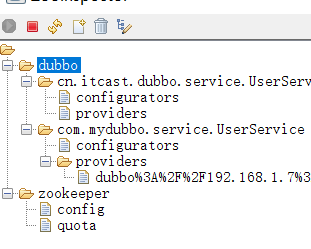

### 服务消费方

#### 1. 创建工程

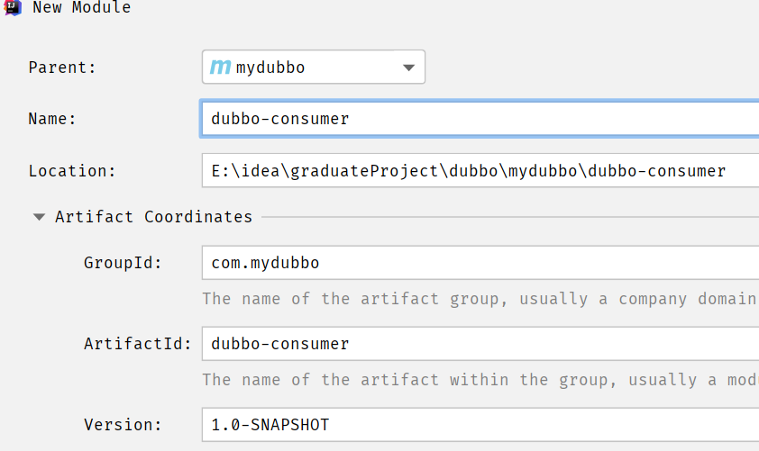

#### 2. 导入依赖

```xml
<dependencies>
    <!--添加springboot依赖，非web项目-->
    <dependency>
        <groupId>org.springframework.boot</groupId>
        <artifactId>spring-boot-starter</artifactId>
    </dependency>
    <dependency>
        <groupId>org.apache.zookeeper</groupId>
        <artifactId>zookeeper</artifactId>
        <version>3.4.13</version>
    </dependency>
    <dependency>
        <groupId>com.github.sgroschupf</groupId>
        <artifactId>zkclient</artifactId>
        <version>0.1</version>
    </dependency>
    
    <!--引入服务提供方的依赖-->
    <dependency>
        <groupId>com.mydubbo</groupId>
        <artifactId>dubbo-service</artifactId>
        <version>1.0-SNAPSHOT</version>
    </dependency>
</dependencies>
```

#### 3. application.properties配置文件

```properties
# Spring boot application
spring.application.name = mydubbo-consumer
server.port = 9091

# 应用名称
dubbo.application.name = dubbo-consumer-demo

# zk注册中心
dubbo.registry.address = zookeeper://8.140.130.91:2181
dubbo.registry.client = zkclient
```

#### 4. 编写测试用例

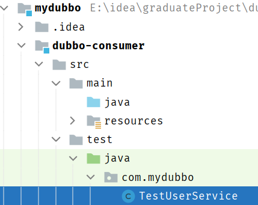

```java
package com.mydubbo;

import com.alibaba.dubbo.config.annotation.Reference;
import com.mydubbo.pojo.User;
import com.mydubbo.service.UserService;
import org.junit.Test;
import org.junit.runner.RunWith;
import org.springframework.boot.test.context.SpringBootTest;
import org.springframework.test.context.junit4.SpringRunner;

import java.util.List;

@RunWith(SpringRunner.class)
@SpringBootTest
public class TestUserService {
    @Reference(version = "1.0.0")
    private UserService userService;

    @Test
    public void testQueryAll(){
        List<User> users = this.userService.queryAll();

        for (User user : users) {
            System.out.println(user);
        }
    }
}
```

#### 5. 测试


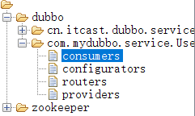

### Dubbo admin&monitor

Dubbo提供了可视化的界面管理工具，方便我们对服务进行管理  

[官网链接](https://github.com/apache/dubbo-admin)

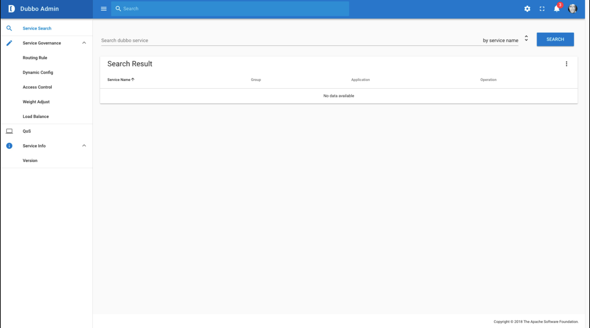

#### 1. 配置jdk+docker镜像

##### 不配置 docker 镜像

###### 1. 本地下载 `tar.gz`

[华为镜像](https://repo.huaweicloud.com/java/jdk/)

[OpenJDK镜像](http://www.sousou88.com/spec/java_openjdk.html)

###### 2. 解压到/opt/java/jdk8

```shell
tar -xzvf jdk-8u151-linux-x64.tar.gz -C /opt/java/jdk8
```

###### 3. 配置环境变量

```shell
vim /etc/profile

export JAVA_HOME=/opt/java/jdk8/jdk1.8.0_151  #jdk安装目录
export JRE_HOME=${JAVA_HOME}/jre
export CLASSPATH=.:${JAVA_HOME}/lib:${JRE_HOME}/lib:$CLASSPATH
export JAVA_PATH=${JAVA_HOME}/bin:${JRE_HOME}/bin
export PATH=$PATH:${JAVA_PATH}
```

###### 4. 测试

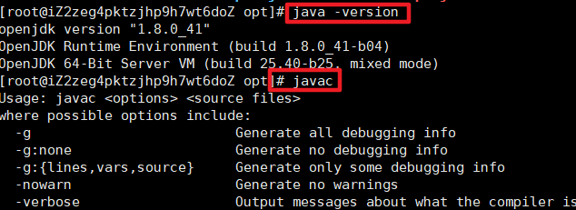

##### 构建docker镜像

###### 1. 新建 `/dc/jdk8`

###### 2. 将JDK tar 包放入

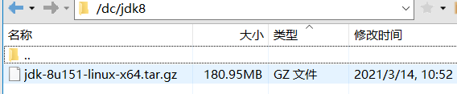

###### 3. 创建并编写 `Dockerfile` 配置文件

```
FROM docker.io/jeanblanchard/alpine-glibc
MAINTAINER zoe
RUN mkdir -p /usr/local/java/jdk
WORKDIR /usr/local/java/jdk
ADD jdk-8u151-linux-x64.tar.gz /usr/local/java/jdk
ENV JAVA_HOME /usr/local/java/jdk/jdk1.8.0_151
ENV PATH ${PATH}:${JAVA_HOME}/bin
```

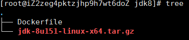

###### 4. 构建镜像

```shell
docker build -t jdk8 .
```

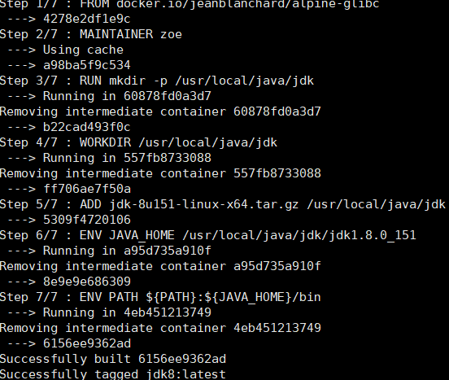

###### 5. 查看镜像

```shell
docker image list
```

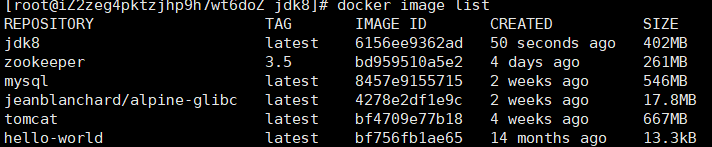

###### 6. 运行jdk8镜像

```shell
docker run -di --name=jdk8 jdk8

#查看jdk在容器内部是否生效，需进入容器内部执行。
docker exec -it jdk8 /bin/sh
```

此时在宿主机上执行“java -version”发现jdk并未生效，因为jdk只运行在容器内，这也说明了容器内的环境与外界环境无关联

#### 2. 使用maven构建项目

##### 解压maven安装包

```shell
yum -y install wget

wget http://mirrors.cnnic.cn/apache/maven/maven-3/3.6.3/binaries/apache-maven-3.6.3-bin.tar.gz

tar -zxvf apache-maven-3.6.3-bin.tar.gz -C /opt
```

##### 配置环境变量

```shell
vim /etc/profile
# 写入以下内容
export MVN_HOME=/root/apache-maven-3.6.3
export PATH=$MVN_HOME/bin:$PATH
```

##### 编译

```shell
source /etc/profile
```

##### 查看mvn版本

```shell
mvn -version
```

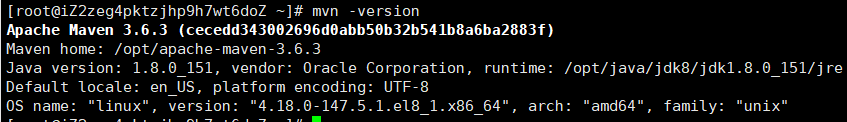

#### 3. 克隆dubbo-admin项目到主机

```shell
git clone https://github.com/apache/dubbo-admin.git

# 国内镜像
git clone https://github.com.cnpmjs.org/apache/dubbo-admin.git
```

#### 4. 配置注册中心

在 `dubbo-admin-server/src/main/resources/application.properties` 中指定注册中心地址

```properties
dubbo.registry.address=zookeeper://8.140.130.91:2181
```

#### 5. mvn构建

```shell
# 进入项目录
cd /opt/incubator-dubbo-ops/

# 清理包
mvn clean package -Dmaven.test.skip=true
```

#### 6. 通过mvn插件启动程序

```shell
mvn --projects dubbo-admin-server spring-boot:run
```

#### 7. 访问dubbo-admin

```shell
8.140.130.91:8080

# Default username and password is root
```

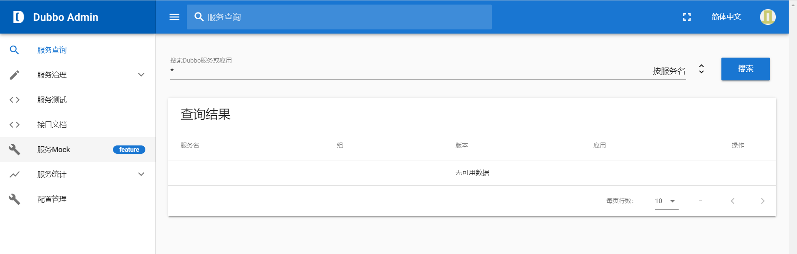

### 服务的负载均衡

在集群负载均衡时，Dubbo 提供了多种均衡策略，缺省为 random 随机调用  

[文档](https://dubbo.apache.org/zh/docs/v2.7/user/examples/loadbalance/)

#### 负载均衡策略

##### Random LoadBalance

-   **随机**，按权重设置随机概率。
-   在一个截面上碰撞的概率高，但调用量越大分布越均匀，而且按概率使用权重后也比较均匀，有利于动态调整提供者权重。

##### RoundRobin LoadBalance

-   **轮询**，按公约后的权重设置轮询比率。
-   存在慢的提供者累积请求的问题，比如：第二台机器很慢，但没挂，当请求调到第二台时就卡在那，久而久之，所有请求都卡在调到第二台上。

##### LeastActive LoadBalance

-   **最少活跃调用数**，相同活跃数的随机，活跃数指调用前后计数差。
-   使慢的提供者收到更少请求，因为越慢的提供者的调用前后计数差会越大。

##### ConsistentHash LoadBalance

-   **一致性 Hash**，相同参数的请求总是发到同一提供者。
-   当某一台提供者挂时，原本发往该提供者的请求，基于虚拟节点，平摊到其它提供者，不会引起剧烈变动。
-   算法参见：http://en.wikipedia.org/wiki/Consistent_hashing
-   缺省只对第一个参数 Hash，如果要修改，请配置 `<dubbo:parameter key="hash.arguments" value="0,1" />`
-   缺省用 160 份虚拟节点，如果要修改，请配置 `<dubbo:parameter key="hash.nodes" value="320" />`

#### 指定负载均衡策略

消费者注解

```java
@Reference(version = "1.0.0", loadbalance = "roundrobin")
```

#### 测试

##### 修改代码及配置

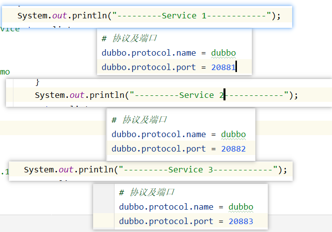


##### 将项目设置为多线程模式

idea默认的是单例模式

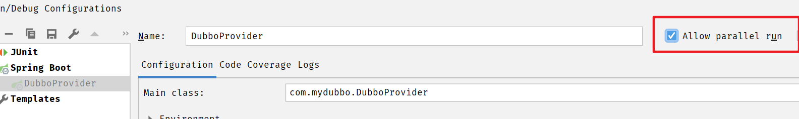

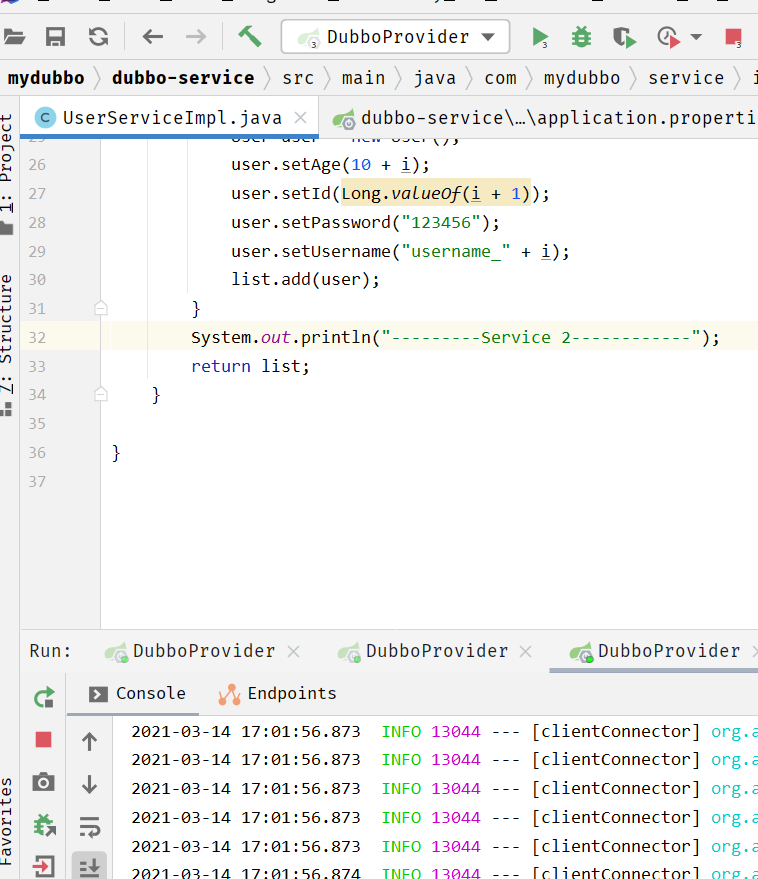

##### 跑一下 看控制台输出

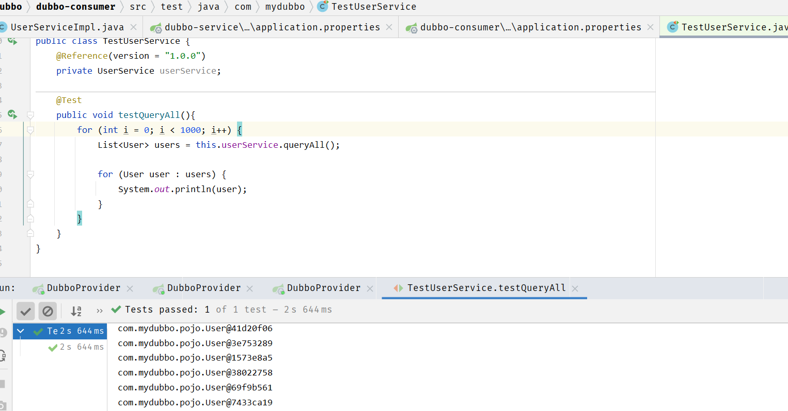

##### dubbo-admin查看

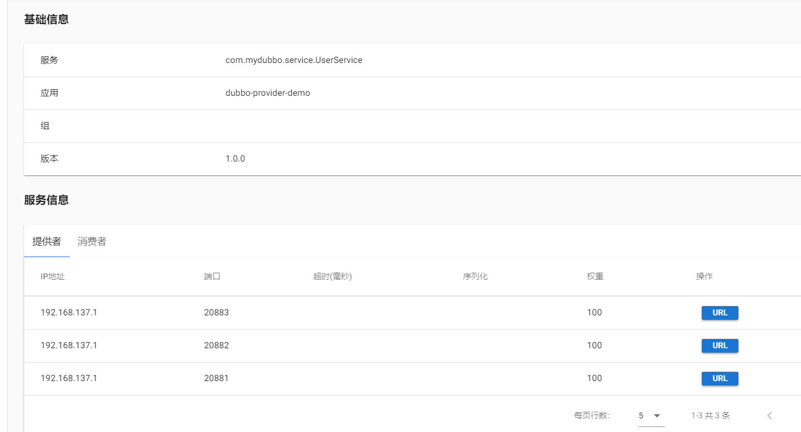

### 协议

[链接](https://dubbo.apache.org/zh/docs/v2.7/user/references/protocol/)

#### dubbo协议【推荐】

Dubbo 缺省协议采用 `单一长连接` 和 `NIO 异步通讯`，**适合**

-   小数据量大并发的服务调用
-   服务消费者机器数远大于服务提供者机器数的情况。

反之，Dubbo 缺省协议 **不适合**

-   传送大数据量的服务,比如传文件，传视频等


-   Transporter(传输): mina, netty, grizzy
-   Serialization(序列化): dubbo, hessian2, java, json
-   Dispatcher(分发调度): all, direct, message, execution, connection
-   ThreadPool(线程池): fixed, cached

<div style="page-break-after:always" />

## 持久层

### docker——percona

[官网链接](https://hub.docker.com/_/percona/)

Percona 为 MySQL 数据库服务器进行了改进，在功能和性能上较 MySQL 有着很显著的提升。该版本提升了在高负载情况下的 InnoDB 的性能、为 DBA 提供一些非常有用的性能诊断工具；另外有更多的参数和命令来控制服务器行为。

Percona Server 只包含 MySQL 的服务器版，并没有提供相应对 MySQL 的 Connector 和 GUI 工具进行改进。
Percona Server 使用了一些 google-mysql-tools, Proven Scaling, Open Query 对 MySQL 进行改造。

#### 安装部署

```shell
# 拉取镜像
docker pull percona:8.0.22-13

#创建容器
docker run --name percona -v /data/mysql-data:/var/lib/mysql -p 3306:3306 -e MYSQL_ROOT_PASSWORD=root -d percona:8.0.22-13

# 参数解释
--name	:	percona				   指定容器名
-v		:	[主机目录]:[容器目录]	 将 主机目录 挂在到容器目录上
-p		:	[主机端口]:[容器内部端口]	设置端口映射
-e		:	MYSQL_ROOT_PASSWORD=   设置容器参数，将root用户密码为root
percona:8.0.22-13	:	镜像名:版本

# 启动容器
docker start percona

# 解决没有权限闪退问题
chmod -R 777 /data 
```

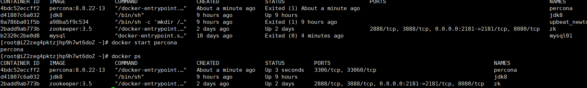

测试:

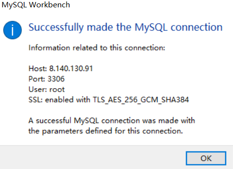

### MyBatisPlus

ORM层使用MyBatis框架作为持久层框架

使用MyBatisPlus作为Mybatis插件

#### 简介

在MyBatis基础上，只做增强不做改变，为简化开发、提高效率而生

**特性：**

-   无侵入
-   损耗小：启动即会自动注入基本 CURD，性能基本无损耗，直接面向对象操作  
-   CRUD：内置通用 Mapper、通用 Service  
-   支持主键自动生成 
-   支持 XML 热加载  ：Mapper 对应的 XML 支持热加载，对于简单的 CRUD 操作，甚至可以无 XML 启动  
-   支持 ActiveRecord 模式
-   支持自定义全局通用操作：支持全局通用方法注入  
-   内置代码生成器  ：采用代码或者 Maven 插件可快速生成 Mapper 、 Model 、 Service 、 Controller 层代码，支持模板引擎
-   内置分页插件 、性能分析插件
-   全局拦截(提供全表 delete 、 update 操作智能分析阻断，也可自定义拦截规则，预防误操作)
-   内置 Sql 注入剥离器：支持 Sql 注入剥离，有效预防 Sql 注入攻击  

#### 架构

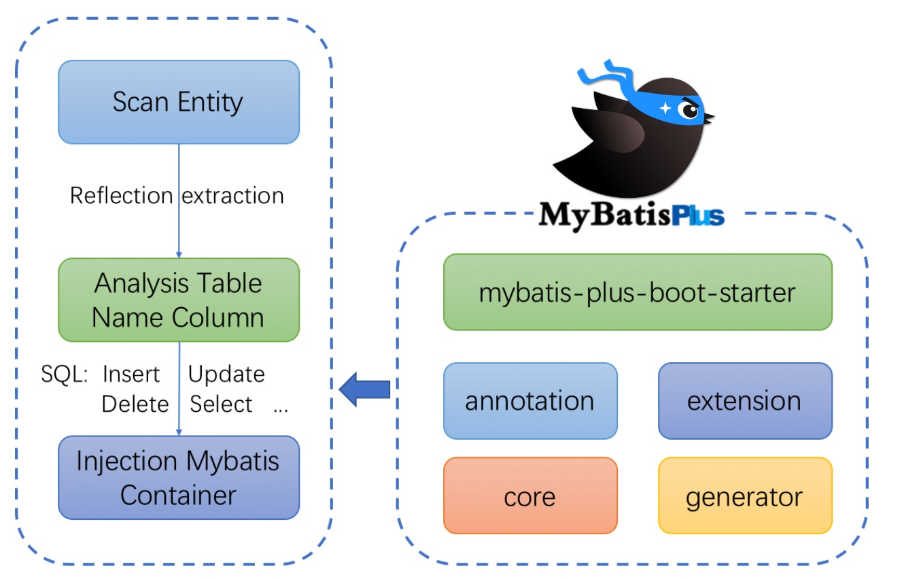

通过简单语句，生成SQL语句，交给MyBatis执行

#### 快速入门

##### 创建表

创建数据库 haoke


```sql
use haoke;

CREATE TABLE `user` (
	`id` bigint(20) NOT NULL AUTO_INCREMENT COMMENT '主键ID',
	`name` varchar(30) DEFAULT NULL COMMENT '姓名',
	`age` int(11) DEFAULT NULL COMMENT '年龄',
	`email` varchar(50) DEFAULT NULL COMMENT '邮箱',
	PRIMARY KEY (`id`)
) ENGINE=InnoDB DEFAULT CHARSET=utf8;

-- 插入数据
INSERT INTO `user` (`id`, `name`, `age`, `email`) VALUES ('1', 'Jone', '18','test1@baomidou.com');
INSERT INTO `user` (`id`, `name`, `age`, `email`) VALUES ('2', 'Jack', '20','test2@baomidou.com');
INSERT INTO `user` (`id`, `name`, `age`, `email`) VALUES ('3', 'Tom', '28','test3@baomidou.com');
INSERT INTO `user` (`id`, `name`, `age`, `email`) VALUES ('4', 'Sandy', '21','test4@baomidou.com');
INSERT INTO `user` (`id`, `name`, `age`, `email`) VALUES ('5', 'Billie', '24','test5@baomidou.com');
```

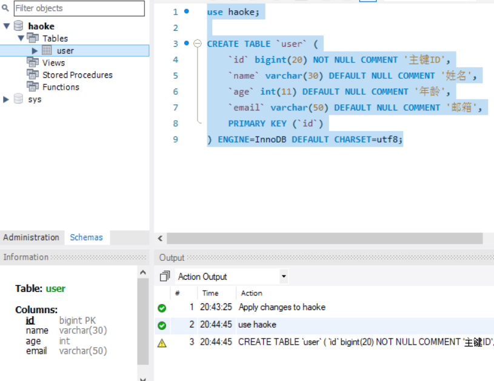


##### 创建工程及导入依赖

```xml
<parent>
    <groupId>org.springframework.boot</groupId>
    <artifactId>spring-boot-starter-parent</artifactId>
    <version>2.4.3</version>
</parent>

<dependencies>
    <dependency>
        <groupId>org.springframework.boot</groupId>
        <artifactId>spring-boot-starter</artifactId>
    </dependency>
    <dependency>
        <groupId>org.springframework.boot</groupId>
        <artifactId>spring-boot-starter-test</artifactId>
        <scope>test</scope>
    </dependency>

    <!--mybatis-plus的springboot支持-->
    <dependency>
        <groupId>com.baomidou</groupId>
        <artifactId>mybatis-plus-boot-starter</artifactId>
        <version>3.4.2</version>
    </dependency>
    <!--mysql驱动-->
    <dependency>
        <groupId>mysql</groupId>
        <artifactId>mysql-connector-java</artifactId>
        <version>8.0.16</version>
    </dependency>
</dependencies>

<build>
    <plugins>
        <plugin>
            <groupId>org.springframework.boot</groupId>
            <artifactId>spring-boot-maven-plugin</artifactId>
        </plugin>
    </plugins>
</build>
```

##### 编写application.properties文件

```properties
spring.application.name = mybatis-plus
spring.datasource.driver-class-name=com.mysql.cj.jdbc.Driver
spring.datasource.url=jdbc:mysql://8.140.130.91:3306/haoke?characterEncoding=utf8&useSSL=false&serverTimezone=UTC
spring.datasource.username=root
spring.datasource.password=root
```

##### 创建User对象

```java
package com.mybatisplus.pojo;

public class User {
    private Long id;
    private String name;
    private Integer age;
    private String email;

    public User() {
    }

    public User(Long id, String name, Integer age, String email) {
        this.id = id;
        this.name = name;
        this.age = age;
        this.email = email;
    }

    public Long getId() {
        return id;
    }

    public void setId(Long id) {
        this.id = id;
    }

    public String getName() {
        return name;
    }

    public void setName(String name) {
        this.name = name;
    }

    public Integer getAge() {
        return age;
    }

    public void setAge(Integer age) {
        this.age = age;
    }

    public String getEmail() {
        return email;
    }

    public void setEmail(String email) {
        this.email = email;
    }
}
```

##### 编写UserMapper

```java
package com.mybatisplus.mapper;

import com.baomidou.mybatisplus.core.mapper.BaseMapper;

public interface UserMapper extends BaseMapper<User> {

}

```

##### 编写SpringBoot启动类

```java
package com.mybatisplus;

import org.mybatis.spring.annotation.MapperScan;
import org.springframework.boot.SpringApplication;
import org.springframework.boot.autoconfigure.SpringBootApplication;

@MapperScan("com.mybatisplus.mapper") //设置mapper接口的扫描包
@SpringBootApplication
public class Myapplication {
    public static void main(String[] args) {
        SpringApplication.run(Myapplication.class,args);
    }
}
```

##### 编写单元测试用例

```java
package com.mybatisplus;

import com.mybatisplus.mapper.UserMapper;
import com.mybatisplus.pojo.User;
import org.junit.jupiter.api.Test;
import org.junit.runner.RunWith;
import org.springframework.beans.factory.annotation.Autowired;
import org.springframework.boot.test.context.SpringBootTest;

import java.util.List;

@SpringBootTest
public class UserMapperTest {
    @Autowired
    private UserMapper userMapper;

    @Test
    public void test(){
        System.out.println("-------selectAll method test-------");

        List<User> users = userMapper.selectList(null);

        for (User user : users) {
            System.out.println(user);
        }
    }
}

```

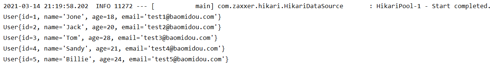

#### 通用Mapper

在MybatisPlus中，BaseMapper中定义了一些常用的CRUD方法，当我们自定义的Mapper接口继承BaseMapper后即可拥有了这些方法 【这些方法仅适合单表操作  】

```java
/**
 * Mapper 继承该接口后，无需编写 mapper.xml 文件，即可获得CRUD功能
 */
public interface BaseMapper<T> extends Mapper<T> {

    /**
     * 插入一条记录
     *
     * @param entity 实体对象
     */
    int insert(T entity);

    /**
     * 根据 ID 删除
     *
     * @param id 主键ID
     */
    int deleteById(Serializable id);

    /**
     * 根据 columnMap 条件，删除记录
     *
     * @param columnMap 表字段 map 对象
     */
    int deleteByMap(@Param(Constants.COLUMN_MAP) Map<String, Object> columnMap);

    /**
     * 根据 entity 条件，删除记录
     *
     * @param queryWrapper 实体对象封装操作类（可以为 null,里面的 entity 用于生成 where 语句）
     */
    int delete(@Param(Constants.WRAPPER) Wrapper<T> queryWrapper);

    /**
     * 删除（根据ID 批量删除）
     *
     * @param idList 主键ID列表(不能为 null 以及 empty)
     */
    int deleteBatchIds(@Param(Constants.COLLECTION) Collection<? extends Serializable> idList);

    /**
     * 根据 ID 修改
     *
     * @param entity 实体对象
     */
    int updateById(@Param(Constants.ENTITY) T entity);

    /**
     * 根据 whereEntity 条件，更新记录
     *
     * @param entity        实体对象 (set 条件值,可以为 null)
     * @param updateWrapper 实体对象封装操作类（可以为 null,里面的 entity 用于生成 where 语句）
     */
    int update(@Param(Constants.ENTITY) T entity, @Param(Constants.WRAPPER) Wrapper<T> updateWrapper);

    /**
     * 根据 ID 查询
     *
     * @param id 主键ID
     */
    T selectById(Serializable id);

    /**
     * 查询（根据ID 批量查询）
     *
     * @param idList 主键ID列表(不能为 null 以及 empty)
     */
    List<T> selectBatchIds(@Param(Constants.COLLECTION) Collection<? extends Serializable> idList);

    /**
     * 查询（根据 columnMap 条件）
     *
     * @param columnMap 表字段 map 对象
     */
    List<T> selectByMap(@Param(Constants.COLUMN_MAP) Map<String, Object> columnMap);

    /**
     * 根据 entity 条件，查询一条记录
     *
     * @param queryWrapper 实体对象封装操作类（可以为 null）
     */
    T selectOne(@Param(Constants.WRAPPER) Wrapper<T> queryWrapper);

    /**
     * 根据 Wrapper 条件，查询总记录数
     *
     * @param queryWrapper 实体对象封装操作类（可以为 null）
     */
    Integer selectCount(@Param(Constants.WRAPPER) Wrapper<T> queryWrapper);

    /**
     * 根据 entity 条件，查询全部记录
     *
     * @param queryWrapper 实体对象封装操作类（可以为 null）
     */
    List<T> selectList(@Param(Constants.WRAPPER) Wrapper<T> queryWrapper);

    /**
     * 根据 Wrapper 条件，查询全部记录
     *
     * @param queryWrapper 实体对象封装操作类（可以为 null）
     */
    List<Map<String, Object>> selectMaps(@Param(Constants.WRAPPER) Wrapper<T> queryWrapper);

    /**
     * 根据 Wrapper 条件，查询全部记录
     * <p>注意： 只返回第一个字段的值</p>
     *
     * @param queryWrapper 实体对象封装操作类（可以为 null）
     */
    List<Object> selectObjs(@Param(Constants.WRAPPER) Wrapper<T> queryWrapper);

    /**
     * 根据 entity 条件，查询全部记录（并翻页）
     *
     * @param page         分页查询条件（可以为 RowBounds.DEFAULT）
     * @param queryWrapper 实体对象封装操作类（可以为 null）
     */
    <E extends IPage<T>> E selectPage(E page, @Param(Constants.WRAPPER) Wrapper<T> queryWrapper);

    /**
     * 根据 Wrapper 条件，查询全部记录（并翻页）
     *
     * @param page         分页查询条件
     * @param queryWrapper 实体对象封装操作类
     */
    <E extends IPage<Map<String, Object>>> E selectMapsPage(E page, @Param(Constants.WRAPPER) Wrapper<T> queryWrapper);
}

```

##### 通过id查询——selectById

```java
@Test
public void testSelectById(){
    System.out.println("通过Id查询");
    User user = userMapper.selectById(3L);//数据类型为Long，id为3

    System.out.println(user);
}
```

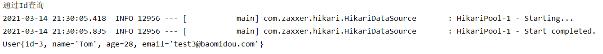

##### 模糊查询——like

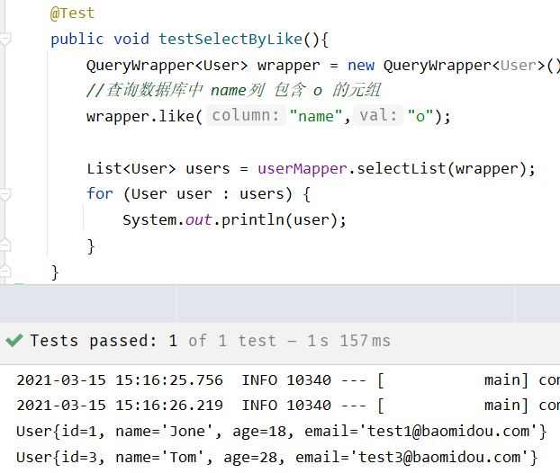

##### 条件查询

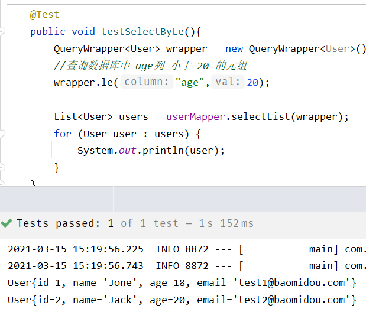

https://mp.baomidou.com/guide/wrapper.html#abstractwrapper

##### 插入数据

```java
@Test
public void testSave(){
    User user = new User();
    user.setAge(25);
    user.setEmail("zhangsan@qq.com");
    user.setName("zhangsan");
    int count = userMapper.insert(user);
    System.out.println("新增数据成功! count=>"+count);
}
```

###### id自增问题

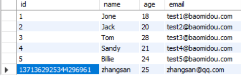


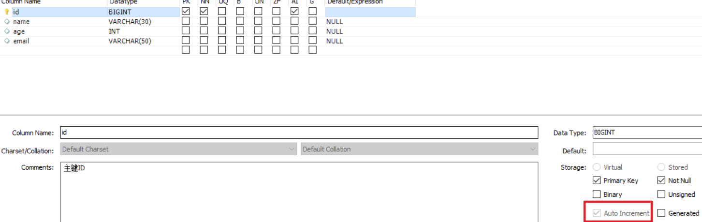

所以自增问题出现在java参数传递中

```java
public class User {
    
    @TableId(value = "ID", type = IdType.AUTO)
    private Long id;
    private String name;
    private Integer age;
    private String email;
}
```

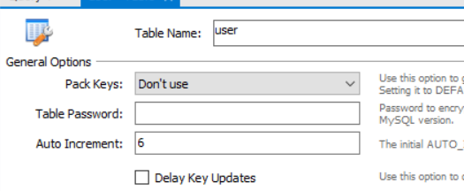

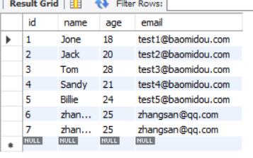

##### 删除数据

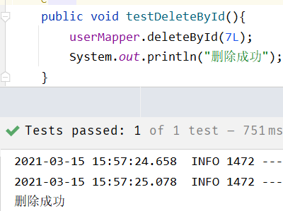

##### 修改数据

根据id修改，只修改指定的字段

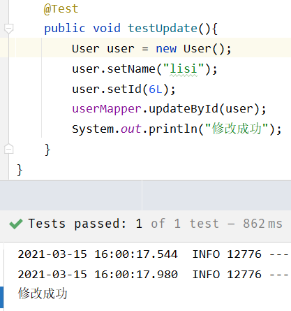


##### 分页查询

```java
/**
 * 分页插件
 */
@Bean
public MybatisPlusInterceptor mybatisPlusInterceptor() {
    MybatisPlusInterceptor interceptor = new MybatisPlusInterceptor();
    // 设置请求的页面大于最大页后操作， true调回到首页，false 继续请求  默认false
    // paginationInterceptor.setOverflow(false);
    // 设置最大单页限制数量，默认 500 条，-1 不受限制
    // paginationInterceptor.setLimit(500);

    PaginationInnerInterceptor paginationInnerInterceptor = new PaginationInnerInterceptor();
    paginationInnerInterceptor.setDbType(DbType.MYSQL);

    interceptor.addInnerInterceptor(paginationInnerInterceptor);
    return interceptor;
}
```

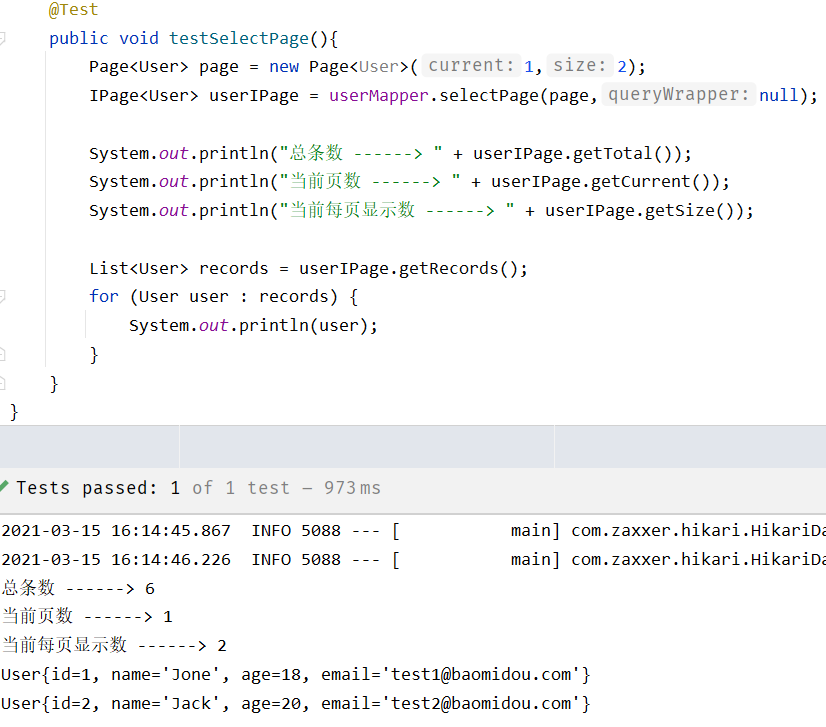

#### 配置

**使用MyBatis原生配置文件**

```properties
# 指定全局配置文件
mybatis-plus.config-location = classpath:mybatis-config.xml
# 指定mapper.xml文件
mybatis-plus.mapper-locations = classpath*:mybatis/*.xml
```

若指定配置文件，无需配置环境，只需要

```xml
<?xml version="1.0" encoding="UTF-8" ?>
<!DOCTYPE configuration
        PUBLIC "-//mybatis.org//DTD Config 3.0//EN"
        "http://mybatis.org/dtd/mybatis-3-config.dtd">
<!-- configuration的核心配置 -->
<configuration>
    <!-- 每一个Mapper.xml都需要在MyBatis核心配置文件中注册 -->
</configuration>
```

https://mp.baomidou.com/guide/config.html#%E5%9F%BA%E6%9C%AC%E9%85%8D%E7%BD%AE

#### Lombok

-   @Data：注解在类上；提供类所有属性的 getting 和 setting 方法，此外还提供了equals、canEqual、hashCode、toString 方法
-   @Setter：注解在属性上；为属性提供 setting 方法
-   @Getter：注解在属性上；为属性提供 getting 方法
-   @Slf4j：注解在类上；为类提供一个 属性名为log 的 slf4j日志对象
-   @NoArgsConstructor:注解在类上；为类提供一个无参的构造方法  
-   @AllArgsConstructor  ：注解在类上；为类提供一个全参的构造方法  
-   @Builder  ：使用Builder模式构建对象  

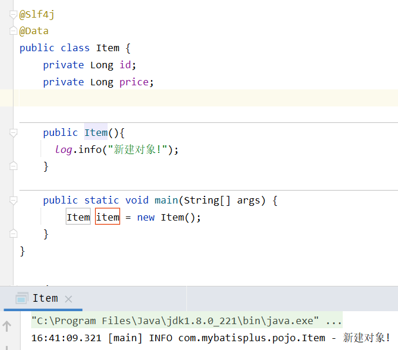

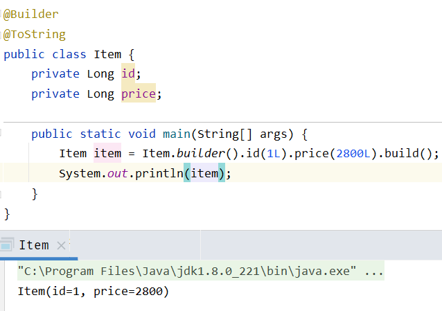

<div style="page-break-after:always" />

## 图像存储

在 `haoke-manage-api-server` 中实现图片上传功能，以供其他服务使用

-   图片存储解决方案的分析
-   阿里云OSS存储方案的实现
-   本地存储方案的实现

### 图片存储解决方案

开发一个图片上传服务，需要有存储的支持，那么我们的解决方案将以下几种 ：

-   直接将图片保存到服务的硬盘
    -   优点：开发便捷，成本低
    -   缺点：扩容困难
-   使用分布式文件系统进行存储
    -   优点：容器实现扩容
    -   缺点：开发复杂度大
-   使用nfs存储
    -   优点:开发较为便捷
    -   缺点：需要有一定的运维进行部署和维护
-   使用第三方的存储服务
    -   优点：开发简单，免维护
    -   缺点：付费

### 封装返回前端的数据PicUploadResult

https://ant.design/components/upload-cn/#components-upload-demo-picture-card

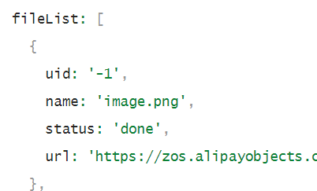

vo：用于返回给前端的数据结构定义

```java
package com.haoke.api.vo;
import lombok.Data;

@Data
public class PicUploadResult {
    // 文件唯一标识
    private String uid;
    // 文件名
    private String name;
    // 状态有：uploading done error removed
    private String status;
    // 服务端响应内容，如：'{"status": "success"}'
    private String response;
}
```

### 本地文件系统存储

#### 1. 编写Service

`PicUploadFileSystemService`

```java
package com.haoke.api.service;
import com.haoke.api.vo.PicUploadResult;

import org.joda.time.DateTime;
import org.springframework.stereotype.Service;
import org.springframework.web.multipart.MultipartFile;
import org.apache.commons.lang3.RandomUtils;
import org.apache.commons.lang3.StringUtils;
import javax.imageio.ImageIO;
import java.awt.image.BufferedImage;
import java.io.ByteArrayInputStream;
import java.io.File;
import java.io.IOException;
import java.util.Date;

@Service
public class PicUploadFileSystemService {
    // 允许上传的格式
    private static final String[] IMAGE_TYPE 
        = new String[]{ ".bmp", ".jpg",".jpeg", ".gif", ".png"};

    public PicUploadResult upload(MultipartFile uploadFile) {
        // 校验图片格式,属于图片，则允许上传
        boolean isLegal = false;
        for (String type : IMAGE_TYPE) {
            if(StringUtils.endsWithIgnoreCase
               (uploadFile.getOriginalFilename(),type)) {
                isLegal = true;
                break;
            }
        } 

        // 封装Result对象，并且将文件的byte数组放置到result对象中
        PicUploadResult fileUploadResult = new PicUploadResult();
        if (!isLegal) {
            fileUploadResult.setStatus("error");
            return fileUploadResult;
        }
        // 文件新路径
        String fileName = uploadFile.getOriginalFilename();
        String filePath = getFilePath(fileName);

        // 生成图片的绝对引用地址
        String picUrl = StringUtils.replace(
            StringUtils.substringAfter(
                filePath,"F:\\code\\haoke\\haoke-upload"),"\\", "/");
        fileUploadResult.setName("http://image.haoke.com" + picUrl);
        File newFile = new File(filePath);

        // 写文件到磁盘
        try {
            uploadFile.transferTo(newFile);
        } catch (IOException e) {
            e.printStackTrace();
            //上传失败
            fileUploadResult.setStatus("error");
            return fileUploadResult;
        } 
        fileUploadResult.setStatus("done");
        fileUploadResult.setUid(String.valueOf(System.currentTimeMillis()));
        return fileUploadResult;
    } 

    private String getFilePath(String sourceFileName) {
        String baseFolder = 
            "F:\\code\\haoke\\haoke-upload" + 
            File.separator + 
            "images";

        Date nowDate = new Date();
        // yyyy/MM/dd
        String fileFolder = baseFolder + 
            File.separator + 
            new DateTime(nowDate).toString("yyyy") + 
            File.separator + 
            new DateTime(nowDate).toString("MM") +
            File.separator + 
            new DateTime(nowDate).toString("dd");

        File file = new File(fileFolder);
        if (!file.isDirectory()) {
            // 如果目录不存在，则创建目录
            file.mkdirs();
        } 
        // 生成新的文件名
        String fileName = 
            new DateTime(nowDate).toString("yyyyMMddhhmmssSSSS") + 
            RandomUtils.nextInt(100, 9999) + 
            "." + 
            StringUtils.substringAfterLast(sourceFileName, ".");
        return fileFolder + File.separator + fileName;
    }
}
```

#### 2. 修改Controller中的引用

```java
package com.haoke.api.controller;
import com.haoke.api.service.PicUploadFileSystemService;
import com.haoke.api.service.PicUploadService;
import com.haoke.api.vo.PicUploadResult;

import com.fasterxml.jackson.databind.ObjectMapper;
import org.apache.commons.lang3.RandomUtils;
import org.apache.commons.lang3.StringUtils;
import org.slf4j.Logger;

import org.slf4j.LoggerFactory;
import org.springframework.beans.factory.annotation.Autowired;
import org.springframework.http.MediaType;
import org.springframework.stereotype.Controller;
import org.springframework.web.bind.annotation.*;
import org.springframework.web.multipart.MultipartFile;
import javax.imageio.ImageIO;
import javax.servlet.http.HttpServletResponse;
import java.awt.image.BufferedImage;
import java.io.File;
import java.io.IOException;

@RequestMapping("pic/upload")
@Controller
public class PicUploadController {
    @Autowired
    private PicUploadFileSystemService picUploadService;
    
    /**
    * @param uploadFile
    * @return
    * @throws Exception
    */
    @PostMapping
    @ResponseBody
    public PicUploadResult upload(@RequestParam("file") MultipartFile uploadFile)
        throws Exception {
        return this.picUploadService.upload(uploadFile);
    }
}
```

#### 3. 启动服务，测试接口

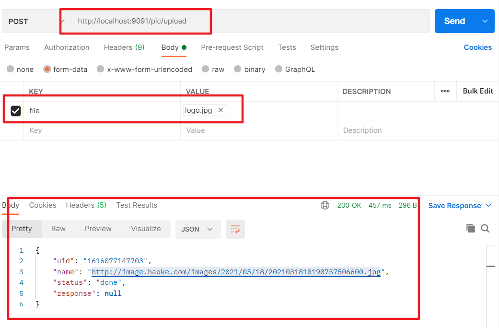

生成的链接是url链接，需要通过nginx进行访问映射

#### 4. 搭建nginx进行访问图片

##### 修改nginx配置文件

nginx目录/conf/nginx.conf

```conf
server {
        listen       80;
        server_name  image.haoke.com;

        #charset koi8-r;

        #access_log  logs/host.access.log  main;

        proxy_set_header X-Forwarded-Host $host;
        proxy_set_header X-Forwarded-Server $host;
        proxy_set_header X-Forwarded-For $proxy_add_x_forwarded_for;

        location / {
        root  E:\idea\graduateProject\code\upload;
        }
        
    }
```

##### 修改本机hosts环境

**没有修改C:\Windows\System32\drivers\etc\hosts的权限**

1.  打开C:\Windows\System32\drivers\etc\文件，找到hosts,然后分配所有权限。

2.  找到上面提的hosts文件，打开文件直接再保存原来路径下

3.  SwitchHosts!文件右击鼠标，点击管理员启动。

```conf
# 开发环境
127.0.0.1 manage.haoke.com
127.0.0.1 image.haoke.com
```


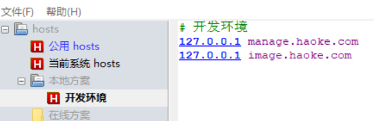

##### 启动nginx

```shell
cd nginx目录

start nginx.exe

# 停止nginx
nginx -s stop
```

#### 5. 访问链接，测试

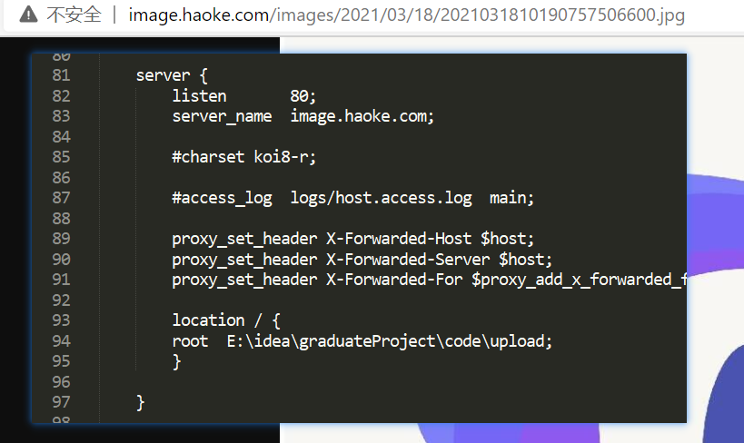

### 腾讯云COS

1.  在腾讯云 [对象存储控制台](https://console.cloud.tencent.com/cos5) 开通腾讯云对象存储（COS）服务。
2.  在腾讯云 [对象存储控制台](https://console.cloud.tencent.com/cos5) 创建一个 Bucket。
3.  在访问管理控制台中的 [API 密钥管理](https://console.cloud.tencent.com/cam/capi) 页面里获取 APPID，并创建 SecretId、SecretKey。

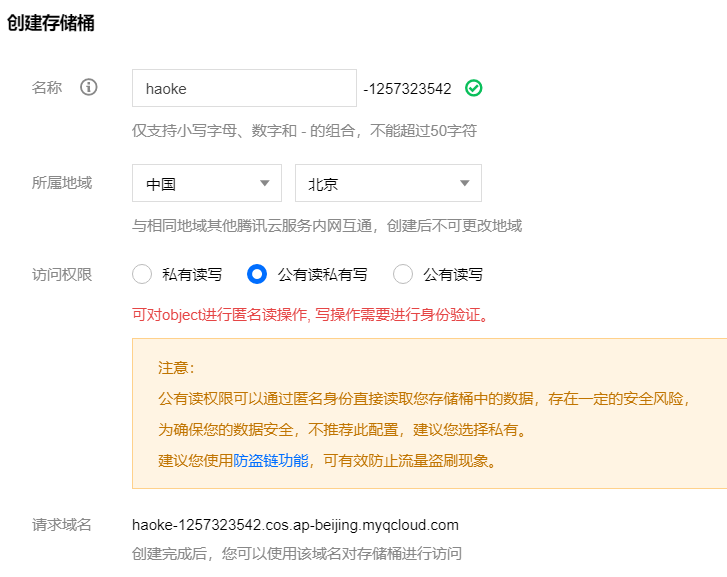

#### 1. 导入依赖

```xml
<!--导入腾讯云COS依赖-->
<dependency>
    <groupId>com.qcloud</groupId>
    <artifactId>cos_api</artifactId>
    <version>5.6.37</version>
</dependency>
<!--引入配置自动注入-->
<dependency>
    <groupId> org.springframework.boot </groupId>
    <artifactId> spring-boot-configuration-processor </artifactId>
    <optional> true </optional>
</dependency>
```

#### 2. 编写配置文件

```properties
# 子用户id
tencent.cos.appid=100018187662

#子用户key:id,key
tencent.cos.secret-id=AKIDlNkW6P8TLwNZXExxg9MIcaQMSKwHn32l
tencent.cos.secret-key=b3YEbhkX5MNK2VhfNULXZKG3cwzrW2HH

# 容器名
tencent.cos.bucket-name=haoke-1257323542

# 容器所属区
tencent.cos.region-id=ap-beijing

# 文件前缀
tencent.cos.base-url=https://haoke-1257323542.cos.ap-beijing.myqcloud.com
```

#### 3. CosConfig

```java
package com.haoke.api.config;

import com.qcloud.cos.COSClient;
import com.qcloud.cos.ClientConfig;
import com.qcloud.cos.auth.BasicCOSCredentials;
import com.qcloud.cos.auth.COSCredentials;
import com.qcloud.cos.region.Region;
import lombok.Data;
import org.springframework.boot.context.properties.ConfigurationProperties;
import org.springframework.context.annotation.Bean;
import org.springframework.context.annotation.Configuration;
import org.springframework.context.annotation.PropertySource;

@Data
@Configuration
@PropertySource(value = {"classpath:tencent.properties"})
@ConfigurationProperties(prefix = "tencent.cos")
public class CosConfig {
    private String appId;
    private String secretId;
    private String secretKey;
    private String bucketName;
    private String regionId;
    private String baseUrl;

    @Bean
    public COSClient cosClient() {
        //1. 初始化用户身份信息
        COSCredentials cred = new BasicCOSCredentials(this.secretId, this.secretKey);

        //2. 设置 bucket 的地域, COS 地域的简称请参照 https://cloud.tencent.com/document/product/436/6224
        ClientConfig clientConfig = new ClientConfig(new Region(this.regionId));

        //3. 生成cos客户端
        COSClient cosClient = new COSClient(cred,clientConfig);

        return  cosClient;
    }
}
```

#### 4. 编写Service

`PicUploadTencentService`

```java
package com.haoke.api.service;

import com.haoke.api.config.CosConfig;
import com.haoke.api.vo.PicUploadResult;
import com.qcloud.cos.COS;
import com.qcloud.cos.COSClient;
import org.apache.commons.lang3.RandomUtils;
import org.apache.commons.lang3.StringUtils;
import org.joda.time.DateTime;
import org.springframework.beans.factory.annotation.Autowired;
import org.springframework.stereotype.Service;
import org.springframework.web.multipart.MultipartFile;

import java.io.ByteArrayInputStream;
import java.io.File;

@Service
public class PicUploadTencentService {

    // 允许上传的格式
    private static final String[] IMAGE_TYPE
            = new String[] {".bmp", ".jpg",".jpeg", ".gif", ".png"};

    @Autowired
    private COSClient cosClient;//OSS客户端

    @Autowired
    private CosConfig cosConfig;

    public PicUploadResult upload(MultipartFile uploadFile) {
        // 校验图片格式
        boolean isLegal = false;
        for (String type : IMAGE_TYPE) {
            if (StringUtils.endsWithIgnoreCase(
                    uploadFile.getOriginalFilename(),type)) {
                //如果文件名的后缀为上述图片类型，则为合法文件，可以上传
                isLegal = true;
                break;
            }
        }

        // 封装Result对象，并且将文件的byte数组放置到result对象中
        PicUploadResult fileUploadResult = new PicUploadResult();
        if(!isLegal){
            fileUploadResult.setStatus("error");
            return fileUploadResult;
        }

        // 文件新路径
        String fileName = uploadFile.getOriginalFilename();
        String filePath = getFilePath(fileName);
        String[] filename = filePath.split("\\.");
        File localFile = null;

        // 以字节流上传到腾讯云COS
        try {
            localFile=File.createTempFile(filename[0], filename[1]);
            uploadFile.transferTo(localFile);
            localFile.deleteOnExit();

            cosClient.putObject(
                    cosConfig.getBucketName(),
                    filePath,
                    localFile
            );
        } catch (Exception e) {
            e.printStackTrace();
            //上传失败
            fileUploadResult.setStatus("error");
            return fileUploadResult;
        }

        cosClient.shutdown();
        //返回给umi的对象
        fileUploadResult.setStatus("done");
        fileUploadResult.setName(this.cosConfig.getBaseUrl() + filePath);
        fileUploadResult.setUid(String.valueOf(System.currentTimeMillis()));

        return fileUploadResult;
    }

    private String getFilePath(String fileName) {
        DateTime dateTime = new DateTime();

        return "images/" +
                dateTime.toString("yyyy")+
                "/" + dateTime.toString("MM") + "/" +
                dateTime.toString("dd") + "/" +
                System.currentTimeMillis() +
                RandomUtils.nextInt(100, 9999) + "." +
                StringUtils.substringAfterLast(fileName, ".");
    }
}
```

#### 5. Controller

```java
package com.haoke.api.controller;

import com.haoke.api.service.PicUploadFileSystemService;
import com.haoke.api.service.PicUploadTencentService;
import com.haoke.api.vo.PicUploadResult;
import org.springframework.beans.factory.annotation.Autowired;
import org.springframework.stereotype.Controller;
import org.springframework.web.bind.annotation.PostMapping;
import org.springframework.web.bind.annotation.RequestMapping;
import org.springframework.web.bind.annotation.RequestParam;
import org.springframework.web.bind.annotation.ResponseBody;
import org.springframework.web.multipart.MultipartFile;

@RequestMapping("pic/upload")
@Controller
public class PicUploadController {

    @Autowired
    private PicUploadTencentService picUploadTencentService;

    /*@Autowired
    private PicUploadFileSystemService picUploadService;
*/
    /**
     * @param uploadFile
     * @return
     * @throws Exception
     */
    @PostMapping
    @ResponseBody
    public PicUploadResult upload(@RequestParam("file") MultipartFile uploadFile)
            throws Exception {
        //return this.picUploadService.upload(uploadFile);

        return this.picUploadTencentService.upload(uploadFile);
    }
}
```

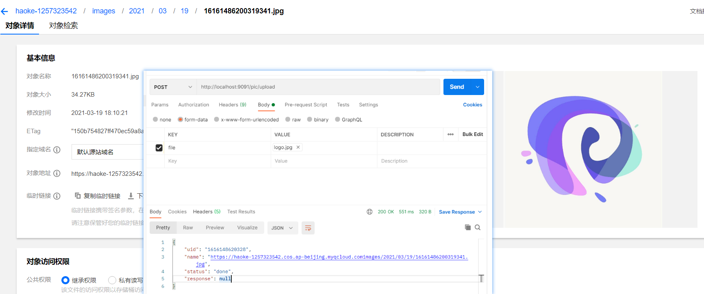

### 阿里OSS

#### 1. 导入依赖

```xml
<dependency>
    <groupId>com.aliyun.oss</groupId>
    <artifactId>aliyun-sdk-oss</artifactId>
    <version>2.8.3</version>
</dependency>
<dependency>
    <groupId>org.projectlombok</groupId>
    <artifactId>lombok</artifactId>
    <version>1.18.4</version>
</dependency>
<!-- 日期处理包 -->
<dependency>
    <groupId>joda-time</groupId>
    <artifactId>joda-time</artifactId>
    <version>2.9.9</version>
</dependency>
```

#### 2. 配置-aliyun.properties

```properties
# 地域节点
aliyun.endpoint=oss-cn-qingdao.aliyuncs.com

aliyun.accessKeyId=LTAIfC7fUsPj7Rfq
aliyun.accessKeySecret=c2Vo3q1AmivtY8lxFnfsCfkO2c2HCk

# 容器名
aliyun.bucketName=itcast-haoke

# 文件前缀
aliyun.urlPrefix=http://itcast-haoke.oss-cn-qingdao.aliyuncs.com/
```

[accessKey获取](https://help.aliyun.com/document_detail/53045.htm?spm=a2c4g.11186623.2.2.77d3259dXthYLs#concept-53045-zh)

#### 3. 编写AliConfig

```java
package com.haoke.api.config;

import com.aliyun.oss.OSS;
import com.aliyun.oss.OSSClient;
import lombok.Data;
import org.springframework.boot.context.properties.ConfigurationProperties;
import org.springframework.context.annotation.Bean;
import org.springframework.context.annotation.Configuration;
import org.springframework.context.annotation.PropertySource;

@Configuration
@PropertySource(value = {"classpath:aliyun.properties"})
//将properties资源文件中 前缀为 aliyun 的属性自动装配
@ConfigurationProperties(prefix = "aliyun")
@Data
public class AliyunConfig {
    private String endpoint;
    private String accessKeyId;
    private String accessKeySecret;
    private String bucketName;
    private String urlPrefix;
    
    @Bean
    public OSS oSSClient() {
        return new OSSClient(endpoint, accessKeyId, accessKeySecret);
    }
}
```

#### 4. 编写PicUploadService

具体的上传逻辑，在该类中调用OSS客户端的API

```java
package com.haoke.api.service;
import com.haoke.api.config.AliyunConfig;
import com.haoke.api.vo.PicUploadResult;

import com.aliyun.oss.OSS;
import org.joda.time.DateTime;
import org.springframework.beans.factory.annotation.Autowired;
import org.springframework.web.multipart.MultipartFile;
import org.apache.commons.lang3.RandomUtils;
import org.apache.commons.lang3.StringUtils;
import java.io.ByteArrayInputStream;

import org.springframework.stereotype.Service;

@Service
public class PicUploadService {
    // 允许上传的格式
    private static final String[] IMAGE_TYPE 
        = new String[] {".bmp", ".jpg",".jpeg", ".gif", ".png"};

    @Autowired
    private OSS ossClient;//OSS客户端

    @Autowired
    private AliyunConfig aliyunConfig;

    public PicUploadResult upload(MultipartFile uploadFile) {
        // 校验图片格式
        boolean isLegal = false;
        for (String type : IMAGE_TYPE) {
            if (StringUtils.endsWithIgnoreCase(
                uploadFile.getOriginalFilename(),type)) {
                //如果文件名的后缀为上述图片类型，则为合法文件，可以上传
                isLegal = true;
                break;
            }
        } 

        // 封装Result对象，并且将文件的byte数组放置到result对象中
        PicUploadResult fileUploadResult = new PicUploadResult();
        if(!isLegal){
            fileUploadResult.setStatus("error");
            return fileUploadResult;
        } 

        // 文件新路径
        String fileName = uploadFile.getOriginalFilename();
        String filePath = getFilePath(fileName);

        // 以字节流上传到阿里云
        try {
            ossClient.putObject(
                aliyunConfig.getBucketName(), 
                filePath, 
                new ByteArrayInputStream(uploadFile.getBytes())
            );
        } catch (Exception e) {
            e.printStackTrace();
            //上传失败
            fileUploadResult.setStatus("error");
            return fileUploadResult;
        } 

        //返回给umi的对象
        fileUploadResult.setStatus("done");
        fileUploadResult.setName(this.aliyunConfig.getUrlPrefix() + filePath);
        fileUploadResult.setUid(String.valueOf(System.currentTimeMillis()));

        return fileUploadResult;
    } 
    
    private String getFilePath(String sourceFileName) {
        DateTime dateTime = new DateTime();
        
        return "images/" + 
            dateTime.toString("yyyy")+ 
            "/" + dateTime.toString("MM") + "/" +
            dateTime.toString("dd") + "/" +
            System.currentTimeMillis() +
            RandomUtils.nextInt(100, 9999) + "." +
            StringUtils.substringAfterLast(sourceFileName, ".");
    }
}
```

#### 5. 编写PicUploadController

```java
package com.haoke.api.controller;

import com.haoke.api.service.PicUploadService;
import com.haoke.api.vo.PicUploadResult;

import com.fasterxml.jackson.databind.ObjectMapper;
import org.apache.commons.lang3.RandomUtils;
import org.apache.commons.lang3.StringUtils;
import org.slf4j.Logger;
import org.slf4j.LoggerFactory;
import org.springframework.beans.factory.annotation.Autowired;
import org.springframework.http.MediaType;
import org.springframework.stereotype.Controller;
import org.springframework.web.bind.annotation.*;
import org.springframework.web.multipart.MultipartFile;
import javax.imageio.ImageIO;
import javax.servlet.http.HttpServletResponse;
import java.awt.image.BufferedImage;
import java.io.File;
import java.io.IOException;

@RequestMapping("pic/upload")
@Controller
public class PicUploadController {
    
    @Autowired
    private PicUploadService picUploadService;
    /**
	 * @param uploadFile
	 * @return
	 * @throws Exception
	 */
    
    @PostMapping
    @ResponseBody
    public PicUploadResult upload(
        @RequestParam("file") MultipartFile uploadFile) 
        throws Exception 
    {
        return this.picUploadService.upload(uploadFile);
    }
}
```

<div style="page-break-after:always" />

## 搭建后台服务系统

后台服务系统采用SOA的架构思想，使用dubbo作为服务治理框架进行搭建

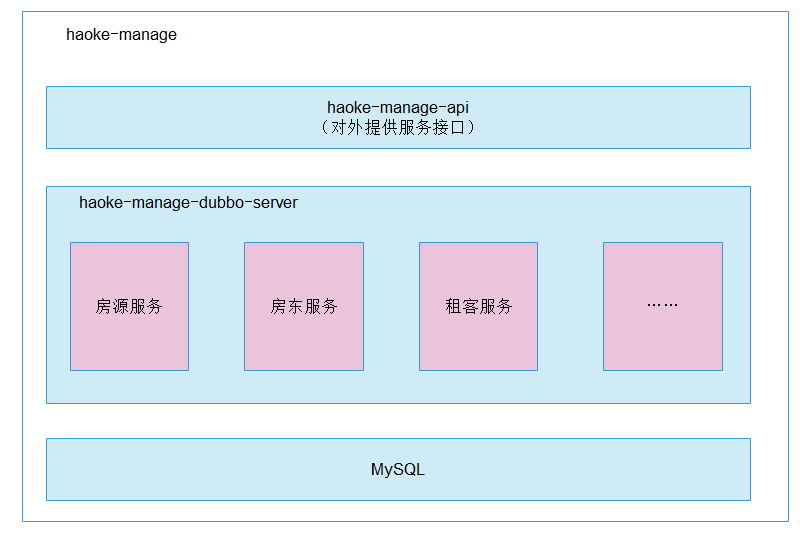

### 创建工程&添加依赖

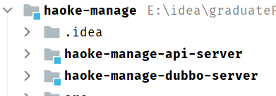

#### 父工程

```xml
<?xml version="1.0" encoding="UTF-8"?>
<project xmlns="http://maven.apache.org/POM/4.0.0"
         xmlns:xsi="http://www.w3.org/2001/XMLSchema-instance"
         xsi:schemaLocation="http://maven.apache.org/POM/4.0.0
         http://maven.apache.org/xsd/maven-4.0.0.xsd">
    <modelVersion>4.0.0</modelVersion>

    <groupId>com.haoke.manage</groupId>
    <artifactId>haoke-manage</artifactId>
    <packaging>pom</packaging>
    <version>1.0-SNAPSHOT</version>
    <modules>
        <module>haoke-manage-dubbo-server</module>
        <module>haoke-manage-api-server</module>
    </modules>

    <!--添加SpringBoot支持-->
    <parent>
        <artifactId>spring-boot-starter-parent</artifactId>
        <groupId>org.springframework.boot</groupId>
        <version>2.4.3</version>
    </parent>

    <dependencies>
        <!--springboot的测试支持-->
        <dependency>
            <groupId>org.springframework.boot</groupId>
            <artifactId>spring-boot-starter-test</artifactId>
            <version>2.4.3</version>
        </dependency>
        <dependency>
            <groupId>org.apache.commons</groupId>
            <artifactId>commons-lang3</artifactId>
        </dependency>

        <!--dubbo的springbboot支持-->
        <dependency>
            <groupId>com.alibaba.boot</groupId>
            <artifactId>dubbo-spring-boot-starter</artifactId>
            <version>0.2.0</version>
        </dependency>
        <!--dubbo框架-->
        <dependency>
            <groupId>com.alibaba</groupId>
            <artifactId>dubbo</artifactId>
            <version>2.6.4</version>
        </dependency>

        <!--zk依赖-->
        <dependency>
            <groupId>org.apache.zookeeper</groupId>
            <artifactId>zookeeper</artifactId>
            <version>3.4.13</version>
        </dependency>
        <dependency>
            <groupId>com.github.sgroschupf</groupId>
            <artifactId>zkclient</artifactId>
            <version>0.1</version>
        </dependency>
    </dependencies>

    <build>
        <plugins>
            <!--springboot的maven框架-->
            <plugin>
                <groupId>org.springframework.boot</groupId>
                <artifactId>spring-boot-maven-plugin</artifactId>
            </plugin>
        </plugins>
    </build>
</project>
```

#### 子工程

##### haoke-manage-api-server

```xml
<?xml version="1.0" encoding="UTF-8"?>
<project xmlns="http://maven.apache.org/POM/4.0.0"
         xmlns:xsi="http://www.w3.org/2001/XMLSchema-instance"
         xsi:schemaLocation="http://maven.apache.org/POM/4.0.0 http://maven.apache.org/xsd/maven-4.0.0.xsd">
    <parent>
        <artifactId>haoke-manage</artifactId>
        <groupId>com.haoke.manage</groupId>
        <version>1.0-SNAPSHOT</version>
    </parent>
    <modelVersion>4.0.0</modelVersion>

    <artifactId>haoke-manage-api-server</artifactId>

    <dependencies>
        <!--springboot的web支持-->
        <dependency>
            <groupId>org.springframework.boot</groupId>
            <artifactId>spring-boot-starter-web</artifactId>
        </dependency>
        <!--
            api模块———本模块，对外提供接口，作为dubbo的服务消费方
            interface模块————当前依赖，dubbo的服务提供方
        -->
        <dependency>
            <groupId>com.haoke.manage</groupId>
            <artifactId>haoke-manage-dubbo-server-house-resources-interface</artifactId>
            <version>1.0-SNAPSHOT</version>
        </dependency>
    </dependencies>
</project>
```

##### haoke-manage-dubbo-server

```xml
<?xml version="1.0" encoding="UTF-8"?>
<project xmlns="http://maven.apache.org/POM/4.0.0"
         xmlns:xsi="http://www.w3.org/2001/XMLSchema-instance"
         xsi:schemaLocation="http://maven.apache.org/POM/4.0.0 http://maven.apache.org/xsd/maven-4.0.0.xsd">
    <parent>
        <artifactId>haoke-manage</artifactId>
        <groupId>com.haoke.manage</groupId>
        <version>1.0-SNAPSHOT</version>
    </parent>
    <modelVersion>4.0.0</modelVersion>

    <packaging>pom</packaging>
    <modules>
        <module>haoke-manage-dubbo-server-house-resources</module>
        <module>haoke-manage-dubbo-server-generator</module>
    </modules>

    <artifactId>haoke-manage-dubbo-server</artifactId>

    <dependencies>
        <dependency>
            <groupId>org.springframework.boot</groupId>
            <artifactId>spring-boot-starter</artifactId>
        </dependency>

        <!--lombok-->
        <dependency>
            <groupId>org.projectlombok</groupId>
            <artifactId>lombok</artifactId>
        </dependency>
    </dependencies>

</project>
```

### 新增房源

#### 创建数据表

```sql
use haoke;

DROP TABLE IF EXISTS `tb_estate`;

CREATE TABLE `tb_estate` (
  `id` bigint NOT NULL AUTO_INCREMENT,
  `name` varchar(100) DEFAULT NULL COMMENT '楼盘名称',
  `province` varchar(10) DEFAULT NULL COMMENT '所在省',
  `city` varchar(10) DEFAULT NULL COMMENT '所在市',
  `area` varchar(10) DEFAULT NULL COMMENT '所在区',
  `address` varchar(100) DEFAULT NULL COMMENT '具体地址',
  `year` varchar(10) DEFAULT NULL COMMENT '建筑年代',
  `type` varchar(10) DEFAULT NULL COMMENT '建筑类型',
  `property_cost` varchar(10) DEFAULT NULL COMMENT '物业费',
  `property_company` varchar(20) DEFAULT NULL COMMENT '物业公司',
  `developers` varchar(20) DEFAULT NULL COMMENT '开发商',
  `created` datetime DEFAULT NULL COMMENT '创建时间',
  `updated` datetime DEFAULT NULL COMMENT '更新时间',
  PRIMARY KEY (`id`)
) ENGINE=InnoDB AUTO_INCREMENT=1006 DEFAULT CHARSET=utf8 COMMENT='楼盘表';

INSERT INTO `tb_estate` VALUES 
(1001,'中远两湾城','上海市','上海市','普陀区','远景路97弄','2001','塔楼/板楼','1.5','上海中远物业管理发展有限公司','上海万业企业股份有限公司','2021-03-16 23:00:20','2021-03-16 23:00:20'),
(1002,'上海康城','上海市','上海市','闵行区','莘松路958弄','2001','塔楼/板楼','1.5','盛孚物业','闵行房地产','2021-03-16 23:00:20','2021-03-16 23:00:20'),
(1003,'保利西子湾','上海市','上海市','松江区','广富林路1188弄','2008','塔楼/板楼','1.75','上海保利物业管理','上海城乾房地产开发有限公司','2021-03-16 23:00:20','2021-03-16 23:00:20'),
(1004,'万科城市花园','上海市','上海市','松江区','广富林路1188弄','2002','塔楼/板楼','1.5','上海保利物业管理','上海城乾房地产开发有限公司','2021-03-16 23:00:20','2021-03-16 23:00:20'),
(1005,'上海阳城','上海市','上海市','闵行区','罗锦路888弄','2002','塔楼/板楼','1.5','上海莲阳物业管理有限公司','上海莲城房地产开发有限公司','2021-03-16 23:00:20','2021-03-16 23:00:20');


CREATE TABLE `tb_house_resources` (
  `id` bigint(20) NOT NULL AUTO_INCREMENT,
  `title` varchar(100) DEFAULT NULL COMMENT '房源标题',
  `estate_id` bigint(20) DEFAULT NULL COMMENT '楼盘id',
  `building_num` varchar(5) DEFAULT NULL COMMENT '楼号（栋）',
  `building_unit` varchar(5) DEFAULT NULL COMMENT '单元号',
  `building_floor_num` varchar(5) DEFAULT NULL COMMENT '门牌号',
  `rent` int(10) DEFAULT NULL COMMENT '租金',
  `rent_method` tinyint(1) DEFAULT NULL COMMENT '租赁方式，1-整租，2-合租',
  `payment_method` tinyint(1) DEFAULT NULL COMMENT '支付方式，1-付一押一，2-付三押一，3-付六押一，4-年付押一，5-其它',
  `house_type` varchar(255) DEFAULT NULL COMMENT '户型，如：2室1厅1卫',
  `covered_area` varchar(10) DEFAULT NULL COMMENT '建筑面积',
  `use_area` varchar(10) DEFAULT NULL COMMENT '使用面积',
  `floor` varchar(10) DEFAULT NULL COMMENT '楼层，如：8/26',
  `orientation` varchar(2) DEFAULT NULL COMMENT '朝向：东、南、西、北',
  `decoration` tinyint(1) DEFAULT NULL COMMENT '装修，1-精装，2-简装，3-毛坯',
  `facilities` varchar(50) DEFAULT NULL COMMENT '配套设施， 如：1,2,3',
  `pic` varchar(200) DEFAULT NULL COMMENT '图片，最多5张',
  `house_desc` varchar(200) DEFAULT NULL COMMENT '描述',
  `contact` varchar(10) DEFAULT NULL COMMENT '联系人',
  `mobile` varchar(11) DEFAULT NULL COMMENT '手机号',
  `time` tinyint(1) DEFAULT NULL COMMENT '看房时间，1-上午，2-中午，3-下午，4-晚上，5-全天',
  `property_cost` varchar(10) DEFAULT NULL COMMENT '物业费',
  `created` datetime DEFAULT NULL,
  `updated` datetime DEFAULT NULL,
  PRIMARY KEY (`id`)
) ENGINE=InnoDB AUTO_INCREMENT=1 DEFAULT CHARSET=utf8 COMMENT='房源表';
```

#### 项目结构

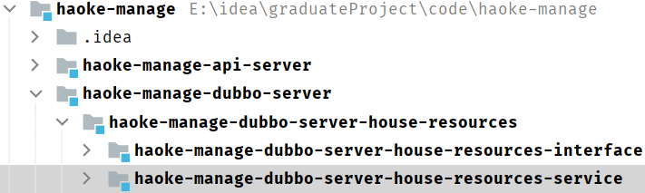

-   haoke-manage-dubbo-server-house-resources-interface
    -   对外提供的SDK包
    -   只提供pojo实体类以及接口
-   haoke-manage-dubbo-server-house-resources-service
    -   具体实现

##### haoke-manage-dubbo-server-house-resources

```xml
<?xml version="1.0" encoding="UTF-8"?>
<project xmlns="http://maven.apache.org/POM/4.0.0"
         xmlns:xsi="http://www.w3.org/2001/XMLSchema-instance"
         xsi:schemaLocation="http://maven.apache.org/POM/4.0.0 http://maven.apache.org/xsd/maven-4.0.0.xsd">
    <parent>
        <artifactId>haoke-manage-dubbo-server</artifactId>
        <groupId>com.haoke.manage</groupId>
        <version>1.0-SNAPSHOT</version>
    </parent>
    <modelVersion>4.0.0</modelVersion>

    <artifactId>haoke-manage-dubbo-server-house-resources</artifactId>
    <packaging>pom</packaging>
    <modules>
        <module>haoke-manage-dubbo-server-house-resources-interface</module>
        <module>haoke-manage-dubbo-server-house-resources-service</module>
    </modules>

    <dependencies>
        <dependency>
            <groupId>com.baomidou</groupId>
            <artifactId>mybatis-plus-boot-starter</artifactId>
            <version>3.4.2</version>
        </dependency>
        <dependency>
            <groupId>mysql</groupId>
            <artifactId>mysql-connector-java</artifactId>
            <version>8.0.16</version>
        </dependency>
    </dependencies>
</project>
```

###### haoke-manage-dubbo-server-house-resources-interface

```xml
<?xml version="1.0" encoding="UTF-8"?>
<project xmlns="http://maven.apache.org/POM/4.0.0"
         xmlns:xsi="http://www.w3.org/2001/XMLSchema-instance"
         xsi:schemaLocation="http://maven.apache.org/POM/4.0.0 http://maven.apache.org/xsd/maven-4.0.0.xsd">
    <parent>
        <artifactId>haoke-manage-dubbo-server-house-resources</artifactId>
        <groupId>com.haoke.manage</groupId>
        <version>1.0-SNAPSHOT</version>
    </parent>
    <modelVersion>4.0.0</modelVersion>

    <artifactId>haoke-manage-dubbo-server-house-resources-interface</artifactId>

</project>
```

###### haoke-manage-dubbo-server-house-resources-service

```xml
<?xml version="1.0" encoding="UTF-8"?>
<project xmlns="http://maven.apache.org/POM/4.0.0"
         xmlns:xsi="http://www.w3.org/2001/XMLSchema-instance"
         xsi:schemaLocation="http://maven.apache.org/POM/4.0.0 http://maven.apache.org/xsd/maven-4.0.0.xsd">
    <parent>
        <artifactId>haoke-manage-dubbo-server-house-resources</artifactId>
        <groupId>com.haoke.manage</groupId>
        <version>1.0-SNAPSHOT</version>
    </parent>
    <modelVersion>4.0.0</modelVersion>

    <artifactId>haoke-manage-dubbo-server-house-resources-service</artifactId>

    <dependencies>
        <dependency>
            <groupId>org.springframework.boot</groupId>
            <artifactId>spring-boot-starter-jdbc</artifactId>
        </dependency>
        <dependency>
            <groupId>com.haoke.manage</groupId>
            <artifactId>haoke-manage-dubbo-server-house-resources-interface</artifactId>
            <version>1.0-SNAPSHOT</version>
        </dependency>
    </dependencies>
</project>
```

#### 使用MybatisPlus的AutoGenerator插件生成POJO文件

>   mybatis-plus的AutoGenerator插件根据 数据库中的表结构 生成相应的POJO类

##### BasePOJO

编写BasePojo，所有的pojo类都要继承该类，在该类中定义了created、updated字段，表明在每一个表中都需要有这2个字段 

```java
package com.haoke.dubbo.server.pojo;

import lombok.Data;

import java.io.Serializable;
import java.util.Date;

@Data
public abstract class BasePojo implements Serializable {
    private Date created;
    private Date updated;
}
```

##### POJO—HouseResources

###### 创建haoke-manage-dubbo-server-generator工程

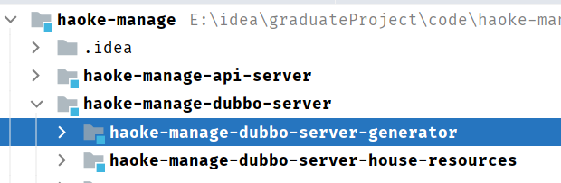

```xml
<?xml version="1.0" encoding="UTF-8"?>
<project xmlns="http://maven.apache.org/POM/4.0.0"
         xmlns:xsi="http://www.w3.org/2001/XMLSchema-instance"
         xsi:schemaLocation="http://maven.apache.org/POM/4.0.0 http://maven.apache.org/xsd/maven-4.0.0.xsd">
    <parent>
        <artifactId>haoke-manage-dubbo-server</artifactId>
        <groupId>com.haoke.manage</groupId>
        <version>1.0-SNAPSHOT</version>
    </parent>
    <modelVersion>4.0.0</modelVersion>

    <artifactId>haoke-manage-dubbo-server-generator</artifactId>

    <dependencies>
        <!--代码生成引擎 freemarker-->
        <dependency>
            <groupId>org.freemarker</groupId>
            <artifactId>freemarker</artifactId>
        </dependency>

        <!-- mybatis-plus插件 -->
        <dependency>
            <groupId>com.baomidou</groupId>
            <artifactId>mybatis-plus-core</artifactId>
            <version>3.4.2</version>
        </dependency>
        <dependency>
            <groupId>com.baomidou</groupId>
            <artifactId>mybatis-plus-generator</artifactId>
            <version>3.4.1</version>
        </dependency>
    </dependencies>
</project>
```

###### 编写CodeGenerator

```java
package com.haoke.generator;

import com.alibaba.dubbo.common.utils.StringUtils;
import com.baomidou.mybatisplus.core.exceptions.MybatisPlusException;
import com.baomidou.mybatisplus.core.toolkit.StringPool;
import com.baomidou.mybatisplus.generator.AutoGenerator;
import com.baomidou.mybatisplus.generator.InjectionConfig;
import com.baomidou.mybatisplus.generator.config.*;
import com.baomidou.mybatisplus.generator.config.rules.NamingStrategy;
import com.baomidou.mybatisplus.generator.engine.FreemarkerTemplateEngine;
import com.baomidou.mybatisplus.generator.config.po.TableInfo;

import java.util.ArrayList;
import java.util.List;
import java.util.Scanner;

public class CodeGenerator {
    /**
     * 读取控制台内容
     */
    public static String scanner(String tip) {
        Scanner scanner = new Scanner(System.in);
        StringBuilder help = new StringBuilder();
        help.append("请输入" + tip + "：");
        System.out.println(help.toString());
        if (scanner.hasNext()) {
            String ipt = scanner.next();
            if (StringUtils.isNotEmpty(ipt)) {
                return ipt;
            }
        }
        throw new MybatisPlusException("请输入正确的" + tip + "！");
    }

    public static void main(String[] args) {
        // 代码生成器
        AutoGenerator mpg = new AutoGenerator();

        // 全局配置
        GlobalConfig gc = new GlobalConfig();
        String projectPath = System.getProperty("user.dir");
        gc.setOutputDir(projectPath + "/src/main/java");
        gc.setAuthor("AuspiceTian");
        gc.setOpen(false);
        mpg.setGlobalConfig(gc);

        // 数据源配置
        DataSourceConfig dsc = new DataSourceConfig();
        dsc.setUrl("jdbc:mysql://8.140.130.91:3306/haoke?characterEncoding=utf8&useSSL=false&serverTimezone=UTC");
        // dsc.setSchemaName("public");
        dsc.setDriverName("com.mysql.cj.jdbc.Driver");
        dsc.setUsername("root");
        dsc.setPassword("root");
        mpg.setDataSource(dsc);

        // 目标包配置
        PackageConfig pc = new PackageConfig();
        pc.setModuleName(scanner("模块名"));
        pc.setParent("com.haoke.dubbo.server");
        mpg.setPackageInfo(pc);

        // 自定义配置
        InjectionConfig cfg = new InjectionConfig(){
            @Override
            public void initMap() {

            }
        };
        List<FileOutConfig> focList = new ArrayList<>();
        focList.add(new FileOutConfig("/templates/mapper.xml.ftl") {
            @Override
            public String outputFile(TableInfo tableInfo) {
                // 自定义输入文件名称
                return projectPath + "/src/main/resources/mapper/" +
                        pc.getModuleName()
                        + "/" + tableInfo.getEntityName() + "Mapper" +
                        StringPool.DOT_XML;
            }
        });
        cfg.setFileOutConfigList(focList);
        mpg.setCfg(cfg);
        mpg.setTemplate(new TemplateConfig().setXml(null));

        // 策略配置
        StrategyConfig strategy = new StrategyConfig();
        strategy.setNaming(NamingStrategy.underline_to_camel);
        strategy.setColumnNaming(NamingStrategy.underline_to_camel);
        strategy.setSuperEntityClass("com.haoke.dubbo.server.pojo.BasePojo");
        strategy.setEntityLombokModel(true);
        strategy.setRestControllerStyle(true);
        strategy.setInclude(scanner("表名"));
        strategy.setSuperEntityColumns("id");
        strategy.setControllerMappingHyphenStyle(true);
        strategy.setTablePrefix(pc.getModuleName() + "_");
        mpg.setStrategy(strategy);
        mpg.setTemplateEngine(new FreemarkerTemplateEngine());
        mpg.execute();
    }
}
```

###### 运行代码

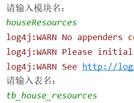

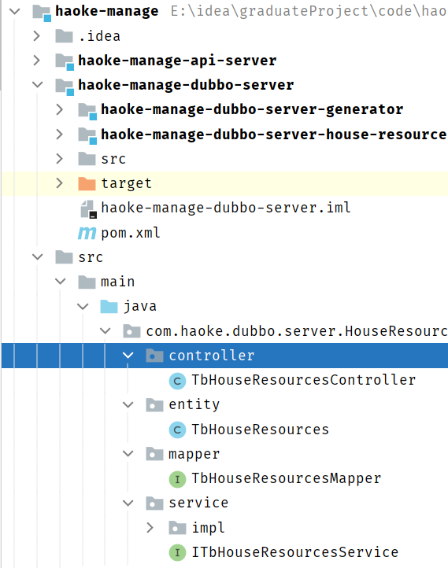

只需要entity (pojo)

-   @EqualsAndHashCode(callSuper = true)
    -   自动生成equals和 hashcode 方法，一般不需要，所以去掉
-   @Accessors(chain = true)
    -   表示，生成的set方法将采用链式编程方式

###### 将生成的entity放到com.haoke.dubbo.server.pojo下

```java
package com.haoke.dubbo.server.pojo;

import com.baomidou.mybatisplus.annotation.TableName;
import lombok.Data;
import lombok.EqualsAndHashCode;

@Data
@EqualsAndHashCode(callSuper = true)
@TableName("tb_house_resources")
public class HouseResources extends BasePojo {
    
    private static final long serialVersionUID = -2471649692631014216L;
    
    /**
     * 房源标题
     */
    private String title;

    /**
     * 楼盘id
     */
    private Long estateId;

    /**
     * 楼号（栋）
     */
    private String buildingNum;

    /**
     * 单元号
     */
    private String buildingUnit;

    /**
     * 门牌号
     */
    private String buildingFloorNum;

    /**
     * 租金
     */
    private Integer rent;

    /**
     * 租赁方式，1-整租，2-合租
     */
    private Integer rentMethod;

    /**
     * 支付方式，1-付一押一，2-付三押一，3-付六押一，4-年付押一，5-其它
     */
    private Integer paymentMethod;

    /**
     * 户型，如：2室1厅1卫
     */
    private String houseType;

    /**
     * 建筑面积
     */
    private String coveredArea;

    /**
     * 使用面积
     */
    private String useArea;

    /**
     * 楼层，如：8/26
     */
    private String floor;

    /**
     * 朝向：东、南、西、北
     */
    private String orientation;

    /**
     * 装修，1-精装，2-简装，3-毛坯
     */
    private Integer decoration;

    /**
     * 配套设施， 如：1,2,3
     */
    private String facilities;

    /**
     * 图片，最多5张
     */
    private String pic;

    /**
     * 描述
     */
    private String houseDesc;

    /**
     * 联系人
     */
    private String contact;

    /**
     * 手机号
     */
    private String mobile;

    /**
     * 看房时间，1-上午，2-中午，3-下午，4-晚上，5-全天
     */
    private Integer time;

    /**
     * 物业费
     */
    private String propertyCost;
}
```

#### 定义服务提供方接口

```java
//haoke-manage-dubbo-server-house-resources-interface
package com.haoke.server.api;

import com.haoke.server.pojo.HouseResources;

public interface ApiHouseResourcesService {

    /**
     * @param houseResources
     *
     * @return -1:输入的参数不符合要求，0：数据插入数据库失败，1：成功
     */
    int saveHouseResources(HouseResources houseResources);
}
```

#### 实现新增房源服务

>   创建SpringBoot应用，实现新增房源服务


##### 编写application.preperties

```properties
# Spring boot application
spring.application.name = haoke-manage-dubbo-server-house-resources

# 数据库
spring.datasource.driver-class-name=com.mysql.cj.jdbc.Driver
spring.datasource.url=jdbc:mysql://8.140.130.91:3306/haoke?characterEncoding=utf8&useSSL=false&serverTimezone=UTC
spring.datasource.username=root
spring.datasource.password=root

# 服务的扫描包
dubbo.scan.basePackages = com.haoke.server.api

# 应用名称
dubbo.application.name = dubbo-provider-house-resources
dubbo.service.version = 1.0.0

# 协议以及端口
dubbo.protocol.name = dubbo
dubbo.protocol.port = 20880

# zk注册中心
dubbo.registry.address = zookeeper://8.140.130.91:2181
dubbo.registry.client = zkclient
```

##### 编写HouseResourcesMapper接口

```java
package com.haoke.server.mapper;

import com.baomidou.mybatisplus.core.mapper.BaseMapper;
import com.haoke.dubbo.server.pojo.HouseResources;

public interface HouseResourcesMapper extends BaseMapper<HouseResources> {}
```

##### 编写MybatisPlus配置类

```java
package com.haoke.server.config;

import org.mybatis.spring.annotation.MapperScan;
import org.springframework.context.annotation.Configuration;

@MapperScan("com.haoke.server.mapper")
@Configuration
public class MybatisPlusConfig {}
```

##### 编写Service

**此处实现的是spring的服务，为dubbo服务的具体实现细节，无需对外暴露，同时需要进行事务控制和其他判断逻辑**

###### 定义接口

```java
package com.haoke.server.service;

import com.haoke.server.pojo.HouseResources;

public interface HouseResourcesService {
    /**
     *
     * @param houseResources
     * @return -1:输入的参数不符合要求，0：数据插入数据库失败，1：成功
     */
    int saveHouseResources(HouseResources houseResources);
}
```

###### 编写实现类

-   通用CRUD实现

```java
package com.haoke.server.service.impl;

import com.baomidou.mybatisplus.core.conditions.query.QueryWrapper;
import com.baomidou.mybatisplus.core.mapper.BaseMapper;
import com.baomidou.mybatisplus.core.metadata.IPage;
import com.baomidou.mybatisplus.extension.plugins.pagination.Page;
import com.haoke.dubbo.server.pojo.BasePojo;
import org.springframework.beans.factory.annotation.Autowired;

import java.util.Date;
import java.util.List;

public class BaseServiceImpl<T extends BasePojo>{

    @Autowired
    private BaseMapper<T> mapper;

    /**
     * 根据id查询数据
     * @param id
     * @return
     */
    public T queryById(Long id) {
        return this.mapper.selectById(id);
    }

    /**
     * 查询所有数据
     *
     * @return
     */
    public List<T> queryAll() {
        return this.mapper.selectList(null);
    }

    /**
     * 根据条件查询一条数据
     *
     * @param record
     * @return
     */
    public T queryOne(T record) {
        return this.mapper.selectOne(new QueryWrapper<>(record));
    }

    /**
     * 根据条件查询数据列表
     * @param record
     * @return
     */
    public List<T> queryListByWhere(T record) {
        return this.mapper.selectList(new QueryWrapper<>(record));
    }

    /**
     * 根据条件分页查询数据列表
     * @param record
     * @param page
     * @param rows
     * @return
     * */
    public IPage<T> queryPageListByWhere(T record, Integer page, Integer rows) {
    // 获取分页数据
        return this.mapper.selectPage(new Page<T>(page, rows), new QueryWrapper<>
                (record));
    }

    /**
     * 保存数据
     *
     * @param record
     * @return
     */
    public Integer save(T record) {
        record.setCreated(new Date());
        record.setUpdated(record.getCreated());
        return this.mapper.insert(record);
    }
    /**
     * 更新数据
     * @param record
     * @return
     */
    public Integer update(T record) {
        record.setUpdated(new Date());
        return this.mapper.updateById(record);
    }
    /**
     * 根据id删除数据
     * @param id
     * @return
     */
    public Integer deleteById(Long id) {
        return this.mapper.deleteById(id);
    }

    /**
     * 根据ids批量删除数据
     * @param ids
     * @return
     */
    public Integer deleteByIds(List<Long> ids) {
        return this.mapper.deleteBatchIds(ids);
    }

    /**
     * 根据条件删除数据
     * @param record
     * @return
     */
    public Integer deleteByWhere(T record){
        return this.mapper.delete(new QueryWrapper<>(record));
    }
}
```

-   房源相关实现类——HouseResourcesImpl

```java
package com.haoke.server.service.impl;

import com.alibaba.dubbo.common.utils.StringUtils;
import com.haoke.server.pojo.HouseResources;
import com.haoke.server.service.HouseResourcesService;
import org.springframework.stereotype.Service;
import org.springframework.transaction.annotation.Transactional;

@Transactional//这是Spring的服务
@Service//开启事务
public class HouseResourcesServiceImpl
        extends BaseServiceImpl
        implements HouseResourcesService {
    @Override
    public int saveHouseResources(HouseResources houseResources) {
        // 编写校验逻辑，如果校验不通过，返回-1
        if (StringUtils.isBlank(houseResources.getTitle())) {
            return -1;
        }

        //其他校验以及逻辑省略 ……

        return super.save(houseResources);
    }
}
```

#### 服务提供方实现

暴露新增房源的dubbo服务

```java
package com.haoke.server.api;

import com.alibaba.dubbo.config.annotation.Service;
import com.haoke.server.pojo.HouseResources;
import com.haoke.server.service.HouseResourcesService;
import org.springframework.beans.factory.annotation.Autowired;

//实现Dubbo，对外暴露服务
@Service(version = "${dubbo.service.version}")
public class ApiHoukeResourcesImpl implements ApiHouseResourcesService{

    @Autowired
    private HouseResourcesService resourcesService;

    @Override
    public int saveHouseResources(HouseResources houseResources) {
        return this.resourcesService.saveHouseResources(houseResources);
    }
}
```

##### Dubbo启动类

```java
package com.haoke.server;

import org.springframework.boot.WebApplicationType;
import org.springframework.boot.autoconfigure.SpringBootApplication;
import org.springframework.boot.builder.SpringApplicationBuilder;

@SpringBootApplication
public class DubboProvider {

    public static void main(String[] args) {
        new SpringApplicationBuilder(DubboProvider.class)
                .web(WebApplicationType.NONE)//不是web应用
                .run(args);
    }
}
```

##### 启用DubboAdmin

```shell
cd /opt/incubator-dubbo-ops/

mvn --projects dubbo-admin-server spring-boot:run
```

##### 查询dubbo服务提供方

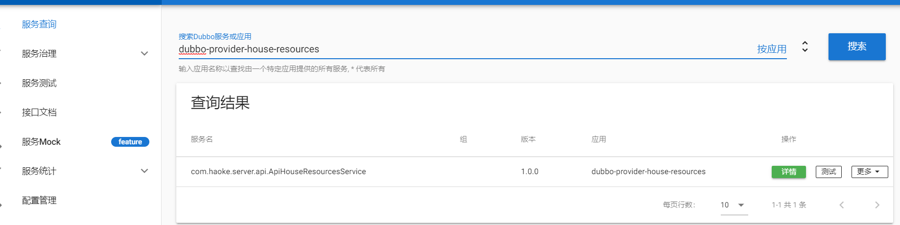

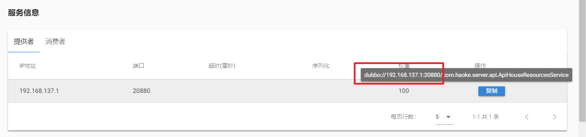

dubbo-provider-house-resources,端口为20880

#### 服务消费方——RESTful接口

haoke-manage-api-server工程

-   为前端系统提供接口服务
-   dubbo的消费方


##### 添加依赖

因为dubbo是消费方，需要添加dubbo提供方提供的接口、pojo的依赖

```xml
<dependencies>
    <!--springboot的web支持-->
    <dependency>
        <groupId>org.springframework.boot</groupId>
        <artifactId>spring-boot-starter-web</artifactId>
    </dependency>
    <!--
		api模块———本模块，对外提供接口，作为dubbo的服务消费方
        interface模块————当前依赖，dubbo的服务提供方
	-->
    <dependency>
        <groupId>com.haoke.manage</groupId>
        <artifactId>haoke-manage-dubbo-server-house-resources-interface</artifactId>
        <version>1.0-SNAPSHOT</version>
    </dependency>
</dependencies>
```

##### 编写service

HouseResourceService用于调用dubbo服务

```java
package com.haoke.api.service;

import com.alibaba.dubbo.config.annotation.Reference;
import com.haoke.server.api.ApiHouseResourcesService;
import com.haoke.server.pojo.HouseResources;
import org.springframework.stereotype.Service;

@Service//服务消费方
public class HouseResourceService {

    @Reference(version = "${dubbo.service.version}")
    private ApiHouseResourcesService apiHouseResourcesService;

    public boolean save(HouseResources houseResources){
        int result = this.apiHouseResourcesService.saveHouseResources(houseResources);

        return result==1;
    }
}
```

##### 控制层

```java
package com.haoke.api.controller;

import com.haoke.api.service.HouseResourceService;
import com.haoke.server.pojo.HouseResources;
import org.springframework.beans.factory.annotation.Autowired;
import org.springframework.http.HttpStatus;
import org.springframework.http.ResponseEntity;
import org.springframework.stereotype.Controller;
import org.springframework.web.bind.annotation.*;

@RequestMapping("house/resources")
@Controller
public class HouseResourcesController {

    @Autowired
    private HouseResourceService houseResourceService;

    /**
     * 新增房源
     *
     * @param houseResources json数据
     * @return
     */
    @PostMapping
    @ResponseBody
    public ResponseEntity<Void> save(@RequestBody HouseResources houseResources){
        try {
            boolean bool = this.houseResourceService.save(houseResources);
            if(bool){
                return ResponseEntity.status(HttpStatus.CREATED).build();
            }
        } catch (Exception e) {
            e.printStackTrace();
        }
        return ResponseEntity.status(HttpStatus.INTERNAL_SERVER_ERROR).build();
    }

    /**
     * test
     * @return
     */
    @GetMapping
    @ResponseBody
    public ResponseEntity<String> get(){
        System.out.println("get House Resources");
        return ResponseEntity.ok("ok");
    }
}
```

##### 测试程序

```java
package com.haoke.api;

import org.springframework.boot.SpringApplication;
import org.springframework.boot.autoconfigure.SpringBootApplication;

@SpringBootApplication(exclude = {DataSourceAutoConfiguration.class})
public class DubboApiApplication {
    public static void main(String[] args) {
        SpringApplication.run(DubboApiApplication.class, args);
    }
}
```

##### 消费方配置文件

```properties
# Spring boot application
spring.application.name = haoke-manage-api-server
server.port = 9091

#logging.level.root=DEBUG

# 应用名称
dubbo.application.name = dubbo-consumer-haoke-manage

# zk注册中心
dubbo.registry.address = zookeeper://8.140.130.91:2181
dubbo.registry.client = zkclient

dubbo.service.version = 1.0.0
```

##### 测试接口

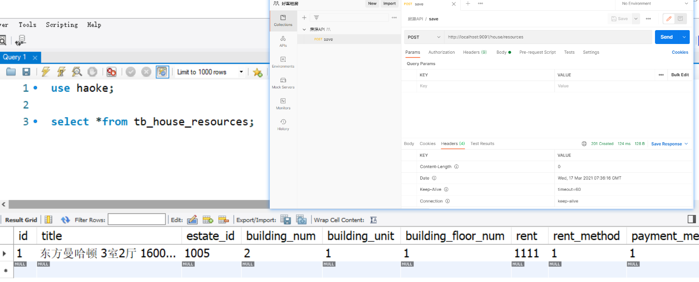

#### 新增接口前后端整合

##### 增加model

新建 **models** 文件夹

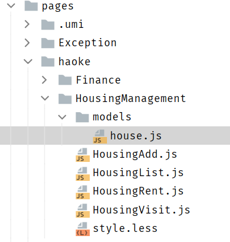

```js
import { routerRedux } from 'dva/router';
import { message } from 'antd';
import { addHouseResource } from '@/services/haoke/haoke';

export default {
  namespace: 'house',

  state: {
  },

  effects: {
    *submitHouseForm({ payload }, { call }) {
      console.log("page model")
      yield call(addHouseResource, payload);
      message.success('提交成功');
    }
  },

  reducers: {

  },
};
```

##### 增加services

```js
import request from '@/utils/request';

export async function addHouseResource(params) {
  return request('/haoke/house/resources', {
    method: 'POST',
    body: params
  });
}
```

##### 修改表单提交地址

```jsx
handleSubmit = e => {
    const { dispatch, form } = this.props;
    e.preventDefault();
    form.validateFieldsAndScroll((err, values) => {
        if (!err) {
            if(values.facilities){
                values.facilities = values.facilities.join(",");
            }
            if(values.floor_1 && values.floor_2){
                values.floor = `${values.floor_1  }/${  values.floor_2}`;

            }

            values.houseType = `${values.houseType_1  }室${  values.houseType_2  }厅${
            values.houseType_3  }卫${  values.houseType_4  }厨${
            values.houseType_2  }阳台`;
            delete values.floor_1;
            delete values.floor_2;
            delete values.houseType_1;
            delete values.houseType_2;
            delete values.houseType_3;
            delete values.houseType_4;
            delete values.houseType_5;
            dispatch({
                type: 'house/submitHouseForm',
                payload: values,
            });
        }
    });
};
```

##### 通过反向代理解决跨域问题

https://umijs.org/zh-CN/config#proxy

```json
proxy: {
    '/haoke/': {
        target: 'http://127.0.0.1:9091',//目标地址
        changeOrigin: true,
        pathRewrite: { '^/haoke/': '' },//路径覆盖
    },
},
```

代理效果：

请求：http://localhost:8000/haoke/house/resources  

实际：http://127.0.0.1:9091/house/resources  

#### 图像上传前后端整合

##### 1. 修改PicturesWall.js

```jsx
<Upload
    action="/haoke/pic/upload"
    listType="picture-card"
    fileList={fileList}
    onPreview={this.handlePreview}
    onChange={this.handleChange}
    >
```

##### 2. 修改AddResources.js

```js
handleFileList = (obj)=>{
    const pics = new Set();
    obj.forEach((v, k) => {
        if(v.response){
            pics.add(v.response.name);
        }
    });
    this.setState({
        pics
    })
}
```

##### 修改表单提交逻辑中的图片数据

```js
values.pic = [...this.state.pics].join(',');
```

##### 测试

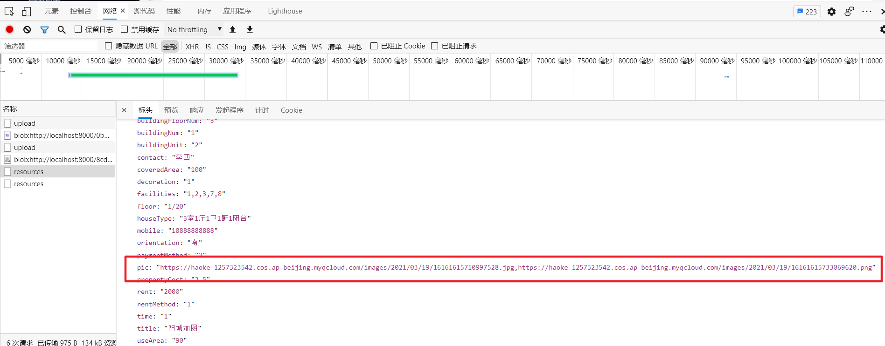

### 房源列表

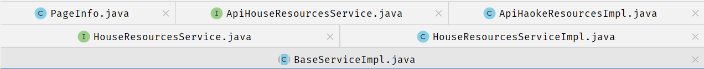

-   PageInfo：返回给服务消费方的数据
-   ApiHouseResourcesService:暴露==dubbo==服务提供方接口
-   ApiHaoKeResourcesImpl：==dubbo==服务提供方的实现
-   HouseResourcesService：==Spring==服务层定义
-   HouseResourcesServiceImpl：==Spring==业务的实现
-   BaseServiceImpl：==Mybatisplus== 层访问数据库

#### 1. 定义dubbo服务

**haoke-manage-server-house-resources-dubbo-interface**

`com.haoke.server.vo.PageInfo`

```java
package com.haoke.server.vo;

import lombok.AllArgsConstructor;
import lombok.Data;
import java.util.Collections;
import java.util.List;

@Data
@AllArgsConstructor
public class PageInfo<T> implements java.io.Serializable{
    /**
     * 总条数
     */
    private Integer total;
    /**
     * 当前页
     */
    private Integer pageNum;
    /**
     * 一页显示的大小
     */
    private Integer pageSize;
    /**
     * 数据列表
     */
    private List<T> records = Collections.emptyList();
}
```

`package com.haoke.server.api`

```java
package com.haoke.server.api;

import com.haoke.server.pojo.HouseResources;
import com.haoke.server.vo.PageInfo;

public interface ApiHouseResourcesService {

    /**
     * @param houseResources
     *
     * @return -1:输入的参数不符合要求，0：数据插入数据库失败，1：成功
     */
    int saveHouseResources(HouseResources houseResources);

    /**
     * 分页查询房源列表
     *
     * @param page 当前页
     * @param pageSize 页面大小
     * @param queryCondition 查询条件
     * @return
     */
    PageInfo<HouseResources> queryHouseResourcesList(int page, int pageSize, HouseResources queryCondition);
}
```

#### 2. 实现dubbo服务

**haoke-manage-dubbo-server-house-resources-service**

dubbo服务的实现实际上为调用Spring的服务层业务

```java
package com.haoke.server.api;

import com.alibaba.dubbo.config.annotation.Service;
import com.haoke.server.pojo.HouseResources;
import com.haoke.server.service.HouseResourcesService;
import com.haoke.server.vo.PageInfo;
import org.springframework.beans.factory.annotation.Autowired;

//实现Dubbo，对外暴露服务
@Service(version = "${dubbo.service.version}")
public class ApiHaokeResourcesImpl implements ApiHouseResourcesService{

    @Autowired
    private HouseResourcesService houseResourcesService;

    @Override
    public int saveHouseResources(HouseResources houseResources) {
        return this.houseResourcesService.saveHouseResources(houseResources);
    }

    @Override
    public PageInfo<HouseResources> queryHouseResourcesList(int page, int pageSize, HouseResources queryCondition) {
        return this.houseResourcesService.queryHouseResourcesList(page, pageSize, queryCondition);
    }
}
```

==Spring的服务层实现查询列表业务==

`Spring服务层定义`

```java
package com.haoke.server.service;

import com.haoke.server.pojo.HouseResources;
import com.haoke.server.vo.PageInfo;

public interface HouseResourcesService {
    /**
     *
     * @param houseResources
     * @return -1:输入的参数不符合要求，0：数据插入数据库失败，1：成功
     */
    int saveHouseResources(HouseResources houseResources);

    public PageInfo<HouseResources> queryHouseResourcesList(int page, int pageSize, HouseResources queryCondition);
}
```

`Spring服务层实现`

```java
package com.haoke.server.service.impl;

import com.alibaba.dubbo.common.utils.StringUtils;
import com.baomidou.mybatisplus.core.conditions.query.QueryWrapper;
import com.baomidou.mybatisplus.core.metadata.IPage;
import com.haoke.server.pojo.HouseResources;
import com.haoke.server.service.HouseResourcesService;
import com.haoke.server.vo.PageInfo;
import org.springframework.stereotype.Service;
import org.springframework.transaction.annotation.Transactional;

@Transactional//这是Spring的服务
@Service//开启事务
public class HouseResourcesServiceImpl
        extends BaseServiceImpl
        implements HouseResourcesService {
    @Override
    public int saveHouseResources(HouseResources houseResources) {
        // 编写校验逻辑，如果校验不通过，返回-1
        if (StringUtils.isBlank(houseResources.getTitle())) {
            return -1;
        }

        //其他校验以及逻辑省略 ……

        return super.save(houseResources);
    }

    @Override
    public PageInfo<HouseResources> queryHouseResourcesList(int page, int pageSize, HouseResources queryCondition) {
        QueryWrapper<Object> queryWrapper = new QueryWrapper<>(queryCondition);
        queryWrapper.orderByDesc("updated");
        IPage iPage = super.queryPageList(queryWrapper, page, pageSize);
        return new PageInfo<HouseResources>(Long.valueOf(iPage.getTotal()).intValue() , page, pageSize, iPage.getRecords());
    }
}
```

`mybatisplus从数据库获取数据`

```java
@Override
public PageInfo<HouseResources> queryHouseResourcesList(int page, int pageSize, HouseResources queryCondition) {
    QueryWrapper<HouseResources> queryWrapper = new QueryWrapper<HouseResources>(queryCondition);
    queryWrapper.orderByDesc("updated");//按更新时间降序排列

    IPage iPage = super.queryPageList(queryWrapper, page, pageSize);
    return new PageInfo<HouseResources>(Long.valueOf(iPage.getTotal()).intValue() , page, pageSize, iPage.getRecords());
}
```

#### 3. 实现RESTful接口


-    TableResult：返回给前端的vo
-    Pagination：分页信息
-    HouseResourceService：调用服务提供方提供的接口
-    HouseResourcesController：服务消费方提供接口给前端调用

##### 1. 定义vo

```java
@Data
@AllArgsConstructor
public class TableResult<T> {
    private List<T> list;
    private Pagination pagination;
}

@Data
@AllArgsConstructor
public class Pagination {
    private Integer current;
    private Integer pageSize;
    private Integer total;
}
```

##### 2. 调用服务提供方

```java
public TableResult queryList(HouseResources houseResources, Integer currentPage, Integer pageSize) {
    PageInfo<HouseResources> pageInfo
        = this.apiHouseResourcesService.queryHouseResourcesList(currentPage, pageSize, houseResources);

    return new TableResult(
        pageInfo.getRecords(),
        new Pagination(currentPage, pageSize, pageInfo.getTotal()));
}
```

##### 3. 服务消费方提供给前端接口

```java
/**
 * 查询房源列表
 * @param houseResources
 * @param currentPage
 * @param pageSize
 * @return
 */
@GetMapping("/list")//完整请求路径是/house/resource/list
@ResponseBody
public ResponseEntity<TableResult> list(HouseResources houseResources,
                                        @RequestParam(name = "currentPage", defaultValue = "1") Integer currentPage,
                                        @RequestParam(name = "pageSize",defaultValue = "10") Integer pageSize) {

    return ResponseEntity.ok(this.houseResourceService.queryList(houseResources, currentPage, pageSize));
}
```

##### 4. 测试接口

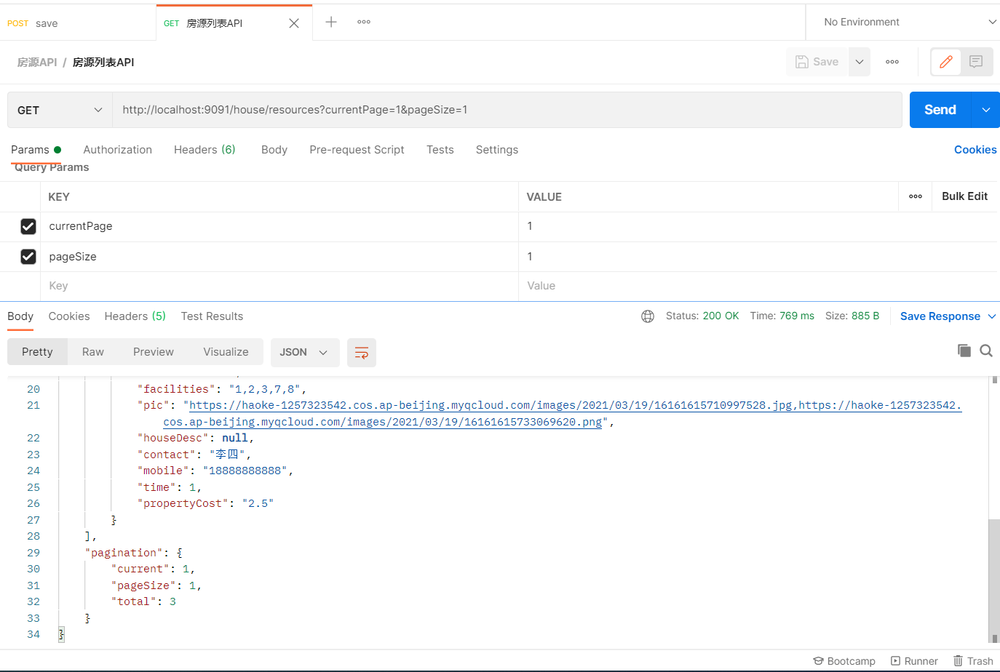

#### 4. 前后端整合


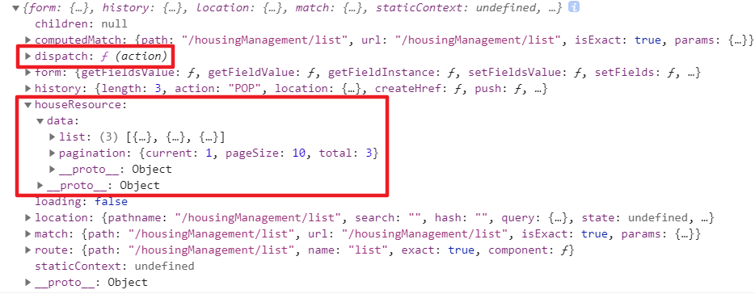

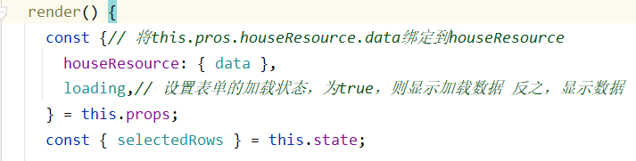

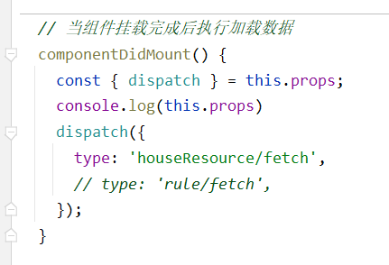


##### 1. 修改前端表结构

```jsx
  columns = [
    {
      title: '房源编号',
      dataIndex: 'id',
    },
    {
      title: '房源信息',
      dataIndex: 'title',
    },
    {
      title: '图',
      dataIndex: 'pic',
      render : (text, record, index) => <ShowPics pics={text} />
    },
    {
      title: '楼栋',
      render : (text, record, index) => `${record.buildingFloorNum  }栋${record.buildingNum}单元${record.buildingUnit}号`
    },
    {
      title: '户型',
      dataIndex: 'houseType'
    },
    {
      title: '面积',
      dataIndex: 'useArea',
      render : (text, record, index) => `${text}平方`
    },
    {
      title: '楼层',
      dataIndex: 'floor'
    },
    {
      title: '操作',
      render: (text, record) => (
        <Fragment>
          <a onClick={() => this.handleUpdateModalVisible(true, record)}>查看</a>
          <Divider type="vertical" />
          <a href="">删除</a>
        </Fragment>
      ),
    },
  ];
```

##### 2. 自定义图片展示组件

```jsx
import React from 'react';
import { Modal, Button, Carousel } from 'antd';

class ShowPics extends React.Component{
  info = () => {
    Modal.info({
      title: '',
      iconType:'false',
      width: '800px',
      okText: "ok",
      content: (
        <div style={{width:650, height: 400, lineHeight:400, textAlign:"center"}}>
          <Carousel autoplay>
            {
              this.props.pics.split(',').map((value,index) => <div>
                
              </div>)
            }
          </Carousel>
        </div>
      ),
      onOk() {},
    });
  };

  constructor(props){
      super(props);
      this.state={
        btnDisabled: !this.props.pics
    }
  }

  render() {
    return (
      <div>
        <Button disabled={this.state.btnDisabled} icon="picture" shape="circle" onClick={()=>{this.info()}} />
      </div>
    )
  }
}

export default ShowPics;
```

##### 3. model层

```jsx
import { queryResource } from '@/services/haoke/houseResource';

export default {
  namespace: 'houseResource',

  state: {
    data: {
      list: [],
      pagination: {},
    },
  },

  effects: {
    *fetch({ payload }, { call, put }) {
      console.log("houseResource fetch")

      const response = yield call(queryResource, payload);
      yield put({
        type: 'save',
        payload: response,
      });
    }
  },

  reducers: {
    save(state, action) {// state表示当前model的数据，action表示异步函数 put ，put()中的payload为封装了回调数据的属性
      return {
        ...state,
        data: action.payload,
      };
    },
  },
};
```

##### 4. 修改数据请求地址

```jsx
import request from '@/utils/request';
import { stringify } from 'qs';

export async function queryResource(params) {
  return request(`/haoke/house/resources/list?${stringify(params)}`);
}
```

## 一些配置

### HikariPool-1 - Connection is not available, request timed out after

JDBC超时，Hikari设置了最长请求时间为30s，涉及多线程问题，原因还不清楚

```yaml
spring:
  datasource:
  	hikari:
      maximum-pool-size: 60
      data-source-properties:
        setIdleTimeout: 60000
        setConnectionTimeout: 60000
        setValidationTimeout: 3000
        setLoginTimeout: 5
        setMaxLifetime: 60000
```

### 抽取common工程

分析：

-   多个dubbo服务，需要抽取公共的类、方法到common工程中
-   实现独立的dubbo服务，便于后期的扩展和维护

在dubbo服务提供方的工程中(`haoke-manage-dubbo-server`)，将BasePOJO、BaseServiceImpl、vo.PageInfo移至该工程；导入公有依赖

其他工程，依赖此工程，并将自己工程中的相关类删除

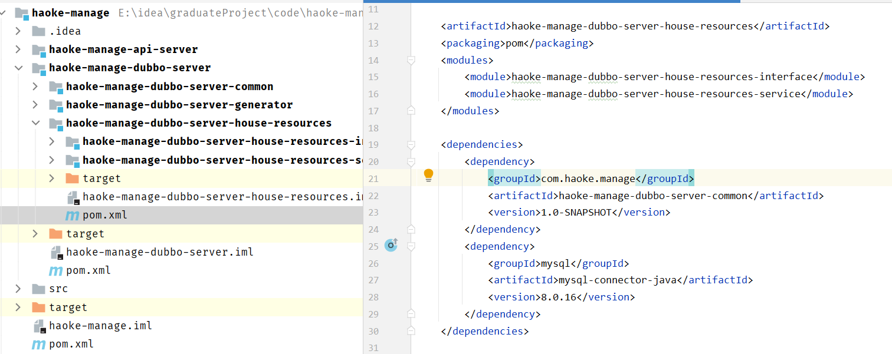

```xml
<?xml version="1.0" encoding="UTF-8"?>
<project xmlns="http://maven.apache.org/POM/4.0.0"
         xmlns:xsi="http://www.w3.org/2001/XMLSchema-instance"
         xsi:schemaLocation="http://maven.apache.org/POM/4.0.0 http://maven.apache.org/xsd/maven-4.0.0.xsd">
    <parent>
        <artifactId>haoke-manage-dubbo-server</artifactId>
        <groupId>com.haoke.manage</groupId>
        <version>1.0-SNAPSHOT</version>
    </parent>
    <modelVersion>4.0.0</modelVersion>

    <artifactId>haoke-manage-dubbo-server-common</artifactId>

    <dependencies>
        <dependency>
            <groupId>com.baomidou</groupId>
            <artifactId>mybatis-plus-boot-starter</artifactId>
            <version>3.4.2</version>
        </dependency>
        <dependency>
            <groupId>mysql</groupId>
            <artifactId>mysql-connector-java</artifactId>
            <version>8.0.16</version>
        </dependency>
        <dependency>
            <groupId>org.springframework.boot</groupId>
            <artifactId>spring-boot-starter-jdbc</artifactId>
        </dependency>
    </dependencies>
</project>
```


