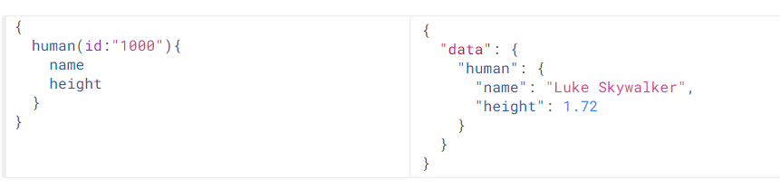

# GraphQL

[TOC]

<div style="page-break-after:always" />

## 简介


[官网地址](https://graphql.cn/)

一种用于前后端数据查询方式的规范

### RESTful存在的问题

RESTful是熟悉的用于api通信的规范

```shell
GET http://127.0.0.1/user/1 #查询
POST http://127.0.0.1/user #新增
PUT http://127.0.0.1/user #更新
DELETE http://127.0.0.1/user #删除
```

**场景一：**

只需某一对象的部分属性，但通过RESTful返回的是这个对象的所有属性

```json
#请求
GET http://127.0.0.1/user/1001
#响应：
{
    id : 1001,
    name : "张三",
    age : 20,
    address : "北京市",
    ……
}
```

**场景二：**

一个需求，要发起多次请求才能完成

```shell
#查询用户信息
GET http://127.0.0.1/user/1001
#响应：
{
    id : 1001,
    name : "张三",
    age : 20,
    address : "北京市",
    ……
} 

#查询用户的身份证信息
GET http://127.0.0.1/card/8888
#响应：
{
    id : 8888,
    name : "张三",
    cardNumber : "999999999999999",
    address : "北京市",
    ……
}
```

### GraphQL的优势

#### 1. 按需索取数据

当请求中只有name属性时，响应结果中只包含name属性，如果请求中添加appearsIn属性，那么结果中就会返回appearsIn的值

演示地址:https://graphql.cn/learn/schema/#type-system

#### 2. 一次查询多个数据


一次请求，不仅查询到了hero数据，而且还查询到了friends数据。节省了网络请求次数  

#### 3. API的演进无需划分版本


当API进行升级时，客户端可以不进行升级，可以等到后期一起升级，这样就大大减少了客户端和服务端的耦合度  

### GraphQL查询的规范

GraphQL定义了一套规范，用来描述语法定义  http://graphql.cn/learn/queries/  

>   规范 $\neq$ 实现

#### 字段 Fields

在GraphQL的查询中，请求结构中包含了所预期结果的结构，这个就是字段。并且响应的结构和请求结构基本一致，这是GraphQL的一个特性，这样就可以让请求发起者很清楚的知道自己想要什么。  


#### 参数Arguments

语法：(参数名:参数值)



#### 别名 Aliases

如果一次查询多个 `相同对象` ，但是 `值不同` ，这个时候就需要起别名了，否则json的语法就不能通过了 


#### 片段 Fragments

查询对的属性如果相同，可以采用片段的方式进行简化定义  


### GraphQL的schema和类型规范

**Schema用于定义数据结构**

https://graphql.cn/learn/schema/

#### Schema定义结构

每一个 GraphQL 服务都有一个 `query` 类型，可能有一个 `mutation` 类型。这两个类型和常规对象类型无差，但是它们之所以特殊，是因为它们定义了每一个 GraphQL 查询的**入口**。

```
schema { #定义查询
	query: UserQuery
}

type UserQuery{# 定义查询的类型
	user(id:ID):User #指定对象以及参数类型
}

type User{# 定义对象
	id:ID! #!表示该属性必须不可为空
	name:String
	age:Int
}
```

#### 标量类型

-   Int ：有符号 32 位整数。
-   Float ：有符号双精度浮点值。
-   String ：UTF‐8 字符序列。
-   Boolean ： true 或者 false 。
-   ID ：ID 标量类型表示一个唯一标识符，通常用以重新获取对象或者作为缓存中的键  

GraphQL支持自定义类型，比如在graphql-java实现中增加了：Long、Byte等。  

#### 枚举类型

```
enum Episode{# 定义枚举
	NEWHOPE
	EMPIRE
	JEDI
}

type huma{
	id: ID!
	name: String!
	appearsIn: [Episode]! #使用枚举类型  表示一个 Episode 数组
	homePlanet: String
}
```

#### 接口 interface

一个接口是一个抽象类型，它包含某些字段，而对象类型必须包含这些字段，才能算实现了这个接口  

```
interface Character{# 定义接口
	id: ID!
	name: String!
	friends: [Character]
	appearsIn: [Episode]!
}

#实现接口
type Human implememts Character{
	id: ID!
	name: String!
	friends: [Character]!
	starship: [Startships]!
	
	totalCredits: Int
}
type Droid implements Character {
	id: ID!
	name: String!
	friends: [Character]
	appearsIn: [Episode]!
	
	primaryFunction: String
}
```

### GraphQL的java实现

官方只是定义了规范并没有做实现，就需要有第三方来进行实现了  

官网：https://www.graphql-java.com/


https://www.graphql-java.com/documentation/v16/getting-started/

>    若使用mirrors配置镜像，则第三方配置不会生效

graphQL并未发布到maven中央仓库中

需要添加第三方仓库，才能下载到依赖

#### 1. 导入依赖

```xml
<?xml version="1.0" encoding="UTF-8"?>
<project xmlns="http://maven.apache.org/POM/4.0.0"
         xmlns:xsi="http://www.w3.org/2001/XMLSchema-instance"
         xsi:schemaLocation="http://maven.apache.org/POM/4.0.0 http://maven.apache.org/xsd/maven-4.0.0.xsd">
    <modelVersion>4.0.0</modelVersion>

    <parent>
        <groupId>org.springframework.boot</groupId>
        <artifactId>spring-boot-starter-parent</artifactId>
        <version>2.4.3</version>
    </parent>

    <groupId>org.example</groupId>
    <artifactId>graphql</artifactId>
    <version>1.0-SNAPSHOT</version>

    <repositories>
        <repository>
            <snapshots>
                <enabled>false</enabled>
            </snapshots>
            <id>bintray-andimarek-graphql-java</id>
            <name>bintray</name>
            <url>https://dl.bintray.com/andimarek/graphql-java</url>
        </repository>
    </repositories>

    <dependencies>
        <dependency>
            <groupId>org.projectlombok</groupId>
            <artifactId>lombok</artifactId>
        </dependency>
        <dependency>
            <groupId>com.graphql-java</groupId>
            <artifactId>graphql-java</artifactId>
            <version>11.0</version>
        </dependency>
    </dependencies>
</project>
```

#### 2. 安装插件


```graphql
schema {
    query: UserQuery
}

type UserQuery{
    user(id:ID): User
}

type User{
    id: ID!
    name: String
    age: Int
}
```

#### 3. 实现

##### java API实现

###### 按需返回

```java
		/**
         * 定义User对象类型
         * type User { #定义对象
         *  id:Long! # !表示该属性是非空项
         *  name:String
         *  age:Int
         * }
         * @return
         */
GraphQLObjectType userType = newObject()
    .name("User")
    .field(newFieldDefinition().name("id").type(GraphQLLong))
    .field(newFieldDefinition().name("name").type(GraphQLString))
    .field(newFieldDefinition().name("age").type(GraphQLInt))
    .build();

		/**
         * 定义查询的类型
         * type UserQuery { #定义查询的类型
         *  user : User #指定对象
         * }
         * @return
         */
GraphQLObjectType userQuery = newObject()
    .name("userQuery")
    .field(newFieldDefinition()
           .name("user")
           .type(userType)
           .dataFetcher(new StaticDataFetcher(new User(1L,"张三",20)))
          )
    .build();

		/**
         * 定义Schema
         * schema { #定义查询
         *  query: UserQuery
         * }
         * @return
         */
GraphQLSchema graphQLSchema = GraphQLSchema.newSchema()
    .query(userQuery)
    .build();

//构建GraphQL查询器
GraphQL graphQL = GraphQL.newGraphQL(graphQLSchema).build();

String query = "{user{id,name}}";
ExecutionResult executionResult = graphQL.execute(query);

// 打印错误
System.out.println("错误：" + executionResult.getErrors());
// 打印数据
System.out.println("结果：" +(Object) executionResult.toSpecification());
```

###### 查询参数的设置


```java
public class GraphQLDemo {
    public static void main(String[] args) {
        /**
         * 定义User对象类型
         * type User { #定义对象
         *  id:Long! # !表示该属性是非空项
         *  name:String
         *  age:Int
         * }
         * @return
         */
        GraphQLObjectType userType = newObject()
                .name("User")
                .field(newFieldDefinition().name("id").type(GraphQLLong))
                .field(newFieldDefinition().name("name").type(GraphQLString))
                .field(newFieldDefinition().name("age").type(GraphQLInt))
                .build();

        /**
         * 定义查询的类型
         * type UserQuery { #定义查询的类型
         *  user : User #指定对象
         * }
         * @return
         */
        GraphQLObjectType userQuery = newObject()
                .name("userQuery")
                .field(newFieldDefinition()
                        .name("user")
                        .argument(GraphQLArgument.newArgument()
                                .name("id")
                                .type(GraphQLLong)
                        )
                        .type(userType)
                        .dataFetcher(Environment->{
                            Long id = Environment.getArgument("id");
                            //查询数据库
                            //TODO
                            return new User(id,"张三",id.intValue()+10);
                        })
                )
                .build();

        /**
         * 定义Schema
         * schema { #定义查询
         *  query: UserQuery
         * }
         * @return
         */
        GraphQLSchema graphQLSchema = GraphQLSchema.newSchema()
                .query(userQuery)
                .build();

        //构建GraphQL查询器
        GraphQL graphQL = GraphQL.newGraphQL(graphQLSchema).build();

        String query = "{user(id:100){id,name,age}}";
        ExecutionResult executionResult = graphQL.execute(query);

        // 打印错误
        System.out.println("错误：" + executionResult.getErrors());
        // 打印数据
        System.out.println("结果：" +(Object) executionResult.toSpecification());
    }
}
```

##### SDL构建Schema

SDL通过插件将GraphQL定义文件转换为java

```java
public class GraphQLSDLDemo {
    public static void main(String[] args) throws IOException {

        /* 1. 读取资源，进行解析 */
        //资源名
        String fileName = "user.graphql";
        /*
        <dependency>
            <groupId>org.apache.commons</groupId>
            <artifactId>commons-lang3</artifactId>
        </dependency>
        * */
        String fileContent = IOUtils.toString(GraphQLSDLDemo.class.getClassLoader().getResource(fileName),"UTF-8");
        TypeDefinitionRegistry tyRegistry = new SchemaParser().parse(fileContent);

        /* 2. 数据查询 */
        RuntimeWiring wiring = RuntimeWiring.newRuntimeWiring()
                .type("UserQuery",builder ->
                        builder.dataFetcher("user", Environment->{
                            Long id = Long.parseLong(Environment.getArgument("id"));

                            return new User(id,"张三"+id,id.intValue()+10);
                        })
                )
                .build();

        /* 3. 生成schema */
        GraphQLSchema graphQLSchema = new SchemaGenerator().makeExecutableSchema(tyRegistry,wiring);

        /* 4. 根据schema对象生成GraphQL对象 */
        GraphQL graphQL = GraphQL.newGraphQL(graphQLSchema).build();

        String query = "{user(id:100){id,name,age}}";
        ExecutionResult executionResult = graphQL.execute(query);

        System.out.println(executionResult.toSpecification());
    }
}
```

#### 一次请求，多个资源

**对象嵌套**

```graphql
schema {
    query: UserQuery
}

type UserQuery{
    user(id:ID): User
}

type User{
    id: ID!
    name: String
    age: Int
    card: Card
}

type Card {
    cardNumber:String!
    userId: ID
}
```

```java
public class GraphQLSDLDemo {
    public static void main(String[] args) throws IOException {

        /* 1. 读取资源，进行解析 */
        //资源名
        String fileName = "user.graphql";
        /*
        <dependency>
            <groupId>org.apache.commons</groupId>
            <artifactId>commons-lang3</artifactId>
        </dependency>
        * */
        String fileContent = IOUtils.toString(GraphQLSDLDemo.class.getClassLoader().getResource(fileName),"UTF-8");
        TypeDefinitionRegistry tyRegistry = new SchemaParser().parse(fileContent);

        /* 2. 数据查询 */
        RuntimeWiring wiring = RuntimeWiring.newRuntimeWiring()
                .type("UserQuery",builder ->
                        builder.dataFetcher("user", Environment->{
                            Long id = Long.parseLong(Environment.getArgument("id"));
                            Card card = new Card("number_"+id,id);

                            return new User(id,"张三_"+id,id.intValue()+10,card);
                        })
                )
                .build();

        /* 3. 生成schema */
        GraphQLSchema graphQLSchema = new SchemaGenerator().makeExecutableSchema(tyRegistry,wiring);

        /* 4. 根据schema对象生成GraphQL对象 */
        GraphQL graphQL = GraphQL.newGraphQL(graphQLSchema).build();

        String query = "{user(id:100){id,name,age,card{cardNumber}}}";
        ExecutionResult executionResult = graphQL.execute(query);

        System.out.println(executionResult.toSpecification());
    }
}
```


<div style="page-break-after:always" />

## 开发房源接口

-   使用GraphQL开发房源接口
-   实现房源列表查询的接口

### 通过id查询房源


#### dubbo服务提供方

##### HouseResourcesService——Spring服务的Interface

```java
public HouseResources queryHouseResourcesById(Long id);
```

##### HouseResourcesServiceImpl——Spring服务的实现

```java
@Override
public HouseResources queryHouseResourcesById(Long id) {
    return (HouseResources) super.queryById(id);
}
```

##### ApiHouseResourcesService——dubbo服务提供方接口

```java
    /*
    * 实现通过id查询 房源
    *
    * @Param id 房源id
    * @return
    * */
    HouseResources queryHouseResourcesById(Long id);
```

##### ApiHaokeResourcesImpl——dubbo服务提供方实现

```java
@Override
public HouseResources queryHouseResourcesById(Long id) {
    return houseResourcesService.queryHouseResourcesById(id);
}
```

#### dubbo服务消费方

**HouseResourceService**

```java
    /*
    * 根据id查询房源数据
    *
    * @Param id
    * @Return
    * */
    public HouseResources queryHouseResourcesById(Long id){
        //调用dubbo服务查询数据

        return this.apiHouseResourcesService.queryHouseResourcesById(id);
    }
```

#### GraphQL接口

##### 导入依赖

```xml
<repositories>
    <repository>
        <snapshots>
            <enabled>false</enabled>
        </snapshots>
        <id>bintray-andimarek-graphql-java</id>
        <name>bintray</name>
        <url>https://dl.bintray.com/andimarek/graphql-java</url>
    </repository>
</repositories>
<!--导入graphql依赖-->
<dependency>
    <groupId>com.graphql-java</groupId>
    <artifactId>graphql-java</artifactId>
    <version>16.0</version>
</dependency>
```

##### haoke.graphql

```graphql
schema {
    query: HaokeQuery
}

type HaokeQuery{
    HouseResources(id:ID): HouseResources
}

type HouseResources{
    id:ID!
    title:String
    estateId:ID
    buildingNum:String
    buildingUnit:String
    buildingFloorNum:String
    rent:Int
    rentMethod:Int
    paymentMethod:Int
    houseType:String
    coveredArea:String
    useArea:String
    floor:String
    orientation:String
    decoration:Int
    facilities:String
    pic:String
    houseDesc:String
    contact:String
    mobile:String
    time:Int
    propertyCost:String
}
```

##### graphql —— Bean

```java
@Component//将GraphQL对象注入IoC容器，并完成GraphQL的初始化
public class GraphQLProvider {
    private GraphQL graphQL;

    @Autowired
    private HouseResourceService houseResourceService;

    @PostConstruct//在IoC容器初始化时运行
    public void init() throws FileNotFoundException {
        //导入graphql脚本
        File file = ResourceUtils.getFile("classpath:haoke.graphql");

        //初始化graphql
        this.graphQL = GraphQL.newGraphQL(//schema { query: HaokeQuery}
                new SchemaGenerator().makeExecutableSchema(
                        new SchemaParser().parse(file),//TypeDefinitionRegistry
                        RuntimeWiring.newRuntimeWiring()//RuntimeWiring
                                .type("HaokeQuery",builder ->
                                        builder.dataFetcher("HouseResources", Environment->{
                                            Long id = Long.parseLong(Environment.getArgument("id"));

                                            return this.houseResourceService.queryHouseResourcesById(id);
                                        })
                                        )
                                .build()
                )
        ).build();
    }

    @Bean
    GraphQL graphQL(){
        return this.graphQL;
    }
}
```

##### 暴露接口

```java
@RequestMapping("graphql")
@Controller
public class GraphQLController {

    @Autowired
    private GraphQL graphQL;

    @GetMapping
    @ResponseBody
    public Map<String,Object> graphql(@RequestParam("query")String query){
        return this.graphQL.execute(query).toSpecification();
    }
}
```

#### 测试


### 优化GraphQLProvider逻辑

#### 问题


每当增加查询时，都需要修改该方法

改进思路：

1.  编写接口
2.  所有实现查询的逻辑都实现该接口
3.  在GraphQLProvider中使用该接口的实现类进行处理
4.  以后新增查询逻辑只需增加实现类即可

#### 编写MyDataFetcher接口

```java
package com.haoke.api.graphql;

import graphql.schema.DataFetchingEnvironment;

public interface MyDataFetcher {

    /**
     * 查询名称
     *
     * @return
     */
    String fieldName();

    /**
     * 具体实现数据查询的逻辑
     *
     * @param environment
     * @return
     */
    Object dataFetcher(DataFetchingEnvironment environment);
}
```

#### 实现MyDataFetcher

```java
@Component
public class HouseResourcesDataFetcher implements MyDataFetcher {
    @Autowired
    HouseResourceService houseResourceService;

    @Override
    public String fieldName() {
        return "HouseResources";
    }

    @Override
    public Object dataFetcher(DataFetchingEnvironment environment) {
        Long id = Long.parseLong(environment.getArgument("id"));

        return this.houseResourceService.queryHouseResourcesById(id);
    }
}
```

#### 修改GraphQLProvider

```java
this.graphQL = GraphQL.newGraphQL(
    new SchemaGenerator().makeExecutableSchema(
        new SchemaParser().parse(file),//TypeDefinitionRegistry
        RuntimeWiring.newRuntimeWiring()//RuntimeWiring
        .type("HaokeQuery",builder ->{
            for (MyDataFetcher myDataFetcher : myDataFetchers) {
                builder.dataFetcher(
                    myDataFetcher.fieldName(),
                    Environment->myDataFetcher.dataFetcher(Environment)
                 );
            }
            return builder;
        }
     )
     .build()
)
```

### 实现查询房源列表接口

#### 修改haoke.graphql文件

```graphql
schema {
    query: HaokeQuery
}

type HaokeQuery{
    HouseResources(id:ID): HouseResources
    HouseResourcesList(page:Int, pageSize:Int): TableResult
}

type HouseResources{
    id:ID!
    title:String
    estateId:ID
    buildingNum:String
    buildingUnit:String
    buildingFloorNum:String
    rent:Int
    rentMethod:Int
    paymentMethod:Int
    houseType:String
    coveredArea:String
    useArea:String
    floor:String
    orientation:String
    decoration:Int
    facilities:String
    pic:String
    houseDesc:String
    contact:String
    mobile:String
    time:Int
    propertyCost:String
}

type TableResult{
    list: [HouseResources]
    pagination: Pagination
}

type Pagination{
    current:Int
    pageSize:Int
    total:Int
}
```

#### 新增HouseResourcesListDataFetcher实现

```java
@Component
public class HouseResourcesListDataFetcher implements MyDataFetcher {

    @Autowired
    HouseResourceService houseResourceService;

    @Override
    public String fieldName() {
        return "HouseResourcesList";
    }

    @Override
    public Object dataFetcher(DataFetchingEnvironment environment) {
        Integer page = environment.getArgument("page");
        if(page == null){
            page = 1;
        }

        Integer pageSize = environment.getArgument("pageSize");
        if(pageSize == null){
            pageSize = 5;
        }
        return this.houseResourceService.queryList(null, page, pageSize);
    }
}
```


