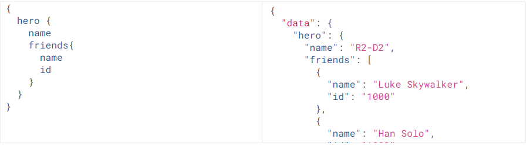
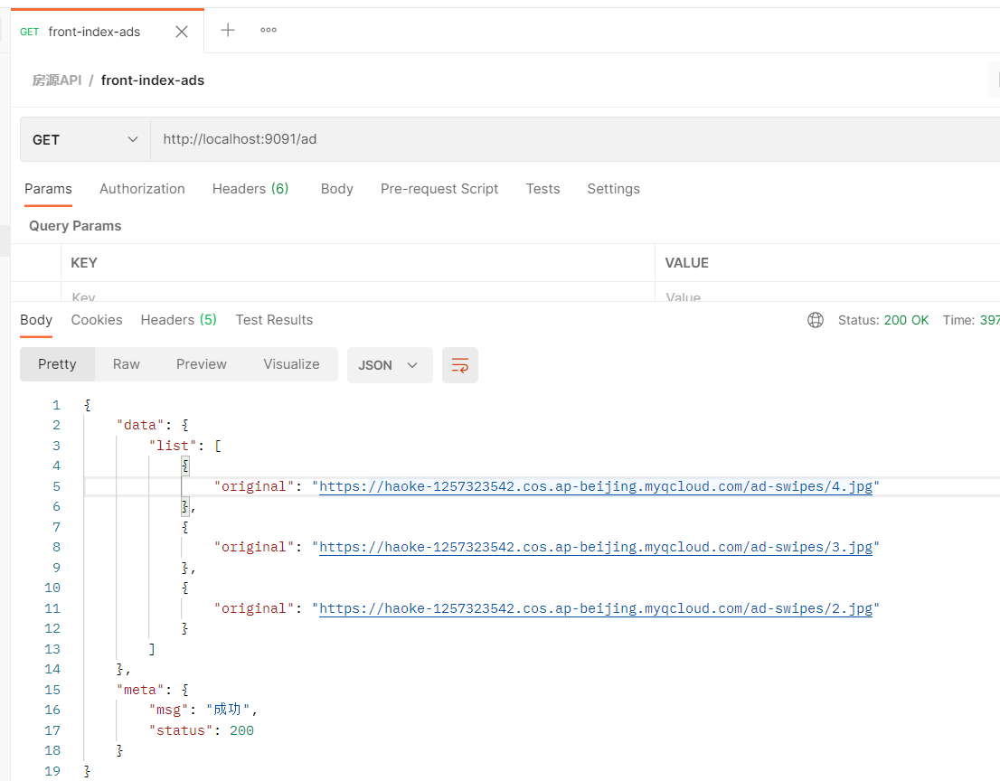
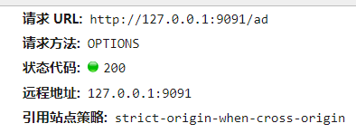

# GraphQL

[TOC]

<div style="page-break-after:always" />

## 简介


[官网地址](https://graphql.cn/)

一种用于前后端数据查询方式的规范

### RESTful存在的问题

RESTful是熟悉的用于api通信的规范

```shell
GET http://127.0.0.1/user/1 #查询
POST http://127.0.0.1/user #新增
PUT http://127.0.0.1/user #更新
DELETE http://127.0.0.1/user #删除
```

**场景一：**

只需某一对象的部分属性，但通过RESTful返回的是这个对象的所有属性

```json
#请求
GET http://127.0.0.1/user/1001
#响应：
{
    id : 1001,
    name : "张三",
    age : 20,
    address : "北京市",
    ……
}
```

**场景二：**

一个需求，要发起多次请求才能完成

```shell
#查询用户信息
GET http://127.0.0.1/user/1001
#响应：
{
    id : 1001,
    name : "张三",
    age : 20,
    address : "北京市",
    ……
} 

#查询用户的身份证信息
GET http://127.0.0.1/card/8888
#响应：
{
    id : 8888,
    name : "张三",
    cardNumber : "999999999999999",
    address : "北京市",
    ……
}
```

### GraphQL的优势

#### 1. 按需索取数据

当请求中只有name属性时，响应结果中只包含name属性，如果请求中添加appearsIn属性，那么结果中就会返回appearsIn的值

演示地址:https://graphql.cn/learn/schema/#type-system

#### 2. 一次查询多个数据



一次请求，不仅查询到了hero数据，而且还查询到了friends数据。节省了网络请求次数

#### 3. API的演进无需划分版本


当API进行升级时，客户端可以不进行升级，可以等到后期一起升级，这样就大大减少了客户端和服务端的耦合度  

### GraphQL查询的规范

GraphQL定义了一套规范，用来描述语法定义  http://graphql.cn/learn/queries/  

>   规范 $\neq$ 实现

#### 字段 Fields

在GraphQL的查询中，请求结构中包含了所预期结果的结构，这个就是字段。并且响应的结构和请求结构基本一致，这是GraphQL的一个特性，这样就可以让请求发起者很清楚的知道自己想要什么。  


#### 参数Arguments

语法：(参数名:参数值)


#### 别名 Aliases

如果一次查询多个 `相同对象` ，但是 `值不同` ，这个时候就需要起别名了，否则json的语法就不能通过了 


#### 片段 Fragments

查询对的属性如果相同，可以采用片段的方式进行简化定义  


### GraphQL的schema和类型规范

**Schema用于定义数据结构**

https://graphql.cn/learn/schema/

#### Schema定义结构

每一个 GraphQL 服务都有一个 `query` 类型，可能有一个 `mutation` 类型。这两个类型和常规对象类型无差，但是它们之所以特殊，是因为它们定义了每一个 GraphQL 查询的**入口**。

```
schema { #定义查询
	query: UserQuery
}

type UserQuery{# 定义查询的类型
	user(id:ID):User #指定对象以及参数类型
}

type User{# 定义对象
	id:ID! #!表示该属性必须不可为空
	name:String
	age:Int
}
```

#### 标量类型

-   Int ：有符号 32 位整数。
-   Float ：有符号双精度浮点值。
-   String ：UTF‐8 字符序列。
-   Boolean ： true 或者 false 。
-   ID ：ID 标量类型表示一个唯一标识符，通常用以重新获取对象或者作为缓存中的键  

GraphQL支持自定义类型，比如在graphql-java实现中增加了：Long、Byte等。  

#### 枚举类型

```
enum Episode{# 定义枚举
	NEWHOPE
	EMPIRE
	JEDI
}

type huma{
	id: ID!
	name: String!
	appearsIn: [Episode]! #使用枚举类型  表示一个 Episode 数组
	homePlanet: String
}
```

#### 接口 interface

一个接口是一个抽象类型，它包含某些字段，而对象类型必须包含这些字段，才能算实现了这个接口  

```
interface Character{# 定义接口
	id: ID!
	name: String!
	friends: [Character]
	appearsIn: [Episode]!
}

#实现接口
type Human implememts Character{
	id: ID!
	name: String!
	friends: [Character]!
	starship: [Startships]!
	
	totalCredits: Int
}
type Droid implements Character {
	id: ID!
	name: String!
	friends: [Character]
	appearsIn: [Episode]!
	
	primaryFunction: String
}
```

### GraphQL的java实现

官方只是定义了规范并没有做实现，就需要有第三方来进行实现了  

官网：https://www.graphql-java.com/


https://www.graphql-java.com/documentation/v16/getting-started/

>    若使用mirrors配置镜像，则第三方配置不会生效

graphQL并未发布到maven中央仓库中

需要添加第三方仓库，才能下载到依赖

#### 1. 导入依赖

```xml
<?xml version="1.0" encoding="UTF-8"?>
<project xmlns="http://maven.apache.org/POM/4.0.0"
         xmlns:xsi="http://www.w3.org/2001/XMLSchema-instance"
         xsi:schemaLocation="http://maven.apache.org/POM/4.0.0 http://maven.apache.org/xsd/maven-4.0.0.xsd">
    <modelVersion>4.0.0</modelVersion>

    <parent>
        <groupId>org.springframework.boot</groupId>
        <artifactId>spring-boot-starter-parent</artifactId>
        <version>2.4.3</version>
    </parent>

    <groupId>org.example</groupId>
    <artifactId>graphql</artifactId>
    <version>1.0-SNAPSHOT</version>

    <repositories>
        <repository>
            <snapshots>
                <enabled>false</enabled>
            </snapshots>
            <id>bintray-andimarek-graphql-java</id>
            <name>bintray</name>
            <url>https://dl.bintray.com/andimarek/graphql-java</url>
        </repository>
    </repositories>

    <dependencies>
        <dependency>
            <groupId>org.projectlombok</groupId>
            <artifactId>lombok</artifactId>
        </dependency>
        <dependency>
            <groupId>com.graphql-java</groupId>
            <artifactId>graphql-java</artifactId>
            <version>11.0</version>
        </dependency>
    </dependencies>
</project>
```

#### 2. 安装插件


```graphql
schema {
    query: UserQuery
}

type UserQuery{
    user(id:ID): User
}

type User{
    id: ID!
    name: String
    age: Int
}
```

#### 3. 实现

##### java API实现

###### 按需返回

```java
		/**
         * 定义User对象类型
         * type User { #定义对象
         *  id:Long! # !表示该属性是非空项
         *  name:String
         *  age:Int
         * }
         * @return
         */
GraphQLObjectType userType = newObject()
    .name("User")
    .field(newFieldDefinition().name("id").type(GraphQLLong))
    .field(newFieldDefinition().name("name").type(GraphQLString))
    .field(newFieldDefinition().name("age").type(GraphQLInt))
    .build();

		/**
         * 定义查询的类型
         * type UserQuery { #定义查询的类型
         *  user : User #指定对象
         * }
         * @return
         */
GraphQLObjectType userQuery = newObject()
    .name("userQuery")
    .field(newFieldDefinition()
           .name("user")
           .type(userType)
           .dataFetcher(new StaticDataFetcher(new User(1L,"张三",20)))
          )
    .build();

		/**
         * 定义Schema
         * schema { #定义查询
         *  query: UserQuery
         * }
         * @return
         */
GraphQLSchema graphQLSchema = GraphQLSchema.newSchema()
    .query(userQuery)
    .build();

//构建GraphQL查询器
GraphQL graphQL = GraphQL.newGraphQL(graphQLSchema).build();

String query = "{user{id,name}}";
ExecutionResult executionResult = graphQL.execute(query);

// 打印错误
System.out.println("错误：" + executionResult.getErrors());
// 打印数据
System.out.println("结果：" +(Object) executionResult.toSpecification());
```

###### 查询参数的设置


```java
public class GraphQLDemo {
    public static void main(String[] args) {
        /**
         * 定义User对象类型
         * type User { #定义对象
         *  id:Long! # !表示该属性是非空项
         *  name:String
         *  age:Int
         * }
         * @return
         */
        GraphQLObjectType userType = newObject()
                .name("User")
                .field(newFieldDefinition().name("id").type(GraphQLLong))
                .field(newFieldDefinition().name("name").type(GraphQLString))
                .field(newFieldDefinition().name("age").type(GraphQLInt))
                .build();

        /**
         * 定义查询的类型
         * type UserQuery { #定义查询的类型
         *  user : User #指定对象
         * }
         * @return
         */
        GraphQLObjectType userQuery = newObject()
                .name("userQuery")
                .field(newFieldDefinition()
                        .name("user")
                        .argument(GraphQLArgument.newArgument()
                                .name("id")
                                .type(GraphQLLong)
                        )
                        .type(userType)
                        .dataFetcher(Environment->{
                            Long id = Environment.getArgument("id");
                            //查询数据库
                            //TODO
                            return new User(id,"张三",id.intValue()+10);
                        })
                )
                .build();

        /**
         * 定义Schema
         * schema { #定义查询
         *  query: UserQuery
         * }
         * @return
         */
        GraphQLSchema graphQLSchema = GraphQLSchema.newSchema()
                .query(userQuery)
                .build();

        //构建GraphQL查询器
        GraphQL graphQL = GraphQL.newGraphQL(graphQLSchema).build();

        String query = "{user(id:100){id,name,age}}";
        ExecutionResult executionResult = graphQL.execute(query);

        // 打印错误
        System.out.println("错误：" + executionResult.getErrors());
        // 打印数据
        System.out.println("结果：" +(Object) executionResult.toSpecification());
    }
}
```

##### SDL构建Schema

SDL通过插件将GraphQL定义文件转换为java

```java
public class GraphQLSDLDemo {
    public static void main(String[] args) throws IOException {

        /* 1. 读取资源，进行解析 */
        //资源名
        String fileName = "user.graphql";
        /*
        <dependency>
            <groupId>org.apache.commons</groupId>
            <artifactId>commons-lang3</artifactId>
        </dependency>
        * */
        String fileContent = IOUtils.toString(GraphQLSDLDemo.class.getClassLoader().getResource(fileName),"UTF-8");
        TypeDefinitionRegistry tyRegistry = new SchemaParser().parse(fileContent);

        /* 2. 数据查询 */
        RuntimeWiring wiring = RuntimeWiring.newRuntimeWiring()
                .type("UserQuery",builder ->
                        builder.dataFetcher("user", Environment->{
                            Long id = Long.parseLong(Environment.getArgument("id"));

                            return new User(id,"张三"+id,id.intValue()+10);
                        })
                )
                .build();

        /* 3. 生成schema */
        GraphQLSchema graphQLSchema = new SchemaGenerator().makeExecutableSchema(tyRegistry,wiring);

        /* 4. 根据schema对象生成GraphQL对象 */
        GraphQL graphQL = GraphQL.newGraphQL(graphQLSchema).build();

        String query = "{user(id:100){id,name,age}}";
        ExecutionResult executionResult = graphQL.execute(query);

        System.out.println(executionResult.toSpecification());
    }
}
```

#### 一次请求，多个资源

**对象嵌套**

```graphql
schema {
    query: UserQuery
}

type UserQuery{
    user(id:ID): User
}

type User{
    id: ID!
    name: String
    age: Int
    card: Card
}

type Card {
    cardNumber:String!
    userId: ID
}
```

```java
public class GraphQLSDLDemo {
    public static void main(String[] args) throws IOException {

        /* 1. 读取资源，进行解析 */
        //资源名
        String fileName = "user.graphql";
        /*
        <dependency>
            <groupId>org.apache.commons</groupId>
            <artifactId>commons-lang3</artifactId>
        </dependency>
        * */
        String fileContent = IOUtils.toString(GraphQLSDLDemo.class.getClassLoader().getResource(fileName),"UTF-8");
        TypeDefinitionRegistry tyRegistry = new SchemaParser().parse(fileContent);

        /* 2. 数据查询 */
        RuntimeWiring wiring = RuntimeWiring.newRuntimeWiring()
                .type("UserQuery",builder ->
                        builder.dataFetcher("user", Environment->{
                            Long id = Long.parseLong(Environment.getArgument("id"));
                            Card card = new Card("number_"+id,id);

                            return new User(id,"张三_"+id,id.intValue()+10,card);
                        })
                )
                .build();

        /* 3. 生成schema */
        GraphQLSchema graphQLSchema = new SchemaGenerator().makeExecutableSchema(tyRegistry,wiring);

        /* 4. 根据schema对象生成GraphQL对象 */
        GraphQL graphQL = GraphQL.newGraphQL(graphQLSchema).build();

        String query = "{user(id:100){id,name,age,card{cardNumber}}}";
        ExecutionResult executionResult = graphQL.execute(query);

        System.out.println(executionResult.toSpecification());
    }
}
```


<div style="page-break-after:always" />

## 伪mock服务

目标：所有的数据通过自己实现的接口提供，不需要使用nodejs提供，便于后续开发

### 1. 构造数据

`mock-data.properties`

```properties
mock.indexMenu={"data":{"list":[\
  {"id":1,"menu_name":"二手房","menu_logo":"home","menu_path":"/home","menu_status":1,"menu_style":null},\
  {"id":2,"menu_name":"新房","menu_logo":null,"menu_path":null,"menu_status":null,"menu_style":null},\
  {"id":3,"menu_name":"租房","menu_logo":null,"menu_path":null,"menu_status":null,"menu_style":null},\
  {"id":4,"menu_name":"海外","menu_logo":null,"menu_path":null,"menu_status":null,"menu_style":null},\
  {"id":5,"menu_name":"地图找房","menu_logo":null,"menu_path":null,"menu_status":null,"menu_style":null},\
  {"id":6,"menu_name":"查公交","menu_logo":null,"menu_path":null,"menu_status":null,"menu_style":null},\
  {"id":7,"menu_name":"计算器","menu_logo":null,"menu_path":null,"menu_status":null,"menu_style":null},\
  {"id":8,"menu_name":"问答","menu_logo":null,"menu_path":null,"menu_status":null,"menu_style":null}]},"meta":\
  {"status":200,"msg":"测试数据"}}

mock.indexInfo={"data":{"list":[\
  {"id":1,"info_title":"房企半年销售业绩继","info_thumb":null,"info_time":null,"info_content":null,"user_id":null,"info_status":null,"info_type":1},\
  {"id":2,"info_title":"上半年土地市场两重天：一线降温三四线量价齐升","info_thumb":null,"info_time":null,"info_content":null,"user_id":null,"info_status":null,"info_type":1}]},\
  "meta":{"status":200,"msg":"测试数据"}}

mock.indexFaq={"data":{"list":[\
  {"question_name":"在北京买房，需要支付的税费有哪些？","question_tag":"学区,海淀","answer_content":"各种费用","atime":33,"question_id":1,"qnum":2},\
  {"question_name":"一般首付之后，贷款多久可以下来？","question_tag":"学区,昌平","answer_content":"大概1个月","atime":22,"question_id":2,"qnum":2}]},\
  "meta":{"status":200,"msg":"测试数据"}}

mock.indexHouse={"data":{"list":[\
  {"id":1,"home_name":"安贞西里123","home_price":"4511","home_desc":"72.32㎡/南 北/低楼层","home_infos":null,"home_type":1,"home_tags":"海淀,昌平","home_address":null,"user_id":null,"home_status":null,"home_time":12,"group_id":1},\
  {"id":8,"home_name":"安贞西里 三室一厅","home_price":"4500","home_desc":"72.32㎡/南北/低楼层","home_infos":null,"home_type":1,"home_tags":"海淀","home_address":null,"user_id":null,"home_status":null,"home_time":23,"group_id":2},\
  {"id":3,"home_name":"安贞西里 三室一厅","home_price":"4220","home_desc":"72.32㎡/南北/低楼层","home_infos":null,"home_type":2,"home_tags":"海淀","home_address":null,"user_id":null,"home_status":null,"home_time":1,"group_id":1},\
  {"id":4,"home_name":"安贞西里 三室一厅","home_price":"4500","home_desc":"72.32㎡/南 北/低楼层","home_infos":"4500","home_type":2,"home_tags":"海淀","home_address":"","user_id":null,"home_status":null,"home_time":12,"group_id":2},\
  {"id":5,"home_name":"安贞西里 三室一厅","home_price":"4522","home_desc":"72.32㎡/南 北/低楼层","home_infos":null,"home_type":3,"home_tags":"海淀","home_address":null,"user_id":null,"home_status":null,"home_time":23,"group_id":1},\
  {"id":6,"home_name":"安贞西里 三室一厅","home_price":"4500","home_desc":"72.32㎡/南北/低楼层","home_infos":null,"home_type":3,"home_tags":"海淀","home_address":null,"user_id":null,"home_status":null,"home_time":1221,"group_id":2},\
  {"id":9,"home_name":"安贞西里 三室一厅","home_price":"4500","home_desc":"72.32㎡/南北/低楼层","home_infos":null,"home_type":4,"home_tags":"海淀","home_address":null,"user_id":null,"home_status":null,"home_time":23,"group_id":1}\
  ]},
"meta":{"status":200,"msg":"测试数据"}}

mock.infosList1={"data":{"list":{"total":8,"data":[{"id":13,"info_title":"wwwwwwwwwwwww","info_thumb":null,"info_time":null,"info_content":null,"user_id":null,"info_status":null,"info_type":1},{"id":12,"info_title":"房企半年销售业绩继","info_thumb":null,"info_time":null,"info_content":null,"user_id":null,"info_status":null,"info_type":1}]}},"meta":{"status":200,"msg":"获取数据成功"}}
mock.infosList2={"data":{"list":{"total":4,"data":[{"id":9,"info_title":"房企半年销售业绩继续冲高三巨头销售额过亿","info_thumb":null,"info_time":null,"info_content":null,"user_id":null,"info_status":null,"info_type":2},{"id":7,"info_title":"房企半年销售业绩继续冲高三巨头销售额过亿","info_thumb":null,"info_time":null,"info_content":null,"user_id":null,"info_status":null,"info_type":2}]}},"meta":{"status":200,"msg":"获取数据成功"}}
mock.infosList3={"data":{"list":{"total":10,"data":[{"username":"tom","question_name":"在北京买房，需要支付的税费有哪些？","question_tag":"学区,海淀","answer_content":"各种费用","atime":33,"question_id":1,"qnum":2},{"username":"tom","question_name":"一般首付之后，贷款多久可以下来？","question_tag":"学区,昌平","answer_content":"大概1个月","atime":22,"question_id":2,"qnum":2}]}},"meta":{"status":200,"msg":"获取数据成功"}}

mock.my={"data":{"id":1,"username":"tom","password":"123","mobile":"123","type":null,"status":null,"avatar":"public/icon.png"},"meta":{"status":200,"msg":"获取数据成功"}}
```

### 2. 创建MockConfig

```java
package com.haoke.api.config;

import lombok.Data;
import org.springframework.boot.context.properties.ConfigurationProperties;
import org.springframework.context.annotation.Configuration;
import org.springframework.context.annotation.PropertySource;

@PropertySource("classpath:mock-data.properties")
@ConfigurationProperties(prefix = "mock")
@Configuration
@Data
public class MockConfig {
    private String indexMenu;
    private String indexInfo;
    private String indexFaq;
    private String indexHouse;
    private String infosList1;
    private String infosList2;
    private String infosList3;
    private String my;
}
```

### 3. 创建MockController

```java
package com.haoke.api.controller;

import com.haoke.api.config.MockConfig;
import org.springframework.beans.factory.annotation.Autowired;
import org.springframework.web.bind.annotation.*;

@RequestMapping("mock")
@RestController
@CrossOrigin
public class MockController {

    @Autowired
    private MockConfig mockConfig;

    /**
     * 菜单
     *
     * @return
     */
    @GetMapping("index/menu")
    public String indexMenu() {
        return this.mockConfig.getIndexMenu();
    }

    /**
     * 首页资讯
     * @return
     */
    @GetMapping("index/info")
    public String indexInfo() {
        return this.mockConfig.getIndexInfo();
    }

    /**
     * 首页问答
     * @return
     */
    @GetMapping("index/faq")
    public String indexFaq() {
        return this.mockConfig.getIndexFaq();
    }

    /**
     * 首页房源信息
     * @return
     */
    @GetMapping("index/house")
    public String indexHouse() {
        return this.mockConfig.getIndexHouse();
    }

    /**
     * 查询资讯
     *
     * @param type
     * @return
     */
    @GetMapping("infos/list")
    public String infosList(@RequestParam("type")Integer type) {
        switch (type){
            case 1:
                return this.mockConfig.getInfosList1();
            case 2:
                return this.mockConfig.getInfosList2();
            case 3:
                return this.mockConfig.getInfosList3();
        }
        return this.mockConfig.getInfosList1();
    }

    /**
     * 我的中心
     * @return
     */
    @GetMapping("my/info")
    public String myInfo() {
        return this.mockConfig.getMy();
    }
}
```

### 4. 测试


### 5. 整合前端


### axios

Axios 是一个基于 promise 的 HTTP 库，可以用在浏览器和 node.js 中。

-   从浏览器中创建 [XMLHttpRequests](https://developer.mozilla.org/en-US/docs/Web/API/XMLHttpRequest)
-   从 node.js 创建 [http](http://nodejs.org/api/http.html) 请求
-   支持 [Promise](https://developer.mozilla.org/en-US/docs/Web/JavaScript/Reference/Global_Objects/Promise) API
-   拦截请求和响应
-   转换请求数据和响应数据
-   取消请求
-   自动转换 JSON 数据
-   客户端支持防御

<div style="page-break-after:always" />

## 开发房源接口

-   使用GraphQL开发房源接口
-   实现房源列表查询的接口

### 通过id查询房源


#### dubbo服务提供方

##### HouseResourcesService——Spring服务的Interface

```java
public HouseResources queryHouseResourcesById(Long id);
```

##### HouseResourcesServiceImpl——Spring服务的实现

```java
@Override
public HouseResources queryHouseResourcesById(Long id) {
    return (HouseResources) super.queryById(id);
}
```

##### ApiHouseResourcesService——dubbo服务提供方接口

```java
    /*
    * 实现通过id查询 房源
    *
    * @Param id 房源id
    * @return
    * */
    HouseResources queryHouseResourcesById(Long id);
```

##### ApiHaokeResourcesImpl——dubbo服务提供方实现

```java
@Override
public HouseResources queryHouseResourcesById(Long id) {
    return houseResourcesService.queryHouseResourcesById(id);
}
```

#### dubbo服务消费方

**HouseResourceService**

```java
    @Reference(version = "${dubbo.service.version}")
    private ApiHouseResourcesService apiHouseResourcesService;

	/*
    * 根据id查询房源数据
    *
    * @Param id
    * @Return
    * */
    public HouseResources queryHouseResourcesById(Long id){
        //调用dubbo服务查询数据

        return this.apiHouseResourcesService.queryHouseResourcesById(id);
    }
```

#### GraphQL接口

##### 导入依赖

```xml
<repositories>
    <repository>
        <snapshots>
            <enabled>false</enabled>
        </snapshots>
        <id>bintray-andimarek-graphql-java</id>
        <name>bintray</name>
        <url>https://dl.bintray.com/andimarek/graphql-java</url>
    </repository>
</repositories>
<!--导入graphql依赖-->
<dependency>
    <groupId>com.graphql-java</groupId>
    <artifactId>graphql-java</artifactId>
    <version>16.0</version>
</dependency>
```

##### haoke.graphql

```graphql
schema {
    query: HaokeQuery
}

type HaokeQuery{       
	# 通过Id查询房源信息
    HouseResources(id:ID): HouseResources
}

type HouseResources{
    id:ID!
    title:String
    estateId:ID
    buildingNum:String
    buildingUnit:String
    buildingFloorNum:String
    rent:Int
    rentMethod:Int
    paymentMethod:Int
    houseType:String
    coveredArea:String
    useArea:String
    floor:String
    orientation:String
    decoration:Int
    facilities:String
    pic:String
    houseDesc:String
    contact:String
    mobile:String
    time:Int
    propertyCost:String
}
```

##### graphql —— Bean

```java
@Component//将GraphQL对象注入IoC容器，并完成GraphQL的初始化
public class GraphQLProvider {
    private GraphQL graphQL;

    @Autowired
    private HouseResourceService houseResourceService;

    @PostConstruct//在IoC容器初始化时运行
    public void init() throws FileNotFoundException {
        //导入graphql脚本
        File file = ResourceUtils.getFile("classpath:haoke.graphql");

        //初始化graphql
        this.graphQL = GraphQL.newGraphQL(//schema { query: HaokeQuery}
                new SchemaGenerator().makeExecutableSchema(
                        new SchemaParser().parse(file),//TypeDefinitionRegistry
                        RuntimeWiring.newRuntimeWiring()//RuntimeWiring
                                .type("HaokeQuery",builder ->
                                        builder.dataFetcher("HouseResources", Environment->{
                                            Long id = Long.parseLong(Environment.getArgument("id"));

                                            return this.houseResourceService.queryHouseResourcesById(id);
                                        })
                                        )
                                .build()
                )
        ).build();
    }

    @Bean
    GraphQL graphQL(){
        return this.graphQL;
    }
}
```

##### 暴露接口

```java
@RequestMapping("graphql")
@Controller
public class GraphQLController {

    @Autowired
    private GraphQL graphQL;

    @GetMapping
    @ResponseBody
    public Map<String,Object> graphql(@RequestParam("query")String query){
        return this.graphQL.execute(query).toSpecification();
    }
}
```

#### 测试


### 优化GraphQLProvider逻辑

#### 问题


每当增加查询时，都需要修改该方法

改进思路：

1.  编写接口
2.  所有实现查询的逻辑都实现该接口
3.  在GraphQLProvider中使用该接口的实现类进行处理
4.  以后新增查询逻辑只需增加实现类即可

#### 编写MyDataFetcher接口

```java
package com.haoke.api.graphql;

import graphql.schema.DataFetchingEnvironment;

public interface MyDataFetcher {

    /**
     * 查询名称
     *
     * @return
     */
    String fieldName();

    /**
     * 具体实现数据查询的逻辑
     *
     * @param environment
     * @return
     */
    Object dataFetcher(DataFetchingEnvironment environment);
}
```

#### 实现MyDataFetcher

```java
@Component
public class HouseResourcesDataFetcher implements MyDataFetcher {
    @Autowired
    HouseResourceService houseResourceService;

    @Override
    public String fieldName() {
        return "HouseResources";
    }

    @Override
    public Object dataFetcher(DataFetchingEnvironment environment) {
        Long id = Long.parseLong(environment.getArgument("id"));

        return this.houseResourceService.queryHouseResourcesById(id);
    }
}
```

#### 修改GraphQLProvider

```java
this.graphQL = GraphQL.newGraphQL(
    new SchemaGenerator().makeExecutableSchema(
        new SchemaParser().parse(file),//TypeDefinitionRegistry
        RuntimeWiring.newRuntimeWiring()//RuntimeWiring
        .type("HaokeQuery",builder ->{
            for (MyDataFetcher myDataFetcher : myDataFetchers) {
                builder.dataFetcher(
                    myDataFetcher.fieldName(),
                    Environment->myDataFetcher.dataFetcher(Environment)
                 );
            }
            return builder;
        }
     )
     .build()
)
```

<div style="page-break-after:always" />

##  前台

前端是使用React+semantic-ui实现移动端web展示，后期可以将web打包成app进行发布

###  1. 搭建工程

```shell
npm install # 安装依赖
npm start #启动服务
```

地址: http://localhost:9000/  


### 2. 搭建api工程

使用node.js开发服务端的方式进行了demo化开发，只是作为前端开发的api工程，并不是实际环境

1.  创建数据库

    将 myhome.sql执行 ，创建数据库

2.  修改配置文件——数据库配置

    ```json
    /** 数据库配置 */
    db: {
        /** 模型文件路径 */
        models_path: '/models',
        /** 数据库主机IP */
        host: '8.140.130.91',
        /** 数据库的端口号 */
        port: 3306,
        /** 数据库类型 */
        type: 'mysql',
        /** 数据库登录用户名 */
        username: 'root',
        /** 数据库密码 */
        password: 'root',
        /** 数据库名称 */
        database: 'myhome',
        /** 是否显示数据库日志 */
        logging: console.log,// false 为禁用日志
        /** 配置数据库连接池 */
        pool: {
            max: 5,
            min: 0,
            charset: 'utf8',
            idle: 30000
        }
    }
    ```

3.  输入命令进行初始化和启动服务

    ```shell
    npm install #安装依赖
    npm run dev #启动dev脚本
    
    #脚本如下
    "scripts": {
        "test": "cross-env NODE_ENV=config-test node app.js",
        "dev": "cross-env NODE_ENV=config-dev node app.js", #设置环境变量
        "pro": "cross-env NODE_ENV=config-pro node app.js"
    }
    ```

4.  登录系统测试

    **问题**

    -   Client does not support authentication protocol requested by server; conside

        ```sql
        use mysql;
        
        flush privileges;
        
        -- 加密算法为caching_sha2_password，而旧版加密算法为mysql_native_password
        select user,host,plugin from user; 
        
        alter user 'root'@'%' identified with mysql_native_password by 'root';
        
        select user,host,plugin from user;
        ```

    -    ER_WRONG_FIELD_WITH_GROUP

         ```sql
         use myhome;
         
         SET sql_mode=(SELECT REPLACE(@@sql_mode, 'ONLY_FULL_GROUP_BY', ''));
         
         select @@sql_mode;
         ```

         

    

### 3. 前台实现分析

#### React APP目录结构


#### 加载数据流程


-   Promise.all()方法获取到所有的异步处理的结果，并且将结果保存到this.state中，然后再render中渲染

-   app.js

    ```js
    //设置全局的  axios baseUrl 配置
    axios.defaults.baseURL = config.apiBaseUrl;
    //设置拦截器
    axios.interceptors.request.use(function (config) {
      //在发送请求前获取mytoken的值
      if(!config.url.endsWith('/login')){
        config.headers.Authorization = localStorage.getItem('mytoken');
      }
      return config;
    }, function (error) {
      //获取数据失败处理
      return Promise.reject(error);
    });
    axios.interceptors.response.use(function (response) {
      // 对响应的拦截——————返回response.data数据
      return response.data;
    }, function (error) {
      return Promise.reject(error);
    });
    ```

### 4. 首页轮播广告

#### 1. 查看数据结构

请求地址：


响应：


所以，数据只需要返回图片链接即可

#### 2. 数据表设计

```sql
use haoke;

CREATE TABLE `tb_ad` (
`id` bigint(20) NOT NULL AUTO_INCREMENT,
`type` int(10) DEFAULT NULL COMMENT '广告类型',
`title` varchar(100) DEFAULT NULL COMMENT '描述',
`url` varchar(200) DEFAULT NULL COMMENT '图片URL地址',
`created` datetime DEFAULT NULL,
`updated` datetime DEFAULT NULL,
PRIMARY KEY (`id`)
) ENGINE=InnoDB DEFAULT CHARSET=utf8 COMMENT='广告表';

INSERT INTO `tb_ad` (`id`, `type`, `title`, `url`, `created`, `updated`) VALUES (
'1','1', 'UniCity万科天空之城', 
'https://haoke-1257323542.cos.ap-beijing.myqcloud.com/ad-swipes/1.jpg', 
'2021-3-24 16:36:11','2021-3-24 16:36:16');
INSERT INTO `tb_ad` (`id`, `type`, `title`, `url`, `created`, `updated`) VALUES (
'2','1', '天和尚海庭前',
'https://haoke-1257323542.cos.ap-beijing.myqcloud.com/ad-swipes/2.jpg', 
'2021-3-24 16:36:43','2021-3-24 16:36:37');
INSERT INTO `tb_ad` (`id`, `type`, `title`, `url`, `created`, `updated`) VALUES (
'3', '1', '[奉贤 南桥] 光语著', 
'https://haoke-1257323542.cos.ap-beijing.myqcloud.com/ad-swipes/3.jpg', 
'2021-3-24 16:38:32','2021-3-24 16:38:26');
INSERT INTO `tb_ad` (`id`, `type`, `title`, `url`, `created`, `updated`) VALUES (
'4','1', '[上海周边 嘉兴] 融创海逸长洲', 
'https://haoke-1257323542.cos.ap-beijing.myqcloud.com/ad-swipes/4.jpg', 
'2021-3-24 16:39:10','2021-3-24 16:39:13');
```

#### 3. 实现查询接口(dubbo服务提供)

##### 1. 创建工程


```xml
<!--haoke-manage-dubbo-server-ad-->
<dependencies>
    <dependency>
        <groupId>com.haoke.manage</groupId>
        <artifactId>haoke-manage-dubbo-server-common</artifactId>
        <version>1.0-SNAPSHOT</version>
    </dependency>
</dependencies>
```

```xml
<!--haoke-manage-dubbo-server-ad-service-->
<dependencies>
    <dependency>
        <groupId>com.haoke.manage</groupId>
        <artifactId>haoke-manage-dubbo-server-ad-interface</artifactId>
        <version>1.0-SNAPSHOT</version>
    </dependency>
</dependencies>
```

##### 2. 编写pojo


```java
@Data
@TableName("tb_ad")
public class Ad extends BasePojo{
    private static final long serialVersionUID = -493439243433085768L;
    
    @TableId(value = "id", type = IdType.AUTO)
    private Long id;

    //广告类型
    private Integer type;
    //描述
    private String title;
    //'图片URL地址
    private String url;
}
```

```java
package com.haoke.server.api;

import com.haoke.server.pojo.Ad;
import com.haoke.server.vo.PageInfo;

public interface ApiAdService {
    /**
     * 分页查询广告数据
     *
     * @param type 广告类型
     * @param page 页数
     * @param pageSize 每页显示的数据条数
     * @return
     */
    PageInfo<Ad> queryAdList(Integer type, Integer page, Integer pageSize);
}
```

##### 3. 实现dubbo服务


编写接口：

```java
package com.haoke.server.service;

import com.haoke.server.pojo.Ad;
import com.haoke.server.vo.PageInfo;

public interface AdService {

    PageInfo<Ad> queryAdList(Ad ad, Integer page, Integer pageSize);
}
```

实现接口：

```java
package com.haoke.server.service.impl;

import com.baomidou.mybatisplus.core.conditions.query.QueryWrapper;
import com.baomidou.mybatisplus.core.metadata.IPage;
import com.haoke.server.pojo.Ad;
import com.haoke.server.service.AdService;
import com.haoke.server.service.BaseServiceImpl;
import com.haoke.server.vo.PageInfo;
import org.springframework.stereotype.Service;

@Service
public class AdServiceImpl extends BaseServiceImpl implements AdService {
    @Override
    public PageInfo<Ad> queryAdList(Ad ad, Integer page, Integer pageSize) {
        QueryWrapper queryWrapper = new QueryWrapper();

        //排序
        queryWrapper.orderByDesc("updated");
        //按广告的类型查询
        queryWrapper.eq("type",ad.getType());

        IPage iPage = super.queryPageList(queryWrapper,page,pageSize);

        return new PageInfo<>(Long.valueOf(iPage.getTotal()).intValue(),page,pageSize,iPage.getRecords());
    }
}
```

##### 4. 创建AdMapper接口

```java
package com.haoke.server.mapper;

import com.baomidou.mybatisplus.core.mapper.BaseMapper;
import com.haoke.server.pojo.Ad;

public interface AdMapper extends BaseMapper<Ad> {}
```

##### 5. 编写MybatisPlusConfig

```java
package com.haoke.server.config;

import com.baomidou.mybatisplus.annotation.DbType;
import com.baomidou.mybatisplus.extension.plugins.MybatisPlusInterceptor;
import com.baomidou.mybatisplus.extension.plugins.PaginationInterceptor;
import com.baomidou.mybatisplus.extension.plugins.inner.PaginationInnerInterceptor;
import org.mybatis.spring.annotation.MapperScan;
import org.springframework.context.annotation.Bean;
import org.springframework.context.annotation.Configuration;

@MapperScan("com.haoke.server.mapper")
@Configuration
public class MybatisPlusConfig {

    @Bean
    public MybatisPlusInterceptor mybatisPlusInterceptor() {
        MybatisPlusInterceptor interceptor = new MybatisPlusInterceptor();

        PaginationInnerInterceptor paginationInnerInterceptor = new PaginationInnerInterceptor();
        paginationInnerInterceptor.setDbType(DbType.MYSQL);

        interceptor.addInnerInterceptor(paginationInnerInterceptor);

        return interceptor;
    }
}
```

##### 6. 编写application.properties配置文件

```properties
# Spring boot application
spring.application.name = haoke-manage-dubbo-server-ad

# 数据库
spring.datasource.driver-class-name=com.mysql.cj.jdbc.Driver
spring.datasource.url=jdbc:mysql://8.140.130.91:3306/myhome\
  ?characterEncoding=utf8&useSSL=false&serverTimezone=UTC&autoReconnect=true&allowMultiQueries=true
spring.datasource.username=root
spring.datasource.password=root

# hikari设置
spring.datasource.hikari.maximum-pool-size=60
spring.datasource.hikari.idle-timeout=60000
spring.datasource.hikari.connection-timeout=60000
spring.datasource.hikari.validation-timeout=3000
spring.datasource.hikari.login-timeout=5
spring.datasource.hikari.max-lifetime=60000

# 服务的扫描包
dubbo.scan.basePackages = com.haoke.server.api

# 应用名称
dubbo.application.name = dubbo-provider-ad
dubbo.service.version = 1.0.0

# 协议以及端口
dubbo.protocol.name = dubbo
dubbo.protocol.port = 21880
# zk注册中心
dubbo.registry.address = zookeeper://8.140.130.91:2181
dubbo.registry.client = zkclient
```

##### 7. dubbo服务实现类

```java
package com.haoke.server.api;

import com.alibaba.dubbo.config.annotation.Service;
import com.haoke.server.pojo.Ad;
import com.haoke.server.service.AdService;
import com.haoke.server.vo.PageInfo;
import org.springframework.beans.factory.annotation.Autowired;

@Service(version = "${dubbo.service.version}")
public class ApiAdServiceImpl implements ApiAdService{
    @Autowired
    private AdService adService;

    @Override
    public PageInfo<Ad> queryAdList(Integer type, Integer page, Integer pageSize) {
        Ad ad = new Ad();
        ad.setType(type);

        return this.adService.queryAdList(ad,page,pageSize);
    }
}
```

##### 8. 编写启动类

```java
package com.haoke.server;

import org.springframework.boot.WebApplicationType;
import org.springframework.boot.autoconfigure.SpringBootApplication;
import org.springframework.boot.builder.SpringApplicationBuilder;

@SpringBootApplication
public class AdDubboProvider {

    public static void main(String[] args) {
        new SpringApplicationBuilder(AdDubboProvider.class)
                .web(WebApplicationType.NONE)//非web应用
                .run(args);
    }
}
```

#### 4. 实现API接口(RESTful接口)

##### 1. 导入依赖

```xml
<!--ad依赖-->
<dependency>
    <groupId>com.haoke.manage</groupId>
    <artifactId>haoke-manage-dubbo-server-ad-interface</artifactId>
    <version>1.0-SNAPSHOT</version>
</dependency>
```

##### 2. 编写WebResult


```java
package com.haoke.api.vo;

import com.fasterxml.jackson.annotation.JsonIgnore;
import lombok.AllArgsConstructor;
import lombok.Data;

import java.util.HashMap;
import java.util.List;
import java.util.Map;

@Data
@AllArgsConstructor
public class WebResult {

    @JsonIgnore
    private int status;
    @JsonIgnore
    private String msg;
    @JsonIgnore
    private List<?> list;

    @JsonIgnore
    public static WebResult ok(List<?> list) {
        return new WebResult(200, "成功", list);
    }

    @JsonIgnore
    public static WebResult ok(List<?> list, String msg) {
        return new WebResult(200, msg, list);
    }

    public Map<String, Object> getData() {
        HashMap<String, Object> data = new HashMap<String, Object>();
        data.put("list", this.list);
        return data;
    }

    public Map<String, Object> getMeta() {
        HashMap<String, Object> meta = new HashMap<String, Object>();
        meta.put("msg", this.msg);
        meta.put("status", this.status);
        return meta;
    }
}
```

##### 3. 编写Service

```java
package com.haoke.api.service;

import com.alibaba.dubbo.config.annotation.Reference;
import com.haoke.api.vo.WebResult;
import com.haoke.server.api.ApiAdService;
import com.haoke.server.pojo.Ad;
import com.haoke.server.vo.PageInfo;
import org.springframework.stereotype.Service;

import java.util.ArrayList;
import java.util.HashMap;
import java.util.List;
import java.util.Map;

@Service
public class AdService {

    @Reference(version = "1.0.0")
    private ApiAdService apiAdService;

    public PageInfo<Ad> queryAdList(Integer type, Integer page, Integer pageSize) {

        return this.apiAdService.queryAdList(type, page, pageSize);
    }
}
```

##### 4. Controler

```java
package com.haoke.api.controller;

import com.haoke.api.service.AdService;
import com.haoke.api.vo.WebResult;
import com.haoke.server.pojo.Ad;
import com.haoke.server.vo.PageInfo;
import org.springframework.beans.factory.annotation.Autowired;
import org.springframework.web.bind.annotation.CrossOrigin;
import org.springframework.web.bind.annotation.GetMapping;
import org.springframework.web.bind.annotation.RequestMapping;
import org.springframework.web.bind.annotation.RestController;

import java.util.ArrayList;
import java.util.HashMap;
import java.util.List;
import java.util.Map;

@RequestMapping("ad")
@RestController
@CrossOrigin//允许跨域
public class AdController {
    @Autowired
    private AdService adService;

    /**
     * 首页广告位
     * @return
     */
    @GetMapping
    public WebResult queryIndexad(){
        PageInfo<Ad> pageInfo = this.adService.queryAdList(1,1,3);

        List<Ad> ads = pageInfo.getRecords();
        List<Map<String,Object>> data = new ArrayList<>();
        for (Ad ad : ads) {
            Map<String,Object> map = new HashMap<>();

            map.put("original",ad.getUrl());
            data.add(map);
        }

        return WebResult.ok(data);
    }
}
```

##### 5. 测试



#### 5. 整合前端系统

修改home.js文件中请求地址

```js
let swipe = new Promise((resolve, reject) => {
    axios.get('http://127.0.0.1:9091/ad').then((data)=>{
        resolve(data.data.list);
    });
})
```


跨域问题：




#### 6. 广告的GraphQL接口

##### 1. 目标数据结构

```js
{
    "list": [
        {
            "original": "http://itcast-haoke.oss-cnqingdao.aliyuncs.com/images/2018/11/26/15432030275359146.jpg"
        },
        {
            "original": "http://itcast-haoke.oss-cnqingdao.aliyuncs.com/images/2018/11/26/15432029946721854.jpg"
        },
        {
            "original": "http://itcast-haoke.oss-cnqingdao.aliyuncs.com/images/2018/11/26/1543202958579877.jpg"
        }
    ]
}
```

##### 2. haoke.graphql

```graphql
type HaokeQuery{
    #分页查询房源信息-应用于前台房源信息
    HouseResourcesList(page:Int, pageSize:Int):TableResult
    # 通过Id查询房源信息
    HouseResources(id:ID): HouseResources

    #首页广告图-应用于前台首页
    IndexAdList: IndexAdResult
}

type IndexAdResult{
    list:[IndexAdResultData]
}

type IndexAdResultData{
    original: String
}
```

##### 3. 根据GraphQL结构编写VO

```java
package com.haoke.api.vo.ad.index;

import lombok.AllArgsConstructor;
import lombok.Data;
import lombok.NoArgsConstructor;

import java.util.List;

@Data
@AllArgsConstructor
@NoArgsConstructor
public class IndexAdResult {
    private List<IndexAdResultData> list;
}
```

```java
package com.haoke.api.vo.ad.index;

import lombok.AllArgsConstructor;
import lombok.Data;
import lombok.NoArgsConstructor;

@Data
@AllArgsConstructor
@NoArgsConstructor
public class IndexAdResultData {
    private String original;
}
```

##### 4. IndexAdDataFetcher

```java
package com.haoke.api.graphql.myDataFetcherImpl;

import com.haoke.api.graphql.MyDataFetcher;
import com.haoke.api.service.AdService;
import com.haoke.api.vo.WebResult;
import com.haoke.api.vo.ad.index.IndexAdResult;
import com.haoke.api.vo.ad.index.IndexAdResultData;
import com.haoke.server.pojo.Ad;
import com.haoke.server.vo.PageInfo;
import graphql.schema.DataFetchingEnvironment;
import org.springframework.beans.factory.annotation.Autowired;
import org.springframework.stereotype.Component;

import java.util.ArrayList;
import java.util.List;

@Component
public class IndexAdDataFetcher implements MyDataFetcher {

    @Autowired
    private AdService adService;

    @Override
    public String fieldName() {
        return "IndexAdList";
    }

    @Override
    public Object dataFetcher(DataFetchingEnvironment environment) {
        PageInfo<Ad> pageInfo = this.adService.queryAdList(1, 1, 3);

        List<Ad> ads = pageInfo.getRecords();

        List<IndexAdResultData> list = new ArrayList<>();
        for (Ad ad : ads) {
            list.add(new IndexAdResultData(ad.getUrl()));
        }

        return new IndexAdResult(list);
    }
}
```

##### 5. 测试

```graphql
{
 	IndexAdList{
    list{
      original
    }
  }
}
```


#### 5. GraphQL客户端


参考文档：https://www.apollographql.com/docs/react/get-started/

##### 1. 安装依赖

```shell
npm install @apollo/client graphql
```


##### 2. 创建客户端

```js
import { ApolloClient, gql } from '@apollo/client';

const client = new ApolloClient({
  uri: 'http://127.0.0.1:9091/graphql',
});
```

##### 3. 定义查询

```js
//定义查询
const GET_INDEX_ADS = gql`
{
IndexAdList{
list{
original
}
}
}
`;

let swipe = new Promise((resolve, reject) => {
    client.query({query: GET_INDEX_ADS}).then(result =>
                                              resolve(result.data.IndexAdList.list));
})
```

##### 4. 测试


两个问题：

1.  GraphQL服务没有支持cross,Controller上标注@CrossOrigin

2.  Apollo Client发起的数据请求为POST请求，现在实现的GraphQL仅仅实现了GET请求处理 

    ```java
    package com.haoke.api.controller;
    
    import com.fasterxml.jackson.databind.JsonNode;
    import com.fasterxml.jackson.databind.ObjectMapper;
    import graphql.GraphQL;
    import org.springframework.beans.factory.annotation.Autowired;
    import org.springframework.stereotype.Controller;
    import org.springframework.web.bind.annotation.*;
    
    import java.io.IOException;
    import java.util.HashMap;
    import java.util.Map;
    
    @RequestMapping("graphql")
    @Controller
    @CrossOrigin//添加跨域
    public class GraphQLController {
    
        @Autowired
        private GraphQL graphQL;
    
        private static final ObjectMapper MAPPER = new ObjectMapper();
    
        @GetMapping
        @ResponseBody
        public Map<String,Object> graphql(@RequestParam("query")String query){
            return this.graphQL.execute(query).toSpecification();
        }
    
        @PostMapping
        @ResponseBody
        public Map<String, Object> postGraphql(@RequestBody String json) throws IOException {
    
            try {
                JsonNode jsonNode = MAPPER.readTree(json);
                if(jsonNode.has("query")){
                    String query = jsonNode.get("query").asText();
                    return this.graphQL.execute(query).toSpecification();
                }
            }catch (IOException e){
                e.printStackTrace();
            }
    
        Map<String,Object> error = new HashMap<>();
            error.put("status",500);
            error.put("msg","查询出错");
            return error;
        }
    }
    ```
    
    

### 5. 房源信息列表

#### 1. 修改查询文件

**haoke.graphql**

```graphql
schema {
    query: HaokeQuery
}

type HaokeQuery{
    #分页查询房源信息-应用于前台房源信息
    HouseResourcesList(page:Int, pageSize:Int):TableResult
    # 通过Id查询房源信息
    HouseResources(id:ID): HouseResources

    #首页广告图-应用于前台首页
    IndexAdList: IndexAdResult
}

type HouseResources{
    id:ID!
    title:String
    estateId:ID
    buildingNum:String
    buildingUnit:String
    buildingFloorNum:String
    rent:Int
    rentMethod:Int
    paymentMethod:Int
    houseType:String
    coveredArea:String
    useArea:String
    floor:String
    orientation:String
    decoration:Int
    facilities:String
    pic:String
    houseDesc:String
    contact:String
    mobile:String
    time:Int
    propertyCost:String
}

type TableResult{
    list: [HouseResources]
    pagination: Pagination
}

type Pagination{
    current:Int
    pageSize:Int
    total:Int
}
```

#### 2. DataFetcher实现

**HouseResourcesListDataFetcher**

```java
@Component
public class HouseResourcesListDataFetcher implements MyDataFetcher {

    @Autowired
    HouseResourceService houseResourceService;

    @Override
    public String fieldName() {
        return "HouseResourcesList";
    }

    @Override
    public Object dataFetcher(DataFetchingEnvironment environment) {
        Integer page = environment.getArgument("page");
        if(page == null){
            page = 1;
        }

        Integer pageSize = environment.getArgument("pageSize");
        if(pageSize == null){
            pageSize = 5;
        }
        return this.houseResourceService.queryList(null, page, pageSize);
    }
}
```


#### 3. GraphQL参数传递

问题分析：上述 `首页轮播广告查询接口` 中的参数是固定的


实际应用中要实现根据前端的请求参数设置参数查询

https://graphql.cn/learn/queries/#variables

一种办法使直接将参数动态的设置到请求体(POST)或URL(GET)中，缺点就是可以直接通过修改查询字符串来自行获取数据。

GraphQL 拥有一级方法将动态值提取到查询之外，然后作为分离的字典传进去。这些动态值即称为**变量**。


#### 前台系统发送的参数分析

```graphql
query hk($id:ID){
 	HouseResources(id:$id){
    id
    title
  }
}
```


GraphQL发送的数据如上，后端需处理请求并返回相应的数据

#### 4. 后端处理参数


由GraphQL的调用流程可知，传入到后端的GraphQL字符串最终会被构造成一个 `ExecutionInput` 对象


**GraphQLController**

```java
package com.haoke.api.controller;

@RequestMapping("graphql")
@Controller
@CrossOrigin//添加跨域
public class GraphQLController {

    @Autowired
    private GraphQL graphQL;

    private static final ObjectMapper MAPPER = new ObjectMapper();

    @GetMapping
    @ResponseBody
    public Map<String,Object> graphql(@RequestParam("query")String query,
                                      @RequestParam(value = "variables",required = false) String variablesJSON,
                                      @RequestParam(value = "operationName",required = false) String operationName){

        try {
            //反序列化，将JSON字符串转化为Map对象
            Map<String, Object> variables = MAPPER.readValue(variablesJSON, MAPPER.getTypeFactory().constructMapType(HashMap.class,String.class,Object.class));

            return this.executeGraphQLQuery(query,operationName,variables);
        } catch (JsonProcessingException e) {
            e.printStackTrace();
        }

        Map<String,Object> error = new HashMap<>();
        error.put("status",500);
        error.put("msg","查询出错");
        return error;
    }

    @PostMapping
    @ResponseBody
    public Map<String, Object> postGraphql(@RequestBody Map<String,Object> map) throws IOException {

        try{
            String query = (String) map.get("query");
            if(null == query){
                query = "";
            }
            String operationName = (String) map.get("operationName");
            if(null == operationName){
                operationName = "";
            }
            Map variables = (Map) map.get("variables");
            if(variables == null){
                variables = Collections.EMPTY_MAP;
            }

            return this.executeGraphQLQuery(query,operationName,variables);
        } catch (Exception e) {
            e.printStackTrace();
        }

        Map<String,Object> error = new HashMap<>();
        error.put("status",500);
        error.put("msg","查询出错");
        return error;
    }

    private Map<String, Object> executeGraphQLQuery(String query,String operationName,Map<String,Object> variables) {

        return this.graphQL.execute(
                ExecutionInput.newExecutionInput()
                        .query(query)
                        .variables(variables)
                        .operationName(operationName)
                        .build()
        ).toSpecification();
    }
}
```

#### 5. 查询字符串

```graphql
query HouseResourcesList($pageSize: Int, $page: Int) {
  HouseResourcesList(pageSize: $pageSize, page: $page) {
    list {
      id
      title
      pic
      title
      coveredArea
      orientation
      floor
      rent
    }
  }
}

{
	"pageSize":2,
	"page":1
}
```


#### 6. 改造list.js页面

```jsx
import React from 'react';
import { withRouter } from 'react-router';
import { Icon,Item } from 'semantic-ui-react';
import config from '../../common.js';
import { ApolloClient, gql , InMemoryCache} from '@apollo/client';

const client = new ApolloClient({
  uri: 'http://127.0.0.1:9091/graphql',
  cache: new InMemoryCache()
});

//定义查询
const QUERY_LIST = gql`
  query HouseResourcesList($pageSize: Int, $page: Int) {
    HouseResourcesList(pageSize: $pageSize, page: $page) {
      list {
        id
        title
        pic
        title
        coveredArea
        orientation
        floor
        rent
      }
    }
  }
`;

class HouseList extends React.Component {
  constructor(props) {
    super(props);
    this.state = {
      listData: [],
      typeName: '',
      type: null,
      loadFlag: false
    };
  }

  goBack = () => {
    console.log(this.props.history)
    this.props.history.goBack();
  }
  componentDidMount = () => {
    const {query} = this.props.location.state;
    this.setState({
      typeName: query.name,
      type: query.type
    })
    /*axios.post('/homes/list',{
      home_type: query.type
    }).then(ret=>{
      this.setState({
        listData: ret.data,
        loadFlag: true
      })
    })*/
    client.query({query:QUERY_LIST,variables:{"pageSize":2,"page":1}}).then(result=>{
      console.log(result)
      this.setState({
        listData: result.data.HouseResourcesList.list,
        loadFlag: true
      })
    })
  }
  render() {
    let list = null;
    if(this.state.loadFlag) {
      list = this.state.listData.map(item=>{
        return (
            <Item key={item.id}>
              <Item.Image src={item.pic.split(',')[0]}/>
              <Item.Content>
                <Item.Header>{item.title}</Item.Header>
                <Item.Meta>
                  <span className='cinema'>{item.coveredArea} ㎡/{item.orientation}/{item.floor}</span>
                </Item.Meta>
                <Item.Description>
                  上海
                </Item.Description>
                <Item.Description>{item.rent}</Item.Description>
              </Item.Content>
            </Item>
        )
      });
    }
    return ( 
      <div className = 'house-list' >
        <div className = "house-list-title">
          <Icon onClick={this.goBack} name = 'angle left' size = 'large'/>{this.state.typeName} 
        </div> 
        <div className = "house-list-content">
          <Item.Group divided unstackable>
            {list}
          </Item.Group>
        </div>
      </div>
    );
  }
}
export default withRouter(HouseList);
```


<div style="page-break-after:always" />

## 全流程-更新房源数据

### 1. 新增更新接口


#### 1. Controller

>   haoke-manage-api-server

```java
/**
 * 修改房源
 *
 * @param houseResources json数据
 * @return
 */
@PutMapping
@ResponseBody
public ResponseEntity<Void> update(@RequestBody HouseResources houseResources) {
    try {
        boolean bool = this.houseResourceService.update(houseResources);
        if (bool) {
            return ResponseEntity.status(HttpStatus.NO_CONTENT).build();
        }
    } catch (Exception e) {
        e.printStackTrace();
    }
    return ResponseEntity.status(HttpStatus.INTERNAL_SERVER_ERROR).build();
}
```

#### 2. Service

>   haoke-manage-api-server

```java
public boolean update(HouseResources houseResources) {
    return this.apiHouseResourcesService.updateHouseResources(houseResources);
}
```

#### 3. 修改dubbo服务

>   haoke-manage-dubbo-server-house-resources-interface

**ApiHouserResourcesService**

```java
/**
 * 修改房源
 *
 * @param houseResources
 * @return
 */
boolean updateHouseResources(HouseResources houseResources);
```

**实现类ApiHouseResourcesServiceImpl**

```java
/**
 * 修改房源
 *
 * @param houseResources
 * @return
 */
@Override
public boolean updateHouseResources(HouseResources houseResources) {
    return this.houseResourcesService.updateHouseResources(houseResources);
}
```

**修改业务Service:HouseResourcesServiceImpl**

```java
@Override
public boolean updateHouseResources(HouseResources houseResources) {
    return super.update(houseResources)==1;
}
```

**BaseServiceImpl**

```java
/**
  * 更新数据
  * @param record
  * @return
  */
public Integer update(T record) {
    record.setUpdated(new Date());
    return this.mapper.updateById(record);
}
```

### 2. 编写后台页面

#### 1. 修改房源列表页

```jsx
render: (text, record) => (
    <Fragment>
        <a onClick={() => this.handleUpdateModalVisible(true, record)}>查看</a>
        <Divider type="vertical" />
        {/* 弹窗组件 */}
        <EditResource record={record} reload={this.reload.bind(this)} />
        <Divider type="vertical" />
        <a href="">删除</a>
    </Fragment>
),
    
  reload(){// 刷新当前页面
    const { dispatch } = this.props;
    dispatch({
      type: 'houseResource/fetch'
    });
  }
```


#### 2. EditResource.js

```jsx
import React from 'react';
import {Card, Checkbox, Form, Input, Modal, Select} from "antd";
import {connect} from "dva";
import PicturesWall from "../Utils/PicturesWall";

const FormItem = Form.Item;
const InputGroup = Input.Group;
const CheckboxGroup = Checkbox.Group;
const { TextArea } = Input;

const formItemLayout = {
  labelCol: {
    xs: { span: 24 },
    sm: { span: 7 },
  },
  wrapperCol: {
    xs: { span: 24 },
    sm: { span: 12 },
    md: { span: 10 },
  },
};

const paymentMethod = [
  "",
  "付一押一",
  "付三押一",
  "付六押一",
  "年付押一",
  "其他"
]

const decoration = [
  "",
  "精装",
  "简装",
  "毛坯"
]

const rentMethod = [
  "",
  "整租",
  "合租"
]

const time = [
  "",
  "上午",
  "中午",
  "下午",
  "晚上",
  "全天"
]

const facilities = [
  "",
  "水",
  "电",
  "煤气/天然气",
  "暖气",
  "有线电视",
  "宽带",
  "电梯",
  "车位/车库",
  "地下室/储藏室"
]

function isChinese(temp){
  const re=/^[\u3220-\uFA29]+$/;
  if (re.test(temp))
    return true ;
  return false;
}

@connect()
@Form.create()/* 只有标注了 @Form.create() Form中的元素才可被封装 */
class EditResource extends React.Component{

  constructor(props){
    super(props);
    console.log("====传来的信息=====")
    console.log(this.props.record)
    this.state={
      visible:false,
      pics:new Set()
    };
  }

  /* 显示编辑弹窗 */
  showModal = () => {
    this.setState({
      visible: true
    });
  };

  /* 隐藏编辑弹窗 */
  handleCancel = () => {
    this.setState({
      visible: false,
    });
  };

  handleSave = () => {

    const { dispatch, form, record } = this.props;
    form.validateFieldsAndScroll((err, values) => {

      if (!err) {
        // 房源id
        values.id = record.id;

        // 看房时间
        if(isChinese(values.time)){
          for (let i = 1; i < time.length; i++) {
            if(time[i]==values.time)
              values.time=i;
          }
        }

        // 支付方式
        if(isChinese(values.paymentMethod)){
          for (let i = 1; i < paymentMethod.length; i++) {
            if(paymentMethod[i]==values.paymentMethod)
              values.paymentMethod=i;
          }
        }

        // rentMethod
        if(isChinese(values.rentMethod)){
          for (let i = 1; i < rentMethod.length; i++) {
            if(rentMethod[i]==values.rentMethod)
              values.rentMethod=i;
          }
        }

        // decoration
        if(isChinese(values.decoration)){
          for (let i = 1; i < decoration.length; i++) {
            if(decoration[i]==values.decoration)
              values.decoration=i;
          }
        }

        if(values.floor_1 && values.floor_2){
          values.floor = `${values.floor_1  }/${  values.floor_2}`;
        }

        // 周边设施
        if(values.facilities){
          values.facilities = values.facilities.join(",");
        }

        // 楼栋信息
        values.buildingNum = record.buildingNum;
        values.buildingUnit = record.buildingUnit;
        values.buildingFloorNum = record.buildingFloorNum;
        delete values.building;

        // 照片
        if(this.state.pics.size > 0){
          values.pic = [...this.state.pics].join(',');
        }else{
          values.pic = record.pic;
        }


        console.log("====提交的信息=====")
        console.log(values)
        dispatch({
          type: 'house/updateHouseForm',
          payload: values,
        });

        setTimeout(()=>{
          this.handleCancel();
          this.props.reload();
        },500)

      }
    });

  };

  handleFileList = (obj)=>{
    const pics = new Set();
    obj.forEach((v, k) => {
      if(v.response){
        pics.add(v.response.name);
      }
      if(v.url){
        pics.add(v.url);
      }
    });

    this.setState({
      pics
    })
  }

  render(){

    const {record} = this.props;
    const {
      form: { getFieldDecorator }
    } = this.props;

    return (
      <React.Fragment>
        <a onClick={() => {this.showModal()}}>编辑</a>
        <Modal
          title="编辑"
          width={750}
          visible={this.state.visible}
          onOk={()=>{this.handleSave()}}
          onCancel={()=>{this.handleCancel()}}
          destroyOnClose
        >
          <div style={{ overflowY:'auto'}}>
            <Form hideRequiredMark style={{ marginTop: 8 }}>
              <Card bordered={false} title="出租信息">
                <FormItem {...formItemLayout} label="房源信息">
                  {getFieldDecorator('title',{initialValue:record.title  ,rules:[{ required: true, message:"此项为必填项" }]})(<Input style={{ width: '100%' }} disabled={false} />)}
                </FormItem>
                <FormItem {...formItemLayout} label="联系人">
                  {getFieldDecorator('contact',{initialValue:record.contact  ,rules:[{ required: true, message:"此项为必填项" }]})(<Input style={{ width: '100%' }} />)}
                </FormItem>
                <FormItem {...formItemLayout} label="联系方式">
                  {getFieldDecorator('mobile',{initialValue:record.mobile  ,rules:[{ required: true, message:"此项为必填项" }]})(<Input style={{ width: '100%' }} />)}
                </FormItem>
                <FormItem {...formItemLayout} label="看房时间">
                  {getFieldDecorator('time',{initialValue:time[record.time],rules:[{ required: true, message:"此项为必填项" }]})
                  (
                    <Select onSelect={record.time} style={{ width: '30%' }}>
                      <Option value="1">上午</Option>
                      <Option value="2">中午</Option>
                      <Option value="3">下午</Option>
                      <Option value="4">晚上</Option>
                      <Option value="5">全天</Option>
                    </Select>
                  )}
                </FormItem>
                <FormItem {...formItemLayout} label="租金">
                  <InputGroup compact>
                    {getFieldDecorator('rent',{initialValue:record.rent ,rules:[{ required: true, message:"此项为必填项" }]})(<Input style={{ width: '50%' }} addonAfter="元/月" />)}
                  </InputGroup>
                </FormItem>
                <FormItem {...formItemLayout} label="物业费">
                  <InputGroup compact>
                    {getFieldDecorator('propertyCost',{initialValue:record.propertyCost ,rules:[{ required: true, message:"此项为必填项" }]})(<Input style={{ width: '50%' }} addonAfter="元/月" />)}
                  </InputGroup>
                </FormItem>
                <FormItem {...formItemLayout} label="支付方式">
                  {getFieldDecorator('paymentMethod',{initialValue:paymentMethod[record.paymentMethod],rules:[{ required: true, message:"此项为必填项" }]})
                  (
                    <Select onSelect={record.paymentMethod} style={{ width: '50%' }}>
                      <Option value="1">付一押一</Option>
                      <Option value="2">付三押一</Option>
                      <Option value="3">付六押一</Option>
                      <Option value="4">年付押一</Option>
                      <Option value="5">其它</Option>
                    </Select>
                  )}
                </FormItem>
                <FormItem {...formItemLayout} label="租赁方式">
                  {getFieldDecorator('rentMethod',{initialValue:rentMethod[record.rentMethod],rules:[{ required: true, message:"此项为必填项" }]})
                  (
                    <Select style={{ width: '50%' }}>
                      <Option value="1">整租</Option>
                      <Option value="2">合租</Option>
                    </Select>
                  )}
                </FormItem>
              </Card>

              <Card bordered={false} title="房源信息">
                <FormItem {...formItemLayout} label="建筑面积">
                  <InputGroup compact>
                    {getFieldDecorator('coveredArea',{initialValue:record.coveredArea,rules:[{ required: true, message:"此项为必填项" }]})(<Input style={{ width: '40%' }} addonAfter="平米" />)}
                  </InputGroup>
                </FormItem>
                <FormItem {...formItemLayout} label="使用面积">
                  <InputGroup compact>
                    {getFieldDecorator('useArea',{initialValue:record.useArea,rules:[{ required: true, message:"此项为必填项" }]})(<Input style={{ width: '40%' }} addonAfter="平米" />)}
                  </InputGroup>
                </FormItem>
                <FormItem {...formItemLayout} label="楼栋">
                  <InputGroup compact>
                    {getFieldDecorator('building',{initialValue:`${record.buildingNum}栋${record.buildingUnit}单元${record.buildingFloorNum}号`,rules:[{ required: true, message:"此项为必填项" }]})(<Input disabled style={{ width: '55%' }} />)}
                  </InputGroup>
                </FormItem>
                <FormItem {...formItemLayout} label="楼层">
                  <InputGroup compact>
                    {getFieldDecorator('floor_1',{initialValue:record.floor.toString().split('/')[0],rules:[{ required: true, message:"此项为必填项" }]})(<Input disabled style={{ width: '45%' }} addonBefore="第" addonAfter="层" />)}
                    {getFieldDecorator('floor_2',{initialValue:record.floor.toString().split('/')[1],rules:[{ required: true, message:"此项为必填项" }]})(<Input disabled style={{ width: '45%'}} addonBefore="总" addonAfter="层" />)}
                  </InputGroup>
                </FormItem>
                <FormItem {...formItemLayout} label="朝向">
                  {getFieldDecorator('orientation',{initialValue:record.orientation,rules:[{ required: true, message:"此项为必填项"}]})
                  (
                    <Select disabled style={{ width: '20%' }}>
                      <Option value="南">南</Option>
                      <Option value="北">北</Option>
                      <Option value="东">东</Option>
                      <Option value="西">西</Option>
                    </Select>
                  )}
                </FormItem>
                <FormItem {...formItemLayout} label="户型">
                  <InputGroup compact>
                    {getFieldDecorator('houseType',{initialValue:record.houseType ,rules:[{ required: true, message:"此项为必填项" }]})(<Input disabled style={{ width: '55%' }} />)}
                  </InputGroup>
                </FormItem>
                <FormItem {...formItemLayout} label="装修">
                  {getFieldDecorator('decoration',{initialValue:decoration[record.decoration],rules:[{ required: true, message:"此项为必填项" }]})
                  (
                    <Select style={{ width: '35%' }}>
                      <Option value="1">精装</Option>
                      <Option value="2">简装</Option>
                      <Option value="3">毛坯</Option>
                    </Select>
                  )}
                </FormItem>
                <FormItem {...formItemLayout} label="配套设施">
                  {getFieldDecorator('facilities',{initialValue:record.facilities.split(','),rules:[{ required: true, message:"此项为必填项" }]})
                  (
                    <CheckboxGroup options={[
                      { label: '水', value: '1' },
                      { label: '电', value: '2' },
                      { label: '煤气/天然气', value: '3' },
                      { label: '暖气', value: '4' },
                      { label: '有线电视', value: '5' },
                      { label: '宽带', value: '6' },
                      { label: '电梯', value: '7' },
                      { label: '车位/车库', value: '8' },
                      { label: '地下室/储藏室', value: '9' }
                    ]}
                    />
                  )}
                </FormItem>
              </Card>

              <Card bordered={false} title="图片信息">
                <FormItem {...formItemLayout} label="房源描述">
                  {getFieldDecorator('houseDesc',{initialValue:record.houseDesc,rules:[{ required: false}]})
                  (
                    <TextArea autosize={{ minRows: 4, maxRows: 10 }} />
                  )}
                  <span>请勿填写联系方式或与房源无关信息以及图片、链接或名牌、优秀、顶级、全网首发、零距离、回报率等词汇。</span>
                </FormItem>
                <FormItem {...formItemLayout} label="上传室内图">
                  <PicturesWall value={record.pic} handleFileList={this.handleFileList.bind(this)} fileList={record.pic} />
                </FormItem>
              </Card>
            </Form>
          </div>

        </Modal>
      </React.Fragment>
    )
  }

}

export default EditResource;
```

#### 3. 修改提交逻辑

```js
import { routerRedux } from 'dva/router';
import { message } from 'antd';
import { addHouseResource,updateHouseResource } from '@/services/haoke/haoke';

export default {
  namespace: 'house',

  state: {
  },

  effects: {
    *submitHouseForm({ payload }, { call }) {
      console.log("page model")
      yield call(addHouseResource, payload);
      message.success('提交成功');
    },
    *updateHouseForm({ payload }, { call }) {
      console.log("uodateHouseForm")
      yield call(updateHouseResource, payload);
      message.success('提交成功');
    }
  },

  reducers: {}
};
```

#### 4. 修改service逻辑

```js
import request from '@/utils/request';

export async function addHouseResource(params) {
  return request('/haoke/house/resources', {
    method: 'POST',
    body: params
  });
}

export async function updateHouseResource(params) {
  console.log(params)
  return request('/haoke/house/resources', {
    method: 'PUT',
    body: params
  });
}
```

#### 5. 窗口销毁


关闭之后要销毁，否则影响下一项更新操作

