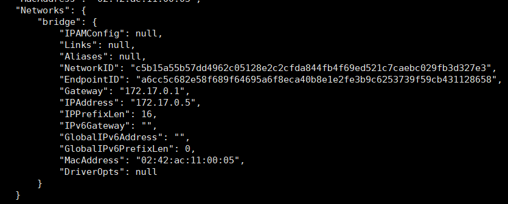
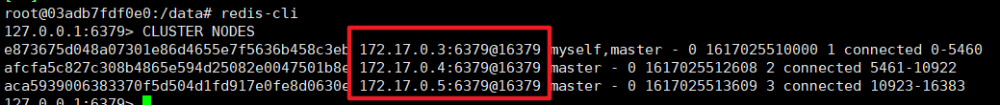

# 为接口添加缓存功能

[TOC]

---


<div style="page-break-after:always" />

## 缓存位置

在接口服务中，每一次都进行数据库查询，那么必然会给数据库造成很大的并发压力。所以需要为接口添加缓存

项目使用 Redis ，并且使用Redis的集群，Api使用 Spring-Data-Redis

所以缓存逻辑应该加载api服务处

<div style="page-break-after:always" />

## Docker搭建Redis集群

```shell
# 用于显示或设置网络设备
ifconfig
```


```shell
#拉取镜像
docker pull redis

#创建容器
docker create --name redis-node01 -v /data/redis-data/node01:/data -p 6379:6379 redis --cluster-enabled yes --cluster-config-file nodes-node-01.conf

docker create --name redis-node02 -v /data/redis-data/node02:/data -p 6380:6379 redis --cluster-enabled yes --cluster-config-file nodes-node-02.conf

docker create --name redis-node03 -v /data/redis-data/node03:/data -p 6381:6379 redis --cluster-enabled yes --cluster-config-file nodes-node-03.conf

#启动容器
docker start redis-node01 redis-node02 redis-node03

#开始组建集群
#进入redis-node01进行操作
docker exec -it redis-node01 /bin/bash
#组建集群
redis-cli --cluster create 172.17.0.1:6379 172.17.0.1:6380 172.17.0.1:6381 --cluster-replicas 0
```

### 组建集群出现连接不到redis节点问题：


但可以单独连接到每个节点


### 尝试使用redis容器的ip地址

>   172.17.0.1 是主机分配给docker容器的地址

```shell
#停止容器
docker stop redis-node01 redis-node02 redis-node03
#删除容器
docker rm redis-node01 redis-node02 redis-node03 
#删除redis目录
rm -rf /data/redis-data

#创建容器
docker create --name redis-node01 -v /data/redis-data/node01:/data -p 6379:6379 redis --cluster-enabled yes --cluster-config-file nodes-node-01.conf

docker create --name redis-node02 -v /data/redis-data/node02:/data -p 6380:6379 redis --cluster-enabled yes --cluster-config-file nodes-node-02.conf

docker create --name redis-node03 -v /data/redis-data/node03:/data -p 6381:6379 redis --cluster-enabled yes --cluster-config-file nodes-node-03.conf

#启动容器
docker start redis-node01 redis-node02 redis-node03

#查看容器的ip地址
docker inspect redis-node01 -> 172.17.0.3
docker inspect redis-node02 -> 172.17.0.5
docker inspect redis-node03 -> 172.17.0.6

#进入redis-node01进行操作
docker exec -it redis-node01 /bin/bash
#组建集群(注意端口的变化)
redis-cli --cluster create 172.17.0.3:6379 172.17.0.4:6379 172.17.0.5:6379 --cluster-replicas 0
```




集群组建成功：


**查看集群信息**

```shell
root@03adb7fdf0e0:/data# redis-cli
127.0.0.1:6379> CLUSTER NODES
```



#### 存在的问题

集群中结点的ip地址是docker容器分配的，在客户端无法访问

### 解决方案:使用host网络进行集群搭建

docker网络类型

-   None:不为容器配置任何网络功能，没有网络 --net=none
-   Container:与另一个运行中的容器共享Network Namespace，--net=container:containerID
-   Host:与主机共享Network Namespace，--net=host
-   Bridge:Docker设计的NAT网络模型（默认类型  

 **Host模式** 创建的容器没有自己独立的网络命名空间，是和物理机共享一个Network Namespace，并且共享物理机的所有端口与IP。但是它将容器直接暴露在公共网络中，是有安全隐患的


```shell
#停止容器
docker stop redis-node01 redis-node02 redis-node03
#删除容器
docker rm redis-node01 redis-node02 redis-node03
#删除redis目录
rm -rf /data/redis-data

#创建容器
docker create --name redis-node01 --net host -v /data/redis-data/node01:/data redis --cluster-enabled yes --cluster-announce-ip 8.140.130.91 --cluster-announce-bus-port 16379  --cluster-config-file nodes-node-01.conf --port 6379

docker create --name redis-node02 --net host -v /data/redis-data/node02:/data redis --cluster-enabled yes --cluster-announce-ip 8.140.130.91 --cluster-announce-bus-port 16380 --cluster-config-file nodes-node-02.conf --port 6380

docker create --name redis-node03 --net host -v /data/redis-data/node03:/data redis --cluster-enabled yes --cluster-announce-ip 8.140.130.91 --cluster-announce-bus-port 16381 --cluster-config-file nodes-node-03.conf --port 6381

#启动容器
docker start redis-node01 redis-node02 redis-node03

#进入redis-node01容器进行操作
docker exec -it redis-node01 /bin/bash
#8.140.130.91是主机的ip地址
redis-cli --cluster create 8.140.130.91:6379 8.140.130.91:6380 8.140.130.91:6381 --cluster-replicas 0
```

 --name：容器名

 -v /data/redis-data/node01:/data：容器配置文件映射到本机路径

 -p 6380:6379：端口映射

 --cluster-enabled yes：启用集群

 --cluster-config-file nodes-node-01.conf：本节点配置文件

--cluster-announce-ip 8.140.130.91：集群公网ip

--cluster-announce-bus-port 16379： 集群的总线端口

若不设置集群公网Ip及总线端口，则会出现 `JedisClusterMaxAttemptsException: No more cluster attempts left.`


查看集群信息

```shell
redis-cli
CLUSTER NODES
```


测试集群


<div style="page-break-after:always" />

## 测试集群

### 1.导入依赖

```xml
<!--redis依赖-->
<dependency>
    <groupId>org.springframework.boot</groupId>
    <artifactId>spring-boot-starter-data-redis</artifactId>
</dependency>
<dependency>
    <groupId>redis.clients</groupId>
    <artifactId>jedis</artifactId>
</dependency>
<dependency>
    <groupId>commons-io</groupId>
    <artifactId>commons-io</artifactId>
    <version>2.6</version>
</dependency>
```

### 2. redis配置文件

```properties
# redis集群配置
spring.redis.jedis.pool.max-wait = 5000
spring.redis.jedis.pool.max-Idle = 100
spring.redis.jedis.pool.min-Idle = 10
spring.redis.timeout = 10
spring.redis.cluster.nodes = 8.140.130.91:6379,8.140.130.91:6380,8.140.130.91:6381
spring.redis.cluster.max-redirects=5
```

### 3. 读取配置文件的类

```java
package com.haoke.api.config;

import lombok.Data;
import org.springframework.boot.context.properties.ConfigurationProperties;
import org.springframework.context.annotation.PropertySource;
import org.springframework.stereotype.Component;

import java.util.List;

/* 读取集群配置文件 */
@PropertySource(value = "classpath:application.properties")
@ConfigurationProperties(prefix = "spring.redis.cluster")
@Component
@Data
public class ClusterConfigurationProperties {

    private List<String> nodes;
    private Integer maxRedirects;//集群节点最大重定向数
}
```

### 注册Redis连接工厂

```java
package com.haoke.api.config;

import org.springframework.beans.factory.annotation.Autowired;
import org.springframework.context.annotation.Bean;
import org.springframework.context.annotation.Configuration;
import org.springframework.data.redis.connection.RedisClusterConfiguration;
import org.springframework.data.redis.connection.RedisConnectionFactory;
import org.springframework.data.redis.connection.jedis.JedisConnectionFactory;
import org.springframework.data.redis.core.RedisTemplate;
import org.springframework.data.redis.serializer.StringRedisSerializer;

/*redis集群工厂*/
@Configuration
public class RedisClusterConfig {

    @Autowired
    private ClusterConfigurationProperties clusterProperties;

    @Bean
    public RedisConnectionFactory connectionFactory() {//redis连接工厂
        RedisClusterConfiguration redisClusterConfiguration
                = new RedisClusterConfiguration(clusterProperties.getNodes());
        redisClusterConfiguration.setMaxRedirects(clusterProperties.getMaxRedirects());
        return new JedisConnectionFactory(redisClusterConfiguration);
    }

    @Bean
    public RedisTemplate<String,String> redisTemplate(RedisConnectionFactory redisConnectionFactory){
        RedisTemplate<String, String> redisTemplate = new RedisTemplate<>();
        redisTemplate.setConnectionFactory(redisConnectionFactory);//设置redis连接工厂
        redisTemplate.setKeySerializer(new StringRedisSerializer());//key序列化
        redisTemplate.setValueSerializer(new StringRedisSerializer());//value序列化
        redisTemplate.afterPropertiesSet();//

        return redisTemplate;
    }
}
```

### 测试类

```java
package com.haoke.api;

import org.junit.Test;
import org.junit.runner.RunWith;
import org.springframework.beans.factory.annotation.Autowired;
import org.springframework.boot.autoconfigure.SpringBootApplication;
import org.springframework.boot.test.context.SpringBootTest;
import org.springframework.data.redis.core.RedisTemplate;
import org.springframework.test.context.junit4.SpringRunner;
import redis.clients.jedis.HostAndPort;
import redis.clients.jedis.Jedis;
import redis.clients.jedis.JedisCluster;

import java.util.Set;

@RunWith(SpringRunner.class)
@SpringBootTest
public class TestRedis {

    @Autowired
    private RedisTemplate redisTemplate;

    @Test
    public void testSave(){
        for (int i = 0; i < 100; i++) {
            this.redisTemplate.opsForValue().set("key_" + i, "value_"+i);
        }

        Set<String> keys = this.redisTemplate.keys("key_*");//选择所有的键
        for (String key : keys) {
            String value = (String) this.redisTemplate.opsForValue().get(key);
            System.out.println(value);
        }
    }
}
```

```shell
#进入redis-node01容器进行操作
docker exec -it redis-node01 /bin/bash

redis-cli -c -p 6379
```


https://blog.csdn.net/qq_40091033/article/details/106682199

<div style="page-break-after:always" />

## 添加缓存逻辑

实现缓存有2种方式：

1.  每个接口单独控制缓存逻辑
2.  同一控制缓存逻辑

**判断redis缓存是否命中**：若是POST请求，需从输入流中读取返回的数据，然而redis未命中，放行请求后，由于输入流只能读取一次，输入流已被销毁，无法读取到请求参数，查询不到数据，所以需要使用包装request解决多次读取输入流中的数据

**生成redis缓存**：读取返回的结果，由AOP思想，处理控制器返回的请求

### 判断redis是否命中

#### 采取拦截器进行缓存命中

```java
package com.haoke.api.interceptor;

import com.fasterxml.jackson.databind.ObjectMapper;
import org.apache.commons.codec.digest.DigestUtils;
import org.apache.commons.io.IOUtils;
import org.apache.commons.lang3.StringUtils;
import org.springframework.beans.factory.annotation.Autowired;
import org.springframework.data.redis.core.RedisTemplate;
import org.springframework.stereotype.Component;
import org.springframework.web.servlet.HandlerInterceptor;

import javax.servlet.http.HttpServletRequest;
import javax.servlet.http.HttpServletResponse;
import java.io.IOException;
import java.util.Map;

@Component
public class RedisInterceptor implements HandlerInterceptor {

    @Autowired
    private RedisTemplate<String,String> redisTemplate;

    private static ObjectMapper mapper = new ObjectMapper();

    @Override
    public boolean preHandle(HttpServletRequest request, HttpServletResponse response, Object handler) throws Exception {

        //判断请求方式，PUT,DELETE,无需缓存,拦截器放行
        if(!StringUtils.equalsIgnoreCase(request.getMethod(),"GET")){
            if(!StringUtils.equalsIgnoreCase(request.getRequestURI(),"/graphql"))
                //POST请求有可能是GraphQL查询，也要做拦截，不放行
                return true;
        }

        //通过缓存做命中，查询redisKey
        String data = this.redisTemplate.opsForValue().get(createRedisKey(request));
        if(StringUtils.isEmpty(data)){
            //缓存未命中，则放行请求
            return true;
        }
        //若缓存命中，将data中的数据返回
        response.setCharacterEncoding("UTF-8");
        response.setContentType("application/json; charset=utf-8");
        response.getWriter().write(data);

        return false;
    }

    public static String createRedisKey(HttpServletRequest request) throws IOException {
        String paramStr = request.getRequestURI();

        Map<String,String[]> parameterMap = request.getParameterMap();

        if(parameterMap.isEmpty()){
            //URI中没有参数，则是POST的GraphQL请求，需要从请求体中获取数据
            paramStr += IOUtils.toString(request.getInputStream(),"UTF-8");
# 对于POST请求，由于在拦截器中读取了输入流中的数据，在request中的输入流只能读取一次，请求进去的Controller时，输入流已关闭，导致获取不到数据
        }else{
            paramStr += mapper.writeValueAsString(request.getParameterMap());
        }

        String redisKey = "WEB_DATA_" + DigestUtils.md5Hex(paramStr);

        return redisKey;
    }
}
```

#### 将拦截器注册到WEB容器中

```java
@Configuration
public class WebConfig implements WebMvcConfigurer {

    @Autowired
    private RedisInterceptor redisInterceptor;

    //将自定义interceptor注册到Web容器中
    @Override
    public void addInterceptors(InterceptorRegistry registry) {
        //所有请求都要经过拦截器
        registry.addInterceptor(redisInterceptor).addPathPatterns("/**");
    }
}
```

#### 测试拦截器


```
paramStr = "/graphql{"query":"query HouseResourcesList($pageSize: Int, $page: Int) {\n  HouseResourcesList(pageSize: $pageSize, page: $page) {\n    list {\n      id\n      title\n      pic\n      title\n      coveredArea\n      orientation\n      floor\n      rent\n    }\n  }\n}","variables":{"pageSize":2,"page":1},"operationName":"HouseResourcesList"}"
```

参数串形成的md5为

```
redisKey = WEB_DATA_822d7e70c286f68877cb6759b04498d4
```

由于Redis中没有键为 redisKey ，所以获取到的 data = null


然而，由于在拦截器中读取了输入流的数据，在request中的输入流只能读取一次，请求进去Controller时，输
入流中已经没有数据了，导致获取不到数据。  

#### 通过包装request解决

对HttpServetRequest进行包装

```java
package com.haoke.api.interceptor;

import org.apache.commons.io.IOUtils;

import javax.servlet.ReadListener;
import javax.servlet.ServletInputStream;
import javax.servlet.http.HttpServletRequest;
import javax.servlet.http.HttpServletRequestWrapper;
import java.io.BufferedReader;
import java.io.IOException;
import java.io.InputStreamReader;

/**
 * 包装 HttpServletRequest
 */
public class MyServletRequestWrapper extends HttpServletRequestWrapper {

    private final byte[] body;

    /**
     * Construct a wrapper for the specified request.
     *
     * @param request The request to be wrapped
     */
    public MyServletRequestWrapper(HttpServletRequest request) throws IOException {
        super(request);
        body = IOUtils.toByteArray(super.getInputStream());//将输入流读入到wrapper的成员变量中
    }

    @Override
    public BufferedReader getReader() throws IOException {
        return new BufferedReader(new InputStreamReader(getInputStream()));
    }

    @Override
    public ServletInputStream getInputStream() throws IOException {
        return new RequestBodyCachingInputStream(body);
    }

    private class RequestBodyCachingInputStream extends ServletInputStream {
        //返回一个带有缓存功能的输入流
        private byte[] body;
        private int lastIndexRetrieved = -1;
        private ReadListener listener;

        public RequestBodyCachingInputStream(byte[] body) {
            this.body = body;
        }

        @Override
        public int read() throws IOException {
            if (isFinished()) {
                return -1;
            }
            int i = body[lastIndexRetrieved + 1];
            lastIndexRetrieved++;
            if (isFinished() && listener != null) {
                try {
                    listener.onAllDataRead();
                } catch (IOException e) {
                    listener.onError(e);
                    throw e;
                }
            }
            return i;
        }

        @Override
        public boolean isFinished() {
            return lastIndexRetrieved == body.length - 1;
        }

        @Override
        public boolean isReady() {
            // This implementation will never block
            // We also never need to call the readListener from this method, as this method will never return false
            return isFinished();
        }

        @Override
        public void setReadListener(ReadListener readListener) {
            if (listener == null) {
                throw new IllegalArgumentException("listener cann not be null");
            }
            if (this.listener != null) {
                throw new IllegalArgumentException("listener has been set");
            }
            this.listener = listener;
            if (!isFinished()) {
                try {
                    listener.onAllDataRead();
                } catch (IOException e) {
                    listener.onError(e);
                }
            } else {
                try {
                    listener.onAllDataRead();
                } catch (IOException e) {
                    listener.onError(e);
                }
            }
        }

        @Override
        public int available() throws IOException {
            return body.length - lastIndexRetrieved - 1;
        }

        @Override
        public void close() throws IOException {
            lastIndexRetrieved = body.length - 1;
            body = null;
        }
    }
}
```

使用过滤器对请求进行替换

```java
package com.haoke.api.interceptor;

import org.springframework.stereotype.Component;
import org.springframework.web.filter.OncePerRequestFilter;

import javax.servlet.FilterChain;
import javax.servlet.ServletException;
import javax.servlet.http.HttpServletRequest;
import javax.servlet.http.HttpServletResponse;
import java.io.IOException;

/*
* 替换Request对象
* */
@Component
public class RequestReplaceFilter extends OncePerRequestFilter {
    //继承该类，保证过滤器仅过滤一次请求
    @Override
    protected void doFilterInternal(HttpServletRequest request, HttpServletResponse response, FilterChain filterChain) throws ServletException, IOException {
        if (!(request instanceof MyServletRequestWrapper)) {
            request = new MyServletRequestWrapper(request);
        }

        filterChain.doFilter(request, response);
    }
}
```

可见，request已经替换成了自定义的wrapper


进入 `GraphQLControll` ,发现此时请求中包含数据

### 生成缓存

>   不能通过拦截器生成缓存，因为拦截器中拿不到Controller返回的数据

通过SPring AOP实现,在结果被处理前进行拦截，拦截的逻辑自己实现，这样就可以实现拿到结果数据进行写入缓存的操作了。

```java
package com.haoke.api.interceptor;

import com.fasterxml.jackson.databind.ObjectMapper;
import com.haoke.api.controller.GraphQLController;
import org.apache.commons.lang3.StringUtils;
import org.springframework.beans.factory.annotation.Autowired;
import org.springframework.core.MethodParameter;
import org.springframework.data.redis.core.RedisTemplate;
import org.springframework.http.MediaType;
import org.springframework.http.server.ServerHttpRequest;
import org.springframework.http.server.ServerHttpResponse;
import org.springframework.http.server.ServletServerHttpRequest;
import org.springframework.web.bind.annotation.ControllerAdvice;
import org.springframework.web.bind.annotation.GetMapping;
import org.springframework.web.bind.annotation.PostMapping;
import org.springframework.web.servlet.mvc.method.annotation.ResponseBodyAdvice;

import java.time.Duration;

@ControllerAdvice
public class MyResponseBodyAdvice implements ResponseBodyAdvice {

    @Autowired
    private RedisTemplate redisTemplate;

    private ObjectMapper mapper = new ObjectMapper();

    /*
    * 选择要横切的响应
    * */
    @Override
    public boolean supports(MethodParameter returnType, Class converterType) {

        /*
        * 对所有查询进行横切，
        * 如 GET请求，POST的GraphQLL
        * */
        if(returnType.hasMethodAnnotation(GetMapping.class)){
            return true;
        }
        if(returnType.hasMethodAnnotation(PostMapping.class) &&
                StringUtils.equals(GraphQLController.class.getName(),returnType.getExecutable().getDeclaringClass().getName())){
            return true;
        }

        return false;
    }

    /*
    * 横切通知
    * */
    @Override
    public Object beforeBodyWrite(Object body,
                                  MethodParameter returnType,
                                  MediaType selectedContentType,
                                  Class selectedConverterType,
                                  ServerHttpRequest request, ServerHttpResponse response) {

        try {
            String redisKey = RedisInterceptor.createRedisKey(((ServletServerHttpRequest) request).getServletRequest());

            String redisValue;

            if(body instanceof String){
                redisValue = (String) body;
            }else{
                redisValue = mapper.writeValueAsString(body);
            }

            this.redisTemplate.opsForValue().set(redisKey,redisValue,Duration.ofHours(1));
        }catch (Exception e){
            e.getStackTrace();
        }

        return body;
    }
}
```

#### 测试

第二次查询同一数据，发现命中


查看服务器端集群


<div style="page-break-after:always" />

## 整合前端

### 命中时跨域处理

### mock的数据都是OPTIONS请求，不能拦截


讲解中有这部分内容，但我的mock都是GET请求，所以没有这种情况，仅做记录

```java
package com.haoke.api.interceptor;

import com.fasterxml.jackson.databind.ObjectMapper;
import org.apache.commons.codec.digest.DigestUtils;
import org.apache.commons.io.IOUtils;
import org.apache.commons.lang3.StringUtils;
import org.springframework.beans.factory.annotation.Autowired;
import org.springframework.data.redis.core.RedisTemplate;
import org.springframework.stereotype.Component;
import org.springframework.web.servlet.HandlerInterceptor;

import javax.servlet.http.HttpServletRequest;
import javax.servlet.http.HttpServletResponse;
import java.io.IOException;
import java.util.Map;

@Component
public class RedisInterceptor implements HandlerInterceptor {

    @Autowired
    private RedisTemplate<String,String> redisTemplate;

    private static ObjectMapper mapper = new ObjectMapper();

    @Override
    public boolean preHandle(HttpServletRequest request, HttpServletResponse response, Object handler) throws Exception {

        /*
        * 对于mock的请求，讲解中出现错误，解决方案为放行所有的mock请求
        * 但我的问题是mock请求会被存入redis缓存，所以需要放行 请求参数带mock的 GET请求
        * */
        if(StringUtils.equalsIgnoreCase(request.getMethod(), "OPTIONS")){
            return true;
        }
        if(request.getRequestURI().startsWith("/mock")){
            return true;
        }

        //判断请求方式，PUT,DELETE,无需缓存,拦截器放行
        if(!StringUtils.equalsIgnoreCase(request.getMethod(),"GET")){
            if(!StringUtils.equalsIgnoreCase(request.getRequestURI(),"/graphql"))
                //POST请求有可能是GraphQL查询，也要做拦截，不放行
                return true;
        }

        //通过缓存做命中，查询redisKey
        String data = this.redisTemplate.opsForValue().get(createRedisKey(request));
        if(StringUtils.isEmpty(data)){
            //缓存未命中，则放行请求
            return true;
        }
        //若缓存命中，将data中的数据返回
        response.setCharacterEncoding("UTF-8");
        response.setContentType("application/json; charset=utf-8");
        // 支持跨域
        response.setHeader("Access-Control-Allow-Origin", "*");
        response.setHeader("Access-Control-Allow-Methods", "GET,POST,PUT,DELETE,OPTIONS");
        response.setHeader("Access-Control-Allow-Credentials", "true");
        response.setHeader("Access-Control-Allow-Headers", "Content-Type,X-Token");
        response.setHeader("Access-Control-Allow-Credentials", "true");
        response.getWriter().write(data);

        return false;
    }

    public static String createRedisKey(HttpServletRequest request) throws IOException {
        String paramStr = request.getRequestURI();

        Map<String,String[]> parameterMap = request.getParameterMap();

        if(parameterMap.isEmpty()){
            //URI中没有参数，则是POST的GraphQL请求，需要从请求体中获取数据
            paramStr += IOUtils.toString(request.getInputStream(),"UTF-8");
        }else{
            paramStr += mapper.writeValueAsString(request.getParameterMap());
        }

        String redisKey = "WEB_DATA_" + DigestUtils.md5Hex(paramStr);

        return redisKey;
    }
}
```