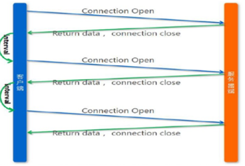
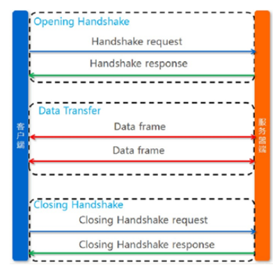
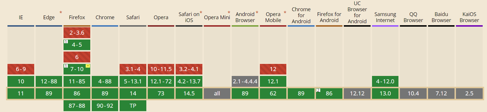
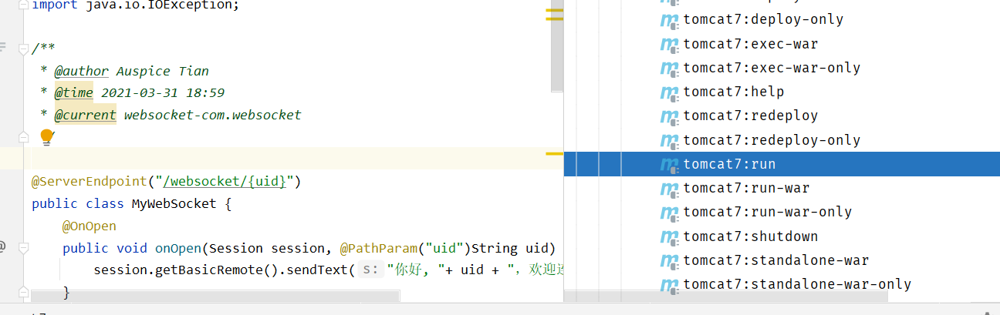
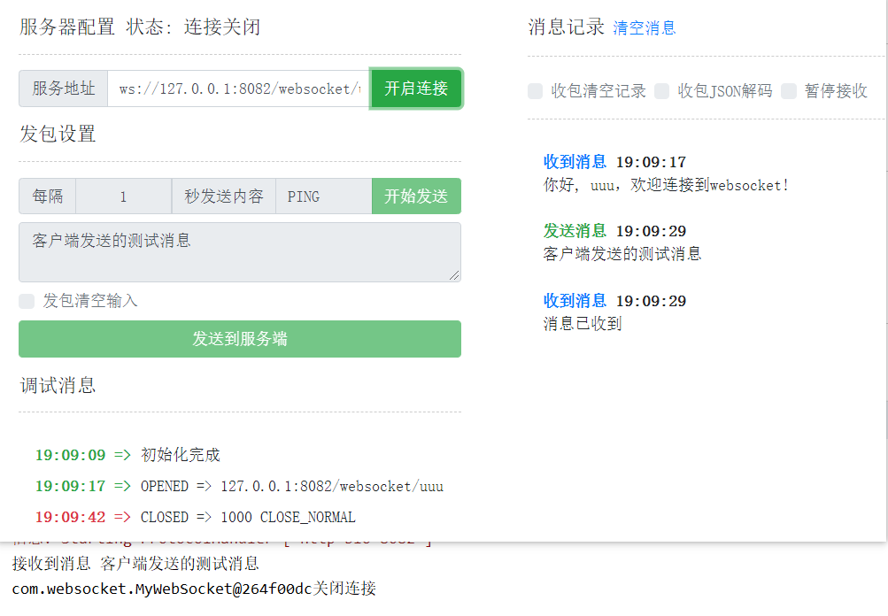
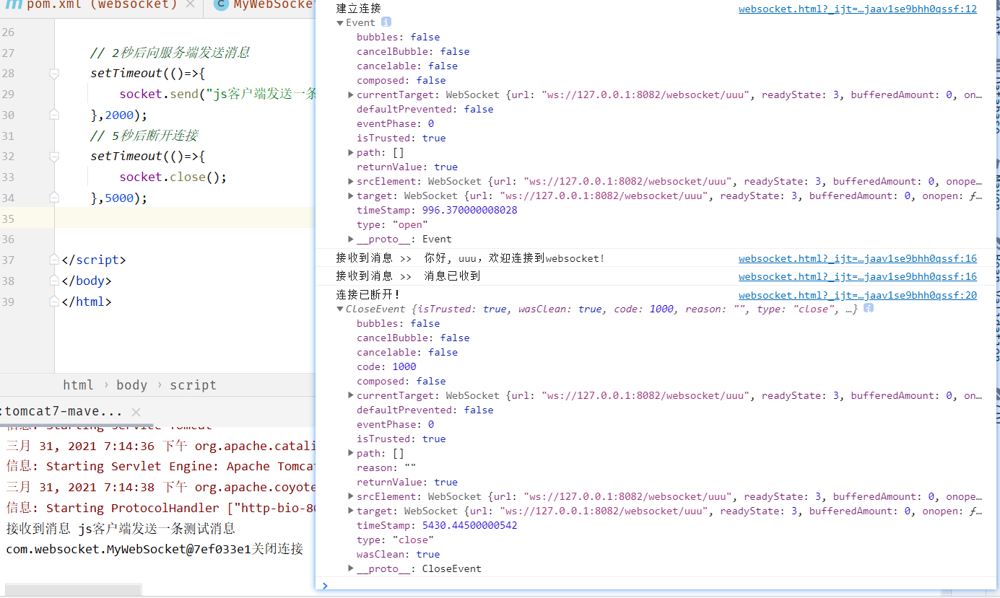
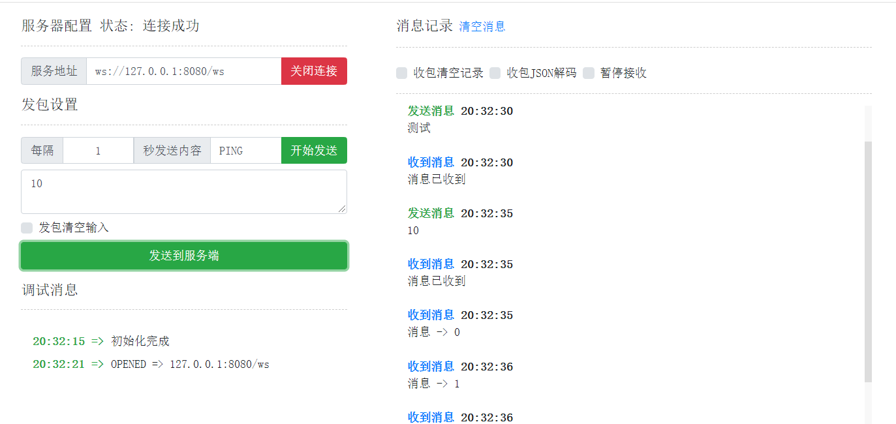
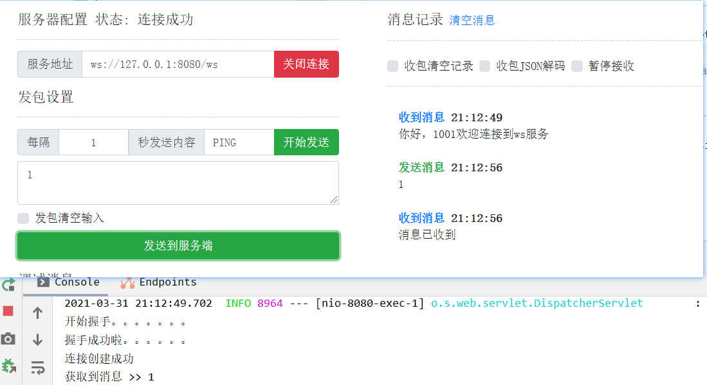

# 微聊功能

[TOC]

<div style="page-break-after:always" />

## WebSocket

### 网站中的消息功能

**服务端消息实时推送到前端**？

解决方案：采用轮询方式，即：通过js不断的请求服务器，查看是否有新数据。

**弊端**：

资源浪费

#### WebSocket简介

使用WebSocket技术解决

WebSocket 是HTML5一种新的协议。它实现了浏览器与服务器**全双工通信**。它是一种在单个TCP连
接上进行全双工通讯协议。  

>   全双工和单工的区别？
>
>   -   全双工（Full Duplex）。通信传输时允许数据在两个方向上同时传输，它在能力上相当于两个单工通信方式的结合。全双工指可以同时（瞬时）进行信号的双向传输（A→B且B→A）。
>   -   单工、半双工（Half Duplex），所谓半双工就是指一个时间段内只有一个动作发生。  

#### http与WebSocket区别

http协议是短连接，因为请求之后，都会关闭连接，下次重新请求数据，需要再次打开链接  



WebSocket协议是一种长链接，只需要通过一次请求来初始化链接，然后所有的请求和响应都是通过这个TCP链接进行通讯。  



#### 浏览器支持情况

https://caniuse.com/?search=websocket



#### 相关注解说明

-   @ServerEndpoint("/websocket/{uid}")
    -   申明这是一个websocket服务
    -   在地址中可以指定参数，需要通过{}进行占位
-   @OnOpen
    -   该方法将在建立连接后执行，会传入session对象，就是客户端与服务端建立的长连接通道
    -   public void onOpen(Session session, @PathParam("uid") String uid) throws
        IOException{}
    -   通过@PathParam获取url申明中的参数
-   @OnClose
    -   该方法是在连接关闭后执行
    -   用法：public void onClose() {}
-   @OnMessage
    -   该方法用于接收客户端发来的消息  
    -   用法：public void onMessage(String message, Session session) throws IOException {} 
    -   message：发来的消息数据
        session：会话对象（也是通道）  
-   
-   发送消息到客户端  
    -   通过session进行发送  
    -   用法：session.getBasicRemote().sendText("你好");  

### WebSocketDemo

#### pom.xml

```xml
<?xml version="1.0" encoding="UTF-8"?>
<project xmlns="http://maven.apache.org/POM/4.0.0"
         xmlns:xsi="http://www.w3.org/2001/XMLSchema-instance"
         xsi:schemaLocation="http://maven.apache.org/POM/4.0.0 http://maven.apache.org/xsd/maven-4.0.0.xsd">
    <modelVersion>4.0.0</modelVersion>

    <groupId>org.example</groupId>
    <artifactId>websocket</artifactId>
    <version>1.0-SNAPSHOT</version>

    <packaging>war</packaging>

    <dependencies>
        <dependency>
            <groupId>javax</groupId>
            <artifactId>javaee-api</artifactId>
            <version>7.0</version>
            <scope>provided</scope>
        </dependency>
    </dependencies>

    <build>
        <plugins>
            <plugin>
                <groupId>org.apache.maven.plugins</groupId>
                <artifactId>maven-compiler-plugin</artifactId>
                <version>3.2</version>
                <configuration>
                    <source>1.8</source>
                    <target>1.8</target>
                    <encoding>UTF-8</encoding>
                </configuration>
            </plugin>

            <!-- 配置Tomcat插件 -->
            <plugin>
                <groupId>org.apache.tomcat.maven</groupId>
                <artifactId>tomcat7-maven-plugin</artifactId>
                <version>2.2</version>
                <configuration>
                    <port>8082</port>
                    <path>/</path>
                </configuration>
            </plugin>
        </plugins>
    </build>
</project>
```

#### 实现websocket服务

```java
package com.websocket;

import javax.websocket.*;
import javax.websocket.server.PathParam;
import javax.websocket.server.ServerEndpoint;
import java.io.IOException;

@ServerEndpoint("/websocket/{uid}")
public class MyWebSocket {
    @OnOpen
    public void onOpen(Session session, @PathParam("uid")String uid) throws IOException {
        session.getBasicRemote().sendText("你好, "+ uid + "，欢迎连接到websocket!");
    }

    @OnClose
    public void onClose(){
        System.out.println(this + "关闭连接");
    }

    @OnError
    public void onError(Session session,Throwable error){
        System.out.println("发生错误！");
        error.printStackTrace();
    }

    @OnMessage
    public void onMessage(String message,Session session) throws IOException {
        System.out.println("接收到消息 " + message);
        session.getBasicRemote().sendText("消息已收到");
    }
}
```

编写完成后，无需进额外的配置，直接启动tomcat即可



**测试**

http://wstool.js.org/



#### 编写js客户端

```html
<!DOCTYPE html>
<html lang="en">
<head>
    <meta charset="UTF-8">
    <title>TestWebSocket</title>
</head>
<body>
<script>
    const socket = new WebSocket("ws://127.0.0.1:8082/websocket/uuu");

    socket.onopen = (ws) =>{
        console.log("建立连接",ws)
    }

    socket.onmessage =(ws)=>{
        console.log("接收到消息 >> ",ws.data);
    }

    socket.onclose = (ws) =>{
        console.log("连接已断开！", ws);
    }

    socket.onerror = (ws) => {
        console.log("发送错误！", ws);
    }

    // 2秒后向服务端发送消息
    setTimeout(()=>{
        socket.send("js客户端发送一条测试消息");
    },2000);
    // 5秒后断开连接
    setTimeout(()=>{
        socket.close();
    },5000);
</script>
</body>
</html>
```



### SpringBoot整合WebSocket

#### 导入依赖

```xml
<!--spring boot的支持-->
<parent>
    <groupId>org.springframework.boot</groupId>
    <artifactId>spring-boot-starter-parent</artifactId>
    <version>2.4.3</version>
</parent>

<dependencies>
    <!--<dependency>
            <groupId>javax</groupId>
            <artifactId>javaee-api</artifactId>
            <version>7.0</version>
            <scope>provided</scope>
        </dependency>-->
    <!--springboot的websocket与javaee-api有冲突-->
    <dependency>
        <groupId>org.springframework.boot</groupId>
        <artifactId>spring-boot-starter-websocket</artifactId>
    </dependency>
</dependencies>
```

#### 编写WebsocketHandler

```java
package com.websocket.spring;

@Component
public class MyHandler extends TextWebSocketHandler {
    @Override
    public void handleTextMessage(WebSocketSession session, TextMessage message)
            throws IOException {
        System.out.println("获取到消息 >> " + message.getPayload());
        session.sendMessage(new TextMessage("消息已收到"));
        if(message.getPayload().equals("10")){
            for (int i = 0; i < 10; i++) {
                session.sendMessage(new TextMessage("消息 -> " + i));
                try {
                    Thread.sleep(100);
                } catch (InterruptedException e) {
                    e.printStackTrace();
                }
            }
        }
    }

    @Override
    public void afterConnectionEstablished(WebSocketSession session) throws Exception {
        session.sendMessage(new TextMessage("你好，"+session.getAttributes().get("uid")+"欢迎连接到ws服务"));
    }

    @Override
    public void afterConnectionClosed(WebSocketSession session, CloseStatus status)
            throws Exception {
        System.out.println("断开连接！");
    }
}
```

#### 编写配置

```java
package com.websocket.spring;

@Configuration
@EnableWebSocket
public class WebSocketConfig implements WebSocketConfigurer {

    @Autowired
    private MyHandler myHandler;

    @Autowired
    private MyHandshakeInterceptor myHandshakeInterceptor;

    @Override
    public void registerWebSocketHandlers(WebSocketHandlerRegistry microChatHandlerRegistry) {
        microChatHandlerRegistry.addHandler(myHandler,"/ws")
                .setAllowedOrigins("*");//跨域支持
    }
}
```

#### 编写启动类

```java
package com.websocket;

@SpringBootApplication
public class MyApplication {
    public static void main(String[] args) {
        SpringApplication.run(MyApplication.class, args);
    }
}
```

#### 测试



#### websocket拦截器

在Spring中提供了websocket拦截器，可以在建立连接之前实现业务逻辑，比如校验登录等

##### 拦截器实现

```java
package com.websocket.spring;

@Component
public class MyHandshakeInterceptor implements HandshakeInterceptor {
    /**
     * 握手之前，若返回false，则不建立链接
     *
     * @param request
     * @param response
     * @param wsHandler
     * @param attributes
     * @return
     * @throws Exception
     */
    @Override
    public boolean beforeHandshake(ServerHttpRequest serverHttpRequest, ServerHttpResponse serverHttpResponse,
                                   WebSocketHandler microChatHandler, Map<String, Object> map) throws Exception {
        //将用户id放入socket处理器的会话(WebSocketSession)中
        map.put("uid", 1001);
        System.out.println("开始握手。。。。。。。");
        return true;
    }

    @Override
    public void afterHandshake(ServerHttpRequest serverHttpRequest, ServerHttpResponse serverHttpResponse, WebSocketHandler microChatHandler, Exception e) {
        System.out.println("握手成功啦。。。。。。");
    }
}
```

##### 将拦截器添加到websocket中

```java
package com.websocket.spring;

@Configuration
@EnableWebSocket
public class WebSocketConfig implements WebSocketConfigurer {

    @Autowired
    private MyHandler myHandler;

    @Autowired
    private MyHandshakeInterceptor myHandshakeInterceptor;

    @Override
    public void registerWebSocketHandlers(WebSocketHandlerRegistry microChatHandlerRegistry) {
        microChatHandlerRegistry.addHandler(myHandler,"/ws")
                .addInterceptors(myHandshakeInterceptor)//添加拦截器
                .setAllowedOrigins("*");//跨域支持
    }
}
```



<div style="page-break-after:always" />

## MongoDB


