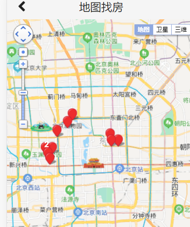
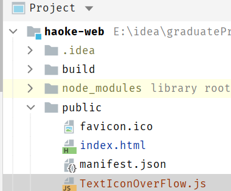
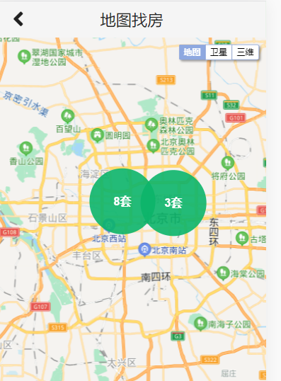
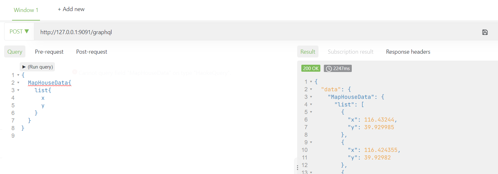
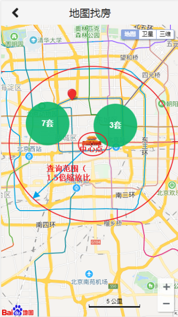
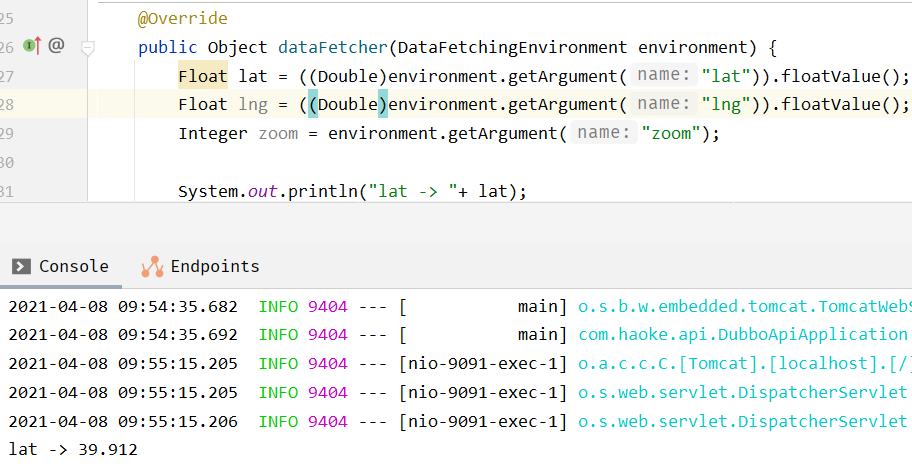

# Graph

## 百度地图api

文档：http://lbsyun.baidu.com/index.php?title=jspopular3.0

### 导入BMap

```html
<script type="text/javascript" src="https://api.map.baidu.com/api?v=3.0&ak=q60ejYQeO2qZO6dYhWPOHea4aY0bhrqG&s=1"></script>
    <script type="text/javascript" src="http://api.map.baidu.com/library/TextIconOverlay/1.2/src/TextIconOverlay_min.js"></script>
    <script type="text/javascript" src="http://api.map.baidu.com/library/MarkerClusterer/1.2/src/MarkerClusterer_min.js"></script>
```

若在子模块直接使用BMap,会出现未定义的错误，原因是组件未加载

需要在 public/index.html 中，先将BMap和BMapLib载入到window

```html
<script type="text/javascript">
    window.BMap = BMap;
    window.BMapLib = BMapLib;
</script>
```



### 使用自定义OverFlowIcon





### 修改数据加载逻辑

#### graphql接口

```graphql
schema {
    query: HaokeQuery
}

type HaokeQuery{
    #分页查询房源信息-应用于前台房源信息
    HouseResourcesList(page:Int, pageSize:Int):TableResult
    # 通过Id查询房源信息
    HouseResources(id:ID): HouseResources

    #首页广告图-应用于前台首页
    IndexAdList: IndexAdResult

    #地图查房房源数据
    MapHouseData:MapHouseDataResult
}

type MapHouseDataResult{
    list:[MapHouseXY]
}

type MapHouseXY{
    x:Float
    y:Float
}
```

#### 编写MapHouseDataResult、MapHouseXY

```java
package com.haoke.api.vo.map;

@Data
@AllArgsConstructor
@NoArgsConstructor
public class MapHouseDataResult {
    private List<MapHouseXY> list;
}
```

```java
package com.haoke.api.vo.map;

@Data
@AllArgsConstructor
@NoArgsConstructor
public class MapHouseXY {
    private Float x;
    private Float y;
}
```

#### MapHouseDataFetcher Graphql接口

```java
package com.haoke.api.graphql.myDataFetcherImpl;

@Component
public class MapHouseDataFetcher implements MyDataFetcher {
    @Override
    public String fieldName() {
        return "MapHouseData";
    }

    @Override
    public Object dataFetcher(DataFetchingEnvironment environment) {
        List<MapHouseXY> list = new ArrayList<>();
        list.add(new MapHouseXY(116.43244f,39.929986f));
        list.add(new MapHouseXY(116.424355f,39.92982f));
        list.add(new MapHouseXY(116.423349f,39.935214f));
        list.add(new MapHouseXY(116.350444f,39.931645f));
        list.add(new MapHouseXY(116.351684f,39.91867f));
        list.add(new MapHouseXY(116.353983f,39.913855f));
        list.add(new MapHouseXY(116.357253f,39.923152f));
        list.add(new MapHouseXY(116.349168f,39.923152f));
        list.add(new MapHouseXY(116.36232f,39.938339f));
        list.add(new MapHouseXY(116.374249f,39.94625f));
        list.add(new MapHouseXY(116.380178f,39.953053f));
        return new MapHouseDataResult(list);
    }
}
```

#### 测试Graphql接口



#### 整合前端

```jsx
import { ApolloClient, gql , InMemoryCache} from '@apollo/client';

const client = new ApolloClient({
  uri: "http://127.0.0.1:9091/graphql",
  cache: new InMemoryCache()
});

//定义查询
const GET_MAP_HOUSE = gql`
  {
    MapHouseData {
      list {
        x 
        y
      }
    }
  }
`;

client.query({query: GET_MAP_HOUSE}).then(result =>{
    let xys = result.data.MapHouseData.list;
    var markers = [];
    var pt = null;
    for (var i in xys) {
        pt = new BMap.Point(xys[i].x, xys[i].y);
        markers.push(new BMap.Marker(pt));
    }

    // 地图上覆盖物的聚合效果
    var markerClusterer = new BMapLib.MarkerClusterer(map, {
        markers: markers,
        girdSize: 100,
        styles: [{
            background: 'rgba(12,181,106,0.9)',
            size: new BMap.Size(92, 92),
            textSize: '16',
            textColor: '#fff',
            borderRadius: 'true'
        }],
    });
    markerClusterer.setMaxZoom(50);
    markerClusterer.setGridSize(50);
});
```

#### 整合前端测试

测试后，数据是从后端传来的，则数据加载逻辑修改成功


### 增加拖动事件

在地图拖动后，增加事件，获取中心位置的坐标，以便后续的查询  

```jsx
map.addEventListener("dragend", function showInfo(){
    let cp = map.getCenter();
    let zoom = map.getZoom(); //缩放级别
    console.log(cp.lng + "," + cp.lat+" --> " + zoom);
});
```

百度地图缩放比例：  

| 级别 | 比例尺  |
| ---- | ------- |
| 19级 | 20m     |
| 18级 | 50m     |
| 17级 | 100m    |
| 16级 | 200m    |
| 15级 | 500m    |
| 14级 | 1km     |
| 13级 | 2km     |
| 12级 | 5km     |
| 11级 | 10km    |
| 10级 | 20km    |
| 9级  | 25km    |
| 8级  | 50km    |
| 7级  | 100km   |
| 6级  | 200km   |
| 5级  | 500km   |
| 4级  | 1000km  |
| 3级  | 2000km  |
| 2级  | 5000km  |
| 1级  | 10000km |

### 传递经纬度和缩放比例参数



#### 实现目标

拖动地图，更新范围内的房源数据

#### 原理

1.  拖动地图
2.  获取地图中心点
3.  将当前中心点的经纬度传及缩放比传递到后台
4.  后台根据计算出的搜索范围，查询数据

#### 实现

##### 定义graphql接口

```graphql
type HaokeQuery{
    #分页查询房源信息-应用于前台房源信息
    HouseResourcesList(page:Int, pageSize:Int):TableResult
    # 通过Id查询房源信息
    HouseResources(id:ID): HouseResources

    #首页广告图-应用于前台首页
    IndexAdList: IndexAdResult

    #地图查房房源数据
    MapHouseData(lng:Float,lat:Float,zoom:Int):MapHouseDataResult
}

---
query queryMapHouseData($lng:Float,$lat:Float,$zoom:Int){
  MapHouseData(lng:$lng,lat:$lat,zoom:$zoom){
    list{
      x
      y
    }
  }
}
---
{
	"lng":116.54461241348382,
	"lat":39.91201079295558,
	"zoom":12
}
```

##### 后台接口接收参数

```java
package com.haoke.api.graphql.myDataFetcherImpl;

@Component
public class MapHouseDataFetcher implements MyDataFetcher {
    @Override
    public String fieldName() {
        return "MapHouseData";
    }

    @Override
    public Object dataFetcher(DataFetchingEnvironment environment) {
        Float lat = environment.getArgument("lat");
        Float lng = environment.getArgument("lng");
        Integer zoom = environment.getArgument("zoom");

        System.out.println("lat -> "+ lat);
        ...
    }
}
```


**修改为**

```java
Float lat = ((Double)environment.getArgument("lat")).floatValue();
Float lng = ((Double)environment.getArgument("lng")).floatValue();
Integer zoom = environment.getArgument("zoom");

System.out.println("lat -> "+ lat);
```



##### 前端代码修改

```jsx
import React from 'react';
import { Icon} from 'semantic-ui-react'
import { ApolloClient, gql , InMemoryCache} from '@apollo/client';

const client = new ApolloClient({
  uri: "http://127.0.0.1:9091/graphql",
  cache: new InMemoryCache()
});

//定义查询
const GET_MAP_HOUSE = gql`
  query queryMapHouseData($lng:Float,$lat:Float,$zoom:Int){
    MapHouseData(lng:$lng,lat:$lat,zoom:$zoom){
      list{
        x
        y
      }
    }
  }
`;

// 百度地图API功能
const BMap = window.BMap;
const BMapLib = window.BMapLib;

const showMapMarker =(xys,map)=>{
  let markers = [];
  let pt = null;
  for (let i in xys) {
    pt = new BMap.Point(xys[i].x, xys[i].y);
    markers.push(new BMap.Marker(pt));
  }

  // 地图上覆盖物的聚合效果
  var markerClusterer = new BMapLib.MarkerClusterer(map, {
    markers: markers,
    girdSize: 100,
    styles: [{
      background: 'rgba(12,181,106,0.9)',
      size: new BMap.Size(92, 92),
      textSize: '16',
      textColor: '#fff',
      borderRadius: 'true'
    }],
  });
  markerClusterer.setMaxZoom(50);
  markerClusterer.setGridSize(50);
}

class MapHouse extends React.Component {
  constructor(props) {
    super(props);
  }
  componentDidMount() {

    //设置初始中心点
    let defaultX = 121.48130241985999;
    let defaultY = 31.235156971414239;
    let defaultZoom = 12;

    // 创建Map实例
    let map = new BMap.Map("allmap");
    // 初始化地图,设置中心点坐标和地图级别
    map.centerAndZoom(new BMap.Point(defaultX,defaultY), defaultZoom);

    // 开启鼠标滚轮缩放
    map.enableScrollWheelZoom(true);

    // 添加地图类型控件
    map.addControl(new BMap.MapTypeControl());
    // 设置地图缩放比例尺控件
    map.addControl(new BMap.ScaleControl({
      anchor: window.BMAP_NAVIGATION_CONTROL_ZOOM
    }));
    // 设置地图导航
    map.addControl(new BMap.NavigationControl({
      enableGeolocation: true
    }));
    // 设置缩略图控件。
    map.addControl(new BMap.OverviewMapControl());
    // 设置地图显示的城市 此项是必须设置的
    map.setCurrentCity("上海");


    /*拖拽事件，更新范围内房源
    * 获取中心点，取数据，更新地图
    * */
    let showInfo = () => {
      let cp = map.getCenter();
      let zoom = map.getZoom(); //缩放级别
      // console.log(cp.lng + "," + cp.lat+" --> " + zoom);
      client.query({query: GET_MAP_HOUSE, variables: {"lng":cp.lng,"lat":cp.lat,"zoom":zoom}}).then(
          result =>{
            let xys = result.data.MapHouseData.list;
            showMapMarker(xys,map);
      });
    }

    map.addEventListener("dragstart",()=>{map.clearOverlays();}); //拖动开始事件
    map.addEventListener("dragend",showInfo); //拖动结束事件
    map.addEventListener("zoomstart", ()=>{map.clearOverlays();}); //缩放开始事件
    map.addEventListener("zoomend",showInfo); //缩放结束事件

    /*初始化*/
    client.query({query: GET_MAP_HOUSE,variables: {"lng":defaultX,"lat":defaultY,"zoom":defaultZoom}}).then(
        result =>{
      let xys = result.data.MapHouseData.list;
      showMapMarker(xys,map)
    });
  }
  render() {
    return ( 
      <div className = 'map-house' >
        <div className = "map-house-title">
          <Icon onClick = {this.props.hideMap} name = 'angle left' size = 'large'/> 地图找房 
        </div> 
        <div className = "map-house-content" id='allmap'></div>
      </div>
    );
  }
}
export default MapHouse;
```

### MongoDB的地理位置索引

在MongoDB中，支持存储位置的经纬度，可以对其索引，通过算子操作，进行查找附近的数据，如：查找附近的人，附近的建筑

**将房源数据导入到MongoDB**

```shell
###进入容器
docker exec -it mongodb /bin/bash

###进入mongo
mongo

###切换数据库
use haoke

###创建索引
db.house.createIndex({loc:'2d'}) #为house表的loc字段创建地理2d索引
db.house.createIndex({hid:1},{unique:true}) #为house表的hid字段创建唯一索引

#通过百度api查询地址的经纬度
http://api.map.baidu.com/geocoder/v2/?address=上海
xxxx&ak=q60ejYQeO2qZO6dYhWPOHea4aY0bhrqG&output=json

###插入数据
db.house.insert({hid:1,title:'整租 · 南丹大楼 1居室 7500',loc:[121.4482236974557,31.196523937504549]})
db.house.insert({hid:2,title:'陆家嘴板块，精装设计一室一厅，可拎包入住诚意租。',loc:[121.51804613891443,31.238878702131506]})
db.house.insert({hid:3,title:'整租 · 健安坊 1居室 4050',loc:[121.4148310693774,31.16507733043528]})
db.house.insert({hid:4,title:'整租 · 中凯城市之光+视野开阔+景色秀丽+拎包入住',loc:[121.43528282056717,31.198687949417815]})
db.house.insert({hid:5,title:'整租 · 南京西路品质小区 21213三轨交汇 配套齐* 拎包入住',loc:[121.43528282056717,31.198687949417815]})
db.house.insert({hid:6,title:'祥康里 简约风格 *南户型 拎包入住 看房随时',loc:[121.47521508401232,31.23859308719981]})
db.house.insert({hid:7,title:'整租 · 桃源新村 1室0厅 5500元',loc:[121.488377804633,31.23113867155927]})
db.house.insert({hid:8,title:'整租 · 中山公园品质小区，两房朝南厅朝南，家电家具精装*配',loc:[121.42038642151562,31.225078800208654]})
db.house.insert({hid:9,title:'整租 · 近地铁2号线，精装1房1厅，高区朝南，享受阳光好房',loc:[121.42933310871683,31.221943586471036]})
db.house.insert({hid:10,title:'整租 · 2.3.4号中山公园地铁，背靠来福士，采光好，诚意出租',loc:[121.42063977421182,31.221023374982044]})
```

**mongodb地理位置的索引**

注意距离要除以111.2（1度=111.2km），跟普通查找的区别仅仅是多了两个算子 `\$near` 和 `\$maxDistance`  

```shell
#查询上海人民广场附近5公里的房源，人民广场的坐标为：121.48130241985999,31.235156971414239

> db.house.find({loc:{$near:[121.48130241985999,31.235156971414239],$maxDistance:5/111.12 }})
{ "_id" : ObjectId("606e6eb7c34903ae9b73d0dd"), "hid" : 6, "title" : "祥康里 简约风格 *南户型 拎包入住 看房随时", "loc" : [ 121.47521508401232, 31.23859308719981 ] }
{ "_id" : ObjectId("606e6ebfc34903ae9b73d0de"), "hid" : 7, "title" : "整租 · 桃源新村 1室0厅 5500元", "loc" : [ 121.488377804633, 31.23113867155927 ] }
{ "_id" : ObjectId("606e6e95c34903ae9b73d0d9"), "hid" : 2, "title" : "陆家嘴板块，精装设计一室一厅，可拎包入住诚意租。", "loc" : [ 121.51804613891443, 31.238878702131505 ] }

#查询上海中山公园附近2公里的房源，中山公园的坐标为：121.42261657004589,31.229111410235285
> db.house.find({loc:{$near:[121.42261657004589,31.229111410235285],$maxDistance:2/111.12 }})
{ "_id" : ObjectId("606e6ec3c34903ae9b73d0df"), "hid" : 8, "title" : "整租 · 中山公园品质小区，两房朝南厅朝南，家电家具精装*配", "loc" : [ 121.42038642151562, 31.225078800208653 ] }
{ "_id" : ObjectId("606e6ecdc34903ae9b73d0e1"), "hid" : 10, "title" : "整租 · 2.3.4号中山公园地铁，背靠来福士，采光好，诚意出租", "loc" : [ 121.42063977421182, 31.221023374982042 ] }
{ "_id" : ObjectId("606e6ec8c34903ae9b73d0e0"), "hid" : 9, "title" : "整租 · 近地铁2号线，精装1房1厅，高区朝南，享受阳光好房", "loc" : [ 121.42933310871683, 31.221943586471035 ] }
```

### 实现基于MongoDB的查询

#### mongo依赖

```xml
<!--mongo依赖-->
<dependency>
    <groupId>org.springframework.boot</groupId>
    <artifactId>spring-boot-starter-data-mongodb</artifactId>
</dependency>
```

#### 配置文件

```properties
#mongodb配置
spring.data.mongodb.uri=mongodb://8.140.130.91:6379:27017/haoke
```

#### Mapper层代码

##### pojo

```java
package com.haoke.api.pojo;

@Data
@AllArgsConstructor
@NoArgsConstructor
@Document(collection = "house")//指定表名称
@Builder
public class MongoHouse {

    @Id
    @JsonSerialize(using = ToStringSerializer.class)
    private ObjectId id;

    private Long hid;
    private String title;
    private Float[] loc;
}
```

##### service

```java
package com.haoke.api.service;

@Service
public class MongoHouseService {
    public static final Map<Integer, Double> BAIDU_ZOOM = new HashMap<>();
    static {
        BAIDU_ZOOM.put(19, 20d / 1000); //单位为km
        BAIDU_ZOOM.put(18, 50d / 1000);
        BAIDU_ZOOM.put(17, 100d / 1000);
        BAIDU_ZOOM.put(16, 200d / 1000);
        BAIDU_ZOOM.put(15, 500d / 1000);
        BAIDU_ZOOM.put(14, 1d);
        BAIDU_ZOOM.put(13, 2d);
        BAIDU_ZOOM.put(12, 5d);
        BAIDU_ZOOM.put(11, 10d);
        BAIDU_ZOOM.put(10, 20d);
        BAIDU_ZOOM.put(9, 25d);
        BAIDU_ZOOM.put(8, 50d);
        BAIDU_ZOOM.put(7, 100d);
        BAIDU_ZOOM.put(6, 200d);
        BAIDU_ZOOM.put(5, 500d);
        BAIDU_ZOOM.put(4, 1000d);
        BAIDU_ZOOM.put(3, 2000d);
        BAIDU_ZOOM.put(2, 5000d);
        BAIDU_ZOOM.put(1, 10000d);
    }

    @Autowired
    private MongoTemplate mongoTemplate;

    /*
    * 从mongo中产讯数据，返回地图房源数据
    * */
    public MapHouseDataResult queryHouseData(Float lng,Float lat,Integer zoom){

        double distance = BAIDU_ZOOM.get(zoom)*1.5/111.12;

        Query query = Query.query(Criteria.where("loc").near(new Point(lng,lat)).maxDistance(distance));

        //查询数据
        List<MongoHouse> mongoHouses = this.mongoTemplate.find(query, MongoHouse.class);

        List<MapHouseXY> list = new ArrayList<>();

        for (MongoHouse mongoHouse : mongoHouses) {
            list.add(new MapHouseXY(mongoHouse.getLoc()[0], mongoHouse.getLoc()[1]));
        }

        return new MapHouseDataResult(list);
    }
}
```

#### 接口实现

```java
package com.haoke.api.graphql.myDataFetcherImpl;

@Component
public class MapHouseDataFetcher implements MyDataFetcher {
    @Autowired
    private MongoHouseService mongoHouseService;

    @Override
    public String fieldName() {
        return "MapHouseData";
    }

    @Override
    public Object dataFetcher(DataFetchingEnvironment environment) {
        Float lat = ((Double)environment.getArgument("lat")).floatValue();
        Float lng = ((Double)environment.getArgument("lng")).floatValue();
        Integer zoom = environment.getArgument("zoom");

        System.out.println("lat -> "+ lat);

        return this.mongoHouseService.queryHouseData(lng,lat,zoom);
    }
}
```


