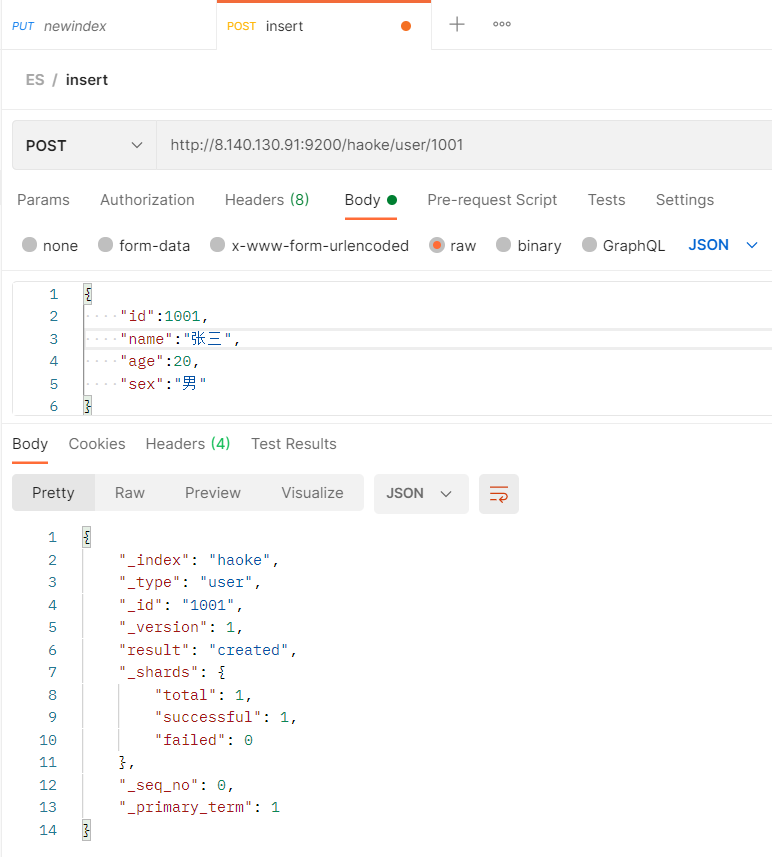
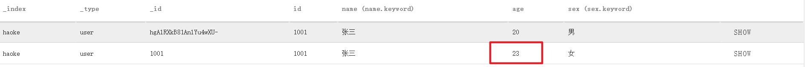
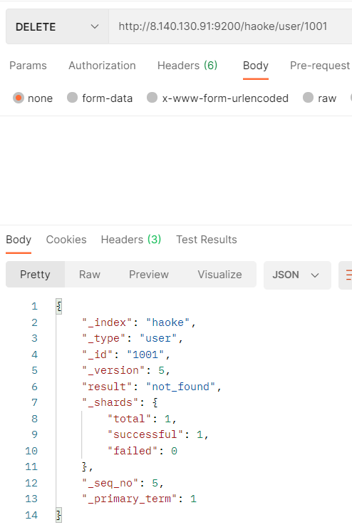
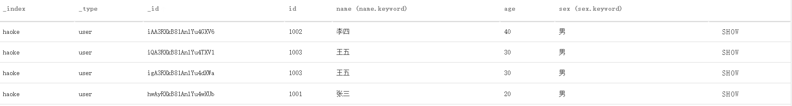
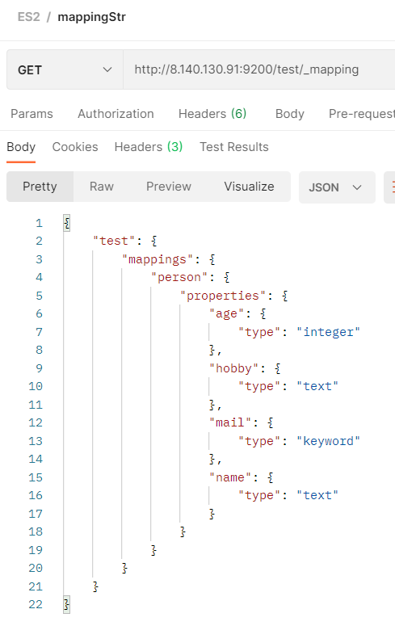
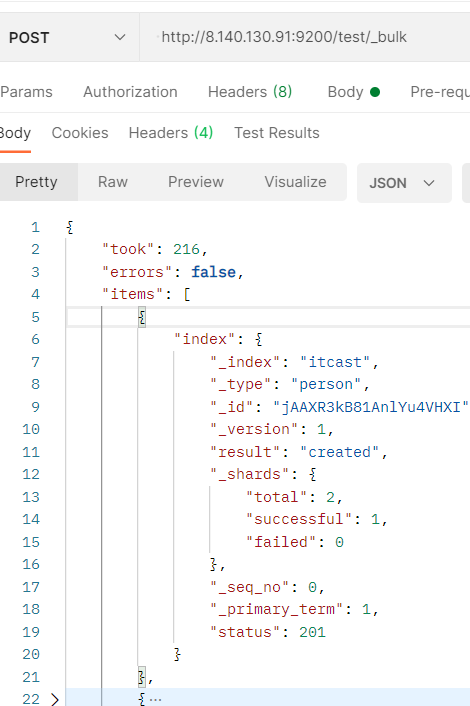
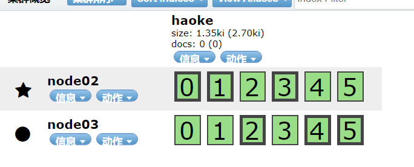

# Elastic Search

## Elastci Stack

ELK(旧称呼),由ElasticSearch、Logstash、Kibana组成，及新加入的Beats


**ElasticSearch**

基于Java，是开源分布式搜索引擎，特点有：分布式、零配置、自动发现，索引自动分片、索引副本机制、restful风格接口，多数据源、自动搜索负载

**Logstash**

基于Java，可以用于手机，分析和存储日志的工具

由于与Beats功能部分重叠，现用于数据处理

**Kibana**

基于nodejs，开源免费工具，Kibana可以为Logstash和ElasticSearch提供的日志分析友好的web界面，可以汇总、分析和搜索重要数据日志

**Beats**

采集系统监控数据的代理agent，是在被监控服务器上以客户端形式运行的数据收集器的统称。可以直接把数据发送给ElasticSearch或者通过LogStash发送给ElasticSearch，然后进行后续的数据分析活动

Beats组成

-   PacketBeat：网络数据分析器，用于监控、收集网络流量信息、Packetbeat嗅探服务器之间的流
    量，解析应用层协议，并关联到消息的处理，其支 持ICMP (v4 and v6)、DNS、HTTP、Mysql、PostgreSQL、Redis、MongoDB、Memcache等协议；
-   Filebeat：用于监控、收集服务器日志文件，其已取代 logstash forwarder  
-   Metricbeat：可定期获取外部系统的监控指标信息，其可以监控、收集 Apache、HAProxy、MongoDB 、MySQL、Nginx、PostgreSQL、Redis、System、Zookeeper等服务；  
-   Winlogbeat：用于监控、收集Windows系统的日志信息；  

## ES简介

ElasticSearch是一个基于Lucene的搜索服务器。提供了一个分布式多用户能力的全文搜索引擎，基于RESTful web接口

ElasticSearch是用JAVA开发的。达到实时搜索，稳定可靠，快速，安装方便

**搜索方案的目标**

-   运行速度快，实时搜索
-   零配置和完全免费的搜索模式
-   能够简单地使用JSON通过HTTP来索引数据
-   搜索服务器可靠性
-   搜索服务器易于扩展
-   简单的多租户
-   建立云解决方案

[Elasticsearch：官方分布式搜索和分析引擎 | Elastic](https://www.elastic.co/cn/elasticsearch/)

## 安装

### 单机安装

#### 版本说明

ElasticSearch的发展非常快速，在ES5.0之前，ELK各个版本不同意出现了版本号的混乱状态，所以从5.0开始，所有的Elastic Stack中的项目全部同一版本号。

#### 下载

[Download Elasticsearch Free | Get Started Now | Elastic | Elastic](https://www.elastic.co/cn/downloads/elasticsearch)

#### 单机版安装

```shell
#解压安装包
cd /opt
tar -xvf elasticsearch-7.12.0-linux-x86_64.tar.gz  -C /opt
cd elasticsearch-7.12.0/config

# 修改配置文件
vim elasticsearch.yml

#通过指定相同网段的其他节点会加入该集群中 0.0.0.0任意IP都可以访问elasticsearch
network.host: 0.0.0.0
http.port: 9200
discovery.zen.ping.unicast.hosts: ["192.168.182.130"]
bootstrap.memory_lock: false
bootstrap.system_call_filter: false

#说明：在Elasticsearch中如果，network.host不是localhost或者127.0.0.1的话，就会认为是生产环境，会对环境的要求比较高，我们的测试环境不一定能够满足，一般情况下需要修改2处配置，如下：
#1：修改jvm启动参数
vim jvm.options
-Xms64m
-Xmx64m
#2：单个进程中的最大线程数
vm.max_map_count=655360

# 创建elsearch用户，ElasticSearch不支持root用户运行
useradd elsearch

#切换程序所有者
chown elsearch:elsearch elasticsearch-7.12.0 -R

#启动ES服务
su - elsearch
cd /opt/elasticsearch-7.12.0/bin
./elasticsearch 或 ./elasticsearch -d #后台系统

# 通过访问看到一下信息，则ES启动成功
##http://8.140.130.91:9200/
{
  "name" : "iZ2zeg4pktzjhp9h7wt6doZ",
  "cluster_name" : "elasticsearch",
  "cluster_uuid" : "_na_",
  "version" : {
    "number" : "7.12.0",
    "build_flavor" : "default",
    "build_type" : "tar",
    "build_hash" : "78722783c38caa25a70982b5b042074cde5d3b3a",
    "build_date" : "2021-03-18T06:17:15.410153305Z",
    "build_snapshot" : false,
    "lucene_version" : "8.8.0",
    "minimum_wire_compatibility_version" : "6.8.0",
    "minimum_index_compatibility_version" : "6.0.0-beta1"
  },
  "tagline" : "You Know, for Search"
}
```

### 通过docker安装

```shell
# 拉取镜像 elasticsearch必须带标签
docker pull elasticsearch:6.5.4

# 创建容器
docker create --name elasticsearch --net host -e "discovery.type=single-node" -e "network.host=0.0.0.0" elasticsearch:6.5.4

{
  "name" : "_JPw0-e",
  "cluster_name" : "docker-cluster",
  "cluster_uuid" : "Ax65AN3LQrybZIFeM_IiIg",
  "version" : {
    "number" : "6.5.4",
    "build_flavor" : "default",
    "build_type" : "tar",
    "build_hash" : "d2ef93d",
    "build_date" : "2018-12-17T21:17:40.758843Z",
    "build_snapshot" : false,
    "lucene_version" : "7.5.0",
    "minimum_wire_compatibility_version" : "5.6.0",
    "minimum_index_compatibility_version" : "5.0.0"
  },
  "tagline" : "You Know, for Search"
}
```

### ES可视化工具

Edge：Elasticvue


## 基本概念

>   映射

-   关系数据库中的表结构(schema)
-   所有文档写进索引之前都会先进性分析，然后将输入的文本分割为词条，哪些词条会被过滤，这种信息为叫映射。由 **用户自定义规则**

>   索引

-   Elasticsearch对逻辑数据的逻辑存储，所以它可以分为更小的部分
-   看做关系型数据库的表，索引的结构是为快速有效的全文索引准备的，特别是它 **不存储原始值** ，原始数据应该存储在数据库中
-   ElasticSearch的索引可看做MongoDB的一个集合， 存储的数据结构为 **json**
-   ElasticSearch 可以把索引存放在一台机器或者 **分布** 在多台服务器，每个索引有一个或 **多个分片** （shard），每个分片可以有  **多个副本**（replica）

>   文档

-   存储在ElasticSearch中的主要实体叫文档（document）,相当于关系数据库中的一行记录

-   ElasticSearch和MongoDB中的文档相似，都可以有不同的结构，但ElasticSearch的文档中，**相同字段必须有相同类型**

-   文档由多个字段组成，每个字段可能多次出现在一个文档中，称为多值字段（multivalued）

-   每个字段的类型，可以是文本，数值，日期等，字段类型也可以是复杂类型，一个字段包含其他子文档或者数组

-   只要 `_id` 不同,ES将会判断为不同文档，即使两个文档内容相同

    

>   文档类型

-   在ElasticSearch中，一个索引对象可以存储多种不同用途的对象，eg:一个博客应用程序可以保存文章和评论
-   每个文档可以有不同结构
-   **同一索引中同一属性名必须有相同数据类型**

## RESTfulAPI

### 创建非结构化索引

在Lucene中，创建索引是需要定义字段名称以及字段的类型的 (ES底层为Lucene)

在Elasticsearch中提供了非结构化的索引，就是不需要创建索引结构，即可写入数据到索引中——在Elasticsearch底层会进行结构化操作，此操作对用户是透
明的

#### 可视化工具创建


```json
The index 'test' was successfully created.
{
    "acknowledged":true,
    "shards_acknowledged":true,
    "index":"test"
}
```


#### ==API创建==

```json
/*请求*/
PUT http://8.140.130.91:9200/haoke

/*请求体*/
{
    "settings": {
        "index": {
            "number_of_shards": "2",
            "number_of_replicas": "0"
        }
    }
}
```


### 删除索引


### 插入数据

>   POST http://8.140.130.91/{索引}/{类型}/{id}

**关于id的生成**

-   指定id ，用PUT请求也可插入数据
-   ES生成id，必须使用POST请求插入数据

```json
请求：
POST http://8.140.130.91:9200/haoke/user/1001

/* 请求体 */
{
    "id":1001,
    "name":"张三",
    "age":20,
    "sex":"男"
}
```




---

```json
# 请求：
POST http://8.140.130.91:9200/haoke/user

# 请求体
{
    "id":1001,
    "name":"张三",
    "age":20,
    "sex":"男"
}

# 返回
{
    "_index": "haoke",
    "_type": "user",
    "_id": "hgAlRXkB81AnlYu4wXU-",
    "_version": 1,
    "result": "created",
    "_shards": {
        "total": 1,
        "successful": 1,
        "failed": 0
    },
    "_seq_no": 1,
    "_primary_term": 1
}
```


### 更新数据

在Elasticsearch中，文档数据是不为修改的，但是可以通过覆盖的方式进行更新

---

**全部更新**

```json
#请求
PUT http://8.140.130.91:9200/haoke/user/1001

#请求体
{
    "id":1001,
    "name":"张三",
    "age":21,
    "sex":"女"
}

#返回
{
    "_index": "haoke",
    "_type": "user",
    "_id": "1001",
    "_version": 2,# 版本号已加一
    "result": "updated",
    "_shards": {
        "total": 1,
        "successful": 1,
        "failed": 0
    },
    "_seq_no": 2,
    "_primary_term": 1
}
```

可见分片中数据已更新


---

**局部更新**

2.  修改它
3.  删除旧文档
4.  索引新文档  

```json
# 请求
# 注意：这里多了_update标识
POST http://8.140.130.91:9200/haoke/user/1001/_update

# 请求体
{
    "doc":{
        "age":23
    }
}

# 返回
{
    "_index": "haoke",
    "_type": "user",
    "_id": "1001",
    "_version": 3,# 版本号已变成3
    "result": "updated",
    "_shards": {
        "total": 1,
        "successful": 1,
        "failed": 0
    },
    "_seq_no": 3,
    "_primary_term": 1
}
```



### 删除数据

在Elasticsearch中，删除文档数据，只需要发起DELETE请求即可  

```json
# 请求
DELETE http://8.140.130.91:9200/haoke/user/1001

#返回
{
    "_index": "haoke",
    "_type": "user",
    "_id": "1001",
    "_version": 4,# 版本已变成4
    "result": "deleted",
    "_shards": {
        "total": 1,
        "successful": 1,
        "failed": 0
    },
    "_seq_no": 4,
    "_primary_term": 1
}
```

如果删除一条不存在的数据，会响应404  



>   删除一个文档，数据不会立即从磁盘上移除，只是被标记为已删除。
>
>   ES将在添加更多索引时，才会在后台进行删除内容的清理

### 搜索数据



---

**条件搜索**

>    根据id搜索

```json
# 请求
GET http://8.140.130.91:9200/haoke/user/hwAyRXkB81AnlYu4wXUb

#返回
{
    "_index": "haoke",
    "_type": "user",
    "_id": "hwAyRXkB81AnlYu4wXUb",
    "_version": 1,
    "found": true,
    "_source": {
        "id": 1001,
        "name": "张三",
        "age": 20,
        "sex": "男"
    }
}
```

---

**搜索全部数据**

```json
# 请求
GET http://8.140.130.91:9200/haoke/user/_search

# 返回
{
    "took": 8,
    "timed_out": false,
    "_shards": {
        "total": 2,
        "successful": 2,
        "skipped": 0,
        "failed": 0
    },
    "hits": {
        "total": 4,
        "max_score": 1.0,
        "hits": [
            {
                "_index": "haoke",
                "_type": "user",
                "_id": "iAA3RXkB81AnlYu4GXV6",
                "_score": 1.0,
                "_source": {
                    "id": 1002,
                    "name": "李四",
                    "age": 40,
                    "sex": "男"
                }
            },
            {
                "_index": "haoke",
                "_type": "user",
                "_id": "iQA3RXkB81AnlYu4TXV1",
                "_score": 1.0,
                "_source": {
                    "id": 1003,
                    "name": "王五",
                    "age": 30,
                    "sex": "男"
                }
            },
            {
                "_index": "haoke",
                "_type": "user",
                "_id": "igA3RXkB81AnlYu4dXWa",
                "_score": 1.0,
                "_source": {
                    "id": 1003,
                    "name": "王五",
                    "age": 30,
                    "sex": "男"
                }
            },
            {
                "_index": "haoke",
                "_type": "user",
                "_id": "hwAyRXkB81AnlYu4wXUb",
                "_score": 1.0,
                "_source": {
                    "id": 1001,
                    "name": "张三",
                    "age": 20,
                    "sex": "男"
                }
            }
        ]
    }
}
```

>   默认返回10条数据

---

**关键字查询**

```json
# 请求
GET http://8.140.130.91:9200/haoke/user/_search?q=age:20

#返回
{
    "took": 16,
    "timed_out": false,
    "_shards": {
        "total": 2,
        "successful": 2,
        "skipped": 0,
        "failed": 0
    },
    "hits": {
        "total": 1,
        "max_score": 1.0,
        "hits": [
            {
                "_index": "haoke",
                "_type": "user",
                "_id": "hwAyRXkB81AnlYu4wXUb",
                "_score": 1.0,
                "_source": {
                    "id": 1001,
                    "name": "张三",
                    "age": 20,
                    "sex": "男"
                }
            }
        ]
    }
}
```

### DSL搜索

Elasticsearch提供丰富且灵活的查询语言叫做**DSL查询(Query DSL)**  

用于复杂查询，组合查询

DSL(Domain Specific Language特定领域语言)以 **JSON请求体** 的形式出现,所以请求方式为POST

---

match ==

```json
# 请求
POST http://8.140.130.91:9200/haoke/user/_search

# 请求体
{
    "query" : {
        "match" : { # 相当于==
            "age" : 20
        }
    }
}

# 返回
{
    "took": 2,
    "timed_out": false,
    "_shards": {
        "total": 2,
        "successful": 2,
        "skipped": 0,
        "failed": 0
    },
    "hits": {
        "total": 1,
        "max_score": 1.0,
        "hits": [
            {
                "_index": "haoke",
                "_type": "user",
                "_id": "hwAyRXkB81AnlYu4wXUb",
                "_score": 1.0,
                "_source": {
                    "id": 1001,
                    "name": "张三",
                    "age": 20,
                    "sex": "男"
                }
            }
        ]
    }
}
```

---

查询年龄大于30岁的男性用户  

must ==

filter if

```json
# 请求
POST http://8.140.130.91:9200/haoke/user/_search

# 请求体
{
	"query": {
		"bool": {
			"filter": {
                "range": {
                    "age": {
                        "gt": 30
                    }
                }
            },
            "must": {
                "match": {
                    "sex": "男"
                }
			}
		}
	}
}

# 返回
{
    "took": 29,
    "timed_out": false,
    "_shards": {
        "total": 2,
        "successful": 2,
        "skipped": 0,
        "failed": 0
    },
    "hits": {
        "total": 1,
        "max_score": 0.13353139,
        "hits": [
            {
                "_index": "haoke",
                "_type": "user",
                "_id": "iAA3RXkB81AnlYu4GXV6",
                "_score": 0.13353139,
                "_source": {
                    "id": 1002,
                    "name": "李四",
                    "age": 40,
                    "sex": "男"
                }
            }
        ]
    }
}
```

---

全文搜索

```json
# 请求
POST http://8.140.130.91:9200/haoke/user/_search

# 请求体
{
    "query": {
        "match": {
        	"name": "张三 李四"
        }
    }
}

#请求
{
    "took": 6,
    "timed_out": false,
    "_shards": {
        "total": 2,
        "successful": 2,
        "skipped": 0,
        "failed": 0
    },
    "hits": {
        "total": 2,
        "max_score": 1.9616584,
        "hits": [
            {
                "_index": "haoke",
                "_type": "user",
                "_id": "iAA3RXkB81AnlYu4GXV6",
                "_score": 1.9616584,
                "_source": {
                    "id": 1002,
                    "name": "李四",
                    "age": 40,
                    "sex": "男"
                }
            },
            {
                "_index": "haoke",
                "_type": "user",
                "_id": "hwAyRXkB81AnlYu4wXUb",
                "_score": 0.5753642,
                "_source": {
                    "id": 1001,
                    "name": "张三",
                    "age": 20,
                    "sex": "男"
                }
            }
        ]
    }
}
```

### 高亮显示

```json
# 请求
POST http://8.140.130.91:9200/haoke/user/_search

# 请求体
{
    "query": {
        "match": {
            "name": "张三 李四"
        }
    },
    "highlight": {
        "fields": {
            "name": {}
        }
    }
}

# 返回
{
    "took": 54,
    "timed_out": false,
    "_shards": {
        "total": 2,
        "successful": 2,
        "skipped": 0,
        "failed": 0
    },
    "hits": {
        "total": 2,
        "max_score": 1.9616584,
        "hits": [
            {
                "_index": "haoke",
                "_type": "user",
                "_id": "iAA3RXkB81AnlYu4GXV6",
                "_score": 1.9616584,
                "_source": {
                    "id": 1002,
                    "name": "李四",
                    "age": 40,
                    "sex": "男"
                },
                "highlight": {
                    "name": [
                        "<em>李</em><em>四</em>"
                    ]
                }
            },
            {
                "_index": "haoke",
                "_type": "user",
                "_id": "hwAyRXkB81AnlYu4wXUb",
                "_score": 0.5753642,
                "_source": {
                    "id": 1001,
                    "name": "张三",
                    "age": 20,
                    "sex": "男"
                },
                "highlight": {
                    "name": [
                        "<em>张</em><em>三</em>"
                    ]
                }
            }
        ]
    }
}
```

### 聚合

类似SQL中的group by操作  

```json
#请求
POST http://8.140.130.91:9200/haoke/user/_search

# 请求体
{
    "aggs": {
        "all_interests": {
            "terms": {
                "field": "age"
            }
        }
    }
}

# 返回
{
    "took": 29,
    "timed_out": false,
    "_shards": {
        "total": 2,
        "successful": 2,
        "skipped": 0,
        "failed": 0
    },
    "hits": {
        "total": 4,
        "max_score": 1.0,
        "hits": [
            {
                "_index": "haoke",
                "_type": "user",
                "_id": "iAA3RXkB81AnlYu4GXV6",
                "_score": 1.0,
                "_source": {
                    "id": 1002,
                    "name": "李四",
                    "age": 40,
                    "sex": "男"
                }
            },
            {
                "_index": "haoke",
                "_type": "user",
                "_id": "iQA3RXkB81AnlYu4TXV1",
                "_score": 1.0,
                "_source": {
                    "id": 1003,
                    "name": "王五",
                    "age": 30,
                    "sex": "男"
                }
            },
            {
                "_index": "haoke",
                "_type": "user",
                "_id": "igA3RXkB81AnlYu4dXWa",
                "_score": 1.0,
                "_source": {
                    "id": 1003,
                    "name": "王五",
                    "age": 30,
                    "sex": "男"
                }
            },
            {
                "_index": "haoke",
                "_type": "user",
                "_id": "hwAyRXkB81AnlYu4wXUb",
                "_score": 1.0,
                "_source": {
                    "id": 1001,
                    "name": "张三",
                    "age": 20,
                    "sex": "男"
                }
            }
        ]
    },
    "aggregations": {
        "all_interests": {
            "doc_count_error_upper_bound": 0,
            "sum_other_doc_count": 0,
            "buckets": [
                {
                    "key": 30,
                    "doc_count": 2
                },
                {
                    "key": 20,
                    "doc_count": 1
                },
                {
                    "key": 40,
                    "doc_count": 1
                }
            ]
        }
    }
}
```

## ES核心

### 文档

文档以JSON格式进行存储，可以是复杂的结构

#### 元数据(metadata)

一个文档不只是数据。它还包括了元数据(metadata)——关于文档的信息。三个必须的元数据结点是

| 节点   | 说明               |
| ------ | ------------------ |
| _index | 文档存储的地方     |
| _type  | 文档代表的对象的类 |
| _id    | 文档的唯一标识     |

>    _index

索引(index)类似于关系数据库中的数据库 ——存储和索引关联数据的地方

事实上，数据被存储和索引在 **分片(shards)** 中，索引只是一个把一个或多个分片分组在一起的逻辑空间。只需要记住，文档存储在 **索引(index)** 中，剩下的细节交给ES处理。

>    _type

每个对象都属于一个**类**(class)，这个类定义了属性或与对象关联的数据

 在关系数据库中，我们经常将相同类的对象存储在一个表里，因为它们有着相同的结构；同理在ES中，我们使用相同 **类型(type)** 的文档表示相同的 事物，因为他们的结构是相同的

每个 **类型(type)** 都有自己的 **映射(mapping)** 或者结构定义，就像传统数据库表中的列一样。所有 **类型(type)** 下的文档被存储在同一个索引下，但是类型的 **映射(mapping)** 会告诉ES不同的文档如何被索引

`_type` 可以是大写或小写，不能包含下划线或逗号

>   _id

id :字符串 与 `_index` 和 `_type` 组合时，就可以在ES中唯一标识一个文档。当创建一个文档，你可以自定义 `_id` （支持PUT方式），也可以让ES自动生成32位长度（只能POST方式）

### 查询响应

#### 格式化JSON结果——pretty

在查询url后添加pretty参数

```json
# 请求
http://8.140.130.91:9200/haoke/user/1005?pretty
```

#### 指定查询字段

在响应的数据中，可以指定某些需要的字段进行返回

```json
# 请求
GET http://8.140.130.91:9200/haoke/user/iAA3RXkB81AnlYu4GXV6?_source=id,name

# 返回
{
    "_index": "haoke",
    "_type": "user",
    "_id": "iAA3RXkB81AnlYu4GXV6",
    "_version": 1,
    "found": true,
    "_source": {
        "name": "李四",
        "id": 1002
    }
}
```

---

只返回数据

```json
# 请求
GET http://8.140.130.91:9200/haoke/user/iAA3RXkB81AnlYu4GXV6/_source

# 返回
{
    "id": 1002,
    "name": "李四",
    "age": 40,
    "sex": "男"
}
```

---

只返回数据且指定字段

```json
# 请求
GET http://8.140.130.91:9200/haoke/user/iAA3RXkB81AnlYu4GXV6/_source?_source=id,name

# 返回
{
    "name": "李四",
    "id": 1002
}
```

### 判断文档是否存在

只是判断文档是否存在，不查询文档内容

```json
HEAD http://8.140.130.91:9200/haoke/user/iAA3RXkB81AnlYu4GXV6
```


---

```json
HEAD http://8.140.130.91:9200/haoke/user/1
```


>   查询结果只是表示查询时刻存在与否，并不代表之后是否存在

### 批量操作

减少网络请求

#### 批量查询

```json
# 请求
POST http://8.140.130.91:9200/haoke/user/_mget

# 请求体
{
    "ids": [
        "iAA3RXkB81AnlYu4GXV6",
        "iQA3RXkB81AnlYu4TXV1"
    ]
}

# 返回
{
    "docs": [
        {
            "_index": "haoke",
            "_type": "user",
            "_id": "iAA3RXkB81AnlYu4GXV6",
            "_version": 1,
            "found": true,
            "_source": {
                "id": 1002,
                "name": "李四",
                "age": 40,
                "sex": "男"
            }
        },
        {
            "_index": "haoke",
            "_type": "user",
            "_id": "iQA3RXkB81AnlYu4TXV1",
            "_version": 1,
            "found": true,
            "_source": {
                "id": 1003,
                "name": "王五",
                "age": 30,
                "sex": "男"
            }
        }
    ]
}
```

---

如果，某一条数据不存在，不影响整体响应，需要通过 `found` 的值进行判断是否查询到数据

```json
# 请求体
{
    "ids": [
        "iAA3RXkB81AnlYu4GXV6",
        "1"
    ]
}

# 返回
{
    "docs": [
        {
            "_index": "haoke",
            "_type": "user",
            "_id": "iAA3RXkB81AnlYu4GXV6",
            "_version": 1,
            "found": true,
            "_source": {
                "id": 1002,
                "name": "李四",
                "age": 40,
                "sex": "男"
            }
        },
        {
            "_index": "haoke",
            "_type": "user",
            "_id": "2",
            "found": false
        }
    ]
}
```

#### _bulk 操作

在ES中，支持批量修改，都是通过 `_bulk` 的api完成

请求格式

```json
{ action: { metadata }}\n
{ request body }\n
{ action: { metadata }}\n
{ request body }\n
# 最后一行是需要回车的
```

---

>   批量插入数据

```json
# 请求
POST http://8.140.130.91:9200/haoke/user/_bulk

# 请求体
{"create":{"_index":"haoke","_type":"user","_id":2001}}
{"id":2001,"name":"name1","age": 20,"sex": "男"}
{"create":{"_index":"haoke","_type":"user","_id":2002}}
{"id":2002,"name":"name2","age": 20,"sex": "男"}
{"create":{"_index":"haoke","_type":"user","_id":2003}}
{"id":2003,"name":"name3","age": 20,"sex": "男"}


# 返回
{
    "took": 12,
    "errors": false,
    "items": [
        {
            "create": {
                "_index": "haoke",
                "_type": "user",
                "_id": "2001",
                "_version": 1,
                "result": "created",
                "_shards": {
                    "total": 1,
                    "successful": 1,
                    "failed": 0
                },
                "_seq_no": 9,
                "_primary_term": 1,
                "status": 201
            }
        },
        {
            "create": {
                "_index": "haoke",
                "_type": "user",
                "_id": "2002",
                "_version": 1,
                "result": "created",
                "_shards": {
                    "total": 1,
                    "successful": 1,
                    "failed": 0
                },
                "_seq_no": 3,
                "_primary_term": 1,
                "status": 201
            }
        },
        {
            "create": {
                "_index": "haoke",
                "_type": "user",
                "_id": "2003",
                "_version": 1,
                "result": "created",
                "_shards": {
                    "total": 1,
                    "successful": 1,
                    "failed": 0
                },
                "_seq_no": 4,
                "_primary_term": 1,
                "status": 201
            }
        }
    ]
}
```


---

>   批量删除

```json
# 请求
POST http://8.140.130.91:9200/haoke/user/_bulk

#请求体
{"delete":{"_index":"haoke","_type":"user","_id":2001}}
{"delete":{"_index":"haoke","_type":"user","_id":2002}}
{"delete":{"_index":"haoke","_type":"user","_id":2003}}


# 返回
{
    "took": 4,
    "errors": false,
    "items": [
        {
            "delete": {
                "_index": "haoke",
                "_type": "user",
                "_id": "2001",
                "_version": 2,
                "result": "deleted",
                "_shards": {
                    "total": 1,
                    "successful": 1,
                    "failed": 0
                },
                "_seq_no": 10,
                "_primary_term": 1,
                "status": 200
            }
        },
        {
            "delete": {
                "_index": "haoke",
                "_type": "user",
                "_id": "2002",
                "_version": 2,
                "result": "deleted",
                "_shards": {
                    "total": 1,
                    "successful": 1,
                    "failed": 0
                },
                "_seq_no": 5,
                "_primary_term": 1,
                "status": 200
            }
        },
        {
            "delete": {
                "_index": "haoke",
                "_type": "user",
                "_id": "2003",
                "_version": 2,
                "result": "deleted",
                "_shards": {
                    "total": 1,
                    "successful": 1,
                    "failed": 0
                },
                "_seq_no": 6,
                "_primary_term": 1,
                "status": 200
            }
        }
    ]
}
```

---

>   批量操作的性能

-   整个批量请求需要被加载到接受我们请求节点的内存里，所以请求越大，给其它请求可用的内存就越小。有一个最佳的bulk请求大小。超过这个大小，性能不再提升而且可能降低。
-   最佳大小，当然并不是一个固定的数字。它完全取决于你的硬件、你文档的大小和复杂度以及索引和搜索的负载。
-   幸运的是，这个最佳点(sweetspot)还是容易找到的：试着批量索引标准的文档，随着大小的增长，当性能开始降低，说明你每个批次的大小太大了。开始的数量可以在1000~5000个文档之间，如果你的文档非常大，可以使用较小的批次。
-   通常着眼于你请求批次的物理大小是非常有用的。一千个1kB的文档和一千个1MB的文档大不相同。一个好的批次最好保持在5-15MB大小间  

### 分页

和sql使用 `limit` 关键字返回只有一页的结果一样，ES接收 `from` 和 `size` 参数

```
size: 结果数，默认10
from：跳过开始的结果数，默认0
```

**避免分页太深或者一次请求太多结果**

结果在返回前会被排序，一个搜索请求常常涉及多个分片。每个分片生成自己排好序的结果，它们接着需要集中起来排序以确保整体排序正确。

---

eg:每页查询5个结果，页码从1到3

```
GET /_search?size=5
GET /_search?size=5&from=5
GET /_search?size=5&from=10
```


---

在集群系统中分页是有问题的

假设在一个有5个主分片的索引中搜索。当我们请求结果的第一页（结果1到10）时，每个分片产生自己最顶端10个结果然后返回它们给**请求节点(requesting node)**，它再排序这所有的50个结果以选出顶端的10个结果。
假设请求第1000页（结果10001到10010）。工作方式都相同，不同的是每个分片都必须产生顶端的10010个结果。然后请求节点排序这50050个结果并丢弃50040个  

可以看到在分布式系统中，排序结果的花费随着分页的深入而成倍增长。这也是为什么网络搜索引擎中任何语句不能返回多于1000个结果的原因  

### 映射

我们创建的索引以及插入数据，都是由Elasticsearch进行自动判断类型，有些时候我们是需要进行明确字段类型的，否则，自动判断的类型和实际需求是不相符的。  

#### 自动判断的规则

| JSON type                        | Field type |
| -------------------------------- | ---------- |
| Boolean: true or false           | "boolean"  |
| Whole number: 123                | "long"     |
| Floating point: 123.45           | "double"   |
| String, valid date: "2014-09-15" | "date"     |
| String: "foo bar"                | "string"   |

#### ES中文支持

| 类型           | 表示的数据类型                |
| -------------- | ----------------------------- |
| String         | string , text , keyword       |
| Whole number   | byte , short , integer , long |
| Floating point | float , double                |
| Boolean        | boolean                       |
| Date           | date                          |

-   string类型在ElasticSearch 旧版本中使用较多，从ElasticSearch 5.x开始不再支持string，由 `text` 和 `keyword` 类型替代  
-   `text` 类型，当一个字段是要被全文搜索的，比如Email内容、产品描述，应该使用text类型。**设置text类型以后，字段内容会被分析**，在生成倒排索引以前，字符串会被分析器分成一个一个**词项**。**text类型的字段不用于排序，很少用于聚合**
-   `keyword` 类型，适用于索引结构化的字段，比如email地址、主机名、状态码和标签。如果字段需要进行过滤(比如查找已发布博客中status属性为published的文章)、排序、聚合。**keyword类型的字段只能通过精确值搜索到**。  

---

#### 创建明确的索引

```json
# 请求
PUT http://8.140.130.91:9200/test

# 请求体
{
    "settings": {
        "index": {
            "number_of_shards": "2",
            "number_of_replicas": "0"
        }
    },
    "mappings": {
        "person": {
            "properties": {
                "name": {
                    "type": "text"
                },
                "age": {
                    "type": "integer"
                },
                "mail": {
                    "type": "keyword"
                },
                "hobby": {
                    "type": "text"
                }
            }
        }
    }
}

# 返回
{
    "acknowledged": true,
    "shards_acknowledged": true,
    "index": "test"
}
```

---

#### 查看索引

```
GET http://8.140.130.91:9200/test/_mapping
```



---

#### 插入数据

```json
# 请求
POST http://8.140.130.91:9200/test/_bulk

# 请求体
{"index":{"_index":"test","_type":"person"}}
{"name":"张三","age": 20,"mail": "111@qq.com","hobby":"羽毛球、乒乓球、足球"}
{"index":{"_index":"test","_type":"person"}}
{"name":"李四","age": 21,"mail": "222@qq.com","hobby":"羽毛球、乒乓球、足球、篮球"}
{"index":{"_index":"test","_type":"person"}}
{"name":"王五","age": 22,"mail": "333@qq.com","hobby":"羽毛球、篮球、游泳、听音乐"}
{"index":{"_index":"test","_type":"person"}}
{"name":"赵六","age": 23,"mail": "444@qq.com","hobby":"跑步、游泳"}
{"index":{"_index":"test","_type":"person"}}
{"name":"孙七","age": 24,"mail": "555@qq.com","hobby":"听音乐、看电影"}

```




### 结构化查询

#### 给定值查询

##### term查询

`term` 主要用于**精确匹配值**，比如数字，日期，布尔值或 `not_analyzed` 的字符串（未经分析的文本数据类型）

```json
{ "term": { "age": 26 }}
{ "term": { "date": "2014-09-01" }}
{ "term": { "public": true }}
{ "term": { "tag": "full_text" }}

```

---

```json
# 请求
POST http://8.140.130.91:9200/test/person/_search

# 请求体
{
    "query": {
        "term": {
            "age": 20
        }
    }
}

# 返回
{
    "took": 2,
    "timed_out": false,
    "_shards": {
        "total": 2,
        "successful": 2,
        "skipped": 0,
        "failed": 0
    },
    "hits": {
        "total": 1,
        "max_score": 1.0,
        "hits": [
            {
                "_index": "test",
                "_type": "person",
                "_id": "lgAZR3kB81AnlYu4xnXV",
                "_score": 1.0,
                "_source": {
                    "name": "张三",
                    "age": 20,
                    "mail": "111@qq.com",
                    "hobby": "羽毛球、乒乓球、足球"
                }
            }
        ]
    }
}
```

##### 同一字段多值查询

`terms` 跟 `term` 类似，但 `term` 允许指定多个匹配条件。如果某个字段指定了多个值，那么文档需要一起去做匹配

```json
# 请求
POST http://8.140.130.91:9200/test/person/_search

# 请求体
{
    "query": {
        "terms": {
            "age": [20,21]
        }
    }
}

# 返回
{
    "took": 3,
    "timed_out": false,
    "_shards": {
        "total": 2,
        "successful": 2,
        "skipped": 0,
        "failed": 0
    },
    "hits": {
        "total": 2,
        "max_score": 1.0,
        "hits": [
            {
                "_index": "test",
                "_type": "person",
                "_id": "lgAZR3kB81AnlYu4xnXV",
                "_score": 1.0,
                "_source": {
                    "name": "张三",
                    "age": 20,
                    "mail": "111@qq.com",
                    "hobby": "羽毛球、乒乓球、足球"
                }
            },
            {
                "_index": "test",
                "_type": "person",
                "_id": "lwAZR3kB81AnlYu4xnXV",
                "_score": 1.0,
                "_source": {
                    "name": "李四",
                    "age": 21,
                    "mail": "222@qq.com",
                    "hobby": "羽毛球、乒乓球、足球、篮球"
                }
            }
        ]
    }
}
```

#### 给定范围查询

`range` 过滤允许我们按照指定范围查找一批数据

```json
{
    "range": {
        "age": {
            "gte": 20,
            "lt": 30
        }
    }
}
```

**操作符**

gt :: 大于
gte :: 大于等于
lt :: 小于
lte :: 小于等于  

---

eg:  20 <= age < 22

```json
# 请求
POST http://8.140.130.91:9200/test/person/_search

# 请求体
{
    "query": {
        "range": {
            "age": {
                "gte": 20,
                "lt": 22
            }
        }
    }
}

# 返回
{
    "took": 6,
    "timed_out": false,
    "_shards": {
        "total": 2,
        "successful": 2,
        "skipped": 0,
        "failed": 0
    },
    "hits": {
        "total": 2,
        "max_score": 1.0,
        "hits": [
            {
                "_index": "test",
                "_type": "person",
                "_id": "lgAZR3kB81AnlYu4xnXV",
                "_score": 1.0,
                "_source": {
                    "name": "张三",
                    "age": 20,#
                    "mail": "111@qq.com",
                    "hobby": "羽毛球、乒乓球、足球"
                }
            },
            {
                "_index": "test",
                "_type": "person",
                "_id": "lwAZR3kB81AnlYu4xnXV",
                "_score": 1.0,
                "_source": {
                    "name": "李四",
                    "age": 21,#
                    "mail": "222@qq.com",
                    "hobby": "羽毛球、乒乓球、足球、篮球"
                }
            }
        ]
    }
}
```

#### exists查询

`exists` 查询可用于查找文档中是否包含指定字段或没有某个字段，类似与SQL语句中的 `IS_NULL`

```json
# 请求
POST http://8.140.130.91:9200/test/person/_search

{
    "query": {
        "exists": { #必须包含card属性
        	"field": "card"
        }
    }
}
```


#### match查询

>    `match` 查询是一个标准查询，不管你需要 **全文本查询** 还是 **精确查询** 基本上都要用到它  

-   如果你使用 `match` 查询一个全文本字段(text类型)，它会在真正查询之前用分析器先分析 match 一下查询字符  

-   如果用 match 下指定了一个确切值，在遇到数字，日期，布尔值或者 not_analyzed 的字符串时，它将为你搜索你给定的值  

```json
{ "match": { "age": 26 }}
{ "match": { "date": "2014-09-01" }}
{ "match": { "public": true }}
{ "match": { "tag": "full_text" }}
```

#### bool查询——查询组合

`bool` 查询可以用来合并多个条件查询结果的布尔逻辑，它包含一下操作符：  

-   `must` :: 多个查询条件的完全匹配,相当于 and 。
-   `must_not` :: 多个查询条件的相反匹配，相当于 not 。
-   `should` :: 至少有一个查询条件匹配, 相当于 or 。  

```json
{
    "bool": {
        "must": { "term": { "folder": "inbox" }},
        "must_not": { "term": { "tag": "spam" }},
        "should": [
            { "term": { "starred": true }},
            { "term": { "unread": true }}
        ]
    }
}
```

### 过滤查询

ES支持过滤查询，如term、range、match等

```json
# 请求
POST http://8.140.130.91:9200/test/person/_search

# 请求体
{
    "query": {
        "bool": {
            "filter":{
                "term":{
                    "age":20
                }
            }
        }
    }
}

# 返回
{
    "took": 4,
    "timed_out": false,
    "_shards": {
        "total": 2,
        "successful": 2,
        "skipped": 0,
        "failed": 0
    },
    "hits": {
        "total": 1,
        "max_score": 0.0,
        "hits": [
            {
                "_index": "test",
                "_type": "person",
                "_id": "lgAZR3kB81AnlYu4xnXV",
                "_score": 0.0,
                "_source": {
                    "name": "张三",
                    "age": 20,
                    "mail": "111@qq.com",
                    "hobby": "羽毛球、乒乓球、足球"
                }
            }
        ]
    }
}
```

---

>    查询和过滤的比较：

-   一条过滤语句会询问每个文档的字段值是否包含着特定值
-   查询语句会询问每个文档的字段值与特定值的匹配程度如何  
    -   一条查询语句会计算每个文档与查询语句的相关性，会给出一个相关性评分  `_score` ，并且 按照相关性对匹配到的文档进行排序。 这种评分方式非常适用于一个没有完全配置结果的全文本搜索  
-   一个简单的文档列表，快速匹配运算并存入内存是十分方便的， 每个文档仅需要1个字节。这些**缓存的过滤结果集与后续请求的结合使用是非常高效的**  
-   查询语句不仅要查找相匹配的文档，还需要计算每个文档的相关性，所以一般来说查询语句要比 过滤语句更耗时，并且查询结果也不可缓存  

**做精确匹配搜索时，最好用过滤语句，因为过滤语句可以缓存数据**

## 分词器

### Standard

>   标准分词器，按照单词切分，结果转化为小写，**英文**

```json
# 请求
POST http://8.140.130.91:9200/_analyze

# 请求体
{
    "analyzer": "standard",
    "text": "A man becomes learned by asking questions."
}

# 返回
{
    "tokens": [
        {
            "token": "a",# 词汇
            "start_offset": 0,# 开始下标
            "end_offset": 1,# 结束下标+1
            "type": "<ALPHANUM>",
            "position": 0
        },
        {
            "token": "man",
            "start_offset": 2,
            "end_offset": 5,
            "type": "<ALPHANUM>",
            "position": 1
        }
        ...
    ]
}
```

### Simple

>   按照非单词切分，并且做小写处理 **英文 空格或特殊符号**

```json
# 请求 
POST http://8.140.130.91:9200/_analyze

# 请求体
{
    "analyzer": "simple",
    "text": "If the document doesn't already exist"
}

# 返回
{
    "tokens": [
        {
            "token": "if",
            "start_offset": 0,
            "end_offset": 2,
            "type": "word",
            "position": 0
        },
        {
            "token": "the",
            "start_offset": 3,
            "end_offset": 6,
            "type": "word",
            "position": 1
        },
        {
            "token": "document",
            "start_offset": 7,
            "end_offset": 15,
            "type": "word",
            "position": 2
        },
        {
            "token": "doesn",# 与Standard分词器区别
            "start_offset": 16,
            "end_offset": 21,
            "type": "word",
            "position": 3
        },
        {
            "token": "t",# 与Standard分词器区别
            "start_offset": 22,
            "end_offset": 23,
            "type": "word",
            "position": 4
        }
        ...
    ]
}
```

### Whitespace

>   Whitespace按照空格切分

```json
# 请求 
POST http://8.140.130.91:9200/_analyze

# 请求体
{
    "analyzer": "whitespace",
    "text": "If the document doesn't already exist"
}

# 返回
==>结果与Standard返回一致，
{
    "tokens": [
        {
            "token": "If",
            "start_offset": 0,
            "end_offset": 2,
            "type": "word",
            "position": 0
        },
        {
            "token": "the",
            "start_offset": 3,
            "end_offset": 6,
            "type": "word",
            "position": 1
        }
        ...
    ]
}
```

### Stop

>   去除语气助词，空格+simple

```json
# 请求 
POST http://8.140.130.91:9200/_analyze

# 请求体
{
    "analyzer": "stop",
    "text": "If the document doesn't already exist"
}

# 返回
{
    "tokens": [
        {
            "token": "document",
            "start_offset": 7,
            "end_offset": 15,
            "type": "word",
            "position": 2
        },
        {
            "token": "doesn",
            "start_offset": 16,
            "end_offset": 21,
            "type": "word",
            "position": 3
        },
        {
            "token": "t",
            "start_offset": 22,
            "end_offset": 23,
            "type": "word",
            "position": 4
        },
        {
            "token": "already",
            "start_offset": 24,
            "end_offset": 31,
            "type": "word",
            "position": 5
        },
        {
            "token": "exist",
            "start_offset": 32,
            "end_offset": 37,
            "type": "word",
            "position": 6
        }
    ]
}
```

### keyword

>   Keyword分词器，意思是传入就是关键词，不做分词处理 

```json
# 请求 
POST http://8.140.130.91:9200/_analyze

# 请求体
{
    "analyzer": "keyword",
    "text": "If the document doesn't already exist"
}

# 返回
{
    "tokens": [
        {
            "token": "If the document doesn't already exist",
            "start_offset": 0,
            "end_offset": 37,
            "type": "word",
            "position": 0
        }
    ]
}
```

### 中文分词

常用中文分词器，IK、jieba（python）、THULAC

>   IK Analyzer是一个开源的，基于java语言开发的轻量级的中文分词工具包。从2006年12月推出1.0版开始，IKAnalyzer已经推出了3个大版本。最初，它是以开源项目Luence为应用主体的，结合词典分词和文法分析算法的中文分词组件。新版本的IK Analyzer 3.0则发展为面向Java的公用分词组件，独立于Lucene项目，同
>   时提供了对Lucene的默认优化实现。  
>
>   采用了特有的“正向迭代最细粒度切分算法“，具有80万字/秒的高速处理能力 采用了多子处理器分析模式，支持：英文字母（IP地址、Email、URL）、数字（日期，常用中文数量词，罗马数字，科学计数法），中文词汇（姓名、地名处理）等分词处理。 优化的词典存储，更小的内存占用

IK分词器 ElasticSearch 插件地址：

```shell
# 安装方法：将下载到的 elasticsearch-analysis-ik-6.5.4.zip 解压到 /elasticsearch/plugins/ik 目录下即可

#进入容器
docker exec -it elasticsearch /bin/bash
#创建ik插件目录
mkdir /usr/share/elasticsearch/plugins/ik
cd /usr/share/elasticsearch/plugins/ik
# 退出容器
exit

# 使用docker运行 将压缩包复制到docker的elasticsearch目录
docker cp /tmp/elasticsearch-analysis-ik-6.5.4.zip elasticsearch:/usr/share/elasticsearch/plugins/ik
# 解压
unzip elasticsearch-analysis-ik-6.5.4.zip

# 重启容器即可
docker restart elasticsearch
```

测试：

```json
# 请求
POST http://8.140.130.91:9200/_analyze

# 请求体
{
    "analyzer": "ik_max_word",
    "text": "我是中国人"
}

# 返回
{
    "tokens": [
        {
            "token": "我",
            "start_offset": 0,
            "end_offset": 1,
            "type": "CN_CHAR",
            "position": 0
        },
        {
            "token": "是",
            "start_offset": 1,
            "end_offset": 2,
            "type": "CN_CHAR",
            "position": 1
        },
        {
            "token": "中国人",
            "start_offset": 2,
            "end_offset": 5,
            "type": "CN_WORD",
            "position": 2
        },
        {
            "token": "中国",
            "start_offset": 2,
            "end_offset": 4,
            "type": "CN_WORD",
            "position": 3
        },
        {
            "token": "国人",
            "start_offset": 3,
            "end_offset": 5,
            "type": "CN_WORD",
            "position": 4
        }
    ]
}
```

#### IK分词器冷更新

```shell
# 进入容器
docker exec -it elasticsearch /bin/bash
# 进入插件配置目录
cd plugins/ik/config
# 查看配置文件
cat IKAnalyzer.cfg.xml
---
<?xml version="1.0" encoding="UTF-8"?>
<!DOCTYPE properties SYSTEM "http://java.sun.com/dtd/properties.dtd">
<properties>
	<comment>IK Analyzer 扩展配置</comment>
	<!--用户可以在这里配置自己的扩展字典 -->
	<entry key="ext_dict"></entry>
	 <!--用户可以在这里配置自己的扩展停止词字典-->
	<entry key="ext_stopwords"></entry>
	<!--用户可以在这里配置远程扩展字典 -->
	<!-- <entry key="remote_ext_dict">words_location</entry> -->
	<!--用户可以在这里配置远程扩展停止词字典-->
	<!-- <entry key="remote_ext_stopwords">words_location</entry> -->
</properties>
---

# 新建字典
vi my.dic
---
传智播客
黑马程序员
抖音
蓝瘦香菇
---

# 自定义字典
vi IKAnalyzer.cfg.xml 
---
<?xml version="1.0" encoding="UTF-8"?>
<!DOCTYPE properties SYSTEM "http://java.sun.com/dtd/properties.dtd">
<properties>
	<comment>IK Analyzer 扩展配置</comment>
	<!--用户可以在这里配置自己的扩展字典 -->
	<entry key="ext_dict">my.dic</entry>
	 <!--用户可以在这里配置自己的扩展停止词字典-->
	<entry key="ext_stopwords"></entry>
	<!--用户可以在这里配置远程扩展字典 -->
	<!-- <entry key="remote_ext_dict">words_location</entry> -->
	<!--用户可以在这里配置远程扩展停止词字典-->
	<!-- <entry key="remote_ext_stopwords">words_location</entry> -->
</properties>
---
```

测试：

未配置前：

```json
#请求
POST http://8.140.130.91:9200/_analyze

# 请求体
{
    "analyzer": "ik_max_word",
    "text": "我在传智播客学习，黑马程序员，抖音上蓝瘦香菇"
}

# 返回
{
    "tokens": [
        {
            "token": "我",
            "start_offset": 0,
            "end_offset": 1,
            "type": "CN_CHAR",
            "position": 0
        },
        {
            "token": "在",
            "start_offset": 1,
            "end_offset": 2,
            "type": "CN_CHAR",
            "position": 1
        },
        {
            "token": "传",
            "start_offset": 2,
            "end_offset": 3,
            "type": "CN_CHAR",
            "position": 2
        },
        {
            "token": "智",
            "start_offset": 3,
            "end_offset": 4,
            "type": "CN_CHAR",
            "position": 3
        },
        {
            "token": "播",
            "start_offset": 4,
            "end_offset": 5,
            "type": "CN_CHAR",
            "position": 4
        },
        {
            "token": "客",
            "start_offset": 5,
            "end_offset": 6,
            "type": "CN_CHAR",
            "position": 5
        },
        {
            "token": "学习",
            "start_offset": 6,
            "end_offset": 8,
            "type": "CN_WORD",
            "position": 6
        },
        {
            "token": "黑马",
            "start_offset": 9,
            "end_offset": 11,
            "type": "CN_WORD",
            "position": 7
        },
        {
            "token": "程序员",
            "start_offset": 11,
            "end_offset": 14,
            "type": "CN_WORD",
            "position": 8
        },
        {
            "token": "程序",
            "start_offset": 11,
            "end_offset": 13,
            "type": "CN_WORD",
            "position": 9
        },
        {
            "token": "员",
            "start_offset": 13,
            "end_offset": 14,
            "type": "CN_CHAR",
            "position": 10
        },
        {
            "token": "抖",
            "start_offset": 15,
            "end_offset": 16,
            "type": "CN_CHAR",
            "position": 11
        },
        {
            "token": "音",
            "start_offset": 16,
            "end_offset": 17,
            "type": "CN_CHAR",
            "position": 12
        },
        {
            "token": "上",
            "start_offset": 17,
            "end_offset": 18,
            "type": "CN_CHAR",
            "position": 13
        },
        {
            "token": "蓝",
            "start_offset": 18,
            "end_offset": 19,
            "type": "CN_CHAR",
            "position": 14
        },
        {
            "token": "瘦",
            "start_offset": 19,
            "end_offset": 20,
            "type": "CN_CHAR",
            "position": 15
        },
        {
            "token": "香菇",
            "start_offset": 20,
            "end_offset": 22,
            "type": "CN_WORD",
            "position": 16
        }
    ]
}
```

修改词典后：

```json
# 返回
{
    "tokens": [
        {
            "token": "我",
            "start_offset": 0,
            "end_offset": 1,
            "type": "CN_CHAR",
            "position": 0
        },
        {
            "token": "在",
            "start_offset": 1,
            "end_offset": 2,
            "type": "CN_CHAR",
            "position": 1
        },
        {
            "token": "传智播客",
            "start_offset": 2,
            "end_offset": 6,
            "type": "CN_WORD",
            "position": 2
        },
        {
            "token": "学习",
            "start_offset": 6,
            "end_offset": 8,
            "type": "CN_WORD",
            "position": 3
        },
        {
            "token": "黑马程序员",
            "start_offset": 9,
            "end_offset": 14,
            "type": "CN_WORD",
            "position": 4
        },
        {
            "token": "黑马",
            "start_offset": 9,
            "end_offset": 11,
            "type": "CN_WORD",
            "position": 5
        },
        {
            "token": "程序员",
            "start_offset": 11,
            "end_offset": 14,
            "type": "CN_WORD",
            "position": 6
        },
        {
            "token": "程序",
            "start_offset": 11,
            "end_offset": 13,
            "type": "CN_WORD",
            "position": 7
        },
        {
            "token": "员",
            "start_offset": 13,
            "end_offset": 14,
            "type": "CN_CHAR",
            "position": 8
        },
        {
            "token": "抖音",
            "start_offset": 15,
            "end_offset": 17,
            "type": "CN_WORD",
            "position": 9
        },
        {
            "token": "上",
            "start_offset": 17,
            "end_offset": 18,
            "type": "CN_CHAR",
            "position": 10
        },
        {
            "token": "蓝瘦香菇",
            "start_offset": 18,
            "end_offset": 22,
            "type": "CN_WORD",
            "position": 11
        },
        {
            "token": "香菇",
            "start_offset": 20,
            "end_offset": 22,
            "type": "CN_WORD",
            "position": 12
        }
    ]
}
```

## 全文搜索

### 倒排索引

>   正排索引

根据 **文档标识** 定位文档内容，根据文档编号正排

| 文档编号 | 文档内容                                   |
| -------- | ------------------------------------------ |
| 1        | 谷歌地图之父跳槽Facebook                   |
| 2        | 谷歌地图之父加盟Facebook                   |
| 3        | 谷歌地图创始人拉斯离开谷歌加盟Facebook     |
| 4        | 谷歌地图之父跳槽Facebook与Wave项目取消有关 |
| 5        | 谷歌地图之父拉斯加盟社交网站Facebook       |

>   倒排索引

应用场景：根据属性值查找记录

索引表中的每一项都包括一个属性值和具有该属性值的各记录的地址

由于不是由记录来确定属性值，而是根据属性值确定记录的位置，称为倒排索引

待倒排索引的文件称为倒排索引文件，简称倒排文件

| 单词ID | 单词     | 倒排列表(DocID;TF)            |
| ------ | -------- | ----------------------------- |
| 1      | 谷歌     | (1,1),(2,1),(3;2),(4,1),(5,1) |
| 2      | 地图     | (1,1),(2;1),(3;1),(4,1),(5,1) |
| 3      | 之父     | (1,1),(2;1),(4,1),(5,1)       |
| 4      | 跳槽     | (1,1),(4,1)                   |
| 5      | Facebook | (1,1),(2;1),(3;1),(4,1),(5,1) |
| 6      | 加盟     | (2;1),(3;1),(5,1)             |
| 7      | 创始人   | (3;1)                         |
| 8      | 拉斯     | (3;1),(5,1)                   |
| 9      | 离开     | (3;1)                         |
| 10     | 与       | (4,1)                         |
| 11     | Wave     | (4,1)                         |
| 12     | 项目     | (4,1)                         |
| 13     | 取消     | (4,1)                         |
| 14     | 有关     | (4,1)                         |
| 15     | 社交     | (5,1)                         |
| 16     | 网站     | (5,1)                         |

实际上，索引系统还可以记录更多的信息，在单词对应的倒排列表不仅记录了文档编号，还记载了词频（TF）。词频用于计算查询和文档相似度是很重要的一个计算因子

### 全文搜索

-   相关性（Relevance）：评价查询与其结果间的相关程度，并根据这种相关程度对结果排名的一种能力。这种计算方式可以是TF/IDF方法、地理位置邻近、模糊相似、或其他算法
-   分析（Analysis）：他是将文本块转换为有区别的、规范化的token的过程，目的是为了创建倒排索引以及查询倒排索引

---

**构造数据**

```json
# 请求
PUT http://8.140.130.91:9200/test1

# 请求体
{
    "settings": {
        "index": {
            "number_of_shards": "1",
            "number_of_replicas": "0"
        }
    },
    "mappings": {
        "person": {
            "properties": {
                "name": {
                    "type": "text"
                },
                "age": {
                    "type": "integer"
                },
                "mail": {
                    "type": "keyword"
                },
                "hobby": {
                    "type": "text",
                    "analyzer": "ik_max_word"
                }
            }
        }
    }
}

#返回
{
    "acknowledged": true,
    "shards_acknowledged": true,
    "index": "test1"
}
```

批量插入数据

```json
POST http://8.140.130.91:9200/test1/_bulk

{"index":{"_index":"test1","_type":"person"}}
{"name":"张三","age": 20,"mail": "111@qq.com","hobby":"羽毛球、乒乓球、足球"}
{"index":{"_index":"test1","_type":"person"}}
{"name":"李四","age": 21,"mail": "222@qq.com","hobby":"羽毛球、乒乓球、足球、篮球"}
{"index":{"_index":"test1","_type":"person"}}
{"name":"王五","age": 22,"mail": "333@qq.com","hobby":"羽毛球、篮球、游泳、听音乐"}
{"index":{"_index":"test1","_type":"person"}}
{"name":"赵六","age": 23,"mail": "444@qq.com","hobby":"跑步、游泳、篮球"}
{"index":{"_index":"test1","_type":"person"}}
{"name":"孙七","age": 24,"mail": "555@qq.com","hobby":"听音乐、看电影、羽毛球"}

```

---


#### 单词搜索

```json
POST http://8.140.130.91:9200/test/person/_search

{
    "query": {
        "match": {
            "hobby": "音乐"
        }
    },
    "highlight": {
        "fields": {
            "hobby": {}
        }
    }
}

{
    "took": 53,
    "timed_out": false,
    "_shards": {
        "total": 2,
        "successful": 2,
        "skipped": 0,
        "failed": 0
    },
    "hits": {
        "total": 2,
        "max_score": 0.98010236,
        "hits": [
            {
                "_index": "test",
                "_type": "person",
                "_id": "mgAZR3kB81AnlYu4xnXV",
                "_score": 0.98010236,
                "_source": {
                    "name": "孙七",
                    "age": 24,
                    "mail": "555@qq.com",
                    "hobby": "听音乐、看电影"
                },
                "highlight": {
                    "hobby": [
                        "听<em>音</em><em>乐</em>、看电影"
                    ]
                }
            },
            {
                "_index": "test",
                "_type": "person",
                "_id": "mAAZR3kB81AnlYu4xnXV",
                "_score": 0.7803834,
                "_source": {
                    "name": "王五",
                    "age": 22,
                    "mail": "333@qq.com",
                    "hobby": "羽毛球、篮球、游泳、听音乐"
                },
                "highlight": {
                    "hobby": [
                        "羽毛球、篮球、游泳、听<em>音</em><em>乐</em>"
                    ]
                }
            }
        ]
    }
}
```

搜索过程

1.  检查字段类型

    hobby字段是一个 `text` 类型（指定了 `IK分词器` ），意味着查询字符串本身也会被分词

2.  分析查询字符串

    将查询的字符串 “音乐” 传入 `IK分词器` 中，输出的结果是单个项 音乐。因为只有一个单词项，所以 `match查询` 底层执行的是单个 `term查询`

3.  查找匹配文档

    用 `term查询` 在倒排索引中查找 “音乐” ，然后获取一组包含该项的文档、

4.  为每个文档评分

    用 `term查询` 计算每个文档相关度评分 `_score` ，这是种将 `词频(term frequency，词“音乐”在相关文档的hobby字段中出现的频率)` 和 `反向文档频率(inverse document frequency，词 “音乐” 在所有文档的hobby字段中出现的频率)` 

#### 多词搜索

```json
POST http://8.140.130.91:9200/test/person/_search

{
    "query": {
        "match": {
            "hobby": "音乐 篮球"
        }
    },
    "highlight": {
        "fields": {
            "hobby": {}
        }
    }
}

{
    "took": 8,
    "timed_out": false,
    "_shards": {
        "total": 2,
        "successful": 2,
        "skipped": 0,
        "failed": 0
    },
    "hits": {
        "total": 4,
        "max_score": 2.7770262,
        "hits": [
            {
                "_index": "test",
                "_type": "person",
                "_id": "mAAZR3kB81AnlYu4xnXV",
                "_score": 2.7770262,
                "_source": {
                    "name": "王五",
                    "age": 22,
                    "mail": "333@qq.com",
                    "hobby": "羽毛球、篮球、游泳、听音乐"
                },
                "highlight": {
                    "hobby": [
                        "羽毛<em>球</em>、<em>篮</em><em>球</em>、游泳、听<em>音</em><em>乐</em>"
                    ]
                }
            },
            {
                "_index": "test",
                "_type": "person",
                "_id": "mgAZR3kB81AnlYu4xnXV",
                "_score": 0.98010236,
                "_source": {
                    "name": "孙七",
                    "age": 24,
                    "mail": "555@qq.com",
                    "hobby": "听音乐、看电影"
                },
                "highlight": {
                    "hobby": [
                        "听<em>音</em><em>乐</em>、看电影"
                    ]
                }
            },
            {
                "_index": "test",
                "_type": "person",
                "_id": "lwAZR3kB81AnlYu4xnXV",
                "_score": 0.96573293,
                "_source": {
                    "name": "李四",
                    "age": 21,
                    "mail": "222@qq.com",
                    "hobby": "羽毛球、乒乓球、足球、篮球"
                },
                "highlight": {
                    "hobby": [
                        "羽毛<em>球</em>、乒乓<em>球</em>、足<em>球</em>、<em>篮</em><em>球</em>"
                    ]
                }
            },
            {
                "_index": "test",
                "_type": "person",
                "_id": "lgAZR3kB81AnlYu4xnXV",
                "_score": 0.29349327,
                "_source": {
                    "name": "张三",
                    "age": 20,
                    "mail": "111@qq.com",
                    "hobby": "羽毛球、乒乓球、足球"
                },
                "highlight": {
                    "hobby": [
                        "羽毛<em>球</em>、乒乓<em>球</em>、足<em>球</em>"
                    ]
                }
            }
        ]
    }
}
```

##### 关键词之间的逻辑关系——operator

```json
POST http://8.140.130.91:9200/test/person/_search

{
    "query": {
        "match": {
            "hobby": "音乐 篮球"
        }
    },
    "highlight": {
        "fields": {
            "hobby": {}
        }
    }
}

结果
{
    "took": 17,
    "timed_out": false,
    "_shards": {
        "total": 2,
        "successful": 2,
        "skipped": 0,
        "failed": 0
    },
    "hits": {
        "total": 1,
        "max_score": 2.7770262,
        "hits": [
            {
                "_index": "test",
                "_type": "person",
                "_id": "mAAZR3kB81AnlYu4xnXV",
                "_score": 2.7770262,
                "_source": {
                    "name": "王五",
                    "age": 22,
                    "mail": "333@qq.com",
                    "hobby": "羽毛球、篮球、游泳、听音乐"
                },
                "highlight": {
                    "hobby": [
                        "羽毛<em>球</em>、<em>篮</em><em>球</em>、游泳、听<em>音</em><em>乐</em>"
                    ]
                }
            }
        ]
    }
}
```

前面我们测试了“OR” 和 “AND”搜索，这是两个极端，其实在实际场景中，并不会选取这2个极端，更有可能是选取，只需要符合一定的相似度就可以查询到数据，在Elasticsearch中也支持这样的查询，通过 `minimum_should_match` 来指定匹配度，如：70%；  

```json
{
    "query": {
        "match": {
            "hobby": {
                "query": "游泳 羽毛球",
                "minimum_should_match":"80%"# 指定相似度
            }
        }
    },
    "highlight": {
        "fields": {
            "hobby": {}
        }
    }
}

{
    "took": 7,
    "timed_out": false,
    "_shards": {
        "total": 2,
        "successful": 2,
        "skipped": 0,
        "failed": 0
    },
    "hits": {
        "total": 1,
        "max_score": 3.5912995,
        "hits": [
            {
                "_index": "test",
                "_type": "person",
                "_id": "mAAZR3kB81AnlYu4xnXV",
                "_score": 3.5912995,
                "_source": {
                    "name": "王五",
                    "age": 22,
                    "mail": "333@qq.com",
                    "hobby": "羽毛球、篮球、游泳、听音乐"
                },
                "highlight": {
                    "hobby": [
                        "<em>羽</em><em>毛</em><em>球</em>、篮<em>球</em>、<em>游</em><em>泳</em>、听音乐"
                    ]
                }
            }
        ]
    }
}

#40%
{
    "took": 6,
    "timed_out": false,
    "_shards": {
        "total": 2,
        "successful": 2,
        "skipped": 0,
        "failed": 0
    },
    "hits": {
        "total": 4,
        "max_score": 3.5912995,
        "hits": [
            {
                "_index": "test",
                "_type": "person",
                "_id": "mAAZR3kB81AnlYu4xnXV",
                "_score": 3.5912995,
                "_source": {
                    "name": "王五",
                    "age": 22,
                    "mail": "333@qq.com",
                    "hobby": "羽毛球、篮球、游泳、听音乐"
                },
                "highlight": {
                    "hobby": [
                        "<em>羽</em><em>毛</em><em>球</em>、篮<em>球</em>、<em>游</em><em>泳</em>、听音乐"
                    ]
                }
            },
            {
                "_index": "test",
                "_type": "person",
                "_id": "mQAZR3kB81AnlYu4xnXV",
                "_score": 1.1239216,
                "_source": {
                    "name": "赵六",
                    "age": 23,
                    "mail": "444@qq.com",
                    "hobby": "跑步、游泳"
                },
                "highlight": {
                    "hobby": [
                        "跑步、<em>游</em><em>泳</em>"
                    ]
                }
            },
            {
                "_index": "test",
                "_type": "person",
                "_id": "lgAZR3kB81AnlYu4xnXV",
                "_score": 0.6755004,
                "_source": {
                    "name": "张三",
                    "age": 20,
                    "mail": "111@qq.com",
                    "hobby": "羽毛球、乒乓球、足球"
                },
                "highlight": {
                    "hobby": [
                        "<em>羽</em><em>毛</em><em>球</em>、乒乓<em>球</em>、足<em>球</em>"
                    ]
                }
            },
            {
                "_index": "test",
                "_type": "person",
                "_id": "lwAZR3kB81AnlYu4xnXV",
                "_score": 0.65151167,
                "_source": {
                    "name": "李四",
                    "age": 21,
                    "mail": "222@qq.com",
                    "hobby": "羽毛球、乒乓球、足球、篮球"
                },
                "highlight": {
                    "hobby": [
                        "<em>羽</em><em>毛</em><em>球</em>、乒乓<em>球</em>、足<em>球</em>、篮<em>球</em>"
                    ]
                }
            }
        ]
    }
}
```

#### 组合搜索

使用 `bool组合查询` 

```json
POST http://8.140.130.91:9200/test/person/_search

{
    "query": {
        "bool": {
            "must": {
                "match": {
                    "hobby": "篮球"
                }
            },
            "must_not": {
                "match": {
                    "hobby": "音乐"
                }
            },
            "should": [
                {
                    "match": {
                        "hobby": "游泳"
                    }
                }
            ]
        }
    },
    "highlight": {
        "fields": {
            "hobby": {}
        }
    }
}
```

>   搜索结果必须包含篮球，不能包含音乐，如果包含了游泳，相似度更高

```json
{
    "took": 12,
    "timed_out": false,
    "_shards": {
        "total": 2,
        "successful": 2,
        "skipped": 0,
        "failed": 0
    },
    "hits": {
        "total": 2,
        "max_score": 0.96573293,
        "hits": [
            {
                "_index": "test",
                "_type": "person",
                "_id": "lwAZR3kB81AnlYu4xnXV",
                "_score": 0.96573293,
                "_source": {
                    "name": "李四",
                    "age": 21,
                    "mail": "222@qq.com",
                    "hobby": "羽毛球、乒乓球、足球、篮球"
                },
                "highlight": {
                    "hobby": [
                        "羽毛<em>球</em>、乒乓<em>球</em>、足<em>球</em>、<em>篮</em><em>球</em>"
                    ]
                }
            },
            {
                "_index": "test",
                "_type": "person",
                "_id": "lgAZR3kB81AnlYu4xnXV",
                "_score": 0.29349327,
                "_source": {
                    "name": "张三",
                    "age": 20,
                    "mail": "111@qq.com",
                    "hobby": "羽毛球、乒乓球、足球"
                },
                "highlight": {
                    "hobby": [
                        "羽毛<em>球</em>、乒乓<em>球</em>、足<em>球</em>"
                    ]
                }
            }
        ]
    }
}
```

>   评分计算规则
>
>   bool查询会为每个文档计算相关度评分 `_score` ,在将所有匹配的 `must` 和 `should` 语句的分数 `_score` 求和，最后除以 `must` 和 `should` 语句的总数
>
>   `must_not` 语句不会影响评分，只是将不相关文档排除

默认情况下 `should` 中的内容不是必须匹配的，如果查询语句中没有 `must` ,则至少匹配其中一个；

---

也可以通过 `minimum_should_match` 参数控制

```json
POST http://8.140.130.91:9200/test/person/_search

{
    "query": {
        "bool": {
            "should": [
                {
                    "match": {
                        "hobby": "游泳"
                    }
                },
                {
                    "match": {
                        "hobby": "篮球"
                    }
                },
                {
                    "match": {
                        "hobby": "音乐"
                    }
                }
            ],
            "minimum_should_match": 2
        }
    },
    "highlight": {
        "fields": {
            "hobby": {}
        }
    }
}

#结果
{
    "took": 4,
    "timed_out": false,
    "_shards": {
        "total": 2,
        "successful": 2,
        "skipped": 0,
        "failed": 0
    },
    "hits": {
        "total": 1,
        "max_score": 3.5574098,
        "hits": [
            {
                "_index": "test",
                "_type": "person",
                "_id": "mAAZR3kB81AnlYu4xnXV",
                "_score": 3.5574098,
                "_source": {
                    "name": "王五",
                    "age": 22,
                    "mail": "333@qq.com",
                    "hobby": "羽毛球、篮球、游泳、听音乐"
                },
                "highlight": {
                    "hobby": [
                        "羽毛<em>球</em>、<em>篮</em><em>球</em>、<em>游</em><em>泳</em>、听<em>音</em><em>乐</em>"
                    ]
                }
            }
        ]
    }
}
```

**可见单词顺序也是会影响查询结果的**


---

#### 权重

我们可能需要对某些词增加权重来影响该条数据的得分  

>   搜索关键字为“游泳篮球”，如果结果中包含了“音乐”权重为10，包含了“跑步”权重为2。  

```json
POST http://8.140.130.91:9200/test/person/_search

{
    "query": {
        "bool": {
            "must": {
                "match": {
                    "hobby": {
                        "query": "游泳篮球",
                        "operator": "and"
                    }
                }
            },
            "should": [
                {
                    "match": {
                        "hobby": {
                            "query": "音乐",
                            "boost": 10
                        }
                    }
                },
                {
                    "match": {
                        "hobby": {
                            "query": "跑步",
                            "boost": 2
                        }
                    }
                }
            ]
        }
    },
    "highlight": {
        "fields": {
            "hobby": {}
        }
    }
}

###
{
    "took": 5,
    "timed_out": false,
    "_shards": {
        "total": 2,
        "successful": 2,
        "skipped": 0,
        "failed": 0
    },
    "hits": {
        "total": 1,
        "max_score": 10.58086,
        "hits": [
            {
                "_index": "test",
                "_type": "person",
                "_id": "mAAZR3kB81AnlYu4xnXV",
                "_score": 10.58086,#
                "_source": {
                    "name": "王五",
                    "age": 22,
                    "mail": "333@qq.com",
                    "hobby": "羽毛球、篮球、游泳、听音乐"
                },
                "highlight": {
                    "hobby": [
                        "羽毛<em>球</em>、<em>篮</em><em>球</em>、<em>游</em><em>泳</em>、听<em>音</em><em>乐</em>"
                    ]
                }
            }
        ]
    }
}
# 对比不设置权重
{
    "took": 5,
    "timed_out": false,
    "_shards": {
        "total": 2,
        "successful": 2,
        "skipped": 0,
        "failed": 0
    },
    "hits": {
        "total": 1,
        "max_score": 3.5574095,#
        "hits": [
            {
                "_index": "test",
                "_type": "person",
                "_id": "mAAZR3kB81AnlYu4xnXV",
                "_score": 3.5574095,
                "_source": {
                    "name": "王五",
                    "age": 22,
                    "mail": "333@qq.com",
                    "hobby": "羽毛球、篮球、游泳、听音乐"
                },
                "highlight": {
                    "hobby": [
                        "羽毛<em>球</em>、<em>篮</em><em>球</em>、<em>游</em><em>泳</em>、听<em>音</em><em>乐</em>"
                    ]
                }
            }
        ]
    }
}
```

由于受权重影响，评分不同

### 短语匹配

在ES中，短语匹配意味着不仅仅是词要匹配，并且词的顺序也要一致

```json
POST http://8.140.130.91:9200/test/person/_search

{
    "query": {
        "match_phrase": {
            "hobby": {
                "query": "羽毛球篮球"
            }
        }
    },
    "highlight": {
        "fields": {
            "hobby": {}
        }
    }
}

## 返回
{
    "took": 16,
    "timed_out": false,
    "_shards": {
        "total": 2,
        "successful": 2,
        "skipped": 0,
        "failed": 0
    },
    "hits": {
        "total": 1,
        "max_score": 4.0713663,
        "hits": [
            {
                "_index": "test",
                "_type": "person",
                "_id": "mAAZR3kB81AnlYu4xnXV",
                "_score": 4.0713663,
                "_source": {
                    "name": "王五",
                    "age": 22,
                    "mail": "333@qq.com",
                    "hobby": "羽毛球、篮球、游泳、听音乐"
                },
                "highlight": {
                    "hobby": [
                        "<em>羽</em><em>毛</em><em>球</em>、<em>篮</em><em>球</em>、游泳、听音乐"
                    ]
                }
            }
        ]
    }
}
```

---

可以增加 `slop` 参数，允许跳过N个词进行匹配

```json
POST http://8.140.130.91:9200/test/person/_search

{
    "query": {
        "match_phrase": {
            "hobby": {
                "query": "羽毛球足球"
            }
        }
    },
    "highlight": {
        "fields": {
            "hobby": {}
        }
    }
}

#没有匹配到数据
{
    "took": 2,
    "timed_out": false,
    "_shards": {
        "total": 2,
        "successful": 2,
        "skipped": 0,
        "failed": 0
    },
    "hits": {
        "total": 0,
        "max_score": null,
        "hits": []
    }
}

# 增加slop参数
{
    "query": {
        "match_phrase": {
            "hobby": {
                "query": "羽毛球足球",
                "slop": 3
            }
        }
    },
    "highlight": {
        "fields": {
            "hobby": {}
        }
    }
}
#返回
{
    "took": 12,
    "timed_out": false,
    "_shards": {
        "total": 2,
        "successful": 2,
        "skipped": 0,
        "failed": 0
    },
    "hits": {
        "total": 2,
        "max_score": 0.3713958,
        "hits": [
            {
                "_index": "test",
                "_type": "person",
                "_id": "lgAZR3kB81AnlYu4xnXV",
                "_score": 0.3713958,
                "_source": {
                    "name": "张三",
                    "age": 20,
                    "mail": "111@qq.com",
                    "hobby": "羽毛球、乒乓球、足球"
                },
                "highlight": {
                    "hobby": [
                        "<em>羽</em><em>毛</em><em>球</em>、乒乓球、<em>足</em>球"
                    ]
                }
            },
            {
                "_index": "test",
                "_type": "person",
                "_id": "lwAZR3kB81AnlYu4xnXV",
                "_score": 0.32347375,
                "_source": {
                    "name": "李四",
                    "age": 21,
                    "mail": "222@qq.com",
                    "hobby": "羽毛球、乒乓球、足球、篮球"
                },
                "highlight": {
                    "hobby": [
                        "<em>羽</em><em>毛</em><em>球</em>、乒乓球、<em>足</em>球、篮球"
                    ]
                }
            }
        ]
    }
}
```

## ES集群

### 集群&节点

ES的集群是由多个节点组成的，同一 `cluster.name` 的节点同属一个集群，并可用于区分其他集群

节点，通过修改节点配置文件 `elasticsearch.yml` 的 `nde.name` 指定节点名

在ES中，节点主要有四中

-   matser节点
    -   配置文件中 `node.master` 属性为true(默认)，就有资格被选为master节点
    -   master节点可用于控制整个集群的操作，比如创建、删除索引，管理其他非master节点等
-   data 节点
    -   配置文件中的 `node.data` 属性为true(默认)，就有资格被设置成data节点
    -   data 节点主要用于执行数据相关的操作，比如文档的CRUD
-   客户端节点
    -   配置文件中 node.master 和 node.data 属性均为false
    -   该节点不能作为 master 节点，也不能作为data节点
    -   可以作为客户端节点，用于响应用户的请求，把请求转发到其他节点

-   部落节点
    -   当一个结点配置 `tribe.*` 时，可以链接多个集群，在所有连接的集群上执行搜索和其他操作

### 使用 docker 搭建集群

```shell
# 创建节点配置文件目录
mkdir /data/es-cluster-data
cd /haoke/es-cluster-data
mkdir node01
mkdir node02

# 将安装目录下的elasticsearch.yml jvm.options文件到节点配置目录
#进入es安装目录
cd /opt/elasticsearch-7.12.0/config
# 将配置文件复制到结点文件中
cp elasticsearch.yml jvm.options /data/es-cluster-data/node01

# node01的配置
## elasticsearch.yml
cluster.name: es-haoke-cluster
node.name: node01
node.master: true
node.data: true
network.host: 0.0.0.0
http.port: 9200
discovery.zen.ping.unicast.hosts: ["8.140.130.91"]
discovery.zen.minimum_master_nodes: 1
http.cors.enabled: true
http.cors.allow-origin: "*"
## jvm.options
-Xms128m
-Xmx128m

# node02的配置
## elasticsearch.yml
cluster.name: es-haoke-cluster
node.name: node02
node.master: false
node.data: true
network.host:0.0.0.0
http.port: 9201
discovery.zen.ping.unicast.hosts: ["8.140.130.91"]
discovery.zen.minimum_master_nodes: 1
http.cors.enabled: true
http.cors.allow-origin: "*"

# 去掉注释查看文件
grep -v '#' elasticsearch.yml 

# 创建容器
docker create --name es-node01 --net host -v /data/es-cluster-data/node01/elasticsearch.yml:/usr/share/elasticsearch/config/elasticsearch.yml -v /data/es-cluster-data/node01/jvm.options:/usr/share/elasticsearch/config/jvm.options -v /data/es-cluster-data/node01/data:/usr/share/elasticsearch/data elasticsearch:6.5.4

docker create --name es-node02 --net host -v /data/es-cluster-data/node02/elasticsearch.yml:/usr/share/elasticsearch/config/elasticsearch.yml -v /data/es-cluster-data/node02/jvm.options:/usr/share/elasticsearch/config/jvm.options -v /data/es-cluster-data/node02/data:/usr/share/elasticsearch/data elasticsearch:6.5.4

# 启动容器报错
docker start es-node01
```


```shell
# 修改配置目录下的data目录的读写权限
cd /data/es-cluster-data/node01/
chmod 777 data/ -R
ll
    total 8
    drwxrwxrwx 2 root root    6 May  9 11:21 data
    -rw-r----- 1 root root 2925 May  9 11:08 elasticsearch.yml
    -rw-r----- 1 root root 3108 May  9 11:09 jvm.options
```

```shell
# 再次启动
docker start es-node01 && docker logs -f es-node01
docker start es-node02 && docker logs -f es-node02
```


---

查看集群状况


---

新建索引


查看集群状态：

```json
GET http://8.140.130.91:9200/_cluster/health

{
    "cluster_name": "es-haoke-cluster",
    "status": "green",
    "timed_out": false,
    "number_of_nodes": 2,
    "number_of_data_nodes": 2,
    "active_primary_shards": 5,
    "active_shards": 10,
    "relocating_shards": 0,
    "initializing_shards": 0,
    "unassigned_shards": 0,
    "delayed_unassigned_shards": 0,
    "number_of_pending_tasks": 0,
    "number_of_in_flight_fetch": 0,
    "task_max_waiting_in_queue_millis": 0,
    "active_shards_percent_as_number": 100.0
}
```

集群状态的三种颜色：  

| 颜色   | 意义                                       |
| ------ | ------------------------------------------ |
| green  | 所有主要分片和复制分片都可用               |
| yellow | 所有主要分片可用，但不是所有复制分片都可用 |
| red    | 不是所有的主要分片都可用                   |

### 分片和副本

为了将数据添加到Elasticsearch，我们需要**索引(index)**——一个存储关联数据的地方。实际上，索引只是一个用来指向一个或多个**分片(shards)**的**逻辑命名空间(logical namespace)**

-   一个 **分片(shard)** 是一个最小级别“工作单元(work unit)”，他只是保存了索引中所有数据的一部分
-   分片就是一个 **Lucene实例** ，并且他本身就是一个完整的搜索引擎。应用程序不会和他直接通信
-   分片可以是 **主分片(primary shard)** 或者 **复制分片(replica shard)**
-   索引中的每个文档属于一个单独的主分片（**数据存储在主分片**），所以主分片的数量决定了索引能存储多少数据
-   复制分片只是主分片的一个副本，可以防止硬件故障造成的数据丢失，同时可以提供读请求，比如搜索或者从别的shard取回文档
-   当索引创建完成，主分片数量就已经确定，复制分片可随时调整

### 故障转移

1.  所有结点的 `node.master` 设置为 true

2.  创建新结点

    ```shell
    # node03配置文件
    cluster.name: es-haoke-cluster
    node.name: node03
    node.master: true
    node.data: true
    network.host: 0.0.0.0
    http.port: 9202
    discovery.zen.ping.unicast.hosts: ["8.140.130.91"]
    discovery.zen.minimum_master_nodes: 1
    http.cors.enabled: true
    http.cors.allow-origin: "*"
    
    docker create --name es-node03 --net host -v /data/es-cluster-data/node03/elasticsearch.yml:/usr/share/elasticsearch/config/elasticsearch.yml -v /data/es-cluster-data/node03/jvm.options:/usr/share/elasticsearch/config/jvm.options -v /data/es-cluster-data/node03/data:/usr/share/elasticsearch/data elasticsearch:6.5.4
    
    # 修改data/ 目录权限
    chmod 777 /data/es-cluster-data/node03/data/ -R
    ```


可见 node02被选为主节点

---

创建haoke 索引


---

#### 停止data节点

```shell
docker stop es-node01
```


说明：

-   需要连接到node02的端口9201查看状态
-   当前集群状态为黄色，表示主节点可用，副本节点不完全可用

过一段时间，发现节点列表中没有node01，副本节点分配到了node02和node03，集群状态回复到绿色



#### data节点重新启动

```shell
docker start es-node01
```


数据节点重启后，重新加入了集群，并且重新分配了节点信息

#### 停止master节点

```shell
docker stop es-node02
```


可见，集群对master进行了重新选举，选择node01作为master，集群状态变为黄色


一段时间后，es-node02节点从es节点中移除，集群状态变为绿色

---

#### 恢复 master节点

```shell
docker start es-node02
```


发现 node02 已经加入不到原集群，这就是集群中的 **脑裂问题**

##### 脑裂问题


解决方案：

-   思路：不能让节点很容易变成 master节点，必须有多个节点认可才可以
-   设置 `minimum_master_nodes` 的大小为2
    -   官方推荐 ： `(N/2)+1` N为集群中节点数

##### 测试

```shell
cluster.name: es-haoke-cluster
node.name: node01
node.master: true
node.data: true
network.host: 0.0.0.0
http.port: 9200
discovery.zen.ping.unicast.hosts: ["8.140.130.91"]
discovery.zen.minimum_master_nodes: 2
http.cors.enabled: true
http.cors.allow-origin: "*"
```


让node03宕机


恢复节点node03


此时node03被作为数据节点加入集群

### 分布式文档

在ES中，会采用计算的方式来决定文档存储到哪个节点，计算公式

```
shard = hash(routing) % number_of_primary_shards
```

>   -   routing 是一个任意字符串，它默认是 _id 但也可以定义
>   -   这个routing 字符串通过哈希函数生成一个数字，然后除以主切片的数量得到一个余数，余数的范围永远是 0 到 number_of_primary_shards-1，这个数字就是特定文档所在的分片号
>
>   因为主节点数会参与到文档存储分片号的运算过程，所以索引创建后主分片数便不能修改

#### 文档的写操作

写操作：新建、索引和删除请求都是**写**(write)操作，它们必须在主分片上成功完成才能复制到相关的复制分片上


1.  客户端给 `node1(master节点)` 发送新建、索引或删除请求
2.  节点使用文档的 `_id` 确定文档属于分片 `0` ，master节点转发请求到 `node3`,分片 `0` 的主分片位于这个节点上
3.  `node3` 在主分片 `p0` 上执行请求，如果成功，转发请求到相应的位于 `node 1` 和 `node2` 的复制节点上。当所有的复制节点报告成功，`node3` 报告成功到请求的结点，请求的结点再报告给客户端

客户端接收到成功响应时，文档的修改已经被应用于主分片和所有的复制分片

#### 搜索文档（单个文档）

文档能够从主分片或任意一个分片检索


1.  客户端给 `主节点Node 1` 发送 get请求
2.  节点使用文档的 `_id` 确定文档属于分片 `0` 。轮询查找节点，分片 `0` 对应的复制分片在三个节点上都有。此时转发请求到 `node 2`
3.  `node 2` 返回文档(document) 给 `node1` ，然后返回给客户端

对于读请求，为了平衡负载，请求节点会为每个请求选择不同的分片——它会循环所有分片副本  

#### 全文搜索

分布式文档分散在各个节点上，这是就是全文搜索

搜索，分为2个阶段，搜索（query）+取回（fetch）  

>   搜索(query)


1.  客户端 发送一个 `search` 请求给 `node3` ,`node3` 创建了一个长度为 `from+size` 的空优先级队列
2.  `node3` 转发这个搜索请求到索引中每个分片的原或副本。每个分片在本地执行这个查询并且将结果返回到一个大小为 `from+size` 的有序本地优先队列中
3.  每个分片返回 document 的ID和他优先队列里的所有document的排序值(得分)给协调节点 `node3` ，node3把这些值合并到自己的优先队列并产生全局排序结果

**查询阶段只是返回相关文档的id 和得分**，并没有返回文档真正的内容

>   取回


1.  协调节点辨别出哪个document需要取回，并且向相关分片发出 GET 请求。
2.  每个分片加载document并且根据需要丰富（*enrich*）它们，然后再将document返回协调节点。
3.  一旦所有的document都被取回，协调节点会将结果返回给客户端。  


## Java客户端

在ES中，为java提供了两种客户端，一种是REST风格的客户端，一种是JAVA API的客户端


-   java low level REST Client

    官方提供的低级客户端。该客户端通过 `http` 来连接ES集群。用户在使用该客户端时，需将请求数据手动拼接成ES所需的JSON格式进行发送，收到响应时也需要将返回的JSON数据手动封装成对象。**兼容所有ES版本**

-   Java high Level REST Client

    官方提供的高级客户端，该客户端基于低级客户端实现，提供了很多便捷API来解决低级客户端需要手动转换数据格式的问题

---

**构造数据**

```json
PUT  http://8.140.130.91:9200/haoke/house/_bulk

{"index":{"_index":"haoke","_type":"house"}}
{"id":"1001","title":"整租 · 南丹大楼 1居室 7500","price":"7500"}
{"index":{"_index":"haoke","_type":"house"}}
{"id":"1002","title":"陆家嘴板块，精装设计一室一厅，可拎包入住诚意租。","price":"8500"}
{"index":{"_index":"haoke","_type":"house"}}
{"id":"1003","title":"整租 · 健安坊 1居室 4050","price":"7500"}
{"index":{"_index":"haoke","_type":"house"}}
{"id":"1004","title":"整租 · 中凯城市之光+视野开阔+景色秀丽+拎包入住","price":"6500"}
{"index":{"_index":"haoke","_type":"house"}}
{"id":"1005","title":"整租 · 南京西路品质小区 21213三轨交汇 配套齐* 拎包入
住","price":"6000"}
{"index":{"_index":"haoke","_type":"house"}}
 {"id":"1006","title":"祥康里 简约风格 *南户型 拎包入住 看房随时","price":"7000"}

```

#### REST低级客户端

##### 1. 创建工程

```xml
<?xml version="1.0" encoding="UTF-8"?>
<project xmlns="http://maven.apache.org/POM/4.0.0"
         xmlns:xsi="http://www.w3.org/2001/XMLSchema-instance"
         xsi:schemaLocation="http://maven.apache.org/POM/4.0.0 http://maven.apache.org/xsd/maven-4.0.0.xsd">
    <modelVersion>4.0.0</modelVersion>

    <groupId>org.example</groupId>
    <artifactId>es-restapi</artifactId>
    <version>1.0-SNAPSHOT</version>

    <dependencies>
        <dependency>
            <groupId>org.elasticsearch.client</groupId>
            <artifactId>elasticsearch-rest-client</artifactId>
            <version>6.5.4</version>
        </dependency>

        <dependency>
            <groupId>junit</groupId>
            <artifactId>junit</artifactId>
            <version>4.12</version>
        </dependency>
        <dependency>
            <groupId>com.fasterxml.jackson.core</groupId>
            <artifactId>jackson-databind</artifactId>
            <version>2.9.4</version>
        </dependency>
    </dependencies>

    <build>
    <plugins>
    <!-- java编译插件 -->
    <plugin>
        <groupId>org.apache.maven.plugins</groupId>
        <artifactId>maven-compiler-plugin</artifactId>
        <version>3.2</version>
        <configuration>
            <source>1.8</source>
            <target>1.8</target>
            <encoding>UTF-8</encoding>
        </configuration>
    </plugin>
    </plugins>
    </build>
</project>
```

##### 2. 编写测试用例 

```java
package com.es.rest;

import com.fasterxml.jackson.core.JsonProcessingException;
import com.fasterxml.jackson.databind.ObjectMapper;
import com.sun.scenario.effect.impl.sw.sse.SSEBlend_SRC_OUTPeer;
import org.apache.http.HttpHost;
import org.apache.http.util.EntityUtils;
import org.elasticsearch.client.*;
import org.junit.After;
import org.junit.Before;
import org.junit.Test;

import java.io.IOException;
import java.util.HashMap;
import java.util.Map;

public class TestRest {
    private static final ObjectMapper MAPPER = new ObjectMapper();

    private RestClient restClient;

    @Before
    public void init(){
        RestClientBuilder builder = RestClient.builder(
                new HttpHost("8.140.130.91",9200,"http"),
                new HttpHost("8.140.130.91",9201,"http"),
                new HttpHost("8.140.130.91",9202,"http")
        );

        //创建失败
        builder.setFailureListener(new RestClient.FailureListener(){
            @Override
            public void onFailure(Node node) {
                System.out.println("出错了=>"+node);
            }
        });

        this.restClient = builder.build();
    }

    @After
    public void after() throws IOException {
        //应用关闭，客户端关闭
        restClient.close();
    }

    // 测试集群状态
    @Test
    public void getInfo() throws IOException {
        Request request = new Request("GET","/_cluster/health");
        request.addParameter("pretty","true");

        Response response = this.restClient.performRequest(request);

        System.out.println(response.getStatusLine());
        System.out.println(EntityUtils.toString(response.getEntity()));

        /*
        * HTTP/1.1 200 OK
        {
          "cluster_name" : "es-haoke-cluster",
          "status" : "green",
          "timed_out" : false,
          "number_of_nodes" : 3,
          "number_of_data_nodes" : 3,
          "active_primary_shards" : 6,
          "active_shards" : 12,
          "relocating_shards" : 0,
          "initializing_shards" : 0,
          "unassigned_shards" : 0,
          "delayed_unassigned_shards" : 0,
          "number_of_pending_tasks" : 0,
          "number_of_in_flight_fetch" : 0,
          "task_max_waiting_in_queue_millis" : 0,
          "active_shards_percent_as_number" : 100.0
        }
        * */
    }

    //新增数据
    @Test
    public void save() throws Exception {
        //构造数据
        Map<String,Object> data = new HashMap<>();
        data.put("id",2001);
        data.put("title","asd");
        data.put("price",2001);

        Request request = new Request("POST","/haoke/house");
        request.addParameter("pretty","true");
        request.setJsonEntity(MAPPER.writeValueAsString(data));

        Response response = this.restClient.performRequest(request);

        //状态码
        System.out.println(response.getStatusLine());
        //获取返回数据
        System.out.println(EntityUtils.toString(response.getEntity()));

        /*
        HTTP/1.1 201 Created
        {
            "_index" : "haoke",
                "_type" : "house",
                "_id" : "5evNU3kB6bIFS3djvG3Y",
                "_version" : 1,
                "result" : "created",
                "_shards" : {
            "total" : 2,
                    "successful" : 2,
                    "failed" : 0
        },
            "_seq_no" : 0,
                "_primary_term" : 3
        }
        */
    }

    //根据id查询数据
    @Test
    public void getById() throws IOException {
        Response response = this.restClient.performRequest(new Request("GET", "/haoke/house/5OvNU3kB6bIFS3djOG3t"));

        System.out.println(response.getStatusLine());
        System.out.println(EntityUtils.toString(response.getEntity()));

        /*
        * HTTP/1.1 200 OK
        * {
        *   "_index":"haoke",
        *   "_type":"house",
        *   "_id":"5OvNU3kB6bIFS3djOG3t",
        *   "_version":1,
        *   "found":true,
        *   "_source":{
        *       "price":2001,
        *       "id":2001,
        *       "title":"asd"
        *   }
        * }
         * */
    }

    //搜索数据
    @Test
    public void search() throws IOException {
        Request request = new Request("POST","/haoke/house/_search");
        String searchJson = "{\"query\": {\"match\": {\"title\": \"asd\"}}}";
        request.setJsonEntity(searchJson);
        request.addParameter("pretty","true");

        Response response = this.restClient.performRequest(request);

        System.out.println(response.getStatusLine());
        System.out.println(EntityUtils.toString(response.getEntity()));

        /*
        * HTTP/1.1 200 OK
        {
          "took" : 74,
          "timed_out" : false,
          "_shards" : {
            "total" : 6,
            "successful" : 6,
            "skipped" : 0,
            "failed" : 0
          },
          "hits" : {
            "total" : 0,
            "max_score" : null,
            "hits" : [ ]
          }
        }
        * 
        * HTTP/1.1 200 OK
        {
          "took" : 10,
          "timed_out" : false,
          "_shards" : {
            "total" : 6,
            "successful" : 6,
            "skipped" : 0,
            "failed" : 0
          },
          "hits" : {
            "total" : 2,
            "max_score" : 0.2876821,
            "hits" : [
              {
                "_index" : "haoke",
                "_type" : "house",
                "_id" : "5OvNU3kB6bIFS3djOG3t",
                "_score" : 0.2876821,
                "_source" : {
                  "price" : 2001,
                  "id" : 2001,
                  "title" : "asd"
                }
              },
              {
                "_index" : "haoke",
                "_type" : "house",
                "_id" : "5evNU3kB6bIFS3djvG3Y",
                "_score" : 0.2876821,
                "_source" : {
                  "price" : 2001,
                  "id" : 2001,
                  "title" : "asd"
                }
              }
            ]
          }
        }
        * */

    }
}

```

#### REST高级客户端

```xml
<dependency>
    <groupId>org.elasticsearch.client</groupId>
    <artifactId>elasticsearch-rest-high-level-client</artifactId>
    <version>6.5.4</version>
</dependency>
```

```java
package com.es.rest;

import org.apache.http.HttpHost;
import org.elasticsearch.action.ActionListener;
import org.elasticsearch.action.delete.DeleteRequest;
import org.elasticsearch.action.delete.DeleteResponse;
import org.elasticsearch.action.get.GetRequest;
import org.elasticsearch.action.get.GetResponse;
import org.elasticsearch.action.index.IndexRequest;
import org.elasticsearch.action.index.IndexResponse;
import org.elasticsearch.action.search.SearchRequest;
import org.elasticsearch.action.search.SearchResponse;
import org.elasticsearch.action.update.UpdateRequest;
import org.elasticsearch.action.update.UpdateResponse;
import org.elasticsearch.client.RequestOptions;
import org.elasticsearch.client.RestClient;
import org.elasticsearch.client.RestClientBuilder;
import org.elasticsearch.client.RestHighLevelClient;
import org.elasticsearch.common.Strings;
import org.elasticsearch.common.unit.TimeValue;
import org.elasticsearch.index.query.QueryBuilders;
import org.elasticsearch.search.SearchHit;
import org.elasticsearch.search.SearchHits;
import org.elasticsearch.search.builder.SearchSourceBuilder;
import org.elasticsearch.search.fetch.subphase.FetchSourceContext;
import org.junit.After;
import org.junit.Before;
import org.junit.Test;

import java.io.IOException;
import java.util.HashMap;
import java.util.Map;
import java.util.concurrent.TimeUnit;

/**
 * @author Auspice Tian
 * @time 2021-05-10 9:18
 * @current es-restapi-com.es.rest
 */
public class TestHighLevelREST {
    private RestHighLevelClient client;

    @Before
    public void init(){
        RestClientBuilder builder = RestClient.builder(
                new HttpHost("8.140.130.91",9200,"http"),
                new HttpHost("8.140.130.91",9201,"http"),
                new HttpHost("8.140.130.91",9202,"http")
        );

        this.client = new RestHighLevelClient(builder);
    }

    @After
    public void after() throws IOException {
        this.client.close();
    }

    //测试新增数据
    @Test
    public void save() throws IOException {
        Map<String,Object> data = new HashMap<>();
        data.put("id", 2004);
        data.put("title", "南京西路 拎包入住 一室一厅");
        data.put("price", 2004);

        IndexRequest indexRequest = new IndexRequest("haoke","house").source(data);
        IndexResponse index = this.client.index(indexRequest, RequestOptions.DEFAULT);

        System.out.println(index.getIndex());//haoke
        System.out.println(index.getId());//5uvjU3kB6bIFS3djB23k
        System.out.println(index.getType());//house
        System.out.println(index.getVersion());//1
        System.out.println(index.getResult());//CREATED
        System.out.println(index.getShardInfo());//ShardInfo{total=2, successful=2, failures=[]}
    }

    //新增文档异步操作
    @Test
    public void saveAsyncx() throws InterruptedException {
        Map<String,Object> data = new HashMap<>();
        data.put("id", 2005);
        data.put("title", "南京西路 拎包入住 一室一厅");
        data.put("price", 2005);

        IndexRequest indexRequest = new IndexRequest("haoke","house").source(data);

        this.client.indexAsync(indexRequest, RequestOptions.DEFAULT, new ActionListener<IndexResponse>() {
            @Override
            public void onResponse(IndexResponse indexResponse) {
                System.out.println(indexResponse.getIndex());//haoke
                System.out.println(indexResponse.getId());//6ev5U3kB6bIFS3djXG0t
                System.out.println(indexResponse.getType());//house
                System.out.println(indexResponse.getVersion());//1
                System.out.println(indexResponse.getResult());//CREATED
                System.out.println(indexResponse.getShardInfo());//ShardInfo{total=2, successful=2, failures=[]}
            }

            @Override
            public void onFailure(Exception e) {
                System.out.println(e);
            }
        });


        Thread.sleep(20000);
    }


    //通过id查找数据
    @Test
    public void getById() throws IOException {
        GetRequest getRequest = new GetRequest("haoke","house","5evNU3kB6bIFS3djvG3Y");

        //返回指定的字段
        String[] includes = new String[]{"title","id"};
        String[] excludes = Strings.EMPTY_ARRAY;//排除空数据

        FetchSourceContext fetchSourceContext = new FetchSourceContext(true,includes,excludes);
        getRequest.fetchSourceContext(fetchSourceContext);

        GetResponse response = this.client.get(getRequest, RequestOptions.DEFAULT);

        System.out.println("数据->"+response.getSource());//数据->{id=2001, title=asd}
    }

    /**
     * 判断是否存在
     * @throws Exception
     */
    @Test
    public void testExists() throws Exception {
        GetRequest getRequest = new GetRequest("haoke", "house", "5OvNU3kB6bIFS3djOG3t");
        // 不返回的字段
        getRequest.fetchSourceContext(new FetchSourceContext(false));
        boolean exists = this.client.exists(getRequest, RequestOptions.DEFAULT);
        System.out.println("exists -> " + exists);//exists -> true
    }

    /**
     * 删除数据
     * @throws Exception
    */
    @Test
    public void testDelete() throws Exception {
        DeleteRequest deleteRequest = new DeleteRequest("haoke", "house", "5OvNU3kB6bIFS3djOG3t");
        DeleteResponse response = this.client.delete(deleteRequest, RequestOptions.DEFAULT);
        System.out.println(response.status());// OK or NOT_FOUND
    }

    /**
     * 更新数据
     * @throws Exception
     */
    @Test
    public void testUpdate() throws Exception {
        UpdateRequest updateRequest = new UpdateRequest("haoke", "house", "5evNU3kB6bIFS3djvG3Y");
        Map<String, Object> data = new HashMap<>();
        data.put("title", "张江高科2");
        data.put("price", "5000");

        updateRequest.doc(data);
        UpdateResponse response = this.client.update(updateRequest, RequestOptions.DEFAULT);
        System.out.println("version -> " + response.getVersion());//version -> 2
    }

    /*
    * 测试搜索
    * */
    @Test
    public void search() throws IOException {
        SearchRequest searchRequest = new SearchRequest("haoke");
        searchRequest.types("house");

        SearchSourceBuilder builder = new SearchSourceBuilder();
        builder.query(QueryBuilders.matchQuery("title","拎包入住"));
        builder.from(0);
        builder.size(5);
        builder.timeout(new TimeValue(60, TimeUnit.SECONDS));

        searchRequest.source(builder);

        SearchResponse response = this.client.search(searchRequest, RequestOptions.DEFAULT);

        System.out.println("搜索到->"+response.getHits().totalHits+"条数据");
        SearchHits hits = response.getHits();
        for (SearchHit hit : hits) {
            System.out.println(hit.getSourceAsString());
        }
        /*
        * 
        搜索到->4条数据
        {"price":2003,"id":2003,"title":"南京西路 拎包入住 一室一厅"}
        {"price":2004,"id":2004,"title":"南京西路 拎包入住 一室一厅"}
        {"price":4500,"id":2002,"title":"南京西路 拎包入住 一室一厅"}
        {"price":2005,"id":2005,"title":"南京西路 拎包入住 一室一厅"}
        * */
    }

}
```

### Spring Data ElasticSearch

Spring Data项目对Elasticsearch做了支持，其目的就是简化对Elasticsearch的操作

https://spring.io/projects/spring-data-elasticsearch

#### 相关依赖

```xml
<?xml version="1.0" encoding="UTF-8"?>
<project xmlns="http://maven.apache.org/POM/4.0.0"
         xmlns:xsi="http://www.w3.org/2001/XMLSchema-instance"
         xsi:schemaLocation="http://maven.apache.org/POM/4.0.0 http://maven.apache.org/xsd/maven-4.0.0.xsd">
    <modelVersion>4.0.0</modelVersion>

    <groupId>org.example</groupId>
    <artifactId>elasticSearch</artifactId>
    <version>1.0-SNAPSHOT</version>


    <parent>
        <artifactId>spring-boot-starter-parent</artifactId>
        <groupId>org.springframework.boot</groupId>
        <version>2.1.0.RELEASE</version>
    </parent>

    <dependencies>
        <dependency>
            <groupId>org.springframework.boot</groupId>
            <artifactId>spring-boot-starter-data-elasticsearch</artifactId>
        </dependency>
        <dependency>
            <groupId>org.springframework.boot</groupId>
            <artifactId>spring-boot-starter-test</artifactId>
        </dependency>
        <dependency>
            <groupId>org.projectlombok</groupId>
            <artifactId>lombok</artifactId>
        </dependency>
    </dependencies>

</project>
```

#### 配置文件

```properties
spring.application.name=example-elasticsearch

spring.data.elasticsearch.cluster-name=es-haoke-cluster
spring.data.elasticsearch.cluster-nodes=8.140.130.91:9300,8.140.130.91:9301,8.140.130.91:9302
```

#### 启动类

```java
package com.elasticsearch;

import org.springframework.boot.SpringApplication;
import org.springframework.boot.autoconfigure.SpringBootApplication;

@SpringBootApplication
public class MyMainApplication {
    public static void main(String[] args) {
        SpringApplication.run(MyMainApplication.class,args);
    }
}
```

#### 新增数据

```java
package com.elasticsearch.pojo;

import lombok.AllArgsConstructor;
import lombok.Data;
import lombok.NoArgsConstructor;
import org.springframework.data.annotation.Id;
import org.springframework.data.elasticsearch.annotations.Document;
import org.springframework.data.elasticsearch.annotations.Field;

@Data
@AllArgsConstructor
@NoArgsConstructor
@Document(indexName = "test",type = "user",shards = 6,replicas = 1)
public class User {
    @Id
    Long id;

    @Field(store = true)
    private String name;
    @Field
    private String age;
    @Field
    private String hobby;
}
```

```java
@SpringBootTest
@RunWith(SpringRunner.class)
public class TestSpringEs {

    @Autowired
    private ElasticsearchTemplate elasticsearchTemplate;

    @Test
    public void testSave(){
        User user = new User();
        user.setId(1001L);
        user.setName("张三");
        user.setAge("11");
        user.setHobby("足球 篮球 听音乐");

        IndexQuery indexQuery = new IndexQueryBuilder().withObject(user).build();
        String res = this.elasticsearchTemplate.index(indexQuery);

        System.out.println(res);
    }
}
```

---


>   先新建索引，再插入数据，才能保证分片数正确

#### 批量插入数据

```java
@Test
public void bulk(){
    List list = new ArrayList<>();
    for (int i = 0; i < 1000; i++) {
        User user = new User();
        user.setId(1001L + i);
        user.setAge(i % 50 + 10);
        user.setName("张三" + i);
        user.setHobby("足球、篮球、听音乐");

        IndexQuery indexQuery = new IndexQueryBuilder().withObject(user).build();

        list.add(indexQuery);
    }
    this.elasticsearchTemplate.bulkIndex(list);
}
```


#### 局部更新数据

```java
/*
    * 局部更新数据
    * */
@Test
public void update(){
    IndexRequest indexRequest = new IndexRequest();
    indexRequest.source("age","30");
    UpdateQuery updateQuery = new UpdateQueryBuilder()
        .withId("1003")//根据id选择
        .withClass(User.class)//更新的类型
        .withIndexRequest(indexRequest)//指定更新内容
        .build();

    UpdateResponse response = this.elasticsearchTemplate.update(updateQuery);

    System.out.println(response.getResult());
    System.out.println(response.getIndex());
    System.out.println(response.toString());
}
```


#### 删除数据

```java
/*
    * 删除数据
    * */
@Test
public void delete(){
    String delete = this.elasticsearchTemplate.delete(User.class, "1002");

    System.out.println(delete);
}
```


#### 搜索

```java
/*
    * 搜索
    * */
@Test
public void search(){
    PageRequest pageRequest = PageRequest.of(1,10);
    SearchQuery searchQuery = new NativeSearchQueryBuilder()
        .withQuery(QueryBuilders.matchQuery("name","张三"))//match查询
        .withPageable(pageRequest)
        .build();

    AggregatedPage<User> users = this.elasticsearchTemplate.queryForPage(searchQuery,User.class);

    System.out.println("总页数"+users.getTotalPages());//获取总页数
    for (User user : users) {
        System.out.println(user);
    }
}
```


