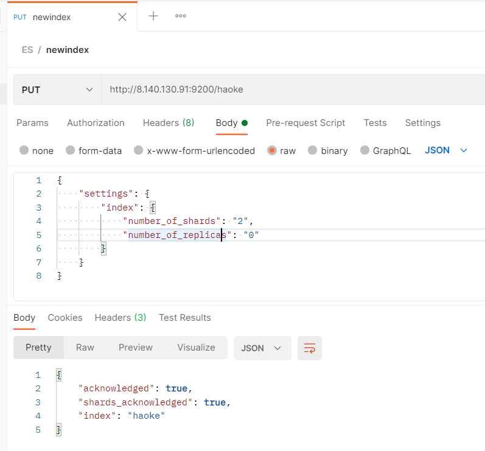
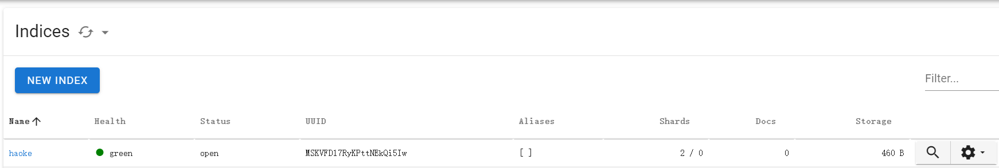
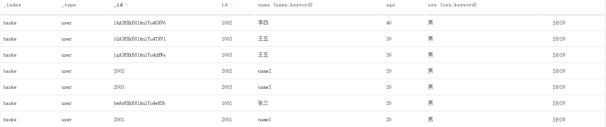

# Elastic Stack

## 简介

ELK(旧称呼),由ElasticSearch、Logstash、Kibana组成，及新加入的Beats


**ElasticSearch**

基于Java，是开源分布式搜索引擎，特点有：分布式、零配置、自动发现，索引自动分片、索引副本机制、restful风格接口，多数据源、自动搜索负载

**Logstash**

基于Java，尅元的用于手机，分析和存储日志的工具

由于与Beats功能部分重叠，现用于数据处理

**Kibana**

基于nodejs，开源免费工具，Kibana可以为Logstash和ElasticSearch提供的日志分析友好的web界面，可以汇总、分析和搜索重要数据日志

**Beats**

采集系统监控数据的代理agent，是在被监控服务器上以客户端形式运行的数据收集器的统称。可以直接把数据发送给ElasticSearch或者通过LogStash发送给ElasticSearch，然后进行后续的数据分析活动

Beats组成

-   PacketBeat：网络数据分析器，用于监控、收集网络流量信息、Packetbeat嗅探服务器之间的流
    量，解析应用层协议，并关联到消息的处理，其支 持ICMP (v4 and v6)、DNS、HTTP、Mysql、PostgreSQL、Redis、MongoDB、Memcache等协议；
-   Filebeat：用于监控、收集服务器日志文件，其已取代 logstash forwarder  
-   Metricbeat：可定期获取外部系统的监控指标信息，其可以监控、收集 Apache、HAProxy、MongoDB 、MySQL、Nginx、PostgreSQL、Redis、System、Zookeeper等服务；  
-   Winlogbeat：用于监控、收集Windows系统的日志信息；  

## Elastic Search

### 简介

ElasticSearch是一个预计于Lucene的搜索服务器。提供了一个分布式多用户能力的全文搜索引擎，基于RESTful web接口

ElasticSearch是用JAVA开发的。达到实时搜索，稳定可靠，快速，安装方便

**搜索方案的目标**

-   运行速度快，实时搜索
-   零配置和完全免费的搜索模式
-   能够简单地使用JSON通过HTTP来索引数据
-   搜索服务器可靠性
-   搜索服务器易于扩展
-   简单的多租户
-   建立云解决方案

[Elasticsearch：官方分布式搜索和分析引擎 | Elastic](https://www.elastic.co/cn/elasticsearch/)

### 安装

#### 单机安装

##### 版本说明

ElasticSearch的发展非常快速，在ES5.0之前，ELK各个版本不同意出现了版本号的混乱状态，所以从5.0开始，所有的Elastic Stack中的项目全部同一版本号。

##### 下载

[Download Elasticsearch Free | Get Started Now | Elastic | Elastic](https://www.elastic.co/cn/downloads/elasticsearch)

##### 安装

```shell
#解压安装包
cd /opt
tar -xvf elasticsearch-7.12.0-linux-x86_64.tar.gz  -C /opt
cd elasticsearch-7.12.0/config

# 修改配置文件
vim elasticsearch.yml

#通过指定相同网段的其他节点会加入该集群中 0.0.0.0任意IP都可以访问elasticsearch
network.host: 0.0.0.0
http.port: 9200
discovery.zen.ping.unicast.hosts: ["192.168.182.130"]
bootstrap.memory_lock: false
bootstrap.system_call_filter: false

#说明：在Elasticsearch中如果，network.host不是localhost或者127.0.0.1的话，就会认为是生产环境，会对环境的要求比较高，我们的测试环境不一定能够满足，一般情况下需要修改2处配置，如下：
#1：修改jvm启动参数
vim jvm.options
-Xms64m
-Xmx64m
#2：单个进程中的最大线程数
vm.max_map_count=655360

# 创建elsearch用户，ElasticSearch不支持root用户运行
useradd elsearch

#切换程序所有者
chown elsearch:elsearch elasticsearch-7.12.0 -R

#启动ES服务
su - elsearch
cd /opt/elasticsearch-7.12.0/bin
./elasticsearch 或 ./elasticsearch -d #后台系统

# 通过访问看到一下信息，则ES启动成功
##http://8.140.130.91:9200/
{
  "name" : "iZ2zeg4pktzjhp9h7wt6doZ",
  "cluster_name" : "elasticsearch",
  "cluster_uuid" : "_na_",
  "version" : {
    "number" : "7.12.0",
    "build_flavor" : "default",
    "build_type" : "tar",
    "build_hash" : "78722783c38caa25a70982b5b042074cde5d3b3a",
    "build_date" : "2021-03-18T06:17:15.410153305Z",
    "build_snapshot" : false,
    "lucene_version" : "8.8.0",
    "minimum_wire_compatibility_version" : "6.8.0",
    "minimum_index_compatibility_version" : "6.0.0-beta1"
  },
  "tagline" : "You Know, for Search"
}
```

#### 通过docker安装

```shell
# 拉取镜像 elasticsearch必须带标签
docker pull elasticsearch:6.5.4

# 创建容器
docker create --name elasticsearch --net host -e "discovery.type=single-node" -e "network.host=0.0.0.0" elasticsearch:6.5.4

{
  "name" : "_JPw0-e",
  "cluster_name" : "docker-cluster",
  "cluster_uuid" : "Ax65AN3LQrybZIFeM_IiIg",
  "version" : {
    "number" : "6.5.4",
    "build_flavor" : "default",
    "build_type" : "tar",
    "build_hash" : "d2ef93d",
    "build_date" : "2018-12-17T21:17:40.758843Z",
    "build_snapshot" : false,
    "lucene_version" : "7.5.0",
    "minimum_wire_compatibility_version" : "5.6.0",
    "minimum_index_compatibility_version" : "5.0.0"
  },
  "tagline" : "You Know, for Search"
}
```

#### ES可视化工具

Edge：Elasticvue


### 基本概念

>   映射

-   关系数据库中的表结构(schema)
-   所有文档写进索引之前都会先进性分析，然后将输入的文本分割为词条，哪些词条会被过滤，这种信息为叫映射。由 **用户自定义规则**

>   索引

-   Elasticsearch对逻辑数据的逻辑存储，所以它可以分为更小的部分
-   看做关系型数据库的表，索引的结构是为快速有效的全文索引准备的，特别是它 **不存储原始值** ，原始数据应该存储在数据库中
-   ElasticSearch的索引可看做MongoDB的一个集合， 存储的数据结构为 **json**
-   ElasticSearch 可以把索引存放在一台机器或者 **分布** 在多台服务器，每个索引有一个或 **多个分片** （shard），每个分片可以有  **多个副本**（replica）

>   文档

-   存储在ElasticSearch中的主要实体叫文档（document）,相当于关系数据库中的一行记录

-   ElasticSearch和MongoDB中的文档相似，都可以有不同的结构，但ElasticSearch的文档中，**相同字段必须有相同类型**

-   文档由多个字段组成，每个字段可能多次出现在一个文档中，称为多值字段（multivalued）

-   每个字段的类型，可以是文本，数值，日期等，字段类型也可以是复杂类型，一个字段包含其他子文档或者数组

-   只要 `_id` 不同,ES将会判断为不同文档，即使两个文档内容相同

    

>   文档类型

-   在ElasticSearch中，一个索引对象可以存储多种不同用途的对象，eg:一个博客应用程序可以保存文章和评论
-   每个文档可以有不同结构
-   **同一索引中同一属性名必须有相同数据类型**

### RESTfulAPI

#### 创建非结构化索引

在Lucene中，创建索引是需要定义字段名称以及字段的类型的 (ES底层为Lucene)

在Elasticsearch中提供了非结构化的索引，就是不需要创建索引结构，即可写入数据到索引中——在Elasticsearch底层会进行结构化操作，此操作对用户是透
明的

##### 可视化工具创建


```json
The index 'test' was successfully created.
{
    "acknowledged":true,
    "shards_acknowledged":true,
    "index":"test"
}
```


##### ==API创建==

```json
/*请求*/
PUT http://8.140.130.91:9200/haoke

/*请求体*/
{
    "settings": {
        "index": {
            "number_of_shards": "2",
            "number_of_replicas": "0"
        }
    }
}
```





#### 删除索引


#### 插入数据

>   POST http://8.140.130.91/{索引}/{类型}/{id}

**关于id的生成**

-   指定id ，用PUT请求也可插入数据
-   ES生成id，必须使用POST请求插入数据

```json
请求：
POST http://8.140.130.91:9200/haoke/user/1001

/* 请求体 */
{
    "id":1001,
    "name":"张三",
    "age":20,
    "sex":"男"
}
```


---

```json
请求：
POST http://8.140.130.91:9200/haoke/user

/* 请求体 */
{
    "id":1001,
    "name":"张三",
    "age":20,
    "sex":"男"
}

# 返回
{
    "_index": "haoke",
    "_type": "user",
    "_id": "hgAlRXkB81AnlYu4wXU-",
    "_version": 1,
    "result": "created",
    "_shards": {
        "total": 1,
        "successful": 1,
        "failed": 0
    },
    "_seq_no": 1,
    "_primary_term": 1
}
```


#### 更新数据

在Elasticsearch中，文档数据是不为修改的，但是可以通过覆盖的方式进行更新

---

**全部更新**

```json
#请求
PUT http://8.140.130.91:9200/haoke/user/1001

#请求体
{
    "id":1001,
    "name":"张三",
    "age":21,
    "sex":"女"
}

#返回
{
    "_index": "haoke",
    "_type": "user",
    "_id": "1001",
    "_version": 2,# 版本号已加一
    "result": "updated",
    "_shards": {
        "total": 1,
        "successful": 1,
        "failed": 0
    },
    "_seq_no": 2,
    "_primary_term": 1
}
```

可见分片中数据已更新


---

**局部更新**

2.  修改它
3.  删除旧文档
4.  索引新文档  

```json
# 请求
# 注意：这里多了_update标识
POST http://8.140.130.91:9200/haoke/user/1001/_update

# 请求体
{
    "doc":{
        "age":23
    }
}

# 返回
{
    "_index": "haoke",
    "_type": "user",
    "_id": "1001",
    "_version": 3,# 版本号已变成3
    "result": "updated",
    "_shards": {
        "total": 1,
        "successful": 1,
        "failed": 0
    },
    "_seq_no": 3,
    "_primary_term": 1
}
```


#### 删除数据

在Elasticsearch中，删除文档数据，只需要发起DELETE请求即可  

```json
# 请求
DELETE http://8.140.130.91:9200/haoke/user/1001

#返回
{
    "_index": "haoke",
    "_type": "user",
    "_id": "1001",
    "_version": 4,# 版本已变成4
    "result": "deleted",
    "_shards": {
        "total": 1,
        "successful": 1,
        "failed": 0
    },
    "_seq_no": 4,
    "_primary_term": 1
}
```

如果删除一条不存在的数据，会响应404  


>   删除一个文档，数据不会立即从磁盘上移除，只是被标记为已删除。
>
>   ES将在添加更多索引时，才会在后台进行删除内容的清理

#### 搜索数据


---

**条件搜索**

>    根据id搜索

```json
# 请求
GET http://8.140.130.91:9200/haoke/user/hwAyRXkB81AnlYu4wXUb

#返回
{
    "_index": "haoke",
    "_type": "user",
    "_id": "hwAyRXkB81AnlYu4wXUb",
    "_version": 1,
    "found": true,
    "_source": {
        "id": 1001,
        "name": "张三",
        "age": 20,
        "sex": "男"
    }
}
```

---

**搜索全部数据**

```json
# 请求
GET http://8.140.130.91:9200/haoke/user/_search

# 返回
{
    "took": 8,
    "timed_out": false,
    "_shards": {
        "total": 2,
        "successful": 2,
        "skipped": 0,
        "failed": 0
    },
    "hits": {
        "total": 4,
        "max_score": 1.0,
        "hits": [
            {
                "_index": "haoke",
                "_type": "user",
                "_id": "iAA3RXkB81AnlYu4GXV6",
                "_score": 1.0,
                "_source": {
                    "id": 1002,
                    "name": "李四",
                    "age": 40,
                    "sex": "男"
                }
            },
            {
                "_index": "haoke",
                "_type": "user",
                "_id": "iQA3RXkB81AnlYu4TXV1",
                "_score": 1.0,
                "_source": {
                    "id": 1003,
                    "name": "王五",
                    "age": 30,
                    "sex": "男"
                }
            },
            {
                "_index": "haoke",
                "_type": "user",
                "_id": "igA3RXkB81AnlYu4dXWa",
                "_score": 1.0,
                "_source": {
                    "id": 1003,
                    "name": "王五",
                    "age": 30,
                    "sex": "男"
                }
            },
            {
                "_index": "haoke",
                "_type": "user",
                "_id": "hwAyRXkB81AnlYu4wXUb",
                "_score": 1.0,
                "_source": {
                    "id": 1001,
                    "name": "张三",
                    "age": 20,
                    "sex": "男"
                }
            }
        ]
    }
}
```

>   默认返回10条数据

---

**关键字查询**

```json
# 请求
GET http://8.140.130.91:9200/haoke/user/_search?q=age:20

#返回
{
    "took": 16,
    "timed_out": false,
    "_shards": {
        "total": 2,
        "successful": 2,
        "skipped": 0,
        "failed": 0
    },
    "hits": {
        "total": 1,
        "max_score": 1.0,
        "hits": [
            {
                "_index": "haoke",
                "_type": "user",
                "_id": "hwAyRXkB81AnlYu4wXUb",
                "_score": 1.0,
                "_source": {
                    "id": 1001,
                    "name": "张三",
                    "age": 20,
                    "sex": "男"
                }
            }
        ]
    }
}
```

#### DSL搜索

Elasticsearch提供丰富且灵活的查询语言叫做**DSL查询(Query DSL)**  

用于复杂查询，组合查询

DSL(Domain Specific Language特定领域语言)以 **JSON请求体** 的形式出现,所以请求方式为POST

---

match ==

```json
# 请求
POST http://8.140.130.91:9200/haoke/user/_search

# 请求体
{
    "query" : {
        "match" : { # 相当于==
            "age" : 20
        }
    }
}

# 返回
{
    "took": 2,
    "timed_out": false,
    "_shards": {
        "total": 2,
        "successful": 2,
        "skipped": 0,
        "failed": 0
    },
    "hits": {
        "total": 1,
        "max_score": 1.0,
        "hits": [
            {
                "_index": "haoke",
                "_type": "user",
                "_id": "hwAyRXkB81AnlYu4wXUb",
                "_score": 1.0,
                "_source": {
                    "id": 1001,
                    "name": "张三",
                    "age": 20,
                    "sex": "男"
                }
            }
        ]
    }
}
```

---

查询年龄大于30岁的男性用户  

must ==

filter if

```json
# 请求
POST http://8.140.130.91:9200/haoke/user/_search

# 请求体
{
	"query": {
		"bool": {
			"filter": {
                "range": {
                    "age": {
                        "gt": 30
                    }
                }
            },
            "must": {
                "match": {
                    "sex": "男"
                }
			}
		}
	}
}

# 返回
{
    "took": 29,
    "timed_out": false,
    "_shards": {
        "total": 2,
        "successful": 2,
        "skipped": 0,
        "failed": 0
    },
    "hits": {
        "total": 1,
        "max_score": 0.13353139,
        "hits": [
            {
                "_index": "haoke",
                "_type": "user",
                "_id": "iAA3RXkB81AnlYu4GXV6",
                "_score": 0.13353139,
                "_source": {
                    "id": 1002,
                    "name": "李四",
                    "age": 40,
                    "sex": "男"
                }
            }
        ]
    }
}
```

---

全文搜索

```json
# 请求
POST http://8.140.130.91:9200/haoke/user/_search

# 请求体
{
    "query": {
        "match": {
        	"name": "张三 李四"
        }
    }
}

#请求
{
    "took": 6,
    "timed_out": false,
    "_shards": {
        "total": 2,
        "successful": 2,
        "skipped": 0,
        "failed": 0
    },
    "hits": {
        "total": 2,
        "max_score": 1.9616584,
        "hits": [
            {
                "_index": "haoke",
                "_type": "user",
                "_id": "iAA3RXkB81AnlYu4GXV6",
                "_score": 1.9616584,
                "_source": {
                    "id": 1002,
                    "name": "李四",
                    "age": 40,
                    "sex": "男"
                }
            },
            {
                "_index": "haoke",
                "_type": "user",
                "_id": "hwAyRXkB81AnlYu4wXUb",
                "_score": 0.5753642,
                "_source": {
                    "id": 1001,
                    "name": "张三",
                    "age": 20,
                    "sex": "男"
                }
            }
        ]
    }
}
```

#### 高亮显示

```json
# 请求
POST http://8.140.130.91:9200/haoke/user/_search

# 请求体
{
    "query": {
        "match": {
            "name": "张三 李四"
        }
    },
    "highlight": {
        "fields": {
            "name": {}
        }
    }
}

# 返回
{
    "took": 54,
    "timed_out": false,
    "_shards": {
        "total": 2,
        "successful": 2,
        "skipped": 0,
        "failed": 0
    },
    "hits": {
        "total": 2,
        "max_score": 1.9616584,
        "hits": [
            {
                "_index": "haoke",
                "_type": "user",
                "_id": "iAA3RXkB81AnlYu4GXV6",
                "_score": 1.9616584,
                "_source": {
                    "id": 1002,
                    "name": "李四",
                    "age": 40,
                    "sex": "男"
                },
                "highlight": {
                    "name": [
                        "<em>李</em><em>四</em>"
                    ]
                }
            },
            {
                "_index": "haoke",
                "_type": "user",
                "_id": "hwAyRXkB81AnlYu4wXUb",
                "_score": 0.5753642,
                "_source": {
                    "id": 1001,
                    "name": "张三",
                    "age": 20,
                    "sex": "男"
                },
                "highlight": {
                    "name": [
                        "<em>张</em><em>三</em>"
                    ]
                }
            }
        ]
    }
}
```

#### 聚合

类似SQL中的group by操作  

```json
#请求
POST http://8.140.130.91:9200/haoke/user/_search

# 请求体
{
    "aggs": {
        "all_interests": {
            "terms": {
                "field": "age"
            }
        }
    }
}

# 返回
{
    "took": 29,
    "timed_out": false,
    "_shards": {
        "total": 2,
        "successful": 2,
        "skipped": 0,
        "failed": 0
    },
    "hits": {
        "total": 4,
        "max_score": 1.0,
        "hits": [
            {
                "_index": "haoke",
                "_type": "user",
                "_id": "iAA3RXkB81AnlYu4GXV6",
                "_score": 1.0,
                "_source": {
                    "id": 1002,
                    "name": "李四",
                    "age": 40,
                    "sex": "男"
                }
            },
            {
                "_index": "haoke",
                "_type": "user",
                "_id": "iQA3RXkB81AnlYu4TXV1",
                "_score": 1.0,
                "_source": {
                    "id": 1003,
                    "name": "王五",
                    "age": 30,
                    "sex": "男"
                }
            },
            {
                "_index": "haoke",
                "_type": "user",
                "_id": "igA3RXkB81AnlYu4dXWa",
                "_score": 1.0,
                "_source": {
                    "id": 1003,
                    "name": "王五",
                    "age": 30,
                    "sex": "男"
                }
            },
            {
                "_index": "haoke",
                "_type": "user",
                "_id": "hwAyRXkB81AnlYu4wXUb",
                "_score": 1.0,
                "_source": {
                    "id": 1001,
                    "name": "张三",
                    "age": 20,
                    "sex": "男"
                }
            }
        ]
    },
    "aggregations": {
        "all_interests": {
            "doc_count_error_upper_bound": 0,
            "sum_other_doc_count": 0,
            "buckets": [
                {
                    "key": 30,
                    "doc_count": 2
                },
                {
                    "key": 20,
                    "doc_count": 1
                },
                {
                    "key": 40,
                    "doc_count": 1
                }
            ]
        }
    }
}
```

### ES核心

#### 文档

文档以JSON格式进行存储，可以是复杂的结构

##### 元数据(metadata)

一个文档不只是数据。它还包括了元数据(metadata)——关于文档的信息。三个必须的元数据结点是

| 节点   | 说明               |
| ------ | ------------------ |
| _index | 文档存储的地方     |
| _type  | 文档代表的对象的类 |
| _id    | 文档的唯一标识     |

>    _index

索引(index)类似于关系数据库中的数据库 ——存储和索引关联数据的地方

事实上，数据被存储和索引在 **分片(shards)** 中，索引只是一个把一个或多个分片分组在一起的逻辑空间。只需要记住，文档存储在 **索引(index)** 中，剩下的细节交给ES处理。

>    _type

每个对象都属于一个**类**(class)，这个类定义了属性或与对象关联的数据

 在关系数据库中，我们经常将相同类的对象存储在一个表里，因为它们有着相同的结构；同理在ES中，我们使用相同 **类型(type)** 的文档表示相同的 事物，因为他们的结构是相同的

每个 **类型(type)** 都有自己的 **映射(mapping)** 或者结构定义，就像传统数据库表中的列一样。所有 **类型(type)** 下的文档被存储在同一个索引下，但是类型的 **映射(mapping)** 会告诉ES不同的文档如何被索引

`_type` 可以是大写或小写，不能包含下划线或逗号

>   _id

id :字符串 与 `_index` 和 `_type` 组合时，就可以在ES中唯一标识一个文档。当创建一个文档，你可以自定义 `_id` （支持PUT方式），也可以让ES自动生成32位长度（只能POST方式）

#### 查询响应

##### 格式化JSON结果——pretty

在查询url后添加pretty参数

```json
# 请求
http://8.140.130.91:9200/haoke/user/1005?pretty
```

##### 指定查询字段

在响应的数据中，可以指定某些需要的字段进行返回

```json
# 请求
GET http://8.140.130.91:9200/haoke/user/iAA3RXkB81AnlYu4GXV6?_source=id,name

# 返回
{
    "_index": "haoke",
    "_type": "user",
    "_id": "iAA3RXkB81AnlYu4GXV6",
    "_version": 1,
    "found": true,
    "_source": {
        "name": "李四",
        "id": 1002
    }
}
```

---

只返回数据

```json
# 请求
GET http://8.140.130.91:9200/haoke/user/iAA3RXkB81AnlYu4GXV6/_source

# 返回
{
    "id": 1002,
    "name": "李四",
    "age": 40,
    "sex": "男"
}
```

---

只返回数据且指定字段

```json
# 请求
GET http://8.140.130.91:9200/haoke/user/iAA3RXkB81AnlYu4GXV6/_source?_source=id,name

# 返回
{
    "name": "李四",
    "id": 1002
}
```

#### 判断文档是否存在

只是判断文档是否存在，不查询文档内容

```json
HEAD http://8.140.130.91:9200/haoke/user/iAA3RXkB81AnlYu4GXV6
```


---

```json
HEAD http://8.140.130.91:9200/haoke/user/1
```


>   查询结果只是表示查询时刻存在与否，并不代表之后是否存在

#### 批量操作

减少网络请求

##### 批量查询

```json
# 请求
POST http://8.140.130.91:9200/haoke/user/_mget

# 请求体
{
    "ids": [
        "iAA3RXkB81AnlYu4GXV6",
        "iQA3RXkB81AnlYu4TXV1"
    ]
}

# 返回
{
    "docs": [
        {
            "_index": "haoke",
            "_type": "user",
            "_id": "iAA3RXkB81AnlYu4GXV6",
            "_version": 1,
            "found": true,
            "_source": {
                "id": 1002,
                "name": "李四",
                "age": 40,
                "sex": "男"
            }
        },
        {
            "_index": "haoke",
            "_type": "user",
            "_id": "iQA3RXkB81AnlYu4TXV1",
            "_version": 1,
            "found": true,
            "_source": {
                "id": 1003,
                "name": "王五",
                "age": 30,
                "sex": "男"
            }
        }
    ]
}
```

---

如果，某一条数据不存在，不影响整体响应，需要通过 `found` 的值进行判断是否查询到数据

```json
# 请求体
{
    "ids": [
        "iAA3RXkB81AnlYu4GXV6",
        "1"
    ]
}

# 返回
{
    "docs": [
        {
            "_index": "haoke",
            "_type": "user",
            "_id": "iAA3RXkB81AnlYu4GXV6",
            "_version": 1,
            "found": true,
            "_source": {
                "id": 1002,
                "name": "李四",
                "age": 40,
                "sex": "男"
            }
        },
        {
            "_index": "haoke",
            "_type": "user",
            "_id": "2",
            "found": false
        }
    ]
}
```

##### _buld 操作

在ES中，支持批量修改，都是通过 `_bulk` 的api完成

请求格式

```json
{ action: { metadata }}\n
{ request body }\n
{ action: { metadata }}\n
{ request body }\n
# 最后一行是需要回车的
```

---

>   批量插入数据

```json
# 请求
POST http://8.140.130.91:9200/haoke/user/_bulk

# 请求体
{"create":{"_index":"haoke","_type":"user","_id":2001}}
{"id":2001,"name":"name1","age": 20,"sex": "男"}
{"create":{"_index":"haoke","_type":"user","_id":2002}}
{"id":2002,"name":"name2","age": 20,"sex": "男"}
{"create":{"_index":"haoke","_type":"user","_id":2003}}
{"id":2003,"name":"name3","age": 20,"sex": "男"}


# 返回
{
    "took": 12,
    "errors": false,
    "items": [
        {
            "create": {
                "_index": "haoke",
                "_type": "user",
                "_id": "2001",
                "_version": 1,
                "result": "created",
                "_shards": {
                    "total": 1,
                    "successful": 1,
                    "failed": 0
                },
                "_seq_no": 9,
                "_primary_term": 1,
                "status": 201
            }
        },
        {
            "create": {
                "_index": "haoke",
                "_type": "user",
                "_id": "2002",
                "_version": 1,
                "result": "created",
                "_shards": {
                    "total": 1,
                    "successful": 1,
                    "failed": 0
                },
                "_seq_no": 3,
                "_primary_term": 1,
                "status": 201
            }
        },
        {
            "create": {
                "_index": "haoke",
                "_type": "user",
                "_id": "2003",
                "_version": 1,
                "result": "created",
                "_shards": {
                    "total": 1,
                    "successful": 1,
                    "failed": 0
                },
                "_seq_no": 4,
                "_primary_term": 1,
                "status": 201
            }
        }
    ]
}
```



---

>   批量删除

```json
# 请求
POST http://8.140.130.91:9200/haoke/user/_bulk

#请求体
{"delete":{"_index":"haoke","_type":"user","_id":2001}}
{"delete":{"_index":"haoke","_type":"user","_id":2002}}
{"delete":{"_index":"haoke","_type":"user","_id":2003}}


# 返回
{
    "took": 4,
    "errors": false,
    "items": [
        {
            "delete": {
                "_index": "haoke",
                "_type": "user",
                "_id": "2001",
                "_version": 2,
                "result": "deleted",
                "_shards": {
                    "total": 1,
                    "successful": 1,
                    "failed": 0
                },
                "_seq_no": 10,
                "_primary_term": 1,
                "status": 200
            }
        },
        {
            "delete": {
                "_index": "haoke",
                "_type": "user",
                "_id": "2002",
                "_version": 2,
                "result": "deleted",
                "_shards": {
                    "total": 1,
                    "successful": 1,
                    "failed": 0
                },
                "_seq_no": 5,
                "_primary_term": 1,
                "status": 200
            }
        },
        {
            "delete": {
                "_index": "haoke",
                "_type": "user",
                "_id": "2003",
                "_version": 2,
                "result": "deleted",
                "_shards": {
                    "total": 1,
                    "successful": 1,
                    "failed": 0
                },
                "_seq_no": 6,
                "_primary_term": 1,
                "status": 200
            }
        }
    ]
}
```

---

>   批量操作的性能

-   整个批量请求需要被加载到接受我们请求节点的内存里，所以请求越大，给其它请求可用的内存就越小。有一个最佳的bulk请求大小。超过这个大小，性能不再提升而且可能降低。
-   最佳大小，当然并不是一个固定的数字。它完全取决于你的硬件、你文档的大小和复杂度以及索引和搜索的负载。
-   幸运的是，这个最佳点(sweetspot)还是容易找到的：试着批量索引标准的文档，随着大小的增长，当性能开始降低，说明你每个批次的大小太大了。开始的数量可以在1000~5000个文档之间，如果你的文档非常大，可以使用较小的批次。
-   通常着眼于你请求批次的物理大小是非常有用的。一千个1kB的文档和一千个1MB的文档大不相同。一个好的批次最好保持在5-15MB大小间  

#### 分页

和sql使用 `limit` 关键字返回只有一页的结果一样，ES接收 `from` 和 `size` 参数

```
size: 结果数，默认10
from：跳过开始的结果数，默认0
```

**避免分页太深或者一次请求太多结果**

结果在返回前会被排序，一个搜索请求常常涉及多个分片。每个分片生成自己排好序的结果，它们接着需要集中起来排序以确保整体排序正确。

---

eg:每页查询5个结果，页码从1到3

```
GET /_search?size=5
GET /_search?size=5&from=5
GET /_search?size=5&from=10
```


---

在集群系统中分页是有问题的

假设在一个有5个主分片的索引中搜索。当我们请求结果的第一页（结果1到10）时，每个分片产生自己最顶端10个结果然后返回它们给**请求节点(requesting node)**，它
再排序这所有的50个结果以选出顶端的10个结果。
假设请求第1000页（结果10001到10010）。工作方式都相同，不同的是每个分片都必须产生顶端的10010个结果。然后请求节点排序这50050个结果并丢弃50040个  

可以看到在分布式系统中，排序结果的花费随着分页的深入而成倍增长。这也是为什么网络搜索引擎中任何语句不能返回多于1000个结果的原因  

#### 映射

我们创建的索引以及插入数据，都是由Elasticsearch进行自动判断类型，有些时候我们是需要进行明确字段类型的，否则，自动判断的类型和实际需求是不相符的。  

##### 自动判断的规则

| JSON type                        | Field type |
| -------------------------------- | ---------- |
| Boolean: true or false           | "boolean"  |
| Whole number: 123                | "long"     |
| Floating point: 123.45           | "double"   |
| String, valid date: "2014-09-15" | "date"     |
| String: "foo bar"                | "string"   |

##### ES中文支持

| 类型           | 表示的数据类型                |
| -------------- | ----------------------------- |
| String         | string , text , keyword       |
| Whole number   | byte , short , integer , long |
| Floating point | float , double                |
| Boolean        | boolean                       |
| Date           | date                          |

-   string类型在ElasticSearch 旧版本中使用较多，从ElasticSearch 5.x开始不再支持string，由 `text` 和 `keyword` 类型替代  
-   `text` 类型，当一个字段是要被全文搜索的，比如Email内容、产品描述，应该使用text类型。**设置text类型以后，字段内容会被分析**，在生成倒排索引以前，字符串会被分析器分成一个一个**词项**。**text类型的字段不用于排序，很少用于聚合**
-   `keyword` 类型，适用于索引结构化的字段，比如email地址、主机名、状态码和标签。如果字段需要进行过滤(比如查找已发布博客中status属性为published的文章)、排序、聚合。**keyword类型的字段只能通过精确值搜索到**。  

---

##### 创建明确的索引

```json
# 请求
PUT http://8.140.130.91:9200/test

# 请求体
{
    "settings": {
        "index": {
            "number_of_shards": "2",
            "number_of_replicas": "0"
        }
    },
    "mappings": {
        "person": {
            "properties": {
                "name": {
                    "type": "text"
                },
                "age": {
                    "type": "integer"
                },
                "mail": {
                    "type": "keyword"
                },
                "hobby": {
                    "type": "text"
                }
            }
        }
    }
}

# 返回
{
    "acknowledged": true,
    "shards_acknowledged": true,
    "index": "test"
}
```

---

##### 查看索引

```
GET http://8.140.130.91:9200/test/_mapping
```


---

##### 插入数据

```json
# 请求
POST http://8.140.130.91:9200/test/_bulk

# 请求体
{"index":{"_index":"test","_type":"person"}}
{"name":"张三","age": 20,"mail": "111@qq.com","hobby":"羽毛球、乒乓球、足球"}
{"index":{"_index":"test","_type":"person"}}
{"name":"李四","age": 21,"mail": "222@qq.com","hobby":"羽毛球、乒乓球、足球、篮球"}
{"index":{"_index":"test","_type":"person"}}
{"name":"王五","age": 22,"mail": "333@qq.com","hobby":"羽毛球、篮球、游泳、听音乐"}
{"index":{"_index":"test","_type":"person"}}
{"name":"赵六","age": 23,"mail": "444@qq.com","hobby":"跑步、游泳"}
{"index":{"_index":"test","_type":"person"}}
{"name":"孙七","age": 24,"mail": "555@qq.com","hobby":"听音乐、看电影"}

```


#### 结构化查询

##### 给定值查询

###### term查询

`term` 主要用于**精确匹配值**，比如数字，日期，布尔值或 `not_analyzed` 的字符串（未经分析的文本数据类型）

```json
{ "term": { "age": 26 }}
{ "term": { "date": "2014-09-01" }}
{ "term": { "public": true }}
{ "term": { "tag": "full_text" }}

```

---

```json
# 请求
POST http://8.140.130.91:9200/test/person/_search

# 请求体
{
    "query": {
        "term": {
            "age": 20
        }
    }
}

# 返回
{
    "took": 2,
    "timed_out": false,
    "_shards": {
        "total": 2,
        "successful": 2,
        "skipped": 0,
        "failed": 0
    },
    "hits": {
        "total": 1,
        "max_score": 1.0,
        "hits": [
            {
                "_index": "test",
                "_type": "person",
                "_id": "lgAZR3kB81AnlYu4xnXV",
                "_score": 1.0,
                "_source": {
                    "name": "张三",
                    "age": 20,
                    "mail": "111@qq.com",
                    "hobby": "羽毛球、乒乓球、足球"
                }
            }
        ]
    }
}
```

###### 同一字段多值查询

`terms` 跟 `term` 类似，但 `term` 允许指定多个匹配条件。如果某个字段指定了多个值，那么文档需要一起去做匹配

```json
# 请求
POST http://8.140.130.91:9200/test/person/_search

# 请求体
{
    "query": {
        "terms": {
            "age": [20,21]
        }
    }
}

# 返回
{
    "took": 3,
    "timed_out": false,
    "_shards": {
        "total": 2,
        "successful": 2,
        "skipped": 0,
        "failed": 0
    },
    "hits": {
        "total": 2,
        "max_score": 1.0,
        "hits": [
            {
                "_index": "test",
                "_type": "person",
                "_id": "lgAZR3kB81AnlYu4xnXV",
                "_score": 1.0,
                "_source": {
                    "name": "张三",
                    "age": 20,
                    "mail": "111@qq.com",
                    "hobby": "羽毛球、乒乓球、足球"
                }
            },
            {
                "_index": "test",
                "_type": "person",
                "_id": "lwAZR3kB81AnlYu4xnXV",
                "_score": 1.0,
                "_source": {
                    "name": "李四",
                    "age": 21,
                    "mail": "222@qq.com",
                    "hobby": "羽毛球、乒乓球、足球、篮球"
                }
            }
        ]
    }
}
```

##### 给定范围查询

`range` 过滤允许我们按照指定范围查找一批数据

```json
{
    "range": {
        "age": {
            "gte": 20,
            "lt": 30
        }
    }
}
```

**操作符**

gt :: 大于
gte :: 大于等于
lt :: 小于
lte :: 小于等于  

---

eg:  20 <= age < 22

```json
# 请求
POST http://8.140.130.91:9200/test/person/_search

# 请求体
{
    "query": {
        "range": {
            "age": {
                "gte": 20,
                "lt": 22
            }
        }
    }
}

# 返回
{
    "took": 6,
    "timed_out": false,
    "_shards": {
        "total": 2,
        "successful": 2,
        "skipped": 0,
        "failed": 0
    },
    "hits": {
        "total": 2,
        "max_score": 1.0,
        "hits": [
            {
                "_index": "test",
                "_type": "person",
                "_id": "lgAZR3kB81AnlYu4xnXV",
                "_score": 1.0,
                "_source": {
                    "name": "张三",
                    "age": 20,#
                    "mail": "111@qq.com",
                    "hobby": "羽毛球、乒乓球、足球"
                }
            },
            {
                "_index": "test",
                "_type": "person",
                "_id": "lwAZR3kB81AnlYu4xnXV",
                "_score": 1.0,
                "_source": {
                    "name": "李四",
                    "age": 21,#
                    "mail": "222@qq.com",
                    "hobby": "羽毛球、乒乓球、足球、篮球"
                }
            }
        ]
    }
}
```

##### exists查询

`exists` 查询可用于查找文档中是否包含指定字段或没有某个字段，类似与SQL语句中的 `IS_NULL`

```json
# 请求
POST http://8.140.130.91:9200/test/person/_search

{
    "query": {
        "exists": { #必须包含card属性
        	"field": "card"
        }
    }
}
```


##### match查询

>    `match` 查询是一个标准查询，不管你需要 **全文本查询** 还是 **精确查询** 基本上都要用到它  

-   如果你使用 `match` 查询一个全文本字段(text类型)，它会在真正查询之前用分析器先分析 match 一下查询字符  

-   如果用 match 下指定了一个确切值，在遇到数字，日期，布尔值或者 not_analyzed 的字符串时，它将为你搜索你给定的值  

```json
{ "match": { "age": 26 }}
{ "match": { "date": "2014-09-01" }}
{ "match": { "public": true }}
{ "match": { "tag": "full_text" }}
```

##### bool查询——查询组合

`bool` 查询可以用来合并多个条件查询结果的布尔逻辑，它包含一下操作符：  

-   `must` :: 多个查询条件的完全匹配,相当于 and 。
-   `must_not` :: 多个查询条件的相反匹配，相当于 not 。
-   `should` :: 至少有一个查询条件匹配, 相当于 or 。  

```json
{
    "bool": {
        "must": { "term": { "folder": "inbox" }},
        "must_not": { "term": { "tag": "spam" }},
        "should": [
            { "term": { "starred": true }},
            { "term": { "unread": true }}
        ]
    }
}
```

#### 过滤查询

ES支持过滤查询，如term、range、match等

```json
# 请求
POST http://8.140.130.91:9200/test/person/_search

# 请求体
{
    "query": {
        "bool": {
            "filter":{
                "term":{
                    "age":20
                }
            }
        }
    }
}

# 返回
{
    "took": 4,
    "timed_out": false,
    "_shards": {
        "total": 2,
        "successful": 2,
        "skipped": 0,
        "failed": 0
    },
    "hits": {
        "total": 1,
        "max_score": 0.0,
        "hits": [
            {
                "_index": "test",
                "_type": "person",
                "_id": "lgAZR3kB81AnlYu4xnXV",
                "_score": 0.0,
                "_source": {
                    "name": "张三",
                    "age": 20,
                    "mail": "111@qq.com",
                    "hobby": "羽毛球、乒乓球、足球"
                }
            }
        ]
    }
}
```

---

>    查询和过滤的比较：

-   一条过滤语句会询问每个文档的字段值是否包含着特定值
-   查询语句会询问每个文档的字段值与特定值的匹配程度如何  
    -   一条查询语句会计算每个文档与查询语句的相关性，会给出一个相关性评分  `_score` ，并且 按照相关性对匹配到的文档进行排序。 这种评分方式非常适用于一个没有完全配置结果的全文本搜索  
-   一个简单的文档列表，快速匹配运算并存入内存是十分方便的， 每个文档仅需要1个字节。这些**缓存的过滤结果集与后续请求的结合使用是非常高效的**  
-   查询语句不仅要查找相匹配的文档，还需要计算每个文档的相关性，所以一般来说查询语句要比 过滤语句更耗时，并且查询结果也不可缓存  

**做精确匹配搜索时，最好用过滤语句，因为过滤语句可以缓存数据**

### 中文分词


