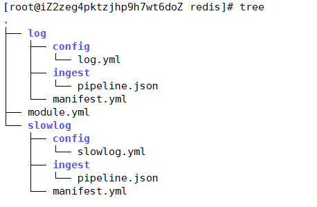

# ElasticStack

-   Beats
    -   FileBeat
    -   Metricbeat
-   Kibana
-   Logstash

---


##  Beats——日志采集


[Beats：Elasticsearch 的数据采集器 | Elastic](https://www.elastic.co/cn/beats/)

### FileBeat


#### 架构


>   FileBeat 由主要组件组成：prospector 和 harvester

-   harvester

    负责读取单个文件内容

    如果文件在读取时被删除或重命名，FileBeat将会继续读取文件

-   Prospector

    prospector 负责管理 `harvester`，并查找所有要读取的文件来源

    如果输入类型为日志，则查找器将查找路径匹配的所有文件，并为每个文件启动一个 harvester

    FileBeat支持两种 `prospector` ：log 和 stdin

>   Filebeat如何记录文件的状态

-   Filebeat 保存每个文件的状态并经常将状态刷新到磁盘上的注册文件中
-   该状态用于记住harvester 正在读取的最后偏移量，并确保发送所有日志行
-   如果输出（Elasticsearch或Logstash）无法访问，Filebeat会跟踪最后发送的行，并在输出再次可用时继续读取文件
-   在Filebeat运行时，每个 `prspector` 内存中也会保存文件状态信息，当重新启动FileBeat时，将使用 `注册文件/data/registry` 的数据来重建文件状态
-   文件状态记录在 `/data/registry`

#### 部署与运行

```shell
mkdir -p /haoke/beats
tar -xvf filebeat-6.5.4-linux-x86_64.tar.gz
cd filebeat-6.5.4-linux-x86_64
```

##### 启动命令

```shell
./filebeat -e -c haoke.yml
./filebeat -e -c haoke.yml -d "publish"

#参数
-e: 输出到标准输出，默认输出到syslog和logs下
-c: 指定配置文件
-d: 输出debug信息 
```

##### 标准输入

```shell
# 创建配置文件 haoke.yml
filebeat.inputs:
- type: stdin
  enabled: true
output.console:
 pretty: true
 enable: true
# es分片数
setup.template.settings:
 index.number_of_shards: 3

# 启动 filebeat
./filebeat -e -c haoke.yml
```


-   @metadata ：元数据信息
-   message：输入的信息
-   prospector：标准输入勘探器
-   input：控制台标准输入
-   beat：beat版本以及主机信息

##### 读取文件

```shell
cd filebeat-6.5.4-linux-x86_64

# haoke-log.yml 配置读取文件项
filebeat.inputs:
- type: log
  enabled: true
  path: /haoke/beats/logs/*.log
output.console:
 pretty: true
 enable: true
# es分片数
setup.template.settings:
 index.number_of_shards: 3
 
# 启动filebeat
./filebeat -e -c haoke-log.yml

# /haoke/beats/logs下创建a.log，并输入
hello
world

# 观察filebeat输出
```


可见，已经检测到日志文件有更新，立刻就会读取到更新的内容，并且输出到控制台

##### 自定义字段

```shell
#配置读取文件项 haoke-log.yml
filebeat.inputs:
- type: log
  enabled: true
  path: /haoke/beats/logs/*.log
  tags: ["test"] #添加自定义tag ，便于后续的处理
  fields: 
  	from: haoke-im
  fields_under_root: false #true为添加到根结点，false为添加到根结点下的fields属性下
output.console:
 pretty: true
 enable: true
# es分片数
setup.template.settings:
 index.number_of_shards: 3

# 启动filebeat
./filebeat -e -c haoke-log.yml

# /haoke/beats/logs/下创建b.log 写入以下内容
123
```

>   fields_under_root: false


>   fields_under_root: true


##### 输出到Elasticsearch

```shell
#配置读取文件项 haoke-log.yml
filebeat.inputs:
- type: log
  enabled: true
  path: /haoke/beats/logs/*.log
  tags: ["test"] #添加自定义tag ，便于后续的处理
  fields: 
  	from: test
  fields_under_root: false #true为添加到根结点，false为添加到根结点下的fields属性下
output.elasticsearch: #指定ES配置
 hosts: ["8.140.130.91:9200","8.140.130.91:9201","8.140.130.91:9202"]
# es分片数
setup.template.settings:
 index.number_of_shards: 3# 指定索引的分区数
```


#### Module

前面想要实现日志数据的读取以及处理都是自己手动配置，其实，在 `Filebeat` 中，有大量的Module，可以简化配置


```shell
./filebeat modules list

Enabled:

Disabled:
apache2
auditd
elasticsearch
haproxy
icinga
iis
kafka
kibana
logstash
mongodb
mysql
nginx
osquery
postgresql
redis
suricata
system
traefik
```

启动某一 `module` 

```shell
./filebeat modules enable redis #启动
./filebeat modules disable redis #禁用
```


>   可见，启动某一 `module` 就是将 `filebeat-6.5.4-linux-x86_64/modules.d/` 下的对应yml去掉disabled

##### redis module



-   log：日志
-   slowlog：慢查询日志

##### redis module 配置

```shell
- module: redis
  # Main logs
  log:
    enabled: true

    # Set custom paths for the log files. If left empty,
    # Filebeat will choose the paths depending on your OS.
    #var.paths: ["/var/log/redis/redis-server.log*"]

  # Slow logs, retrieved via the Redis API (SLOWLOG)
  slowlog:
    enabled: true

    # The Redis hosts to connect to.
    #var.hosts: ["localhost:6379"]

    # Optional, the password to use when connecting to Redis.
    #var.password:
```

##### 修改redis的docker容器

redis 默认情况下，是不会输出日志的，需要自行配置

```shell
docker create --name redis-node01 --net host -v /data/redis-data/node01:/data redis --cluster-enabled yes --cluster-announce-ip 8.140.130.91 --cluster-announce-bus-port 16379  --cluster-config-file nodes-node-01.conf --port 6379 --loglevel debug --logfile nodes-node-01.log

docker create --name redis-node02 --net host -v /data/redis-data/node02:/data redis --cluster-enabled yes --cluster-announce-ip 8.140.130.91 --cluster-announce-bus-port 16380 --cluster-config-file nodes-node-02.conf --port 6380 --loglevel debug --logfile nodes-node-02.log

docker create --name redis-node03 --net host -v /data/redis-data/node03:/data redis --cluster-enabled yes --cluster-announce-ip 8.140.130.91 --cluster-announce-bus-port 16381 --cluster-config-file nodes-node-03.conf --port 6381 --loglevel debug --logfile nodes-node-03.log
```

>   loglevel 日志等级分为：debug、verbose、notice、warning
>
>   -   debug 会有大量信息，对开发、测试有用；
>   -   verbose 等于log4j 中的info，有很多信息，但是不会像debug那样乱；
>   -   notice 一般信息；
>   -   warning 只有非常重要/关键的消息被记录  

##### 配置filebeat

```shell
cd /haoke/beats/filebeat-6.5.4-linux-x86_64/modules.d/

- module: redis
  # Main logs
  log:
    enabled: true

    # Set custom paths for the log files. If left empty,
    # Filebeat will choose the paths depending on your OS.
    var.paths: ["/data/redis-data/node01/*.log","/data/redis-data/node02/*.log","/data/redis-data/node03/*.log"]

  # Slow logs, retrieved via the Redis API (SLOWLOG)
  slowlog:
    enabled: false

    # The Redis hosts to connect to.
    #var.hosts: ["localhost:6379"]

    # Optional, the password to use when connecting to Redis.
    #var.password:
```

```shell
vim haoke-redis.yml

filebeat.inputs:
- type: log
  enabled: true
  paths: 
  - /data/redis-data/*.log
filebeat.config.modules: #获取到所有生效module的配置
 path: ${path.config}/modules.d/*yml
 reload.enabled: false
output.elasticsearch: #指定ES配置
 hosts: ["8.140.130.91:9200","8.140.130.91:9201","8.140.130.91:9202"]
# es分片数
setup.template.settings:
 index.number_of_shards: 3# 指定索引的分区数
```

##### 启动测试

```shell
./filebeat -e -c haoke-redis.yml --modules redis
```


##### 其他Module用法

[Modules | Filebeat Reference [7.12\] | Elastic](https://www.elastic.co/guide/en/beats/filebeat/current/filebeat-modules.html)

###  Metricbeat


-   定期收集OS或应用服务的指标数据
-   存储到Elasticsearch中，进行实时分析

#### Metricbeat组成

-   Module

    收集的对象，如：mysql、redis、操作系统等

-   Metricset

    收集指标的集合，如：cpu，memory，network

以RedisModule为例：


#### 部署与收集系统指标

```shell
tar -xvf metricbeat-6.5.4-linux-x86_64.tar.gz
cd /haoke/beats/metricbeat-6.5.4-linux-x86_64
vim metricbeat.yml

---
metricbeat.config.modules:
  path: ${path.config}/modules.d/*.yml
  reload.enabled: false
setup.template.settings:
  index.number_of_shards: 3
  index.codec: best_compression
setup.kibana:
output.elasticsearch:
        hosts: ["8.140.130.91:9200","8.140.130.91:9201","8.140.130.91:9202"]
processors:
  - add_host_metadata: ~
  - add_cloud_metadata: ~
--- 

# 启动
./metricbeat -e -c metricbeat-log.yml
```


---

#### Module

##### System module配置

```shell
cd /haoke/beats/metricbeat-6.5.4-linux-x86_64/modules.d/
cat system.yml
---
- module: system
  period: 10s
  metricsets:
    - cpu
    - load
    - memory
    - network
    - process
    - process_summary
    #- core
    #- diskio
    #- socket
  process.include_top_n:
    by_cpu: 5      # include top 5 processes by CPU
    by_memory: 5   # include top 5 processes by memory

- module: system
  period: 1m
  metricsets:
    - filesystem
    - fsstat
  processors:
  - drop_event.when.regexp:
      system.filesystem.mount_point: '^/(sys|cgroup|proc|dev|etc|host|lib)($|/)'

- module: system
  period: 15m
  metricsets:
    - uptime
```

##### Redis module

```shell
#启用redis module
./metricbeat modules enable redis

#修改redis module配置
vim modules.d/redis.yml

- module: redis
 metricsets:
 - info
 # - keyspace
 period: 10s
 # Redis hosts
 hosts: ["8.140.130.91:6379","8.140.130.91:6380","8.140.130.91:6381"]
    # Network type to be used for redis connection. Default: tcp
    #network: tcp
    # Max number of concurrent connections. Default: 10
    #maxconn: 10
    # Redis AUTH password. Empty by default.
    #password: foobared

#启动
./metricbeat -e -c metricbeat-log.yml
```


```json
{
    "_index": "metricbeat-6.5.4-2021.05.13",
    "_type": "doc",
    "_id": "J1g4ZXkBkeBjvVA0_VG6",
    "_version": 1,
    "_score": null,
    "_source": {
        "@timestamp": "2021-05-13T10:15:03.364Z",
        "metricset": {
            "rtt": 1457,
            "name": "info",
            "module": "redis",
            "host": "8.140.130.91:6380"
        },
        "redis": {
            "info": {
                "replication": { "master": { "second_offset": -1,"sync": { },"offset": 0},"slave": { },"role": "master","connected_slaves": 0,"master_offset": 0,"backlog": { "size": 1048576,"first_byte_offset": 0,"histlen": 0,"active": 0}},
                "clients": {
                    "blocked": 0,
                    "connected": 1,
                    "longest_output_list": 0,
                    "biggest_input_buf": 640,
                    "max_output_buffer": 0,
                    "max_input_buffer": 640
                },
                "memory": {
                    "allocator": "jemalloc-5.1.0",
                    "allocator_stats": {
                        "active": 2015232,
                        "resident": 4378624,
                        "fragmentation": {
                            "ratio": 1.2,
                            "bytes": 333592
                        },
                        "rss": {
                            "bytes": 2363392,
                            "ratio": 2.17
                        },
                        "allocated": 1681640
                    },
                    "used": {
                        "value": 1563848,
                        "rss": 10366976,
                        "peak": 1563848,
                        "lua": 37888,
                        "dataset": 89872
                    },
                    "max": {
                        "value": 0,
                        "policy": "noeviction"
                    },
                    "fragmentation": {
                        "ratio": 6.91,
                        "bytes": 8866880
                    },
                    "active_defrag": {
                        "is_running": false
                    }
                },
                "server": {
                    "tcp_port": 6380,
                    "run_id": "1e6ccdcae239a1835b190a10f9e367e8801542c5",
                    "git_sha1": "00000000",
                    "mode": "cluster",
                    "gcc_version": "8.3.0",
                    "lru_clock": 10288167,
                    "arch_bits": "64",
                    "process_id": 1,
                    "version": "6.2.1",
                    "hz": 10,
                    "uptime": 4175,
                    "config_file": "",
                    "os": "Linux 4.18.0-240.15.1.el8_3.x86_64 x86_64",
                    "build_id": "3699ff74f0200394",
                    "git_dirty": "0",
                    "multiplexing_api": "epoll"
                },
                "stats": {
                    "connections": {
                        "received": 21,
                        "rejected": 0
                    },
                    "migrate_cached_sockets": 0,
                    "sync": {
                        "full": 0,
                        "partial": {
                            "err": 0,
                            "ok": 0
                        }
                    },
                    "keyspace": {
                        "misses": 0,
                        "hits": 0
                    },
                    "slave_expires_tracked_keys": 0,
                    "instantaneous": {
                        "output_kbps": 0,
                        "ops_per_sec": 0,
                        "input_kbps": 0
                    },
                    "active_defrag": {
                        "hits": 0,
                        "misses": 0,
                        "key_hits": 0,
                        "key_misses": 0
                    },
                    "commands_processed": 32,
                    "keys": {
                        "expired": 0,
                        "evicted": 0
                    },
                    "latest_fork_usec": 0,
                    "net": {
                        "output": {
                            "bytes": 65358
                        },
                        "input": {
                            "bytes": 1414
                        }
                    },
                    "pubsub": {
                        "patterns": 0,
                        "channels": 0
                    }
                },
                "slowlog": {
                    "count": 1
                },
                "cluster": {
                    "enabled": true
                },
                "cpu": {
                    "used": {
                        "user_children": 0.002411,
                        "sys": 7.740379,
                        "user": 7.258026,
                        "sys_children": 0.000598
                    }
                },
                "persistence": {
                    "aof": {
                        "write": {
                            "last_status": "ok"
                        },
                        "copy_on_write": {
                            "last_size": 0
                        },
                        "buffer": { },
                        "size": { },
                        "fsync": { },
                        "enabled": false,
                        "rewrite": {
                            "buffer": { },
                            "in_progress": false,
                            "scheduled": false,
                            "last_time": {
                                "sec": -1
                            },
                            "current_time": {
                                "sec": -1
                            }
                        },
                        "bgrewrite": {
                            "last_status": "ok"
                        }
                    },
                    "loading": false,
                    "rdb": {
                        "copy_on_write": {
                            "last_size": 0
                        },
                        "last_save": {
                            "changes_since": 0,
                            "time": 1620896728
                        },
                        "bgsave": {
                            "last_time": {
                                "sec": -1
                            },
                            "current_time": {
                                "sec": -1
                            },
                            "last_status": "ok",
                            "in_progress": false
                        }
                    }
                }
            }
        },
        "beat": {
            "version": "6.5.4",
            "name": "iZ2zeg4pktzjhp9h7wt6doZ",
            "hostname": "iZ2zeg4pktzjhp9h7wt6doZ"
        },
        "host": {
            "architecture": "x86_64",
            "os": {
                "platform": "centos",
                "version": "8",
                "family": "redhat"
            },
            "id": "20200218155604663518171520219378",
            "containerized": false,
            "name": "iZ2zeg4pktzjhp9h7wt6doZ"
        },
        "meta": {
            "cloud": {
                "instance_id": "i-2zeg4pktzjhp9h7wt6do",
                "region": "cn-beijing",
                "availability_zone": "cn-beijing-h",
                "provider": "ecs"
            }
        }
    },
    "sort": [
        1620900903364
    ]
}
```

## Kibana——可视化


[Kibana：数据的探索、可视化和分析 | Elastic](https://www.elastic.co/cn/kibana)

### docker 部署kibana

```shell
docker pull kibana:6.5.4

# 创建配置文件
cd /haoke/kibana-docker
vim kibana.yml
---
server.host: "8.140.130.91"
elasticsearch.url: "http://8.140.130.91:9200"
---

#创建容器
docker create --name kibana --net host -v /haoke/kibana-docker/kibana.yml:/usr/share/kibana/config/kibana.yml kibana:6.5.4

docker start kibana
```

### Metricbeat仪表盘

```shell
# 修改metricbeat.yml配置
metricbeat.config.modules:
  path: ${path.config}/modules.d/*.yml
  reload.enabled: false
setup.template.settings:
  index.number_of_shards: 3
  index.codec: best_compression
setup.kibana:
output.elasticsearch:
        hosts: ["8.140.130.91:9200","8.140.130.91:9201","8.140.130.91:9202"]
processors:
  - add_host_metadata: ~
  - add_cloud_metadata: ~
setup.kibana:
 host: "8.140.130.91:5601"
 ---
 
# 安装仪表盘到kibana
./metricbeat setup --dashboards
```


### Filebeat仪表盘

```yml
#修改 filebeat.yml 配置文件
filebeat.inputs:
- type: log
 enabled: true
 paths:
 - /haoke/logs/*.log
setup.template.settings:
 index.number_of_shards: 3
filebeat.config.modules:
 path: ${path.config}/modules.d/*.yml
 reload.enabled: false

output.elasticsearch:
 hosts: ["8.140.130.91:9200","8.140.130.91:9201","8.140.130.91:9202"]

setup.kibana:
 host: "8.140.130.91:5601"


#安装仪表盘到kibana
./filebeat -c haoke-redis.yml setup
```

>   日志太大  就不做测试

## Logstash


### 部署安装


```shell
# 检查jdk环境，要求1.8+
java -version

#解压安装包
tar -xvf logstash-6.5.4.tar.gz

#第一个logstash示例
bin/logstash -e 'input {stdin{ } } output { stdout{ } }'
```


### 接收Filebeat输入的日志

>   将 `Filebeat` 和 `Logstash` 整合起来，读取 `nginx` 的日志


#### Nginx生成日志文件

##### 安装Nginx

```shell
apt install nginx -y
#/usr/sbin/nginx：主程序
#/etc/nginx：存放配置文件
#/usr/share/nginx：存放静态文件
#/var/log/nginx：存放日志

# nginx 服务命令
service nginx {start|stop|restart|reload|forcereload|status|configtest|rotate|upgrade}

# 通过浏览器访问页面并查看日志
# 访问地址：http://8.140.130.91
tail -f /var/log/nginx/access.log
```


#### Filebeat向Logstash发送日志

##### 配置Logstash——logstash处理日志

```shell
cd /haoke/logstash
vim haoke-pipeline.conf

---
input {
    beats {
    	port => "5044"
    }
} 
#The filter part of this file is commented out to indicate that it is
# optional.
# filter {
# 
#}
output {
	stdout { codec => rubydebug }
}
---

# 启动 --config.test_and_exit 用于测试配置文件是否正确
bin/logstash -f haoke-pipeline.conf --config.test_and_exit

#Sending Logstash logs to /haoke/logstash-6.5.4/logs which is now configured via log4j2.properties
#[2021-05-14T09:23:53,124][WARN ][logstash.config.source.multilocal] Ignoring the 'pipelines.yml' file because modules or command line options are specified
#Configuration OK
#[2021-05-14T09:23:55,508][INFO ][logstash.runner          ] Using config.test_and_exit mode. Config Validation Result: OK. Exiting Logstash

```

##### 配置 Filebeat——读取nginx日志

```shell
# cd /haoke
# vim haoke-nginx.yml

filebeat.inputs:
- type: log
  enabled: true
  paths:
   - /var/log/nginx/access.log
 tags: ["log"]
 fields:
  from: nginx
 fields_under_root: false
output.logstash:
 hosts: ["8.140.130.91:5044"]
 
 #启动
./filebeat -e -c haoke-nginx.yml
#说明：现在启动会报错，因为Logstash还没有启动
```

##### 测试

```shell
#正式启动 --config.reload.automatic 热加载配置文件，修改配置文件后无需重新启动
bin/logstash -f haoke-pipeline.conf --config.reload.automatic
```


```shell
#启动 filebeat 采集nginx日志数据
./filebeat -e -c haoke-nginx.yml
```


---

**刷新页面**

**查看输出**


#### 配置filter

未经处理的信息格式很不友好

##### 自定义nginx日志格式

```shell
vim /etc/nginx/nginx.conf
---
    log_format  main  '$remote_addr - $remote_user [$time_local] '
                      '"$request" $status $body_bytes_sent'
                      ' "$http_referer" "$http_user_agent" ';

    access_log  /var/log/nginx/access.log  main;
---

nginx -s reload
```

>   出现以下问题：Redirecting to /bin/systemctl start nginx.service

解决：安装 iptables

```shell
yum install iptables-services
```

##### 编写nginx-patterns 文件

```shell
cd /haoke/logstash-6.5.4

vim nginx-patterns
---
NGINX_ACCESS %{IPORHOST:remote_addr} - %{USERNAME:remote_user} \[%{HTTPDATE:time_local}\] \"%{DATA:request}\" %{INT:status} %{NUMBER:bytes_sent} \"%{DATA:http_referer}\" \"%{DATA:http_user_agent}\"
---
```

##### 修改 haoke-pipeline.conf

```shell
input {
    beats {
    	port => "5044"
    }
} 

filter {
    grok {
        patterns_dir => "/haoke/logstash-6.5.4/nginx-patterns"
        match => { "message" => "%{NGINX_ACCESS}"}
        remove_tag => [ "_grokparsefailure" ]
        add_tag => [ "nginx_access" ]
    }
} 

output {
	stdout { codec => rubydebug }
}
```

##### 测试

```shell
bin/logstash -f haoke-pipeline.conf --config.reload.automatic
./filebeat -e -c haoke-nginx.yml
```


#### Logstash 向ES发送数据

```shell
input{
        beats{
                port => "5044"
        }

}

filter {
    grok {
        patterns_dir => "/haoke/logstash-6.5.4/nginx-patterns"
        match => { "message" => "%{NGINX_ACCESS}"}
        remove_tag => [ "_grokparsefailure" ]
        add_tag => [ "nginx_access" ]
    }
}

#output{
#       stdout{
#               codec => rubydebug
#       }
#}

output {
        elasticsearch {
                hosts => [ "8.140.130.91:9200","8.140.130.91:9201","8.140.130.91:9202" ]
        }
}
```

>由于是 logstash 是热启动，修改配置文件后自动重载


>   启动filebeat 采集 nginx日志数据


