[TOC]

## MRD——市场需求文档

`项目定位` `项目背景` `竞品分析`

### 项目背景

近几年，我国经济的跨越性发展速度大家有目共睹，农村都在向城市化发展，农民都踊跃走出家乡投身城市的建设中，因此也推动城市房地产和租赁行业的新发展时机。房屋租赁行业的发展离不开房屋租赁政策的支持。

财政部、国家发改委曾发布通知称，自2015年11月1日起，在全国统一取消和暂停征收包括房屋租赁手续费等在内的37项行政事业性收费，以及自2016年1月1日起，取消人力资源社会保障等部门所属公共就业和人才服务机构收取的人才集体户口管理服务费。取消和暂停征收上述收费后，有关部门及所属事业单位依法履行管理职能资金投入量，安排合理中央在房屋租赁方面的财政预算，保证工作顺利完成，各级政府相关价格管理部门要加强对房地产市场的价格监控，消除不合理乱收费现象，坚决取缔多余的政府公共事业单位，升级改革行政人员体系使其精英化，严厉杜绝各种乱收费现象。

北上广深地区的城市外来人口众多，租房问题急需解决，租房供不应求，根据数据分析，国内的一线都市每年对房屋的需求高达650套，我国在进行第六次人口普及调查中，在北上广深和珠三角发达区域，外来人口户数占据常住人口接近一半的比重。2015年北京和上海平均家庭规模约为2.42人。基于房产网站搜索的出租房源数据，北京出租房平均合租户数为2.04。如果按照一线城市标准，我国房屋租赁市场有着极大的发展前景。

### 文档介绍

#### 文档目的

此文档用于说明当前租房市场的现状、趋势、问题和壁垒，同时对租房市场的目标用户群体及竞品进行分析，确定公司是否要进入此市场，以及在确定进入后如何切入市场，确定产品目标和核心功能，并完成产品路线和产品结构规划。

#### 内容概要

此文档包括市场分析、用户分析、竞争对手分析和产品分析四大部分。

### 市场分析

#### 目标市场

租房系统

#### 市场定位

好客租房是直接促成房东与租户对接的生活服务平台，他包含房东发布房源，租户多维度寻找房源，智能匹配房源，近期行情查询等功能。减少中间环节产生的费用，提高房东与租户匹配的成功率。

#### 目标市场现状

随着一二线城市的发展，年轻人才的大量涌入使租房行业成为市场刚需。当前的租房类APP中，以58同城、赶集网为代表的门户网站却因房源信息不匹配等各种弊端被用户吐槽，而随着链家、自如等APP的兴起，租房行业步入了更多元化的区域，用户选择范围也开始广泛，其中，近几年较受业内关注的即为蘑菇租房APP。

蘑菇租房于2014年获3000万元人民币A轮融资，平安创投、IDG投资；之后，获2500万美元B轮融资，海通开元基金领投；2015年11月，蘑菇租房获得3000万美元 B＋轮融资，韩国KTB Network领投，IDG资本、平安创投与海通开元基金跟投。2017年3月初，蘑菇租房与蚂蚁金服达成战略合作，通过蚂蚁金服输出的渠道、支付、征信、技术、消费金融等综合金融服务能力，推出了新的房屋租赁模式。一系列大规模性的商业投资也直接给了租房行业一个明确宣示：租房APP领域市场巨大，炙手可热。

#### 市场趋势：根据PEST分析

-   P（政策因素）: 为发展住房租赁市场，国务院常务会议共推出四项举措，分别从房源、公租房货币化补贴、税收优惠以及市场规范方面，给予住房租赁市场支持。
-   E（经济因素）: 长租公寓是租赁市场中的一个新兴力量，也是产业趋势中处于风口上的市场。目前我国租赁人口预计为1.9亿人，租赁市场规模已超万亿元。至2030年我国租赁人口将达2.7亿人，整体市场规模将达4.2万亿元。在这巨大的人口数量中，90后异军突起成为红利带动了租赁市场的发展，也创造了广阔的市场空间。
-   S（社会因素）: 在不断扩大的租客规模中，90后正在发挥越来越重要的作用。他们在租房选择上，更关心的是安全和生活品质，而投身于长租公寓的大浪潮中的企业也不乏众多的互联网企业、创业企业、中介企业，这数量众多的公寓新品牌都渴望在这个万亿级的市场中占领高地。
-   T（技术因素）: 大数据技术和AI的加入，提高了对用户数据的挖掘。积极探索和推进大数据技术，并通过AI对房屋估价、智能推荐等方面应用，大大提高用户的体验。

### 用户分析

#### 目标用户

-   有上网经验的房东

-   有租房需求的年轻群体

#### 目标用户群体和特征

-   房东：有一定上网经验，能接受新鲜事物，家中有闲置房屋
-   租户：广受中介烦恼，想要寻找靠谱房东的年轻群体

#### 用户画像

**画像一**

>   姓名：李四
>
>   性别：男
>
>   年龄：31
>
>   角色：房东
>
>   特点：有一份稳定工作，但工作比较忙，家中闲置房，希望出租，但找不到稳定的租户

 **画像二**

>   姓名：张三
>
>   性别：女
>
>   年龄：28
>
>   角色：租客
>
>   特点：本身是互联网从业者，对互联网产品有较高的接受度，希望找靠谱房东直接租房，避免中介打扰

#### 使用场景

1.  张三是刚毕业的大学生，租房预算有限，想要找一个没有中介费的直租房
2.  房东李四想要把房子租出去，但是又怕中介将房屋改造后分租出去，希望找个靠谱的租户整租房子
3.  王五是互联网从业者，对互联网产品又较高的接受度，希望找到合适的房东长期租住

#### 用户需求

1.  房东希望找个稳定的租户，希望租出更多的租金，希望更多渠道进行推广
2.  租客希望找个靠谱的房东；希望节省租金，希望房源靠谱
3.  不希望信息泄露
4.  签约流程尽量简单
5.  房东可以管理多套房源

### 竞品分析

#### 市场及战略分析

| 链家网                                                       | 安居客                                                       | 107间                                                        |
| ------------------------------------------------------------ | ------------------------------------------------------------ | ------------------------------------------------------------ |
| 线下门店为主，APP主要目的为引流，线上线下结合，以收取中介费为主要盈利手段 | 主要是以中介为主的信息发布平台，为用户提供一站式服务，完善的评价体系是特色。主要盈利手段为收取推广费用 | 107间是一款租户与房东直接沟通，免除中介的产品，主要盈利模式为租房后的维护与增值服务 |

#### 用户分析

| 链家网                                                     | 安居客                                                       | 107间                                                    |
| ---------------------------------------------------------- | ------------------------------------------------------------ | -------------------------------------------------------- |
| 门店工作人员维护房源，用户以80后为主，偏向于传统的租房模式 | 安居客与58同城比较类似，大量投放广告，获取的用户主要为易被影响群体 | 用户定位为有一定互联网使用经验，喜欢尝试新鲜事物的年轻人 |

### 产品分析

|   产品定位   | 为租户与房东建立有效的沟通桥梁                               |
| :----------: | :----------------------------------------------------------- |
| 产品核心目标 | 为租户提供更好的服务，为房东提供良好的保障                   |
|   产品结构   | 前台APP，后台管理平台                                        |
|   产品路线   | 一期功能：房源搜索、地图找房、房屋筛选、分享房源、联系房东、预约看房、在线签约、支付、身份认证、资讯、推送消息、提醒账单、注册登录  二期功能：顶层首页、计算器、问答模块 |

## PRD——产品需求文档

### 简介

#### 目的

本文档的编写为下阶段的设计、开发提供依据，为项目组成员对需求的详尽理解，以及在开发开发过程中的协同工作提供强有力的保证。同时本文档也作为项目评审验收的依据之一

#### 范围

此文档主要描述社交项目PC端页面涉及的功能点、以及部分交互细节。本文档的主要读者为前端工程师以及后端工程师

### 用户角色描述

| 用户角色 | 用户描述                                   |
| -------- | ------------------------------------------ |
| 管理员   | 拥有后台所有菜单管理权限                   |
| 租户     | 搜索房源信息，预约看房，实时通信，网上签约 |
| 房东     | 发布房源信息，预约看房，实时通信，网上签约 |

### 产品概述

好客租房是直接促成房东与租户对接的生活服务平台，它包含房东发布房源，租户多维度寻找房源，智能匹配房源，近期行情查询等功能。减少中间环节产生的费用，提高房东与租户匹配的成功率。

《好客租房项目》采用 `SOA` 架构思想进行设计，采用 `SpringBoot` 、`SpringMVC` 、`Mybaits` 、 `Dubbo` 等技术框架实现，好客租房是直接促成房东与租户对接的生活服务平台，他包含房东发布房源，租户多维度寻找房源，智能匹配房源，近期行情查询等功能。减少中间环节产生的费用，提高房东与租户匹配的成功率.

《好客租房项目》融合了 `RPC` 、大数据等相技术，如 `SpringBoot` 、`SpringMVC`、 `Mybaits` 、`Dubbo` 、`React.js` 、`GraphQL` 、`RocketMQ` 、 `Flume` 、`ELK` 等技术，实现了移动web应用、微信小程序应用、后台管理应用等功能  

### 技术架构

后端架构：SpringBoot+SpringMVC+Dubbo+Mybatis+ELK+区块链

前端架构：ReactJS+html+百度地图+微信小程序

### 系统架构

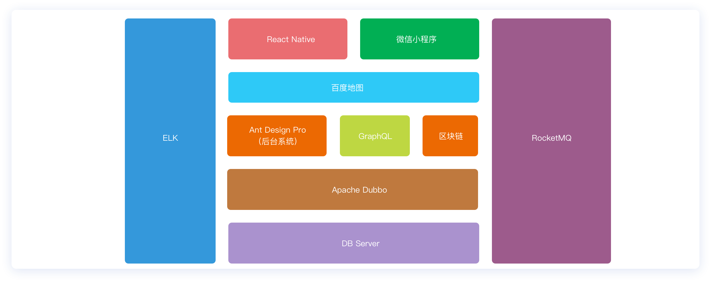

### 解决方案

-   前后端分离的工程构建方案（ReactJS+Ant Design+Node.js+Npm+webpack）
-   Spring全家桶解决方案（SpringBoot+SpringData）
-   SOA解决方案（Dubbo)
-   分布式消息/事务解决方案（RocketMQ）
-   分布式搜索服务解决方案（Elasticsearch）
-   大数据存储解决方案（MongoDB）
-   微信授权登录解决方案（微信小程序）
-   前后端分析接口服务解决方案（RESTful+GraphQL）
-   云存储解决方案（OSS）
-   爬虫解决方案（webmagic）
-   即时通信解决方案（WebSocket）
-   容器化解决方案（docker）

### 总体流程

#### 租客

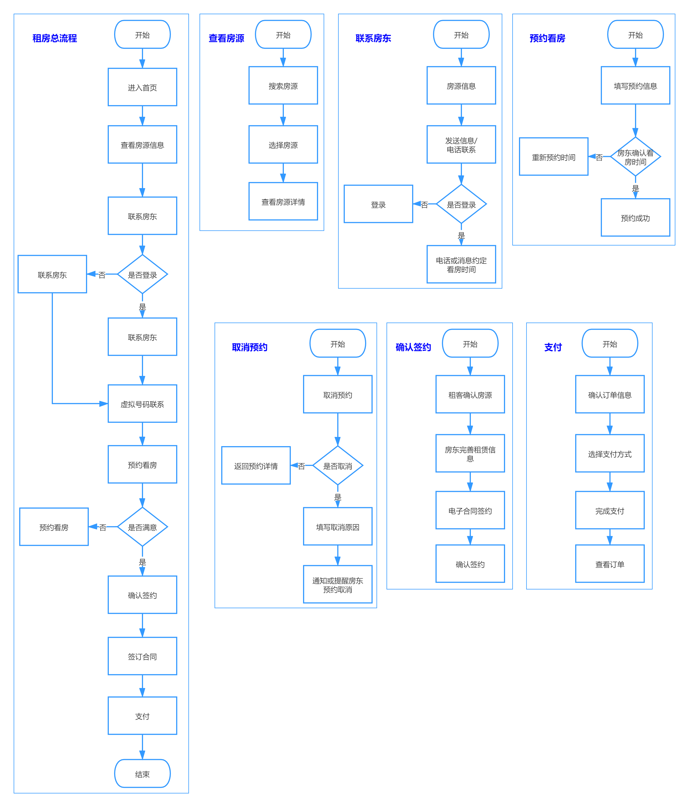

#### 房东

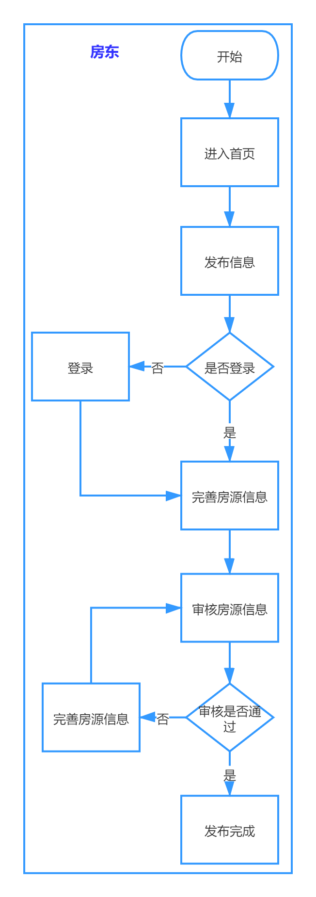

### 功能摘要

#### 前台

<table>
	<tr>
	    <th>一级 模块</th>
	    <th>子模块</th>
        <th>功能描述</th>
	</tr>
    <tr>
	    <td>首页</td>
	    <td>房源 搜索</td>
	    <td>根据条件进行搜索</td>
	</tr>
    <tr>
	    <td>地图 找房</td>
	    <td>地图 找房</td>
	    <td>在地图显示各区域房源数量，能够根据小区进行分解</td>
	</tr>
    <tr>
	    <td>房屋 列表</td>
	    <td>房屋 筛选</td>
	    <td>根据条件进行筛选</td>
	</tr>
	<tr>
	    <td rowspan="7">房屋 详情</td>
	    <td>收藏 房源</td>
	    <td>用户可以收藏房源信息</td>
	</tr>
    <tr>
    	<td>分享 房源</td>
        <td>用户可以将房源信息分享出去</td>
    </tr>
    <tr>
    	<td>举报 房源</td>
        <td>租户可以举报虚假房源</td>
    </tr>
    <tr>
    	<td>联系 房东</td>
        <td>租户可以直接通过虚拟号码联系房东</td>
    </tr>
    <tr>
    	<td>预约 看房</td>
        <td>租户在电话联系房东后，填写预约时间，作为凭证</td>
    </tr>
    <tr>
    	<td>在线 签约</td>
        <td>租户与房东达成协议后，签订电子合同</td>
    </tr>
    <tr>
    	<td>支付</td>
        <td>租户通过自选支付方式将租金转至指定账户</td>
    </tr>
</table>

<table>
    <tr>
	    <td rowspan="3">个人 中心</td>
	    <td>身份 认证</td>
	    <td>用户填写姓名与证件号，并上传手持身份证照片</td>
	</tr>
    <tr>
    	<td>登录</td>
        <td>用户登录</td>
    </tr>
    <tr>
        <td>注册</td>
        <td>用户注册</td>
    </tr>
    <tr>
        <td rowspan="2">资讯 列表</td>
        <td>资讯 爬取</td>
        <td>爬取各大租房网站相关资讯</td>
    </tr>
    <tr>
        <td>资讯 推送</td>
        <td>系统向用户推送最新资讯</td>
    </tr>
    <tr>
        <td rowspan="3">消息</td>
        <td>消息 提醒</td>
        <td>消息提醒</td>
    </tr>
    <tr>
        <td>实时 通信</td>
        <td>租户与房东之间可以实时通讯</td>
    </tr>
    <tr>
        <td>账单 推送</td>
        <td>每月生成账单，便于房东查看收入情况</td>
    </tr>
</table>

#### 后台

<table>
	<tr>
        <th>一级 模块</th>
        <th>子模块</th>
        <th>功能描述</th>
	</tr>
    <tr>
        <td rowspan="5">房源 管理</td>
        <td>房源 列表</td>
        <td>管理房东以及管理员上传的所有房源信息</td>
    </tr>
    <tr>
        <td>查看 图片</td>
        <td>查看某房源下所有的房屋图片信息</td>
    </tr>
    <tr>
        <td>新增 房源</td>
        <td>通过系统后台增加房源</td>
    </tr>
    <tr>
        <td>看房 请求</td>
        <td>显示所有租客发起的看房请求列表</td>
    </tr>
    <tr>
        <td>租房 管理</td>
        <td>显示所有租客发起的租房请求列表</td>
    </tr>
    <tr>
        <td>房东 管理</td>
        <td>房东 列表</td>
        <td>显示系统中注册的所有房东用户列表</td>
    </tr>
    <tr>
        <td>用户 管理</td>
        <td>用户 列表</td>
        <td>显示系统中所有用户列表（包含房东以及租客）</td>
    </tr>
    <tr>
        <td>合约 管理</td>
        <td>合约 列表</td>
        <td>显示租客与房东签订的所有合约</td>
    </tr>
    <tr>
        <td>资讯 管理</td>
        <td>资讯 列表</td>
        <td>显示系统中所有的资讯信息</td>
    </tr>
        <tr>
        <td>问答 管理</td>
        <td>问答 列表</td>
        <td>显示系统中所有的问答信息</td>
    </tr>
</table>

<table>
    <tr>
        <td rowspan="3">系统 管理</td>
        <td>房源 接口</td>
        <td>对接三方房源基本信息接口</td>
    </tr>
    <tr>
        <td>字典 配置</td>
        <td>对房源的信息进行系统外的配置</td>
    </tr>
    <tr>
        <td>合同 模板</td>
        <td>对签约的合同进行更新</td>
    </tr>
    <tr>
        <td rowspan="2">财务 管理</td>
        <td>账单 管理</td>
        <td>管理平台中发生的所有账务信息</td>
    </tr>
    <tr>
        <td>提现 审核</td>
        <td>审核房东发起的提现申请</td>
    </tr>
</table>

### 功能详情

#### 房源管理

##### 房源管理结构图

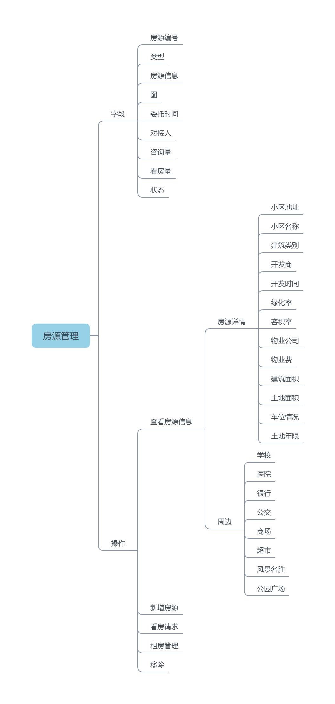

##### 特性描述

>   房源管理主要管理展示房东上传的房源信息，房源详情和房屋配置由系统自动添加，为系统内置功能，不需要房东进行上传。房源管理同时具有审核房东房源的功能，对不符合标准的房源进行拒绝。

1.  房源管理

    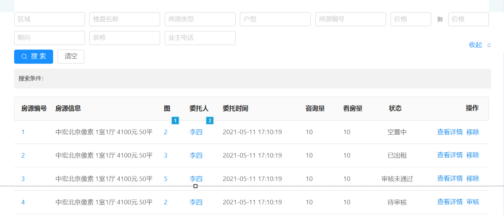

2.  图片展示

    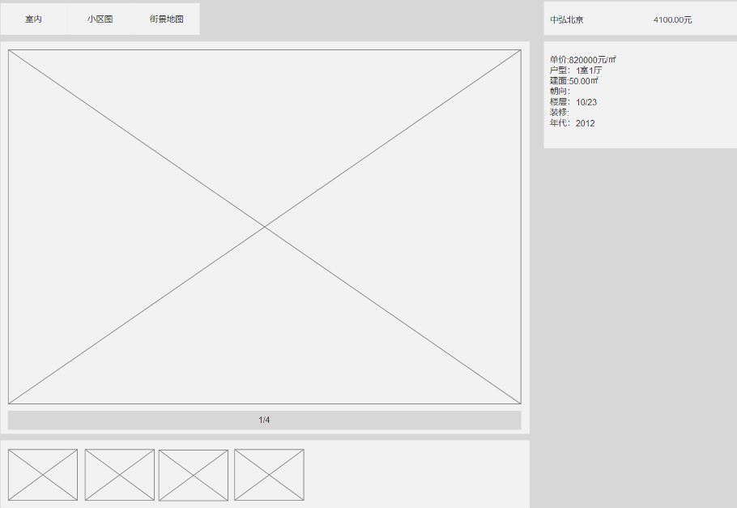

    

3.  新增房源

    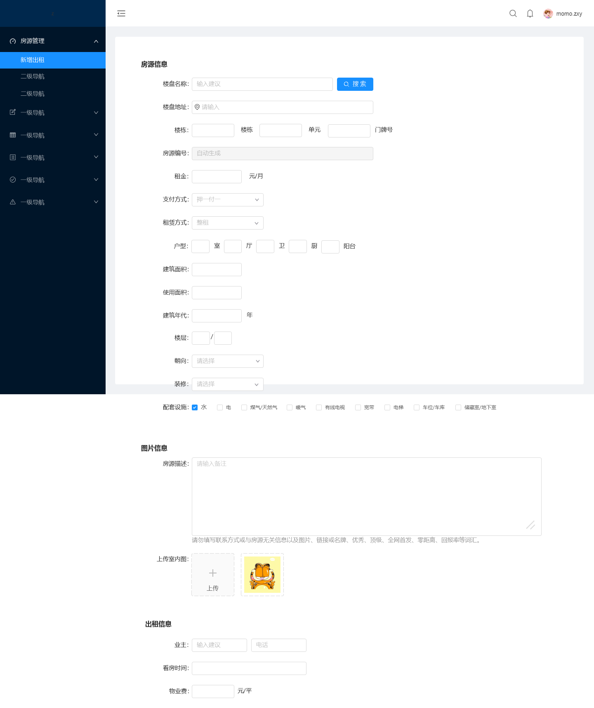

4.  看房请求

    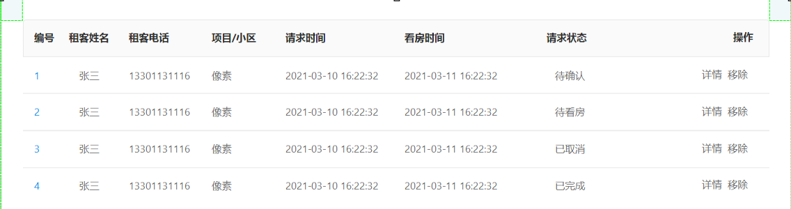

5.  租房管理

    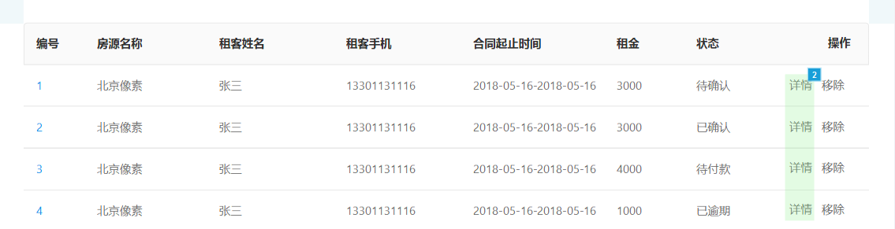

##### 功能描述

###### 房源管理

-   显示所有房源信息
-   实现对房源的审核，状态查看和移除操作

###### 新增房源

-   通过完善表单完成对房源的添加

###### 看房请求

-   看房请求模块显示所有租客发起的看房请求并对所有的看房请求状态进行跟踪，保证每个用户的看房请求得到积极回

###### 租房管理

-   租房管理显示所有看房请求完成后的租房申请并对所有的租房请求状态进行跟踪，保证每个用户租房请求的完整性

#### 房东管理

##### 房东管理结构图

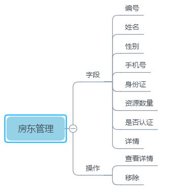

##### 特性描述

>   房东管理模块显示平台中所有房东列表，可以通过查看详情来获取更加详细的房东信息

1.  查看详情

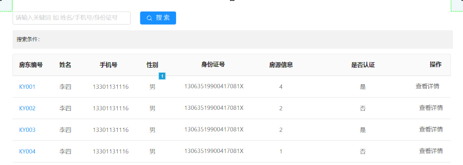

##### 功能描述

###### 房东列表

-   查看所有房东详细信息，对房东基本信息和房源进行管理

#### 用户管理

##### 用户管理结构图

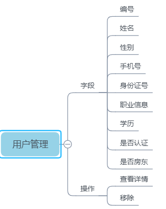

##### 特性描述

>   用户列表用来管理平台所有用户，列表中包含所有的房东与租客，两者的区别仅在是否为房东中进行区分

1.  用户列表

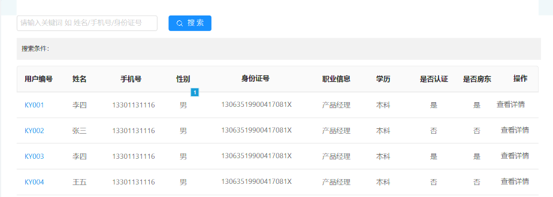

##### 功能描述

###### 用户列表

-   管理平台所有用户，包括租客与房东所有的用户信息
    -   显示所有的注册用户
    -   点击详情可以通过弹窗形式查看，内容包括基本信息以及认证信息

#### 合约管理

##### 合约管理结构图

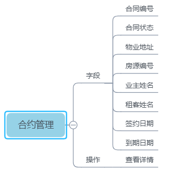

##### 特性描述

>   合约管理即合同管理，管理平台中租客与房东签订的所有线上合同，并对所有合同的状态进行实时监控，杜绝逾期的产生。保证租客与房东的利益

1.  合约管理

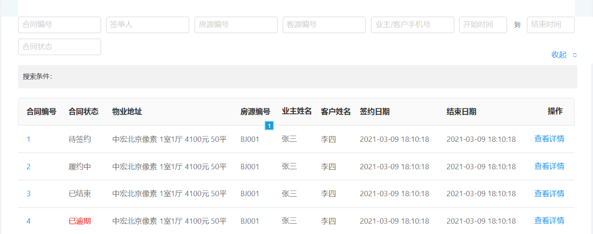

##### 功能描述

###### 合约管理

-   显示所有租客与房东签订的合约信息，点击详情可以显示合约的详细内容
    -   合约状态分为待签约、履约中、已结束、已逾期四种操作

#### 资讯管理

##### 资讯管理结构图

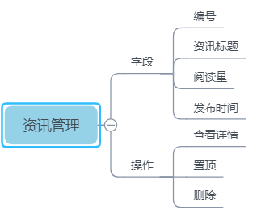

##### 特性描述

>   资讯管理板块管理平台中通过爬虫爬取到的所有资讯内容，可对部分不符合平台调性的内容进行删除操作

1.  查看详情

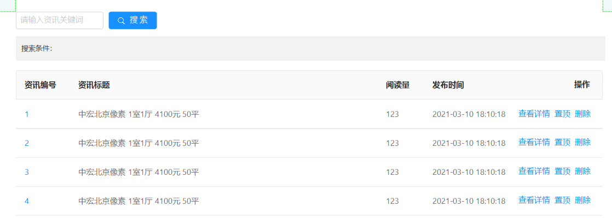

##### 功能描述

###### 资讯管理

-   管理平台中所有资讯内容，同时对不符合平台调性的内容进行删除操作
    -   后台可以删除资讯，无添加资讯功能，全部由爬虫进行爬取，后台可以对资讯进行查询操作
    -   点击置顶按钮可以对资讯进行前台置顶

#### 问答管理

##### 问答管理结构图

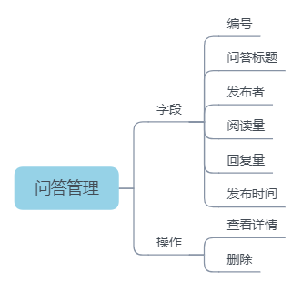

##### 特性描述

>   问答管理模块为用户提交的问答内容，后台管理模块可以看到每条问答的浏览次数和回答次数，后台可以对不符合规范的问答内容进行删除操作

1.  查看详情

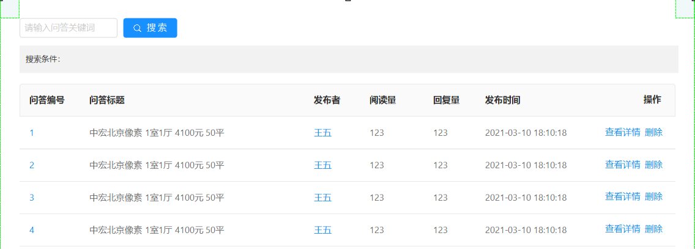

##### 功能描述

###### 问答管理

-   管理问答平台中问答内容，并对不符合规范内容进行删除操作
    -   问答内容为前台提交，后台可对问答内容进行删除操作

#### 财务管理

##### 账务管理结构图

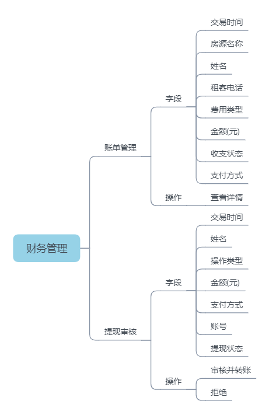

##### 特性描述

>   财务管理包含账单管理和提现审核两个模块，账单管理显示所有在平台中的资金往来，包括租户的租金和押金等以及房东的提现；提现审核为房东提现时系统对该账目的审核，审核通过后系统将自动将钱款转入到房东指定银行卡中

1.  账单管理

    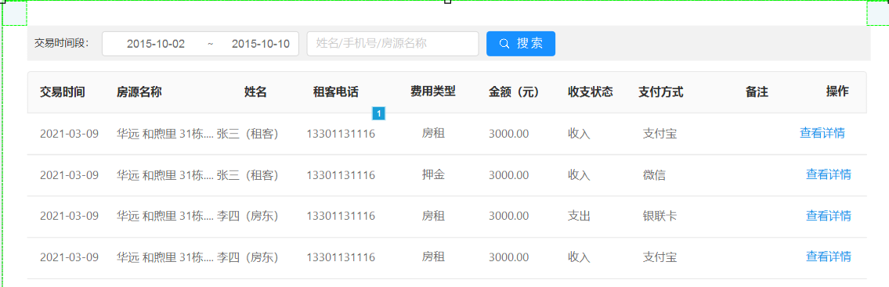

2.  提现审核

    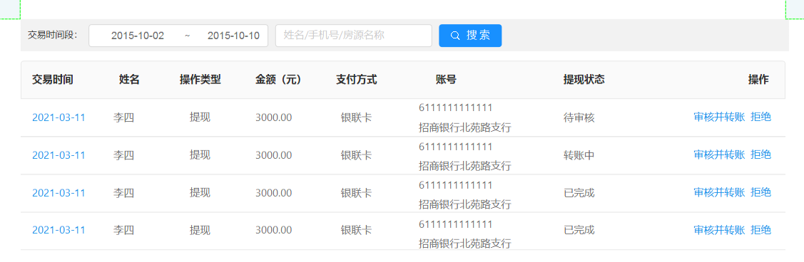

##### 功能描述

###### 账单管理

账单管理显示平台中所有的账务列表，包括租户支付的房租以及押金，还有房东成功提现的账目信息

-   点击账目列表中的详情可以查看账目的详细信息

###### 提现审核

提现审核为房东提交的提现申请，管理员在审核通过后系统将自动将金额转至房东指定的银行账户，目前仅支持银行卡转账。
-   提现金额不可超过房东账户金额
-   管理员审核后，系统将自动完成转账操作

#### 系统设置

##### 系统设置结构图

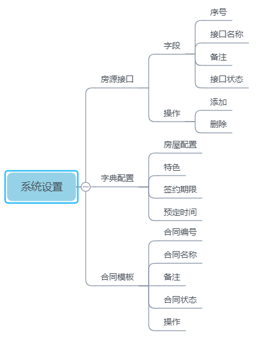

##### 特性描述

>   系统管理包括房源接口、字典配置、合同模板三项内容，管理员可通过三项的配置完成对房源基本信息的接口配置、房屋配置、特色、签约期限、预定时间以及合同的配置管理

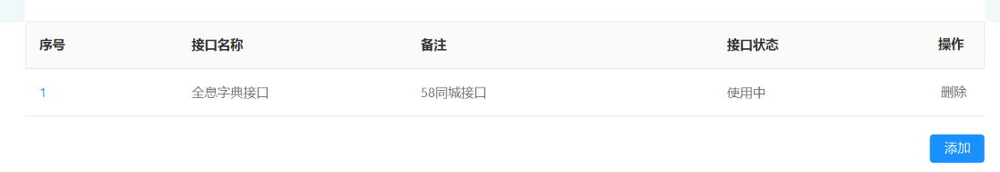

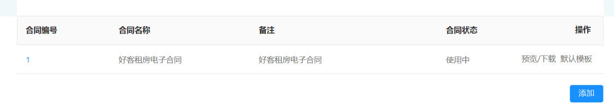

##### 功能描述

###### 房源接口

-   房源接口用于平台中房源基本信息的三方接口对接
    -   系统默认接口的优先级最高，系统在检索本地信息无果的情况下才会调用三方接口中的相关信息

###### 字典配置

-   字典配置为系统默认配置项的补充，在系统默认配置项不符合实际需求时，可用过接口配置项的配置来增加相关字典
    -   系统内置配置优先级最高
    -   字典不可重复，发现重复项后不可添加

###### 合同模板

-   合同模板管理平台中所有房东与租客使用的租房合同
    -   合同仅可启动一份
    -   合同修改的仅为正文内容，在表头和页脚内容禁止修改
    -   如合同更新后，老用户的签约内容并不发生任何变化

