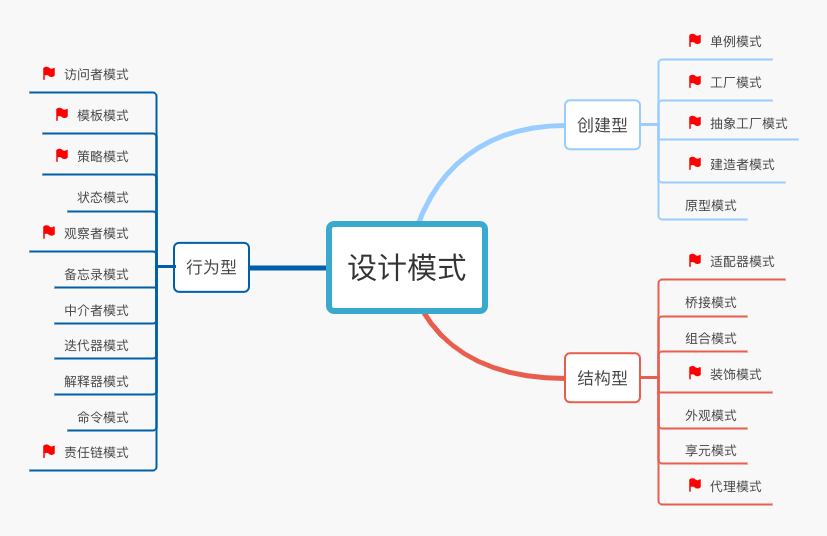

语言学习：掌握特性

-   高阶函数 higher-order function
-   静态类型检查：static-type checking
-   类型推导： type inference

OO（Oriented-Object）的理解 [ShellyYuKi][https://www.bilibili.com/video/BV1c54y1U7pp]提到的

class不是OO本质

>   messaging是OO的首要特征：Alan Kay一个世界看做是一堆独立运转的节点在相互发送和处理消息；A节点给B节点发送消息，相当于A这个object调用了B这个object的某个method

http://xahlee.info/comp/Alan_Kay_on_object_oriented_programing.html

messaging本质：

‘多态’：同一条消息，能够被不同类型的节点处理；不同结点对同一消息的处理方式和结果可能有很大不同

‘封装’：节点A看不到节点B内部状态，更无法直接更改节点B的内部状态，唯一能做的就是给节点B发消息

‘’

基于java的推荐系统：https://www.coursera.org/specializations/java-programming#courses

宋红康：https://www.bilibili.com/video/BV1Kb411W75N

翁恺：https://www.bilibili.com/video/BV1DJ411B7cG

**java入门**

-   面向过程 VS 面向对象
-   面向对象基本特征：封装、继承、多态
-   访问控制符：private、default、protected、public
-   数据类型：基本类型、引用类型
-   控制流程：for、while、switch 等
-   序列化
-   异常处理（有点难度）
-   泛型（有点难度）

《Java 核心技术卷I》

>   这本书建议作为Java 之旅的第一本书，涵盖的内容非常全，比起那些30天学会 Java 之类的书，这边书更加务实。书中有些章节其实不用看，比如Swing GUI 的直接略过，因为用 Java 写桌面端应用已经过时了。

《阿里巴巴 Java 开发手册》

《Java 编程思想（Thinking In Java）》

>   这是一本非常非常经典的书，你要问搞 Java 的人如果没听过这本书那算是白学了，哈哈。其实说实话这本书我试图看过几次，最终都没有看完，一个原因是它太厚了，另外我觉得讲得太啰嗦了，所以我现在拿来垫桌子，高度合适挺好的。所以呢，建议新人不要一开始看这边书，不然你会怀疑人生还没入门就放弃了，就把它当做编程圣经，等你后面有经验了拿起来再翻翻吧。

**Java高级**

-   Java 集合类源码
-   线程池
-   Java 代理
-   IO 模型
-   JVM
-   Java 并发编程（JUC）

Java 已经入门了，你都想进阶了，建议你不要再找视频看了，一边看书一边思考吧。

·《Effective Java》

>   书中列举了很多编程建议，其实就是告诉怎样去写好代码，你需要从`能写代码`（入门）过渡到`会写代码`，这本书值得一看。如果你的编码经验比较少，那这边书你可以稍微往后延，因为看完了你可能没有感同身受。

《Java8 实战》

·《深入理解 Java 虚拟机 第3版》

《Java 并发编程的艺术》

>   这是一本专门讲解Java并发的书，涉及到各种锁、常见安全的集合类，基本就是将 JUC（java.util.concurrent包的简称）里所有的内容覆盖了一遍，看完你一定有收获。强烈推荐！

·《并发编程实践》

>   多核 CPU 自带 L2 cache 却共享内存和线程，复杂的锁，一行 Java 代码却编译为多行机器指令而 CPU 在任意机器指令间都可切换线程。面对这么复杂的硬件环境，Java 是如何设计保证程序正确的。

## 工具篇

**IDEA**：

:white_check_mark:  https://www.bilibili.com/video/BV1PW411X75p

**Maven**：

:white_check_mark: https://www.bilibili.com/video/BV1TW411g7hP

**Git**:

:white_check_mark:  https://www.bilibili.com/video/BV1FE411P7B3

## 数据库篇

-   数据库基本理论：范式、索引原理、数据库引擎
-   SQL 基本语法
-   SQL 调优，explain 执行计划
-   数据库事务（ACID）
-   数据库锁：乐观锁、悲观锁、表锁、行锁等

当然面试大厂肯定会问一下比较难的东西，你需要搞懂索引的原理、事务 ACID、锁，问数据库这些东西必考哦！

**SQL**:

https://www.bilibili.com/video/BV1UE41147KC

**MySql**:

https://www.bilibili.com/video/BV12b411K7Zu

https://www.bilibili.com/video/BV1iJ411m7Fj

**Redis**:

https://www.bilibili.com/video/BV1S54y1R7SB

《数据库系统概念》

《MySQL必知必会》

《MySQL技术内幕 : InnoDB存储引擎》

《MySQL高性能》

要了解红黑树和索引的实现方式，了解 InnoDB 存储引擎的工作原理，你才能更好的理解 explain sql 后出来的各种回显结果，从而帮助你更好的调优 SQL。

## 框架

### 基础框架

-   Spring 全家桶（Spring、Spring MVC、Spring Boot）使用
-   ORM 框架（MyBatis、Hibernate）使用
-   Spring 原理
-   ORM 框架原理

**Spring**: AOP（面向切面编程，Aspect-Oriented Programming）和 IOC（控制反转，Inversion of Control）

Spring 提供的是一个 IOC 容器，所有的 Bean，包括 Controller，都是在 Spring IOC 容器中初始化的，而 Servlet 容器通常由 JavaEE 服务器提供（比如 Tomcat），它们之间就是通过 Spring MVC 联系起来的。

:white_check_mark: https://www.bilibili.com/video/BV1WE411d7Dv

https://www.bilibili.com/video/BV1Vf4y127N5

**SpringMVC**:Spring MVC 是 Spring 框架内置的一个 MVC（Model-View-Controller，也就是模型-视图-控制器）实现，用于解决 Web 开发中常见的问题，比如说参数接收、文件上传、表单验证、国际化等等。

在 Spring MVC 出现之前，我们用 Servlet 来做 Web 开发，但Servlet 在接收请求参数、数据共享、页面跳转等操作时相对比较复杂，SpringMVC 就是对 Servlet 进行更深层次的封装。

使用 Spring MVC 时，整个 Web 应用程序的启动顺序如下：

-   启动 Tomcat 服务器；
-   Tomcat 读取 web.xml 并初始化 DispatcherServlet；
-   DispatcherServlet 创建 IOC 容器并自动注册到 ServletContext 中。

https://www.bilibili.com/video/BV1qp4y1n7D1

:white_check_mark: https://www.bilibili.com/video/BV1aE41167Tu

**Mybatis**:MyBatis 是一款优秀的持久层框架，支持自定义 SQL、存储过程以及高级映射。MyBatis 免除了几乎所有的 JDBC 代码以及设置参数和获取结果集的工作。

借助 MyBatis，我们可以通过简单的 XML 或注解来配置和映射原始类型、接口和 Java POJO（Plain Old Java Objects，普通老式 Java 对象）为数据库中的记录。

https://www.bilibili.com/video/BV1c54y1a7GE

:white_check_mark: https://www.bilibili.com/video/BV1NE411Q7Nx

**SpringBoot**:

Spring Boot 是由 Pivotal 团队提供的一个全新框架，其设计目的是用来简化 Spring 应用的初始搭建以及开发过程。该框架使用了特定的方式来进行配置，从而使开发人员不再需要定义样板化的配置。说句人话就是，Spring Boot 不是什么新的框架，它默认配置了很多框架的使用方式，就像 Maven 整合了所有的 Jar 包，Spring Boot 整合了所有的框架。

https://www.bilibili.com/video/BV1PE411i7CV

https://www.bilibili.com/video/BV1Et411Y7tQ

《Spring 基础内幕》

>   首先声明一下这是一本讲解Spring 源码的书，不是教你做项目的书。如果需要深入理解 Spring 的技术原理，这是一本非常推荐的书。有点难啃，多读几遍。

《MyBatis 技术内幕》

>   MyBatis 是 ORM 框架的一种，在国内使用比较多，据说在国外喜欢用 Hibernate。这本书对 MyBatis 的使用和基本原理都介绍比较清楚了。

### 微服务框架

-   Dubbo框架
-   SpringCloud框架
-   服务注册与发现
-   分布式服务链路追踪
-   服务隔离、熔断、降级
-   服务网关

**SpringCloud**:Spring Cloud 是一系列框架的有序集合。它利用 Spring Boot 的开发便利性巧妙地简化了分布式系统基础设施的开发，如服务发现注册、配置中心、消息总线、负载均衡、断路器、数据监控等，都可以用 Spring Boot 的开发风格做到一键启动和部署。

https://www.bilibili.com/video/BV1jJ411S7xr

springCloud 和 Dubbo 在官网都有很详细的介绍文档：

-   Dubbo官网 http://dubbo.apache.org/ 可以切到中文版
-   SpringCloud 官网 https://spring.io/projects/spring-cloud

《深入理解Apache Dubbo与实战》

《Spring Cloud微服务实战》

ZooKeeper，推荐读 ZooKeeper 小红书。ZK 是分布式系统数据一致性协调工具。在单机进程中代码执行被认为是完全可靠的，要么执行成功要么执行失败，而到了分布式系统，进程之间网络调用经常会出现超时，出现超时就麻烦了，到底是成功了还是失败了没法简单判断。理解 CAP 理解分布式系统数据的一致性是分布式系统不出错的保障。

### 常用中间件

>   中间件（Middleware）通常是指在一个大型分布式的系统中，负责各个不同组件（Component）/服务（Service）之间管理以及交互数据的。

-   缓存：Redis
-   消息队列：Kafka、RocketMQ、RabbitMQ、ActiveMQ、ZeroMQ（推荐 Kafka）
-   数据库中间件：ShardingSpere、Mycat

每个中间件涵盖的内容都非常多，要想学精需要大量时间。

**Redis** 中文官方网站：http://www.redis.cn/

《Redis 设计与实现》

当做字典学习 redis 常见命令

极客时间.蒋德钧：《Redis核心技术与实战》

**Kafka** ：要理解其为什么那么快又那么可靠又那么大存储空间

《Kafka 权威指南》

《深入理解Kafka：核心设计与实践原理》

http://kafka.apache.org/

极客时间.胡夕：《Kafka核心技术与实战》

**Flume**，一个日志收集传输系统。

**Tomcat**，学学其 classloader 设计思想。

**Netty**

之前大量的计算机网络性能都被阻塞在 IO 上没有被释放，NIO 出现后大幅度提升了 IO 效率。我猜测，在 JDK 支持了 NIO 之后，Tomcat 等 web 容器很快跟进升级，于是全世界在硬件资源没变的情况下网络站点的并发响应能力却大福提升了。

中间件的学习是一个漫长的过程，不仅需要很多理论知识还需要实践经验。

-   比如你学 Redis 的时候，要思考五种基本数据类型各自使用场景、布隆过滤器是什么原理、用 Redis 怎么实现分布式锁，带着问题去学习效率非常高。

-   比如你学 Kafka 消息队列，要对比常见消息队列的优缺点、Kafka 为什么吞吐量高、Kafka 会不会丢消息以及怎么解决。

-   比如你学数据库中间件，要想数据库为什么要分库分表、分库分表 ID 如果处理等等。

## JVM

尚硅谷的这套视频课程分为《内存与垃圾回收篇》《字节码与类的加载篇》《性能监控与调优篇》三个篇章.JVM 屏蔽了与具体操作系统平台相关的信息，使得 Java 程序只需要生成在 Java 虚拟机上能运行的目标代码，也就是字节码，就可以实现跨平台的诉求了。

https://www.bilibili.com/video/av83622425

## 源码

https://www.bilibili.com/video/BV1V7411U78L

## AL&DS

浙大：https://www.bilibili.com/video/BV1JW411i731

-   栈与队列：先进先出、后进先出
-   线性链表
-   查找：顺序查找、二分查找
-   排序：交换类、插入类、选择类
-   树、二叉树、图：深度优先（DFS）、广度优先（BFS）
-   递归
-   分治
-   滑窗
-   三大牛逼算法：回溯、贪心、动态规划（DP）

强烈推荐力扣：https://leetcode-cn.com建议刷300题以上，要覆盖简单、中等、困难的题目。面试前要训练手感，不要生疏了，可以选保持每日或几日一题。

《漫画算法-小灰的算法之旅》

《剑指 offer》

《labuladong的算法小抄》

《算法导论》

《数据结构与算法之美》

《算法面试通关40讲》

## OS

像 Java 中的多线程技术，其实是由操作系统来负责进程和线程管理的；第三，学习操作系统，还能学到内存分配方面的知识。

https://www.bilibili.com/video/BV1js411b7vg

https://www.bilibili.com/video/BV1d4411v7u7

-   进程和线程的区别
-   进程间的通信方式：共享内存、管道、消息
-   内存管理、虚拟内存
-   死锁检测和避免

《深入理解计算机系统 CSAPP》

《现代操作系统 （第3版）》

## CA

计算机是由 CPU、内存、显示器这些设备组成的硬件。弄明白了计算机的组成原理，也就对整个软件开发有了一个系统的认知，不论是计算机的硬件原理，还是软件架构，都能很好的驾驭

https://www.bilibili.com/video/BV1WW411Q7PF

## CN

https://www.bilibili.com/video/BV1c4411d7jb

需要搞懂 HTTP、TCP/IP 协议，了解一根网线如何串起整个网络。

-   OSI 七层模型、TCP/IP五层模型
-   常见网络协议：HTTP、TCP/IP、UDP
-   网络安全：非对称加密、数字签名、数字证书
-   网络攻击：DDOS、XSS、CSRF 跨域攻击

计算机网络面试有一道非常经典的面试题：说说你从URL输入到最终页面展现的过程。这一题可以覆盖大部分计网的知识点，可以从 DNS 解析到 HTTP、TCP/IP协议、物理层协议，一直到浏览器渲染页面，你技术功底有多深你就可以聊多深。希望大家学完了也能试着回答一下这个问题。

《网络是怎么连接的》

《图解 HTTP》

《TCP/IP详解卷1：协议》

学习网络必备的抓包神奇：wireshark

## 设计模式

在工作的前几年，大部分程序员都处于熟悉编程语言的阶段，也就是处于“技”的阶段，随后就要进入“术”的阶段了。在编程领域，“术”的典型代表就是“设计模式”。

设计模式玩得炉火纯青，写出的代码就更优雅，阅读起来也会更加舒服，可维护性、可扩展性就更强。

-   设计模式的六大原则：单一职责、里氏替换、依赖倒置、接口隔离、迪米特法则、开闭原则
-   UML 基础知识
-   设计模式三大分类：创建型、结构型、行为型
-   常用设计模式基本原理

https://www.bilibili.com/video/av57936239

学习网站：[Refactoring Guru][https://refactoringguru.cn/]

http://book.bugstack.cn/#s/6AneBuNA

在看书之前我还是推荐你熟悉一下 UML 的理论知识，因为你如果不懂 UML 那任何一本设计模式的书你都可能读不下去， UML 是设计模式的前提。

UML 学习网站：

https://www.w3cschool.cn/uml_tutorial/

不要花太多时间学习 UML，简单理解入门即可。

《Head First 设计模式》

>   Head First 是一个比较经典的系列丛书，有些人非常喜欢这种风格。这本书讲枯燥的设计概念讲解的生动有趣，作为一本入手书非常值得推荐。

《大话设计模式》

《图解设计模式》

·《设计模式》

>   Gang Of Four。四杆老枪的设计模式，教会你一些固定招式应付各种经典场景。

《设计模式-可复用面向对象软件的基础》	

这几本书都要看吗？当然不是，如果你是在准备面试，我个人建议是读其中一本就够了。至于说看哪一本，你可以找对应的电子书，挑一个章节试读一下，符合你的胃口就选择这一本继续读下去。

如果你已经有几年的编码经验，又想把代码写好，建议你多挑基本读读，吸收每本书的精华。

## 分布式结构

分布式这一部分就是面试的加分项了，答好了面试官会觉得你技术功底深厚，答不好，只要你前面的基础还不错也能过。所以呢，作为一个有追求的技术人，千万不要放过加分的机会。

分布式相关的内容非常多，下面列举几个在项目中或者面试中经常会遇到的知识点：

-   分布式事务：两阶段提交（2PC）、补偿事务（TCC）
-   分布式锁：基于关系型数据库（MySQL）、基于 Redis、基于Zookeeper
-   分布式 ID：雪花算法（Snowflake）、美团 Leaf

## 资源列表

（1）视频网站

-   B站（推荐）：https://www.bilibili.com/
-   网易云课堂：https://study.163.com/
-   极客学院：https://www.jikexueyuan.com/
-   慕课网：https://www.imooc.com/

（2）专栏

-   极客时间（推荐）：https://time.geekbang.org/
-   Gitchat https://gitbook.cn/

（3）Github

-   Java 知识地图（推荐）：https://github.com/smileArchitect/JavaMap

（4）技术博客：

-   CSDN 博客：https://blog.csdn.net/
-   博客园：https://www.cnblogs.com/
-   掘金社区（推荐）：https://juejin.cn/
-   InfoQ：https://xie.infoq.cn/
-   思否：https://segmentfault.com/
-   开源中国：https://www.oschina.net/blog

（5）搜索引擎：

-   百度：https://www.baidu.com/
-   谷歌：https://www.google.com/

（6）知识问答：

-   知乎（推荐）：https://www.zhihu.com/
-   stackoverflow（推荐）：https://stackoverflow.com/

（7）刷题：

-   力扣（推荐）：https://leetcode-cn.com/
-   牛客：https://www.nowcoder.com/

（8）云笔记：

-   石墨：https://shimo.im/
-   语雀：https://www.yuque.com/
-   有道云笔记：http://note.youdao.com/
-   印象笔记：https://www.yinxiang.com/ 看个人习惯去选择，不推荐了。

（9）在线画图：

-   processOn：https://www.processon.com/
-   drawio：https://app.diagrams.net/ 各有特色，都推荐。