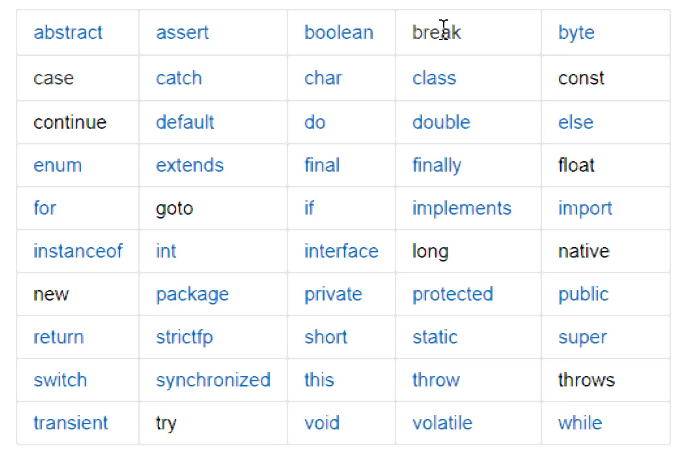
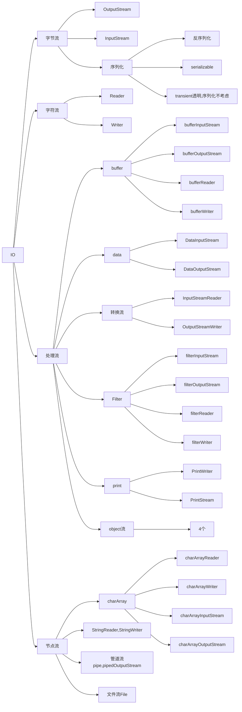
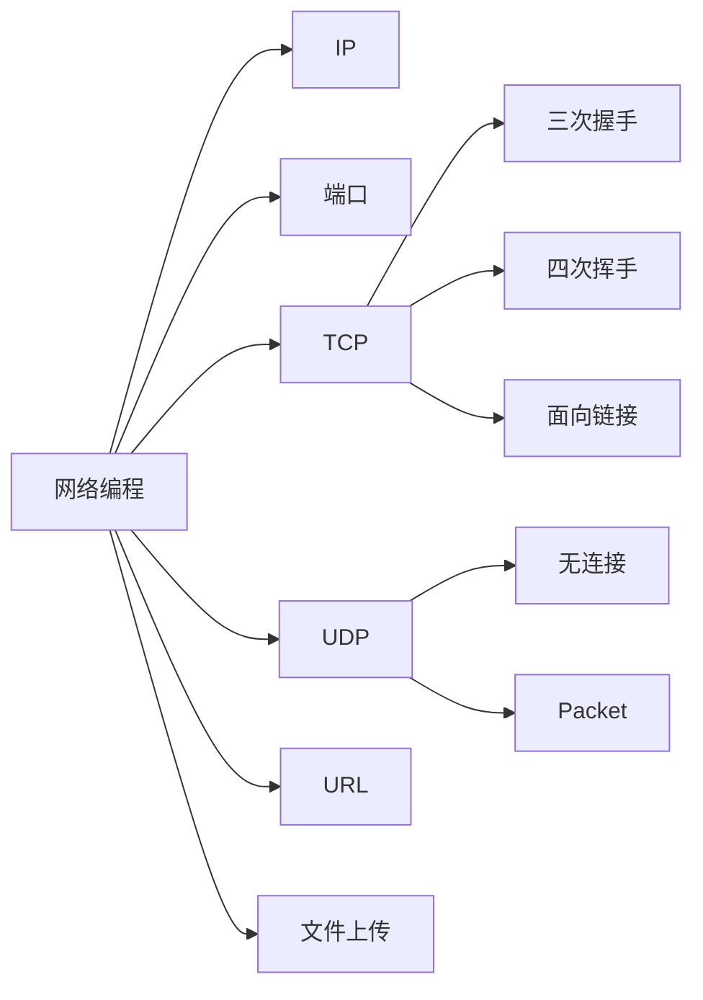
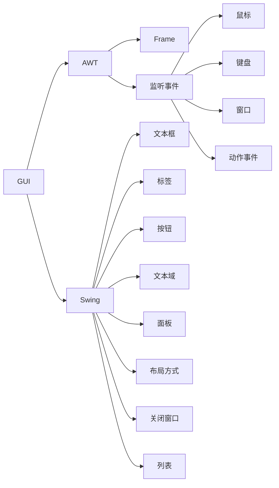
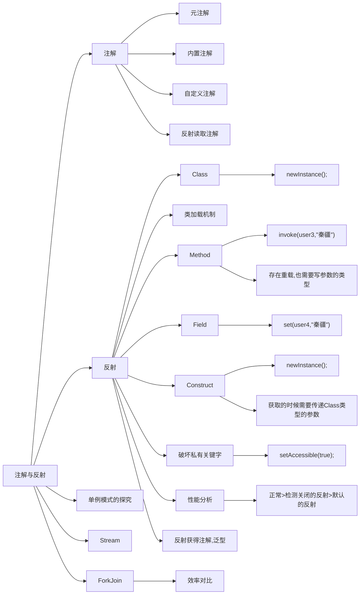

# JavaSE

@(Java)[2021年2月10日16:32:26]

[TOC]

<div style="page-break-after:always"></div>

## 简介

>    JDK：开发者工具包
>
>    JRE：运行环境
>
>    环境变量的配置

```java
public class Hello{
	public static void main(String[] args){
        System.out.println("Hello,World!");
    } 
}
```

-   javac [.java]->[.class] ：Hello.java 生成Hello.class

-   java [className] [参数列表]：java Hello

-   javadoc -encoding UTF-8 -charset UTF-8 Hello.class

编译型语言

### 基础语法

#### 注释

-   inline comment
    -   //
-   block comment
    -   /**/
-   document comment
    -   /** */
    -   javadoc生成帮助文档

#### 关键字



#### 数据类型

##### 基本数据类型

-   整数
    -   byte 1B
    -   short 2B
    -   int（默认） 4B
    -   long 8B
    -   进制转换
        -   0b 二进制
        -   0x 十六进制
        -   o 八进制
-   字符
    -   char 2B
    -   编码方式
        -   ascii
        -   utf-8
        -   Unicode
    -   转义字符
-   boolean 1bit

##### 引用数据类型

-   class
-   interface
-   array

#### 类型转换

##### 自动类型转换

低转高

#### 强制类型转换

高转低 (低)高

字节数，子类父类

### 变量和常量

#### 变量作用域

>   type varName [=value];

-   类变量
-   实例变量
-   局部变量

#### 常量

>   final MAX_A = 10;

#### 命名规则

1.  驼峰（变量，方法）
2.  类（首字母大写）
3.  常量（大写+下划线）

### 运算符

#### 算数运算符

>   \+、 \-、 \*、 / 、 ++、 --

#### 赋值运算符

=

#### 关系运算符

>    \> 、\<、 >= 、<=

#### 逻辑运算符

>   && || !

#### 位运算符

>   & | ^ ~ >> <<

#### 条件运算符

 ? : 

#### 扩展运算符

>   +=、-=、 \*=、 /= 

### 包机制

>   域名倒写
>
>   -   package：第一行，防止命名冲突
>   -   import

### javaDoc

JDK帮助文档

#### javaDoc

-   @author：作者
-   @version：当前版本
-   @since：最初版本
-   @param：参数
-   @throws：异常

<div style="page-break-after:always"></div>

## 流程控制

### Scanner

>   用户交互

```java
public class ScannerDemo{
    public static void main(String[] args){
		Scanner scan = new Scanner(System.in);
        
        while(scan.hasNext()){
            System.out.println((String)scan.nextline());
        }
    }
}
```

>   hasNextFloat
>
>   hasNextDouble
>
>   next与nextline的区别
>
>   -   next
>       -   读取到有效字符才可以结束输入
>       -   对输入有效字符之前的空白,next()方法将其自动去掉
>       -   输入有效字符后，才将其后面输入的空白作为分隔符或者结束符
>   -   nextline
>       -   以Enter为结束符，nextLine()返回的是输入回车之前的所有字符
>       -   可以获得空白

### 顺序结构

>   程序默认的结构，自上而下

### 分支结构

-   if
-   if-else if-else
-   switch-case-default：case穿透现象——break

### 循环结构

-   while
-   do while
-   for(start;condition;++)
-   forEach

### break&continue&return

<div style="page-break-after:always"></div>

## 方法

>   语句块的集合

### 方法定义

>   [返回值类型] 方法名([参数列表]){
>
>   ​	return [返回值];
>
>   }

###  方法调用

类名.方法

对象.方法

### 方法重载

>   名字相同，参数列表不同

###  命令行传参

>   main方法传参

###  可变长参数

>   必须放在最后一个参数

### 递归 

<div style="page-break-after:always"></div>

## 数组

### 定义

-   new int[size]
-   {a,b,c,d}

### 通过下标访问

-   ArrayIndexOutOfBounds

-   forEach遍历

    ```java
    List.forEach((item)->{
        ...
    })
        
    for(ItemType item:List){
    	...
    }
    ```

###  二维数组

>   int \[]\[]

### Arrays工具类

### 排序算法

<div style="page-break-after:always"></div>

## 面向对象

### 类与对象

### 构造方法

>   重载

默认的无参构造

-   手动定义有参，就必须要手动再加一个无参
-   单例模式，需要构造器私有

### new 对象

-   栈存放引用
-   堆存放具体的对象

###  封装

>   属性私有，get set

###  继承

>   extends——Java单继承，只能继承一个父类
>
>   Object
>
>   子类拥有父类的所有特性
>
>   方法重写
>
>   this
>
>   supper

### 多态

>   父类的引用指向子类的对象
>
>   ​	Person person = new Student();
>
>   instanceof 关键字，如果匹配，可以进行类型之间的转换

### 修饰符

-   public
-   protected
-   private
-   static
-   final
-   abstract

### 接口 interface

>   只能定义方法名
>
>   子类实现接口，必须重写其中的方法
>
>   只有一个方法的接口交函数式接口，可以使用lambda表达式简化
>
>   一个类可以实现多个接口

### 内部类

-   局部内部类

-   静态内部类

-   匿名内部类

<div style="page-break-after:always"></div>

## 异常

>   Throwable
>
>   -   Exception
>       -   运行时异常
>           -   1/0
>           -   ClassNotFound
>           -   NullPoint
>           -   UnknownType
>           -   IndexOutOfRange
>       -   检查型异常
>   -   Error
>       -   AWT错误
>       -   JVM异常
>           -   StackOverflow
>           -   OutOfMemory

###  五个关键字

-   try{}
-   catch(){}先小后大
-   finally{}
-   throw内部手动抛出异常
-   throws方法抛出异常

### 自定义异常

继承Exception即可

<div style="page-break-after:always"></div>

## 常用类

Object类

-   hashcode()
-   toString
-   clone()
-   getClass()
-   notify()
-   wait()
-   equals()

Math类

-   数学运算

Random类

-   生成随机数
-   UUID

File类

-   创建文件
    -   create
-   查看文件
    -   mkdir
-   修改文件
    -   canwrite
    -   canread
    -   getPath()
-   删除文件
    -   delete

包装类

-   自动装箱和拆箱

Date类

-   Date
    -   new Date()
-   SimpleDateFormat
    -   yyyy-mm-dd HH:mm:ss
-   Calendar
    -   建议使用

String类

-   不可变性 ——final
-   操作量较少
-   定义
    -   public String(byte byte[],Charset charset)：流数组转换为指定编码的字符串
    -   public String(StringBuffer buffer)：StringBuffer转换为字符串
    -   length
    -   isEmpty
    -   charAt(int index)：索引获取指定位置字符
    -   byte[] getBytes(String str)：
    -   indexOf(int ch)：获取指定字符的下标
    -   public String subString(int befinIndex)：从beginIndex到结尾的字符串
    -   String concat(String str)：连接字符串
    -   replace(char oldChar,char newChar)：替换第一个
    -   replaceAll(String regex,String )：替换全部
    -   String[] split(String regex,int limit)：将字符串分割成字符串数组
    -   toUpperCase
    -   toLowerCase
    -   trim：去掉两端空格
-   String str = "a"+1+2 ==> "a12"
-   String str = 'a'+1+2 ==> ascii(100) d
-   String str = 1+2+"a" =>"3a"

StringBuffer

-   可变长——append()
-   多线程数据量较大

StringBuilder

-   可变长
-   单线程数据量大
-   效率高，不安全

<div style="page-break-after:always"></div>

## 集合框架

### Iterator


### Collection

#### List——有序可重复

##### ArrayList

-   add
-   remove
-   contains
-   size

##### LinkedList

>   链表

-   getFirst()、removeFirst
-   getLast()、removeLast
-   addFirst

##### Vector

##### Stack

#### Set——无序不可重复

##### HashSet——常用

##### TreeSet

### Map

#### HashMap(重点)

-   JDK1.7：数组+链表
-   JDK1.8：数组+链表+红黑树

#### TreeMap

### Collections工具类

### 泛型<>约束，避免类型转换之间的问题

<div style="page-break-after:always"></div>

## IO流



<div style="page-break-after:always" />

## 多线程

### 进程和线程

#### run 和start的区别

-   start创建新线程

-   run执行完后返回主线程

#### 线程创建方式

-   Thread
    -   继承Runnable
    -   start0本地方法：java无权调用，底层的c处理
-   Runnable
    -   函数式接口
    -   lambda
-   Callable
    -   可以有返回值

### 静态代理

new Thread(Runnable).start();

### Lambda表达式

-   函数式编程
-   避免内部类定义过多，导致不便阅读

```java
new Thread(()->{System.out.println();}).start();
```

-   手动推导lambda

### 线程状态

####  新建

#### 就绪

#### 运行

#### 阻塞

#### 死亡

### 常用方法

#### sleep

#### join

#### yield

#### isLive

#### start

#### setPriority

#### interrupt

### 线程同步

多个对象操作同一资源，并发

前提：队列+锁

#### Synchronized

>   第一个线程进来拿到锁，后面排队，直到这个人释放锁，后面的锁才能放入

##### 同步方法（锁太多）

##### 同步代码块（常用）

##### 死锁

###### 死锁条件

-   互斥
-   请求保持
-   不可剥夺
-   循环等待

#### Lock(优先级高)

JUC

ReenTrantLock

-   lock
-   trylock
-   unlock

### 线程通信

#### 缓冲区：消息队列

#### 标志位：红绿灯

#### wait()

#### notifyAll

### 线程池

```jade
public ThreadPoolExecutor(
	int corePoolSize,//池大小
	int maximumPoolSize,//池最大
	long keepAliveTime,//池保持时间
	TimeUnit unit,//超时时间单位
	BlockingQueue<Runnable> workQueue,//阻塞队列
	ThreadFactory threadFactory,//线程创建工厂
	RejectedExecutionHandler handler//线程满机制
)
```

#### 池化

#### 池的大小

#### 最大连接数

#### 保持时间

<div style="page-break-after:always" />

## 网络编程



<div style="page-break-after:always" />

## GUI



<div style="page-break-after:always" />

## 注解和反射



