# C++
@(Knowledge)[Auspice Tian][2021年1月24日19:59:46]

---

[TOC]

<div style="page-break-after:always"></div>

## 绪论

计算机软件
>包括使计算机运行所需的各种程序 及其文档资料

指令
>计算机能够识别的所有指令的集合

指令系统
>一台计算机硬件系统能识别的所有指令的集合

机器语言
>计算机硬件系统能识别的二进制指令组成的语言

结构化程序设计
>自定向下，逐步求精；
>按功能将其划分为若干基本模块，形成树状结构，各模块之间功能上相互独立；各模块之间的关系尽可能简单；
>每一模块内都是由顺序，选择、循环三种基本结构组成；
>模块化实现的具体方法是使用子程序。

### **信息的存储和表示**

---

**信息**
>控制信息：指令、控制字
>数据信息
>>数值信息：定点数，浮点数
>>非数值信息:字符数据，逻辑数据

**采用二进制的优点**
>易于物理实现
>二进制运算简单
>机器可靠性高
>通用性强

**进制转换**
>`十进制转R进制整数`
>>除基取余、逆序输出
>
>`十进制转R进制小数`
>>乘积取整、正序输出
>
>`二、八、十六进制相互转换`
>>以二进制为中转，八取三位，十六取四位
>

**信息的存储单位**
>8 bit 一个字节（Byte）
>字长：计算机一次可以处理的二进制位数

**码制**
>`正数的原码，反码，补码一致`
>`负数的补码由反码末尾加1`

**浮点数的表示**
>`阶码用补码表示，尾数为原码`
>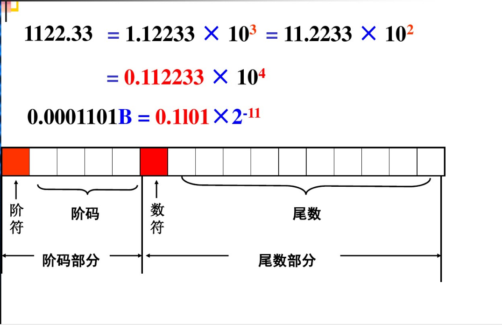


**数的表示范围 **
>有符号正数比负数小1，由于0的唯一性
>1000 0000 与 0000 0000  分别表示2^（-7） 和 0

**各种程序**
>**源程序**:用各种语言写出的代码；
>**目标程序**:源程序通过翻译加工后生成的程序，机器语言或低级语言；
>**翻译程序**:用来把源程序翻译成目标程序的程序；
>>汇编程序
>>编译程序
>>解释程序

## 简单程序设计

---

**标识符**
>C命名规则
>以字母下划线开头、
>区分大小写
>由大小写字母、数字、下划线组成

**符号常量**
>符号常量定义时一定要赋初值，程序中间不能修改
```cpp
const 常量名 = 常量值;
```

### **位运算**
`&`：按位取与
`|`：按位或
`^`：按位异或【反与，不同取1，相同取0】
`~`：取反
`<<  >>`：移位

>左移时：低位补0 高位舍弃
>右移时：移除位舍弃，无符号位高位补0；有符号数，高位补符号位或补0

### **隐含转换**
逻辑运算操作数必须为bool

>非0转换为true 0转换为false

位运算操作数必须是整数
>低转高类型
>赋值运算一律将右值转换为左值

### **显式转换**
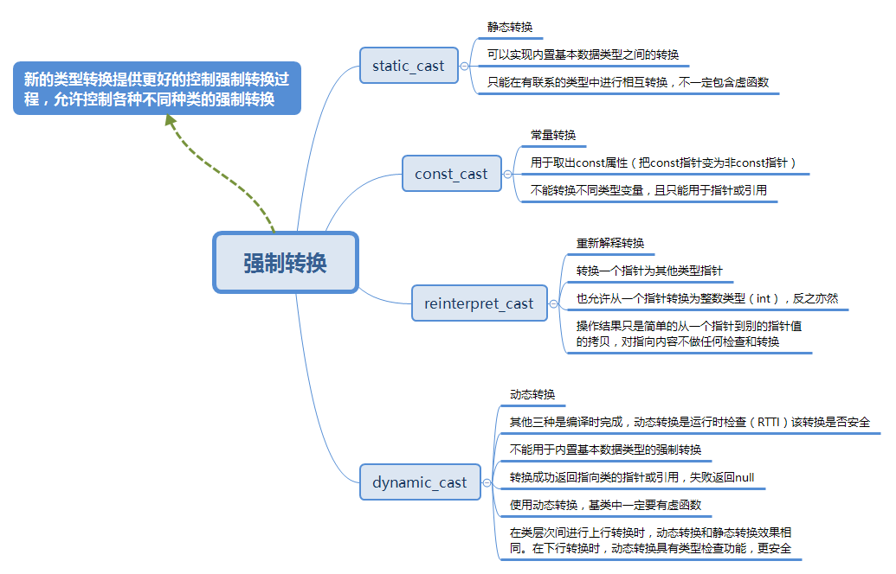
>去const属性用const_cast，`只能用于指针或常引用`
>```cpp
>const int a= 0;
>int b = const_cast<int>(a);//不对
>const int *pi = &a;
>int * pii = const_cast<int *>pi;//去除指针中的常量性，也可以添加指针的常量性;
>```
>基本类型转换用static_cast。
>```cpp
>int a = 6;
>double b = static_cast<int>(a);
>```
>多态类之间的类型转换用daynamic_cast。
>不同类型的指针类型转换用reinterpreter_cast。
>```cpp
>/*
>*reinterpret_cast它可以把一个指针转换成一个整数，也可以把一个整数转换成一个指针（先把一个指针转换成一个整数，在把该整数转换成原类型的指针，还可以得到原先的指针值）。
>*/
>int *ip;
> char *pc = reinterpret_cast<char*>(ip);
>```

### I/O格式控制 

| 操作符名          |              含义              |
| :---------------- | :----------------------------: |
| dec               |     数值类型采用十进制表示     |
| hex               |    数值类型采用十六进制表示    |
| oct               |     数值类型采用八进制表示     |
| ws                |           提取空白符           |
| endl              |       插入换行符并刷新流       |
| ends              |           插入空字符           |
| setw(int)         |            设置域宽            |
| setprecision(int) | 设置浮点数小数位数(包含小数点) |

```cpp
cout << setw(5) << setprecision(3) << 3.1415 << endl;
//设置域宽为5，小数点后保留两位有效小数
```

>**源代码中为变量规定的数据类型，通过编译器在编译各个操作时所选择的具体指令来体现在目标代码中**
>
>**CPU所执行的指令并不对操作数的类型加以区分，对各个操作数都执行相同的操作，编译器根据变量的数据类型选择合适的指令**
>
>**符号扩展**
>>有符号数据类型，用符号位扩展
>
>**0扩展**
>>无符号数据类型，用0填充
>

## 函数

```cpp
/*求x的n次方*/
# include<iostream>

using namespace std;

double power(int x,int n)
{
    double val = 1.0;
    while(n--)
    {
        val *= x;
    }

    return val;
}

int main()
{
    int x,n;

    cin >> x >> n;
    cout << x << " power " << n << " is " << power(x,n)<<endl;  
    return 0;
}
```

```cpp
/*二进制转十进制*/
# include<iostream>

using namespace std;

double power(int x,int n)
{
	double value = 1.0;
	
	while(n--)
	{
		value *= x;
	}
	
	return value;
}

int main()
{
	int value = 0;
	char ch;
	
	for(int i = 8;i >= 0;--i)
	{
		cin >> ch;
		if('1' == ch)
		{
			value += static_cast<int>(power(2,i));
		}
	}

	cout << value;
	
	return 0;
}
```

```cpp
/*判断回文数*/
# include<iostream>

using namespace std;

bool symm(unsigned n)
{
	unsigned i = n;
	unsigned m = 0;
	
	while(i > 0)//算出各个位上数字反向相加
	{
		m = m * 10 + i % 10;
		i /= 10;
	}
	
	return m == n;
}

int main()
{
	for(unsigned m = 11;m < 1000;++m)
	{
		if(symm(m) && symm(m * m) && symm(m * m * m))
		{
			cout << "m = " << m << endl;
			cout << "m * m = " << m * m << endl;
			cout << "m * m * m" << m * m * m << endl;
			
			cout << endl;
		}
	}
		
			
	return 0;
}
```

```cpp
/*随机数的获取*/
# include<iostream>
# include<cstdlib>

using namespace std;

enum GameStaus{WIN,LOSE,PLAYING};

int rollDice()
{
	int die1 = 1 + rand() % 6;
	int die2 = 1 + rand() % 6;
	
	cout << "player rolled" << die1 << "+" << die2 << "=" << sum << endl;
	int sum = die1 + die2;

	return sum;
}

int main()
{
	int sum,myPoint;
	GameStaus status;
	
	unsigned seed;
	cin >> seed;//输入种子，即为随机数序列设置初值，不同种子值产生的随机序列不同
	srand(seed);//产生随机序列
	
	sum = rollDice();
	switch(sum)
	{
		case 7:
		case 11:
			status = WIN;
			break;
			
		case 2:
		case 3:
		case 12:
			status = LOSE;
			break;
		ddefault:
		status = PLAYING;
		myPoint = sum;
		cout << "points is" << myPoint <<endl;
	}

	while(status == PLAYING)
	{
		sum = rollDice();
		if(sum == myPoint)
			status = WIN;
		else if(sum == 7)
		{
			status = LOSE;
		}
	}

	if(status == WIN)
	{
		cout << "You win" << endl;
	}
	else
	{
		cout << "You lose" << endl;
	}
	
	return 0;
}
```

```cpp
/*
 *x = |sqrt(sin(r) * sin(r) + sin(s) * sin(s)) (r * r <= s * s)
 *    |1/2 * sin(rs)                           (r * r > s * s)
 *    sinx由泰勒公式计算，精度为10^（-6）
 */
# include<iostream>
# include<cmath>

using namespace std;

const double TINY_VALUE = 1e-10;

double tsin(double x)
{
	double g = 0;
	double t = x;
	int n = 1;
	
	do{
	g += t;
	n++;
	t = -t * x * x / (2 * n - 1) / (2 * n - 2);
	}while(fabs(t) >= TINY_VALUE)//涉及精确度的计算，添加精度变量

	return g;
}

int main()
{
	/*函数体*/
	
	return 0;
}
```

```cpp
/*组合*/
	# include<iostream>

using namespace std;

int c(int n,int k)
{
	if(k > n)
		return 0;
	else if(n == k || k == 0)
		return 1;
	else
		return c(n-1,k) + c(n-1,k-1); 
}

int main()
{
	int n,k;
	
	cin >> n >> k;
	cout << "C(n,k) = " << c(n,k) << endl;	
	
	return 0;
}
```

```cpp
/*汉诺塔*/
# include<iostream>

using namespace std;

/*将针上最上边的一个盘子移到dest上*/
void move(char src,char dest)
{
	cout << src << "-->" << dest << endl;
}

void hanio(int n,char src,char medium,char dest)
{
	if(n == 1)
		move(src,dest);
	else
	{
		hanio(n-1,src,dest,medium);
		move(src,dest);
		hanio(n-1,medium,src,dest);
	}
}

int main()
{
	int m;
	cin >> m;
	
	hanio(m,'A','B','C');
	
	return 0;
}

/*DEV运行结果*/
3
A-->C
A-->B
C-->B
A-->C
B-->A
B-->C
A-->C
```

### 引用传参

>一个变量的别名，指向同一块内存空间；
>`声明引用时必须对它初始化，使他指向已存在的对象`
>只能初始化，不能修改
>**在作为 函数参数 时：执行主调函数中的调用表达式时才会为变量分配内存，同时用实参来初始化形参；**

### 内联函数

>内联函数不在调用时发生控制转移，只是将代码嵌入每个调用处；
>功能简单，规模小，经常使用的函数
```cpp
inline 数据类型 函数名(形参表)
{
	/*函数体*/
}
```

### 带默认形参的函数

>在函数声明时 声明默认值；
>`有默认值得形参必须在参数表最后`
>不允许对同一函数的形参多次定义，`默认形参只能声明一次，声明时初始化，定义是不需要再次初始化`

### 函数重载

>`构造函数可以重载，析构函数不能重载`
>两个以上的函数，具有相同的函数名，但是形参个数或数据类型不同，编译器根据不同自动调用最佳匹配函数
```cpp
C标准：

求整数的绝对值abs()和labs()应该包含stdlib.h

求浮点数的绝对值fabs()应该包含math.h

只在stdlib.h中有定义abs():


int abs (int n);

C++标准：

在C++中，只需要包括cmath即可

在stdlib.h中


     int abs (     int n);
long int abs (long int n);

在math.h中


     double abs (double x);
      float abs (float x);
long double abs (long double x);

```

## 类与对象

### **面向对象**

>`面向对象的语言`
>>将客观的事物看成具有属性和行为的对象，通过抽象找出同一类对象的共同属性和行为，形成类
>>`程序模块是由类构成的`
>
>`面向对象方法`
>>将数据及对数据的操作放在一起，作为一个相互依存的、不可分离的整体——对象；
>>对同类型的对象抽象出其共性形成类；
>>类中的数据只能通过本类的方法进行处理 
>>类通过一个简单的 外部接口 与外界发生关系
>>对象和类之间通过消息进行通信
>
>`抽象`
>>对具体问题进行概括，抽出一类对象的公共性质并加以描述的过程
>>包括数据抽象和行为抽象
>
>`对象`
>>系统用来描述客观事物的实体，用来构成系统的一个基本单位
>>对象由一组属性和一组行为构成
>
>`类`
>>具有相同属性和服务的一组对象的集合
>
>`继承与派生`
>>保持原有类特性的基础上，进行更具体、更详细的说明
>
>`封装`
>>将抽象得到的数据和行为相结合，形成一个整体
>>将数据和操作数据的函数代码进行有机结合，形成类
>
>`多态性`
>>一般类中定义的属性或行为，被特殊类继承以后，可以有不同的数据类型或表现出不同行为
>>一段程序能够处理多种类型对象的能力
>
>`面向对象的软件开发`
>
>>分析OOA、设计OOD、编程OOP、测试OOT、软件维护OOSM

### 类成员的访问控制

>`public`
>>类外可访问
>
>`private`
>>只允许本类的成员函数访问
>
>`protected`
>>在本类中具有 private  的性质，在派生类中可以被访问，不可被任何外部使用者访问
>

### 类的成员函数

```cpp
/*对象的访问方式*/
对象名.数据成员名
对象名.函数成员(参数表)
```

**成员函数的实现**
```cpp
/*类中只保留函数声明，在类外实现函数的定义*/
返回值类型 类名::函数成员名(参数表)
{
	/*函数体*/
}
```

**内联成员函数**
>隐式声明：将函数体放在类定义中；也可以使用inline

### 构造函数

>实现对象的初始化
>
>`由于自定义构造函数，不会再有默认构造函数所以定义对象的时候必须初始化`
```cpp
/*构造函数与类名相同*/
class clock{
public:
	clock(int newH,newM,newS);
	
	/*若没有这一函数，在主函数中不能定义未初始化的对象*/
	clock()
	{
		hour = 0;
		minute = 0;
		second = 0;
	}
	
	void setTime(int newH,int newH,int newS);
	void showTime();

private:
	int hour,minute,second;
};//记住加分号

clock::clock(int newH,int newM,int newS)
{
	hour = newH;
	minute = newM;
	second = newS;
}

inline void clock::showTime()
{
	cout << hour << ":" << minute << ":" << second << endl;
}

int main()
{
	clock c2;
	clock(0,0,0);
	
	return 0;
}
```

### 复制构造函数

>用已知对象初始化另一同类对象
>
>`调用复制构造函数的三种情况`
>>(1)用类的一个对象去初始化另一个对象
>>(2)函数形参数类的对象时，进行实参，形参结合的时候
>>(3)函数返回值是对象时，返回调用者时【先赋值给临时对象，待执行完语句后，临时对象消失】
>
>浅复制与深复制
```cpp
calss Point
{
public:
	Point(int xx,int yy):x(xx),y(yy){}
	Point(Point &p);
	int getX(){return x;}
	int getY(){return y;}
private:
	int x,y;
};

Point::Point(Point &p)
{
	x = p.x;
	y = y.y;
}
```

### 析构函数

>清理功能
>析构函数在对象的生存期即将结束时被自动调用
>
>`析构函数的执行顺序与构造函数的顺序相反`
```cpp
~类名(){}
```

### 类的组合

>一个类嵌套其他类对象，包含与被包含关系
>如果这个类具有内嵌对象成员，内嵌对象成员先被创建
>
>**`调用内嵌对象的构造函数与其在声明时的顺序相同，与在初始化列表中出现的顺序无关`**
>
```cpp
# include<iostream>
# include<cmath>

using namespace std;

class Point
{
	public:
		Point(int xx = 0,int yy = 0):x(xx),y(yy){}
		Point(Point &p);
		int getX(){return x;}
		int getY(){return y;}
		
	private:
		int x,y;
};

Point::Point(Point &p)
{
	x = p.x;
	y = p.y;
}

class Line
{
	public:
		Line(Point xp1,Point xp2);
		Line(Line &l);
		double getLen()
		{
			return len;
		}
	
	private:
		Point p1,p2;
		double len;
};

Line::Line(Point xp1,Point xp2):p1(xp1),p2(xp2)
{
	double x = static_cast<double>(p1.getX() - p2.getX());
	double y = static_cast<double>(p1.getY() - p2.getY());

	len = sqrt(x*x + y*y);
}

Line::Line(Line &l):p1(l.p1),p2(l.p2)
{
	len = l.len;
}

int main()
{
	Point myp1(0,0),myp2(1,1);
	Line line1(myp1,myp2);
	Line line2(line1);
	
	cout << line1.getLen() << endl;
	cout << line2.getLen() << endl;
		
	return 0;
}
```

### 前向引用声明

>在未定义前将被引用类的名字放在调用者的前面
>
>`在未完整定义前不能使用该类的对象，可使用类的引用或指针`
>
>在定义之后调用正确
>
```cpp
/*在A类中，使用形参正确，使用B类的对象错误*/
class B;
class A
{
	public:
		void f(B b);
}
class B
{
	public:
		void g(A a);
}
```

---

```cpp
class B;
class A
{
	public:
		void method();
		
	private:
		B &b;//使用对象的引用或指针正确
};

void A::method()
{
		b.b_method();//错误，此时b_method 未定义
}

class B
{
	public:
		void b_method();
};

void  B::b_method(){}
/*可将A中 method 方法放在 b_method 定义之后*/
```

### 结构体和联合体

>结构体和类的区别是：
>未指定的访问属性的成员，类中为私有，结构体中为公有
>

---

>联合体全部数据成员使用同一内存单元
>不能自定义构造函数，析构函数，重载赋值运算符
>不能被继承，不支持多态

### UML类图

>**`在UML类图中，类使用包含类名、属性(field) 和方法(method) 且带有分割线的矩形来表示`**

`类的属性表示方法：[访问属性] 名称 [重数] [:类型] [默认值] [[约束特征]]`
> + "+"：表示public
> + "-"：表示private
> + "#"：表示protected
> 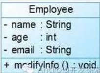

`类的方法表示方法：[访问属性] 名称 [(参数表)] [:返回类型] [[约束特征]]`
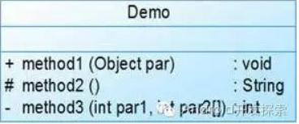

---

`类与类之间关系的表示方式`

(1)关联关系
> + 单向关联
> >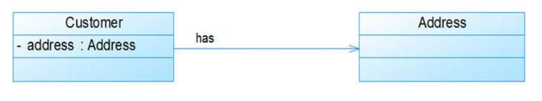
> >顾客(Customer)拥有地址(Address)，则Customer类与Address类具有单向关联关系
>
> + 多重性关联
> >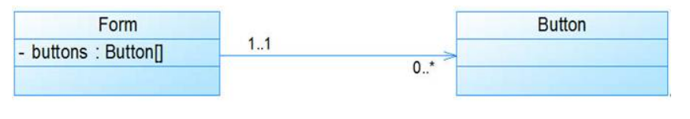
> >一个界面(Form)可以拥有零个或多个按钮(Button)，但是一个按钮只能属于一个界面
> >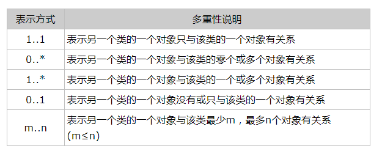
>

(2)包含关系
> + 聚集
> >聚合(Aggregation)关系表示整体与部分的关系;
> >在聚合关系中，成员对象是整体对象的一部分，但是成员对象可以脱离整体对象独立存在
> >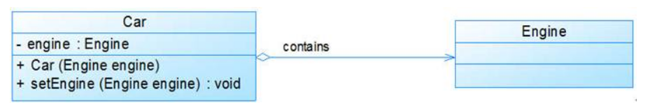
> >汽车发动机(Engine)是汽车(Car)的组成部分，但是汽车发动机可以独立存在，因此，汽车和发动机是聚合关系
>
> + 组合
> >组合(Composition)关系也表示类之间整体和部分的关系，但是在组合关系中整体对象可以控制成员对象的生命周期，一旦整体对象不存在，成员对象也将不存在
> >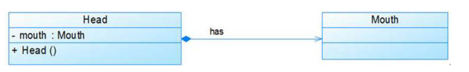
>

(3)泛化
>泛化(Generalization)关系也就是继承关系，用于描述父类与子类之间的关系
>>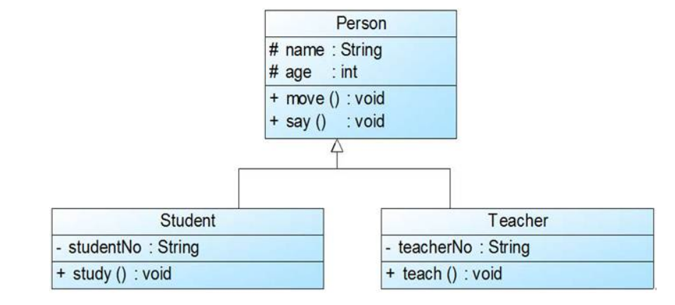
>>Student类和Teacher类都是Person类的子类，Student类和Teacher类继承了Person类的属性和方法，Person类的属性包含姓名(name)和年龄(age)，每一个Student和Teacher也都具有这两个属性，另外Student类增加了属性学号(studentNo)，Teacher类增加了属性教师编号(teacherNo)，Person类的方法包括行走move()和说话say()，Student类和Teacher类继承了这两个方法，而且Student类还新增方法study()，Teacher类还新增方法teach()

(4)注释
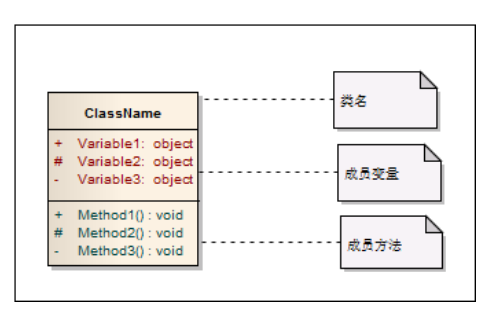

**临时对象的使用**
```cpp
cout << Line(Point(1),Point(4)).getLen <<endl;
cout << Line((Point)1,(Point)4).getLen << endl;
cout << Line(static_cast<Point>1,static_cast<Point>4) << endl;

cout << Line(1,4).getLen << endl;

explict Point(int xx = 0,yy = 0):x(xx),y(yy){}
//以此构造函数定义的类型转换只能通过显示完成，在声明处添加关键字，第四种类型转换失效
```

## 继承与派生
**继承关系**

>从新的类从已用类那里得到已有的特性
>不继承默认构造函数和析构函数

### 派生类的定义和生成过程
#### 派生类的定义

```cpp
class 派生类名:继承方式 基类1，...,继承方式 基类n
{
	/*成员声明*/
};

class Derived:public Base1,private Base2
{
	public:
		Derived();
		~Derived();
};
```
>单继承：只有一个直接基类的继承
>多继承 ：有多个基类
>派生类成员：从基类继承的成员和新增的数据和函数成员

#### 派生类的生成过程

>（1）吸收基类成员函数
>（2）改造基类成员
>>同名隐藏：若派生类声明了与基类同名的成员函数（参数类型，数量相同）或数据成员，则隐藏外层同名成员
>
>（3）添加新成员

### 派生类的构造函数和析构函数 

>派生类的构造函数只负责对新增成员的初始化，从基类继承的成员初始化有基类构造函数完成 
>####派生类构造函数
```cpp 
派生类名::派生类名(参数表):基类名1(基类1初始化参数表),...,基类名n(基类n初始化参数表),
成员对象1(成员对象参数表1),...,成员对象n(成员对象参数表n)
{
	/*派生类构造函数函数体*/
};
```
`派生类构造函数执行顺序`
>（1）调用基类的构造函数，调用顺序按他们在被继承时声明的顺序
>（2）对派生类新增成员对象初始化，调用顺序按他们在类中声明的顺序
>（3）执行派生类的构造函数体中的内容

`派生类构造函数未显式列出的基类，系统会调用他的默认构造函数`

#### 复制构造函数

>为基类 的复制构造函数传参
```cpp
/*由于类型兼容规则，可以用派生类的对象去初始化基类的引用*/
Derived::Derived(Derived &v):Base(v){}
```

#### 析构函数

>派生类的析构函数只需要负责清理新增的成员，系统会自动调用基类的析构函数

`派生类析构函数调用顺序`
>执行析构函数的函数体
>对派生类新增的成员进行清理
>对所有从基类继承来的成员清理 

```cpp
# include<iostream>

using namespace std;

class Base1
{
	public:
		Base1(int i){cout << "Constructing Base1 " << i << endl;}
		~Base1(){cout << "Destructing Base1 " << endl;}
};

class Base2
{
	public:
		Base2(int j){cout << "Constructing Base2 " << j << endl;}
		~Base2(){cout << "Destructing Base2" << endl;}
};

class Base3
{
	public:
		Base3(){cout << "Constructing Base3 * " << endl;}//声明为默认构造函数
		~Base3(){cout << "Destructing Base3 " << endl;}
};

class Derived:public Base2,public Base1,public Base3
{
	public:
		Derived(int a,int b,int c,int d):Base1(a),member2(d),member1(c),Base2(b){}
	
	private:
		Base1 member1;
		Base2 member2;
		Base3 member3;
};

int main()
{
	Derived obj(1,2,3,4);
	
	return 0;
}


/*运行结果*/
Constructing Base2 2
Constructing Base1 1
Constructing Base3 *
Constructing Base1 3
Constructing Base2 4
Constructing Base3 *
Destructing Base3
Destructing Base2
Destructing Base1
Destructing Base3
Destructing Base1
Destructing Base2
```

### 访问控制

>`系统默认的继承方式是私有继承`
>三种继承方式：public,protected,private
>####公有继承
>基类的共有成员和保护成员在派生类中的访问属性`不变`，派生类不可访问基类私有成员
>`在类族之外只能通过派生类的对象访问从基类继承的公有成员`
>`派生类的成员或对象都无法访问基类的私有成员`

#### 私有继承

>公有成员和保护成员都以私有成员身份出现在派生类中，基类私有成员不能被访问
>`类族外的派生类对象无法访问`

#### 保护继承

>基类的公有成员和保护成员以保护成员身份出现在派生类中
>派生类其他成员可访问从基类继承来的公有和保护成员，类外无法通过派生类对象访问
>`在子代与私有继承无区别，在孙子代，私有继承无法访问间接基类，保护继承可以访问简洁基类`

### 类型兼容

>`没有设置“虚”，一定会发生类型兼容`
>`在任何需要基类对象的地方，可以用共有派生类的对象来代替`
>>派生类得对象都可以隐含转换为基类对象
>>派生类对象可以初始化基类对象
>>派生类指针可以隐含转换为基类指针
>>`但继承之后，派生类只能发挥基类的功能`

`替代之后,派生类对象可以当做基类对象来使用，只能使用从基类继承来的成员`
```cpp
# include<iostream>

using namespace std;

class Base1
{
	public:
		void display()
		{
			cout << "Base1::display" <<endl;
		}
};

class Base2:public Base1
{
	public:
		void display()
		{
			cout << "Base2::display" <<endl;
		}
};

class Derived:public Base2
{
	public:
		void display()
		{
			cout << "Derived::display" <<endl;
		}
};

void fun(Base1 *ptr)
{
	ptr->display();
}

int main()
{
	Base1 base1;
	Base2 base2;
	Derived derived;

	fun(&base1);
	fun(&base2);
	fun(&derived);

	return 0;
}

/*由于类型兼容规则，派生类的dispaly函数并未隐藏基类的同名函数*/
/*运行结果*/
Base1::display
Base1::display
Base1::display
```

### 派生类的成员表示和访问
#### 作用域分辨符
`::`

>类名::成员名
>类名::成员名(参数表)

**`如果派生类中声明了与基类同名的新函数，即使参数表不同，从基类继承的同名函数的所有重载形式也会都被隐藏`**
>如果派生类的多个基类有同名成员，同时派生类又新增同名成员，派生类成员隐藏所有基类的同名成员
>>这时，通过"对象名.成员名"或“对象指针->成员名”方式唯一标识派生类成员
>
>如果子类定义的函数与基类同名，但参数表不同，不属于重载；子类将父类中的同名函数隐藏
>`调用父类的成员必须用父类名称限定`

**派生类中无与基类同名的成员**
使用 `using` 关键字澄清
```cpp
class Derived:public Base,public Base2
{
	public:
		using Base1::fun;
		using Base1::var;
};
```
>`using`将一个作用域名引入到另一个作用域中；
>将using用于基类中的函数名，派生类中定义同名但参数表不同的函数，基类中的函数不会被隐藏
```cpp
/*既可以使用无参数FUN，也可以使用带参数的FUN*/
class Derived:public Base
{
	public:
		using Base::fun;
		void fun(int i){}
};
```

**直接基类从同一间接基类继承**
>使用作用域分辨符通过直接基类限定类分别访问简介基类的同一成员
>有两份副本，可以存两份不同数据

#### 虚基类

>将共同基类设为虚基类，从不同路径继承过来的数据成员只有一个副本，同一函数名只有一个映射
>
>`虚基类关键字作用范围和继承方式关键字相同，只对紧随其后的基类起作用`
```cpp
class 派生类名:virtual 继承方式 基类名
```
```cpp
# include<iostream>

using namespace std;

class Base0
{
    public:
        int var0;
        void fun0(){cout << "Member of Base0" << endl;}
};

class Base1:virtual public Base0
{
    public:
        int var1;
        void fun0(){cout << "Member of Base1" << endl;}
};

class Base2:virtual public Base0
{
    public:
        int var2;
        void fun0(){cout << "Member of Base2" << endl;}
};

class Derived:public Base1,public Base2
{
    public:
        int var;
        void fun0(){cout << "Member of Derived" << endl;}
};

int main()
{   
    Derived d;

    d.var0 = 2;
    cout << d.var0 << endl;
    d.fun0();

    return 0;
}
/*运行结果*/
2//因为在父类，派生类中都没有同名成员，所以从虚基类中继承了唯一var0
Member of Derived//出现同名隐藏，删除父代(Base1,Base2)和派生类fun0，会消除同名隐藏的影响
```

##### 虚基类及其派生类的构造函数

>`只是保证了虚基类只有一份成员数据，并不消除类型兼容`
>`在整个继承关系中，直接或间接继承虚基类的所有派生类都必须在构造函数的成员初始化列表中列出对虚基类的初始化`
>
>`只有最远派生类的构造函数会调用虚基类的构造函数，该派生类的其他基类对虚基类构造函数的调用都自动忽略`

```cpp
#include<iostream>

using namespace std;

class Furniture
{
	public:
		Furniture(){};
		Furniture(double weight);
		void show(void);		
	protected:
		double weight;
};

Furniture::Furniture(double weight)
{
	this->weight = weight;
}
void Furniture::show()
{
	cout << "家具重量为:" << weight << endl;
}

class Sofa:virtual public Furniture
{
	public:
		Sofa(){};
		Sofa(double weight);
		void show(void);
};

Sofa::Sofa(double weight):Furniture(weight)  //派生类的构造函数应该去初始化基类的数据成员
{
	this->weight = weight;
}
void Sofa::show()
{
	cout << "沙发重量为:" << weight << endl;
}

class Bed :virtual public Furniture
{
	public:
		Bed(){};
		Bed(double weight);
		void show(void);
};

Bed::Bed(double weight):Furniture(weight)  //派生类的构造函数应该去初始化基类的数据成员
{
	this->weight = weight;
}
void Bed::show()
{
	cout << "床重量为:" << weight << endl;
}

class SofaBed:public Sofa,public Bed
{
	public:
		SofaBed(){};
		SofaBed(double weight);
		void show(void);
};

SofaBed::SofaBed(double weight) :Furniture(weight),Sofa(weight), Bed(weight)
{
	this->weight = weight;
}
void SofaBed::show()
{
	cout << "沙发床重量为：" << weight << endl;
}

//=========================================
int main()
{
	Furniture furniture(1);
	Sofa sofa(2);
	Bed bed(3);
	SofaBed sofabed(3.5);
	sofabed.show();
	
	Furniture *p;
	p = &furniture;
	p->show();
	p = &sofa;
	p->show();
	p = &bed;
	p->show();
	system("pause");
	
	return 0;
}
/*运行结果*/
沙发床重量为：3.5
家具重量为:1
家具重量为:2
家具重量为:3
请按任意键继续. . .
```

**构造一个类对象的一般顺序**
>（1）该类有直接或间接的虚基类，则先执行虚基类的构造函数
>（2）按照基类在派生类中的声明顺序执行他们的构造函数
>（3）对新增成员初始化
>（4）执行构造函数函数体

## 多态性

>面向对象多态分为:
>专用多态：
>>重载多态：普通函数和成员函数，运算符重载
>>强制多态：变元的类型变化
>
>通用多态：
>>包含多态：类族中不同类中同名函数的多态行为
>>参数多态：

>`多态的实现`
>>编译时的多态:`函数的重载`
>>运行时的多态：`虚函数机制`
>
>`绑定`：指计算机程序自身相互关联的过程；一条消息和一个对象方法相结合的过程
>>静态绑定：绑定发生在编译时期
>>动态绑定：绑定发生在程序运行期间

`运行多态`
>运行期多态的实现依赖于虚函数机制。当某个类声明了虚函数时，编译器将为该类对象安插一个虚函数表指针，并为该类设置一张唯一的虚函数表，虚函数表中存放的是该类虚函数地址。运行期间通过虚函数表指针与虚函数表去确定该类虚函数的真正实现
>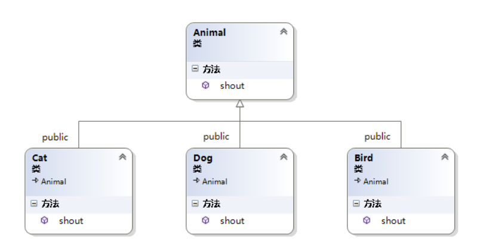
```cpp
class Animal
{
public :
    virtual void shout() = 0;
};
class Dog :public Animal
{
public:
    virtual void shout(){ cout << "汪汪！"<<endl; }
};
class Cat :public Animal
{
public:
    virtual void shout(){ cout << "喵喵~"<<endl; }
};
class Bird : public Animal
{
public:
    virtual void shout(){ cout << "叽喳!"<<endl; }
};

int main()
{
    Animal * anim1 = new Dog;
    Animal * anim2 = new Cat;
    Animal * anim3 = new Bird;
     
   //藉由指针（或引用）调用的接口，在运行期确定指针（或引用）所指对象的真正类型，调用该类型对应的接口
    anim1->shout();
    anim2->shout();
    anim3->shout();
 
    //delete 对象
    ...
   return 0;
}
```

### 运算符多态

>`实质就是函数重载`
>只能重载C++已有的运算符
>重载之后，优先级和结合性不变
>不能改变运算符操作数个数，至少有一个自定义类型
>>`不能重载的运算符`
>>类属运算符————【.】
>>成员指针运算符————【.*】
>>作用域分辨符————【::】
>>三目运算符————【?:】
```cpp
返回类型 operator 运算符(形参表)
{
	/*函数体*/
}
```

`操作数个数`
>作为成员函数比非成员函数少一个
>第一个操作数会被认为函数调用的目的对象，函数体可直接访问第一个操作数的成员

#### 运算符重载为成员函数
双目运算符左操作数就是调用对象本身的数据，由`this`指针指出；若为单目运算符，则为调用对象本身，不需要传递参数
`前置单目运算符`

```cpp
class A{}

A oprd;
U oprd;//此时U声明为A的成员函数，此时U无参数表
/*调用U oprd 相当于 oprd.operator U();*/
```
`后置单目运算符`
```cpp
class A{};

A oprd;
oprd++;
oprd--;//=>oprd.operator++(0)、oprd.operator--(0)
/*带形参为与前置单目运算符区分*/
```

`双目运算符`
```cpp
class A{};
class C{};

A oprd1;
C oprd2;
oprd1 B oprd2;//= > oprd1.operator B(oprd2);
/*B为双目运算符，重载为A的成员函数，有一个形参*/
```
```cpp
/*对双目运算符+的重载*/
# include<iostream>

using namespace std;

class Complex
{
	public:
		Complex(double r = 0.0,double i = 0.0):real(r),imag(i){}
		Complex operator+(const Complex &c2)const;
		Complex operator-(const Complex &c2)const;
		void display() const;
		
	private:
		double real,imag;
};

Complex Complex::operator+(const Complex &c2) const
{
	return Complex(real + c2.real,imag + c2.imag);
}

Complex Complex::operator-(const Complex &c2) const
{
	return Complex(real - c2.real,imag - c2.imag);
}

void Complex::display() const
{
	cout << "(" << real << "," << imag << ")" << endl;
}


int main()
{
	Complex c1(5,4),c2(2,10),c3;

	cout << "c1 = ";c1.display();
	cout << "c2 = ";c2.display();
	c3 = c1 - c2;
	cout << "c3 = c1 - c2 = ";c3.display();
	c3 = c1 + c2;
	cout << "c3 = c1 + c2 = ";c3.display();
	
	return 0;
}

/*运行结果*/
c1 = (5,4)
c2 = (2,10)
c3 = c1 - c2 = (3,-6)
c3 = c1 + c2 = (7,14)
```

```cpp
/*对单目运算符++的重载*/
# include<iostream>

using namespace std;

class Clock
{
	public:
		Clock(int hour = 0,int minute = 0,int second = 0);
		void showTime();
		Clock& operator++();//前置
		Clock operator++(int);//后置
	
	private:
		int hour,minute,second;
};

Clock::Clock(int hour,int minute,int second)
{
	if(0 < hour && hour <= 24 && 0 < minute && minute <= 60 && 0 < second && second <= 60)
	{
		this->hour = hour;
		this->minute = minute;
		this->second = second;
	}
	else
	{
		cout << "Time Error !!" << endl;
	}
}

void Clock::showTime()
{
	cout << hour << ":" << minute << ":" << second << endl;
}

Clock &Clock::operator++()
{
	second++;
	if(second >= 60)
	{
		second -= 60;
		minute++;
		if(minute >= 60)
		{
			minute -= 60;
			hour = (hour + 1) % 24;
		}
	}

	return *this;
}

Clock Clock::operator++(int)
{
	Clock old = *this;//后置++先输出在运算，所以要保留原有值
	++(*this);//调用前置++函数
	return old;
}

int main()
{
	Clock myClock(23,59,59);
	cout << "First time:";
	myClock.showTime();
	cout << "Show myTime++:";
	(myClock++).showTime();
	cout << "++Show myTime:";
	(++myClock).showTime();
	
	return 0;
}

/*运行结果*/
First time:23:59:59
Show myTime++:23:59:59
++Show myTime:0:0:1
```

#### 运算符重载为非成员函数

```cpp
# include<iostream>

using namespace std;

class Complex
{
	public:
		Complex(double r = 0.0,double i = 0.0):real(r),imag(i){}
		friend Complex operator+(const Complex &c1,const Complex &c2);
		friend Complex operator-(const Complex &c1,const Complex &c2);
		friend ostream & operator << (ostream &out,const Complex &c);
		
	private:
		double real;
		double imag;
};

Complex operator+ (const Complex &c1,const Complex &c2)
{
	return Complex(c1.real + c2.real,c1.imag + c2.imag);
}

Complex operator- (const Complex &c1,const Complex &c2)
{
	return Complex(c1.real - c2.real,c1.imag - c2.imag);
}

ostream & operator << (ostream &out,const Complex &c)
{
	out << "(" << c.real << "," << c.imag << ")";
	
	return out;
}

int main()
{
	Complex c1(5,4),c2(2,10),c3;
	
	cout << "c1 = " << c1 << endl;
	cout << "c2 = " << c2 << endl;
	c3 = c1 - c2;
	cout << "c3 = c1 - c2 = " << c3 << endl;
	c3 = c1 + c2;
	cout << "c3 = c1 + c2" << c3 << endl;
	
	return 0;
}
```

### 虚函数

>`虚函数不能是静态的成员函数，不能是构造函数`
>`通过成员函数调用或指针，引用来访问`
>满足赋值兼容
>`不声明为内联函数,需要动态绑定`
>带有形参值的函数，不能在派生类中重新定义，静态绑定
```cpp
virtual 函数名(参数表);//在函数声明时声明为虚函数
```
>确认派生类的的函数成员是否为虚函数
>
>>`满足同名，参数，返回值一致确认为虚函数，且覆盖基类中的虚函数以及同名的重载函数`
```cpp
/*在派生类中，隐式声明为虚函数，也可以在派生类中同名函数前加 virtual*/
#include<iostream>

using namespace std;

class Furniture
{
	public:
		Furniture(){};
		Furniture(double weight);
		virtual void show(void);		
	protected:
		double weight;
};

Furniture::Furniture(double weight)
{
	this->weight = weight;
}
void Furniture::show()
{
	cout << "家具重量为:" << weight << endl;
}

class Sofa:virtual public Furniture
{
	public:
		Sofa(){};
		Sofa(double weight);
		void show(void);
};

Sofa::Sofa(double weight):Furniture(weight)  //派生类的构造函数应该去初始化基类的数据成员
{
	this->weight = weight;
}
void Sofa::show()
{
	cout << "沙发重量为:" << weight << endl;
}

class Bed :virtual public Furniture
{
	public:
		Bed(){};
		Bed(double weight);
		void show(void);
};

Bed::Bed(double weight):Furniture(weight)  //派生类的构造函数应该去初始化基类的数据成员
{
	this->weight = weight;
}
void Bed::show()
{
	cout << "床重量为:" << weight << endl;
}

class SofaBed:public Sofa,public Bed
{
	public:
		SofaBed(){};
		SofaBed(double weight);
		void show(void);
};

SofaBed::SofaBed(double weight) :Furniture(weight),Sofa(weight), Bed(weight)
{
	this->weight = weight;
}
void SofaBed::show()
{
	cout << "沙发床重量为：" << weight << endl;
}

//=========================================
int main()
{
	Furniture furniture(1);
	Sofa sofa(2);
	Bed bed(3);
	SofaBed sofabed(3.5);
	sofabed.show();
	
	Furniture *p;
	p = &furniture;
	p->show();
	p = &sofa;
	p->show();
	p = &bed;
	p->show();
	system("pause");
	
	return 0;
}
/*运行结果*/
沙发床重量为：3.5
家具重量为:1
沙发重量为:2
床重量为:3
请按任意键继续. . .
```

可用`基类名::函数名()`调用基类被覆盖的函数
`基类调用虚函数时，不会调用派生类的虚函数`
```cpp
Base::Base()调用虚函数 virt(),被调用的是Base::virt()
基类被构造时，派生类还不是一个对象
析构函数类似
```

### 虚析构函数

>`不能声明虚构造函数，但能声明虚析构函数`
>如果有可能通过基类指针调用对象的析构函数，就需要让基类的析构函数为虚函数
```cpp
virtual ~类名();
```

### 纯虚函数

>声明为纯虚函数后，不再给出函数定义部分，`不能进行实例化`
>
>`如果将析构函数声明为纯虚构函数，必须给出定义`
>
>对基类纯虚函数的调用，必须`基类名::函数名(参数表)`
```cpp
virtual 函数类型 函数名(参数表) = 0;
```

### 抽象类

>带纯虚函数的类为抽象类
>`抽象类不能实例化，但可以使用指针、引用`
>派生类给出纯虚函数 的定义，不再是抽象类，可以实例化；若未给出定义，仍为抽象类
```cpp
# include<iostream>

using namespace std;

class Base1
{
	public:
		virtual void display() const = 0;
};

class Base2:public Base1
{
	public:
		void display() const;
};

void Base2::display() const
{
	cout << "Base2::display" <<endl;
}

class Derived:public Base2
{
	public:
		void display() const;
};

void Derived::display() const
{
	cout << "Derived::display" <<endl;
}

void fun(Base1 *ptr)
{
	ptr->display();
}//只能使用指针或引用，若改为对象，则有类型兼容

int main()
{
	Base2 base2;
	Derived derived;

	fun(&base2);
	fun(&derived);

	return 0;
}

/*运行结果*/
Base2::display
Derived::display
```

动态类型与非动态类型声明原则:
>如果一个函数的执行方式十分明确，则将他声明为非虚函数；如果一个类的所有函数都具有这个特点，就把这个类作为多态类型，
>如果需要其他类对其进行狗友继承，就需要设计为多态型，至少设计为虚析构函数

## 数组、指针与字符串
### 数组

>以数组名为形参传递，被调函数形参数组值改变，主调函数也发生变化
```cpp
# include<iostream>

using namespace std;

void rowsum(int a[][4],int row)
{
	for(int i = 0;i < row;++i)
		for(int j = 0;j < 4;++j)
		{
			a[i][0] += a[i][j];
		}
}

int main()
{
	int table[3][4] = {1,2,3,4,2,3,4,5,3,4,5,6};
	for(int i = 0;i < 3;++i)
	{
		for(int j = 0;j < 4;++j)
		{
			cout << table[i][j] << " ";
		}
		cout << endl;
	}
	
	rowsum(table,3);
	for(int i = 0;i < 3;++i)
	cout << "sum of row" << i << " is " << table[i][0] << endl;
		
	return 0;
}
/*运行结果*/
1 2 3 4
2 3 4 5
3 4 5 6
sum of row0 is 11
sum of row1 is 16
sum of row2 is 21
```

#### 对象数组

>`类名 数组名[常量表达式]`
>
>`数组名[下标].成员名`访问对象成员
>
>初始化就是调用成员的构造函数，没有指定初始值，调用默认构造函数
```cpp
Location a[2] = {Location(1,2)};//a[1]调用默认构造函数
```
### 指针
#### **常量指针**

>`不能通过指针改变所指对象的值`
>1、如果一个变量已被声明为常变量，只能用指向常变量的指针变量指向它，而不能用一般的（指向非const型变量的）指针变量指向它。

>2、指向常变量的指针变量除了可以指向常变量外，还可以指向未被声明为const的变量。此时不能通过此指针变量改变该变量的值

>3、如果函数的形参是指向非const型变量的指针，实参只能用指向非const变量的指针，而不能用指向const变量的指针
```cpp
int a;
const int *p = &a;
int b;
p = &b;//正确
*p = 1;//错误
```

#### **指针常量**

>指针本身的值不能被改变
```cpp
int * const p2 = &a;
p2 = &b;//错误，p2为指针常量，不能修改值
```

**指针的关系运算**
>`0专用于表示 空指针，NULL`
>
>`定义指针未初始化时一定要赋NULL`
>
>指针的加减运算适合数组运算

#### **指针数组**

>相当于多维数组降一维
```cpp
/*一维数组*/
int line1[] = {1,0,0};
int line1[] = {0,1,0};
int line1[] = {0,0,1};

int *pLine[3] = {line1,line2,line3};

pLine[i][j] //==>*(pLine[i] + j)//=>*(*(Lines + i) + j)
```
```cpp
int array[3][3] = {{11,12,13},{21,22,23},{31,32,33}};
array[i][j] //=> *(*(array + i) + j)
```

**指针型函数 **
>使用指针型函数将大量数返回主调函数
```cpp
数据类型 *函数名(形参表)
{
	/*函数体*/
}
```

#### **指向函数的指针**

>类型名，形参数，形参类型相同使用函数指针
```cpp
数据类型 (*函数指针名)(形参表)

/*使用typedef简化函数指针名*/
typedef int (*DoubleIntFunction)(double);//声明DoubleIntFunction为“形参为double，返回类型是int的函数的指针”类型的别名
DoubleIntFunction pfun;//声明为该类型的函数指针
```
```cpp
void printStuff(float)
{
	cout << "This is the print Stuff function" << endl;
}

void printMessage(float data)
{
	cout << "This is the print Message function" << data << endl;
}

void printFloat(float data)
{
	cout << "This is the print Float function" << data << endl;
}

void (*functionPointer)(float);
functionPointer = &printFloat;
printPointer(PI);
functionPointer = &printMessaage;
printPointer(PI);
```

#### 对象指针

```cpp
类名 *对象指针名;
对象指针名->成员名;//=>(*对象指针名).成员名
```
#### this指针

>用于指向正在被成员函数操作的对象
```cpp
return x;//=>return this->x;
```

#### 指向类的非静态成员的指针

```cpp
类型说明符 类名::*指针名;//声明语句
指针名 = &类名::数据成员名;//不能对类的私有数据成员取地址,赋值，由于未实例化，并不能访问数据
对象名.*类成员指针名;//实例化，通过类来访问数据
对象名->*类成员指针;

类型说明符 (类名::*指针名)(参数表)
指针名 = &类名::函数成员名;	
(对象名.*类成员指针名)(参数表);
(对象名->*类成员指针名)(参数表);
```
```cpp
int main()
{
	Point(4,5);
	Point *p1 = &a;
	int (Point::*funnptr)()const = &Point::getX();

	cout << (a.*funptr)() << endl;
	cout << (p1->funptr)() << endl;
	
	return ;
}
```

#### 指向类的静态成员的指针

>对静态成员的访问不依赖于对象
```cpp
类型说明符 类名::*指针名;//声明语句
指针名 = &类名::数据成员名;//不能对类的私有数据成员取地址,赋值，由于未实例化，并不能访问数据

类型说明符 (类名::*指针名)(参数表);	
指针名 = &类名::函数成员名;	
```

### 动态分配内存
#### 建立，删除堆对象:new,delete

```cpp
new 数据类型(初始化参数列表);//申请成功，返回首地址
int *point;
point = new int(2);//*point = 2;
point = new int();//*point = 0;
point = new int;//不初始化
```
声明对象内存空间时
若定义默认构造函数，new T 和 new T();相同
为定义，对该函数的基本数据类型和指针类型成员都会被以0赋值

```cpp
delete 指针名;//一块内存空间使用一次delete
```

#### 创建、删除数组类型对象

```cpp
new 类型 [数组长度];
delete[] 数组名//加方括号区分普通类型

/*多维数组的申请*/
float (*)p[25][10];//指针数组
p = new float[10][25][10]
```

```cpp
/*动态数组类*/
class ArrayOfPoints
{
	public:
		ArrayOfPoints(int size):size(size)
		{
			points = new Point[size];
		}
		~ArrayOfPoints(){delete[] Points;}
		Point &element(int index)
		{
			assert(index >= 0 && index < size);//在编译模式下起作用，表达式true，继续执行；false，程序终止
			return Points[index];
		}
	private:
		Point *points;
		int size;
}
```

#### 用vector创建数组对象

```cpp
vector<元素类型>数组对象名(数组长度,元素初值)//只能指定相同初值
数组对象名[下标表达式]
```
`vector创建数组对象，并不是数组，数组名不代表数组首地址`
`所有元素都会被初始化，只能初始化为相同初值`
>基本数据类型为0
>类类型，调用默认构造函数

```cpp
# include<iostream>
# include<vector>

using namespace std;

double average(const vector<double>&arr)//引用arr 数组
{
	double sum = 0.0;
	
	for(int i = 0;i < arr.size();++i)
	{
		sum += arr[i];
	}

	return sum / arr.size();
}

int main()
{
	int n;
	cin >> n;

	vector<double>arr(n);
	for(int i = 0;i < n;++i)
	cin >> arr[i];

	cout << "Average is:" << average(arr) << endl;
	
	return 0;
}
```

#### 深复制与浅复制
使用默认构造函数，实现浅复制，复制前后使用同一块内存空间,在程序结束时，此空间被释放两次，出现错误
深复制申请一块新的内存存储数据

```cpp
# include<iostream>
# include<cassert>

using namespace std;

class Point
{
	public:
		Point():x(0),y(0){cout << "Default Constructor called" << endl;}
		Point(int xx,int yy):x(xx),y(yy){cout << "Constructor called" << endl;}
		int getX(){return x;}
		int getY(){return y;}
		~Point(){cout << "Destructor called" << endl;}
		void move(int newX,int newY)
		{
			x = newX;
			y = newY;
		}
		
	private:
		int x,y;
};

class ArrayOfPoints
{
	public:
		ArrayOfPoints(int size):size(size)
		{
			points = new Point[size];
		}
		ArrayOfPoints(const ArrayOfPoints &v);
		~ArrayOfPoints(){delete[] points;}
		Point &element(int index)
		{
			assert(index >= 0 && index < size);//在编译模式下起作用，表达式true，继续执行；false，程序终止
			return points[index];
		}
	private:
		Point *points;
		int size;
};

ArrayOfPoints::ArrayOfPoints(const ArrayOfPoints &v)
{
	size = v.size;
	points = new Point[size];
	for(int i = 0;i < size;++i)
	{
		points[i] = v.points[i];
	}
}

int main()
{
	int count;

	cin >> count;
	ArrayOfPoints pointsArray1(count);
	pointsArray1.element(0).move(5,10);
	pointsArray1.element(1).move(15,20);
	
	ArrayOfPoints pointsArray2 = pointsArray1;

	cout << "Copy of pointsArray1:" << endl;
	cout << "Point_0 of arrary2:" << pointsArray2.element(0).getX() << "," 
	<< pointsArray2.element(0).getY()  << endl;
	cout << "Point_1 of arrary2:" << pointsArray2.element(1).getX() << "," 
	<< pointsArray2.element(1).getY()  << endl;

	pointsArray1.element(0).move(25,30);
	pointsArray1.element(1).move(35,40);
	cout << "After the moving of pointsArray1:" << endl;
	cout << "Point_0 of arrary2:" << pointsArray2.element(0).getX() << "," 
	<< pointsArray2.element(0).getY()  << endl;
	cout << "Point_1 of arrary2:" << pointsArray2.element(1).getX() << "," 
	<< pointsArray2.element(1).getY()  << endl;
	
	return 0;
}

/*DEV运行结果*/
2
Default Constructor called
Default Constructor called
Default Constructor called
Default Constructor called
Copy of pointsArray1:
Point_0 of arrary2:5,10
Point_1 of arrary2:15,20
After the moving of pointsArray1:
Point_0 of arrary2:5,10
Point_1 of arrary2:15,20
Destructor called
Destructor called
Destructor called
Destructor called
```

### 字符串
#### string类
`类的构造函数原型`

```cpp
string();//默认构造函数，建立长度为0的字符串
string(const string &rhs);//复制构造函数
string(const char *s);//用指针s所指向的字符串常量初始化string类的对象
string(const string &rhs,unsigned int pos,unsiged int n);//从rhs的第pos个位置开始取n个字符，用来初始化string类的对象
string(const char *s,unsigned int n);//用指针s所指向的前n个字符初始化
string(unsigned int n,char c);//用c重复n次初始化
```
`string类操作符`
运算符
>+,=,+=

关系运算
>==,!=,<,>,>=,<=

s[i] ------------------------访问下标为i的元素

`常用成员函数`
```cpp
string append(const char *s);//将s追加在尾
string assign(const char*s);//赋值
int compare(const string &str)const;//比较本串与str的大小

string &insert(unsigned int p0,const char *s);//将s指向的字符串插入在本串中p0位置
string substr(unsigned int pos,unsigned int n) const;
//取本串中pos开始的n个字符，返回新串

void swap(string &str);//与str字符串交换
unsigned int find(const basic_string &str) const;//查找并返回str在本串中第一次出现的位置
unsigned int length() const;//返回串的长度
```

`getline(cin,串名,分隔符)`
>输入字符串，至行末，不以空格为分隔符，以分隔符为终止符

## 数据的共享与保护

### 标识符的作用域和可见性

>作用域讨论的是标识符的有效范围，可见性讨论的是标识符是否可被使用
>

(一)作用域
> + 函数原型作用域：函数声明时形参的作用范围就是函数原型的作用域
> + 局部作用域：函数形参列表中形参的作用域，从形参列表中声明处开始，到整个函数体结束之处为止
> >函数声明的变量，从声明处开始，一直到声明所在的块结束的大括号为止
>
> + 类的作用域：
> > + 在成员函数中没有声明同名标识符，在该函数中可直接访问
> > + 通过类访问对象成员的方法访问 x.m  x::m
> > + 通过 ptr->m 指向类的指针
>
> + 命名空间的作用域
> >命名空间：凡是在该命名空间之内声明的、不属于前面所述的各个作用域的标识符，都属于该命名空间作用域
> ```cpp
> using 命名空间::标识符名;//指定标识符暴露在当前作用域中
> using namespace 命名空间名;//使该命名空间中的所有标识符暴露在当前作用域中
> ```
> >匿名命名空间：需要显示声明的
> >`在匿名空间中声明的变量和函数，都不会暴露在其他编译单元`
```cpp
namespace
{
	int n;
	void f()
	{
		n++;
	}
}
```

（二）可见性
>程序运行到某一点，能够引用的标识符
>>标识符声明在前，引用在后
>>在同一作用域中，不能声明同名的标识符
>>两个或多个具有包含关系的作用域中声明了同名标识符，外层标识符在内层不可见
>>`局部作用域 > 类作用域 > 命名空间作用域`
>

### 对象的生存期
#### 静态生存期

>对象的生存期与程序的生存期相同，则有静态生存期
>
>加`static`使局部变量具有动态生存期
>
>当一个函数返回后，下次调用时，该变量还会保持上一变量的值
>
>`默认初始值为0`
>

#### 类的静态成员

>静态成员是解决同一类的不同对象之间数据和函数的共享问题
>
>+ `类属性`
>>静态成员在每个类中只有一个副本，由本类的所有对象共同维护
>>可通过“ `类名::标识符`”访问
>>`类的静态数据成员在类外定义和初始化，需要专门为其分配内存空间`
```cpp
class Point
{
	private:
		int x,y;
		static int count;
		
	public:
		Point(int x = 0,int y):x(x),y(y){count++;}
		Point(Point &p):x(p.x),y(p.y){count++;}
		static void showCount()
		{
			cout << "count:" << count <<endl;
		}
		~Point(){count--;}
}

int Point::count = 0;

int main()
{
	Point a(1,0);
	Point::showCount();
}
```

---

>+ `静态函数成员`
>>静态函数成员可以直接访问该类的静态数据成员和函数成员，对非静态数据成员和函数成员的访问需要通过对象
>>在函数前加声明`static`，
>>`可通过类名和对象名访问，为区分，使用类名调用`
```cpp
class Point
{
	private:
		int x,y;
		static int count;
		
	public:
		Point(int x = 0,int y):x(x),y(y){count++;}
		Point(Point &p):x(p.x),y(p.y){count++;}
}

int Point::count = 0;
```

#### 动态生存期

>局部生存期诞生于声明开始，结束于声明所在的块执行完成之时
```cpp
# include<iostream>

using namespace std;

int i = 1;//全局变量，具有静态生存周期

void other()
{
	static int a = 2;//a,b静态局部变量，局部可见，全局寿命
	static int b;
	int c = 10;//c为局部变量，动态生存周期，局部可见
	
	a += 2;
	i += 32;
	c += 5;
	
	cout << "---OTHER---" << endl;
	cout << "i:" << i << " a:" << a << " b:" << b << " c:" << c << endl;
}

int main()
{
	static int a;//a是静态局部变量，局部可见，具有全局寿命
	int b = -10;
	int c = 0;//b,c是局部变量，局部可见，动态生存周期

	cout << "---MAIN1---" << endl;
	cout << "i:" << i << " a:" << a << " b:" << b << " c:" << c << endl;
	/*运行结果
	 *---MAIN1---
	 *i:1 a:0 b:-10 c:0
	 */
	 
	c += 8;
	other();
	/*运行结果
	 *---OTHER---
	 *i:33 a:4 b:0 c:15
	 */
	 
	cout << "---MAIN2---" << endl;
	cout << "i:" << i << " a:" << a << " b:" << b << " c:" << c << endl;
	/*运行结果
	 *---MAIN2---
	 *i:33 a:0 b:-10 c:8
	 */
	 
	 i += 10;
	 other();
	 /*运行结果
	 *---MAIN1---
	 *i:75 a:6 b:4 c:15
	 */

	return 0;
}
```

### 类的友元

>友元关系提供了不同类或对象的成员函数之间、类的成员函数与一般函数之间进行数据共享的机制

#### 友元函数

>类中用“friend”关键字修饰的非成员函数
>在类外可以通过对象名访问类的私有和保护成员
```cpp
class Point
{
	private:
		int x,y;
		
	public:
		Point(int x = 0,int y):x(x),y(y){}
		Point(Point &p):x(p.x),y(p.y){}
		int getX(){return x;}
		int getY(){return y;}
		friend float dist(Point &p1,Point &p2);
}；

float dist(Point &p1,Point &p2)
{
	double x = p1.x - p2.x;
	double y = p1.y - p2.y;
	
	return static_cast<double>(sqtr(x * x + y * y));
}
```

#### 友元类

>若A类为B类的友元类，则A类中的所有成员函数都是B的友元函数，都可以访问B类的私有和保护成员
>
>+ `友元关系不能传递`
>+ `友元关系是单向的`
>+ `友元关系不能被继承`

### 共享数据的保护

>常成员函数可以引用const数据成员，也可以引用非const的数据成员；
>const数据成员可以被const成员函数引用，也可以被非const的成员函数引用；
>常成员函数不能调用另一个非const成员函数。
>`记住定义为const后，其值不能改变即可。对于常对象、常成员函数，肯定也不能调用能改变其他值的函数`
>####常对象
>常对象必须被初始化，不能被更新
>
>`常量对象只能调用类的常量成员函数,不能调用非静态成员函数`
```cpp
class A
{
	/*类声明*/
}

A const a(3,4);
const A a(3,4);//也正确
```

#### 常对象成员
**常成员函数**

`类型说明符 函数名(参数表)const;`
>+ const是函数类型的组成部分，在定义时候也要带const
>+ const可用于重载函数的区分
>>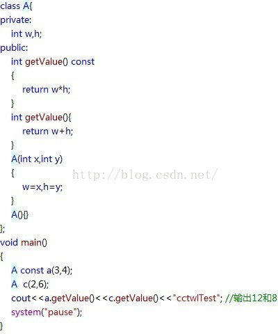
>+ 常成员函数可以访问常对象中的数据成员，常成员函数不能修改目的对象的数据成员的值
>>例外：用`mutable`修饰的数据成员可以被常成员函数修改
>>被mutable修饰的常成员对象在任何时候都不会被视为常对象
>>```cpp
>>#include<iostream>
>>using namespace std;
>>class Student
>>{
>>    public:
>>         Student(int n,float s):num(n),score(s){}
>>         void change(int n,float s) const{num=n;score=s;}
>>         void display() const{cout<<num<<"\t"<<score<<endl;}
>>   private:
>>         mutable int num;
>>         mutable float score;
>>} ;
>>
>>int main()
>>{
>>       Student const stud(101,78.5);
>>        stud.display();
>>        stud.change(101,80.5);
>>        stud.display();
>>          
>>        return 0;
>>} 
>>/*运行结果*/
>>101 78.5
>>101 80.5
>>```

```cpp
class R
{
	void printf() const;
}

void R::printf() const{}
```

**常数据成员**
>`常数据成员只能通过构造函数赋值`
>类成员的常量和静态变量都应在类外定义
>`每个构造函数都要初始化常数据成员`
>>特例：类的静态常量如果是整型或枚举，则可以直接在类中定义
>>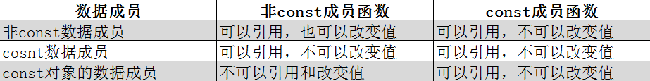
>>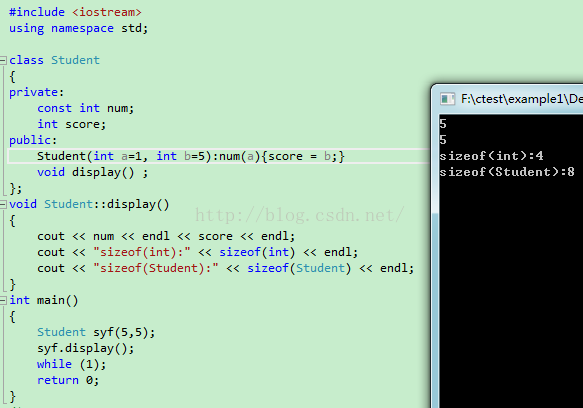

```cpp
class A
{
	public:
		A(int i);
	private:
		const int a;
		static b;
}；
const int A::b = 10;

A::A(int i):a(i){}
```

**常引用**
>常引用被引用的对象不能被更新
>`const 类型说明符 &引用名`
>一个常引用，无论是绑定普通对象还常对象，通过该应用访问该对象时都将该对象看做常对象
>对于 基本数据类型的常引用，不能修改值；对类类型的常引用,不能修改类的数据成员，也不能调用其非const的成员函数

### 多文件结构和编译预处理指令
#### C++程序的一般组织结构

>+ `类定义文件`[.h]
>+ `类实现文件`[.cpp]
>+ `类的使用文件`[.cpp]
>`决定一个生命放在源文件还是头文件的原则：`
>>将需要分配内存的函数定义放在源文件中；不需要内存空间的放在头文件
>>特殊的，将内联函数放在 头文件【使多个源文件可见】
>
>自定义文件""；库函数<>；

####  外部变量和外部函数
##### 外部变量

>外部变量是多个源文件可见的全局变量
```cpp
//源文件1
int i = 3;//定义性声明
void next();

int main()
{
	i++;
	next();

	return 0;
}

void next()
{
	i++;
	other();
}

//源文件2
extern int i;//声明一个在其他文件中定义的外部变量；引用性声明
void other()
{
	i++;
}
```
>`定义性声明和引用性声明`
>在声明的同时定义的外部变量为定义性声明
>在命名空间作用域中不适用`extern`声明的变量，都是定义性声明；
>用`extern`声明，同时指定了初值，是定义性声明，否则是引用性声明

##### 外部函数

>所有在类外声明的非成员函数，都具有全局命名空间作用域，只要在调用前进行引用性声明即可
>
>加不加`extern`效果一样

####标准C++库

>输入输出类
>容器类和ADT（抽象数据类型）
>存储管理类
>算法
>错误处理
>运行环境支持

####编译预处理
##### #include指令
>将另一个源文件嵌入到当前源文件中该点
>
>`# include<文件名>`
>>文件位于系统目录下的include子目录中
>
>`# include"`
>>先在当前目录搜索，如没有 ，再按标准搜索
>

##### #definne和# undef
>"# undef" 的作用是删除由 #define 定义的宏，使之不再起作用

##### 条件编译指令

```cpp
（1）形式一
# if 常量表达式
	程序段
# endif

（2）形式二
# if 常量表达式
	程序段1
# else 
	程序段2
#endif

（3）形式三
# if 常量表达式1
 程序段1
# elif 常量表达式2
	程序段2
...
# else
	程序段n
# endif

（4）形式四
# ifdef 标识符 //# ifndef 标识符
	程序段1
# else
	程序段2
# endif
```

##### defined 操作符

```cpp
# ifndef MYHEAD_H
# define MYHEAD_H
...
# endif

/*等价于*/
# if!defined(MYHEAD_H)
# define MYHEAD_H
...
# endif
```

---

```cpp
//main.cpp
# include"file1.h"
# include"file2.h"

int main()
{}

//file1.h
# include"head.h"
...

//file2.h
# include"head.h"
...

//head.h
# ifndef HEAD_H//避免重复定义Point类
# define HEAD_H
class Point
{
	...
};
```

## 流类库与输入输出
### I/O流类 

>流是一种抽象，负责建立数据之间的联系，并操作数据的流动
>程序将流对象看做文件对象对象的化身
>数据从一个地方传输到另一个地方都是流操作
>提取:读操作；插入：写操作
>|     类名      |                   说明                    | 包含文件 |
>| :-----------: | :---------------------------------------: | :------: |
>|  抽象流基类   |                                           |          |
>|      ios      |                  流基类                   |   ios    |
>|   输入流类    |                                           |          |
>|    istream    |     通用输入流类和其他输入流类的基类      | istream  |
>|   ifstream    |               文件输入流类                | fstream  |
>| istringstream |              字符串输入流类               | sstream  |
>|   输出流类    |                                           |          |
>|    ostream    |     通用输出流类和其他输出流类的基类      | ostream  |
>|   ofstream    |               文件输出流类                | fstream  |
>| ostringstream |              字符串输入流类               | sstream  |
>| 输入输出流类  |                                           |          |
>|   iostream    | t通用输入流输出类和其他输入输出流类的基类 | istream  |
>|    fstream    |             文件输入输出流类              | fstream  |
>| stringstream  |            字符串输入输出流类             | sstream  |
>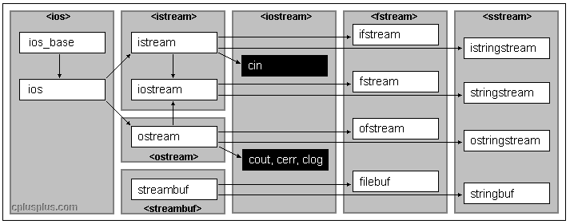

### 使用插入运算符和操纵符

>很多操纵符在`ios_base`和`iomanip`头文件都有定义，使用时包含`<iostream><iomanip>`头文件即可

**1.输出宽度 **
>使用`setw`或调用`width`成员函数，`对紧随 其后的一个域产生影响`
```cpp
# include<iostream>
# include<iomanip>

using namespace std;

int main()
{
	cout.width()//=>cout<<setw()
	cout.fill('')//设置填充字符
}
```

**2.对齐方式**
>默认为右对齐
>`setiosflags`
```cpp
# include<iostream>
# include<iomanip>

cout << setiosflags(ios_base::left) << <<resetiosflags(ios_base::left);
//setiosflags的影响是持久的，直到遇到resetiosflags
//需要使用iostream基类的类，需要作用域分辨符::
//setiosflags的其他成员可以由 “|” 自由组合
```
|         参数         |                       说明                       |
| :------------------: | :----------------------------------------------: |
|   ios_base::skipws   |                     跳过空白                     |
|  ios_base::internal  | 在规定宽度，指定填充字符后，在数值前添加填充字符 |
|    ios_base::left    |                    设置左对齐                    |
|   ios_base::right    |                    设置右对齐                    |
|    ios_base::dec     |                      十进制                      |
|    ios_base::oct     |                      八进制                      |
|    ios_base::hex     |                     十六进制                     |
| ios_base::uppercase  |                十六进制的字母大写                |
|  ios_base::showbase  |             插入前缀符号表示整数数制             |
| ios_base::showpoint  |             浮点数显示小数点和末尾0              |
|  ios_base::showpos   |                    显示正负号                    |
| ios_base::scientific |              科学计数格式显示浮点数              |
|   ios_base::fixed    |              定点格式显示浮点数的值              |

**3.精度**
```cpp
int i = 3466.9768;//默认显示为34666.98
cout << setprecision(6) << i << endl;//计数有小数点3466.976800
cout << setiosflags(ios_base::fixed);//定点标记，输出小数点后一位
cout << setiosflags(ios_base::scientific);//科学计数法
cout << resetiosflags(ios_base::fixed);
cout << resetiosflags(ios_base::scientific);
```

### 输出流

>输出到流对象
>三个输出流：
>ostream：向标准设备输出
>cout：标准输出流
>cerr：不经过缓冲区直接向显示器输出有关信息
>clog：先把信息放在缓冲区，缓冲区满后或遇上endl时向显示器输出

ofstream：支持磁盘文件输出
ostringstream

#### 构造文件输出流对象
（1）使用默认构造函数，然后调用open成员函数

```cpp
ofstream myfile;
mfile.open("filename");
```
（2）调用构造函数时初始化
```cpp
ofstream myFile("fliename");
```
（3）同一个流可以打开不同文件
```cpp
ofstream file;
file.open("File1");
...
file.close();
file.open("File2");
...
file.close();
```

#### 文件输出流成员函数
**输出流open（）函数**

```cpp
ofstream flie("filename",ios_base::out|ios_base::binary);
```
|       标志       |                             功能                             |
| :--------------: | :----------------------------------------------------------: |
|  ios_base::app   |                  打开输出文件在末尾添加数据                  |
|  ios_base::ate   |                   打开现存文件并查找到结尾                   |
|   ios_base::in   |                       打开一个输入文件                       |
|  ios_base::out   |                 打开一个输出文件,默认此模式                  |
| ios_base::trunc  | 打开文件并格式化；若制定了ios_base::out并为指出ios_base::ate,ios_base::app,ios_base::in，则默认此模式 |
| ios_base::binary |                      以 二进制打开文件                       |

**输出流close()函数**
>关闭与一个文件输出流关联的文件

**put函数**
精确输出
```cpp
cout.put('A');
cout << 'A';
```

**write函数**
>将一个内存中的一块内容写到文件输出流中，长度为参数指出；
>`遇空格不停止`
```cpp
# include<fstream>

using namespace std;

struct Data
{
	char month,day,year;//会出现乱码
};

int main()
{
	Data dt = {'6','10','92'};
	ofstream file("data.doc",ios_base::binary);
	
	file.write(reinterpret_cast<char*>(&dt),sizeof(dt));//使用指针转换，不保证全部内容都输出到文件中
	file.close();
	
	return 0;
}
```

**错误处理函数**
| 函数 |                  功能及返回值                  |
| :--: | :--------------------------------------------: |
| bad  |         出现不可恢复的错误，返回非0值          |
| fail | 出现不可恢复 的错误或者一个预期条件，返回非0值 |
| eof  |              遇文件尾，返回 非0值              |

**二进制输出文件**
>使用二进制模式，所写的字符是不转换的
```cpp
#include <fstream>
#include <iostream>
using namespace std;
 
int main ()
{
    
   char data[100];
 
   // 以写模式打开文件
   ofstream outfile;
   outfile.open("afile.dat",ios_base::binary);
 
   cout << "Writing to the file" << endl;
   cout << "Enter your name: "; 
   cin.getline(data, 100);
 
   // 向文件写入用户输入的数据
   outfile << data << endl;
 
   cout << "Enter your age: "; 
   cin >> data;
   cin.ignore();
   
   // 再次向文件写入用户输入的数据
   outfile << data << endl;
 
   // 关闭打开的文件
   outfile.close();
 
   // 以读模式打开文件
   ifstream infile; 
   infile.open("afile.dat"); 
 
   cout << "Reading from the file" << endl; 
   infile >> data; 
 
   // 在屏幕上写入数据
   cout << data << endl;
   
   // 再次从文件读取数据，并显示它
   infile >> data; 
   cout << data << endl; 
 
   // 关闭打开的文件
   infile.close();
 
   return 0;
}
```
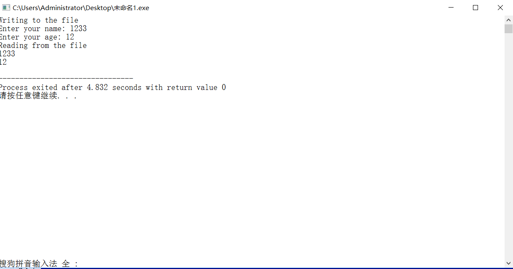
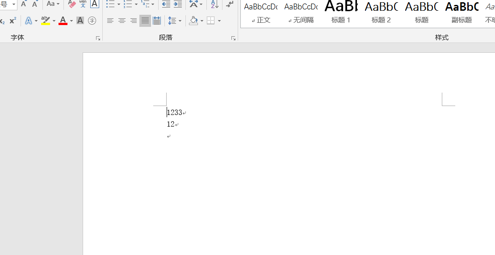

**字符串输出流**
>ostringstream表示一个字符串输出流

```cpp
/*有一个形参的构造函数，表示打开方式*/
/*两个形参，第一个表示用这个字符串内容初始化，第二个形参表示打开方式*/

#include<iostream>
#include <sstream> 
using namespace std;
int main()
{
	string test = "-123 9.87 welcome to, 989, test!";
	istringstream iss;//istringstream提供读 string 的功能
	iss.str(test);//将 string 类型的 test 复制给 iss，返回 string对象
	string s;
	cout << "按照空格读取字符串:" << endl;
	while (iss >> s){
		cout << s << endl;//按空格读取string
	}
	cout << "*********************" << endl;
 
	istringstream strm(test); 
	//创建存储 test 的副本的 stringstream 对象
	int i;
	float f;
	char c;
	char buff[1024];
 
	strm >> i;
	cout <<"读取int类型："<< i << endl;
	strm >> f;
	cout <<"读取float类型："<<f << endl;
	strm >> c;
	cout <<"读取char类型："<< c << endl;
	strm >> buff;
	cout <<"读取buffer类型："<< buff << endl;
	strm.ignore(100, ',');
	int j;
	strm >> j;
	cout <<"忽略‘，’读取int类型："<< j << endl;
 
	system("pause");
	return 0;
}
```

### 输入流

>从流中输入
```cpp
ifstream myFile;
myFile("filename");

ifstream myFile("filename");
```

**>>**
>以空白符为分隔

#### 输入流相关函数
**get()**

>单个读入，包含空白符
```cpp
# include<iostream>

using namespace std;

int main()
{
	char ch;

	while((ch = cin.get()) != EOF)
	{
		cout.put(ch);
	}
		
	return 0;
}
```

**getline()**
getline(输入流,char *s,char ch);
>读取至分隔符，读取完后删除分隔符
```cpp
# include<iostream>

using namespace std;

int main()
{
	string line;
	char t;

	cin >> t;
	getline(cin,line,t);
	cout << line << endl;
		
	return 0;
}
```

**open()**
|       格式       | 功能             |
| :--------------: | :--------------- |
|   ios_base::in   | 打开文件用于输入 |
| ios_base::binary | 以二进制文件打开 |

**close()**
>关闭输入文件

**read()**
>从文件中读字节到指定存储器；给出长度，遇文件结束或在文本模式遇到结束标识符，读入结束
```cpp
# include<iostream>
# include<fstream>
# include<cstring>

using namespace std;

struct SalaryInfo
{
	char id[10];
	char salary[10];
};

int main()
{
	SalaryInfo employee1 = {'60001','8000'};
	ofstream os("Payroll.txt",ios_base::out|ios_base::binary);
	os.write(reinterpret_cast<char *>(& employee1),sizeof(employee1));
	os.close();	
	
	ifstream is("Payroll.txt",ios_base::in|ios_base::binary);
	if(is)
	{
		SalaryInfo employee2;
		is.read(reinterpret_cast<char *>(& employee2),sizeof(employee2));
		cout << employee2.id << " " << employee2.salary << endl;
	}
	else
	{
		cout << "Error" << endl; 
	}
	is.close();
	
	return 0;
}
```

**字符串输出流**
>字符串转换为数值

```cpp
# include<iostream>
# include<sstream>
# include<string>

using namespace std;

template<class T>//函数模板，出现<内容>的地方都用T代替 
inline T fromString(const string &str)
{
	istringstream is(str);
	T v;
	is >> v;

	return v;
}

int main()
{
	int v1 = fromString<int>("5");
	cout << v1 << endl;

	double v2 = fromString<double>("1.2");
	cout << v2 << endl;
	
	return 0;	
}
```

```cpp
/*数值转字符串*/
# include<iostream>
# include<sstream>
# include<string>

using namespace std;

template<class T>
inline string toString(const T &v)
{
	ostringstream os;
	os << v;

	return os.str();
}

int main()
{
	string str1 = toString(5);
	cout << str1 << endl;
	string str2 = toString(1.2);
	cout << str2 << endl;
	
	return 0;
}
```

**seekg,tellg**
>在文件输入流中，保留着一个指向文件中下一个将读入数据的位置的内部指针，用`seekg`设置指针
```cpp
# include<iostream>
# include<fstream>

using namespace std;

int main()
{
	int values[] = {3,7,0,5,4};
	ofstream os("integers",ios_base::out|ios_base::binary);
	os.write(reinterpret_cast<char* >(values),sizeof(values));
	os.close();
	
	ifstream is("integers",ios_base::in|ios_base::binary);
	if(is)
	{
		is.seekg(3*sizeof(int));
		int v;
		is.read(reinterpret_cast<char*>(&v),sizeof(int));
		cout << "4th is:" << v << endl;
 	}
	
	return 0;
}
/*5*/
```