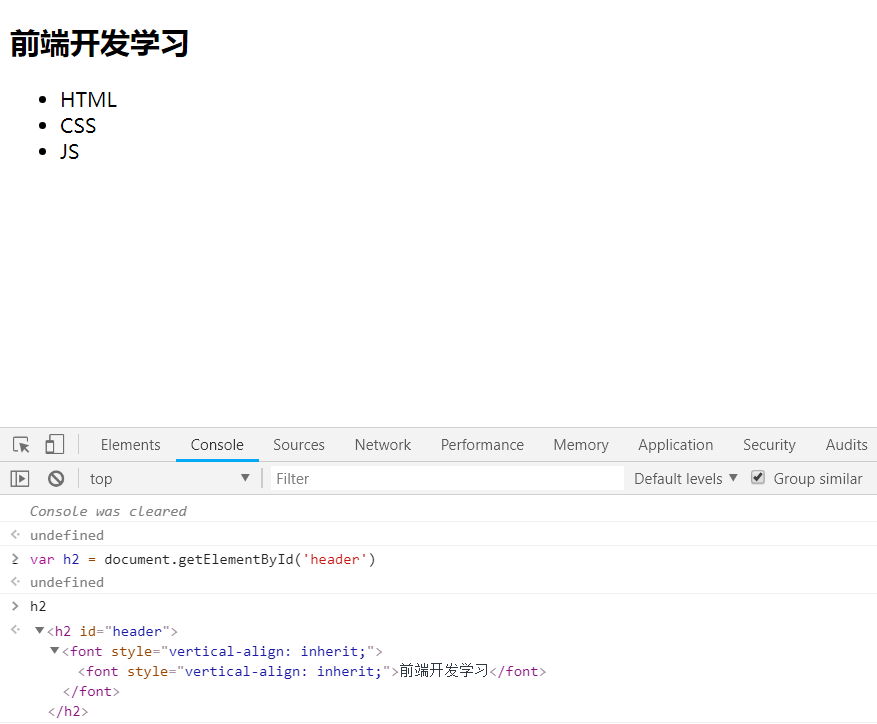
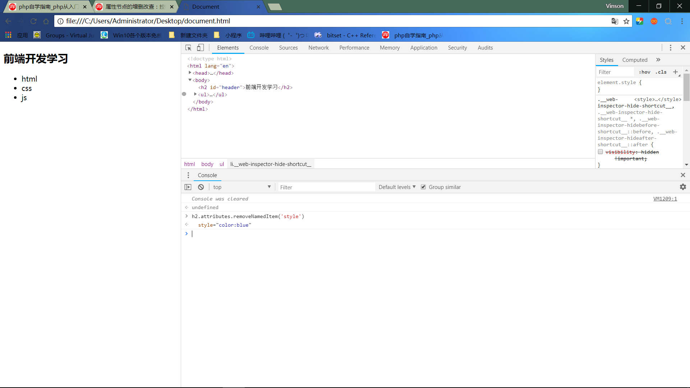

# JavaScript
@(Knowledge)[Auspice Tian][2021年1月24日20:56:56]

> ECMAScript(ES)：规定JS的核心知识（变量，数据类型，语法规范，操作语句）
> DOM：【document object model文档对象模型】 提供属性和方法，操作页面
> BOM：【browser object model浏览器对象模型】 提供属性和方法，操作浏览器

---

[TOC]

<div style="page-break-after:always"></div>

## <一>浏览器内核

### 常用浏览器
>- *谷歌浏览器： **Webkit** 内核（V8引擎） *
- *火狐浏览器：**Gecko** 内核*
- *欧朋浏览器：**Presto** 内核*
- *IE浏览器：**Trident** 内核*

###浏览器
>按照W3C规识别开发者编写的代码，并在页面中绘制开发者预想的页面和效果（GPU：显卡）
>这部分功能由 **浏览器内核** (或称为 **渲染引擎** )完成

------------------------------------------------

<div style="page-break-after:always"></div>

## <二>JS中的输出

### 1.弹框
>**1.alert**
>使用alert弹出时会调用 *toString* 方法（将内容转换为字符串形式，加上“”）
>
>- *alert(1 + 1)  => 输出为："2" 不是 2  ;*

>**2.confirm**
>在 *alert* 基础上增加了让用户选择性的操作（提供确定和取消按钮）;
>当用户点击确定时接收到结果为 *true* ，点取消时接收到 *false* ;

>**3.prompt**
>在 *confirm* 基础上添加输入框；
>未输入点取消，返回值为： *null*  ；点确定，返回值为：空字符串；
>输入后点确定，返回值时：输入的内容；

### 2.控制台输出
#### console
>- **console.log()**
>不转换为字符串
>-  **console.dir()**
>比 *console.log()* 详细
>-  **console.table()**
>把JSON数据展示为一个表格
#### **document.write()**
>在页面中输出

------------------------------------------------

<div style="page-break-after:always"></div>

## <三>常量与变量

```javascript
var 变量名 = 值；//在 ES6中定义变量用 let
```
```javascript
const 常量名 = 数值；//常量的值不能修改
```
### 1.命名规范
>**1.区分大小写**
>
>**2.国际命名规则 `驼峰命名法`**
>-  *第一个首字母小写，第二个单词首字母大写*
>>update 修改
>>get / query /select 查询获取
>
>**3.命名时可以使用` $ _`,数字,字母,数字不能作为首字母**
>- *以 `$`开头：通过JQ获取*
>-*以`_`开头：代表全局变量或者公有变量*
>
>**4.不能使关键字**

---

### 2.数据类型


#### 基本数据类型
`基本数据类型进行的是值传递，引用数据类型进行指针传递，修改基本数据类型变量只会影响当前变量，修改引用数据类型变量，会影响原有数据`
>- number：值类型
>> + `NaN`不等于任何数值
>> +  `isNan()`检测是否为有效数字，不是有效数字返回值为 *true*,反之返回值为 *false *
>> 当不是number类型时，会先将其转换为Number类型再进行检测
>> + `Number()`
>> 只有当字符串中`所有`的字符都是有效数字时才能转化，否则返回NaN
>> 把引用数据类型转换为number先将其转换为字符串（toString()），再把字符串转换为数字
>> + `parseInt()`
>> 提取有效数字转换为数字
>> 从左到右依次查找，直到遇到第一个非有效数字截止
>> 若第一个为NaN ,则为NaN
>> > + parseInt('12.5px13') -> 12
>> > + parsInt('px12') -> NaN
>>
>> + `parseFloat（）`
>
>- string：字符串
>- Boolean：布尔值
>> +  boolean()
>> 将其他类型转换为布尔类型
>> 只有`0，NaN,空字符串,null,undefined`转换后为false,其余全为true
>> + `!`将值转化为布尔类型，然后`取反`
>> + `!!`将其他值转换为布尔类型
>
>- null：空指针
>- undefined：未定义
>>`空字符串和null的区别`
>>>`null`不分配内存，`空字符串`消耗内存
>>
>>`null与undefinedd的区别`
>>
>>>`null`手动先赋值，`undefined`被动生成

#### 引用数据类型

>- object：对象数据类型
>> - 由多组`"属性名(key键):属性值(value值)"`组成，中间用  **,**分开 
>> - 创建对象
>>
>> > var 变量名 = new object();
>
>> - 获取某个属性对应的属性值 
>> > + 对象名.属性名
>> > + 对象名['属性名']
>> > + 属性名为数字时只能用中括号形式
>> > `obj['0'] / obj[0]`
>> > + 当操作属性不在对象中时，获取的是`undefined`
>
>> + 设置/修改属性值[若存在则为修改，不存在则为新建]
>> `obj.属性 = '';`
>> `obj['属性'] = ;`
>
>> + 删除
>> > + 假删除
>> > 设置属性值为null
>> > + 真删除
>> > 调用delete`delete obj.属性`
>
> + {}普通对象
> + []数组
> + /^$/正则 
>
>- function：函数数据类型

#### 基本数据类型和引用数据类型区别：

```javascript
var a = 12;
var b = a;
b = 13; 

console.log(b);//结果为：13
a = 10;
console.log(b);//13
```

```javascript
var m = {name:'asd',age:10;}
var n = m;
n.name = 'asdas';
console.log(obj['name ']);

```
>全局作用域`window.onglobal(){}`
>**基本数据类型**：按值操作：直接将值赋值给变量
>**引用数据类型**：按空间地址来操作
>>1.先创建变量
>>2.浏览器开辟一个新的内存空间（将对象中需要存储的内容【键值对】分别存储在这个空间中）
>>3.为新开辟的空间设置十六进制地址
>>4.将空间地址赋值给变量
>
>由于引用数据类型传递的是地址，对相互赋值的对象中的一个进行操作会全部修改

#### JS中对数据类型的检测

> + typeof: 检测数据类型的运算符
> > + `typeof返回值首先是字符串`
> > + null类型返回值是“object”
> > null原本定义为空对象指针，浏览器将其当做对象检测 
> > + undefined类型返回值是 “undefined”
> > + [] 返回值是: "object"
> > + /^$/ 返回值是：“object”
>
> + instanceof:检测某个实例是否属于这个类
> + constructor:获取当前实例的构造器
> + Object.prototype.toString.call:获取当前实例的所属类信息

<div style="page-break-after:always"></div>

## <四>函数

>函数数据类型也是按照引用地址来操作的
>
>**与函数同名的变量中存储的是函数的字符串表示**
>浏览器在函数执行时创建一个私有环境 =>“私有作用域”，并在这个作用域中将字符串转换为JS代码
>**`实现低耦合高内聚`**

### 1、JS函数的原理 
>作为引用数据类型的一种，按照引用地址来操作

```javascript
function fn(num1,num2){
	coonsole.log(num1 + num2);
    //=》函数体
}

函数名();//执行函数
函数名;//输出函数 
```

### 2、判断语句
>**if...else...**
>**if...else if...else **
>`三元运算符`
>>`条件？(语句1,语句2):不成立执行语句`
>>若执行语句为空，需要用**null,undefined,void 0**占位，不能空着
>>不能出现**break, continue,return **,此时不能用三元运算符代替**if...else**
>
>**switch...case**
>>一个变量不同情况下的不同操作
>>当去掉前面的break时，可以对符合多种情况的值进行同一种操作
>```javascript
>switch()
>{
>case 1:
>	...
>	break;
>case 2:
>	...
>	break;
>default:
>	...
>	break;
>}//最后一项可以不加break ，自动跳出switch 
>```
```
>>**switch用的是三个等于号判断是否相等**
>>=:赋值
>> ==：先将等号左右的值转换为相同类型，再作比较
>+ '6' == 6 //=>true 
> 
>>`===`绝对相等，不仅值相同，类型也要相同
> + '6' === 6 // => false
>

###循环语句
**for循环**
>for(设置初值;判断语句;执行语句)
>{循环体 }
```

### 3、循环语句
#### for in 循环
>对象中有多少键值对，for in 循环遍历多少次
>```javascript
>  var obj = {name:'name1',name2:'name2',name3:'name3'};
>  
>  for(var key in obj)
>  {
>             console.log(key);//输出3次，输出为属性名，输出key的类型是字符串
>             //输出是首先对对象中的键值排序（数字排在前面【小数算作字母，不算数字】，非数字按照之前写入对象的顺序排序）
>             //循环式按照排序后的顺序排序
>             
>             console.log(obj[key]);
>            //console.log(obj.key);  //->获取obj中key对应的属性值 -》 undefined 等价于 obj['key']
>            // *   'key':字符串
>            //*   key:变量，存储的是字符串属性名
>  }
>```
>


### 4、创建函数
```javascript
function 函数名([形参]){
	//=>[函数体]
}
```
>- 在当前作用域声明一个函数名
>>- *var sum;   和 function sum 是一样的操作*
>
>- 浏览器开辟一块新的空间(十六进制地址)**函数体中的代码当做字符串存储在该空间中**
>- 把该地址赋值给之前声明的函数名

### 5、执行函数
```javascript
	函数名();
```

>- 浏览器为其开辟一个`私有作用域`（只执行JS代码）
>- 形参赋值，变量提升
>- 将JS代码字符串存入私有作用域，将其变为JS代码执行
>- 私有作用域是否销毁

`闭包`
>函数执行时会形成一个私有作用域，其私有变量与外界互不干扰

`栈内存`
>作用域（全局，私有）:提供一个供JS代码执行的环境

`堆内存`
>所有引用数据类型(目的是存储)
>- 对象会把键值存储起来
>- 函数当做字符串存储

### 6、函数中的形参实参
 >当形参与形参个数不匹配时，会传入**undefined**,得到`NaN`
 >>处理参数个数不一样时采用
 >>`if(typeof [形参] === "undefined"){
 >>}`
 >>也可以用逻辑或0：形参 = [形参名] || 0;
 >>**null == undefined 得到true**

### 7、函数中的arguments实参集合
>当实参个数未知时，需要使用函数内置的实参集合:arguments
>1、只存在于函数
>2、 没有传递实参，ARG是空集合，传递后ARG包含所有实参
>3、 AGR是一个类数组集合
>>- 以数字作为索引，从0开始
>>- arguments[索引]，获取实参信息
>
>4、有一个length属性，存储实参个数
>>- arguments.length
>>- arguments[‘length’]
>
>严格模式下不允许使用**"use strict"**
>>5、arguments.callee:存储的是当前函数本身
>>6、arguments.callee.caller：存储的是当前函数在哪儿执行（宿主函数）
>>在全局作用于下结果是**null**
>

### 8、JS返回值`return`
return返回的都是数值
函数默认返回`undefined`,只写return 也是返回`undefined`

### 9、JS中匿名函数
>- 函数表达式
>```javascript
>oBox.onclick = function(){
>//=>函数体
>}
>```
>- 自执行函数
>```javascript
>(function([形参]){
>//=>函数体
>}) ([实参])
>```
>

<div style="page-break-after:always"></div>

## <五>数组

>`typeof[] -> 'object'`
>
>数组的属性名都是数字[索引]：数字以数字为索引，从0开始，有一个`length`属性代表数组长度
>
>类数组：类似于数组
>1、通过getTagElementsByTagName获取的元素集合是类数组
>2、函数中实参集合也是类数组
>
```
var ary = [12,23,34];
Array.prototype.aa = 100;

//=>FOR循环
for(var i = 0;i < ary.length;++i)
{
	console.log(ary[i]);//12,23,34
}

//=>FOR IN循环
for(var key in ary)
{
	//key:属性名()(数组中属性名是索引值)
	console.log(ary[key]);//12,23,34,100
}

//FOR循环只能遍历到数组私有属性，FOR IN可以遍历得到公有属性
```

### 1、数组中的常用方法
>`console.dir(Array.prototype)`
>
>1.方法的意义和作用
>2.方法的形参
>3.方法的返回值
>4.通过此方法，原来数组是否发生了改变

#### 实现数组的增加、删除、修改
>1)、**push**:向数组**末尾**追加新元素
>
>- `ary.push(内容)`，返回值是现在数组的长度
>- `ary[ary.length]`实现向末尾追加新元素
>
>2)、**unshift**:向数组**开头**添加新元素
>
>- `ary.unshift(内容)`,返回值是现在数组的长度
>
>3)、 **pop**：删除数组最后一项
>- `ary.pop()`无参数，返回值为被删除的一项
>
>4)、**shift**：删除数组第一项
>
>- `ary.shift()`无参数，返回值是被删除一项
>- 索引值前移一位
>
>5)、**delete**:清空值

>- `delete ary[索引值]`数组其他索引不会改变，length也不会改变
>
>6)、**length--**：删除末尾一项
>
>7)、**splice**:函数内置的方法，实现数组的增加，修改，删除
>- `ary.splice(n,m)`，从索引n开始删除m个，删除后索引前移
>- 若m不写，删除到末尾;若n不写，删除整个数组
>- 返回值为一个保存了删除内容的数组
>+ ->**splice(0)**清空数组
>->**splice()** 一项都不删除
>
>**splice实现修改**
>- `splice(n,m,x)`,用x代替第m项元素,放在前面
>
>**splice**实现增加
>- `splice(n,0,x)`，将x插入到索引n的前面
>

#### 数组的查询
 >- `slice（n,m）`，从索引值 **n** 查询到 **m** ,返回值以数组形式返回
 >- m和n为负数时，表示从末尾开始查询：**总长度 + 负索引值**
 >

#### 将两个数组进行拼接
>- `ary.concat（）`：可以拼接数组，单个元素，字符串，
>返回值是拼接后数组
>- 克隆 ：concat()：不拼接，实现克隆
>

#### 将数组转换为字符串
> 1、*toString* : 转换后的后字符串以逗号分隔每一项
> 返回值是转换的字符串
>
> 2、 *join* :按照指定的分隔符分开
> - `ary.join([分隔符])`
>

#### 实现数组求和
```javascript
//循环实现
var total = null;

for(var i = 0;i < arr.length;++i)
{
	!isNaN(arr[i])?total += arr[i]:null;
}

//利用join
var total = eval(arr.join('+'));
```

#### 数组的排序和排列
>1、**reverse**：将数组中的每一项倒序
>
>- 无参数，返回值是倒置后数组，原有数组改变
>
>- `ary.reverse()`
>
>2、**sort**:实现数组的排序
>
>- 参数：无或者回调函数，
>返回值是排序后数组，原有数组改变
>
>- `ary.sort()`:无参数时只能实现按照第一位排序，仅适用于十位数字内的升序排列
>
>- `ary.sort(function(a,b){return a - b;})`升序
>- `ary.sort(function(a,b){return b - a;})`降序
>

#### 验证数组中是否包含某一项
>- **indexOf / lastIndexOf**：获取当前项在数组第一次出现或者最后一次出现位置的索引
>- 字符串中这个方法所有浏览器兼容，数组中IE6~8不兼容
>- 若没有某一项，则返回`-1`
>```javascript
>Array.prototype.myIndexOf = function myIndexxOf(value)
>{
>  var result = -1;
>  for(var i = 0;i < this.length;++i)
>  {
>        if(value == this[i])
>        {
>               result = i;
>               break;
>        }
>  }
>  
>  return result;
>}
>```
>

#### 遍历数组中的每一项
>//=>IE6~8不兼容
>- forEach:遍历
>```javascript
>ary.forEach(function(value,index)){
>   //=>数组有多少项，回调函数执行多少次；每一次传递进来的value对应值，index对应遍历的索引
>}
>```
>

>- map:遍历数组，并可以修改某一项的值
>```javascript
>ary.forEach(function(value,index)){
>   //=>数组有多少项，回调函数执行多少次；每一次传递进来的value对应值，index对应遍历的索引
>return xxx;
>}
>```
>

>- fliter 
>- find
>- reduce
>- every
>

#### 数组去重
>- 双重循环
>```javascript
>  for(var i = 0;i <ary.length - 1;++i)
>  {
>          var cur = ary[i];
>          
>          for(var j = i  + 1;j < ary.length;++j)
>          {
>                    if(cur === ary[j])
>                    {
>                         ary.splice(j,1);//出现数组塌陷问题：删除一项之后就会前移，导致跳过某些值，必须--j;
>                         j--;
>                    }
>          }
>  }
>```
>

>- **用index验证是否重复IE6~8不兼容**
>```javascript
> for(vari = 0;i <ary.length;++i)
> {
>        var cur = ary[i];
>        var curNextAry = ary.slice(i + 1);
>        
>        if(curNextAry.indexOf(cur) != -1)
>        {
>              ary.slice(i,1);
>              i--;
>        }
> }
>```
>

>- **利用对象的属性**
>遍历数组中的每一项，把每一项作为新对象的属性名和属性值存储起来，在存储前，验证该对象是否存在该对象
>>- `typeof obj[xxxx] === 'undefined'`,说明不重复
>>- 若判断为有重复，则在数组中删除这一属性，不再向对象存入这一属性
>

>>```javascript
>>//=>利用splice，但当数据很多时 ，操作复杂度增加
>>for(var i = 0;i < ary.length;++i)
>>{
>>	var cur = ary[i];
>>	
>>	if(typeof obj[cur] !== 'undefiened')
>>	{
>>		ary.splice(i,1);
>>		i--;
>>
>>		continue;
>>	}
>>	
>>	obj[cur] = cur;
>>}
>>```
>>```javascript
>>//=>用最后一项提提换当前项
>>for(var i = 0;i < ary.length;++i)
>>{
>>	var cur = ary[i];
>>	
>>	if(typeof obj[cur] !== 'undefiened')
>>	{
>>		ary[i] = ary[ary.length - 1];
>>		ary.length--;
>> i--;
>> 
>>		continue;
>>	}
>>	
>>	obj[cur] = cur;
>>}
>>```
>>
>>**封装函数**
>>```javascript
>>Array.prototype.myUnique = function myUnique(){
>>var obj = {};
>>
>>for(var i = 0;i < this.length;++i)
>>{
>>var item = this[i];
>>
>>if(type obj[item] !== 'undefined'){
>>this[i] = this[this.length - 1];
>>this.length--;
>>i--;
>>continue;
>>}
>>}
>>}
>>
>>//=>实现去重并排序
>>console.log(ary.myUnique().sort(function(a,b){
>>return  a - b;
>>}))
>>```
>

#### 数组排序
>- **冒泡排序**
>```javascript
>Array bubble(ary)
>{
>  for(var i = 0;i < ary.length - 1;++i)
>  {
>       for(var j = i + 1;j < length - 1 - i;++j)
>       {
>              if(ary[j] > ary[j + 1])
>              {
>                    ary[j] += ary[j + 1];
>                    ary[j + 1] -= ary[j + 1];
>                    ary[j] -= ary[j + 1];
>              }
>       }
>  }
>  return ary;
>}
>```
>- **递归**
>

>- **快速排序**
>```javascript
>function  quick(ary){
>   if(ary.length <= 1)
>   {
>        return ary;
>   }
>   
>   var centerIndex = Math.floor(ary.length / 2),centerValue = ary.splice(centerIndex,1)[0];
>   var aryLeft[] , aryRight[];
>   
>   for(var i = 0;i < ary.length;++i)
>   {
>         var cur = ary[i];
>         
>         cur > centerValue ? aryRight.push(cur) : aryLeft.push(cur);
>  }
>  
>  return quick(aryLeft).concat(centerValue,quick(aryRight));
>}
>```
>

>- **插入排序**
>```javascript
>function insert(ary){
>  var handAry = [];
>  handAry.push(ary[0]);
>  
>  for(var i = 1;i < ary.length;++i)
>  {
>           var item = ary[i];
>           
>           for(var j = ary.length;j >= 0;--j)
>           {
>                      if(item > handAry[j])
>                      {
>                               handAry.splice(j + 1,0,item);
>                               break;
>                      }
>                      
>                      if(j == 0)
>                      {
>                         handAry.unshift(item);
>                      }
>           }
>           
>           return handAry;
>  }
>}
>
>```
>

<div style="page-break-after:always"></div>

## <六>数据类型转换

**`把其他数据类型转换为number类型`**
>isNaN,Number,paresInt,parseFloat
>在进行数学运算的时候
>```javascript
>true->1  false -> 0  '12px' -> NaN
>'字符串' -> NaN
>null -> 0
>undefined -> NaN
>
>{} /^$/ function(){}  -> NaN
>[] -> '' -> 0
>[12]->'12' -> 12
>[12, 23] -> '12,23' ->NaN
>//=>引用数据类型转换为数字
>通过toString方法将数组转换为字符串，然后调用Number将字符串转换为数字
>```

**`数学运算`**
>+-*/
>除了加法特殊，其余都是数学运算，先将非数字类型转换为非数字类型【Number】，进行运算
```javascript
1-'1' -> 0
10 * null -> 0
10 / undefined -> NaN
10 * [10] -> 100
```

- **+**
>在字符串时，进行字符串拼接
>非字符串时才会是数学运算
```
1 + '1' -> 11
null + '1' -> 'null1'

//=> 其他数据类型的toString直接加单双引号，只有对象
对象.toString() == '[obj obj]'
null undefined 不支持toString()
函数  用双引号包起来
```
> **1 + null + true + undefined + [] + '珠峰' + null + undefined + [] + 10**

>/*
 * 1 + null -> 1
 * 1 + true -> 2
 * 2 + undefined -> NaN
 * NaN + '珠峰' -> 'NaN珠峰'
 * ...
 * 'NaN珠峰nullundefined'
 >*/

**`将其他类型转换为bollean`**
>在条件判断时转换
>只有 0， NaN，空字符串，null,undefined 转换为false
>

 **`在使用== 比较时`**
 >在使用== 比较时  会先转换为相等的类型，
 >用=== 比较时不会转换
 >
 > **只要是左右两边数据类型不一样，浏览器将两边类型都转换为数字再进行比较，null和undefined 除外**
 >null == undefined -> true
 >null === undefined ->false
 >null 以及undefined  和其他任何值都不想等

```javascript、=
//对象和对象，比较的是空间地址
[] == [] -> false 
var a = {};
var b = a;
a== b; -> true

//对象和数字，将对象转换为数字
[] == 0 -> true
({})== NaN -> false NaN和任何数据类型都不相等

//对象和字符串，将两边都转换为数字
[] == '' ->true
[12] == '12px' -> false

//对象和布尔值 ，将两边都转换为数字
[] == true -> false
![] == false ->true

//字符串和数字，布尔值，布尔值和数字 转换为数字

```

<div style="page-break-after:always"></div>

## <七>math常用的方法

**数学函数，但属于对象数据类型**
>`math`对象中提供了很多常用操作数字的方法
>用console.dir()查看所有方法

**常用数学方法**
**`abs`**
>`Math.abs()`取绝对值
>

**`ceil/floor`**
>`Math.ceil()`:向上取整
>`Math.floor()`：向下取整

**`round`**
>`Math.round()`：四舍五入
>```javascript
>Math.round(12.5) - > 12
>Math.round(-12.5) - > -12
>Math.round(-12.51) - > -13
>```
>

**`random`**
>`Math.random()`:获取(0,1)之间的随机小数
>```
>获取[0,10]之间的随机整数
>Math.round(Math.random() * 10)
>获取[m,n]随机整数
>Math.round(Math.random * (n-m) + m)
>```

**`max/min`**
`PI`
`pow/sqrt`

<div style="page-break-after:always"></div>

## <八>字符串常用方法

>字符串：用单双引号括起来
>以数字为`索引`，从0开始
>存在`length`属性，存储字符串长度

`charAt`
>str.charAt(索引)和str[索引]区别在于，当指定的索引不存在时，charAT获取的是空字符串，索引获取的是undefined

` str.charCodeAt(索引)`
>返回的是charAt(索引)的ASCII

**截取字符串**
`substr(n,m)`
>从n开始截取m个字符，返回所截取的字符串

`substring(n,m)`
>从n开始，截取到索引值为m处（不包含m），返回所截取的字符串

`str.slice(n,m) //=> str.slice(str.length+n,str.length+m)`
>slice支持与负数为索引【倒数】，与substring()语法相同，返回所截取的字符串

>1.只传递一个参数，截取到字符串尾
>2.如果超出最大限度，截取到字符串尾
>3.如果一个参数都不传，相当于把整个字符串都截取

`toUpperCase && toLowerCase`
>转转换字符串中字符大小写

`indexOf && lastIndexOf`
>检测字符在字符串中   第一次 && 最后一次   出现的位置
>没有出现，返回值是-1

`split()`
>设置分隔符，返回值是数组
>分隔符出现在最后，多得到一个空字符串
>支持按正则拆分split(/A|B/)
```javascript
《var ary = [12,23,34];
》undefined
》ary.join('+')
《"12+23+34"
》"12+23+34".split('+')
《(3)["12","23","34"]//再变回数组后，元素都成为字符串
```

`replace`
>替换
>一个语句替换一次
>不修改原有字符串
>多个替换用正则
```javascript
str = str.replace(/A/g,'B')//全局匹配
```

`trim && trimLeft && trimRight`
>str.trimLeft：去除字符串开始的空格
>str.trimRight：去除字符串结尾的空格
>str.trim：去除字符串首尾空格

```javaScript
var str = 'abcd'

str.charAt(3)//查找索引对应的字符
->"d"

str.indexOf('b')//查找字符所在的位置
->1

str.lastIndexOf('d')//查找字符最后在字符串中出现的位置
->3

str.substr(0,4)//输出索引从0到3的字符
->"abcd"

str.substring(0,str.length)//不包括索引值为length的元素
->"abcd"

str.replace('a','d')//替换指定字符
->"dbcd"

var url = 'www.php.cn'
var urlArray = url.split('.')//设置分隔符，保存在该数组变量中
urlArray
->["www","php","cn"]
urlArray[1]
->"php"
url.toUpperCase()//转换为大写字符
->"WWW.PHP.CN"
url.toLowerCase()//转换为小写字符
->"www.php.cn"
```

### 案例：queryURLParameter
>获取地址栏中url问号传递的参数值，存储到一个对象中
>https://www.baidu.com/s?wd=JavaScript&rsv_spt=1&issp=1
>问号传参：wd--关键词
>主地址不变
>obj{wd:' ',rsv_spt:1,issp:1}
```javascript
var str = 'https://www.baidu.com/s?wd=JavaScript&rsv_spt=1&issp=1';

//->方案一：
var questionIndex = str.indexOf('?');
str = str.substring(questionIndex + 1);
//->'wd=wd=JavaScript&rsv_spt=1&issp=1'
var ary = str.split('&');//->["wd=javascript","rsv_spt=1","sisp=1"]
var obj = {};

for(var i = 0;i < ary.length;++i)
{
	var cur = ary[i];
	var curAry = cur.split('='),
	key = curAry[0],
	value = curAry[1];
	obj[key] = value;
}

//->封装
function queryURLParameter(url){
	var quesIndex = url.indexOf('?'),
	obj = {};
	if(quesIndex === -1)
		return obj;
	url = substr(quesIndex + 1);
	var ary = url.split('&');
	for(var i = 0;i < ary.length;+++i)
	{
		var curAry = ary[i].split('='),
		obj[curAry[0]] = curAry[1];
	}

	return obj;
}


//->正则
String.prototype.myqueryURLParameter = function
myqueryURLParameter(){
	var obj = {};
	reg = /([^=?&]+)=([^=?&]+)/g;
	this.replace(reg,functionn(){
	var arg = arguments;
	obj[arg[1]] = arg[2];
});

return obj; 
}
```

<div style="page-break-after:always"></div>

## <九>DOM

### window.onload
>窗口加载完成是执行的操作,事件以函数的形式实现
```javascript
window.onload = function(){
console.log()
}
```

### document.onclick
>点击事件
```javascript
document.onclick = function(){
//=>函数体
}
```


### 获取页面元素的方法
```javascript
<!DOCTYPE html>
<html lang="en">
<head>
	<meta charset="UTF-8">
	<title>Document</title>
</head>
<body>
	<h2>前端开发学习</h2>
	<ul>
		<li>html</li>
		<li>css</li>
		<li>js</li>
	</ul>
</body>
</html>
```
**`1.标签`**
```javascript
》var li = document.getElementsByTagName('li')
《undefined
》li
《HTMLCollection(3) [li, li, li]
 0: li
 1: li
 2: li
 length: 3
 __proto__: HTMLCollection
》li[0].innerHTML
《"html"
//通过inner.HTML实时修改元素内容
》li[0].innerHTML = 'php'
《"php"
```

**`2.id`**
只能是document，一个页面id不能重复
如果id重复  获取的是第一个id


**`3.类名`**
IE6~8不兼容


**`4.css选择符`**
```javascript
》var li = document.querySelector('li')//返回符合条件的第一个
《undefined
》li
》	<li>html</li>
》
```


**`getElementsByName`**
>通过元素的name属性获取节点集合（NODELIST），返回类数组
>IE浏览器只能识别表单元素name属性值，一般用来操作表单元素

### 节点
>在html中的所有内容都是节点，包括标签，文字，注释

`元素节点`
>nodeType ：1
>nodeName ：大写标签名
>nodeValue：null
>[curEle].tagName：获取当前元素的标签名

`文本节点`
>nodeType ：3
>nodeName ：#text
>nodeValue  ：文本内容

`注释节点`
>nodeType ：8
>nodeName ：#comment
>nodeValue ：注释内容

`文档节点`
>nodeType ：9
>nodeName ：#document
>nodeValue ：null

`属性节点`
元素节点属性
>nodeType ：2
>nodeName ：大写属性名
>nodeValue ：属性值

### 节点之间关系
>**`一个节点只有一个父节点`**
>**`节点之间的换行通过文本节点保存`**

`childNodes`
>获取当前元素的所有子节点（节点集合，类数组）

`childen`
>获取所有的元素子节点

`parentNode`
>获取当前元素的父节点（元素对象）

`previousSibling nextSibling`
>获取当前节点的上一个（下一个）哥哥节点（不一定是元素节点）

`previousElementSibling nextElementSibling`
>获取当前节点的上一个哥哥元素节点
>获取当前节点的下一个弟弟元素节点

`firstChild lastChild`（不一定是元素节点）
>获取当前元素所有子节点中的第一个节点
>获取当前元素所有子节点中的最后一个节点

`firstElementChild lastElementChild`
>获取当前元素所有 子节点中的第一个元素节点
>获取当前元素所有子节点中的最后一个 元素节点

---

### 属性节点之间的增删查

**增加属性**

**增加属性+修改属性值**


---

**`使用方法实现对属性的增删查`**
**查**
>由于class是字符串所以可以使用
>
>

**修改属性值**
>
>

**删除**


---

**`使用attributes方法实现对属性的增删改`**
**查**
>

**删除**
>

**不能用来创建新属性**

**[set/get/remove]Attribute()**
>给当前元素设置/获取/移除属性

### 节点类型的判断及属性值的修改
**`直接通过标签修改`**
```javascript
<!DOCTYPE html>
<html lang="en">
<head>
	<meta charset="UTF-8">
	<title>Document</title>
	<script>
		window.onload = function () {
			var li = document.getElementsByTagName('li');
			for(var i = 0;i < li.length;++i)
			{
				li[i].style.color = 'red';	
			}
		}
	</script>
</head>
<body>
	<h2 id = "header">前端开发学习</h2>
	<ul class = "list">
		<li>html</li>
		<li>css</li>
		<li>js</li>
	</ul>
</body>
</html>
```


---

```javascript
<!DOCTYPE html>
<html lang="en">
<head>
	<meta charset="UTF-8">
	<title>Document</title>
	<script>
		window.onload = function () {
			var ul = document.getElementsByTagName('ul')[0];
			var li = ul.childNodes;

			for(var i = 0;i < li.length;++i)
			{
				if(li[i].nodeType == 1)
				li[i].style.color = 'blue';				
			}
		}
	</script>
</head>
<body>
	<h2 id = "header">前端开发学习</h2>
	<ul class = "list">
		<li>html</li>
		<li>css</li>
		<li>js</li>
	</ul>
</body>
</html>
```


### 元素节点的增删改查
**创建元素节点**
>`document.createElement('element_name')`

**创建文本节点**
>`documentet.createTextNode('textName')`

**属性节点添加子节点**
>`elementName.appendChild(textName)`
>`elementName.append(elementName)`

**属性节点添加到指定位置**
>`elementName.insert([待插入的节点名称],[插入的位置]【elementName.childNodes[索引值]】`
>`elementName.insertBefore[新元素，旧元素]`

**删除属性节点**
>`elementName.removeChild(elementName)`

### 事件

**`事件通过对象的方法调用`**
---

**`事件类型根据事件主体来确定`**
---

#### 事件绑定的三种方法
>**`1.标签属性`**
>>`onclick = "JS代码"`
>
>**`2.对象属性`**
>>`object.onclick = function(event){代码}`
>
>**`3.对象方法`**
>>`添加事件：addEventListener(事件，函数，false)`
>>`移除事件：removeEventListener(事件，函数，false)`
>>false表示以冒泡的方式处理

### 事件冒泡的拦截
`event.cancelBubble = true`
`event.stopPropagation()`

<div style="page-break-after:always"></div>

## <十>正则

>用来处理`字符串`的规则
>1）匹配：判断一个字符串是否符合规则 //->JS中[正则].test判断
>2）捕获：获取符合规则的字符串//- > [正则].exec  获取到的字符存储在对象数组中

### 创建正则
>字面量方式
>var reg =  /【判断式】/;
>不支持字符串拼接

>实例创建
>var reg = new RegExp("");
>需要字符串拼接的需要实例创建
>实例中需要转义

### 正则组成
>每个正则由元字符和修饰符组成

`元字符`
>**1.具有特殊意义的元字符**
>>**\** ：转义字符
>>**^** ：以某一个元字符开始（不占据位置）
>>**$** ：以某一个元字符结尾（不占据位置）
>>**/^$/**：只能是...
>>**\n**：匹配一个换行符
>>**.**：除了\n意外的任意字符
>>```javascript
>>var reg =  /^0.2$/ //- > 0开头，2结尾，中间是任意字符;
>>console.log(reg.test("0.2")) // true;
>>```
>>**()**：分组
>>**x|y**：x或者y
>>**[xyz]**：xyz中的任意一个
>>**[^xyz]**：除了xyz中的任一个字符
>>**[a-z]**：a-z之间的任意字符
>>**[^a-z]**：a-z之外的任意字符
>>`中括号中不识别两位数`

>**2.代表出现次数的量词元字符**
>> `*` ：出现零到多次
>> `+`：出现一到多次
>> `?` ：出现零到一次
>> `{n}`：出现n次
>> `{n,}` ：出现n到多次
>> `{n,m}`：出现n到m次
>> ```javascript
>> //->手机号验证正则,1开头，11位数字
>> var reg = /^1\d{10}$/;
>> ```
>>

**1.\d**
>包含一个0~9的数字
>/^\d$/：只能是一个0~9之间的数字

**2.\D**
>除了0~9之间的任意字符

**3.\b**
>匹配一个边界符

**4.\w**
>数字、字母、下划线之间的任一个

**5.\s**
>匹配一个空白字符

判断有效数字
```javascript
var reg = /^[+-]?(\d|([1-9]\d+))(\.\d+)?$/;
```


### 正则的捕获
>通过exec捕获的内容是一个数组
>捕获失败 ，返回值是null
>第一项是当前正则捕获的内容【懒惰型】
>index，捕获内容在字符串开始时的索引位置
>input：捕获的原始字字符串

#### 正则修饰符：img
global(g)：全局匹配，每次正则结束时，lastIndex的值都更新 
ignoreCase(i)：忽略大小写匹配
multiline（m）：多行匹配