# Audition
@(Knowledge)[Auspice Tian][2021年1月24日21:18:16]

> 看，停，练，歇，战

---

[TOC]

---

## 声音相关概念
### 特性
1. 响度
> 主观上感觉 **声音的大小（音量）**，由 **振幅** 和 **人离声源的距离** 决定
>
> 单位为 **分贝(dB)**

2. 音调
> 声音的 **高低** 由 **频率** 决定，频率越高，声音的音调越高
>
> 单位为 **赫兹(HZ)**

- HZ表示每秒经过一个定点的声波数量 **周期数量**
- 一个波周期从 0dB/静音至全部打开又返回一个全周期
- 波高为音量
- 波长为两个峰之间的距离

3. 音色
> 波形决定了声音的音色
>
> 不同材料的特性不同，产生的音乐波形也不同(方波，锯齿波，正弦波，脉冲波)

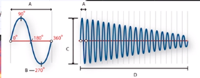
- A：波长
- B：相位度
- C：振幅
- D：一秒

### 声音波形之间的相互作用(降噪原理)
- 相同的波会相互加强
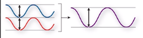
- 相反的波会互相抵消
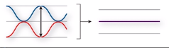

### 采样频率和比特率(bit)
**常用采样频率**
- 44100
	- CD
- 22050
- 48000
	- 数字电视或专业音频采样频率

#### 声道
- 单声道
- 立体声
	- 左右两声道

#### 位深(比特)
- 播放音频的动态范围

**位深与分贝关系**
每增加1bit，增加6dB

- 一般采用16位深，满足一般需求

#### 新建CD标准音频文件
- 采样率:44100HZ
- 位深:16位

#### 电影标准
- 采样频率:96000HZ
- 位深:24位

## 文件
### wav,FLAC
- 无损压缩
- 文件通常比较大

### mp3
- 文件小
	- 易于保存和传输

## AU界面
### 工作区域
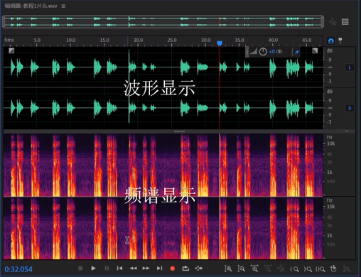
#### 波形编辑器
> 编辑单个音频，更详细处理声音细节
#### 多轨编辑器
> 完成混音和声音效果处理
#### 频谱频率显示器
> 适合处理人声

- 删除杂音或尾音
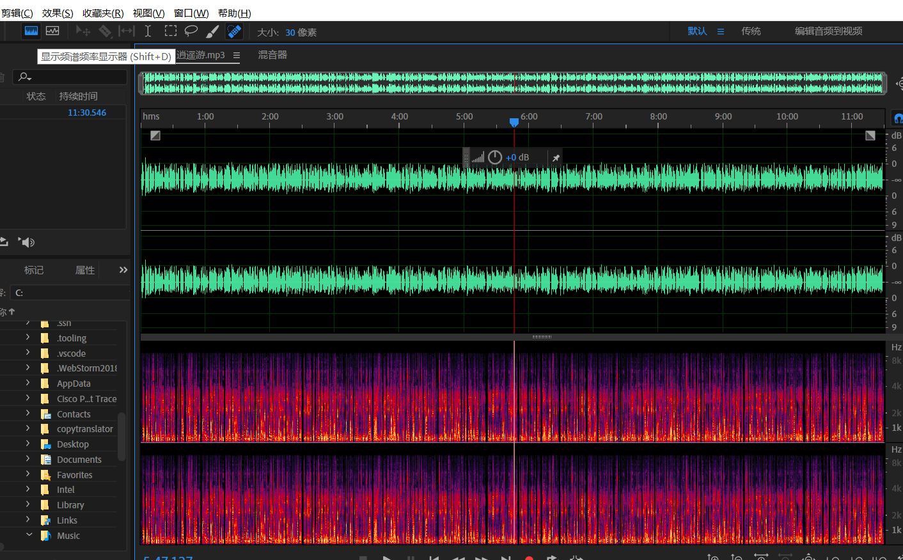
#### 频谱音调显示器
> 适合处理音乐
> 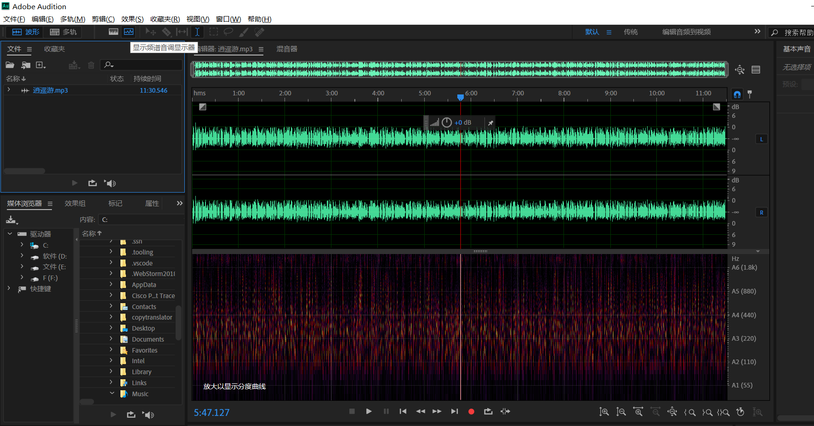

### 工具
#### 移动
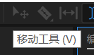

#### 切断

#### 滑动
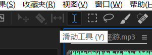

#### 时间选择工具
> 可在两个界面使用

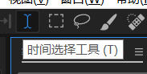

#### 框选&套索工具
> 只能在频谱显示器使用

- 用于选择一部分进行编辑
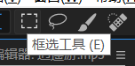
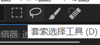

#### 画笔工具
> 类似于蒙版，可以对频率做淡化等编辑

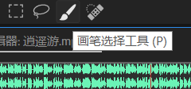

#### 污点修复工具
> 音频自动修复功能

- 参照周围音频特征修复选定区域
- 消除杂音的工具
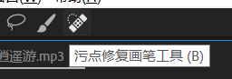

## 降噪处理
> 录制过程中电脑发出的声音

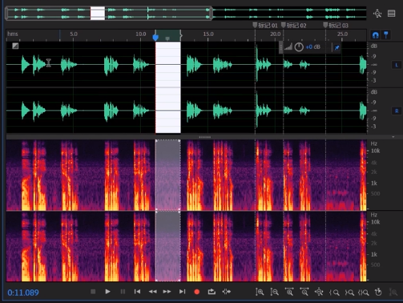

### 处理方法
#### 自适应降噪
>效果->降噪恢复

- 降噪幅度:确定降噪的级别：介于6到30dB之间的值效果很好
	- 噪声量：包含噪声的原始音频百分比
	- 基准：调整基本准则
	- 信号阈值：触发降噪的临界值
	-  衰减率：确定噪声处理下降60dB的速度，微调该设置可实现更大程度的降噪而失真更少
		-  过短，声音发泡
		-  过长：会有混响
	- 宽频保留：保留介于指定的频段与找到的失真之间的所需音频
	- 高品质模式：需大量运算
		- 减小FFT大小并关闭高品质模式

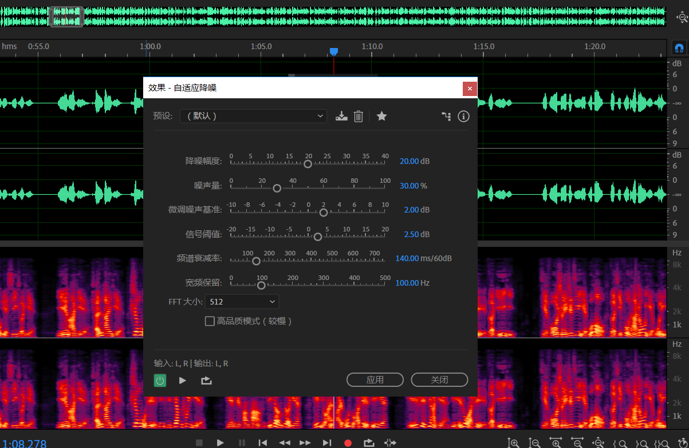

#### 手动降噪
- 现在音频文件捕捉一段点形噪声样本
- 效果-降噪/恢复- 降噪(处理)
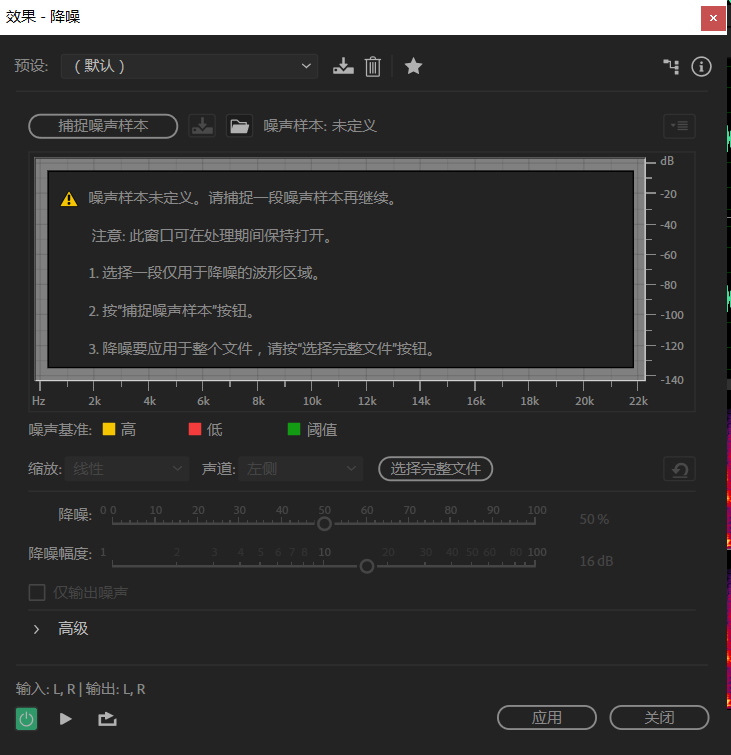
- 调整不同音频下降噪百分比
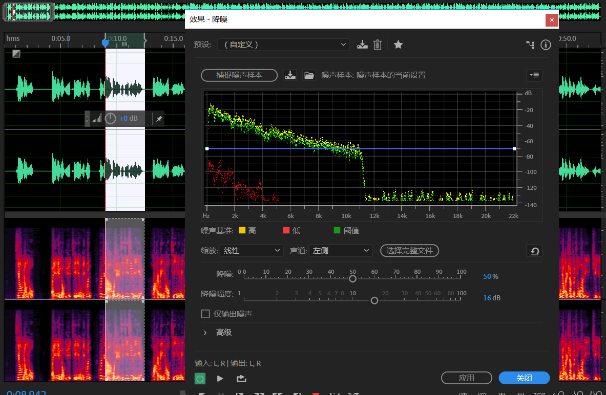

- 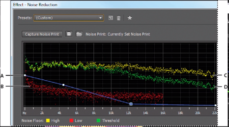
	- A：拖动控制点以改变不同频率范围中的降噪值
	- B：低振幅噪声
	- C：高振幅噪声
	- D：阈值，低于该值进行降噪

## 对特殊噪音杂音降噪
### 口水音
> 由于口齿舌的张合产生的微小声音

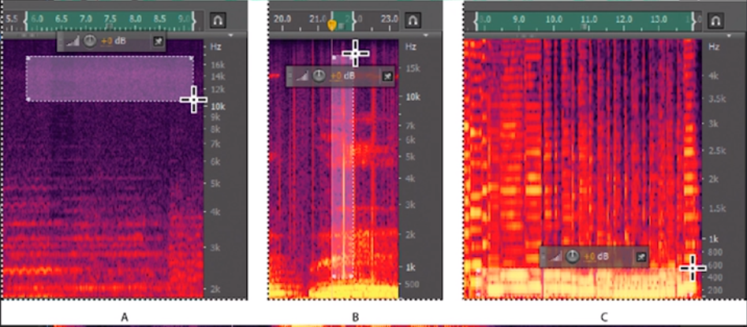
- A：嘶声
- B：噼啪声
- C：隆隆声

#### 处理方法
1. 效果-降噪/回复-自动咔哒声移除
选择强或弱降低
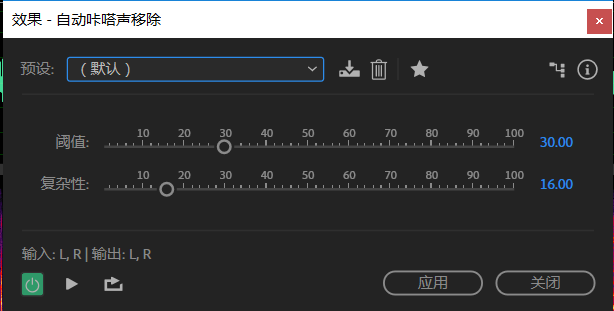

2. 修复工具
- 选择修复工具
- 在频谱县市区找到要修复的杂音
- 进行拖动擦除

### 爆音和高频的嘶声
> 尖音导致频度过高响度过大

- 导致声音失真或有嘶嘶的声音
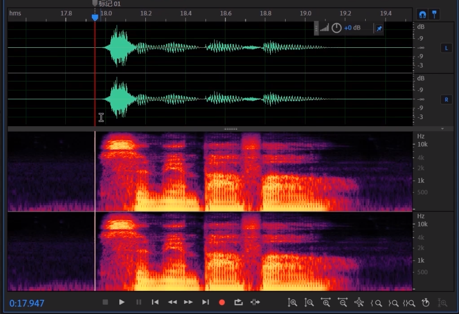

#### 处理方法
- 选择问题区域或高频区域
- 效果-降噪/回复
- 降低嘶声
- 捕捉噪声基准

### 音量过低&过高
选中区域调整振幅即可
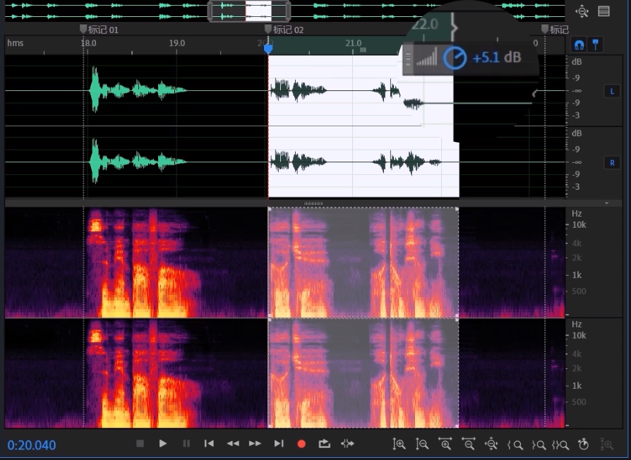

### 杂音
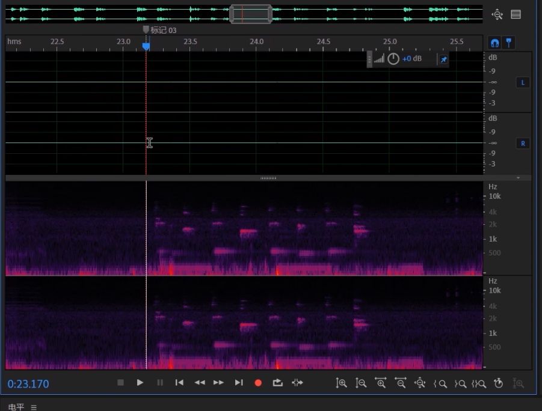

#### 处理方法
1. 修复工具修复
- 自动修复
- 选择要修复的区域
- 单击右键
- 自动修复选区
2. 直接删除

## 插入背景音乐(多轨混音)
1. 新建多轨混音项目
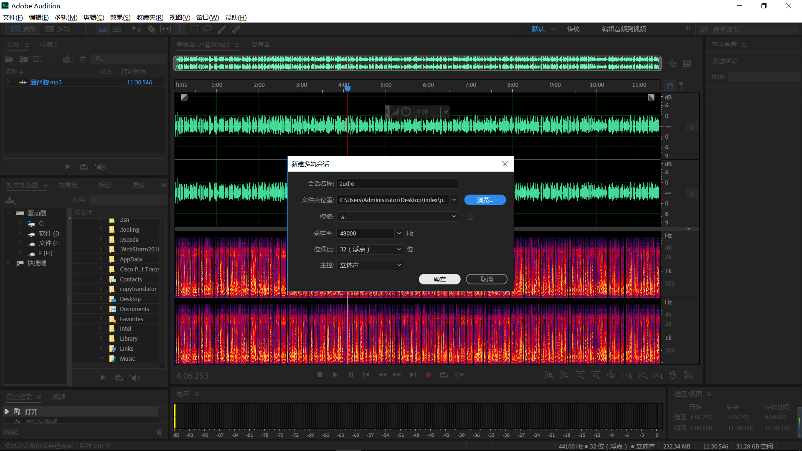
2. 打开要插入的音乐，拖动到两个不同轨道中
3. 播放的同时打开混合器
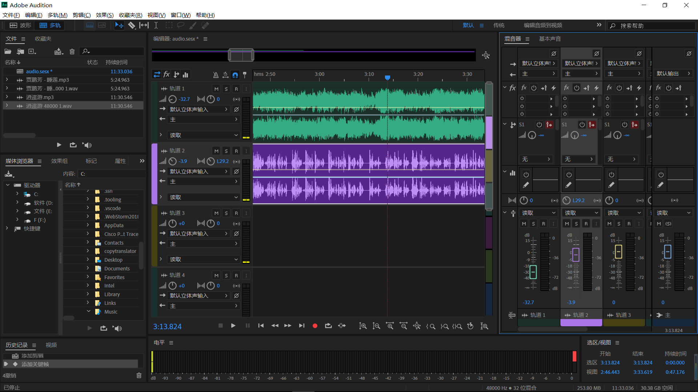
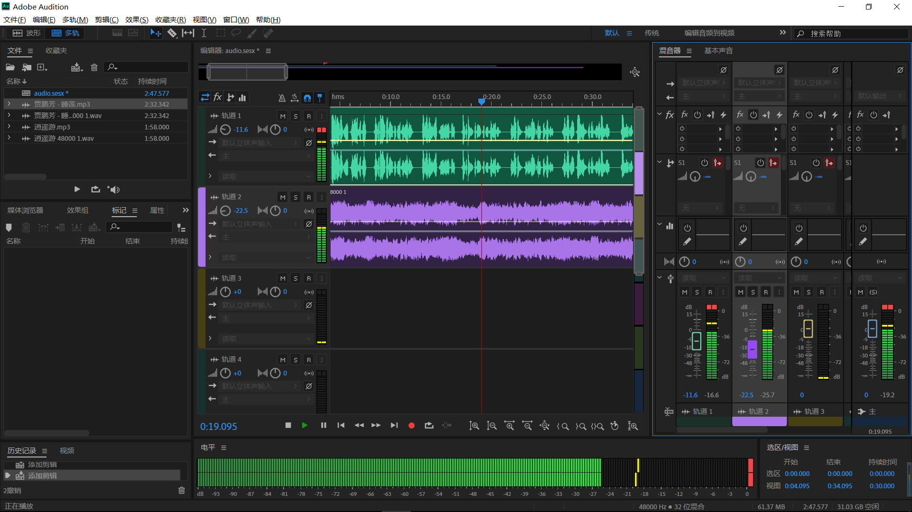
4. 添加淡入效果
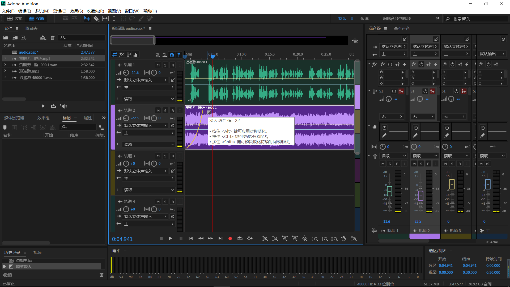
5. 保存只能保存其工程项目，需要通过文件-导出-多轨混音-整个会话
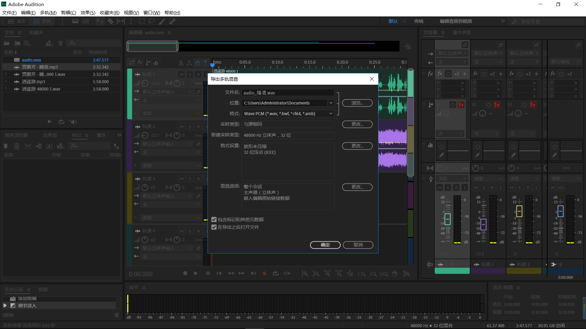