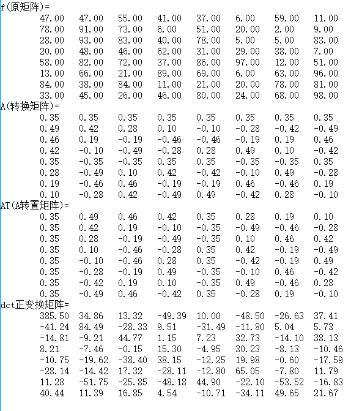
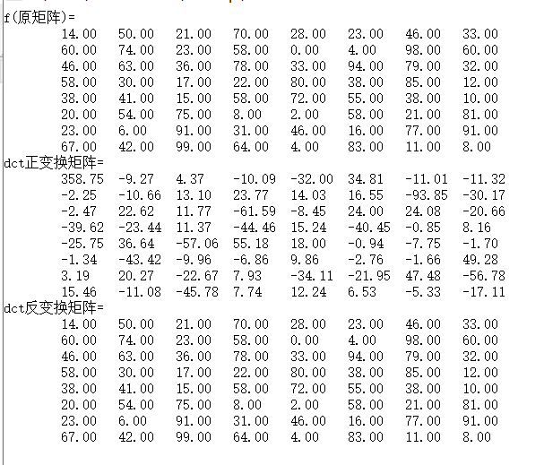
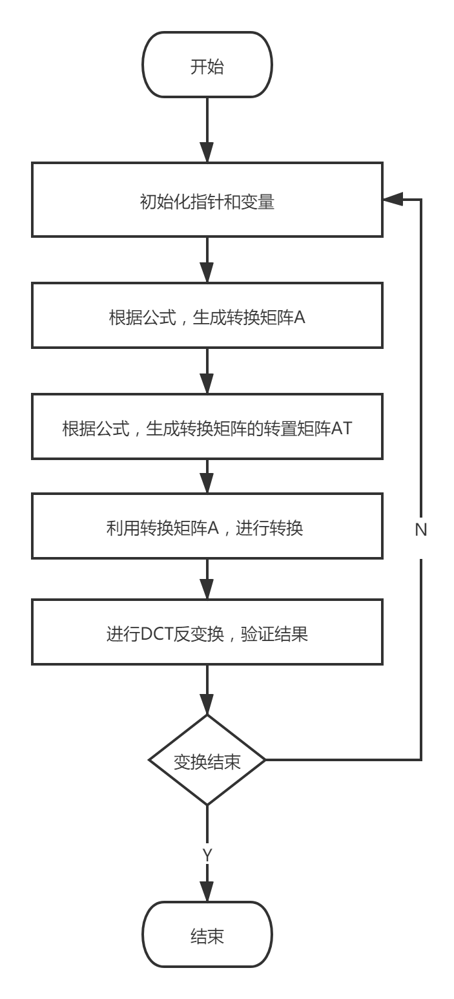
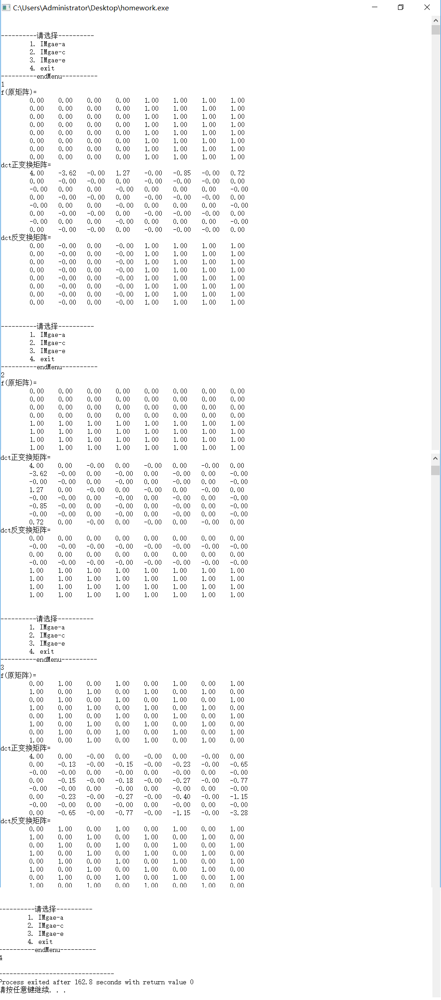

# 图像DCT算法
@(Learning)[Auspice Tian][2021年1月24日21:23:26]

---

[TOC]

---

## 介绍
> DCT 离散余弦变换，常用图像变换算法

1. 分割：将图像分割成8*8或16*16的小块
2. DCT变换：对每块进行DCT变换
3. 舍弃高频系数(AC系数)，保留低频系数(DC系数)
- 高频系数一般保存的是图像的边界、纹理信息
- 低频系数保存的图像中平坦区域信息
4. 图像的低频和高频
- 高频区域指空域图像中突变程度大的区域

# 图像
> 二维DCT变换就是将二维图像从空间域转换到频域

- 计算图像是由哪些二维余弦波构成

## 正变换
$F = AfA^T$
$A(i,j) = c(i) cos[\frac{(j+0.5)\pi} {N}i]$
$c(i)=\left\{\begin{array}{rcl}\sqrt{\frac{1}{N}}, & & {i =0}\\\sqrt{\frac{2}{N}}, & & {i\neq{0}}\\\end{array} \right.$

- F 位变换得到的系数
- f为图像像素值
- A为转换矩阵
- i 为二维波的水平方向频率
- j为二维波的垂直方向频率
	- 取值范围都是 0-(N-1)
- N为图像块大小

### 变换步骤
1. 求出转换矩阵A
2. 利用转换矩阵A，转换到频域
	- 由图像f的到系数矩阵F

### 数字模拟
```cpp
# include<stdio.h>
# include<math.h>
# include<stdlib.h>
# include<time.h>
# define N 8
# define PI 3.1415926

int i,j;
double *f = NULL;		//初始矩阵 
double *A = NULL;		//转换矩阵 
double *AT = NULL;		//系数矩阵转置 

void dct2(double *,double *);		//dct正变换  
void f_dct2(double *,double *);		//dct反变换 
void printM(double *,int,char *);	//打印矩阵 
void mulMatrix(double *P,double *Q,double *resM,int);	//矩阵乘法 
double *TMatrix(double *, int);		//转置矩阵 

int main(){
	f = (double *)malloc(N*N*sizeof(double));
	A = (double *)malloc(N*N*sizeof(double));
	AT = (double *)malloc(N*N*sizeof(double));
	/*
		time函数来获取系统时间
		1970年1月1日0点到现在时间的秒数
		然后将得到的time_t类型数据转化为(unsigned int)的数
	*/
	srand((unsigned int)time(NULL));
	/*
		rand（）产生随机数时，
		如果用srand（seed）播下种子之后，一旦种子相同,
		产生的随机数将是相同的
	*/
	for(i = 0;i < N;++i)
		for(j = 0;j < N;++j)
			f[j + i*N] = rand()%100;
	

	printM(f,N,"f(原矩阵)=\n");
	
	//1根据公式，生成转换矩阵A
	double x0 = sqrt(1.0/N);
	double x1 = sqrt(2.0/N);
	for(i = 0;i < N;++i){
		for(j = 0;j < N;++j){
			if(i == 0){
				A[i*N+j] = x0*cos((2*j+1)*PI*i/(2*N));
			}else{
				A[i*N+j] = x1*cos((2*j+1)*PI*i/(2*N));
			}
		}
	}
	
	printM(A,N,"A(转换矩阵)=\n");
	AT = TMatrix(A,N);
	printM(AT,N,"AT(A转置矩阵)=\n");
	
	//2利用转换矩阵A，进行转换
	double *dct = (double *)malloc(N*N*sizeof(double));
	dct2(f,dct);
	printM(dct,N,"dct正变换矩阵=\n");
	
	free(A);
	free(f);
	free(dct); 
	free(AT);

	return 0;
} 

/* 二维dct转换函数 
	参数列表:
		in:输入矩阵
		out:输出矩阵 
*/
void dct2(double *in,double *out){
	double *tt = (double *)malloc(N*N*sizeof(double));
	mulMatrix(A,in,tt,N);
	//printM(tt,N,"tt=\n");
	mulMatrix(tt,AT,out,N);
	
	free(tt);
}

/*	矩阵乘法
	参数列表:
		P,Q:待乘矩阵
		resM:返回矩阵 
		N:矩阵阶 
	返回:
		结果矩阵 
*/
void mulMatrix(double *P,double *Q,double *resM,int n){
	int t;
	double res;
	
	for(i = 0;i < n;++i){
		for(t = 0;t < n;++t){
			res = 0;
			for(j = 0;j < n;++j)
				res += P[i*N+j]*Q[j*N+t];
			resM[i*N+t] = res;
		}
	}
} 

/*	打印矩阵
	参数列表:
		M:待打印矩阵
		n:矩阵的阶 
		str:待打印字符串 
*/
void printM(double *M,int n,char *str){
	printf("%s",str);

	for(i = 0;i < n;++i){
		printf("\t");
		for(j = 0;j < n;++j)
			printf("%.2lf\t",M[i*N+j]);
		printf("\n");
	}	
}

/*	矩阵转置函数
	参数列表:
		M:待转置矩阵
		n:矩阵的阶 
	返回:
		转置后的矩阵 
*/
double *TMatrix(double *M, int n){
	double *tmp = (double *)malloc(N*N*sizeof(double));
	for(j = 0;j < N;++j)
		for(i = 0;i < N;++i)
			tmp[i*N+j] = M[j*N+i];
	
	return tmp;
}
```
**运行截图**



## 反变换
$F=AfA^T$
$f = A^{-1} F (A^T)^{-1}$

A是正交矩阵，所以有$AT=A−1$,所以求得：
$f = A^TFA$

```cpp
# include<stdio.h>
# include<math.h>
# include<stdlib.h>
# include<time.h>
# define N 8
# define PI 3.1415926

int i,j;
double *f = NULL;		//初始矩阵 
double *A = NULL;		//转换矩阵 
double *AT = NULL;		//系数矩阵转置 

void dct2(double *,double *);		//dct正变换  
void f_dct2(double *,double *);		//dct反变换 
void printM(double *,int,char *);	//打印矩阵 
void mulMatrix(double *P,double *Q,double *resM,int);	//矩阵乘法 
double *TMatrix(double *, int);		//转置矩阵 

int main(){
	f = (double *)malloc(N*N*sizeof(double));
	A = (double *)malloc(N*N*sizeof(double));
	AT = (double *)malloc(N*N*sizeof(double));
	/*
		time函数来获取系统时间
		1970年1月1日0点到现在时间的秒数
		然后将得到的time_t类型数据转化为(unsigned int)的数
	*/
	srand((unsigned int)time(NULL));
	/*
		rand（）产生随机数时，
		如果用srand（seed）播下种子之后，一旦种子相同,
		产生的随机数将是相同的
	*/
	for(i = 0;i < N;++i)
		for(j = 0;j < N;++j)
			f[j + i*N] = rand()%100;
	

	printM(f,N,"f(原矩阵)=\n");
	
	//1根据公式，生成转换矩阵A
	double x0 = sqrt(1.0/N);
	double x1 = sqrt(2.0/N);
	for(i = 0;i < N;++i){
		for(j = 0;j < N;++j){
			if(i == 0){
				A[i*N+j] = x0*cos((2*j+1)*PI*i/(2*N));
			}else{
				A[i*N+j] = x1*cos((2*j+1)*PI*i/(2*N));
			}
		}
	}
	
	//printM(A,N,"A(转换矩阵)=\n");
	AT = TMatrix(A,N);
	//printM(AT,N,"AT(A转置矩阵)=\n");
	
	//2利用转换矩阵A，进行转换
	double *dct = (double *)malloc(N*N*sizeof(double));
	dct2(f,dct);
	printM(dct,N,"dct正变换矩阵=\n");
	
	double *f_dct = (double *)malloc(N*N*sizeof(double));
	f_dct2(dct,f_dct);
	printM(f_dct,N,"dct反变换矩阵=\n");
	
	free(A);
	free(f);
	free(dct); 
	free(AT);

	return 0;
} 

/*	二维DCT反变换
		参数列表:
			in:输入矩阵
			out:输出矩阵 

*/
void f_dct2(double *in,double *out){
	double *tmp = (double *)malloc(N*N*sizeof(double));
	
	mulMatrix(AT,in,tmp,N);
	mulMatrix(tmp,A,out,N);
}

/* 二维dct转换函数 
	参数列表:
		in:输入矩阵
		out:输出矩阵 
*/
void dct2(double *in,double *out){
	double *tt = (double *)malloc(N*N*sizeof(double));
	mulMatrix(A,in,tt,N);
	//printM(tt,N,"tt=\n");
	mulMatrix(tt,AT,out,N);
	
	free(tt);
}

/*	矩阵乘法
	参数列表:
		P,Q:待乘矩阵
		resM:返回矩阵 
		N:矩阵阶 
	返回:
		结果矩阵 
*/
void mulMatrix(double *P,double *Q,double *resM,int n){
	int t;
	double res;
	
	for(i = 0;i < n;++i){
		for(t = 0;t < n;++t){
			res = 0;
			for(j = 0;j < n;++j)
				res += P[i*N+j]*Q[j*N+t];
			resM[i*N+t] = res;
		}
	}
} 

/*	打印矩阵
	参数列表:
		M:待打印矩阵
		n:矩阵的阶 
		str:待打印字符串 
*/
void printM(double *M,int n,char *str){
	printf("%s",str);

	for(i = 0;i < n;++i){
		printf("\t");
		for(j = 0;j < n;++j)
			printf("%.2lf\t",M[i*N+j]);
		printf("\n");
	}	
}

/*	矩阵转置函数
	参数列表:
		M:待转置矩阵
		n:矩阵的阶 
	返回:
		转置后的矩阵 
*/
double *TMatrix(double *M, int n){
	double *tmp = (double *)malloc(N*N*sizeof(double));
	for(j = 0;j < N;++j)
		for(i = 0;i < N;++i)
			tmp[i*N+j] = M[j*N+i];
	
	return tmp;
}
```


# DCT大作业

## 流程图


## 代码
```cpp
# include<stdio.h>
# include<math.h>
# include<stdlib.h>
# include<time.h>
# define N 8
# define PI 3.1415926

int choose = 0;				//选择图片 
int i,j;
double *f = NULL;		//初始矩阵 
double *A = NULL;		//转换矩阵 
double *AT = NULL;		//系数矩阵转置 

/*DCT相关函数*/
void dct2(double *,double *);		//dct正变换  
void f_dct2(double *,double *);		//dct反变换 
void printM(double *,int,char *);	//打印矩阵 
void mulMatrix(double *P,double *Q,double *resM,int);	//矩阵乘法 
double *TMatrix(double *, int);		//转置矩阵 

/*附加函数*/
void showMenu(){
	printf("\n\n----------请选择----------\n");
	printf("\t1. IMgae-a\n");
	printf("\t2. IMgae-c\n");
	printf("\t3. IMgae-e\n");
	printf("\t4. exit\n");
	printf("----------endMenu----------\n");
} 
void executeFn();//执行主函数 

int main(){
	while(1){
		showMenu();
		scanf("%d",&choose);
		if(choose == 4)
			break;
			
		f = (double *)malloc(N*N*sizeof(double));
		A = (double *)malloc(N*N*sizeof(double));
		AT = (double *)malloc(N*N*sizeof(double));
		if(choose == 1){
			for(i = 0;i < N;++i)
				for(j = 0;j < N;++j){
					if(j < 4)
						f[i*N+j] = 0;
					else
						f[i*N+j] = 1;
				}
			executeFn(); 
		}else if(choose == 2){
			for(i = 0;i < N;++i)
				for(j = 0;j < N;++j){
					if(i < 4)
						f[i*N+j] = 0;
					else
						f[i*N+j] = 1;
				}
			executeFn(); 
		}else if(choose == 3){
			for(i = 0;i < N;++i)
				for(j = 0;j < N;++j){
					if(i%2 == 0){
						if(j%2 == 0)
							f[i*N+j] = 0;
						else
							f[i*N+j] = 1;
					}	else{
						if(j%2 == 1)
							f[i*N+j] = 0;
						else
							f[i*N+j] = 1;	
					}
				}
			executeFn();
		}
	}

	return 0;
} 

/*执行主函数*/
void executeFn(){
	printM(f,N,"f(原矩阵)=\n");
	
	//1根据公式，生成转换矩阵A
	double x0 = sqrt(1.0/N);
	double x1 = sqrt(2.0/N);
	for(i = 0;i < N;++i){
		for(j = 0;j < N;++j){
			if(i == 0){
				A[i*N+j] = x0*cos((2*j+1)*PI*i/(2*N));
			}else{
				A[i*N+j] = x1*cos((2*j+1)*PI*i/(2*N));
			}
		}
	}
	
	//printM(A,N,"A(转换矩阵)=\n");
	AT = TMatrix(A,N);
	//printM(AT,N,"AT(A转置矩阵)=\n");
	
	//2利用转换矩阵A，进行转换
	double *dct = (double *)malloc(N*N*sizeof(double));
	dct2(f,dct);
	printM(dct,N,"dct正变换矩阵=\n");
	
	double *f_dct = (double *)malloc(N*N*sizeof(double));
	f_dct2(dct,f_dct);
	printM(f_dct,N,"dct反变换矩阵=\n");
	
	free(A);
	free(f);
	free(dct); 
	free(AT);
}

/*	二维DCT反变换
		参数列表:
			in:输入矩阵
			out:输出矩阵 

*/
void f_dct2(double *in,double *out){
	double *tmp = (double *)malloc(N*N*sizeof(double));
	
	mulMatrix(AT,in,tmp,N);
	mulMatrix(tmp,A,out,N);
}

/* 二维dct转换函数 
	参数列表:
		in:输入矩阵
		out:输出矩阵 
*/
void dct2(double *in,double *out){
	double *tt = (double *)malloc(N*N*sizeof(double));
	mulMatrix(A,in,tt,N);
	//printM(tt,N,"tt=\n");
	mulMatrix(tt,AT,out,N);
	
	free(tt);
}

/*	矩阵乘法
	参数列表:
		P,Q:待乘矩阵
		resM:返回矩阵 
		N:矩阵阶 
	返回:
		结果矩阵 
*/
void mulMatrix(double *P,double *Q,double *resM,int n){
	int t;
	double res;
	
	for(i = 0;i < n;++i){
		for(t = 0;t < n;++t){
			res = 0;
			for(j = 0;j < n;++j)
				res += P[i*N+j]*Q[j*N+t];
			resM[i*N+t] = res;
		}
	}
} 

/*	打印矩阵
	参数列表:
		M:待打印矩阵
		n:矩阵的阶 
		str:待打印字符串 
*/
void printM(double *M,int n,char *str){
	printf("%s",str);

	for(i = 0;i < n;++i){
		printf("\t");
		for(j = 0;j < n;++j)
			printf("%.2lf\t",M[i*N+j]);
		printf("\n");
	}	
}

/*	矩阵转置函数
	参数列表:
		M:待转置矩阵
		n:矩阵的阶 
	返回:
		转置后的矩阵 
*/
double *TMatrix(double *M, int n){
	double *tmp = (double *)malloc(N*N*sizeof(double));
	for(j = 0;j < N;++j)
		for(i = 0;i < N;++i)
			tmp[i*N+j] = M[j*N+i];
	
	return tmp;
}
```



## DCT系数特点
- DCT后的64个DCT频率系数与DCT前64个像素块对应
- DC系数为出发点向下，向右的其他DCT系数，离DC分量越原，频率越高，幅度值越小
- 单独一个图像的全部DCT系数块的频谱几乎集中在左上角系数块中

## 原因
-  DCT是没有压缩的无损变换过程
-  DCT的低频系数代表了图像的背景、轮廓，是保证图像传输业务质量(QoS)的重要信息
-  DCT高频系数是反映图像的边缘、细节的较次要的信息