# Linux
@(Knowledge)[Auspice Tian][2021年1月24日19:37:14] 

-----

[TOC]

<div style="page-break-after:always"></div>

## 操作系统

- **功能**
> 控制硬件
> 提供系统调用

###  分类
1. **桌面操作系统**

	- Windows
	- MacOS
	- Linux

2. **服务器操作系统**

	- Linux
	- Windows Server

3. **嵌入式操作系统**

	- Linux

4. **移动设备操作系统**

	- IOS
	- Android

### 发展
1. **Unix**
> 多用户同一时间登录到同一电脑上

- 1970年 

	肯.汤普逊 Unix
- 1972年 

	Dennis C语言

2. **Linux**
- 1991年

	林纳斯

### 虚拟机
> 软件模拟硬件系统

- 生成虚拟镜像
- 可切换
- 独立运行

## Linux
### 分类
#### 内核版(Kernel)
- 系统调用
- 终端命令

#### 发行版(GNU)
> 包含桌面环境，办公套件，媒体播放器，数据库等软件

- Ubuntu
- RedHat
- CenOS
- OpenSUSE
- Debian

### 文件和目录
#### Windows
- 单用户操作系统
> 一个用户独享系统的全部硬件和软件资源

- 多用户操作系统
> Linux , Unix

#### Linux目录结构
只有一个根目录，所有文件都在根目录下

| 根目录 | 子目录 |
| :----: | :----: |
|   /    |  /bin  |
|        |  /etc  |
|        | /home  |
|        |  /lib  |
|        | /user  |

> 多个用户在 **/home** 目录下建立各自专属的用户目录

##### /
根目录
> 一个Linux下只有一个根目录
>
> - 在终端输入 **/home** ，从根目录开始，再进入home目录

##### bin、/user/bin
可执行二进制文件的目录，终端命令所在目录
> 常用命令 **ls、tar、mv、cat**

##### boot
放置linux启动时用到的一些文件
- linux内核文件 
``` python
	/boot/vmlinuz 
```

- 系统引导管理器
``` python
	 /boot/grub
```

##### /dev 
存放linux系统下的设备文件，访问该文件相当于访问某个设备
- 挂载光驱
``` python
	mount /dev/cdrom/mnt
```

##### /etc
系统配置文件存放目录
- /etc/inittab
- /etc/fstab
- /etc/init.d
- /etc/X11
- /etc/sysconfig
- /etc/xinetd.d

##### /home
系统默认的用户目录，新增用户时，都放于此目录下
- ~
> 表示当前用户的家目录

- ~edu
> 表示edu用户的家目录

##### /lib、/user/lib、/user/local/lib
系统使用的函数库目录

##### /opt
给主机额外安装软件所存放的目录

### 常用命令
| 序号 |       命令       |         全拼         | 作用                     |
| :--: | :--------------: | :------------------: | :----------------------- |
|  01  |        ls        |         list         | 查看当前文件加下内容     |
|  02  |       pwd        | print work directory | 查看当前                 |
|  03  |   cd [目录名]    |   change directory   | 切换文件夹               |
|  04  |  touch [文件名]  |        touch         | 如果文件不存在，新建文件 |
|  05  |  mkdir [目录名]  |    make directory    | 创建目录                 |
|  06  |   rm [文件名]    |        remove        | 删除指定的文件名         |
|  07  |      clear       |        clear         | 清屏                     |
|  08  | useradd [用户名] |       user add       | 新增用户                 |
|  09  | passwd [用户名]  |       password       | 为用户设置密码           |
|  10  |   su [用户名]    |     switch user      | 用户切换                 |

#### 命令格式
```
command [-options],[parameter]
```

说明
> **command**:命令名
> **[-options]**:对命令进行控制
> **[parameter]**:命令多个参数

 `[]`表示可选，没有[]不可省

连续 **-** 可省略
```
ls -lha
```
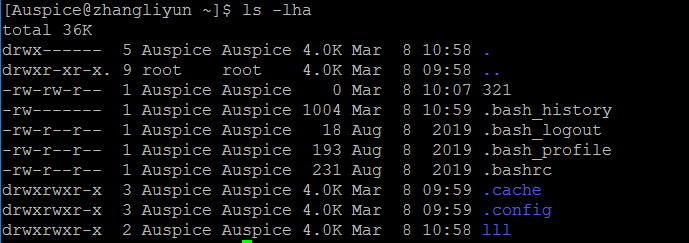


#### 查询帮助信息
##### --help
```
command --help
```
- 显示**command**命令的帮助信息

##### man
```
man command
```
- **manual**:命令手册

**使用man时常用操作键**
| 操作键  | 作用             |
| :-----: | :--------------- |
| Space键 | 下一屏           |
| Enter键 | 一次滚动手册页行 |
|    b    | 回滚一屏         |
|    f    | 下一屏           |
|    q    | 退出             |
|  /word  | 搜索word字符串   |

#### 自动补全
命令前几个字母，按`Tab键`
- 如果输入没有歧义，自动补全
- 存在其他命令，再按 **Tab** 会提示可能存在的命令

#### 曾经使用过的命令
- 按 **上/下** 切换使用过的命令
- 退出执行，并且不执行当前选中命令 **Ctrl+C**

#### 文件和目录命令
##### Linux下文件和目录的特点
- Linux **文件** 或 **目录** 名称最长256字符
- 以 **.** 开头的文件为隐藏文件，需要 `-a` 参数才能显示
- **.** 代表当前目录
- **~** 表示上层目录

##### ls
- 列出目录下内容，相当于 **Dos** 下的 **dir** 命令

| 参数 |                  含义                  |
| :--: | :------------------------------------: |
|  -a  |       显示所有文件，包括隐藏文件       |
|  -l  |      以列表形式显示文件的详细信息      |
|  -h  | 配合 **-l** 以更人性化方式显示文件大小 |

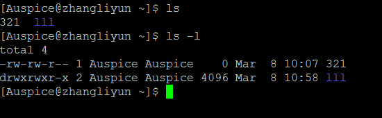
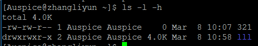


###### ls 通配符的使用
| 通配符 | 含义                        |
| :----: | :-------------------------- |
|   *    | 表示任意个数字符            |
|   ？   | 代表任意一个字符，至少一个  |
|   []   | 表示可以是字符组 的任意一个 |
| [abc]  | 匹配a/b/c中的任意一个       |
| [a-f]  | 匹配从a到f单位内的任意一个  |

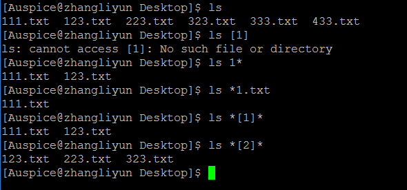

##### cd
- 切换当前工作目录

| 命令  | 含义                   |
| :---: | :--------------------- |
|  cd   | 切换当前用户的主目录   |
| cd ~  | 切换到当前用户的主目录 |
| cd .  | 当前目录               |
| cd .. | 上层目录               |
| cd -  | 在最近两次目录之间切换 |

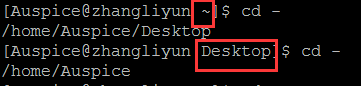

###### 相对路径和绝对路径
- **相对路径** 
> 在输入路径时，最前面不是 **/** 或 **~** 表示相对 **当前目录** 所在的目录位置
- **绝对路径**
> 表示从 **根目录/家目录** 开始的具体目录位置 

##### 创建和删除操作
###### touch
- 创建文件或修改文件时间
	- 如果文件不存在，创建空白文件
	- 如果文件存在，修改时间

###### mkdir
- 创建一个新的目录
	- -p 递归创建目录

> 新建目录名称不能能与当前目录中已有目录或文件同名

```
mkdir -p a/b/c/d
```

###### rm
- 删除文件或目录, `不可回复`

| 参数 | 含义                               |
| :--: | :--------------------------------- |
|  -f  | 强制删除，忽略不存在的文件，不提醒 |
|  -r  | 递归删除目录下的文件 **删除文件**  |

#### 拷贝和移动文件
| 序号 |        命令        | 对应英文 | 作用                     |
| :--: | :----------------: | :------: | :----------------------- |
|  01  |   tree [目录名]    |   tree   | 以树状图列出文件目录结构 |
|  02  | cp 源文件 目标文件 |   copy   | 复制文件或目录           |
|  03  | mv 源文件 目标文件 |   move   | 移动文件/目录或重命名    |

##### tree
- 以树状图列出文件目录结构

| 选项 | 含义       |
| :--: | :--------- |
|  -d  | 只显示目录 |

##### cp
- 将给出文件或目录 复制到 另一文件或目录

| 选项 | 含义                                                     |
| :--: | :------------------------------------------------------- |
|  -i  | 覆盖文件前提示                                           |
|  -r  | **给出源文件时目录**，递归复制该目录下的所有子目录和文件 |

```
cp -i 源文件 目标文件
cp -r 源目录 目标目录
```

##### mv
- 移动文件或目录
- 重命名文件或目录

| 选项 | 含义           |
| :--: | :------------- |
|  -i  | 覆盖文件前提醒 |

#### 文件内容
| 序号 |        命令         |  对应英文   | 含义                                           |
| :--: | :-----------------: | :---------: | :--------------------------------------------- |
|  01  |     cat 文件名      | concatenate | 查看文件内容、创建文件、合并文件。追加文件内容 |
|  02  |     more 文件名     |    more     | 分屏显示文件内容                               |
|  03  | grep 搜索文本文件名 |    grep     | 搜索文本文件内容                               |

##### cat
- 查看文件内容、创建文件、文件合并、追加文件内容等
- 一次显示所有内容，适合查看内容较少的文本文件

| 选项 | 含义               |
| :--: | :----------------- |
|  -b  | 跳过空白行编号     |
|  -n  | 对输出的所有行编号 |

> linux还有一个 **nl** 命令和 **cat -b** 的效果等价

##### more
- 适合查看文件内容较多的文件
> **回车**、**空格** 、**p** 查看下一P
> **q** 退出查看
> **f** 回滚

##### grep
- 相当于 **Ctrl+F** 
- 文本搜索工具
- **grep** 允许对文本文件进行正则查找

| 选项 | 含义                             |
| :--: | :------------------------------- |
|  -n  | 显示匹配行及行号                 |
|  -v  | 显示不含匹配文本的所有行(-n取反) |
|  -i  | 忽略大小写                       |

- 常用的两种正则查找
| 参数 | 含义                   |
| :--: | :--------------------- |
|  ^A  | 行首，搜索以a开头的行  |
| ke$  | 行尾，搜索以ke结尾的行 |

```
grep [-option] [文件名]
```

#### echo
- echo会在终端 中显示参数指定的文字，通常和 **重定向** 联合使用
- 若重定向的文件不存在，会将内容直接写入新创建的文件

##### 重定向
- Linux允许将命令执行结果重定向到一个文件中
- 将本应该在终端上输出的内容 **输出/追加** 到指定文件中

其中
- \>   表示输出，会覆盖文件原有内容
- \>> 表示追加，将内容追加到已有文件的末尾

```php
echo Hello Python > 123.txt//覆盖
cat 123.txt

echo Hello Python >> 123.txt//追加
cat 123.txt
```

#### 管道 |
- Linux 允许将一个命令的输出作为另一个命令的输入，二次处理

> 多个连续命令分隔符

常用的管道命令
- more:分配显示内容
- grep:执行结果在基础上查询指定文本


```
ls -lha|more
ls -lha|grep -i vi
```

### 远程管理

#### 关机/重启
| 序号 |        命令        | 对应英文 | 作用      |
| :--: | :----------------: | :------: | :-------- |
|  01  | shutdown 选项 时间 | shutdown | 关机/重启 |

##### shutdown
- 安全关闭或重启
- 默认一分钟后关闭主机

| 选项 | 含义     |
| :--: | :------- |
|  -r  | 重新启动 |
|  -c  | 取消关机 |

```
shutdown -r now
# 现在重启主机

shutdown now
# 现在关闭主机

shutdown 20:25
# 今天20:25关闭主机

shutdown +10
# 系统十分钟后关闭

shutdown -c
# 取消之前关闭计划
```

#### 查看或配置网卡信息
| 序号 |    命令     |           对应英文            | 作用                              |
| :--: | :---------: | :---------------------------: | :-------------------------------- |
|  01  |  ifconfig   | configure a network interface | 查看/配置计算机当前的网卡配置信息 |
|  02  | ping ip地址 |             ping              | 检测到目标ip地址的连接是否正常    |

 **网卡**
 > 专门负责网络通讯的硬件设备
 > IP地址是设置在网卡上的地址信息

##### ifconfig
- 查看/配置计算机当前的网卡配置信息

```
ifconfig

ifconfig|grep inet
```

**本地换回地址**
> 172.0.0.1
> 测试网卡是否可用

##### ping
```
# 检测目标ip主机
ping 目标ip

# 本地网卡工作状态
ping 127.0.0.1
```

- Ctrl + C 停止ping 

#### SSH
| 序号 |            命令            |   对应英文   | 作用          |
| :--: | :------------------------: | :----------: | :------------ |
|  01  |       ssh 用户名@ip        | secure shell | 关机/重新启动 |
|  02  | scp 用户名@ip:文件名或录用 | secure copy  | 远程复制文件  |

##### 概念
- 通过 **SSH客户端** 可连接运行了 **SSH服务器** 的远程机器上
- SSH，转为远程登录会话和其他网络服务提供安全性的协议
	- 通过SSH协议防止远程管理过程中的信息泄露
	- 对所有传输的数据进行加密，防止DNS欺骗和ip欺骗
- SSH传输的数据可压缩，加快传输速度

**域名和端口号**
```
ip:端口号
```

域名
- 用一串分号分隔
- ip地址的别名，方便记忆

端口号
- ip地址：通过ip地址找到网络上的计算机
- 端口号：通过端口号找到在计算机上运行的应用程序
- 常见端口号列表
> |   服务    | 端口号 |
> | :-------: | :----: |
> | SSH服务器 |   22   |
> | Web服务器 |   80   |
> |   HTTPS   |  443   |
> |    FTP    |   21   |

##### ssh
```
ssh [-p port] user@remote Ip

ssh -p 22 Auspice@172.16.140.133
```
- **user** 是远程机器上的用户名，不指定的话是默认文当前用户
- **remote** 远程机器的地址,可以是 **ip/域名** ,或者别名
- **port** 是SSH Server监听的端口，不指定，默认值为22

> **exit** 退出当前用户的登录
> *注意：*
> `SSH` 这个终端命令只能在 *Linux* 或*UNIX* 下使用
> 在 *Windows** 下，安装 *PuTTY* 或 *PXShell*

**PuTTY**: https://www.putty.org/
**XShell**:https://www.netsarang.com/zh/xshell/

##### scp
- Linux 下用来远程拷贝文件
- 地址格式与 `ssh` 基本相同
- 指定端口时， **`-P`** 是大写的

| 选项 | 含义                                                         |
| :--: | :----------------------------------------------------------- |
|  -r  | 给出的源文件是目录文件，将递归赋值该目下的所有子目录和文件，目标文件必须为一目录名 |
|  -P  | 若远程SSH服务器的端口不是22,需要用大写字母 P 来指定端口      |

**命令格式**
```
# 将本地当前目录下的 01.py 复制到远程家目录下的 Desktop/01.py
scp -P port 01.py user@remote:Desktop/01.py

# 把远程家目录下的 Desktop/01.py 文件复制到本地当前目录下的 01.py
scp -P port user@remote:Desktop/01.py 01.py

# 加上-r 传输文件夹
scp -r demo user@remote:Desktop
```

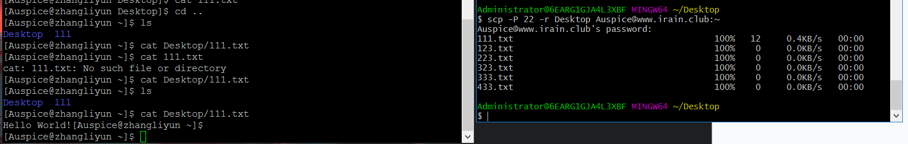

##### FileZilla
文件传输软件
> **FileZilla ** 传输文件时，使用的是FTP服务，端口号设置为21

##### 免密登录
步骤
- 在本地 **.ssh** 文件夹下登录远程服务器
	- 保存SSH相关的配置信息
- 生成本地当前用户公钥
	- 执行 **ssh-keygen** 即可生成SSH公钥。一路回车即可
	- **id_rsa.pub** 即本机公钥
	- **id_rsa** 本机私钥
- 上传公钥到服务器
	- 执行 **ssh-copy-id -p port user@remote**，让远程服务器记住公钥

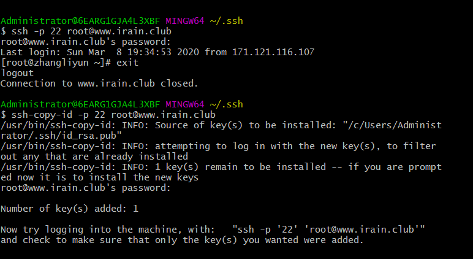

**`工作原理`**
非对称加密算法
> 使用 **公钥** 加密的数据，需要私钥解密
> 使用 **私钥** 加密的数据，需要公钥解密

- 本地发送的数据，用私钥加密
- 服务器若保存有公钥，会对数据解密
- 数据处理完后用公钥加密，回传给本地

##### 配置别名
输入 **ssh username@ipaddress** 很繁琐
在 **~/.ssh/config** 里追加以下内容
``` 
Host newName
	HostName ip address
	User username
	Port port
```

保存之后，就可使用别名登录

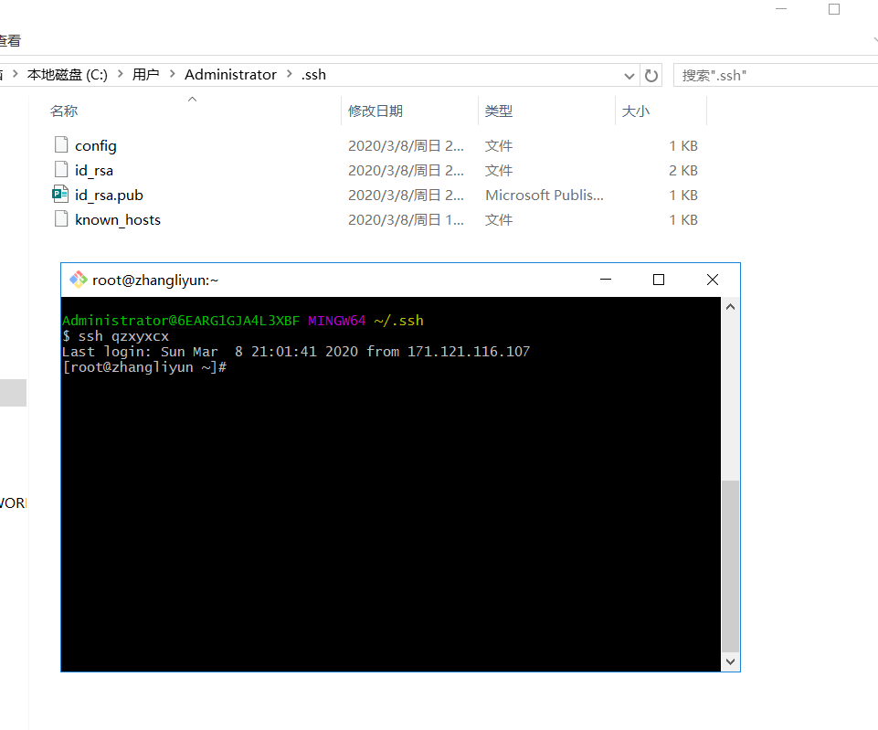


### 用户管理
#### 概念
- 用户管理包括 **用户管理** 与 **组管理**
- 不同用户可指定不同权限
- 指定 **每一用户** 针对 **不同文件或目录** 的 **不同权限**
- 权限分类
> | 序号 | 权限 |  英文  | 缩写 | 数字代号 |
> | :--: | :--: | :----: | :--: | :------: |
> |  01  |  读  |  read  |  r   |    4     |
> |  02  |  写  | write  |  w   |    2     |
> |  03  | 执行 | excute |  x   |    1     |

##### 组
 - 对组设置权限，将 **不同用户添加到对应组中** ，不用为每个用户设置权限

##### ls -lah
	- **权限** 第一个字符如果是 d 表示目录
	- **硬连接数** 多少种方式可访问当前目录/文件
	- **拥有者** 家目录下 **文件/目录** 拥有者通常是当前用户
	- **组**
	- **大小**
	- **时间**
	- **名称** 
> 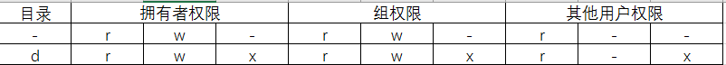
>
> 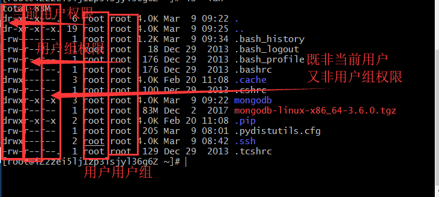

#### 权限修改
> 文件拥有者默认有可读可写权限
> linux中文本文件也可执行
> **目录** 有可执行权限，才能执行其他命令

- chmod  修改 **用户/组** 对 **文件/目录** 的权限
- 命令格式
```
chmod +/-rwx 文件名/目录名

chmod -rw 01.py
chmod +rw 01.py

./01.py
```

#### 超级用户
- **root** 账号通常用于 **系统的维护和管理** ，对操作系统的所有资源具有访问权限
- 不推荐直接使用 **root** 账号登录系统
- 在Linux安装过程中，系统会自动创建一个标准用户账号

##### sudo
- **su** *substitute user*缩写，表示切换用户
- **sudo** 用来以其他身份执行命令，预设身份为 *root*
- 用户使用 **sudo** 时，必须先输入密码，之后有 **5分钟** 的有效期限，超过期限必须重新输入密码
> *未经授权的用户企图使用 **sudo** 会发出警告邮件*

#### 组管理
> **创建组/删除组** 需要通过 *sudo* 执行

| 序号 |           命令            | 作用                      |
| :--: | :-----------------------: | :------------------------ |
|  01  |       groupadd 组名       | 添加组                    |
|  02  |       groupdel 组名       | 删除组                    |
|  03  |       cat/etc/group       | 确认组信息                |
|  04  | chgrp -R 组名 文件/目录名 | 递归修改 文件/目录 所属组 |

> 组信息保存在 **/etc/group** 文件中
> `/etc` 目录用于保存系统配置信息的目录 

```
mkdir Python学习
sudo groupadd study
sudo chgrp -R study Python学习
```

#### 单个用户
> **创建用户/删除用户/修改其他用户密码** 需要通过 *sudo* 执行

| 序号 |             命令              | 作用         | 说明                                                         |
| :--: | :---------------------------: | :----------- | :----------------------------------------------------------- |
|  01  | useradd -m -g 组名 新建用户名 | 添加新用户   | -m 自动创建用户家目录 <br> -g 指定用户所在组，否则会创建一个同名的组 |
|  02  |         passwd 用户名         | 设置用户密码 | 普通用户，直接用passwd可以修改自己密码                       |
|  03  |       userdel -r 用户名       | 删除用户     | -r 自动删除家目录                                            |
|  04  |        cat /etc/passwd        | 确认用户信息 | 新建用户后，用户信息会保存在 */etc/passwd* 文件中            |

- 创建用户时，如果忘记添加 *-m*指定家目录 最简单的方法就是删除用户，重新创建

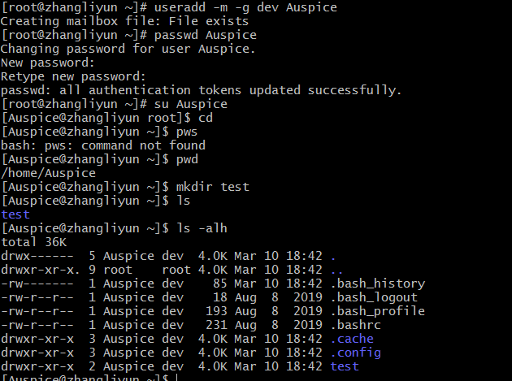

#### 查看用户信息
| 序号 |    命令     | 作用                       |
| :--: | :---------: | :------------------------- |
|  01  | id [用户名] | 查看用户UID和GID           |
|  02  |     who     | 查看当前所有登录的用户列表 |
|  03  |   whoami    | 查看当前登录用户的账户名   |

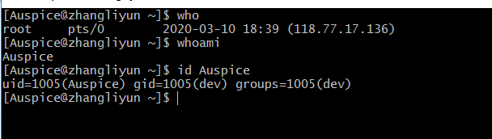

##### passwd文件
> */etc/passwd* 文件存放的是用户的信息

1. 用户名
2. 密码（x，表示加密的密钥）
3. UID（用户标识）
4. GID（组标识）
5. 用户全名或本地账号
6. 家目录
7. 登录使用的Shell，就是登录之后，使用的终端命令

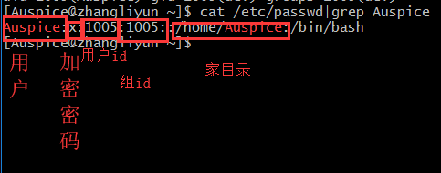

**id不加参数返回当前用户信息**
 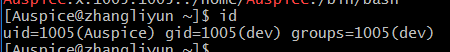

#### usermod
- *usermod* 设置 **用户** 的 **主组/附加组** 和 **登录Shell**
- **主组** ：新建用户时指定
- **附加组**：用于指定用户的附加权限

```
# 修改用户的主组(passwd 中的GID)
usermod -g 组 用户名

# 修改用户的附加组
usermod -G 组 用户名

# 修改用户的登录Shell
usermod -s /bin/bash
```

#### which
- */etc/passwd* 用于保存用户信息的文件
- */user/bin/passwd* 用于修改用户密码的程序

- *which* 查看执行命令所在的位置

```
which ls
# 输出
# /bin/ls

which useradd
# 输出
# /user/sbin/useradd
```

**bin和sbin**
- 绝大多数可执行文件都保存在 **/bin , /sbin, /user/bin, /user/sbin**
- **/bin (binary)** 是二进制执行文件目录
- **/sbin (system binary)** 系统管理员专用的二进制代码存放目录，主要用于系统管理

- **/user/bin(user commands for application)** 后期安装的软件
- **/user/sbin(super user commands for applications)** 超级用户的一些管理程序 

#### su切换用户身份
| 序号 |    命令     |          作用           | 说明                 |
| :--: | :---------: | :---------------------: | :------------------- |
|  01  | su - 用户名 | -切换用户，并且切换命令 | 可以切换到用户家目录 |
|  02  |    exit     |    退出当前登录账户     |                      |

- *su* 不接用户名，可以切换到 *root*

#### 修改文件权限
| 序号 | 命令  | 作用       |
| :--: | :---: | :--------- |
|  01  | chown | 修改拥有者 |
|  02  | chgrp | 修改组     |
|  03  | chmod | 修改权限   |

```
# 修改文件|目录拥有者
chown 拥有者用户名 文件名|目录

# 递归修改文件|目录的组
chgrp -R 组名 文件|目录

# 递归修改文件权限
chmod -R 755 文件名|目录名
```
- *chmod* 在设置权限时，可以简单使用三个数字分别对应 **拥有者/组** 和 **其他** 用户的权限
```
# 直接修改 文件|目录 的 读|写|可执行， 但是不能精确到 拥有者|组|其他
chomd +/-rwx 文件名|目录名
```


|      |      | 拥有者 |      |      |  组  |      |      | 其他 |      |
| :--: | :--: | :----: | :--: | :--: | :--: | :--: | :--: | :--: | ---- |
|  r   |  w   |   x    |  r   |  w   |  x   |  r   |  w   |  x   |      |
|  4   |  2   |   1    |  4   |  2   |  1   |  4   |  2   |  1   |      |

|  4   |  2   |  1   |  7   | rwx  |
| :--: | :--: | :--: | :--: | :--: |
|  4   |  2   |  0   |  6   | rw-  |
|  4   |  0   |  1   |  5   | r-x  |
|  4   |  0   |  0   |  4   | r--  |
|  0   |  2   |  1   |  3   | -2x  |
|  0   |  2   |  0   |  2   | -w-  |
|  0   |  0   |  1   |  1   | --x  |
|  0   |  0   |  0   |  0   | ---  |

### 系统信息
- 查看服务器上当前 **系统日期和时间 / 磁盘空间 / 占用情况 / 程序执行情况**

- 时间和日期
	- date
	- cat
- 磁盘和目录空间
	- df
	- du
- 进程信息
	- ps
	- top
	- kill

####  时间和日期
| 序号 | 命令 | 作用                                        |
| :--: | :--: | :------------------------------------------ |
|  01  | date | 查看系统时间                                |
|  02  | cal  | calendar 查看日历，-y选项可以查看一年的日历 |
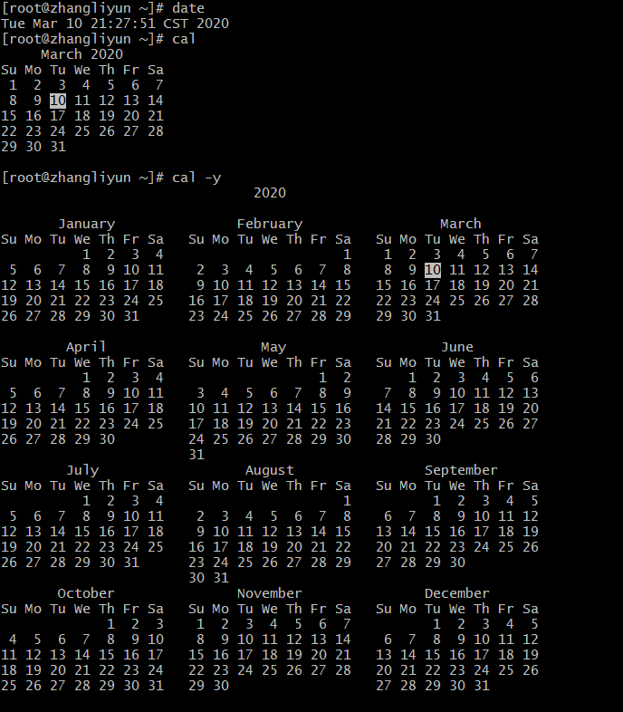


#### 磁盘信息
| 序号 |     命令      | 作用                            |
| :--: | :-----------: | :------------------------------ |
|  01  |     df -h     | disk free 显示磁盘剩余空间      |
|  02  | du -h[目录名] | disk usage 显示目录下的文件大小 |

- 选项说明
| 参数 | 含义                |
| :--: | :------------------ |
|  -h  | K为单位显示文件大小 |

#### 进程
- 当前正在执行的程序

| 序号 |         命令          | 作用                                                      |
| :--: | :-------------------: | :-------------------------------------------------------- |
|  01  |        ps aux         | process status 查看进程的详细状况 aux为选项  不需要加 *-* |
|  02  |          top          | 动态显示运行中的进程并排序                                |
|  03  | kill [-9] PID进程代号 | 终止指定代号的进程  [-9]表示强行终止                      |
> *ps* 默认只会显示当前用户通过终端启动的应用程序

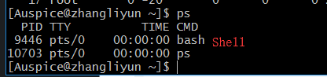


| 选项 | 含义                                     |
| :--: | :--------------------------------------- |
|  a   | 显示终端上的所有进程，包括其他用户的进程 |
|  u   | 显示进程的详细状态                       |
|  x   | 显示没有控制终端的进程                   |

- 使用 *kill* 命令时，最好只终止由当前用户开启的进程，不要终止以 *root* 身份开启的进程，否则系统崩溃
- 退出 *top* ，直接输入 *q*

### 其他命令
- 查找文件
	- find
- 软链接
	- ln
- 打包和压缩
	- tar
- 软件安装
	- apt-get

#### 查找文件
- *find* ，通常用来在 **特定的目录下搜索** 符合条件的文件

|           命令           | 作用                                          |
| :----------------------: | :-------------------------------------------- |
| find [路径] -name "*.py" | 查找指定路径下扩展名为 .py 的文件，包括子目录 |

- 如果省略路径，表示在当前文件夹下查找

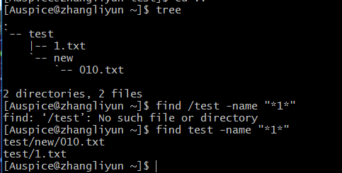

#### 软链接

|             命令              | 作用                                                 |
| :---------------------------: | :--------------------------------------------------- |
| ln -s 被链接的源文件 链接文件 | 建立文件的软链接，类似于 *Windows* 下的 **快捷方式** |

- 注意
- 1.没有 *-s* 选项建立的是一个 **硬链接文件**
	- 两个文件占用相同大小的空间
- 2.**源文件要使用绝对路径** ，不能使用相对路径，这样方便移动链接文件后，仍然能正常使用 

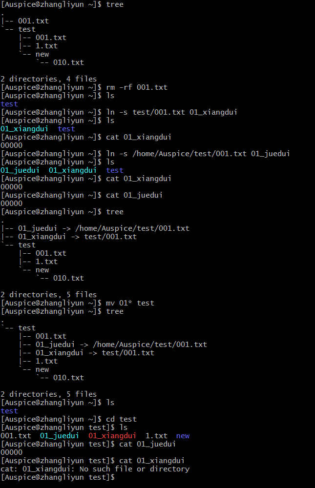

#### 硬链接
- 在使用 *ln* 创建链接时，如果没有 *-s* ,创建的是硬链接
- 与原文件无关，相当于 **副本**

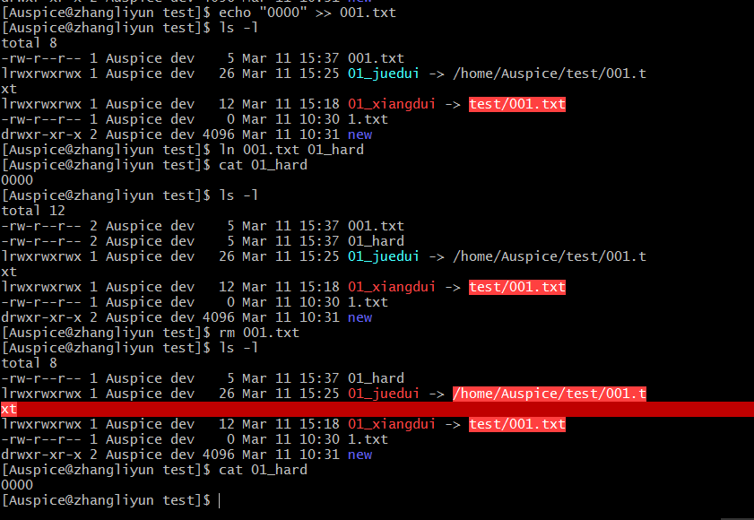

##### 软硬件链接区别
- 文件数据 和 文件名分开存储
- **软链接** 链接的是文件名
- **硬链接** 相当于文件别名

#### 打包压缩
- **Windows** 常用 *RAR*
- **Mac** 常用 *ZIP*
- **Linux** 常用 *tar.gz*

##### 打包/解包
- *tar* 把 **一系列文件** 打包到 **一个大文件中** ，也可以把一个 **打包的大文件恢复成一系列文件**

```
# 打包文件
tar -cvf 打包文件 .tar 被打包文件/路径

# 解包文件
tar -xvf 打包文件
```

| 选项 | 含义                                                    |
| :--: | :------------------------------------------------------ |
|  z   | 调用gzip,直接压缩                                       |
|  j   | 调用bz2,直接压缩                                        |
|  c   | 生成档案文件，创建打包文件                              |
|  x   | 解开档案文件                                            |
|  v   | 列出归档文件的详细过程,显示进度                         |
|  f   | 指定档案文件名称，f后跟的一定是 *.tat* 文件，必须在最后 |
|  C   | 指定路径                                                |

**步骤**
1. 将含有 *01* 的文件打包成一个 **.tar文件**
2. 新建 **tar目录**，并且将 *01.tar* 移动到 *tar* 目录下
3. 解包 *01.tar* 

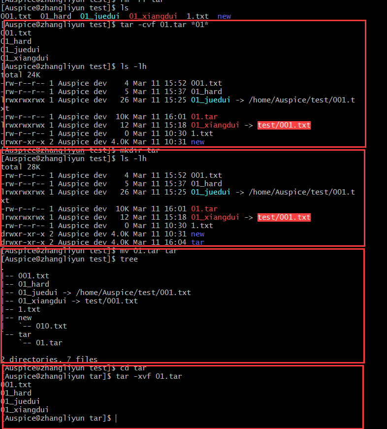

##### 压缩/解压缩

**gzip**
- *tar* 与 *gzip* 结合使用实现文件 **打包和压缩**
	- *tar* 只负责打包文件，但不压缩
	- 用 *gzip* 压缩 *tar* 打包后的文件，其扩展名为 *.tar.gz*

- 在 *tar* 命令中有一个选项 *-z* 可以调用 *gzip* ，从而可以方便的实现压缩和解压缩的功能

```
# 压缩文件
tar -zcvf 打包文件.tar.gz 被压缩文件/路径

# 解压缩文件
tar -zxvf 打包文件.tar.gz

# 解压缩到指定路径
tar -zxvf 打包文件.tar.gz -C 目标路径
```

| 选项 | 含义                                           |
| :--: | :--------------------------------------------- |
|  -C  | 解压缩到指定目录，注意：要解压缩的目录必须存在 |

```
# 压缩文件
tar -zcvf 打包文件.tar.gz 被压缩的文件/目录...

# 解压缩
tar -zxvf 打包文件.tar.gz

# 解压缩到指定路径
tar -zxvf 打包文件.tar.gz -C 目标路径
```

**步骤**
1. 压缩
2. 移动
3. 解压

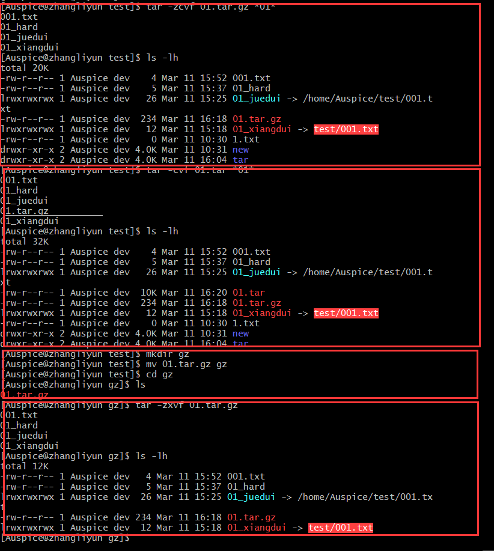

##### bzip2(two)
- *tar* 与 *bzip2* 命令结合可以使用实现文件 **打包和压缩**
	- *tar*  只负责打包文件，不压缩
	- 用 *bzip2* 压缩 *tar* 打包后的文件，其扩展名一般用 *xxx.tar.bz2*
- tar 中有 选项**-j** 可以调用 *bzip2* ，从而方便实现压缩和解压缩
- 命令格式
```
# 压缩文件
tar -jcvf 打包文件.tar.bz2 被压缩的文件/路径
# 解压缩文件
tar -jxvf 打包文件.tar.bz2
```

#### 软件安装
- **apt** 是 **Advanced Packaging Tool** ,Unbuntu下安装包管理工具
- **yum** 是 **Advanced Packaging Tool** ,CentOS下安装包管理工具 
- 可以在终端中方便 **安装/卸载/更新安装包**

```
# 安装软件
sudo yum install 软件包

# 卸载软件
sudo yum remove 软件包

# 更新已安装的包
sudo yum upgrade
```

#### 配置软件源
- 通过 **设置镜像源** ，选择一个访问更快的服务器，提供软件下载/安装服务
- 更换服务器之后，需要比较长的更新过程

> 所有服务器的内容是相同的（镜像），但根据所在位置不同，国内服务器速度通常快一些